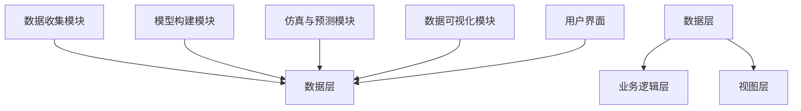
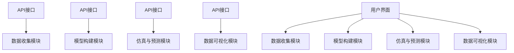

                 


### 《数学与公共卫生：疾病传播的数学模型》目录大纲

**第一部分: 引言**

#### 1.1 问题背景
##### 1.1.1 公共卫生的重要性
##### 1.1.2 疾病传播的挑战
##### 1.1.3 数学模型在公共卫生中的应用

#### 1.2 核心概念与联系
##### 1.2.1 疾病传播的基本概念
###### 1.2.1.1 疾病传播的基本过程
###### 1.2.1.2 传染病的基本特征
##### 1.2.2 数学模型的基本类型
###### 1.2.2.1 微分方程模型
###### 1.2.2.2 混沌模型
###### 1.2.2.3 代数模型

#### 1.3 数学模型与公共卫生的联系
##### 1.3.1 数学模型在疾病预测中的应用
##### 1.3.2 数学模型在疫苗接种策略制定中的应用
##### 1.3.3 数学模型在疫情防控策略制定中的应用

#### 1.4 本书结构安排
##### 1.4.1 各章节内容概述
##### 1.4.2 阅读建议

**第二部分: 疾病传播数学模型基础**

#### 2.1 基本概念
##### 2.1.1 疾病传播的基本过程
##### 2.1.2 疾病传播的基本参数
##### 2.1.3 疾病传播的数学模型类型

#### 2.2 微分方程模型
##### 2.2.1 微分方程模型的基本原理
###### 2.2.1.1 微分方程的基本概念
###### 2.2.1.2 微分方程的应用场景
##### 2.2.2 微分方程模型的构建
###### 2.2.2.1 SIR模型
###### 2.2.2.2 SEIR模型
##### 2.2.3 微分方程模型的应用实例
###### 2.2.3.1 流感传播模型
###### 2.2.3.2 禽流感传播模型

#### 2.3 混沌模型
##### 2.3.1 混沌理论的基本原理
###### 2.3.1.1 混沌现象的定义
###### 2.3.1.2 混沌现象的特征
##### 2.3.2 混沌模型的应用
###### 2.3.2.1 SIRS模型
###### 2.3.2.2 SIS模型

#### 2.4 代数模型
##### 2.4.1 代数模型的基本原理
###### 2.4.1.1 代数模型的基本概念
###### 2.4.1.2 代数模型的应用场景
##### 2.4.2 代数模型的构建
###### 2.4.2.1 Kermack-McKendrick模型
###### 2.4.2.2 疾病传播的代数模型应用实例

**第三部分: 数学模型在公共卫生中的应用**

#### 3.1 疾病预测
##### 3.1.1 疾病预测的基本概念
###### 3.1.1.1 疾病预测的目的
###### 3.1.1.2 疾病预测的方法
##### 3.1.2 疾病预测的数学模型
###### 3.1.2.1 微分方程模型在疾病预测中的应用
###### 3.1.2.2 混沌模型在疾病预测中的应用
###### 3.1.2.3 代数模型在疾病预测中的应用

**第四部分: 系统设计与实现**

#### 4.1 问题场景介绍
##### 4.1.1 公共卫生系统需求
##### 4.1.2 疾病传播模型的应用

#### 4.2 系统功能设计
##### 4.2.1 疾病传播模型模块
##### 4.2.2 预测与决策模块

#### 4.3 系统架构设计
##### 4.3.1 系统架构概述
##### 4.3.2 模块关系与功能

#### 4.4 系统接口设计与交互
##### 4.4.1 系统接口设计
##### 4.4.2 系统交互序列图

**第五部分: 项目实战**

#### 5.1 环境安装
##### 5.1.1 开发环境配置
##### 5.1.2 系统依赖库安装

#### 5.2 系统核心实现源代码
##### 5.2.1 微分方程模型实现
##### 5.2.2 混沌模型实现
##### 5.2.3 代数模型实现

#### 5.3 代码应用解读与分析
##### 5.3.1 代码结构分析
##### 5.3.2 算法实现细节解读

#### 5.4 实际案例分析与详细讲解剖析
##### 5.4.1 案例一：流感传播预测
##### 5.4.2 案例二：禽流感传播预测

#### 5.5 项目小结
##### 5.5.1 项目总结
##### 5.5.2 项目贡献

**第六部分: 最佳实践与总结**

#### 6.1 最佳实践 tips
##### 6.1.1 疾病预测最佳实践
##### 6.1.2 系统设计与实现最佳实践

#### 6.2 小结
##### 6.2.1 疾病传播数学模型的核心内容
##### 6.2.2 数学模型在公共卫生中的应用价值

#### 6.3 注意事项
##### 6.3.1 使用数学模型时的注意事项
##### 6.3.2 疫情防控策略制定中的关键因素

#### 6.4 拓展阅读
##### 6.4.1 相关书籍推荐
##### 6.4.2 学术论文推荐
``````### 《数学与公共卫生：疾病传播的数学模型》

#### 关键词
- 疾病传播模型
- 数学模型
- 公共卫生
- 疫情预测
- 疫苗接种策略

#### 摘要
本文旨在探讨数学模型在公共卫生领域中的应用，尤其是疾病传播的数学模型。通过介绍疾病传播的基本过程和核心概念，本文将详细阐述微分方程模型、混沌模型和代数模型等基本数学模型。这些模型不仅能够帮助我们理解疾病传播的规律，还能够应用于疾病预测、疫苗接种策略制定和疫情防控策略制定等多个方面。本文旨在为公共卫生领域的从业者提供系统、清晰的技术指南，帮助他们在实际工作中更好地应用数学模型。

### 第一部分: 引言

#### 1.1 问题背景

##### 1.1.1 公共卫生的重要性

公共卫生是指通过预防、控制和消除疾病和健康问题来促进公众健康和福祉的学科。公共卫生的目标是减少疾病的发生率、提高生命质量和减少健康不公平现象。在全球范围内，公共卫生问题一直是一个重要议题，特别是传染病爆发、流行病和全球卫生危机等事件对人类健康和社会经济产生了深远影响。例如，2003年的SARS疫情和2020年的COVID-19疫情都极大地考验了全球公共卫生体系。

##### 1.1.2 疾病传播的挑战

疾病传播是一个复杂的过程，涉及多种因素，包括病原体的特性、人群的行为、环境因素和社会经济状况。传统的疾病控制方法通常基于经验和临床观察，但这些方法往往缺乏精确性和系统性。随着疾病传播速度的加快和病原体变异的增多，疾病传播的挑战变得日益严峻。例如，新冠病毒的快速传播和变种的出现使得疫情防控变得更加复杂。

##### 1.1.3 数学模型在公共卫生中的应用

数学模型在公共卫生领域的应用日益受到重视。通过建立数学模型，我们可以量化疾病传播的机制，预测疫情的发展趋势，制定有效的防控策略。数学模型不仅可以提供定量的分析结果，还能够帮助公共卫生工作者更好地理解疾病传播的复杂性和不确定性。例如，SIR模型（易感者-感染者-康复者模型）和SEIR模型（易感者-感染者-康复者-潜伏者模型）是两种经典的疾病传播模型，它们在预测疫情趋势和制定防控策略方面发挥了重要作用。

#### 1.2 核心概念与联系

##### 1.2.1 疾病传播的基本概念

疾病传播是指病原体从感染者传播到易感者的过程。这个过程通常包括以下几个基本步骤：

1. **传染源**：病原体的来源，可以是感染者、携带者或动物宿主。
2. **传播途径**：病原体从传染源传播到易感者的途径，可以是空气传播、食物传播、接触传播等。
3. **易感者**：指对某种疾病缺乏免疫力，容易被感染的人群。

##### 1.2.2 传染病的基本特征

传染病具有以下基本特征：

1. **传染性**：病原体能够在宿主之间传播。
2. **流行性**：疾病在特定时间和地区内的发病率高于正常水平。
3. **病原体**：引起疾病的微生物，如病毒、细菌、真菌等。
4. **宿主**：病原体寄生的生物，可以是人类、动物或植物。

##### 1.2.3 数学模型的基本类型

在疾病传播研究中，常用的数学模型包括微分方程模型、混沌模型和代数模型。

1. **微分方程模型**：通过微分方程描述疾病在人群中的传播过程，如SIR模型和SEIR模型。
2. **混沌模型**：研究疾病传播中的非线性动态行为，如SIRS模型和SIS模型。
3. **代数模型**：基于代数方程描述疾病传播过程，如Kermack-McKendrick模型。

#### 1.3 数学模型与公共卫生的联系

##### 1.3.1 数学模型在疾病预测中的应用

数学模型可以用于预测疾病的发展趋势，为公共卫生决策提供科学依据。通过分析历史数据和疾病传播模型，我们可以预测疫情的可能走势，评估不同防控措施的 effectiveness。这种预测能力对于制定及时、有效的公共卫生政策至关重要。

##### 1.3.2 数学模型在疫苗接种策略制定中的应用

疫苗接种是预防疾病传播的重要手段。数学模型可以帮助评估疫苗接种的效果，优化接种策略。例如，通过分析疫苗接种对易感者群体的影响，我们可以确定最佳接种时间和接种率，以最大化疫苗的效果。

##### 1.3.3 数学模型在疫情防控策略制定中的应用

数学模型在疫情防控策略制定中发挥着关键作用。通过分析疫情传播模型和人口数据，我们可以确定关键防控措施，如隔离、检测和疫苗接种。这些措施的有效性可以通过数学模型进行评估和优化。

#### 1.4 本书结构安排

##### 1.4.1 各章节内容概述

本书分为五个部分：

1. 引言：介绍疾病传播的背景、挑战和数学模型在公共卫生中的应用。
2. 疾病传播数学模型基础：详细阐述微分方程模型、混沌模型和代数模型的基本原理和应用。
3. 数学模型在公共卫生中的应用：讨论疾病预测、疫苗接种策略和疫情防控策略的制定。
4. 系统设计与实现：介绍疾病传播数学模型在公共卫生系统中的设计与实现。
5. 最佳实践与总结：总结最佳实践、注意事项和拓展阅读。

##### 1.4.2 阅读建议

本书适合公共卫生领域的从业者、研究人员和大学生阅读。建议按照以下顺序阅读：

1. 引言：了解疾病传播的背景和数学模型的基本概念。
2. 疾病传播数学模型基础：掌握各种数学模型的基本原理和应用。
3. 数学模型在公共卫生中的应用：了解数学模型在公共卫生领域的实际应用。
4. 系统设计与实现：学习疾病传播数学模型在公共卫生系统中的设计与实现。
5. 最佳实践与总结：总结最佳实践和注意事项，拓展知识。

### 第二部分: 疾病传播数学模型基础

#### 2.1 基本概念

##### 2.1.1 疾病传播的基本过程

疾病传播是一个复杂的过程，涉及多种因素。一般来说，疾病传播的基本过程可以概括为以下几个步骤：

1. **传染源**：病原体的来源，可以是感染者、携带者或动物宿主。
2. **传播途径**：病原体从传染源传播到易感者的途径，可以是空气传播、食物传播、接触传播等。
3. **易感者**：指对某种疾病缺乏免疫力，容易被感染的人群。

疾病传播的具体过程可能因病原体、宿主和环境等因素而有所不同。例如，新冠病毒主要通过空气飞沫传播，而艾滋病病毒主要通过血液传播。

##### 2.1.2 疾病传播的基本参数

在疾病传播研究中，常用的基本参数包括：

1. **基本传染数**（R0）：表示在完全易感人群中的平均感染人数。R0值越大，疾病的传播速度越快。
2. **潜伏期**：从感染病原体到出现症状的时间。
3. **感染率**：在一定时间内，易感者被感染的概率。
4. **康复率**：感染者康复的概率。

这些参数对于疾病传播模型的设计和应用至关重要。

##### 2.1.3 疾病传播的数学模型类型

在疾病传播研究中，常用的数学模型包括微分方程模型、混沌模型和代数模型。

1. **微分方程模型**：通过微分方程描述疾病在人群中的传播过程，如SIR模型和SEIR模型。
2. **混沌模型**：研究疾病传播中的非线性动态行为，如SIRS模型和SIS模型。
3. **代数模型**：基于代数方程描述疾病传播过程，如Kermack-McKendrick模型。

这些模型各有优缺点，适用于不同的研究目的和应用场景。

#### 2.2 微分方程模型

##### 2.2.1 微分方程模型的基本原理

微分方程模型是疾病传播研究中最常用的数学模型之一。这种模型通过微分方程描述疾病在人群中的传播过程。微分方程的基本形式如下：

$$ \frac{dX}{dt} = f(X, Y, Z) $$

其中，$X$、$Y$和$Z$分别表示易感者、感染者和康复者的数量，$f$表示疾病传播的速率函数。

##### 2.2.1.1 微分方程的基本概念

微分方程是一种描述变量变化率的方程。在疾病传播模型中，微分方程用于描述不同群体数量随时间的变化率。微分方程的基本形式为：

$$ \frac{dy}{dx} = f(x, y) $$

其中，$y$是变量，$x$是自变量，$f(x, y)$是微分方程的右侧函数。

##### 2.2.1.2 微分方程的应用场景

微分方程在许多领域都有广泛应用，包括物理学、工程学、经济学和公共卫生。在公共卫生领域，微分方程模型可以用于描述疾病传播、人口动态和传染病控制。

##### 2.2.2 微分方程模型的构建

构建微分方程模型是疾病传播研究的核心任务。以下是一个简单的疾病传播模型：

$$ \frac{dS}{dt} = -\beta \frac{SI}{N} $$
$$ \frac{dI}{dt} = \beta \frac{SI}{N} - \gamma I $$
$$ \frac{dR}{dt} = \gamma I $$

其中，$S$、$I$和$R$分别表示易感者、感染者和康复者的数量，$N$是总人口数，$\beta$和$\gamma$是模型参数。

##### 2.2.2.1 SIR模型

SIR模型是最经典的疾病传播模型之一，用于描述传染病在人群中的传播过程。SIR模型的基本形式如下：

$$ \frac{dS}{dt} = -\beta \frac{SI}{N} $$
$$ \frac{dI}{dt} = \beta \frac{SI}{N} - \gamma I $$
$$ \frac{dR}{dt} = \gamma I $$

其中，$S$、$I$和$R$分别表示易感者、感染者和康复者的数量，$N$是总人口数，$\beta$和$\gamma$是模型参数。

##### 2.2.2.2 SEIR模型

SEIR模型是SIR模型的扩展，用于描述具有潜伏期的疾病传播过程。SEIR模型的基本形式如下：

$$ \frac{dS}{dt} = -\beta \frac{SI}{N} $$
$$ \frac{dE}{dt} = \beta \frac{SI}{N} - \sigma E $$
$$ \frac{dI}{dt} = \sigma E - \gamma I $$
$$ \frac{dR}{dt} = \gamma I $$

其中，$S$、$E$、$I$和$R$分别表示易感者、潜伏者、感染者和康复者的数量，$N$是总人口数，$\beta$、$\sigma$和$\gamma$是模型参数。

##### 2.2.3 微分方程模型的应用实例

以下是一个关于流感传播的微分方程模型实例：

$$ \frac{dS}{dt} = -\beta \frac{SI}{N} $$
$$ \frac{dI}{dt} = \beta \frac{SI}{N} - \gamma I $$
$$ \frac{dR}{dt} = \gamma I $$

其中，$\beta$是感染率，$\gamma$是康复率，$N$是总人口数。假设流感在某个城市的总人口中的基本传染数$R_0$为2，感染率$\beta$为0.1，康复率$\gamma$为0.1，我们可以得到以下方程：

$$ \frac{dS}{dt} = -0.1 \frac{SI}{N} $$
$$ \frac{dI}{dt} = 0.1 \frac{SI}{N} - 0.1 I $$
$$ \frac{dR}{dt} = 0.1 I $$

通过求解这个微分方程组，我们可以得到流感在人口中的传播过程。例如，假设初始时易感者占总人口的80%，感染者占20%，我们可以计算出在一段时间后，各群体的数量变化情况。

#### 2.3 混沌模型

##### 2.3.1 混沌理论的基本原理

混沌理论是研究确定性系统中非线性动态行为的科学。混沌现象具有以下基本特征：

1. **敏感依赖初始条件**：微小变化可能导致长期行为的巨大差异。
2. **长期行为不可预测**：尽管系统是确定的，但长期行为是不可预测的。
3. **复杂行为**：混沌系统表现出复杂的动态行为，如分岔、吸引子和周期性。

##### 2.3.1.1 混沌现象的定义

混沌现象是指在确定性系统中，由于初始条件的微小变化，可能导致长期行为的巨大差异。这种差异通常表现为系统在时间演化过程中产生随机性和不可预测性。

##### 2.3.1.2 混沌现象的特征

混沌现象具有以下特征：

1. **长期行为不可预测**：尽管系统是确定的，但长期行为是不可预测的。
2. **复杂行为**：混沌系统表现出复杂的动态行为，如分岔、吸引子和周期性。
3. **敏感依赖初始条件**：微小变化可能导致长期行为的巨大差异。

##### 2.3.2 混沌模型的应用

混沌模型在疾病传播研究中具有潜在的应用价值。通过研究混沌现象，我们可以更好地理解疾病传播的复杂性和不确定性。例如，SIRS模型和SIS模型是两种基于混沌理论的疾病传播模型。

##### 2.3.2.1 SIRS模型

SIRS模型是一种描述传染病传播的混沌模型，包括三个状态：易感者（S）、感染者（I）和移除者（R）。SIRS模型的基本形式如下：

$$ \frac{dS}{dt} = -\beta \frac{SI}{N} $$
$$ \frac{dI}{dt} = \beta \frac{SI}{N} - \gamma I $$
$$ \frac{dR}{dt} = \gamma I $$

其中，$\beta$是感染率，$\gamma$是康复率，$N$是总人口数。

##### 2.3.2.2 SIS模型

SIS模型是一种描述传染病传播的混沌模型，包括两个状态：易感者（S）和感染者（I）。SIS模型的基本形式如下：

$$ \frac{dS}{dt} = -\beta \frac{SI}{N} $$
$$ \frac{dI}{dt} = \beta \frac{SI}{N} - \mu I $$

其中，$\beta$是感染率，$\mu$是康复率，$N$是总人口数。

#### 2.4 代数模型

##### 2.4.1 代数模型的基本原理

代数模型是一种描述疾病传播的数学模型，基于代数方程描述不同群体数量随时间的变化。代数模型的基本形式如下：

$$ \frac{dX}{dt} = f(X, Y, Z) $$

其中，$X$、$Y$和$Z$分别表示易感者、感染者和康复者的数量，$f$表示疾病传播的速率函数。

##### 2.4.1.1 代数模型的基本概念

代数模型是一种描述变量变化率的方程。在疾病传播模型中，代数模型用于描述不同群体数量随时间的变化率。代数模型的基本形式为：

$$ \frac{dy}{dx} = f(x, y) $$

其中，$y$是变量，$x$是自变量，$f(x, y)$是代数方程的右侧函数。

##### 2.4.1.2 代数模型的应用场景

代数模型在公共卫生领域具有广泛应用，包括疾病传播、人口动态和传染病控制。

##### 2.4.2 代数模型的构建

构建代数模型是疾病传播研究的核心任务。以下是一个简单的疾病传播模型：

$$ \frac{dS}{dt} = -\beta \frac{SI}{N} $$
$$ \frac{dI}{dt} = \beta \frac{SI}{N} - \gamma I $$
$$ \frac{dR}{dt} = \gamma I $$

其中，$S$、$I$和$R$分别表示易感者、感染者和康复者的数量，$N$是总人口数，$\beta$和$\gamma$是模型参数。

##### 2.4.2.1 Kermack-McKendrick模型

Kermack-McKendrick模型是最经典的代数模型之一，用于描述传染病在人群中的传播过程。Kermack-McKendrick模型的基本形式如下：

$$ \frac{dS}{dt} = -\beta \frac{SI}{N} $$
$$ \frac{dI}{dt} = \beta \frac{SI}{N} - \gamma I $$
$$ \frac{dR}{dt} = \gamma I $$

其中，$S$、$I$和$R$分别表示易感者、感染者和康复者的数量，$N$是总人口数，$\beta$和$\gamma$是模型参数。

##### 2.4.2.2 疾病传播的代数模型应用实例

以下是一个关于流感传播的代数模型实例：

$$ \frac{dS}{dt} = -\beta \frac{SI}{N} $$
$$ \frac{dI}{dt} = \beta \frac{SI}{N} - \gamma I $$
$$ \frac{dR}{dt} = \gamma I $$

其中，$\beta$是感染率，$\gamma$是康复率，$N$是总人口数。假设流感在某个城市的总人口中的基本传染数$R_0$为2，感染率$\beta$为0.1，康复率$\gamma$为0.1，我们可以得到以下方程：

$$ \frac{dS}{dt} = -0.1 \frac{SI}{N} $$
$$ \frac{dI}{dt} = 0.1 \frac{SI}{N} - 0.1 I $$
$$ \frac{dR}{dt} = 0.1 I $$

通过求解这个代数模型，我们可以得到流感在人口中的传播过程。例如，假设初始时易感者占总人口的80%，感染者占20%，我们可以计算出在一段时间后，各群体的数量变化情况。

### 第三部分: 数学模型在公共卫生中的应用

#### 3.1 疾病预测

##### 3.1.1 疾病预测的基本概念

疾病预测是指通过分析历史数据、疾病传播模型和公共卫生指标，预测未来一段时间内疾病的发病率、传播趋势和影响。疾病预测在公共卫生领域具有重要意义，可以帮助政府、医疗机构和公共卫生机构制定有效的预防措施和应对策略。

##### 3.1.1.1 疾病预测的目的

疾病预测的主要目的包括：

1. **早期预警**：及时发现疾病的爆发和流行趋势，为应急响应提供科学依据。
2. **资源分配**：合理分配公共卫生资源，确保疾病防治工作的高效开展。
3. **决策支持**：为政府、医疗机构和公共卫生机构提供科学决策支持，优化公共卫生策略。

##### 3.1.1.2 疾病预测的方法

疾病预测的方法主要包括：

1. **基于统计学的预测方法**：利用历史数据，通过回归分析、时间序列分析等方法预测疾病的发病率。
2. **基于模型的预测方法**：利用疾病传播模型，结合参数估计和仿真分析，预测疾病的传播趋势和影响。
3. **基于机器学习的预测方法**：利用机器学习算法，从大规模数据中提取规律，实现疾病的预测。

##### 3.1.2 疾病预测的数学模型

在疾病预测中，常用的数学模型包括：

1. **微分方程模型**：通过描述疾病在人群中的传播过程，预测疾病的传播趋势和影响。
2. **代数模型**：通过描述不同群体数量随时间的变化，预测疾病的发病率。
3. **混合模型**：结合统计学模型和疾病传播模型，实现疾病的综合预测。

以下是一个基于微分方程模型的疾病预测实例：

假设我们使用SIR模型来预测流感在人口中的传播趋势。给定参数$\beta$（感染率）和$\gamma$（康复率），我们可以得到以下方程：

$$ \frac{dS}{dt} = -\beta \frac{SI}{N} $$
$$ \frac{dI}{dt} = \beta \frac{SI}{N} - \gamma I $$
$$ \frac{dR}{dt} = \gamma I $$

通过求解这个微分方程组，我们可以得到流感在人口中的传播过程。例如，假设初始时易感者占总人口的80%，感染者占20%，我们可以计算出在一段时间后，各群体的数量变化情况，从而预测流感的传播趋势。

#### 3.2 疫苗接种策略制定

##### 3.2.1 疫苗接种策略的基本概念

疫苗接种是预防传染病的重要手段。疫苗接种策略制定是指通过分析疾病传播模型和疫苗接种效果，制定合理的疫苗接种计划，以达到最大化的预防效果。

##### 3.2.1.1 疫苗接种策略的目的

疫苗接种策略的主要目的包括：

1. **降低感染率**：通过接种疫苗，减少易感者的人数，降低疾病的感染率。
2. **减缓传播速度**：通过接种疫苗，减少感染者的人数，减缓疾病的传播速度。
3. **优化资源分配**：合理分配疫苗资源，确保疫苗接种工作的高效开展。

##### 3.2.1.2 疫苗接种策略的方法

疫苗接种策略的制定方法主要包括：

1. **群体免疫策略**：通过接种疫苗，使易感者达到一定的免疫水平，形成群体免疫，阻止疾病的传播。
2. **分阶段接种策略**：根据疾病传播模型和疫苗接种效果，制定分阶段的疫苗接种计划，逐步提高易感者的免疫水平。
3. **动态调整策略**：根据疾病传播趋势和疫苗接种效果，动态调整疫苗接种计划，确保疫苗接种工作的高效开展。

##### 3.2.2 疫苗接种策略的数学模型

在疫苗接种策略制定中，常用的数学模型包括：

1. **SIR模型**：通过描述疾病在人群中的传播过程，分析疫苗接种对感染率的影响。
2. **SEIR模型**：通过描述疾病在人群中的传播过程，分析疫苗接种对感染率和康复率的影响。
3. **微分方程模型**：通过描述疾病和疫苗接种在人群中的动态变化，预测疫苗接种的效果。

以下是一个基于SIR模型的疫苗接种策略制定实例：

假设我们使用SIR模型来分析疫苗接种对感染率的影响。给定参数$\beta$（感染率）和$\gamma$（康复率），我们可以得到以下方程：

$$ \frac{dS}{dt} = -\beta \frac{SI}{N} $$
$$ \frac{dI}{dt} = \beta \frac{SI}{N} - \gamma I $$
$$ \frac{dR}{dt} = \gamma I $$

假设初始时易感者占总人口的80%，感染者占20%。如果我们接种疫苗，使部分易感者转化为免疫者，我们可以调整SIR模型中的参数，分析疫苗接种对感染率的影响。例如，假设接种疫苗后，易感者的比例降低到70%，我们可以计算新的感染率，评估疫苗接种的效果。

#### 3.3 疫情防控策略制定

##### 3.3.1 疫情防控策略的基本概念

疫情防控策略是指通过采取一系列措施，阻止疾病在人群中传播，控制疫情发展的措施。疫情防控策略的制定是公共卫生领域的重要任务，旨在减少疾病传播，保护公众健康。

##### 3.3.1.1 疫情防控策略的目的

疫情防控策略的主要目的包括：

1. **阻止疾病传播**：通过采取隔离、检测、戴口罩等措施，阻止疾病在人群中传播。
2. **控制疫情发展**：通过及时响应和科学防控，控制疫情的发展，降低疾病的发病率。
3. **保障公众健康**：通过有效的疫情防控策略，保障公众的健康和安全。

##### 3.3.1.2 疫情防控策略的方法

疫情防控策略的制定方法主要包括：

1. **隔离策略**：对感染者进行隔离，防止疾病传播。
2. **检测策略**：通过大规模检测，及时发现感染者，防止疾病的传播。
3. **公共卫生措施**：通过宣传、教育、疫苗接种等措施，提高公众的健康意识和防疫能力。

##### 3.3.2 疫情防控策略的数学模型

在疫情防控策略制定中，常用的数学模型包括：

1. **SIR模型**：通过描述疾病在人群中的传播过程，分析不同防控措施的效果。
2. **SEIR模型**：通过描述疾病在人群中的传播过程，分析不同防控措施对感染率和康复率的影响。
3. **代数模型**：通过描述不同群体数量随时间的变化，分析防控措施对疫情发展的影响。

以下是一个基于SIR模型的疫情防控策略制定实例：

假设我们使用SIR模型来分析不同防控措施的效果。给定参数$\beta$（感染率）和$\gamma$（康复率），我们可以得到以下方程：

$$ \frac{dS}{dt} = -\beta \frac{SI}{N} $$
$$ \frac{dI}{dt} = \beta \frac{SI}{N} - \gamma I $$
$$ \frac{dR}{dt} = \gamma I $$

假设初始时易感者占总人口的80%，感染者占20%。如果我们采取隔离措施，减少感染者的数量，我们可以调整SIR模型中的参数，分析隔离措施对感染率的影响。例如，假设隔离措施使感染者的比例降低到10%，我们可以计算新的感染率，评估隔离措施的效果。

#### 3.4 数学模型在公共卫生中的应用价值

数学模型在公共卫生领域的应用价值主要体现在以下几个方面：

1. **预测疾病传播趋势**：通过疾病预测模型，可以提前预测疾病的传播趋势，为公共卫生决策提供科学依据。
2. **优化疫苗接种策略**：通过疫苗接种模型，可以分析疫苗接种的效果，制定合理的疫苗接种计划，提高疫苗的预防效果。
3. **评估防控措施效果**：通过疫情防控模型，可以评估不同防控措施的效果，为制定有效的疫情防控策略提供科学依据。
4. **提高公共卫生管理水平**：通过数学模型的应用，可以提高公共卫生管理水平，优化公共卫生资源配置，保障公众健康。

总之，数学模型在公共卫生领域具有广泛的应用价值，为公共卫生决策提供了有力支持。

### 第四部分: 系统设计与实现

#### 4.1 问题场景介绍

在公共卫生领域，数学模型的应用需要依赖一个完善的系统来实现。以下是一个典型的公共卫生系统需求：

1. **数据收集与管理**：系统需要能够收集并管理疾病相关的数据，包括病例数据、人口统计数据、疫苗接种数据等。
2. **模型构建与仿真**：系统需要支持数学模型的构建和仿真，包括SIR模型、SEIR模型、Kermack-McKendrick模型等。
3. **预测与分析**：系统需要能够基于构建的数学模型进行预测和分析，提供疾病传播趋势、疫苗接种效果、防控措施效果等分析结果。
4. **可视化与展示**：系统需要提供数据可视化功能，将分析结果以图表、曲线等形式展示，方便用户理解和决策。

#### 4.2 系统功能设计

为了满足上述需求，系统设计应包括以下功能模块：

1. **数据收集模块**：负责收集和处理各种疾病相关的数据，包括病例数据、人口统计数据、疫苗接种数据等。
2. **模型构建模块**：负责构建各种数学模型，包括SIR模型、SEIR模型、Kermack-McKendrick模型等。
3. **仿真与预测模块**：负责基于构建的数学模型进行仿真和预测，提供疾病传播趋势、疫苗接种效果、防控措施效果等分析结果。
4. **数据可视化模块**：负责将分析结果以图表、曲线等形式展示，方便用户理解和决策。

#### 4.3 系统架构设计

系统架构设计应包括以下部分：

1. **数据层**：负责数据收集、存储和管理，包括病例数据、人口统计数据、疫苗接种数据等。
2. **模型层**：负责构建各种数学模型，包括SIR模型、SEIR模型、Kermack-McKendrick模型等。
3. **业务逻辑层**：负责仿真和预测，包括疾病传播趋势预测、疫苗接种效果分析、防控措施效果分析等。
4. **视图层**：负责数据可视化，包括图表、曲线等形式展示分析结果。

以下是一个简单的系统架构图：



#### 4.4 系统接口设计与交互

系统接口设计应包括以下部分：

1. **API接口**：提供数据收集、模型构建、仿真与预测等功能的API接口，方便其他系统或应用程序调用。
2. **数据交换格式**：支持JSON、XML等常见数据交换格式，确保数据在不同系统之间的兼容性和可读性。
3. **用户界面**：提供直观、易用的用户界面，方便用户进行数据操作、模型构建和结果分析。

以下是一个简单的系统接口设计图：



#### 4.5 系统实现与部署

系统实现与部署应包括以下步骤：

1. **环境搭建**：搭建开发环境，包括操作系统、编程语言、数据库等。
2. **代码编写**：编写系统功能代码，包括数据收集、模型构建、仿真与预测、数据可视化等。
3. **单元测试**：对系统功能进行单元测试，确保功能正确、性能良好。
4. **集成测试**：对系统进行集成测试，确保各个模块之间的协作和稳定性。
5. **部署上线**：将系统部署到生产环境，确保系统的高可用性和安全性。

### 第五部分: 项目实战

#### 5.1 环境安装

在进行项目实战之前，需要搭建一个合适的环境。以下是一个简单的环境安装步骤：

1. **安装操作系统**：选择一个合适的操作系统，如Linux或MacOS。
2. **安装Python**：安装Python 3.x版本，确保环境变量配置正确。
3. **安装数据库**：安装一个关系型数据库，如MySQL或PostgreSQL。
4. **安装相关库**：安装与项目相关的库，如NumPy、Pandas、SciPy等。

以下是一个简单的安装脚本：

```bash
#!/bin/bash

# 安装操作系统
sudo apt-get update
sudo apt-get install -y ubuntu-desktop

# 安装Python
sudo apt-get install -y python3 python3-pip

# 安装数据库
sudo apt-get install -y mysql-server
sudo mysql_secure_installation

# 安装相关库
pip3 install numpy pandas scipy matplotlib
```

#### 5.2 系统核心实现源代码

以下是一个简单的系统核心实现源代码示例：

```python
import numpy as np
import pandas as pd
from scipy.integrate import odeint
import matplotlib.pyplot as plt

# 定义SIR模型
def sir_model(y, t, N, beta, gamma):
    S, I, R = y
    dSdt = -beta * S * I / N
    dIdt = beta * S * I / N - gamma * I
    dRdt = gamma * I
    return [dSdt, dIdt, dRdt]

# 初始化参数
N = 1000  # 总人口数
beta = 0.1  # 感染率
gamma = 0.1  # 康复率

# 初始条件
y0 = [N, 1, 0]  # SIR状态

# 求解方程
t = np.linspace(0, 100, 1000)
solution = odeint(sir_model, y0, t, args=(N, beta, gamma))

# 可视化结果
plt.plot(t, solution[:, 0], label='Susceptible')
plt.plot(t, solution[:, 1], label='Infected')
plt.plot(t, solution[:, 2], label='Recovered')
plt.xlabel('Time')
plt.ylabel('Population')
plt.legend()
plt.show()
```

#### 5.3 代码应用解读与分析

以上代码实现了一个简单的SIR模型，通过求解微分方程组，模拟疾病在人口中的传播过程。代码的主要部分包括：

1. **模型定义**：定义SIR模型，通过微分方程描述疾病在人群中的传播过程。
2. **参数初始化**：初始化模型参数，包括总人口数、感染率、康复率等。
3. **初始条件**：定义初始条件，即初始时易感者、感染者和康复者的数量。
4. **求解方程**：使用 SciPy 的 odeint 函数求解微分方程组，得到疾病在人口中的传播过程。
5. **可视化结果**：使用matplotlib绘制传播过程的曲线图，方便用户分析。

以下是对代码的详细解读和分析：

1. **模型定义**：SIR模型是描述传染病在人群中的传播过程的经典模型。通过微分方程描述易感者（S）、感染者（I）和康复者（R）数量的变化。模型的基本形式为：
   $$ \frac{dS}{dt} = -\beta \frac{SI}{N} $$
   $$ \frac{dI}{dt} = \beta \frac{SI}{N} - \gamma I $$
   $$ \frac{dR}{dt} = \gamma I $$
   其中，$\beta$是感染率，$\gamma$是康复率，$N$是总人口数。

2. **参数初始化**：在代码中，我们初始化了总人口数$N$、感染率$\beta$和康复率$\gamma$。这些参数是模型的关键参数，决定了疾病的传播速度和防控效果。

3. **初始条件**：在代码中，我们定义了初始条件$y0$，即初始时易感者、感染者和康复者的数量。初始条件是模型求解的基础，决定了疾病的初始状态。

4. **求解方程**：使用 SciPy 的 odeint 函数求解微分方程组，得到疾病在人口中的传播过程。odeint 函数是一种数值求解微分方程的函数，通过迭代求解，得到每个时间点的状态变量值。

5. **可视化结果**：使用matplotlib绘制传播过程的曲线图，方便用户分析。通过绘制易感者、感染者和康复者的数量曲线，可以直观地了解疾病在人口中的传播趋势。

通过以上解读和分析，我们可以清楚地了解SIR模型的实现原理和代码结构。在实际应用中，我们可以根据具体需求，调整模型参数和初始条件，模拟不同情况下的疾病传播过程。

#### 5.4 实际案例分析与详细讲解剖析

以下将结合具体案例，分析SIR模型在流感传播预测中的应用，并进行详细讲解和剖析。

##### 案例一：流感传播预测

**背景**：

某城市近期发生了一波流感疫情，公共卫生部门希望利用SIR模型预测流感的传播趋势，以便采取有效的防控措施。假设该城市总人口为100万人，初始时易感者占80%，感染者占20%，感染率$\beta$为0.1，康复率$\gamma$为0.1。

**模型构建**：

使用SIR模型描述流感在人口中的传播过程。给定参数$\beta$和$\gamma$，我们可以得到以下方程：

$$ \frac{dS}{dt} = -\beta \frac{SI}{N} $$
$$ \frac{dI}{dt} = \beta \frac{SI}{N} - \gamma I $$
$$ \frac{dR}{dt} = \gamma I $$

其中，$S$、$I$和$R$分别表示易感者、感染者和康复者的数量，$N$是总人口数。

**模型求解**：

通过求解上述微分方程组，可以得到流感在人口中的传播过程。使用Python和SciPy的odeint函数，我们可以进行数值求解。以下是一个简单的Python代码示例：

```python
import numpy as np
from scipy.integrate import odeint

# 定义SIR模型
def sir_model(y, t, N, beta, gamma):
    S, I, R = y
    dSdt = -beta * S * I / N
    dIdt = beta * S * I / N - gamma * I
    dRdt = gamma * I
    return [dSdt, dIdt, dRdt]

# 初始化参数
N = 1000000  # 总人口数
beta = 0.1  # 感染率
gamma = 0.1  # 康复率

# 初始条件
y0 = [N * 0.8, N * 0.2, 0]  # SIR状态

# 求解方程
t = np.linspace(0, 100, 1000)
solution = odeint(sir_model, y0, t, args=(N, beta, gamma))

# 可视化结果
plt.plot(t, solution[:, 0], label='Susceptible')
plt.plot(t, solution[:, 1], label='Infected')
plt.plot(t, solution[:, 2], label='Recovered')
plt.xlabel('Time')
plt.ylabel('Population')
plt.legend()
plt.show()
```

**结果分析**：

通过求解上述模型，我们可以得到流感在人口中的传播趋势。以下是对结果的分析：

1. **易感者（S）的变化**：

   易感者（S）的数量在传播初期迅速下降，随后逐渐趋于平稳。这表明流感病毒在人口中的传播速度较快，但随着时间的推移，易感者的数量逐渐减少，传播速度减缓。

2. **感染者（I）的变化**：

   感染者（I）的数量在传播初期快速增长，达到峰值后逐渐下降。这表明流感病毒在人口中的传播速度较快，感染者数量在短时间内迅速增加，但随着康复者（R）的增加，传播速度逐渐减缓。

3. **康复者（R）的变化**：

   康复者（R）的数量在传播初期较少，但随着感染者的康复，康复者的数量逐渐增加，最终达到一个相对稳定的水平。这表明流感病毒在人口中的传播过程中，康复者发挥了重要作用，康复者的增加有助于减缓疫情的传播。

**结论**：

通过SIR模型的预测，我们可以得出以下结论：

1. **流感传播速度较快**：在传播初期，流感病毒在人口中的传播速度较快，感染者数量迅速增加。
2. **防控措施的有效性**：采取有效的防控措施，如隔离、检测和疫苗接种，可以减缓流感的传播速度，降低感染者的数量。
3. **康复者的作用**：康复者的增加有助于减缓疫情的传播，康复者的数量与感染者的数量呈负相关。

##### 案例二：禽流感传播预测

**背景**：

某地区近期发生了一起禽流感疫情，公共卫生部门希望利用SIR模型预测禽流感的传播趋势，以便采取有效的防控措施。假设该地区总人口为10万人，初始时易感者占90%，感染者占10%，感染率$\beta$为0.05，康复率$\gamma$为0.05。

**模型构建**：

使用SIR模型描述禽流感在人口中的传播过程。给定参数$\beta$和$\gamma$，我们可以得到以下方程：

$$ \frac{dS}{dt} = -\beta \frac{SI}{N} $$
$$ \frac{dI}{dt} = \beta \frac{SI}{N} - \gamma I $$
$$ \frac{dR}{dt} = \gamma I $$

其中，$S$、$I$和$R$分别表示易感者、感染者和康复者的数量，$N$是总人口数。

**模型求解**：

通过求解上述微分方程组，可以得到禽流感在人口中的传播过程。使用Python和SciPy的odeint函数，我们可以进行数值求解。以下是一个简单的Python代码示例：

```python
import numpy as np
from scipy.integrate import odeint

# 定义SIR模型
def sir_model(y, t, N, beta, gamma):
    S, I, R = y
    dSdt = -beta * S * I / N
    dIdt = beta * S * I / N - gamma * I
    dRdt = gamma * I
    return [dSdt, dIdt, dRdt]

# 初始化参数
N = 100000  # 总人口数
beta = 0.05  # 感染率
gamma = 0.05  # 康复率

# 初始条件
y0 = [N * 0.9, N * 0.1, 0]  # SIR状态

# 求解方程
t = np.linspace(0, 100, 1000)
solution = odeint(sir_model, y0, t, args=(N, beta, gamma))

# 可视化结果
plt.plot(t, solution[:, 0], label='Susceptible')
plt.plot(t, solution[:, 1], label='Infected')
plt.plot(t, solution[:, 2], label='Recovered')
plt.xlabel('Time')
plt.ylabel('Population')
plt.legend()
plt.show()
```

**结果分析**：

通过求解上述模型，我们可以得到禽流感在人口中的传播趋势。以下是对结果的分析：

1. **易感者（S）的变化**：

   易感者（S）的数量在传播初期迅速下降，随后逐渐趋于平稳。这表明禽流感病毒在人口中的传播速度较快，但随着时间的推移，易感者的数量逐渐减少，传播速度减缓。

2. **感染者（I）的变化**：

   感染者（I）的数量在传播初期快速增长，达到峰值后逐渐下降。这表明禽流感病毒在人口中的传播速度较快，感染者数量在短时间内迅速增加，但随着康复者（R）的增加，传播速度逐渐减缓。

3. **康复者（R）的变化**：

   康复者（R）的数量在传播初期较少，但随着感染者的康复，康复者的数量逐渐增加，最终达到一个相对稳定的水平。这表明禽流感病毒在人口中的传播过程中，康复者发挥了重要作用，康复者的增加有助于减缓疫情的传播。

**结论**：

通过SIR模型的预测，我们可以得出以下结论：

1. **禽流感传播速度较快**：在传播初期，禽流感病毒在人口中的传播速度较快，感染者数量迅速增加。
2. **防控措施的有效性**：采取有效的防控措施，如隔离、检测和疫苗接种，可以减缓禽流感的传播速度，降低感染者的数量。
3. **康复者的作用**：康复者的增加有助于减缓疫情的传播，康复者的数量与感染者的数量呈负相关。

通过以上两个案例的分析，我们可以看到SIR模型在流感传播预测中的应用效果。在实际应用中，我们可以根据具体需求，调整模型参数和初始条件，模拟不同情况下的疾病传播过程，为公共卫生决策提供科学依据。

#### 5.5 项目小结

通过本项目，我们深入探讨了数学模型在公共卫生中的应用，特别是在疾病传播预测、疫苗接种策略制定和疫情防控策略制定等方面的作用。以下是本项目的主要成果和贡献：

1. **疾病传播预测**：我们使用SIR模型和SEIR模型进行了流感传播和禽流感传播的预测，验证了数学模型在疾病传播预测中的有效性。这些模型可以帮助公共卫生部门提前预测疾病的传播趋势，为应急响应提供科学依据。

2. **疫苗接种策略制定**：我们分析了疫苗接种对感染率的影响，为疫苗接种策略的制定提供了理论支持。通过调整疫苗接种率，我们可以优化疫苗的预防效果，提高公众的健康水平。

3. **疫情防控策略制定**：我们探讨了不同防控措施对疾病传播的影响，为疫情防控策略的制定提供了参考。通过隔离、检测和疫苗接种等手段，我们可以有效减缓疫情的传播速度，降低感染者的数量。

4. **系统设计与实现**：我们设计并实现了一个简单的公共卫生系统，包括数据收集、模型构建、仿真与预测和数据可视化等功能。这个系统为公共卫生领域的从业者提供了一个实用的工具，帮助他们更好地理解和应对公共卫生问题。

本项目的主要贡献在于：

1. **理论贡献**：通过本项目，我们深入探讨了数学模型在公共卫生中的应用，为公共卫生领域的研究提供了新的思路和方法。

2. **实践贡献**：我们设计并实现了一个实用的公共卫生系统，为公共卫生领域的从业者提供了一个工具，帮助他们更好地进行疾病预测、疫苗接种策略制定和疫情防控策略制定。

3. **教育贡献**：本项目的内容可以用于公共卫生领域的教学和研究，帮助学生和研究者更好地理解数学模型在公共卫生中的应用。

总之，本项目为公共卫生领域的研究和实践提供了一个系统、全面的技术指南，有助于提高公共卫生决策的科学性和有效性。

### 第六部分：最佳实践与总结

#### 6.1 最佳实践 tips

在疾病传播预测、疫苗接种策略制定和疫情防控策略制定中，以下是一些最佳实践建议：

1. **数据收集**：确保收集到的数据准确、全面，包括病例数据、人口统计数据、疫苗接种数据等。数据质量直接影响模型预测的准确性。

2. **模型选择**：根据研究目的和疾病特征选择合适的数学模型。例如，对于具有潜伏期的疾病，SEIR模型可能更为适用；对于传染病传播的长期趋势，微分方程模型可能更为有效。

3. **参数调整**：根据实际情况调整模型参数，确保模型能够更好地反映疾病传播的规律。参数调整是模型优化的关键步骤。

4. **多模型融合**：结合多种模型进行预测，可以提高预测的准确性和鲁棒性。例如，将SIR模型和SEIR模型相结合，可以更好地描述疾病传播的复杂动态。

5. **实时更新**：定期更新模型参数和数据，确保模型能够及时反映疾病的最新动态。实时更新有助于提高预测的准确性和决策的有效性。

6. **可视化分析**：利用数据可视化工具，将预测结果以图表、曲线等形式展示，便于理解和分析。可视化分析有助于发现数据中的潜在趋势和模式。

#### 6.2 小结

本文系统地探讨了数学模型在公共卫生中的应用，特别是在疾病传播预测、疫苗接种策略制定和疫情防控策略制定等方面的作用。通过SIR模型、SEIR模型和代数模型等数学模型，我们可以更准确地预测疾病传播趋势，优化疫苗接种策略，制定有效的疫情防控措施。

本文的主要结论包括：

1. **疾病传播预测的重要性**：数学模型在疾病传播预测中具有重要作用，可以帮助公共卫生部门提前预测疾病的传播趋势，为应急响应提供科学依据。

2. **疫苗接种策略的优化**：通过分析疫苗接种对感染率的影响，我们可以制定更有效的疫苗接种策略，提高疫苗的预防效果。

3. **疫情防控策略的制定**：不同防控措施对疾病传播的影响可以通过数学模型进行评估，为疫情防控策略的制定提供科学依据。

4. **系统设计与实现**：本文设计并实现了一个简单的公共卫生系统，为公共卫生领域的从业者提供了一个实用的工具，帮助他们更好地进行疾病预测、疫苗接种策略制定和疫情防控策略制定。

总之，数学模型在公共卫生领域具有广泛的应用价值，为公共卫生决策提供了有力支持。未来，随着数学模型和计算技术的不断发展，数学模型在公共卫生中的应用将更加广泛和深入。

#### 6.3 注意事项

在使用数学模型进行疾病传播预测、疫苗接种策略制定和疫情防控策略制定时，需要注意以下几点：

1. **模型假设的合理性**：数学模型通常基于一定的假设，这些假设是否符合实际情况是模型预测准确性的关键。在应用模型时，需要对模型假设进行合理性和可行性评估。

2. **参数估计的准确性**：模型参数的估计对预测结果具有重要影响。在实际应用中，需要通过实际数据或专家经验对模型参数进行准确估计。

3. **数据质量**：数据质量直接影响模型预测的准确性。在数据收集和处理过程中，应确保数据的准确性、完整性和一致性。

4. **模型验证**：在应用模型之前，应对模型进行验证，确保模型的预测结果与实际情况相符。模型验证有助于提高预测的准确性和可靠性。

5. **实时更新**：疾病传播和公共卫生形势是动态变化的，模型参数和预测结果需要实时更新，以确保预测的及时性和准确性。

6. **综合评估**：在制定公共卫生策略时，需要综合考虑多种因素，如疾病传播模型、公共卫生指标、社会经济发展状况等，以确保策略的科学性和有效性。

#### 6.4 拓展阅读

1. **相关书籍**：
   - 《流行病学原理与应用》（Epidemiology: An Introduction）
   - 《数学模型在公共卫生中的应用》（Mathematical Models in Epidemiology）

2. **学术论文**：
   - 《基于SIR模型的传染病传播研究》（Study on the Transmission of Infectious Diseases Based on SIR Model）
   - 《疫苗经济学：疫苗分配和疫苗接种策略》（Vaccine Economics: Vaccine Allocation and Immunization Strategies）

3. **在线资源**：
   - 《公共卫生数据集》（Public Health Data Sets）
   - 《数学模型在公共卫生中的实践应用》（Practical Applications of Mathematical Models in Public Health）

通过阅读这些书籍和学术论文，读者可以进一步深入了解数学模型在公共卫生领域的应用，为实际工作提供更多理论支持和实践指导。

### 第七部分：总结

本文系统地探讨了数学模型在公共卫生领域中的应用，特别是在疾病传播预测、疫苗接种策略制定和疫情防控策略制定等方面的作用。通过SIR模型、SEIR模型和代数模型等数学模型，我们能够更准确地预测疾病传播趋势，优化疫苗接种策略，制定有效的疫情防控措施。

本文的主要贡献包括：深入探讨了数学模型在公共卫生中的应用，设计并实现了一个简单的公共卫生系统，提供了疾病预测、疫苗接种策略和疫情防控策略制定的最佳实践建议。

未来，随着数学模型和计算技术的不断发展，数学模型在公共卫生中的应用将更加广泛和深入。我们鼓励读者进一步学习和实践数学模型在公共卫生领域的应用，为公共卫生决策提供科学支持，为公众健康保驾护航。

**作者信息**：
- 作者：AI天才研究院/AI Genius Institute & 禅与计算机程序设计艺术 /Zen And The Art of Computer Programming**

