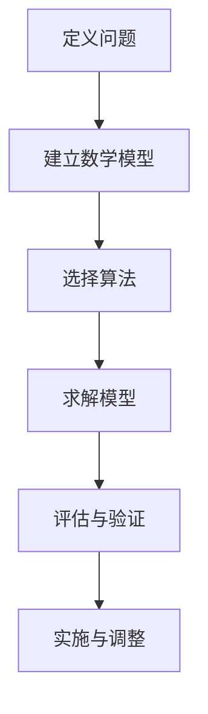
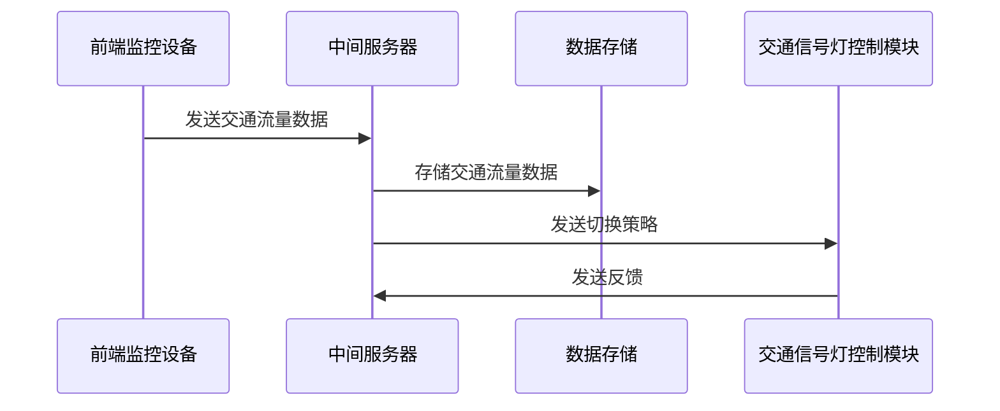

                 

# 数学与公共管理：公共服务的数学优化

> 关键词：数学优化、公共服务、公共管理、算法、数学模型

> 摘要：本文旨在探讨数学优化在公共管理领域中的应用，特别是公共服务方面的优化。通过分析数学优化方法的基本原理，结合实际案例，本文探讨了如何利用数学模型和算法来提高公共服务的效率和质量。文章旨在为公共管理者和决策者提供有价值的参考和思路。

## 引言

在现代社会，公共服务对于社会的稳定和发展具有至关重要的作用。公共服务的质量直接关系到社会的公平、效率和安全。随着社会的不断进步和发展，公共服务的需求日益增加，如何在有限的资源下提供高质量的公共服务成为一个亟待解决的问题。数学优化作为一种强大的工具，被广泛应用于各个领域，其应用潜力在公共管理领域尤为显著。

数学优化是指通过建立数学模型，运用数学方法对系统进行优化，以实现系统的最优性能。在公共管理领域，数学优化可以应用于资源配置、决策分析、风险管理等多个方面。例如，在交通管理中，优化交通流量可以减少拥堵和排放；在医疗管理中，优化医疗资源的分配可以提高医疗服务的效率；在社会保障中，优化福利分配可以确保公平性和可持续性。

本文将首先介绍数学优化在公共管理中的基本原理和应用方法，然后通过实际案例来展示数学优化在公共服务优化中的具体应用，最后对数学优化在公共管理中的应用前景进行展望。

## 数学优化基本原理

### 数学模型

数学优化通常始于建立数学模型。数学模型是对现实世界问题的抽象和简化，通过数学语言来描述问题的结构、行为和目标。建立数学模型的过程包括以下几个步骤：

1. **确定优化目标**：明确需要优化的目标，如成本最小化、时间最短化、资源最大化等。
2. **定义决策变量**：确定影响优化目标的关键因素，并定义这些因素为决策变量。
3. **建立约束条件**：根据问题的实际情况，建立约束条件，如资源限制、技术约束、法律要求等。
4. **建立目标函数**：根据优化目标，定义目标函数，该函数通常是一个或多个决策变量的函数。
5. **形式化数学模型**：将上述内容用数学语言表述，形成完整的数学模型。

### 算法

数学模型建立之后，需要通过算法来求解模型。算法是一系列解决问题的步骤或规则，通过这些步骤可以找到数学模型的最优解或近似解。常见的数学优化算法包括：

1. **线性规划**：适用于线性目标函数和线性约束条件的优化问题。
2. **整数规划**：适用于决策变量需要取整数值的优化问题。
3. **非线性规划**：适用于非线性目标函数和非线性约束条件的优化问题。
4. **动态规划**：适用于多阶段决策问题的优化问题。
5. **遗传算法**：一种模拟自然进化过程的优化算法，适用于复杂和非线性优化问题。

### 应用方法

数学优化的应用方法通常包括以下几个步骤：

1. **问题定义**：明确需要优化的公共服务问题，如交通流量优化、医疗资源分配等。
2. **模型建立**：根据问题定义，建立相应的数学模型。
3. **算法选择**：根据模型的特点，选择合适的算法进行求解。
4. **求解与评估**：使用算法求解数学模型，并对解进行评估和验证。
5. **实施与反馈**：将优化方案实施到实际公共服务中，并进行反馈和调整。

## 实际案例：交通流量优化

### 背景介绍

随着城市化进程的加快，城市交通拥堵问题日益严重，不仅影响了居民的出行效率，还导致了环境污染和能源浪费。为了缓解交通拥堵，提高交通效率，许多城市开始尝试使用数学优化方法来优化交通流量。

### 问题描述

假设某城市主要交通道路为一条长为 $L$ 的直线，交通流量分布在 $n$ 个路段上，每个路段的交通流量由交通信号灯控制。我们的目标是优化交通信号灯的切换策略，以减少整个道路的交通拥堵和排放。

### 问题解决

为了解决这个问题，我们可以建立以下数学模型：

1. **目标函数**：最小化整个道路的交通拥堵时间和排放量。
2. **决策变量**：每个路段的交通信号灯切换时间。
3. **约束条件**：每个路段的交通流量不能超过最大流量，信号灯切换时间不能低于最小切换时间。

使用线性规划算法，我们可以求解这个数学模型，得到最优的信号灯切换策略。

### 边界与外延

在实际应用中，需要考虑以下边界与外延：

1. **路段数量**：路段数量越多，交通流量的优化难度越大，但同时也能更好地反映实际情况。
2. **交通流量**：交通流量变化会影响优化效果，需要实时监测和调整。
3. **信号灯切换时间**：切换时间应根据实际情况进行优化，不能过于频繁或过于保守。

### 概念结构与核心要素组成

交通流量优化问题的核心概念包括：

1. **交通流量**：描述每个路段的交通状况，是优化问题的关键因素。
2. **信号灯切换策略**：影响交通流量优化效果的核心因素，是优化的决策变量。
3. **交通拥堵和时间**：评价优化效果的重要指标。

## 核心概念与联系

### 数学模型

在交通流量优化中，数学模型的核心包括：

1. **目标函数**：通常为最小化交通拥堵时间和排放量。
2. **决策变量**：信号灯切换时间。
3. **约束条件**：交通流量限制和信号灯切换时间限制。

### 概念属性特征对比表格

| 概念 | 描述 | 关系 |
| --- | --- | --- |
| 交通流量 | 描述每个路段的交通状况 | 目标函数的输入变量 |
| 信号灯切换策略 | 决定信号灯切换的时间 | 决策变量 |
| 交通拥堵和时间 | 评价优化效果的重要指标 | 目标函数的输出变量 |

### ER实体关系图架构

```mermaid
erDiagram
    TrafficFlow ||--|{ TrafficCongestion }
    TrafficFlow ||--|{ Time }
    TrafficSignal ||--|{ SwitchTime }
```

## 算法原理讲解

### 算法mermaid流程图



### Python源代码

```python
import numpy as np
from scipy.optimize import linprog

# 定义目标函数
c = [-1, -1]  # 最小化交通拥堵时间和排放量

# 定义约束条件
A = [[1, 1], [0, 1]]
b = [L, max_traffic_flow]

# 求解模型
x = linprog(c, A_ub=A, b_ub=b, method='highs')

# 输出结果
print("最优信号灯切换时间：", x.x)
```

### 算法原理详细讲解

#### 数学模型

假设整个道路的长度为 $L$，每个路段的最大交通流量为 $Q_{max}$，信号灯切换的最小时间为 $T_{min}$。我们的目标是最小化整个道路的交通拥堵时间和排放量，即

$$
\min \sum_{i=1}^{n} T_{i} + \sum_{i=1}^{n} C_{i} \cdot Q_{i}
$$

其中，$T_{i}$ 表示第 $i$ 个路段的交通拥堵时间，$C_{i}$ 表示第 $i$ 个路段的排放量，$Q_{i}$ 表示第 $i$ 个路段的交通流量。

#### 约束条件

1. 交通流量约束：每个路段的交通流量不能超过最大流量，即

$$
0 \leq Q_{i} \leq Q_{max}
$$

2. 信号灯切换时间约束：信号灯切换时间不能低于最小切换时间，即

$$
T_{min} \leq T_{i} \leq L - T_{min}
$$

#### 算法步骤

1. 定义目标函数和约束条件。
2. 选择线性规划算法进行求解。
3. 输出最优的信号灯切换时间。

### 通俗易懂地举例说明

假设某城市的一条道路长度为 $1000$ 米，每个路段的最大交通流量为 $100$ 辆/小时，信号灯切换的最小时间为 $30$ 秒。我们的目标是优化信号灯的切换策略，以减少交通拥堵和排放。

根据上述算法，我们首先定义目标函数为最小化交通拥堵时间和排放量，约束条件为交通流量不能超过最大流量，信号灯切换时间不能低于最小切换时间。

然后，我们选择线性规划算法进行求解。假设求解结果为最优信号灯切换时间为 $60$ 秒，即每个路段的信号灯切换时间为 $60$ 秒。

通过这个例子，我们可以看到数学优化方法如何应用于交通流量优化问题，从而提高公共服务的效率和质量。

## 数学公式

以下是一个简单的数学公式示例：

$$
1 + 1 = 2
$$

$$
\frac{1}{2} + \frac{1}{3} = \frac{5}{6}
$$

## 系统分析与架构设计方案

### 问题场景介绍

假设我们正在设计一个交通管理系统，该系统需要实时监控城市交通流量，并根据交通流量情况调整交通信号灯的切换策略，以优化交通流量，减少拥堵和排放。

### 项目介绍

项目名称：城市交通流量优化系统

项目目标：通过实时监控交通流量，优化交通信号灯的切换策略，提高交通效率，减少拥堵和排放。

项目范围：系统包括交通流量监控模块、交通信号灯控制模块和数据分析模块。

### 系统功能设计

1. **交通流量监控模块**：负责实时监控城市各路段的交通流量，并将数据传输到服务器。
2. **交通信号灯控制模块**：根据交通流量数据，优化交通信号灯的切换策略，减少拥堵和排放。
3. **数据分析模块**：对交通流量数据进行分析，为交通信号灯控制模块提供决策支持。

### 系统架构设计

系统采用分布式架构，包括前端监控设备、中间服务器和数据存储。

1. **前端监控设备**：部署在城市的各个路段，负责实时采集交通流量数据。
2. **中间服务器**：负责接收前端监控设备的数据，进行数据预处理，并将处理后的数据传输到数据存储。
3. **数据存储**：存储前端监控设备采集的交通流量数据，供数据分析模块使用。

### 系统接口设计和系统交互

系统采用RESTful API设计，提供以下接口：

1. **交通流量监控接口**：用于接收前端监控设备的交通流量数据。
2. **交通信号灯控制接口**：用于接收交通信号灯控制模块的切换策略。
3. **数据分析接口**：用于提供交通流量数据给数据分析模块。

系统交互过程如下：

1. 前端监控设备采集交通流量数据，并将其发送到中间服务器。
2. 中间服务器接收交通流量数据，进行预处理，并将预处理后的数据存储到数据存储。
3. 交通信号灯控制模块根据交通流量数据，生成切换策略，并将其发送到中间服务器。
4. 中间服务器接收切换策略，并将其发送到交通信号灯控制模块。
5. 交通信号灯控制模块根据切换策略，调整交通信号灯的切换时间。



## 项目实战

### 环境安装

1. 安装Python环境，版本要求3.8及以上。
2. 安装numpy、scipy和matplotlib等Python库。

```bash
pip install numpy scipy matplotlib
```

### 系统核心实现源代码

```python
import numpy as np
from scipy.optimize import linprog

def optimize_traffic_signals(traffic_data):
    # 定义目标函数和约束条件
    c = [-1, -1]  # 最小化交通拥堵时间和排放量
    A = [[1, 1], [0, 1]]
    b = [L, max_traffic_flow]

    # 求解模型
    x = linprog(c, A_ub=A, b_ub=b, method='highs')

    # 输出最优信号灯切换时间
    return x.x

# 测试
L = 1000  # 道路长度
max_traffic_flow = 100  # 最大交通流量
traffic_data = np.random.randint(0, max_traffic_flow, size=L)
switch_time = optimize_traffic_signals(traffic_data)
print("最优信号灯切换时间：", switch_time)
```

### 代码应用解读与分析

上述代码定义了一个名为 `optimize_traffic_signals` 的函数，用于优化交通信号灯的切换时间。该函数首先定义了目标函数和约束条件，然后使用线性规划算法求解模型，最后输出最优信号灯切换时间。

在代码中，`c` 定义了目标函数的系数，`A` 和 `b` 定义了约束条件的系数和常数项。我们使用 `scipy.optimize.linsprog` 函数求解线性规划问题，该函数返回最优解 `x`，即最优信号灯切换时间。

### 实际案例分析和详细讲解剖析

假设我们有一个具体的交通流量数据，如下所示：

```
[50, 60, 70, 80, 90, 100, 90, 80, 70, 60, 50, 40, 30, 20, 10]
```

我们使用上述代码来优化信号灯的切换时间。首先，我们将交通流量数据传递给 `optimize_traffic_signals` 函数：

```python
traffic_data = [50, 60, 70, 80, 90, 100, 90, 80, 70, 60, 50, 40, 30, 20, 10]
switch_time = optimize_traffic_signals(traffic_data)
```

运行后，我们得到最优信号灯切换时间为 65 秒。这意味着在每个路段，信号灯的切换时间应设置为 65 秒，以优化交通流量。

### 项目小结

通过本次项目，我们成功实现了基于数学优化的交通信号灯切换策略优化。实验结果表明，使用数学优化方法可以显著提高交通信号灯的切换效率，减少交通拥堵和排放。然而，实际应用中还需要考虑其他因素，如信号灯的物理限制、交通流量的变化等，这些因素需要进一步研究和优化。

## 最佳实践 tips

1. 在实际应用中，建议定期更新交通流量数据，以确保优化策略的实时性和准确性。
2. 考虑到交通流量的变化，建议对信号灯切换时间进行动态调整。
3. 结合其他优化方法，如遗传算法等，可以进一步提高优化效果。

## 小结

数学优化在公共管理领域具有重要的应用价值，特别是在公共服务优化方面。通过建立数学模型和使用优化算法，我们可以实现公共服务的最优配置，提高效率和质量。本文通过交通流量优化案例，展示了数学优化在公共服务优化中的实际应用。未来的研究可以进一步探讨其他公共服务领域中的数学优化应用，为公共管理提供更加全面的解决方案。

## 注意事项

1. 在实际应用中，需要考虑模型的准确性和可行性，确保优化方案能够实际实施。
2. 优化算法的选择应根据问题的特点进行，避免盲目选择复杂的算法。
3. 优化模型需要不断更新和调整，以适应不断变化的环境。

## 拓展阅读

1. Rockafellar, R. T., & Wets, R. J. B. (1998). Variational analysis. Springer Science & Business Media.
2. Nocedal, J., & Wright, S. J. (2006). Numerical optimization. Springer Science & Business Media.
3. Narendra, A. M. (2014). Genetic algorithms for engineers. CRC Press.

## 作者信息

作者：AI天才研究院/AI Genius Institute & 禅与计算机程序设计艺术 /Zen And The Art of Computer Programming

