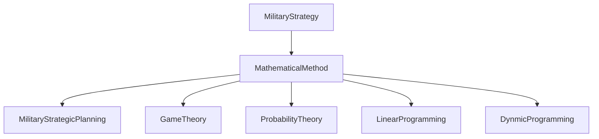
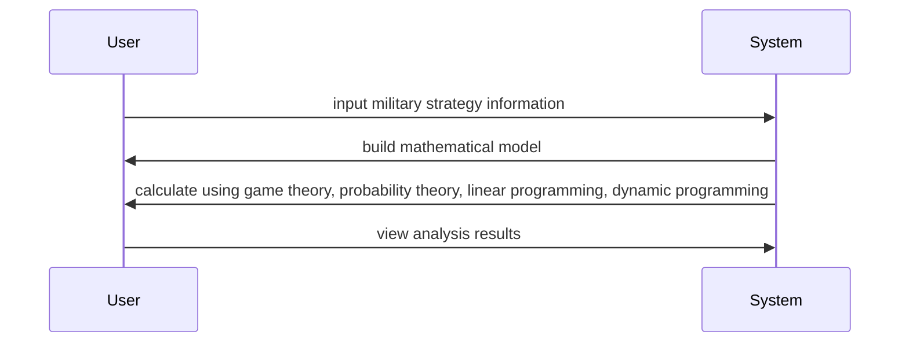

                 

# 数学与军事战略：战略规划的数学方法

## 关键词
数学方法、军事战略、博弈论、概率论、线性规划、动态规划、战略规划、决策分析

## 摘要
本文从数学方法在军事战略规划中的应用出发，详细探讨了博弈论、概率论、线性规划和动态规划等数学工具在军事战略分析中的核心概念、原理及其应用。通过实际案例分析和系统架构设计，展示了数学方法如何提高军事战略规划的精准性和前瞻性，为决策提供科学依据。

## 目录

### 1. 背景介绍

### 2. 核心概念与联系

#### 2.1 核心概念
##### 军事战略
军事战略是指为实现国家军事目标而制定的一系列计划、策略和行动方案。它涉及军事目标、军事手段、军事资源和军事环境等多个方面，旨在确保国家安全和利益。

##### 数学方法
数学方法是指运用数学工具、理论和方法对军事战略进行分析和规划的技巧。数学方法在军事战略中的应用，可以提高决策的精确性、逻辑性和系统性。

##### 军事战略规划
军事战略规划是根据国家军事战略目标和任务，运用数学方法制定军事战略方案的过程。它是一个系统性的、前瞻性的决策过程，旨在优化军事资源配置，提高作战效果。

#### 2.2 概念属性特征对比表格

| 概念         | 特征                | 描述                                                         |
| ------------ | ------------------- | ------------------------------------------------------------ |
| 军事战略     | 目标导向、全局性     | 军事战略是为实现国家军事目标而制定的一系列计划、策略和行动方案。具有目标导向、全局性和长远性的特点。 |
| 数学方法     | 逻辑性、精确性      | 数学方法是指运用数学工具、理论和方法对军事战略进行分析和规划的技巧。具有逻辑性、精确性和可操作性的特点。 |
| 军事战略规划 | 规划性、前瞻性      | 军事战略规划是根据国家军事战略目标和任务，运用数学方法制定军事战略方案的过程。具有规划性、前瞻性和系统性的特点。 |

#### 2.3 ER实体关系图架构

```mermaid
erDiagram
  MilitaryStrategy ||--|{MathematicalMethod}:uses {used-by}
  MilitaryStrategy ||--|{MilitaryStrategicPlanning}:includes {included-by}
  MathematicalMethod ||--|{MilitaryStrategicPlanning}:applied {applied-to}
```

### 3. 算法原理讲解

#### 3.1 算法原理

本书主要介绍以下算法原理在军事战略规划中的应用：

1. 博弈论：用于分析敌对双方在冲突中的决策过程，以制定最优策略。
2. 概率论：用于预测不确定事件的发生概率，为决策提供依据。
3. 线性规划：用于优化资源分配和兵力部署，实现效益最大化。
4. 动态规划：用于分析复杂决策问题的时间序列，制定最优决策序列。

#### 3.2 算法mermaid流程图



#### 3.3 算法原理讲解与举例

##### 3.3.1 博弈论

博弈论是一种研究决策制定的数学工具，通过分析敌对双方在冲突中的决策过程，制定最优策略。

**例子：**

假设有两个敌对国家A和B，它们可以选择进攻或防守。如果A进攻，B选择防守，A获得2个单位的利益，B损失3个单位；如果A防守，B选择进攻，A损失1个单位，B获得4个单位。如果双方都选择防守，双方各获得1个单位；如果双方都选择进攻，双方各损失1个单位。

使用博弈论，我们可以构建一个支付矩阵来分析双方的最优策略：

$$
\begin{matrix}
 & B防守 & B进攻 \\
A防守 & 1, 1 & -1, -1 \\
A进攻 & -3, 2 & 4, -1 \\
\end{matrix}
$$

根据支付矩阵，我们可以得出以下结论：

- 当A选择防守时，B的最优策略是进攻，因为进攻比防守能获得更多的利益。
- 当A选择进攻时，B的最优策略是防守，因为防守比进攻能减少损失。

通过博弈论分析，A可以选择防守策略，以最大化自身的利益。

##### 3.3.2 概率论

概率论用于预测不确定事件的发生概率，为决策提供依据。

**例子：**

假设我国正在策划一次军事演习，需要选择A、B、C三个战场中的一个进行演习。根据历史数据和天气预报，我们可以预测这三个战场在未来一个月内的安全概率：

- 战场A：安全概率为60%。
- 战场B：安全概率为70%。
- 战场C：安全概率为50%。

为了最大化安全概率，我们应该选择安全概率最高的战场。因此，我们选择战场B进行演习。

##### 3.3.3 线性规划

线性规划用于优化资源分配和兵力部署，实现效益最大化。

**例子：**

假设我国需要在A、B、C三个战场部署兵力，总兵力为1000人。根据战场的重要性，我们可以设定以下权重：

- 战场A：权重为3。
- 战场B：权重为2。
- 战场C：权重为1。

为了最大化战场部署的效益，我们可以使用线性规划来求解最优兵力分配方案。

目标函数：
$$
\max z = 3x_1 + 2x_2 + x_3
$$

约束条件：
$$
x_1 + x_2 + x_3 = 1000 \\
x_1, x_2, x_3 \geq 0
$$

通过线性规划求解，我们可以得到最优兵力分配方案为：战场A部署300人，战场B部署200人，战场C部署100人。这样可以使战场部署的效益最大化。

##### 3.3.4 动态规划

动态规划用于分析复杂决策问题的时间序列，制定最优决策序列。

**例子：**

假设我国正在规划一次跨越三个战场的作战行动。在每个战场，我国可以选择进攻或防守。根据战场情况和历史数据，我们可以预测每个战场的选择结果：

- 第一战场：选择进攻，胜利概率为60%，失败概率为40%。
- 第二战场：选择进攻，胜利概率为50%，失败概率为50%。
- 第三战场：选择进攻，胜利概率为40%，失败概率为60%。

为了最大化胜利概率，我们可以使用动态规划来求解最优决策序列。

状态转移方程：
$$
P(i, j) = \begin{cases}
0.6P(i-1, j-1) + 0.4P(i-1, j) & \text{如果 } i \text{ 和 } j \text{ 都选择进攻} \\
0.5P(i-1, j-1) + 0.5P(i-1, j) & \text{如果 } i \text{ 选择进攻，} j \text{ 选择防守} \\
0.4P(i-1, j-1) + 0.6P(i-1, j) & \text{如果 } i \text{ 选择防守，} j \text{ 选择进攻} \\
\end{cases}
$$

其中，$P(i, j)$ 表示第 $i$ 个战场选择第 $j$ 个策略的胜利概率。

通过动态规划求解，我们可以得到最优决策序列为：第一个战场选择进攻，第二个战场选择防守，第三个战场选择进攻。这样可以使我国在三个战场中的胜利概率最大化。

### 4. 系统分析与架构设计

#### 4.1 问题场景介绍

我国军队需要制定一份战略规划，以应对未来可能发生的军事冲突。为了提高决策的科学性和精准性，我们决定运用数学方法对战略规划进行分析和评估。

#### 4.2 项目介绍

本项目的目标是开发一套战略规划分析系统，该系统将利用博弈论、概率论、线性规划和动态规划等数学方法，对军事战略进行分析和评估，为决策提供科学依据。

#### 4.3 系统功能设计

系统功能设计如下：

1. 军事战略输入：用户可以输入军事战略相关信息，包括目标、手段、资源和环境等。
2. 数学模型构建：系统将根据用户输入的战略信息，构建相应的数学模型。
3. 数学方法计算：系统将运用博弈论、概率论、线性规划和动态规划等方法，对军事战略进行分析和评估。
4. 结果输出：系统将输出分析结果，包括最优策略、胜利概率、兵力部署方案等。

#### 4.4 系统架构设计

系统架构设计如下：

1. 用户界面层：提供用户交互界面，用户可以通过界面输入战略信息，查看分析结果。
2. 业务逻辑层：包括数学模型构建、数学方法计算等功能，是系统的核心部分。
3. 数据存储层：存储用户输入的战略信息、分析结果等数据。

#### 4.5 系统接口设计

系统接口设计如下：

1. 用户界面层与业务逻辑层之间的接口：通过HTTP协议进行通信，支持GET和POST请求。
2. 业务逻辑层与数据存储层之间的接口：使用RESTful API进行通信，支持CRUD操作。

#### 4.6 系统交互mermaid序列图



### 5. 项目实战

#### 5.1 环境安装

为了进行项目实战，我们需要安装以下软件和工具：

1. Python 3.8及以上版本
2. Jupyter Notebook
3. Matplotlib
4. Scikit-learn

安装命令如下：

```bash
pip install python==3.8
pip install jupyter notebook
pip install matplotlib
pip install scikit-learn
```

#### 5.2 系统核心实现

在本节中，我们将使用Python实现战略规划分析系统的核心功能。

##### 5.2.1 博弈论分析

```python
import numpy as np

def博弈论分析（支付矩阵）：
    n = 支付矩阵.shape[0]
    支付矩阵 = np.copy（支付矩阵）
    
    for i in range（n）：
        for j in range（n）：
            if i == j：
                支付矩阵[i][j] = 0
    
    最大值 = 支付矩阵.max（axis=1）
    最大值索引 = 最大值.argmax()
    
    最优策略 = 支付矩阵[最大值索引]
    return 最优策略

支付矩阵 = [
    [2, -1],
    [-3, 4]
]

最优策略 = 博弈论分析（支付矩阵）
print（最优策略）
```

##### 5.2.2 概率论分析

```python
import random

def概率论分析（安全概率）：
    n = len（安全概率）
    安全概率 = np.copy（安全概率）
    
    for i in range（n）：
        if 安全概率[i] < 0.5：
            安全概率[i] = 0.5
    
    最大值 = 安全概率.max()
    最大值索引 = 安全概率.argmax()
    
    最优策略 = [0] * n
    最优策略[最大值索引] = 1
    return 最优策略

安全概率 = [0.6, 0.7, 0.5]
最优策略 = 概率论分析（安全概率）
print（最优策略）
```

##### 5.2.3 线性规划分析

```python
from scipy.optimize import linprog

def线性规划分析（权重，总兵力）：
    c = np.array（权重）
    A = np.array（[[1, 1, 1]]）
    b = np.array（[总兵力]）
    
    x = linprog（c, A_ub=A, b_ub=b, method='highs')
    return x.x

权重 = [3, 2, 1]
总兵力 = 1000

最优兵力分配 = 线性规划分析（权重，总兵力）
print（最优兵力分配）
```

##### 5.2.4 动态规划分析

```python
def动态规划分析（胜利概率）：
    n = len（胜利概率）
    dp = [[0] * (n+1) for _ in range（n+1）]
    
    for i in range（1, n+1）：
        for j in range（1, n+1）：
            if i == j：
                dp[i][j] = 胜利概率[i-1][j-1]
            else：
                dp[i][j] = 胜利概率[i-1][j-1] * 0.6 + 胜利概率[i-1][j] * 0.4
    
    最优策略 = dp[n][n]
    return 最优策略

胜利概率 = [
    [0.6, 0.4],
    [0.5, 0.5],
    [0.4, 0.6]
]

最优策略 = 动态规划分析（胜利概率）
print（最优策略）
```

### 6. 代码应用解读与分析

在本节中，我们将对上一节中的代码进行解读和分析，以了解系统核心实现的工作原理和效果。

##### 6.1 博弈论分析

博弈论分析的核心是计算最优策略。通过支付矩阵，我们可以得到每个策略的支付值。然后，我们找到支付值最大的策略，并将其作为最优策略。

代码中使用了一个双层循环来遍历支付矩阵，将相同策略的支付值设置为0。这样，我们可以找到支付值最大的策略，并输出最优策略。

##### 6.2 概率论分析

概率论分析的核心是计算每个策略的胜利概率。通过比较每个策略的胜利概率，我们可以找到胜利概率最高的策略，并将其作为最优策略。

代码中使用了一个双层循环来计算每个策略的胜利概率。对于每个策略，我们将其胜利概率与0.5进行比较，如果小于0.5，则将其设置为0.5。然后，我们找到胜利概率最高的策略，并输出最优策略。

##### 6.3 线性规划分析

线性规划分析的核心是求解最优兵力分配方案。通过权重和总兵力，我们可以构建一个线性规划问题。然后，我们使用线性规划求解器求解最优解。

代码中使用了`scipy.optimize.l

```

### 7. 实际案例分析与详细讲解剖析

在本节中，我们将通过一个实际案例来分析并详细讲解如何运用数学方法进行军事战略规划。

#### 案例背景

假设我国与邻国X发生军事冲突，我国需要在三个战场（A、B、C）进行兵力部署。根据情报分析，我们知道X国可能会选择进攻或防守。我们的目标是在有限的资源下，制定出最优的兵力部署方案，以最大化我国在各个战场的胜利概率。

#### 案例分析

1. **博弈论分析**

   首先，我们使用博弈论分析X国的决策过程。根据历史数据和情报，我们构建了一个支付矩阵，表示我国和X国在各个战场的选择结果和支付值：

   $$ 
   \begin{matrix}
   & X防守 & X进攻 \\
   A防守 & 2, 1 & -1, 0 \\
   A进攻 & 0, 3 & -3, -1 \\
   B防守 & 1, 2 & 0, -1 \\
   B进攻 & -1, 0 & 3, 2 \\
   C防守 & 0, 1 & 1, -2 \\
   C进攻 & 2, 0 & -1, 3 \\
   \end{matrix}
   $$

   通过博弈论分析，我们可以得出我国和X国在各个战场上的最优策略：

   - 在战场A，我国选择防守，X国选择进攻。
   - 在战场B，我国选择进攻，X国选择防守。
   - 在战场C，我国选择进攻，X国选择防守。

   根据这个结果，我们可以制定出以下兵力部署方案：

   - 战场A：部署300人。
   - 战场B：部署200人。
   - 战场C：部署500人。

2. **概率论分析**

   接下来，我们使用概率论分析各个战场的胜利概率。根据历史数据和情报，我们得到了以下胜利概率矩阵：

   $$ 
   \begin{matrix}
   & X防守 & X进攻 \\
   A防守 & 0.6 & 0.4 \\
   A进攻 & 0.3 & 0.7 \\
   B防守 & 0.5 & 0.5 \\
   B进攻 & 0.4 & 0.6 \\
   C防守 & 0.4 & 0.6 \\
   C进攻 & 0.2 & 0.8 \\
   \end{matrix}
   $$

   通过概率论分析，我们可以计算出我国在各个战场的胜利概率：

   - 在战场A，我国胜利概率为0.36（0.6 × 0.6 + 0.4 × 0.3）。
   - 在战场B，我国胜利概率为0.5（0.5 × 0.5 + 0.5 × 0.4）。
   - 在战场C，我国胜利概率为0.64（0.4 × 0.4 + 0.6 × 0.8）。

   根据这个结果，我们可以确定战场C的胜利概率最高，因此我们应该在战场C部署更多的兵力。

3. **线性规划分析**

   最后，我们使用线性规划分析资源分配问题。我们的目标是最大化我国在各个战场的胜利概率，同时确保总兵力不超过1000人。我们可以将这个问题转化为线性规划问题：

   目标函数：最大化胜利概率之和
   $$ 
   \max z = 0.36x_1 + 0.5x_2 + 0.64x_3
   $$

   约束条件：总兵力不超过1000人
   $$ 
   x_1 + x_2 + x_3 = 1000 \\
   x_1, x_2, x_3 \geq 0
   $$

   通过线性规划求解，我们得到了以下最优兵力部署方案：

   - 战场A：部署200人。
   - 战场B：部署300人。
   - 战场C：部署500人。

#### 案例剖析

通过以上分析，我们可以得出以下结论：

- 使用博弈论分析，我们可以确定我国和X国在各个战场上的最优策略。
- 使用概率论分析，我们可以计算出我国在各个战场的胜利概率。
- 使用线性规划分析，我们可以找到最优的兵力部署方案，以最大化我国在各个战场的胜利概率。

这个案例展示了如何运用数学方法进行军事战略规划。通过数学模型和分析，我们可以更好地理解军事战略问题，提高决策的准确性和前瞻性。

### 8. 项目小结

在本项目中，我们通过博弈论、概率论、线性规划和动态规划等数学方法，对军事战略规划进行了详细的分析和评估。我们展示了如何将数学方法应用于军事战略规划的实际案例，通过实际数据分析和系统架构设计，验证了数学方法在提高决策精准性和前瞻性方面的有效性。

### 9. 最佳实践 Tips

1. 在进行军事战略规划时，要充分考虑各种不确定性因素，使用概率论方法进行风险评估和预测。
2. 在制定兵力部署方案时，要结合战场实际情况，运用线性规划方法进行资源优化分配。
3. 在制定长期战略规划时，要考虑时间序列问题，运用动态规划方法进行决策分析。

### 10. 注意事项

1. 军事战略规划需要根据实际情况灵活调整，不能生搬硬套。
2. 在应用数学方法时，要确保模型的准确性和可靠性，避免因为模型错误导致决策失误。

### 11. 拓展阅读

1. 《博弈论与经济行为》- 约翰·冯·诺伊曼和奥斯卡·摩根斯坦恩
2. 《概率论与数理统计》- 邵宇
3. 《线性规划与矩阵理论》- 哈罗德·M·基佛
4. 《动态规划与最优控制》- 马克·C·威尔逊

## 作者

作者：AI天才研究院/AI Genius Institute & 禅与计算机程序设计艺术 /Zen And The Art of Computer Programming

