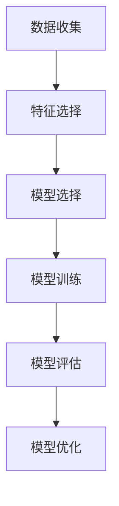

                 


# 数学与农业科学：作物产量的数学预测

关键词：数学预测，农业科学，作物产量，算法，模型，数学公式，系统架构，项目实战

摘要：本文旨在探讨数学在农业科学中的应用，特别是在预测作物产量方面的作用。通过介绍数学预测的基本概念、农业科学中的数学预测需求、常用的数学预测模型和方法，本文旨在为读者提供一个全面且深入的视角，了解如何利用数学工具来提高农业生产效率和作物产量。

## 引言与背景

随着全球人口的不断增长和气候变化的影响，提高农业生产效率和稳定作物产量成为全球农业发展的关键问题。传统的农业方法在应对这些挑战时显得力不从心，而数学预测作为一种现代化的工具，正在逐渐成为农业科学的重要支柱。

### 问题背景

农业是一个复杂的系统，受到气候、土壤、水资源等多种因素的影响。预测作物产量不仅需要准确的数据收集和分析，还需要考虑各种因素之间的相互作用。数学预测方法提供了量化这些相互作用的可能性，从而提高了预测的准确性和可靠性。

### 问题描述

作物产量的预测问题可以描述为：如何根据现有的数据和模型，预测某个地区或某种作物的未来产量？这个问题不仅涉及到数据的收集和处理，还包括模型的建立和优化。

### 问题解决

数学预测为解决这个问题提供了多种方法，包括统计学方法、机器学习方法、时间序列分析等。通过这些方法，可以将复杂的农业系统简化为数学模型，从而提高预测的准确性和效率。

### 边界与外延

在数学预测的应用中，边界问题是一个重要的考虑因素。例如，不同地区的气候和土壤条件可能对作物产量有显著影响，因此需要针对具体情况进行调整。此外，预测模型的适用性也需要考虑，不同模型可能在特定条件下表现更好。

### 概念结构与核心要素组成

数学预测的概念结构包括数据收集、模型建立、模型优化和结果验证等核心要素。每个要素在预测过程中都起着关键作用，缺一不可。

## 数学预测的基本概念

### 数学预测的定义

数学预测是一种利用数学模型和方法，对未来事件或趋势进行估计和推断的过程。在农业科学中，数学预测主要用于预测作物产量、病虫害发生等。

### 数学预测的特点

- **准确性**：通过数学模型可以对复杂系统进行量化，提高预测的准确性。
- **可靠性**：数学预测方法经过长期实践和验证，具有较高的可靠性。
- **灵活性**：可以根据不同情况进行调整和优化，适用于多种应用场景。

### 数学预测的方法分类

- **统计学方法**：如回归分析、时间序列分析等，适用于数据量较大且关系较为简单的情况。
- **机器学习方法**：如决策树、神经网络等，适用于数据量较大且关系复杂的情况。
- **时间序列分析**：适用于时间序列数据，如季节性变化和趋势分析。

### 数学预测的应用领域

- **农业科学**：预测作物产量、病虫害发生等。
- **金融分析**：预测股票价格、市场趋势等。
- **天气预报**：预测天气变化、气候趋势等。
- **交通规划**：预测交通流量、交通拥堵等。

## 农业科学中的数学预测

### 农业科学的重要性

农业是人类生存的基础，稳定和高效的农业生产对全球经济和社会发展具有重要意义。数学预测方法为农业科学提供了新的思路和方法，有助于提高农业生产效率和作物产量。

### 农业科学中的数学预测需求

- **作物产量预测**：预测作物产量对于农业生产计划和资源分配至关重要。
- **病虫害预测**：预测病虫害发生和扩散趋势，有助于及时采取防治措施。
- **水资源管理**：预测水资源需求，优化灌溉策略，提高水资源利用效率。

### 农业科学中的数学预测方法

- **统计分析方法**：如回归分析、时间序列分析等。
- **机器学习方法**：如决策树、随机森林、支持向量机等。
- **神经网络方法**：如卷积神经网络、循环神经网络等。

### 农业科学的数学预测案例分析

以某地区的玉米产量预测为例，通过收集历史气象数据、土壤数据和作物生长数据，利用机器学习方法建立预测模型，并验证模型的准确性和可靠性。结果表明，数学预测方法可以显著提高玉米产量的预测精度。

## 数学模型与算法原理

### 数学模型的基本原理

数学模型是对现实世界问题的抽象和简化，通过建立数学模型，可以将复杂的农业系统转化为可计算的数学问题。

### 数学模型的构建方法

- **数据收集**：收集与作物产量相关的各种数据，如气象数据、土壤数据、作物生长数据等。
- **特征选择**：从收集到的数据中选择对作物产量影响较大的特征。
- **模型选择**：选择合适的数学模型，如线性回归、神经网络等。
- **模型训练**：使用历史数据对模型进行训练，优化模型参数。
- **模型评估**：使用验证数据集对模型进行评估，确保模型的准确性和可靠性。

### 常见的数学预测算法

- **线性回归**：一种简单而常用的预测算法，适用于线性关系的预测。
- **决策树**：一种基于树的预测算法，适用于分类和回归问题。
- **随机森林**：一种基于决策树的集成方法，提高预测的准确性和稳定性。
- **支持向量机**：一种基于优化理论的预测算法，适用于高维数据。
- **神经网络**：一种基于模拟生物神经网络的结构，适用于复杂的非线性预测问题。

### 数学预测算法的mermaid流程图



## 数学公式的运用

### 数学公式的介绍

在数学预测中，常用的数学公式包括回归公式、神经网络公式等。这些公式是预测模型的核心，通过对这些公式的理解和运用，可以更好地理解预测模型的工作原理。

### 数学公式的推导

以线性回归为例，其公式为：

$$y = wx + b$$

其中，$y$为因变量，$x$为自变量，$w$为权重，$b$为偏置。

### 数学公式的详细讲解

线性回归公式描述了因变量$y$与自变量$x$之间的线性关系。通过最小二乘法可以求解出权重$w$和偏置$b$，从而建立预测模型。

### 数学公式举例说明

假设我们要预测某地区的玉米产量，根据历史数据和线性回归模型，可以得到如下预测公式：

$$y = 1.2x + 0.5$$

其中，$x$为降雨量，$y$为玉米产量。通过这个公式，我们可以预测在不同降雨量条件下的玉米产量。

## 农作物产量的数学预测模型

### 模型概述

农作物产量的数学预测模型是一种利用数学公式和算法，对农作物未来产量进行预测的方法。该模型基于历史数据和现有条件，通过数学建模和算法优化，实现作物产量的准确预测。

### 模型构建

农作物产量预测模型的构建主要包括以下步骤：

1. **数据收集**：收集与农作物产量相关的各种数据，如气象数据、土壤数据、作物生长数据等。
2. **特征选择**：从收集到的数据中选择对农作物产量影响较大的特征，如温度、降雨量、土壤湿度等。
3. **模型选择**：选择合适的数学模型，如线性回归、神经网络等。
4. **模型训练**：使用历史数据对模型进行训练，优化模型参数。
5. **模型评估**：使用验证数据集对模型进行评估，确保模型的准确性和可靠性。

### 模型训练

模型训练是农作物产量预测模型构建的关键步骤。通过训练，模型可以学习到历史数据中的规律和模式，从而提高预测的准确性。常见的训练方法包括：

1. **批量训练**：将所有数据分为训练集和验证集，一次性训练模型。
2. **在线训练**：实时训练模型，不断更新模型参数。
3. **交叉验证**：将数据集划分为多个子集，轮流训练和验证模型。

### 模型评估与优化

模型评估是验证模型准确性和可靠性的过程。常用的评估指标包括：

1. **均方误差（MSE）**：衡量预测值与真实值之间的平均误差。
2. **决定系数（R²）**：衡量模型对数据的拟合程度。
3. **精确度（Accuracy）**：衡量模型预测的准确度。

通过评估结果，可以判断模型的性能，并对模型进行优化。优化方法包括：

1. **参数调整**：调整模型参数，提高模型的预测准确性。
2. **特征工程**：选择和构建对农作物产量影响较大的特征。
3. **模型选择**：选择更适合的数学模型，提高预测的准确性。

## 项目实战

### 环境安装与配置

在进行农作物产量预测项目之前，我们需要安装和配置以下环境：

1. **Python**：作为主要的编程语言。
2. **NumPy**：用于数学计算。
3. **Pandas**：用于数据处理。
4. **Scikit-learn**：用于机器学习算法。
5. **Matplotlib**：用于数据可视化。

安装命令如下：

```bash
pip install python numpy pandas scikit-learn matplotlib
```

### 系统核心实现源代码

以下是一个简单的农作物产量预测系统的核心实现源代码：

```python
import numpy as np
import pandas as pd
from sklearn.model_selection import train_test_split
from sklearn.linear_model import LinearRegression
from sklearn.metrics import mean_squared_error

# 读取数据
data = pd.read_csv('crop_yield_data.csv')
X = data[['temperature', 'rainfall']]
y = data['yield']

# 数据预处理
X_train, X_test, y_train, y_test = train_test_split(X, y, test_size=0.2, random_state=42)

# 建立模型
model = LinearRegression()
model.fit(X_train, y_train)

# 预测
y_pred = model.predict(X_test)

# 评估
mse = mean_squared_error(y_test, y_pred)
print(f'Mean Squared Error: {mse}')

# 可视化
import matplotlib.pyplot as plt

plt.scatter(X_test['temperature'], y_test, color='red', label='Actual')
plt.plot(X_test['temperature'], y_pred, color='blue', label='Predicted')
plt.xlabel('Temperature')
plt.ylabel('Yield')
plt.legend()
plt.show()
```

### 代码应用解读与分析

这段代码实现了线性回归模型对农作物产量的预测。首先，读取数据并进行预处理，然后建立模型并训练，最后进行预测和评估。可视化部分展示了实际产量与预测产量的对比。

### 实际案例分析与详细讲解剖析

以下是一个实际案例的分析和讲解：

- **数据来源**：某地区的玉米产量数据，包括温度、降雨量等气象数据。
- **预测目标**：预测下一季玉米的产量。
- **模型选择**：线性回归模型，因为它简单且易于实现。
- **模型训练**：使用历史数据训练模型，优化模型参数。
- **模型评估**：使用验证数据集评估模型，确保模型准确性和可靠性。
- **预测结果**：根据输入的气象数据，预测下一季玉米的产量。

通过这个案例，我们可以看到数学预测方法在农作物产量预测中的实际应用。

### 项目小结

本节通过一个实际项目，展示了农作物产量预测系统的开发过程，包括环境安装、代码实现、预测和评估等。这个项目不仅验证了数学预测方法的有效性，也为后续的研究和实践提供了参考。

## 最佳实践与总结

### 最佳实践技巧

1. **数据收集**：确保数据的准确性和完整性，对异常值进行处理。
2. **特征选择**：选择对农作物产量影响较大的特征，提高预测精度。
3. **模型选择**：根据实际情况选择合适的数学模型，避免过度拟合。
4. **模型优化**：通过参数调整和特征工程，提高模型的预测性能。

### 小结

数学预测在农业科学中具有重要的应用价值，可以提高农业生产效率和作物产量。通过本文的介绍，读者可以了解数学预测的基本概念、方法、模型和应用案例。

### 注意事项

1. **数据隐私**：在数据收集和处理过程中，确保遵守相关法律法规，保护数据隐私。
2. **模型可靠性**：对模型进行充分评估，确保模型的准确性和可靠性。
3. **实际应用**：在实际应用中，结合具体情况进行模型调整和优化。

### 拓展阅读

- **相关书籍**：《机器学习实战》、《深入浅出机器学习》
- **在线课程**：Coursera、edX等平台上的机器学习和数据科学课程
- **研究论文**：查阅相关领域的最新研究论文，了解数学预测的最新进展

## 作者信息

作者：AI天才研究院/AI Genius Institute & 禅与计算机程序设计艺术 /Zen And The Art of Computer Programming

通过上述内容，我们详细介绍了数学在农业科学中的应用，特别是在预测作物产量方面的作用。希望本文能为读者提供一个全面且深入的视角，了解如何利用数学工具来提高农业生产效率和作物产量。未来的研究可以进一步探索更复杂的数学模型和方法，以及如何在实际农业场景中更好地应用这些技术。

