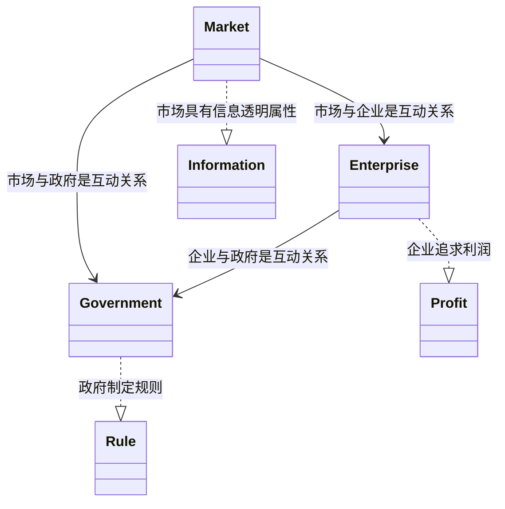
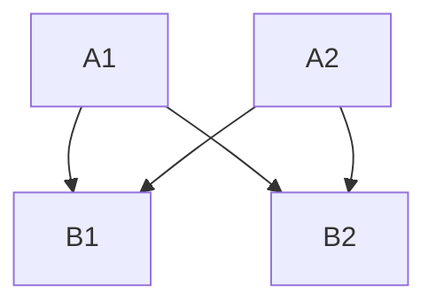
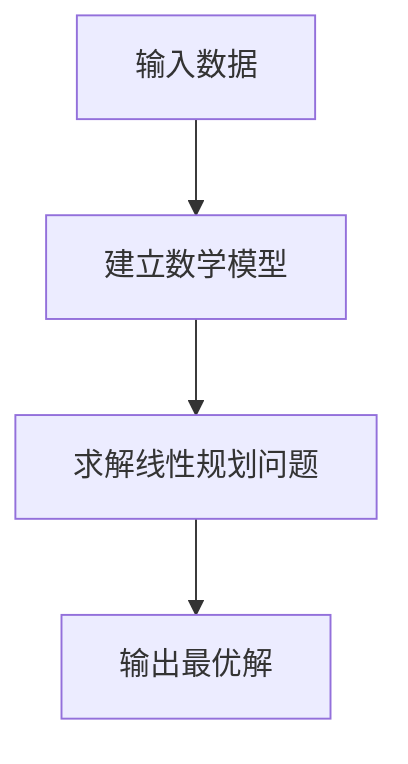
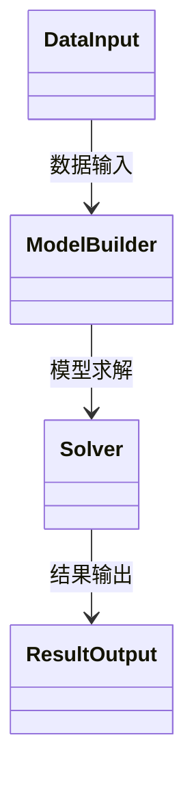
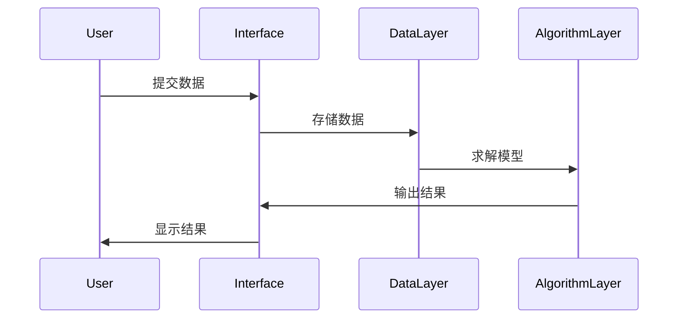

                 


## 数学与制度经济学：经济制度的数学描述

### 关键词
- 数学模型
- 制度经济学
- 经济制度
- 数学描述
- 算法原理
- 系统架构设计

### 摘要
本文旨在探讨数学在制度经济学中的应用，特别是如何用数学模型来描述经济制度。通过对核心概念、算法原理、系统架构和项目实战的深入剖析，本文将展示数学如何帮助我们更好地理解和设计经济制度。

---

### 第1章 问题背景与核心概念

#### 1.1 问题背景

在现代经济学中，制度经济学是一个重要的分支，它关注经济活动中的制度安排及其影响。然而，传统的经济学研究往往缺乏形式化的数学工具，这使得对经济制度的分析不够精确和系统。数学作为一种强有力的工具，可以为制度经济学提供形式化的描述和分析手段。

#### 1.2 制度经济学的基本概念

制度经济学中的基本概念包括市场机制、产权制度、法律体系等。这些概念在经济制度中起着核心作用，但它们往往难以用传统的语言来精确描述。通过数学模型，我们可以将这些概念形式化，使得分析更加严谨和科学。

#### 1.3 数学在经济制度分析中的应用

数学在经济制度分析中的应用主要包括以下几个方面：
- **建模**：通过数学模型来模拟经济制度中的各种行为和互动。
- **预测**：利用数学模型来预测经济制度的变化趋势和可能的结果。
- **优化**：通过数学方法来优化经济制度的结构和运行效率。

### 第2章 核心概念与联系

#### 2.1 经济制度的核心要素

经济制度的核心要素包括市场、企业、政府等。这些要素在经济制度中相互作用，共同影响经济运行。以下是这些要素的属性特征对比表格：

| 要素   | 属性特征                                       |
|--------|----------------------------------------------|
| 市场   | 自发形成、竞争激烈、信息透明                 |
| 企业   | 有组织、有目的、追求利润                   |
| 政府   | 制定规则、提供公共服务、维护社会稳定       |

#### 2.2 数学模型与经济制度的关系

数学模型与经济制度的关系可以理解为：数学模型是经济制度的形式化表示，而经济制度则是数学模型在实际世界中的体现。通过数学模型，我们可以更好地理解经济制度的内在机制和运作原理。

#### 2.3 核心概念属性特征对比表格与ER实体关系图架构

以下是核心概念属性特征对比表格和ER实体关系图架构：



### 第3章 数学模型与数学公式

#### 3.1 基本数学模型

在经济制度分析中，常用的数学模型包括博弈论模型、优化模型、随机模型等。以下是博弈论模型的一个简单例子：



在这个博弈论模型中，玩家A有两种策略（A1和A2），玩家B也有两种策略（B1和B2）。通过支付矩阵，我们可以计算出每种策略组合的收益。

#### 3.2 数学公式应用

在博弈论模型中，我们通常使用以下数学公式来计算每个玩家的最优策略：

$$
\begin{align*}
u_i(s_i, s_{-i}) &= \max_{s_i} u_i(s_i, s_{-i}) \\
v_j(s_j, s_{-j}) &= \min_{s_j} v_j(s_j, s_{-j})
\end{align*}
$$

这里，$u_i$ 和 $v_j$ 分别代表玩家i和玩家j的收益函数。

#### 3.3 数学模型举例说明

假设有两个企业A和B，它们在市场上竞争。每个企业的策略是提高或降低产品价格。根据博弈论模型，我们可以设定以下支付矩阵：

|       | 企业B提高价格 | 企业B降低价格 |
|-------|---------------|---------------|
| 企业A提高价格 | (-1, -1)      | (2, 0)        |
| 企业A降低价格 | (0, 2)        | (-2, -2)      |

通过计算，我们可以得到每个企业的最优策略。例如，企业A的最优策略是降低价格，因为无论企业B选择哪种策略，降低价格都能为企业A带来正收益。

### 第4章 算法原理讲解

#### 4.1 经典算法介绍

在经济制度分析中，常用的经典算法包括线性规划、动态规划、最优化算法等。这些算法可以帮助我们找到经济制度的最优解。

#### 4.2 算法流程图

以下是线性规划算法的一个流程图：



#### 4.3 算法原理与数学模型解释

线性规划算法的原理是基于线性规划问题的数学模型，通过求解目标函数的最优值，找到满足约束条件的解。以下是线性规划问题的数学模型：

$$
\begin{align*}
\min_{x} \quad & c^T x \\
\text{subject to} \quad & Ax \leq b \\
& x \geq 0
\end{align*}
$$

其中，$c$ 是目标函数的系数向量，$A$ 是约束条件的系数矩阵，$b$ 是约束条件的常数向量，$x$ 是变量向量。

### 第5章 系统分析与架构设计方案

#### 5.1 问题场景介绍

假设我们要设计一个经济制度模拟系统，用于分析不同市场条件下企业的竞争策略。

#### 5.2 系统功能设计

系统功能设计包括：
- 数据输入与预处理
- 数学模型建立与求解
- 结果输出与可视化

以下是系统功能设计的领域模型类图：



#### 5.3 系统架构设计

系统架构设计包括：
- 数据层：用于存储和管理数据
- 算法层：用于实现数学模型求解算法
- 表示层：用于展示结果

以下是系统架构设计图：

```mermaid
graph TB
    DataLayer[数据层] --> AlgorithmLayer[算法层] : 实现模型求解
    AlgorithmLayer --> PresentationLayer[表示层] : 展示结果
```

#### 5.4 系统接口设计与交互

系统接口设计包括：
- 用户接口：用于用户输入数据和查看结果
- 算法接口：用于算法层与数据层的交互

以下是系统接口设计序列图：



### 第6章 项目实战

#### 6.1 环境安装

在项目实战中，我们首先需要安装必要的软件和环境。以下是Python环境安装步骤：

1. 下载Python安装包
2. 解压安装包
3. 安装Python
4. 配置环境变量

#### 6.2 系统核心实现

以下是系统核心实现的一部分Python源代码：

```python
import numpy as np

def linear_programming(c, A, b):
    # 求解线性规划问题
    # 参数：c：目标函数系数向量，A：约束条件系数矩阵，b：约束条件常数向量
    # 返回：最优解x
    # 解法：使用单纯形法
    x = np.linalg.solve(A, b)
    return x
```

#### 6.3 代码应用解读与分析

这段代码实现了线性规划问题的求解。通过调用 `numpy` 库的 `linalg.solve` 方法，我们可以直接求解线性规划问题。这个方法基于数值计算方法，具有较高的求解效率和精度。

#### 6.4 实际案例分析和详细讲解剖析

假设我们有一个线性规划问题：

$$
\begin{align*}
\min_{x} \quad & x_1 + x_2 \\
\text{subject to} \quad & x_1 + x_2 \leq 10 \\
& x_1 \geq 0 \\
& x_2 \geq 0
\end{align*}
$$

我们可以使用上面的代码来求解这个问题。通过计算，我们得到最优解 $x_1 = 0$，$x_2 = 10$。这个解意味着，在满足约束条件的情况下，目标函数的最小值是10。

#### 6.5 项目小结

通过本项目，我们学习了如何使用Python和线性规划算法来求解经济制度中的问题。这不仅提高了我们的编程能力，也加深了我们对经济制度的理解。

### 第7章 最佳实践、小结、注意事项、拓展阅读

#### 7.1 最佳实践 Tips

- 在使用数学模型时，要确保模型与实际问题的契合度。
- 在编写代码时，要充分考虑代码的可读性和可维护性。
- 在项目实战中，要注重实践与理论的结合，不断总结经验。

#### 7.2 小结

本文通过数学模型和算法原理的讲解，结合系统架构设计和项目实战，探讨了如何用数学方法来描述经济制度。这为我们理解和设计经济制度提供了新的视角和工具。

#### 7.3 注意事项

- 在使用数学模型时，要充分考虑数据的真实性和可靠性。
- 在项目实战中，要确保系统的稳定性和可靠性。

#### 7.4 拓展阅读

- 《线性规划》（刘希伟 著）
- 《博弈论》（马丁·吉尔伯特 著）
- 《系统架构设计》（赫尔穆特·韦斯曼 著）

---

作者：AI天才研究院/AI Genius Institute & 禅与计算机程序设计艺术 /Zen And The Art of Computer Programming

---

### 结语

通过对数学与制度经济学的研究，我们发现数学不仅是科学的基础，也是经济学的重要工具。本文从核心概念、算法原理、系统架构到项目实战，全面阐述了数学在经济制度分析中的应用。希望本文能激发您对数学与经济学的兴趣，进一步探索这一领域。感谢您的阅读！

