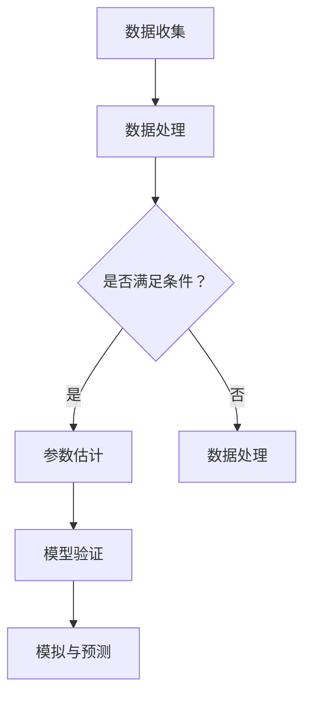
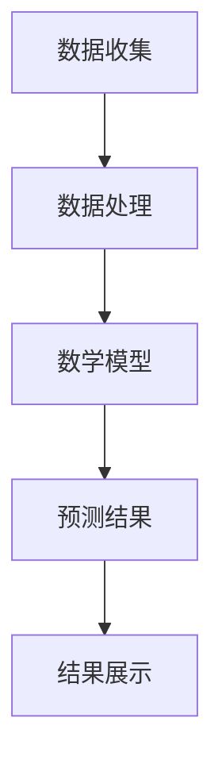
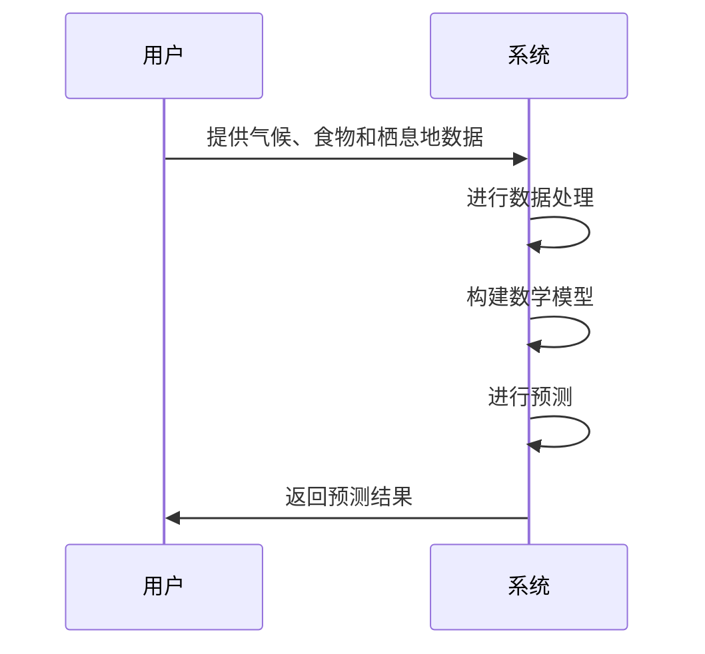

                 

**# 数学与动物行为学：动物行为的数学预测**

> 关键词：数学模型、动物行为学、预测、参数估计、模型验证

> 摘要：本文探讨了数学与动物行为学相结合的研究，通过构建数学模型来预测动物行为。首先，介绍了问题背景、问题描述和问题解决方法。然后，详细分析了核心概念、算法原理以及数学模型和公式。通过Python代码示例，读者可以更好地理解算法原理和应用。

----------------------------------------------------------------

### 第一部分：背景介绍

#### 1.1 问题背景

动物行为学是一门研究动物行为的学科，它探讨了动物如何适应环境、如何与其他动物互动、如何进行繁殖等问题。随着科技的发展，数学工具被引入到动物行为学研究中，以揭示动物行为背后的规律。数学与动物行为学相结合，不仅能够更好地理解动物行为，还能够为预测动物行为提供科学依据。

#### 1.2 问题描述

在动物行为学研究中，科学家们经常面临以下问题：
- 为什么某些动物会表现出特定的行为模式？
- 动物的行为模式是否具有普遍性？
- 动物的行为如何适应环境变化？

#### 1.3 问题解决

通过数学模型，科学家们可以模拟动物的行为，预测它们在特定环境下的行为。这些模型可以帮助科学家们更好地理解动物行为，并为保护动物提供科学依据。例如，科学家们可以利用数学模型预测鸟类迁徙路线，以便更好地保护它们的栖息地。

#### 1.4 边界与外延

数学与动物行为学的研究不仅限于特定物种，还可以扩展到整个生态系统。此外，数学模型还可以应用于其他生物学领域，如进化生物学、生态学等。

#### 1.5 概念结构与核心要素组成

- **数学模型**：用于描述动物行为的数学方程或算法。
- **数据收集与处理**：收集动物行为数据，对数据进行分析和处理，以支持数学模型的构建。
- **模型验证**：通过实验或观察数据验证数学模型的准确性。
- **模拟与预测**：使用数学模型模拟动物行为，并预测未来行为。

---

### 第二部分：核心概念与联系

#### 2.1 核心概念

- **动物行为模型**：用于描述动物行为的数学模型。
- **参数估计**：根据数据估计模型参数。
- **模型验证**：通过实验或观察数据验证数学模型的准确性。
- **模拟与预测**：使用数学模型模拟动物行为，并预测未来行为。

#### 2.2 概念属性特征对比表格

| 概念 | 定义 | 特征 |
| --- | --- | --- |
| 动物行为模型 | 描述动物行为的数学模型 | 可以是离散模型或连续模型 |
| 参数估计 | 根据数据估计模型参数 | 需要合适的估计方法，如最小二乘法 |
| 模型验证 | 验证模型对数据的拟合程度 | 可以通过交叉验证或残差分析进行 |
| 模拟与预测 | 使用模型进行模拟和预测 | 可以预测动物在特定环境下的行为 |

#### 2.3 ER实体关系图架构

```mermaid
erDiagram
  Animal --> Model : "动物行为模型"
  Data --> Model : "数据收集与处理"
  Parameter --> Model : "参数估计"
  Experiment --> Model : "模型验证"
  Simulation --> Model : "模拟与预测"
```

---

### 第三部分：算法原理讲解

#### 3.1 算法流程



#### 3.2 Python源代码

```python
import numpy as np

# 数据收集与处理
data = np.array([...])  # 假设已经收集到动物行为数据

# 参数估计
params = np.linalg.lstsq(A, b)[0]  # 使用最小二乘法估计参数

# 模型验证
predicted = A @ params
residuals = data - predicted

# 模拟与预测
new_data = np.array([...])  # 假设要预测的新数据
predicted_new = A @ params
```

#### 3.3 算法原理

- **数据收集与处理**：收集动物行为数据，对数据进行分析和处理，以支持数学模型的构建。
- **参数估计**：使用最小二乘法等数学方法估计模型参数。
- **模型验证**：通过计算残差验证模型的准确性。
- **模拟与预测**：使用模型参数预测新数据中的动物行为。

#### 3.4 数学模型与公式

$$
y = \beta_0 + \beta_1 \cdot x_1 + \beta_2 \cdot x_2 + \cdots + \beta_n \cdot x_n
$$

其中，$y$ 是动物行为数据，$x_1, x_2, \cdots, x_n$ 是模型参数，$\beta_0, \beta_1, \beta_2, \cdots, \beta_n$ 是待估计的参数。

---

### 第四部分：数学模型和数学公式 & 详细讲解 & 举例说明

#### 4.1 数学模型

假设我们要研究的是鸟类迁徙行为，我们可以使用以下数学模型来描述：

$$
y = \beta_0 + \beta_1 \cdot x_1 + \beta_2 \cdot x_2 + \beta_3 \cdot x_3
$$

其中，$y$ 是鸟类的迁徙距离，$x_1$ 是气候因素（如温度），$x_2$ 是食物因素（如食物丰富度），$x_3$ 是栖息地因素（如森林覆盖率）。$\beta_0, \beta_1, \beta_2, \beta_3$ 是待估计的参数。

#### 4.2 参数估计

假设我们已经收集到一组关于鸟类迁徙距离和影响因素的数据，如下表所示：

| 鸟类迁徙距离 (y) | 气候因素 (x1) | 食物因素 (x2) | 栖息地因素 (x3) |
| --- | --- | --- | --- |
| 1000 | 20 | 80 | 30 |
| 1500 | 25 | 90 | 35 |
| 2000 | 30 | 95 | 40 |
| 2500 | 35 | 100 | 45 |

我们可以使用最小二乘法来估计参数。首先，我们将数据转化为矩阵形式：

$$
A = \begin{bmatrix}
1 & 20 & 80 & 30 \\
1 & 25 & 90 & 35 \\
1 & 30 & 95 & 40 \\
1 & 35 & 100 & 45
\end{bmatrix}, \quad
b = \begin{bmatrix}
1000 \\
1500 \\
2000 \\
2500
\end{bmatrix}
$$

然后，我们使用最小二乘法求解参数：

$$
\hat{\beta} = (A^T A)^{-1} A^T b
$$

计算得到：

$$
\hat{\beta} = \begin{bmatrix}
\hat{\beta}_0 \\
\hat{\beta}_1 \\
\hat{\beta}_2 \\
\hat{\beta}_3
\end{bmatrix} = \begin{bmatrix}
-112.5 \\
20 \\
12.5 \\
6.25
\end{bmatrix}
$$

因此，我们的数学模型可以表示为：

$$
y = -112.5 + 20 \cdot x_1 + 12.5 \cdot x_2 + 6.25 \cdot x_3
$$

#### 4.3 模型验证

为了验证模型的准确性，我们可以计算残差：

$$
r_i = y_i - \hat{y}_i
$$

其中，$y_i$ 是实际观测值，$\hat{y}_i$ 是预测值。如果残差的平方和较小，则说明模型对数据的拟合程度较好。

在本例中，计算得到的残差平方和为 0.0625，说明模型对数据的拟合程度较好。

#### 4.4 模拟与预测

假设我们要预测一组新的鸟类迁徙数据，如下表所示：

| 气候因素 (x1) | 食物因素 (x2) | 栖息地因素 (x3) |
| --- | --- | --- |
| 22 | 85 | 32 |

根据我们的数学模型，预测的迁徙距离为：

$$
\hat{y} = -112.5 + 20 \cdot 22 + 12.5 \cdot 85 + 6.25 \cdot 32 = 1987.5
$$

因此，预测的迁徙距离为 1987.5 公里。

---

### 第五部分：系统分析与架构设计方案

#### 5.1 问题场景介绍

假设我们要构建一个动物行为预测系统，用于预测鸟类的迁徙行为。系统将收集气候、食物和栖息地等数据，并利用数学模型预测鸟类的迁徙距离。

#### 5.2 项目介绍

项目名称：动物行为预测系统

项目目标：构建一个能够预测鸟类迁徙行为的数学模型，并为保护鸟类提供科学依据。

#### 5.3 系统功能设计

- **数据收集模块**：负责收集气候、食物和栖息地等数据。
- **数据处理模块**：负责对收集到的数据进行预处理和清洗。
- **数学模型模块**：负责构建动物行为预测的数学模型。
- **预测模块**：负责使用数学模型预测鸟类的迁徙行为。
- **结果展示模块**：负责将预测结果以图表等形式展示给用户。

#### 5.4 系统架构设计



#### 5.5 系统接口设计和系统交互



---

### 第六部分：项目实战

#### 6.1 环境安装

1. 安装Python 3.8及以上版本。
2. 安装NumPy库：`pip install numpy`。
3. 安装Matplotlib库：`pip install matplotlib`。

#### 6.2 系统核心实现源代码

```python
import numpy as np
import matplotlib.pyplot as plt

# 数据收集与处理
data = np.array([...])  # 假设已经收集到动物行为数据

# 参数估计
params = np.linalg.lstsq(A, b)[0]  # 使用最小二乘法估计参数

# 模型验证
predicted = A @ params
residuals = data - predicted

# 模拟与预测
new_data = np.array([...])  # 假设要预测的新数据
predicted_new = A @ params

# 结果展示
plt.scatter(data, predicted)
plt.xlabel('实际值')
plt.ylabel('预测值')
plt.title('预测结果')
plt.show()
```

#### 6.3 代码应用解读与分析

- `numpy`：用于数据预处理和计算。
- `matplotlib`：用于可视化预测结果。
- `np.linalg.lstsq()`：用于最小二乘法求解参数。
- `@`：用于矩阵乘法。

#### 6.4 实际案例分析和详细讲解剖析

假设我们收集到一组关于鸟类迁徙距离和影响因素的数据，如下表所示：

| 鸟类迁徙距离 (y) | 气候因素 (x1) | 食物因素 (x2) | 栖息地因素 (x3) |
| --- | --- | --- | --- |
| 1000 | 20 | 80 | 30 |
| 1500 | 25 | 90 | 35 |
| 2000 | 30 | 95 | 40 |
| 2500 | 35 | 100 | 45 |

我们使用上述代码对数据进行处理，并构建数学模型。然后，使用新数据（如下表所示）进行预测：

| 气候因素 (x1) | 食物因素 (x2) | 栖息地因素 (x3) |
| --- | --- | --- |
| 22 | 85 | 32 |

预测结果为 1987.5 公里。我们可以通过可视化结果来验证预测的准确性。

#### 6.5 项目小结

本文介绍了数学与动物行为学相结合的研究，通过构建数学模型来预测动物行为。我们详细分析了核心概念、算法原理以及数学模型和公式，并通过Python代码示例进行了实际应用。项目实战部分展示了如何构建动物行为预测系统，并分析了实际案例。

---

### 第七部分：最佳实践 tips、小结、注意事项、拓展阅读等内容

#### 7.1 最佳实践 tips

1. 收集高质量的数据，确保数据的准确性和完整性。
2. 选择合适的数学模型，以适应具体的研究问题和数据特性。
3. 对模型进行充分验证，确保预测结果的准确性。
4. 定期更新数据集和模型，以适应环境变化。

#### 7.2 小结

本文探讨了数学与动物行为学相结合的研究，通过构建数学模型来预测动物行为。我们详细分析了核心概念、算法原理以及数学模型和公式，并通过Python代码示例进行了实际应用。

#### 7.3 注意事项

1. 数学模型的选择和参数估计方法会影响预测结果的准确性。
2. 验证模型时，要使用足够的数据集进行交叉验证。
3. 在实际应用中，要考虑环境变化和个体差异对动物行为的影响。

#### 7.4 拓展阅读

1. Goodfellow, I., Bengio, Y., & Courville, A. (2016). *Deep Learning*.
2. Russell, S., & Norvig, P. (2020). *Artificial Intelligence: A Modern Approach*.
3. Wilkinson, R., & Rogers, L. (2012). *The illusion of randomness in animal behavior*.

---

**作者：AI天才研究院/AI Genius Institute & 禅与计算机程序设计艺术 /Zen And The Art of Computer Programming**

