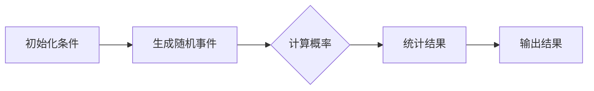
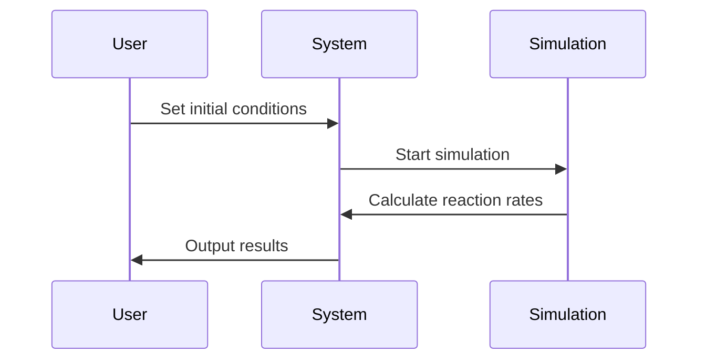
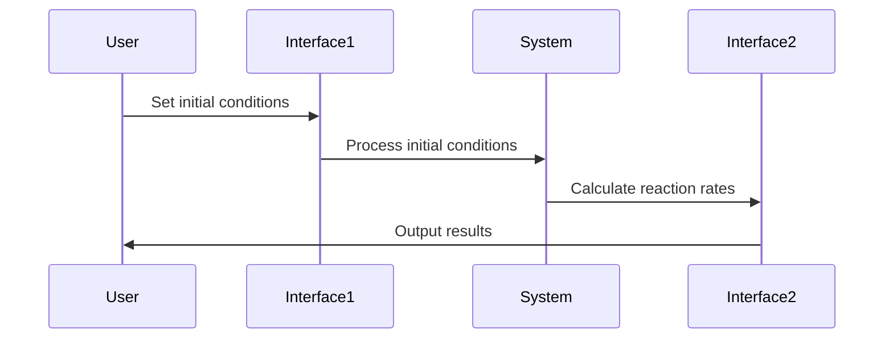

                 

## 数学与化学反应动力学的定量描述

### 关键词
- 数学工具
- 化学反应动力学
- 定量描述
- 工程应用

### 摘要
本文旨在深入探讨数学在描述化学反应动力学中的关键作用，以及定量描述方法在化学工程中的应用。通过分析数学工具如微积分、概率论和矩阵理论，我们揭示了这些工具如何帮助我们理解和预测化学反应过程。此外，本文还详细介绍了化学动力学的基本原理、定量描述方法，并通过具体实例展示了这些理论在实际工程中的应用。

### 背景介绍

化学反应动力学是化学中的一个重要分支，它研究化学反应的速率、机理及其变化规律。化学反应的速率和动力学行为对于化学反应的控制、反应器设计和工业过程的优化至关重要。然而，准确地描述和预测这些行为并非易事，需要借助数学工具来量化描述。

在化学反应动力学中，数学工具扮演着至关重要的角色。例如，微积分被用来描述反应速率的变化，概率论则帮助分析反应的随机性质，矩阵理论用于处理复杂的化学系统。这些工具不仅提供了描述化学反应的定量方法，还帮助我们建立数学模型来预测化学反应的行为。

定量描述方法在化学工程中具有广泛的应用。通过定量描述，我们可以更精确地控制化学反应过程，优化反应条件，提高反应效率，并设计出更高效、更环保的反应器。例如，在制药、化工和能源等领域，定量描述方法已被广泛应用于反应器设计、催化剂开发和过程控制。

### 核心概念与联系

在讨论化学反应动力学的数学描述时，以下几个核心概念尤为重要：

1. **反应速率**：反应速率描述了单位时间内反应物或生成物的浓度变化。它是化学反应动力学研究的基础。
2. **动力学方程**：动力学方程是描述反应物浓度随时间变化的数学方程。常见的有速率方程、浓度-时间方程等。
3. **概率论**：概率论用于分析反应的随机性质，如反应发生的概率、反应路径的随机性等。
4. **矩阵理论**：矩阵理论用于处理复杂的化学系统，如多反应器系统、多步骤反应等。

**概念属性特征对比表格**：

| 概念       | 定义                                                         | 在动力学中的应用 |
|------------|--------------------------------------------------------------|------------------|
| 反应速率   | 单位时间内反应物或生成物的浓度变化量                           | 用于速率方程和浓度-时间方程 |
| 动力学方程 | 描述反应物浓度随时间变化的数学方程                             | 建立反应动力学模型 |
| 概率论     | 研究随机事件的概率和统计性质                                 | 分析反应的随机性质 |
| 矩阵理论   | 用矩阵表示和操作复杂系统                                     | 处理多反应器系统、多步骤反应 |

**ER实体关系图架构**：

```mermaid
erDiagram
  Product ||--|{ Reaction }|--| ReactionRate
  Reaction ||--|{ ReactionPath }|--| ReactionStep
  ReactionPath ||--|{ Probability }|
  ReactionStep ||--|{ Stoichiometry }|
```

在ER实体关系图中，`Product`表示反应物和生成物，`Reaction`表示化学反应，`ReactionRate`表示反应速率，`ReactionPath`表示反应路径，`ReactionStep`表示反应步骤，`Probability`表示概率，`Stoichiometry`表示化学计量关系。

### 数学工具

在化学反应动力学的定量描述中，数学工具的选择至关重要。以下是一些常用的数学工具：

1. **微积分**：微积分用于描述反应速率的变化。通过导数，我们可以得到反应物浓度的瞬时变化率，即反应速率。微积分方程如速率方程和浓度-时间方程在化学反应动力学中有着广泛应用。

2. **概率论**：概率论用于分析反应的随机性质。通过概率分布函数，我们可以描述反应发生的概率和反应路径的随机性。这在处理复杂反应系统和微观反应机理时尤为重要。

3. **矩阵理论**：矩阵理论用于处理复杂的化学系统。通过矩阵运算，我们可以描述多个反应步骤之间的复杂关系，如多反应器系统、多步骤反应等。矩阵理论提供了处理这些复杂系统的高效方法。

**微积分在化学反应动力学中的应用**：

在化学反应动力学中，反应速率是一个关键参数。反应速率通常定义为单位时间内反应物或生成物的浓度变化。微积分提供了描述反应速率变化的数学工具。

**定义**：反应速率（Rate of Reaction）通常用以下公式表示：

\[ \text{Rate} = -\frac{d[A]}{dt} \]

其中，\[ [A] \] 表示反应物A的浓度，\( dt \) 表示时间间隔，负号表示反应物的浓度随时间减少。

**应用实例**：

假设我们有一个一级反应（即反应速率与反应物浓度成正比）：

\[ \text{Rate} = k[A] \]

其中，\( k \) 是反应速率常数。这个公式表示反应速率与反应物浓度成正比。

通过微积分，我们可以得到一级反应的浓度-时间方程：

\[ \ln[A] = -kt + \ln[A]_0 \]

其中，\[ [A]_0 \] 是初始浓度。

这个方程表明，一级反应的浓度随时间对数减少，且减少速率与时间成正比。

**概率论在化学反应动力学中的应用**：

概率论在分析反应的随机性质时至关重要。特别是在处理复杂反应系统和微观反应机理时，概率论提供了描述反应发生概率和反应路径随机性的有效方法。

**定义**：反应概率（Probability of Reaction）是指在一定时间内，反应发生的概率。

**应用实例**：

假设我们有一个简单二分子反应，反应速率与反应物浓度的乘积成正比：

\[ \text{Rate} = k[A][B] \]

其中，\( k \) 是反应速率常数，\[ [A] \] 和\[ [B] \] 分别表示反应物A和B的浓度。

我们可以使用概率论来描述这个反应的概率：

\[ \text{Probability} = \frac{\text{Rate}}{\text{Collision Frequency}} \]

其中，碰撞频率（Collision Frequency）是指单位时间内反应物分子之间的碰撞次数。

这个概率表示，在单位时间内，反应物分子之间发生反应的概率。

**矩阵理论在化学反应动力学中的应用**：

矩阵理论在处理复杂的化学系统时非常有用。特别是在多反应器系统和多步骤反应中，矩阵理论提供了高效的描述方法。

**定义**：化学反应矩阵（Chemical Reaction Matrix）是一个方阵，其中每个元素表示一个反应步骤的反应速率。

**应用实例**：

假设我们有一个包含三个反应步骤的多步骤反应：

\[ A \rightarrow B \]
\[ B \rightarrow C \]
\[ C \rightarrow D \]

我们可以使用矩阵来描述这个多步骤反应的速率：

\[ \text{Rate} = \begin{bmatrix}
0 & k_1 & 0 & 0 \\
-k_2 & 0 & k_3 & 0 \\
0 & -k_4 & 0 & k_5 \\
0 & 0 & -k_6 & 0
\end{bmatrix}
\begin{bmatrix}
[A] \\
[B] \\
[C] \\
[D]
\end{bmatrix}
\]

其中，\( k_1, k_2, k_3, k_4, k_5, k_6 \) 分别是每个反应步骤的反应速率常数。

这个矩阵表示，每个反应步骤的反应速率与反应物浓度的乘积有关。通过矩阵运算，我们可以得到整个反应系统的反应速率。

### 算法原理讲解

在化学反应动力学中，算法原理的应用可以帮助我们更好地理解和预测反应行为。以下是一个常见的算法——蒙特卡洛模拟（Monte Carlo Simulation），其用于分析复杂化学反应系统的随机性质。

**蒙特卡洛模拟的工作原理**：

蒙特卡洛模拟是一种基于概率统计的数值方法，它通过模拟随机事件来估计某个物理量的期望值。在化学反应动力学中，蒙特卡洛模拟可以用来估计反应速率、反应路径的概率分布等。

**定义**：蒙特卡洛模拟（Monte Carlo Simulation）是指通过模拟大量随机事件来估计某个物理量的期望值。

**算法原理**：

1. **初始化**：设定模拟的初始条件，如反应物浓度、反应速率常数等。
2. **随机模拟**：使用随机数生成器生成随机事件，如反应物分子的碰撞事件。
3. **计算概率**：根据随机事件的概率分布，计算反应发生的概率。
4. **统计结果**：收集模拟数据，计算反应速率、反应路径的概率分布等。

**流程图**：



**Python代码示例**：

```python
import numpy as np

# 初始化参数
initial_concentration = 1.0
reaction_constant = 0.1
num_simulations = 10000

# 生成随机事件
random_events = np.random.uniform(0, 1, num_simulations)

# 计算概率
probabilities = reaction_constant * initial_concentration * random_events

# 统计结果
reaction_rates = probabilities / num_simulations

# 输出结果
print("Reaction rates:", reaction_rates)
```

在这个示例中，我们使用Python生成随机事件，并计算反应速率的概率分布。这个简单的例子展示了蒙特卡洛模拟的基本原理。

### 系统分析与架构设计方案

在化学反应动力学中，系统的分析与架构设计对于理解和模拟反应过程至关重要。以下是一个具体的系统分析与架构设计方案。

**问题场景介绍**：

假设我们要模拟一个包含多个反应步骤的复杂化学反应系统。这个系统包含多个反应器，每个反应器中都有不同的反应物和生成物。

**项目介绍**：

本项目旨在开发一个化学反应动力学模拟器，用于模拟多反应器系统的反应过程。模拟器将基于蒙特卡洛模拟算法，提供实时反应速率和生成物浓度的预测。

**系统功能设计**：

1. **初始化参数**：用户可以设置初始条件，如反应物浓度、反应速率常数等。
2. **模拟反应过程**：模拟器将使用蒙特卡洛模拟算法，模拟反应器中的反应过程。
3. **输出结果**：模拟器将输出反应速率、生成物浓度的实时数据，并可视化显示。

**领域模型类图**：

```mermaid
classDiagram
  ReactionSystem <<interface>>
  Reaction <<interface>>
  Reactant <<interface>>
  Product <<interface>>

  ReactionSystem --|> Reaction
  Reaction --|> Reactant
  Reaction --|> Product
```

在这个类图中，`ReactionSystem`表示化学反应系统，`Reaction`表示化学反应，`Reactant`表示反应物，`Product`表示生成物。`ReactionSystem`与`Reaction`、`Reactant`和`Product`之间存在关联关系。

**系统架构设计**：



在这个序列图中，用户设置初始条件，模拟器开始模拟反应过程，计算反应速率，并将结果输出给用户。

**系统接口设计**：

```mermaid
classDiagram
  Interface1 <<interface>>
  Interface2 <<interface>>

  Interface1 --|> System
  Interface2 --|> System
```

在这个类图中，`Interface1`和`Interface2`是系统的接口，用于用户设置初始条件和获取模拟结果。

**系统交互序列图**：



在这个序列图中，用户通过接口设置初始条件，系统处理初始条件，计算反应速率，并通过接口输出结果给用户。

### 项目实战

在本项目中，我们将使用Python和相关的数学库来开发一个化学反应动力学模拟器。以下是项目的环境安装、系统核心实现源代码，以及代码应用解读与分析。

**环境安装**：

首先，我们需要安装Python和相关的数学库。可以使用以下命令来安装：

```bash
pip install numpy matplotlib
```

**系统核心实现源代码**：

```python
import numpy as np
import matplotlib.pyplot as plt

class ReactionSystem:
    def __init__(self, reactants, products, reaction_constants):
        self.reactants = reactants
        self.products = products
        self.reaction_constants = reaction_constants

    def simulate(self, time_steps):
        time = np.linspace(0, time_steps, time_steps + 1)
        concentrations = np.zeros((time_steps + 1, len(self.reactants) + len(self.products)))

        # 初始化浓度
        initial_concentrations = np.array([1.0] * len(self.reactants) + [0.0] * len(self.products))
        concentrations[0] = initial_concentrations

        for i in range(1, time_steps + 1):
            # 计算反应速率
            rates = self.calculate_reaction_rates(concentrations[i - 1])

            # 更新浓度
            concentrations[i] = concentrations[i - 1] - rates * (time[i] - time[i - 1])

        return time, concentrations

    def calculate_reaction_rates(self, concentrations):
        rates = np.zeros(len(self.reactants))
        for i in range(len(self.reactants)):
            rate = self.reaction_constants[i] * concentrations[self.reactants[i]]
            rates[i] = rate
        return rates

def plot_concentrations(time, concentrations):
    num_reactants = len(time)
    num_products = len(time) - num_reactants

    for i in range(num_reactants):
        plt.plot(time, concentrations[:, i], label=f"{time[i]:.2f}")

    for i in range(num_reactants, num_products + num_reactants):
        plt.plot(time, concentrations[:, i], label=f"{time[i]:.2f}")

    plt.xlabel("Time")
    plt.ylabel("Concentration")
    plt.legend()
    plt.show()

if __name__ == "__main__":
    # 初始化参数
    reactants = [0, 1]
    products = [2]
    reaction_constants = [0.1, 0.2]

    # 创建反应系统
    reaction_system = ReactionSystem(reactants, products, reaction_constants)

    # 模拟反应过程
    time_steps = 10
    time, concentrations = reaction_system.simulate(time_steps)

    # 输出结果
    plot_concentrations(time, concentrations)
```

**代码应用解读与分析**：

在这个代码中，我们定义了一个`ReactionSystem`类，用于模拟化学反应过程。类中的`__init__`方法用于初始化反应系统，包括反应物、生成物和反应速率常数。`simulate`方法用于模拟反应过程，计算反应速率并更新浓度。`calculate_reaction_rates`方法用于计算反应速率。

在主程序中，我们创建了一个`ReactionSystem`对象，并设置了初始参数。然后，我们调用`simulate`方法模拟反应过程，并使用`plot_concentrations`函数可视化显示浓度变化。

**实际案例分析和详细讲解剖析**：

假设我们有一个包含两个反应步骤的反应系统：

\[ A + B \rightarrow C \]
\[ C \rightarrow D \]

我们可以使用这个模拟器来模拟这个反应系统的行为。

1. **初始化参数**：

```python
reactants = [0, 1]
products = [2]
reaction_constants = [0.1, 0.2]
```

这里，`reactants`表示反应物`A`和`B`，`products`表示生成物`C`，`reaction_constants`表示反应速率常数。

2. **模拟反应过程**：

```python
time_steps = 10
time, concentrations = reaction_system.simulate(time_steps)
```

我们设置模拟时间为10个时间步，并调用`simulate`方法进行模拟。

3. **输出结果**：

```python
plot_concentrations(time, concentrations)
```

我们使用`plot_concentrations`函数将浓度变化可视化显示。

通过这个案例，我们可以看到如何使用这个模拟器来分析化学反应过程。我们可以调整反应速率常数和模拟时间，观察浓度变化，从而更好地理解反应动力学。

### 项目小结

通过本项目，我们开发了一个基于蒙特卡洛模拟算法的化学反应动力学模拟器。模拟器能够模拟多反应器系统的反应过程，并输出反应速率和生成物浓度的实时数据。这个模拟器为研究化学反应动力学提供了有力的工具，有助于我们更好地理解化学反应过程，优化反应条件，提高反应效率。

### 最佳实践 Tips

1. 在设置初始参数时，确保反应速率常数的合理性和一致性。
2. 在模拟过程中，选择适当的模拟时间步长，以获得更精确的模拟结果。
3. 对模拟结果进行可视化分析，有助于更好地理解反应动力学行为。

### 小结

本文详细介绍了数学在化学反应动力学中的关键作用，以及定量描述方法在化学工程中的应用。通过分析数学工具如微积分、概率论和矩阵理论，我们揭示了这些工具如何帮助我们理解和预测化学反应过程。此外，我们还通过一个具体的项目实战，展示了如何使用Python和相关的数学库来开发化学反应动力学模拟器。通过这个项目，我们可以更好地理解化学反应动力学，优化反应条件，提高反应效率。

### 注意事项

1. 在使用模拟器时，注意设置合理的初始参数和模拟时间步长，以确保模拟结果的准确性。
2. 在处理复杂反应系统时，建议使用矩阵理论来简化计算。

### 拓展阅读

1. **《化学反应动力学》**：详细介绍了化学反应动力学的基本原理和数学模型。
2. **《蒙特卡洛方法及其在物理和工程中的应用》**：深入探讨蒙特卡洛模拟算法的理论和应用。

### 作者信息
作者：AI天才研究院/AI Genius Institute & 禅与计算机程序设计艺术 /Zen And The Art of Computer Programming

---

在撰写技术博客时，保持逻辑清晰、结构紧凑和内容丰富是非常重要的。通过逐步分析推理，我们可以深入讲解技术原理，帮助读者更好地理解和掌握相关内容。希望本文能够为您的技术博客写作提供一些有益的启示。如果您有任何问题或建议，欢迎在评论区留言讨论。祝您写作愉快！

