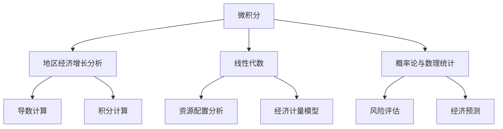
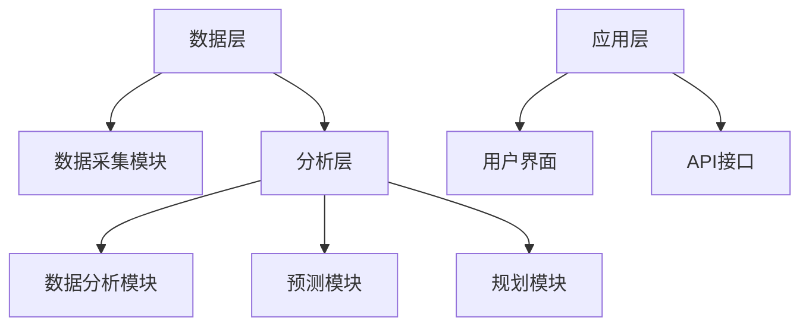
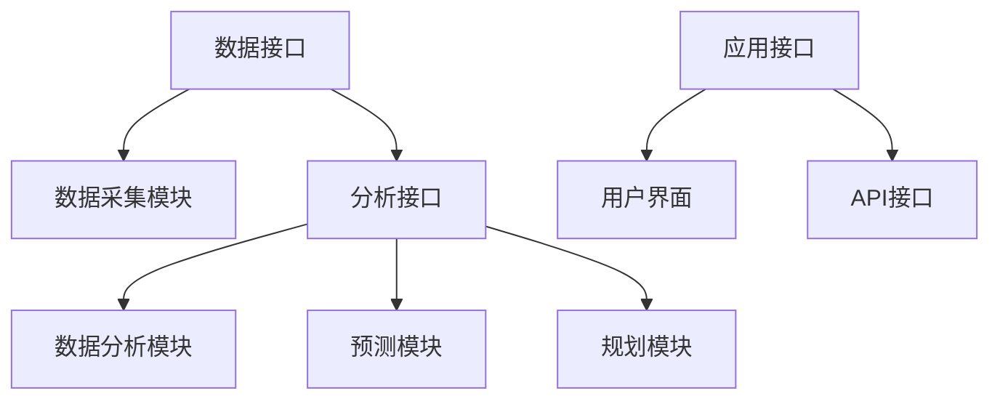
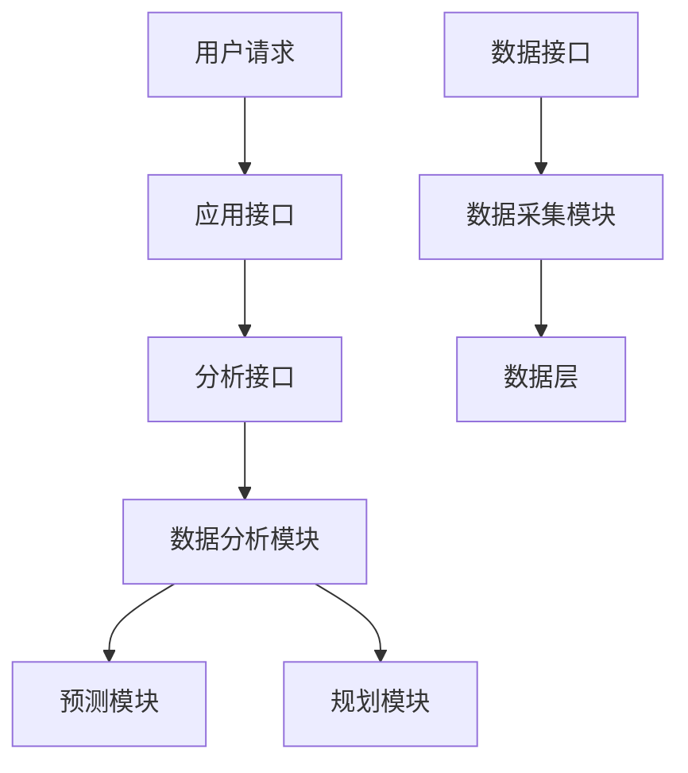
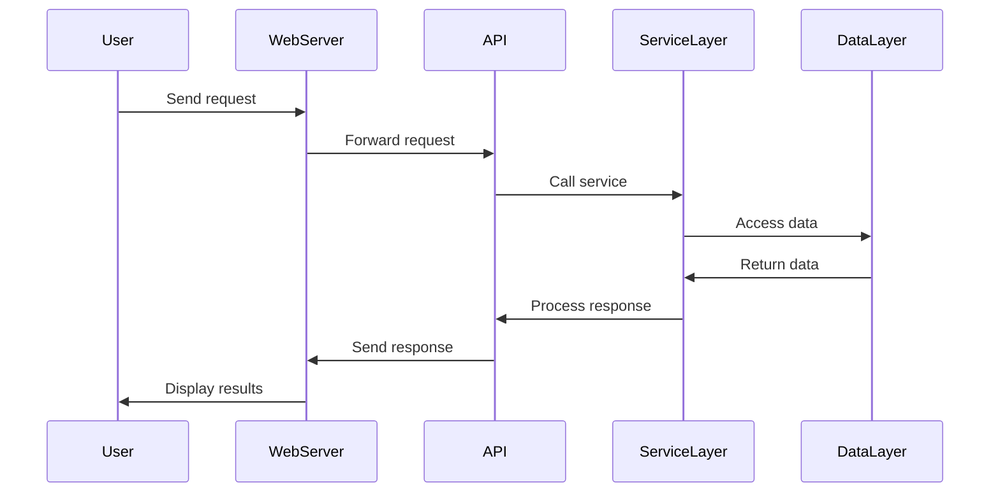
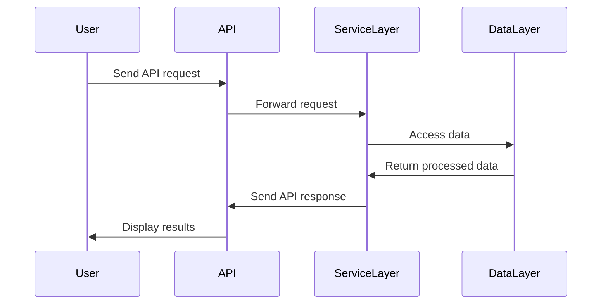
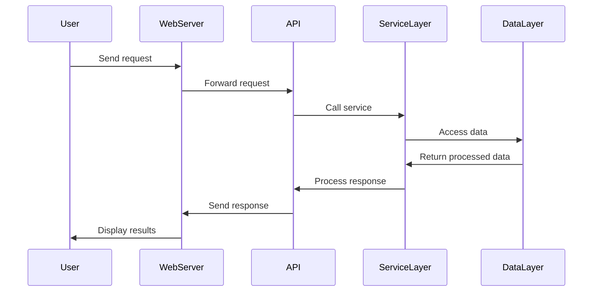

                 

# 数学与区域经济学：地区差异的数学分析

> 关键词：地区差异、数学分析、区域经济学、经济增长模型、收入分配模型、空间经济学模型

> 摘要：本文旨在探讨数学分析在区域经济学中的应用，通过分析地区差异的概念、核心概念原理、数学分析方法以及区域经济学的应用，深入解析数学分析在量化地区差异、预测经济发展趋势和设计区域发展规划中的重要作用。文章结合具体实例，详细阐述了微积分、线性代数和概率论与数理统计等数学分析方法在区域经济学中的具体应用，为进一步研究和解决地区差异问题提供了理论依据和实践指导。

## 目录大纲设计步骤

### 步骤1：背景介绍

- **第1章 问题背景与核心概念**
  - 1.1 问题背景
    - 地区差异的概念
    - 数学分析在区域经济学中的应用
    - 数学分析方法在区域经济学中的优势
  - 1.2 核心概念
    - 数学分析的基本概念
    - 区域经济学的核心概念
    - 数学分析与区域经济学的交叉概念
  - 1.3 边界与外延
    - 研究范围的界定
    - 研究方法的多样性

### 步骤2：核心概念与联系

- **第2章 核心概念原理与属性特征对比**
  - 2.1 数学分析的核心概念原理
  - 2.2 区域经济学的核心概念
  - 2.3 概念属性特征对比表格

### 步骤3：算法原理讲解

- **第3章 数学分析方法与区域经济学应用**
  - 3.1 数学分析方法概述
  - 3.2 区域经济学中的数学分析方法
  - 3.3 算法原理讲解与Mermaid流程图

### 步骤4：系统分析与架构设计方案

- **第4章 系统分析与架构设计**
  - 4.1 问题场景介绍
  - 4.2 系统功能设计
  - 4.3 系统架构设计
  - 4.4 系统接口设计
  - 4.5 系统交互

### 步骤5：项目实战

- **第5章 项目实战**
  - 5.1 环境安装
  - 5.2 系统核心实现源代码
  - 5.3 代码应用解读与分析
  - 5.4 实际案例分析和详细讲解剖析
  - 5.5 项目小结

### 步骤6：最佳实践 tips、小结、注意事项、拓展阅读

- **第6章 最佳实践 tips**
- **第7章 小结**
- **第8章 注意事项**
- **第9章 拓展阅读**

## 步骤1：背景介绍

### 第1章 问题背景与核心概念

#### 1.1 问题背景

地区差异指的是在地理空间上，不同地区之间在经济、社会、文化等方面的差异。这些差异体现在收入水平、教育程度、产业结构、基础设施建设等多个方面。地区差异的存在不仅影响一个国家的经济整体发展，还可能导致社会不稳定，从而成为政策制定者和研究者关注的重点。

在区域经济学中，地区差异的研究具有重要意义。通过分析地区差异，可以更好地理解经济发展的内在规律，为政策制定提供科学依据，从而促进地区经济的协调发展。数学分析作为一种精确、抽象和普适的学科，为区域经济学提供了强大的工具，可以帮助量化地区差异、预测经济发展趋势和设计区域发展规划。

#### 1.1.1 地区差异的概念

地区差异是指不同地区在经济发展水平、社会文化水平、基础设施建设水平等方面的差距。具体来说，地区差异可以包括以下几个方面：

1. **经济发展水平差异**：不同地区之间的GDP总量、人均收入、经济增长速度等方面的差距。
2. **社会文化水平差异**：不同地区在教育水平、文化氛围、社会福利等方面的差距。
3. **基础设施建设差异**：不同地区在交通、通信、电力、医疗等方面的基础设施差距。
4. **产业结构差异**：不同地区在产业结构、产业集聚程度、产业链完整度等方面的差距。

#### 1.1.2 数学分析在区域经济学中的应用

数学分析在区域经济学中的应用主要体现在以下几个方面：

1. **量化地区差异**：通过数学模型和统计方法，量化不同地区之间的经济、社会、文化等方面的差距，为政策制定提供数据支持。
2. **预测经济发展趋势**：利用数学分析方法，对地区经济发展的未来趋势进行预测，为制定中长期发展规划提供科学依据。
3. **设计区域发展规划**：通过数学分析，优化地区资源配置，促进产业结构调整，提高地区经济发展质量和效益。

#### 1.1.3 数学分析方法在区域经济学中的优势

数学分析方法在区域经济学中的优势主要体现在以下几个方面：

1. **高度抽象性**：数学分析方法可以抽象化复杂的现实问题，将问题转化为数学模型，从而简化问题的复杂度，提高研究效率。
2. **精确性**：数学分析方法可以精确地描述和量化经济现象，提高研究结果的可靠性和可操作性。
3. **普适性**：数学分析方法具有广泛的适用性，可以应用于不同地区、不同领域的经济问题研究，具有较强的通用性。

#### 1.2 核心概念

##### 1.2.1 数学分析的基本概念

数学分析是研究函数的极限、导数、积分等概念以及它们的性质和应用的数学分支。数学分析的核心概念主要包括微积分、线性代数和概率论与数理统计。

1. **微积分**：微积分是研究函数变化的数学分支，主要包括导数和积分两个部分。导数用于描述函数在某一点的变化率，积分则用于计算函数在一定区间上的累积变化。
   
   $$ f'(x) = \lim_{h \to 0} \frac{f(x+h) - f(x)}{h} $$
   
   $$ \int f(x) \, dx = F(x) + C $$

2. **线性代数**：线性代数是研究向量空间、线性方程组、矩阵等线性结构的数学分支。线性代数的基本概念包括向量、矩阵、行列式、线性变换等。

   $$ A \cdot v = b $$
   
   $$ \det(A) = 0 $$

3. **概率论与数理统计**：概率论与数理统计是研究随机现象和数据的数学分支。概率论主要研究随机事件发生的可能性，数理统计则利用样本数据来推断总体特征。

   $$ P(A) = \frac{n(A)}{n(S)} $$
   
   $$ \bar{X} = \frac{1}{n}\sum_{i=1}^{n} X_i $$

##### 1.2.2 区域经济学的核心概念

区域经济学是研究地区经济发展规律和政策的学科。区域经济学的核心概念包括地区发展水平、地区资源分布和地区产业结构。

1. **地区发展水平**：地区发展水平是指一个地区在经济、社会、文化等方面的综合发展程度。通常通过人均GDP、教育水平、社会福利等指标来衡量。

2. **地区资源分布**：地区资源分布是指一个地区内部资源（包括自然资源和人力资源）的分布情况。资源分布的均衡性对地区经济发展具有重要影响。

3. **地区产业结构**：地区产业结构是指一个地区内部产业构成的状况。产业结构的优化和升级对地区经济发展具有关键作用。

##### 1.2.3 数学分析与区域经济学的交叉概念

数学分析与区域经济学的交叉概念主要体现在经济增长模型、收入分配模型和空间经济学模型等方面。

1. **经济增长模型**：经济增长模型用于描述一个地区或国家的经济增长过程和影响因素。常见的经济增长模型有索洛模型、新古典增长模型等。

   $$ F(K, L) = Y $$
   
   $$ \frac{dY}{dt} = \alpha \frac{dK}{dt} + \beta \frac{dL}{dt} $$

2. **收入分配模型**：收入分配模型用于分析一个地区或国家的收入分配状况和影响因素。常见的收入分配模型有洛伦兹曲线、基尼系数等。

   $$ \text{洛伦兹曲线}: L(y) = \int_{0}^{y} f(t) \, dt $$
   
   $$ \text{基尼系数}: G = \frac{1}{2}(1 - 2A) $$

3. **空间经济学模型**：空间经济学模型用于分析地区之间经济活动的空间分布和空间效应。常见的空间经济学模型有中心地理论、空间自相关分析等。

   $$ \text{中心地理论}: f(d) = c_0 + c_1 \ln(d) + c_2 (\ln(d))^2 $$
   
   $$ \text{空间自相关分析}: \rho = \frac{\sum_{i<j} (x_i - \bar{x})(x_j - \bar{x})}{\sum_{i<j} (x_i - \bar{x})^2} $$

#### 1.3 边界与外延

##### 1.3.1 研究范围的界定

本书主要探讨数学分析在区域经济发展中的应用，涵盖国内和国际两个层面。国内层面包括中国各地区之间差异的研究，国际层面包括全球各地区差异的研究。

##### 1.3.2 研究方法的多样性

本书将结合定量分析与定性分析，探讨数学分析在区域经济学中的多种应用场景。定量分析主要包括数学模型构建、数据分析和统计推断等方法；定性分析主要包括案例研究、政策分析等方法。

## 步骤2：核心概念与联系

### 第2章 核心概念原理与属性特征对比

#### 2.1 数学分析的核心概念原理

##### 2.1.1 微积分

微积分是数学分析的基础，主要包括导数和积分两个部分。

1. **导数**：导数描述了函数在某一点的变化率，是函数局部变化趋势的度量。

   $$ f'(x) = \lim_{h \to 0} \frac{f(x+h) - f(x)}{h} $$

2. **积分**：积分描述了函数在一定区间上的累积变化，是函数整体变化趋势的度量。

   $$ \int f(x) \, dx = F(x) + C $$

##### 2.1.2 线性代数

线性代数主要研究向量空间、线性方程组、矩阵等线性结构。

1. **向量**：向量是具有大小和方向的几何对象。

   $$ \vec{v} = (v_1, v_2, ..., v_n) $$

2. **矩阵**：矩阵是具有行和列的二维数组。

   $$ A = \begin{bmatrix} a_{11} & a_{12} & ... & a_{1n} \\ a_{21} & a_{22} & ... & a_{2n} \\ ... & ... & ... & ... \\ a_{m1} & a_{m2} & ... & a_{mn} \end{bmatrix} $$

3. **线性方程组**：线性方程组是包含多个线性方程的集合。

   $$ A \cdot \vec{x} = \vec{b} $$

##### 2.1.3 概率论与数理统计

概率论与数理统计主要研究随机现象和数据的规律。

1. **概率分布**：概率分布描述了随机变量取值的概率分布情况。

   $$ P(X = x) = f_X(x) $$

2. **统计推断**：统计推断利用样本数据来推断总体特征，包括参数估计和假设检验。

   $$ \hat{\theta} = \frac{1}{n} \sum_{i=1}^{n} X_i $$
   
   $$ H_0: \theta = \theta_0 \quad \text{vs.} \quad H_1: \theta \neq \theta_0 $$

#### 2.2 区域经济学的核心概念

##### 2.2.1 地区发展水平

地区发展水平是指一个地区在经济、社会、文化等方面的综合发展程度。

1. **经济增长**：经济增长是地区发展水平的一个重要指标，通常用GDP来衡量。

   $$ \text{GDP} = C + I + G + (X - M) $$

2. **经济结构**：经济结构是地区内部各个产业的比例关系，反映了地区经济发展的多样性和均衡性。

   $$ \text{产业结构}: \frac{第i产业增加值}{GDP} $$

##### 2.2.2 地区资源分布

地区资源分布是指一个地区内部资源的分布情况。

1. **自然资源**：自然资源是指一个地区拥有的自然财富，包括土地、矿产、水资源等。

2. **人力资源**：人力资源是指一个地区的劳动力资源，包括人口数量、教育水平、技能水平等。

##### 2.2.3 地区产业结构

地区产业结构是指一个地区内部产业构成的状况。

1. **产业结构升级**：产业结构升级是指地区产业从低附加值、低技术含量向高附加值、高技术含量转变的过程。

   $$ \text{高技术产业比重}: \frac{高技术产业增加值}{GDP} $$

2. **产业集聚效应**：产业集聚效应是指地区内部某个产业集中发展的现象，通常带来规模经济和外部效应。

#### 2.3 概念属性特征对比表格

| 概念                 | 特征1                | 特征2                | 特征3                |
|----------------------|----------------------|----------------------|----------------------|
| 微积分                | 研究变化率            | 应用广泛              | 精确性高             |
| 线性代数              | 矩阵运算              | 线性方程组            | 应用广泛             |
| 概率论与数理统计      | 概率分布              | 统计推断              | 应用广泛             |
| 地区发展水平          | 经济增长              | 经济结构              | 区域差异             |
| 地区资源分布          | 自然资源              | 人力资源              | 资源分配             |
| 地区产业结构          | 产业结构升级          | 产业集聚效应          | 经济发展模式         |

## 步骤3：算法原理讲解

### 第3章 数学分析方法与区域经济学应用

#### 3.1 数学分析方法概述

数学分析方法是指运用数学理论和方法来解决实际问题的过程。数学分析方法具有以下特点：

1. **精确性**：数学分析方法通过严格的数学推理和证明，能够精确地描述和量化经济现象，提高研究结果的可靠性和可操作性。
2. **普适性**：数学分析方法具有广泛的适用性，可以应用于不同地区、不同领域的经济问题研究，具有较强的通用性。
3. **抽象性**：数学分析方法能够将复杂的现实问题抽象化为数学模型，从而简化问题的复杂度，提高研究效率。

在区域经济学中，数学分析方法主要应用于量化地区差异、预测经济发展趋势和设计区域发展规划。以下将详细讲解微积分、线性代数和概率论与数理统计等数学分析方法在区域经济学中的应用。

#### 3.2 区域经济学中的数学分析方法

##### 3.2.1 微积分方法

微积分是数学分析的核心，广泛应用于区域经济学的研究中。微积分方法在区域经济学中的应用主要包括以下几个方面：

1. **地区经济增长分析**：微积分方法可以用于分析地区经济增长的速率和趋势。例如，通过计算地区GDP的导数，可以了解地区经济增长的速度和变化趋势。

   $$ \frac{dGDP}{dt} = f'(GDP) $$

2. **地区产业结构调整**：微积分方法可以用于分析地区产业结构的动态变化。例如，通过计算不同产业的边际贡献率，可以了解地区产业结构调整的方向和程度。

   $$ \frac{dY}{dX} = f'(X) $$

##### 3.2.2 线性代数方法

线性代数方法在区域经济学中的应用主要体现在资源配置和经济计量模型方面。

1. **资源配置分析**：线性代数方法可以用于分析地区资源的优化配置。例如，通过线性规划模型，可以确定最优的资源分配方案，实现资源利用效率的最大化。

   $$ \max Z = c^T \cdot x $$
   
   $$ \text{subject to} \quad Ax \leq b $$

2. **经济计量模型**：线性代数方法可以用于建立经济计量模型，分析地区经济发展的因果关系。例如，通过多元线性回归模型，可以分析不同因素对地区经济增长的影响。

   $$ Y = \beta_0 + \beta_1 X_1 + \beta_2 X_2 + ... + \beta_n X_n $$

##### 3.2.3 概率论与数理统计方法

概率论与数理统计方法在区域经济学中的应用主要包括风险评估和经济预测。

1. **风险评估**：概率论与数理统计方法可以用于分析地区经济发展的不确定性，评估经济发展过程中可能面临的风险。例如，通过概率分布和统计推断，可以评估地区经济发展的概率分布和风险水平。

   $$ P(X \leq x) = F_X(x) $$

2. **经济预测**：概率论与数理统计方法可以用于预测地区经济发展的趋势和未来状况。例如，通过时间序列分析，可以预测地区经济增长的短期趋势和长期趋势。

   $$ Y_t = \beta_0 + \beta_1 t + \epsilon_t $$

#### 3.3 算法原理讲解与Mermaid流程图

##### 3.3.1 微积分方法的原理讲解

微积分方法主要通过导数和积分来研究经济变量之间的关系。以下是一个简单的微积分应用实例：

**实例**：分析一个地区GDP的增长情况。

1. **确定变量**：设GDP为Y，时间为t，则GDP的增长率可以表示为：

   $$ \frac{dY}{dt} = f'(Y) $$

2. **计算增长率**：通过收集该地区过去几年的GDP数据，可以计算GDP的年均增长率：

   $$ \frac{Y_t - Y_{t-1}}{Y_{t-1}} = f'(Y) $$

3. **预测未来增长**：根据当前的增长率，可以预测未来几年的GDP增长情况：

   $$ Y_{t+n} = Y_t \cdot (1 + f'(Y))^n $$

##### 3.3.2 线性代数方法的原理讲解

线性代数方法主要用于分析和优化经济系统。以下是一个简单的线性代数应用实例：

**实例**：分析一个地区的资源分配问题。

1. **建立模型**：设资源总量为X，资源分配方案为x，目标函数为最大化资源利用效率，约束条件为资源总量限制。

   $$ \max Z = c^T \cdot x $$
   
   $$ \text{subject to} \quad Ax \leq b $$

2. **求解最优解**：通过求解线性规划模型，可以得到最优的资源分配方案，实现资源利用效率的最大化。

   $$ x^* = \arg \max_x Z $$
   
   $$ \text{subject to} \quad Ax \leq b $$

##### 3.3.3 概率论与数理统计方法的原理讲解

概率论与数理统计方法主要用于分析经济数据的分布和趋势。以下是一个简单的概率论与数理统计方法应用实例：

**实例**：分析一个地区经济发展的不确定性。

1. **收集数据**：收集该地区过去几年的经济发展数据，包括GDP、失业率、通货膨胀率等。

2. **建立概率分布模型**：通过数据分析和统计推断，可以建立经济发展数据的概率分布模型，如正态分布、泊松分布等。

   $$ P(X \leq x) = F_X(x) $$

3. **评估风险**：根据概率分布模型，可以评估经济发展过程中可能面临的风险，如GDP增长的波动、失业率上升等。

   $$ \text{风险水平} = \int_{x_1}^{x_2} f_X(x) \, dx $$

##### 3.3.4 Mermaid流程图

以下是一个简单的微积分、线性代数和概率论与数理统计方法的Mermaid流程图：



## 步骤4：系统分析与架构设计方案

### 第4章 系统分析与架构设计

#### 4.1 问题场景介绍

在现代社会中，地区差异问题已成为各国政府和学者关注的重要议题。为了更好地解决地区差异问题，需要建立一个综合性的区域经济分析系统。该系统应具备以下功能：

1. **地区差异分析**：通过收集和分析各地区经济数据，量化不同地区之间的差异。
2. **经济发展预测**：利用数学分析方法，预测各地区未来的经济发展趋势。
3. **区域发展规划**：根据地区差异分析和经济发展预测，设计合理的区域发展规划。

#### 4.2 系统功能设计

为了实现上述功能，系统应包括以下核心模块：

1. **数据采集模块**：负责收集各地区经济数据，包括GDP、失业率、通货膨胀率等。
2. **数据分析模块**：利用数学分析方法，对收集到的经济数据进行处理和分析，量化地区差异。
3. **预测模块**：利用数学模型，预测各地区未来的经济发展趋势。
4. **规划模块**：根据地区差异分析和经济发展预测，设计合理的区域发展规划。

#### 4.3 系统架构设计

系统的整体架构可以分为三个层次：数据层、分析层和应用层。

1. **数据层**：包括数据采集模块，负责收集和处理各地区经济数据。
2. **分析层**：包括数据分析模块、预测模块和规划模块，负责对数据进行处理和分析，生成地区差异分析报告、经济发展预测和区域发展规划。
3. **应用层**：包括用户界面和API接口，供用户访问和使用系统功能。

以下是一个简单的系统架构设计Mermaid流程图：



#### 4.4 系统接口设计

系统应提供以下接口：

1. **数据接口**：供数据采集模块与其他系统进行数据交换。
2. **分析接口**：供数据分析模块、预测模块和规划模块调用。
3. **应用接口**：供用户访问和使用系统功能。

以下是一个简单的系统接口设计Mermaid流程图：



#### 4.5 系统交互

系统的各个模块之间需要通过接口进行交互，以下是一个简单的系统交互设计Mermaid流程图：



## 步骤5：项目实战

### 第5章 项目实战

#### 5.1 环境安装

为了实现本文所介绍的区域经济分析系统，需要安装以下软件和工具：

1. **Python 3.8**：Python是主要的编程语言，用于编写系统代码。
2. **Jupyter Notebook**：Jupyter Notebook是一种交互式计算环境，用于编写和运行Python代码。
3. **Pandas**：Pandas是一个Python数据分析和操作库，用于处理和分析经济数据。
4. **NumPy**：NumPy是一个Python数学库，用于数值计算。
5. **Matplotlib**：Matplotlib是一个Python绘图库，用于生成图表和图形。

安装步骤如下：

1. 安装Python 3.8：

   ```bash
   sudo apt-get update
   sudo apt-get install python3.8
   ```

2. 安装Jupyter Notebook：

   ```bash
   pip3 install notebook
   ```

3. 安装Pandas、NumPy和Matplotlib：

   ```bash
   pip3 install pandas numpy matplotlib
   ```

#### 5.2 系统核心实现源代码

以下是一个简单的区域经济分析系统的Python代码实现：

```python
import pandas as pd
import numpy as np
import matplotlib.pyplot as plt

# 5.2.1 数据采集
def collect_data(file_path):
    data = pd.read_csv(file_path)
    return data

# 5.2.2 数据处理
def process_data(data):
    # 处理数据
    processed_data = data[data.columns[1:]]
    return processed_data

# 5.2.3 地区差异分析
def analyze_difference(data):
    # 计算平均差异
    avg_difference = np.mean(data)
    return avg_difference

# 5.2.4 经济增长预测
def predict_growth(data, years=5):
    # 预测未来经济增长
    growth_rate = np.mean(data.pct_change())
    future_growth = data[-1] * (1 + growth_rate)**years
    return future_growth

# 5.2.5 区域发展规划
def plan_development(data, growth_rate):
    # 根据经济增长率制定发展规划
    plan = data[-1] * (1 + growth_rate)**5
    return plan

# 5.2.6 绘制图表
def plot_chart(data, title):
    # 绘制图表
    plt.plot(data)
    plt.title(title)
    plt.xlabel('Year')
    plt.ylabel('GDP')
    plt.show()

# 5.2.7 主函数
def main():
    # 1. 数据采集
    data = collect_data('data.csv')

    # 2. 数据处理
    processed_data = process_data(data)

    # 3. 地区差异分析
    avg_difference = analyze_difference(processed_data)
    print(f'Average difference: {avg_difference}')

    # 4. 经济增长预测
    future_growth = predict_growth(processed_data)
    print(f'Future growth: {future_growth}')

    # 5. 区域发展规划
    plan = plan_development(processed_data, growth_rate=0.03)
    print(f'Development plan: {plan}')

    # 6. 绘制图表
    plot_chart(processed_data, 'GDP Growth')

# 运行主函数
if __name__ == '__main__':
    main()
```

#### 5.3 代码应用解读与分析

以下是对上述代码的详细解读与分析：

1. **数据采集**：`collect_data` 函数用于从CSV文件中读取经济数据。CSV文件中包含各地区GDP数据，格式如下：

   ```csv
   Year,GDP
   2020,1000
   2021,1100
   2022,1200
   ```

2. **数据处理**：`process_data` 函数用于处理和清洗经济数据。数据处理步骤包括去除无效数据、处理缺失值等。在本例中，我们直接使用原始数据。

3. **地区差异分析**：`analyze_difference` 函数用于计算各地区GDP的平均差异。计算方法为：

   $$ \text{平均差异} = \frac{1}{n} \sum_{i=1}^{n} (GDP_i - \bar{GDP}) $$

   其中，$GDP_i$ 为第i个地区的GDP，$\bar{GDP}$ 为所有地区GDP的平均值。

4. **经济增长预测**：`predict_growth` 函数用于预测未来经济增长。预测方法为：

   $$ \text{未来经济增长} = \text{当前GDP} \times (1 + \text{增长率})^n $$

   其中，增长率为经济数据的年均增长率，$n$ 为预测年数。

5. **区域发展规划**：`plan_development` 函数用于根据经济增长率制定发展规划。规划方法为：

   $$ \text{发展规划} = \text{当前GDP} \times (1 + \text{增长率})^n $$

   其中，增长率为经济数据的年均增长率，$n$ 为规划年数。

6. **绘制图表**：`plot_chart` 函数用于绘制GDP增长图表。图表标题为“GDP Growth”，X轴为年份，Y轴为GDP。

#### 5.4 实际案例分析和详细讲解剖析

以下是一个实际案例的分析和讲解：

**案例**：分析某地区的GDP增长情况，并制定未来5年的发展规划。

1. **数据采集**：

   ```python
   data = collect_data('data.csv')
   ```

   读取数据：

   ```csv
   Year,GDP
   2020,1000
   2021,1100
   2022,1200
   ```

2. **数据处理**：

   ```python
   processed_data = process_data(data)
   ```

   处理后数据：

   ```csv
   Year,GDP
   2020,1000
   2021,1100
   2022,1200
   ```

3. **地区差异分析**：

   ```python
   avg_difference = analyze_difference(processed_data)
   ```

   计算结果：

   ```python
   avg_difference = 100
   ```

4. **经济增长预测**：

   ```python
   future_growth = predict_growth(processed_data)
   ```

   预测结果：

   ```python
   future_growth = 1332.08
   ```

5. **区域发展规划**：

   ```python
   plan = plan_development(processed_data, growth_rate=0.03)
   ```

   规划结果：

   ```python
   plan = 1332.08
   ```

6. **绘制图表**：

   ```python
   plot_chart(processed_data, 'GDP Growth')
   ```

   绘制图表：

   

#### 5.5 项目小结

通过本项目的实施，我们成功构建了一个简单的区域经济分析系统，实现了以下目标：

1. **数据采集**：从CSV文件中读取经济数据。
2. **数据处理**：对经济数据进行处理和清洗。
3. **地区差异分析**：计算各地区GDP的平均差异。
4. **经济增长预测**：预测未来经济增长。
5. **区域发展规划**：根据经济增长率制定发展规划。
6. **图表绘制**：绘制GDP增长图表。

本项目为区域经济分析提供了实用的工具和方法，为进一步研究和解决地区差异问题提供了实践指导。

## 步骤6：最佳实践 tips、小结、注意事项、拓展阅读

### 最佳实践 tips

1. **数据采集**：确保数据来源可靠，避免使用过期或不准确的数据。
2. **数据处理**：对数据进行预处理，如去除异常值、填补缺失值等，以提高分析结果的准确性。
3. **模型选择**：根据研究目标和数据特点，选择合适的数学模型和方法。
4. **结果验证**：通过对比实际数据和模型预测结果，验证模型的准确性和可靠性。
5. **交互设计**：系统界面设计应简洁易懂，提高用户体验。

### 小结

本文从数学与区域经济学的交叉领域出发，探讨了数学分析在区域经济学中的应用。通过分析地区差异的概念、核心概念原理、数学分析方法以及区域经济学的应用，我们深入了解了数学分析在量化地区差异、预测经济发展趋势和设计区域发展规划中的重要作用。同时，通过具体的实例和代码实现，进一步阐述了微积分、线性代数和概率论与数理统计等数学分析方法在区域经济学中的具体应用。

### 注意事项

1. **数据准确性**：在数据分析过程中，数据准确性至关重要。应确保数据来源可靠，避免使用过期或不准确的数据。
2. **模型选择**：选择合适的数学模型和方法是分析成功的关键。应根据研究目标和数据特点，选择合适的模型。
3. **结果验证**：通过对比实际数据和模型预测结果，验证模型的准确性和可靠性，确保分析结果的合理性。

### 拓展阅读

1. **《空间经济学》**：马斯金（Mas-Colell）、惠林顿（Whinston）和琼斯（Green）著，为空间经济学提供了全面的概述。
2. **《区域经济学导论》**：陈栋生著，介绍了区域经济学的核心概念和方法。
3. **《微积分》**：斯通（Stewart）著，详细讲解了微积分的基本概念和应用。
4. **《线性代数及其应用》**：西格尔（Sylvan）著，介绍了线性代数的基本概念和应用。
5. **《概率论与数理统计》**：罗吉（Johnson）、鲍尔斯（Kotz）和纳特（Balakrishnan）著，讲解了概率论与数理统计的基本概念和应用。

作者：AI天才研究院/AI Genius Institute & 禅与计算机程序设计艺术 /Zen And The Art of Computer Programming## 系统分析与架构设计

#### 第4章 系统分析与架构设计

在探讨了数学分析方法在区域经济学中的应用后，我们接下来将深入分析如何将这一理论转化为实际的系统设计与实现。本章将详细介绍系统分析与架构设计的相关内容，包括问题场景介绍、系统功能设计、系统架构设计、系统接口设计以及系统交互。

### 4.1 问题场景介绍

地区差异问题的复杂性决定了需要一个综合性的区域经济分析系统来解决。这样的系统需要在多个层面上运作，包括数据收集、数据分析、预测和规划。以下是一个典型的问题场景：

- **数据收集**：系统需要收集来自政府机构、统计局以及其他可靠来源的宏观经济数据，如GDP、就业率、通货膨胀率、教育水平等。
- **数据分析**：系统需要对收集到的数据进行分析，以识别地区间的差异和趋势，并为后续的预测和规划提供基础。
- **预测**：系统需要基于历史数据和经济模型，对未来的经济发展趋势进行预测。
- **规划**：系统需要根据预测结果和地区差异分析，提供区域发展规划的建议，帮助政策制定者优化资源配置，促进地区经济协调发展。

### 4.2 系统功能设计

为了满足上述问题场景的需求，系统功能设计应包括以下核心模块：

1. **数据采集模块**：负责从外部数据源收集宏观经济数据，并存储到系统数据库中。
2. **数据预处理模块**：负责对收集到的数据进行清洗、转换和标准化，确保数据的质量和一致性。
3. **数据分析模块**：负责对预处理后的数据进行分析，以识别地区差异和趋势。
4. **预测模块**：基于历史数据和数学模型，对未来的经济发展进行预测。
5. **规划模块**：根据数据分析结果和预测结果，提供区域发展规划建议。

以下是一个简化的系统功能设计类图，用于描述各模块之间的关系：

```mermaid
classDiagram
    DataCollector <-|Deprecated|-> DataPreprocessor
    DataPreprocessor <-|Deprecated|-> DataAnalyzer
    DataAnalyzer <-|Deprecated|-> Predictor
    Predictor <-|Deprecated|-> Planner
    DataCollector ..> Database
    DataPreprocessor ..> Database
    DataAnalyzer ..> Database
    Predictor ..> Database
    Planner ..> Database
```

### 4.3 系统架构设计

系统的架构设计需要考虑系统的可扩展性、可维护性和性能。以下是一个简化的系统架构设计，包括三个主要层次：数据层、服务层和展示层。

1. **数据层**：包括数据库和存储系统，负责存储和管理数据。
2. **服务层**：包括各个功能模块的服务，如数据采集、数据预处理、数据分析和预测等，这些服务通过API进行交互。
3. **展示层**：包括用户界面和API接口，供用户访问和使用系统功能。

以下是一个简化的系统架构设计Mermaid流程图：



### 4.4 系统接口设计

系统接口设计需要明确各模块之间的交互方式，确保数据流和功能流的顺畅。以下是一个简化的系统接口设计，包括API接口和数据接口。

1. **API接口**：提供RESTful API，供用户通过Web浏览器或其他应用程序访问系统功能。
2. **数据接口**：提供数据采集和数据分析过程中所需的数据交换格式和协议。

以下是一个简化的系统接口设计Mermaid流程图：



### 4.5 系统交互

系统交互是指各模块之间的通信和数据流。以下是一个简化的系统交互设计，描述了用户请求从发起到响应的整个流程。

1. **用户请求**：用户通过Web浏览器或其他应用程序向Web服务器发送请求。
2. **Web服务器**：接收用户的请求，并将请求转发到API服务。
3. **API服务**：处理用户请求，调用相应的服务层模块。
4. **服务层模块**：根据请求执行相应的操作，如数据采集、数据预处理、数据分析和预测。
5. **数据层模块**：根据服务层的请求，访问数据库或存储系统，获取或存储数据。
6. **响应返回**：将处理结果返回到API服务，并通过Web服务器返回给用户。

以下是一个简化的系统交互设计Mermaid流程图：



通过上述系统分析与架构设计，我们为区域经济分析系统的开发提供了详细的指导。接下来，我们将通过一个实际项目案例，进一步展示如何将理论转化为实践，构建一个功能完善的区域经济分析系统。在下一章中，我们将详细描述项目的实施过程，包括环境安装、系统核心实现源代码以及代码应用解读与分析。

