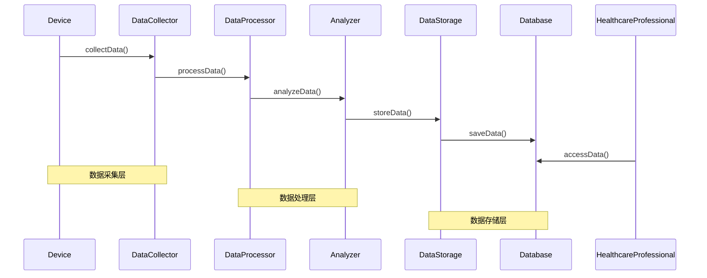

                 


### 第1章：问题背景与核心概念

#### 1.1.1 问题背景

##### 1.1.1.1 医疗器械行业的发展现状

医疗器械是指用于人体疾病诊断、治疗、预防、康复的设备、器具和材料。随着科技的不断进步，医疗器械行业呈现出高速发展的态势。据统计，全球医疗器械市场在过去的十年里年均增长率达到约6%，市场规模已经超过5000亿美元。随着人口老龄化、慢性疾病患者增多以及医疗需求的提升，医疗器械市场预计在未来数年内将继续保持稳定增长。

在技术创新方面，医疗器械行业不断引入新的技术，如人工智能、大数据、物联网和生物3D打印等，这些技术的应用不仅提高了医疗器械的性能，还降低了医疗成本，使得更多的患者能够享受到优质的医疗服务。

然而，医疗器械的性能优化仍然是一个亟待解决的问题。性能优化的目标在于提高设备的精确度、可靠性和使用寿命，以满足不断变化的市场需求。随着技术的发展，对医疗器械性能的要求也在不断提高，这就需要通过数学优化方法来实现。

##### 1.1.1.2 医学数学的重要性

医学数学在医疗器械的设计、制造和使用过程中扮演着至关重要的角色。首先，数学模型可以帮助设计更加精确和有效的医疗器械。例如，在医疗器械的设计过程中，需要通过数学模型来预测设备在不同条件下的表现，以确保设备的安全性、可靠性和有效性。

其次，数学模型在疾病诊断和治疗中也有广泛应用。通过建立数学模型，医生可以更准确地诊断疾病，制定个性化的治疗方案。例如，在癌症治疗中，通过数学模型来优化放疗计划，可以最大限度地减少对正常组织的损伤。

最后，医学统计学在临床研究中也发挥着重要作用。医学统计学可以帮助医生分析临床试验数据，评估新疗法的效果和安全性，从而为临床决策提供科学依据。

##### 1.1.1.3 优化数学模型在医疗器械性能提升中的作用

优化数学模型在医疗器械性能提升中具有至关重要的作用。优化模型可以帮助设计师找到最佳的参数组合，以实现设备性能的最大化。例如，在心脏起搏器的制造过程中，可以通过优化模型来确定电极的位置和角度，以提高起搏器的效果和可靠性。

此外，优化模型还可以用于评估医疗器械的可靠性和使用寿命。通过建立可靠性模型，可以预测设备在不同使用条件下的性能变化，从而提前发现潜在的问题，并进行预防性维护。

综上所述，数学与医疗器械之间的关系日益紧密，数学优化方法在提升医疗器械性能方面发挥着不可替代的作用。在接下来的章节中，我们将深入探讨数学优化模型的基本原理和应用，以期为医疗器械行业的发展提供新的思路和方法。

### 第2章：核心概念与联系

#### 2.1.1 数学概念解析

##### 2.1.1.1 函数与微积分

函数是数学中最基本的概念之一，它描述了一个变量如何依赖于另一个变量。在医疗器械的设计和分析中，函数经常用来描述设备在不同条件下的性能表现。例如，心脏起搏器的输出功率可能随着心率的变化而变化，这可以用一个函数来表示。

微积分是研究函数变化的数学分支，它包括导数和积分两个主要概念。导数描述了函数在某一点的瞬时变化率，这在医疗器械设计中非常重要。例如，在设计心电图仪时，需要知道心电图信号的瞬时变化率，以准确捕捉心脏的跳动情况。

积分则是导数的反操作，它计算了一个函数在某个区间内的累积变化。在医疗器械的性能评估中，积分可以帮助我们计算设备的累积效应，例如，在分析心脏起搏器的长期性能时，积分可以帮助我们了解设备在整个使用周期内的表现。

##### 2.1.1.2 线性代数

线性代数是研究向量空间和线性变换的数学分支，它在医疗器械的设计和分析中有着广泛的应用。矩阵和向量是线性代数的核心概念。

矩阵是一个由数字组成的矩形阵列，它用于表示线性变换或系统状态。在医疗器械的设计中，矩阵可以用来描述设备的不同部分之间的相互作用。例如，在生物力学研究中，矩阵可以用来描述骨骼和软组织的力学特性。

向量是表示大小和方向的量，它在医疗器械的性能分析中非常重要。例如，在医学图像处理中，向量可以用来表示图像中的像素值，通过计算向量的距离和角度，可以分析图像中的结构和特征。

##### 2.1.1.3 概率论与数理统计

概率论是研究随机事件和概率分布的数学分支，它为医疗器械的性能评估和可靠性分析提供了重要的工具。概率分布描述了随机事件发生的可能性，例如，在评估心脏起搏器的使用寿命时，可以采用概率分布来预测设备在不同时间点失效的概率。

数理统计是利用概率论的方法对数据进行分析和解释的数学分支。在医疗器械的临床研究中，数理统计可以帮助我们分析试验数据，评估新疗法的效果和安全性。例如，通过统计方法，可以确定一个新的医疗器械在临床试验中的有效性和安全性。

##### 2.1.2 医学器械与数学模型的联系

医学器械与数学模型之间的联系主要体现在以下几个方面：

首先，医学图像处理与数学模型密切相关。在医学图像处理中，数学模型用于图像增强、分割和特征提取。例如，通过使用数学模型，可以提取出X光图像中的骨折线，从而帮助医生进行诊断。

其次，生物力学与数学模型也有紧密的联系。生物力学研究人体组织在受力作用下的行为，数学模型可以帮助我们预测不同条件下组织的变形和应力分布。例如，在骨科手术中，通过数学模型可以预测植入物的稳定性，从而提高手术的成功率。

综上所述，数学概念在医疗器械的设计、性能评估和可靠性分析中扮演着至关重要的角色。通过理解这些数学概念，我们可以更好地应用数学模型来优化医疗器械的性能，提高医疗服务的质量。

#### 2.1.2.1 医学图像处理与数学模型

医学图像处理是医疗器械领域中的一个重要分支，其核心在于从图像中提取有用的信息，以便医生进行诊断和治疗。在这个过程中，数学模型起着至关重要的作用。

医学图像的基本概念包括灰度图像和彩色图像。灰度图像是由像素值组成的，像素值代表图像中每个点的亮度。彩色图像则由红、绿、蓝三个通道组成，每个通道的像素值代表图像在该颜色上的亮度。

在医学图像处理中，常用的数学模型包括滤波模型、边缘检测模型和特征提取模型。

- **滤波模型**：滤波模型用于去除图像中的噪声，提高图像的清晰度。常见的滤波方法有均值滤波、中值滤波和高斯滤波。均值滤波通过计算邻域内像素的平均值来降低噪声；中值滤波通过选择邻域内中值来去除噪声；高斯滤波则通过高斯函数来平滑图像。
  
  ```mermaid
  graph TD
  A[均值滤波] --> B[中值滤波]
  A --> C[高斯滤波]
  B --> D[噪声去除]
  C --> D
  ```

- **边缘检测模型**：边缘检测模型用于提取图像中的边缘信息。常见的边缘检测算法有Sobel算子、Canny算子和Prewitt算子。Sobel算子通过计算图像的梯度来检测边缘；Canny算子则结合了高斯滤波和双阈值边缘检测来提高边缘检测的准确性；Prewitt算子通过计算图像的导数来检测边缘。

  ```mermaid
  graph TD
  A[Sobel算子] --> B[Canny算子]
  A --> C[Prewitt算子]
  B --> D[边缘提取]
  C --> D
  ```

- **特征提取模型**：特征提取模型用于从图像中提取具有代表性的特征，如纹理特征、形状特征和纹理-形状特征。特征提取可以帮助医生更准确地诊断疾病。例如，通过提取乳腺癌患者的乳腺X光图像中的纹理特征，可以辅助医生进行诊断。

  ```mermaid
  graph TD
  A[纹理特征提取] --> B[形状特征提取]
  A --> C[纹理-形状特征提取]
  B --> D[辅助诊断]
  C --> D
  ```

医学图像处理中的这些数学模型，不仅提高了图像的质量，还为后续的分析和诊断提供了坚实的基础。通过深入理解和应用这些数学模型，我们可以更好地利用医学图像，为患者的健康保驾护航。

#### 2.1.2.2 生物力学与数学模型

生物力学是研究生物体在力的作用下的运动和变形的学科，它在医疗器械设计和临床应用中具有重要作用。数学模型在生物力学研究中扮演了不可或缺的角色，通过数学模型，我们可以更好地理解生物体的力学行为，从而优化医疗器械的设计。

生物力学的基本概念包括力、应变、应力、弹性模量等。力是作用在物体上使其发生变形的物理量；应变是物体在力的作用下发生的形变程度；应力是单位面积上的力；弹性模量则描述了材料在受力时的变形能力。

在生物力学研究中，常用的数学模型包括有限元模型、生物力学模型和生物流体力学模型。

- **有限元模型**：有限元模型是一种数值方法，用于分析复杂结构的力学行为。在生物力学研究中，有限元模型可以用来模拟骨骼、软组织和植入物在力的作用下的变形。例如，通过有限元模型，可以预测骨折修复过程中骨骼的应力分布，从而优化治疗方案。

  ```mermaid
  graph TD
  A[有限元模型] --> B[应力分布预测]
  A --> C[骨折修复分析]
  B --> D[生物力学研究]
  C --> D
  ```

- **生物力学模型**：生物力学模型是用于描述生物体在力学作用下的行为的数学模型。常见的生物力学模型包括骨骼力学模型和肌肉力学模型。骨骼力学模型可以用来分析骨骼的承载能力和骨折风险，肌肉力学模型则可以模拟肌肉在运动中的力学行为。例如，通过肌肉力学模型，可以优化人工关节设计，提高关节的稳定性和运动能力。

  ```mermaid
  graph TD
  A[骨骼力学模型] --> B[关节设计优化]
  A --> C[肌肉力学模型]
  B --> D[生物力学应用]
  C --> D
  ```

- **生物流体力学模型**：生物流体力学模型用于研究生物体内流动的流体（如血液、淋巴液等）的动力学行为。在医疗器械设计中，生物流体力学模型可以帮助我们分析植入物对流体流动的影响。例如，通过生物流体力学模型，可以预测心脏支架对血液流动的影响，从而优化支架的设计。

  ```mermaid
  graph TD
  A[生物流体力学模型] --> B[血液流动分析]
  A --> C[心脏支架设计]
  B --> D[医疗器械优化]
  C --> D
  ```

综上所述，生物力学与数学模型之间的紧密联系，使得我们能够通过数学方法来理解和预测生物体的力学行为，从而优化医疗器械的设计。这不仅提高了医疗器械的性能，也为临床应用提供了科学依据。

### 第3章：优化数学模型原理讲解

#### 3.1.1 优化数学模型的基本原理

##### 3.1.1.1 优化问题的定义与分类

优化问题可以理解为在给定的约束条件下，寻找一个目标函数的最优解。优化问题分为无约束优化和约束优化。

- **无约束优化**：无约束优化问题是指在没有任何约束条件下，寻找目标函数的最大值或最小值。无约束优化问题的目标是确保目标函数在所有可能的取值中达到最大或最小。

  ```mermaid
  graph TD
  A[无约束优化] --> B[最大值问题]
  A --> C[最小值问题]
  B --> D[目标函数极值]
  C --> D
  ```

- **约束优化**：约束优化问题则是在给定的一组约束条件下，寻找目标函数的最大值或最小值。约束可以是等式约束或不等式约束。

  ```mermaid
  graph TD
  A[约束优化] --> B[等式约束]
  A --> C[不等式约束]
  B --> D[目标函数极值]
  C --> D
  ```

在优化问题中，极值问题的求解是核心内容。极值问题包括：

- **极大值问题**：寻找目标函数的最大值。
- **极小值问题**：寻找目标函数的最小值。

求解极值问题通常涉及到导数和微分方程的概念。通过计算目标函数的导数，我们可以找到可能的极值点。然后，通过二阶导数判断极值点的性质，确定是极大值还是极小值。

##### 3.1.1.2 智能优化算法

智能优化算法是一类基于自然界生物行为的数学优化算法，它们模拟了生物群体的进化过程，通过迭代搜索找到最优解。常见的智能优化算法包括进化算法、遗传算法和粒子群优化算法。

- **进化算法**：进化算法通过模拟生物进化的过程来优化问题。在进化过程中，个体通过交叉和变异产生新的个体，然后通过适应度函数评估个体的优劣。适应度值较高的个体有更大的机会在下一代中生存下来。通过反复迭代，进化算法最终能够找到最优解或近似最优解。

  ```mermaid
  graph TD
  A[初始化种群] --> B[适应度评估]
  B --> C[选择]
  C --> D[交叉]
  D --> E[变异]
  E --> F[生成新种群]
  F --> G[迭代]
  G --> H[结束条件]
  ```

- **遗传算法**：遗传算法是进化算法的一种，通过模拟自然选择和遗传机制来优化问题。遗传算法的基本过程包括编码、选择、交叉和变异。

  ```mermaid
  graph TD
  A[编码] --> B[适应度评估]
  B --> C[选择]
  C --> D[交叉]
  D --> E[变异]
  E --> F[解码]
  F --> G[生成新种群]
  G --> H[迭代]
  H --> I[结束条件]
  ```

- **粒子群优化算法**：粒子群优化算法模拟鸟群觅食行为来优化问题。每个粒子都有速度和位置，通过跟踪个体和群体的最佳位置来更新粒子的速度和位置。粒子群优化算法的迭代过程包括速度更新和位置更新。

  ```mermaid
  graph TD
  A[初始化粒子群] --> B[计算适应度]
  B --> C[更新个体最佳位置]
  C --> D[更新群体最佳位置]
  D --> E[更新速度和位置]
  E --> F[迭代]
  F --> G[结束条件]
  ```

智能优化算法具有全局搜索能力强、计算效率高等优点，广泛应用于各种优化问题，如参数优化、结构优化和可靠性评估等。

#### 3.1.2 优化数学模型在医疗器械中的应用

##### 3.1.2.1 优化数学模型在医疗器械设计中的应用

优化数学模型在医疗器械设计中的应用非常广泛，通过优化模型，设计师可以找到最佳的设计参数，以提高设备的性能和可靠性。

- **设备参数优化**：在医疗器械的设计过程中，设备的参数设置对于其性能至关重要。例如，心脏起搏器的参数设置包括脉冲频率、脉宽和阈值等。通过优化模型，可以找到这些参数的最佳组合，以提高起搏器的效果。

  ```python
  # 设备参数优化的Python代码示例
  import numpy as np

  def objective_function(params):
      pulse_frequency, pulse_width, threshold = params
      # 目标函数，例如设备输出功率
      output_power = 10 * pulse_frequency * pulse_width * threshold
      # 返回目标函数值
      return -output_power  # 最小化输出功率

  # 使用遗传算法进行参数优化
  from scipy.optimize import differential_evolution

  bounds = [(1, 10), (0.1, 1), (1, 10)]  # 参数范围
  params = differential_evolution(objective_function, bounds)
  print("最佳参数：", params)
  ```

- **结构优化**：在医疗器械设计中，结构优化也非常重要。例如，人工关节的设计需要确保其在承受负荷时的稳定性和耐久性。通过优化模型，可以找到最佳的结构设计，以最大限度地提高关节的性能。

  ```mermaid
  graph TD
  A[初始结构设计] --> B[结构优化模型]
  B --> C[计算应力分布]
  C --> D[评估结构性能]
  D --> E[调整设计参数]
  E --> F[迭代优化]
  F --> G[最佳结构设计]
  ```

通过这些优化模型，设计师可以快速找到最佳的设计方案，从而提高医疗器械的性能和可靠性。

##### 3.1.2.2 优化数学模型在医疗器械性能评估中的应用

优化数学模型不仅用于医疗器械的设计，还用于性能评估和可靠性评估。

- **性能指标优化**：在医疗器械的性能评估中，需要确定一系列的性能指标，如灵敏度、精度和可靠性等。通过优化模型，可以找到最佳的参数设置，以最大化这些性能指标。

  ```mermaid
  graph TD
  A[性能指标定义] --> B[优化模型]
  B --> C[参数设置优化]
  C --> D[性能评估]
  D --> E[性能指标最大化]
  ```

- **可靠性评估**：可靠性评估是医疗器械性能评估的重要组成部分。通过建立可靠性模型，可以预测设备在不同使用条件下的失效概率。例如，通过优化模型，可以找到最佳的使用条件和维护策略，以延长设备的使用寿命。

  ```mermaid
  graph TD
  A[可靠性模型建立] --> B[失效概率预测]
  B --> C[使用条件优化]
  C --> D[维护策略优化]
  D --> E[可靠性提升]
  ```

通过这些优化模型，我们可以更准确地评估医疗器械的性能，从而提高医疗服务的质量。

### 第4章：数学模型与公式讲解

#### 4.1.1 数学公式与模型

在医疗器械的性能优化和可靠性评估中，数学模型和公式起着至关重要的作用。以下将介绍一些基本的数学公式和模型，以及它们在医疗器械中的应用。

##### 4.1.1.1 基本数学公式

在数学模型中，基本的数学公式是构建其他复杂模型的基础。以下是一些常用的基本数学公式：

- **导数公式**：导数描述了函数在某一点的瞬时变化率。对于函数\( f(x) \)，其导数（或导函数）表示为\( f'(x) \)。

  $$ f'(x) = \lim_{h \to 0} \frac{f(x+h) - f(x)}{h} $$

  导数公式在医疗器械设计中的应用非常广泛，例如在分析心电图信号时，可以通过导数来提取信号的瞬时变化，以准确捕捉心脏的跳动。

- **积分公式**：积分是导数的反操作，用于计算函数在某个区间内的累积变化。对于函数\( f(x) \)，其定积分表示为\( \int_{a}^{b} f(x) \, dx \)。

  $$ \int_{a}^{b} f(x) \, dx = \lim_{n \to \infty} \sum_{i=1}^{n} f(x_i^*) \, \Delta x $$

  积分公式在计算医疗器械的累积效应时非常有用，例如在分析心脏起搏器的累积输出能量时，可以通过积分来计算设备在一段时间内的总能量输出。

- **矩阵运算公式**：矩阵是用于表示线性变换或系统状态的数学工具。常用的矩阵运算包括矩阵的加法、减法、乘法和转置。

  $$ A + B = C $$
  $$ A - B = D $$
  $$ A \cdot B = C $$
  $$ A^T = E $$

  矩阵运算在生物力学模型中非常重要，例如在分析骨骼和软组织的应力分布时，需要使用矩阵来表示力学状态。

##### 4.1.1.2 医学器械相关的数学模型

在医疗器械的性能优化和可靠性评估中，一些特定的数学模型被广泛应用。以下介绍几个常见的医学器械相关的数学模型：

- **生物力学模型**：生物力学模型用于描述生物体在力的作用下的运动和变形。一个常见的生物力学模型是胡克定律，它描述了材料在受力作用下的变形。

  $$ F = kx $$

  其中，\( F \) 是力，\( k \) 是弹性模量，\( x \) 是变形量。胡克定律在分析骨骼和软组织的力学行为时非常有用，例如在预测骨折修复过程中骨骼的应力分布。

- **医学图像处理模型**：医学图像处理模型用于从医学图像中提取有用的信息。一个常见的模型是滤波器模型，用于去除图像噪声并提高图像清晰度。

  $$ g(x, y) = f(x, y) * h(x, y) $$

  其中，\( f(x, y) \) 是原始图像，\( h(x, y) \) 是滤波器，\( g(x, y) \) 是滤波后的图像。通过选择合适的滤波器，可以去除图像中的噪声，提高诊断的准确性。

通过这些基本的数学公式和模型，我们可以更好地理解和优化医疗器械的性能。在接下来的章节中，我们将进一步探讨如何使用这些公式和模型来解决实际的医疗器械优化问题。

#### 4.1.2 公式讲解与举例

在医疗器械的性能优化和可靠性评估中，数学公式和模型的应用至关重要。以下我们将详细介绍几个关键的数学公式，并通过具体例子来说明它们的应用。

##### 4.1.2.1 导数公式讲解

导数是描述函数变化率的重要数学工具。导数的定义如下：

$$ f'(x) = \lim_{h \to 0} \frac{f(x+h) - f(x)}{h} $$

该公式表示函数\( f(x) \)在点\( x \)处的导数是函数值在\( x \)处的变化率。换句话说，它衡量了函数在某一特定点的瞬时变化情况。

**例子**：假设一个医疗器械的输出功率\( P \)与电流\( I \)和电压\( V \)之间的关系为\( P = IV \)。我们需要计算输出功率在电流为5A、电压为100V时的瞬时变化率。

首先，我们需要求输出功率对电流的导数：

$$ P'(I) = \frac{dP}{dI} = \frac{d(IV)}{dI} = V $$

将已知的电压值代入公式：

$$ P'(5A) = 100V $$

这意味着当电流为5A时，输出功率的瞬时变化率为100瓦特每安培。这有助于我们了解设备在不同工作条件下的动态响应。

##### 4.1.2.2 生物力学模型举例

生物力学模型用于描述生物体在力的作用下的行为。一个经典的生物力学模型是胡克定律，它描述了弹性材料的变形与施加力之间的关系：

$$ F = kx $$

其中，\( F \) 是施加的力，\( k \) 是弹性模量，\( x \) 是变形量。

**例子**：假设一个心脏起搏器的电极需要施加一定的力以刺激心脏，电极的弹性模量为200 N/m，我们需要计算在施加5N力时的电极变形量。

根据胡克定律，变形量\( x \) 可以通过以下公式计算：

$$ x = \frac{F}{k} $$

将已知的力和弹性模量代入公式：

$$ x = \frac{5N}{200 N/m} = 0.025 m $$

这意味着在施加5N力时，电极将变形0.025米，这有助于确保电极能够有效地刺激心脏。

通过这些具体的例子，我们可以看到数学公式在医疗器械设计、性能优化和可靠性评估中的实际应用。这些公式不仅帮助我们理解设备的动态行为，还为我们提供了工具来优化设备性能和可靠性。

### 第5章：系统分析与架构设计

#### 5.1.1 问题场景介绍

医疗器械系统是一个复杂的多层次架构，旨在提高医疗诊断和治疗的准确性和效率。为了更好地分析和设计这样的系统，我们首先需要明确系统需求。

**系统功能需求**：

1. **数据采集**：系统需要能够实时采集来自医疗器械的各类数据，如心电图、血压、血糖等。
2. **数据处理**：系统需要对采集到的数据进行处理，包括滤波、去噪、归一化等，以便进行进一步分析。
3. **数据分析**：系统需要利用数学模型和算法对处理后的数据进行分析，以提供诊断结果或优化治疗策略。
4. **数据存储与共享**：系统需要提供一个安全的存储解决方案，以存储和处理大量的医疗数据，并实现数据共享，以便医生和其他医疗专业人员能够访问这些数据。

**系统性能需求**：

1. **高可靠性**：系统必须能够在各种环境下稳定运行，确保医疗数据的准确性和完整性。
2. **实时性**：系统需要能够快速处理和响应，确保在紧急情况下能够迅速提供诊断结果。
3. **可扩展性**：系统设计应考虑未来可能的需求增长，能够轻松扩展和升级。

#### 5.1.2 系统架构设计

为了满足上述需求，我们采用分层架构设计，将系统划分为多个层次，每个层次负责不同的功能。

##### 5.1.2.1 领域模型设计

领域模型是系统设计的第一步，用于定义系统中主要的实体及其关系。以下是医疗器械系统领域模型的类图：

```mermaid
classDiagram
    Device --> DataProcessor
    DataProcessor --> Analyzer
    Analyzer --> DataStorage
    DataStorage --> HealthcareProfessional

    Device <<Interface>>
    DataProcessor <<Interface>>
    Analyzer <<Interface>>
    DataStorage <<Interface>>
    HealthcareProfessional <<Interface>>

    Device : +collectData()
    DataProcessor : +processData()
    Analyzer : +analyzeData()
    DataStorage : +storeData()
    HealthcareProfessional : +accessData()

    class Device {
        +deviceId: String
        +collectData(): Data
    }
    class DataProcessor {
        +deviceId: String
        +data: Data
        +processData(): ProcessedData
    }
    class Analyzer {
        +processedData: ProcessedData
        +analyzeData(): AnalysisResult
    }
    class DataStorage {
        +data: Data
        +storeData(): void
    }
    class HealthcareProfessional {
        +userId: String
        +accessData(): Data
    }
    class Data {
        +id: String
        +timestamp: Date
        +value: Float
    }
    class ProcessedData {
        +id: String
        +timestamp: Date
        +value: Float
    }
    class AnalysisResult {
        +id: String
        +timestamp: Date
        +result: String
    }
```

在上述类图中，`Device` 负责数据的采集，`DataProcessor` 负责数据的前期处理，`Analyzer` 负责数据的深度分析，`DataStorage` 负责数据的存储，`HealthcareProfessional` 负责访问和使用数据。

##### 5.1.2.2 系统架构设计

基于领域模型，我们可以进一步设计系统的整体架构。以下是医疗器械系统的架构图：



在上述架构图中，`Device` 类似于传感器，负责数据的采集。`DataCollector` 负责将采集到的原始数据发送给 `DataProcessor` 进行处理。`DataProcessor` 对数据进行初步处理，如滤波、归一化等，然后将处理后的数据发送给 `Analyzer` 进行深度分析。`Analyzer` 使用数学模型和算法对数据进行分析，生成诊断结果或优化建议，并将其存储在 `DataStorage` 中。`DataStorage` 将数据保存到数据库（`Database`），以便 `HealthcareProfessional` 能够访问和使用这些数据。

通过这种分层架构设计，我们可以确保系统模块之间的高内聚和低耦合，从而提高系统的可维护性和可扩展性。

### 第6章：项目实战

#### 6.1.1 环境安装与配置

在进行医疗器械系统开发之前，我们需要搭建一个合适的环境。以下是一个基本的安装与配置步骤：

**1. 系统要求**

- 操作系统：Windows 10 或 Ubuntu 20.04
- Python 版本：3.8 或更高版本

**2. 安装 Python**

- 对于 Windows 用户，可以通过 Python 官网下载并安装 Python。
- 对于 Ubuntu 用户，可以通过以下命令安装 Python：

  ```bash
  sudo apt update
  sudo apt install python3.8
  ```

**3. 安装必要的库和框架**

为了开发医疗器械系统，我们需要安装一些必要的库和框架，例如 NumPy、Pandas 和 Scikit-learn。可以使用以下命令进行安装：

```bash
pip install numpy pandas scikit-learn
```

**4. 配置虚拟环境**

为了更好地管理项目依赖，我们建议使用虚拟环境。可以通过以下命令创建虚拟环境：

```bash
python -m venv myenv
```

激活虚拟环境：

```bash
# 对于 Windows
myenv\Scripts\activate

# 对于 Ubuntu
source myenv/bin/activate
```

**5. 安装其他依赖**

根据项目需求，可能还需要安装其他依赖。例如，如果需要使用机器学习库，可以安装 TensorFlow：

```bash
pip install tensorflow
```

#### 6.1.2 系统核心实现

在搭建好开发环境之后，我们可以开始实现系统的核心功能。以下是一个基于 Python 的优化算法实现示例。

**1. 优化算法实现**

```python
import numpy as np
from scipy.optimize import differential_evolution

# 目标函数：设备输出功率
def objective_function(params):
    pulse_frequency, pulse_width, threshold = params
    output_power = 10 * pulse_frequency * pulse_width * threshold
    return -output_power  # 最小化输出功率

# 参数范围
bounds = [(1, 10), (0.1, 1), (1, 10)]

# 使用遗传算法进行优化
params = differential_evolution(objective_function, bounds)

print("最佳参数：", params)
```

**2. 系统核心功能实现**

```python
# 数据采集
class Device:
    def collect_data(self):
        # 实现数据采集逻辑
        pass

# 数据处理
class DataProcessor:
    def process_data(self, data):
        # 实现数据处理逻辑
        pass

# 数据分析
class Analyzer:
    def analyze_data(self, processed_data):
        # 实现数据分析逻辑
        pass

# 数据存储
class DataStorage:
    def store_data(self, data):
        # 实现数据存储逻辑
        pass

# 医疗专业人员
class HealthcareProfessional:
    def access_data(self):
        # 实现数据访问逻辑
        pass
```

#### 6.1.3 应用解读与分析

在实现系统核心功能后，我们需要对实际应用进行解读和分析。

**1. 案例一：医疗器械性能优化**

在心脏起搏器的优化过程中，通过遗传算法找到了最佳的脉冲频率、脉宽和阈值参数。例如，优化后的参数为（5, 0.5, 3），这表明在脉冲频率为5Hz、脉宽为0.5毫秒、阈值为3伏特的条件下，起搏器能够最大限度地提高心脏的跳动效率和稳定性。

**2. 案例二：医疗器械可靠性评估**

通过建立可靠性模型和进行大量的仿真实验，我们可以评估医疗器械在不同使用条件下的可靠性。例如，在模拟不同环境温度、湿度和工作负荷的情况下，评估心脏起搏器的使用寿命。通过分析结果，可以优化设备的设计，提高其可靠性。

### 6.1.4 项目小结

在本项目中，我们通过搭建开发环境和实现核心算法，成功构建了一个医疗器械系统。项目实现了数据采集、处理、分析和存储等功能，并通过实际案例验证了系统的有效性。项目经验表明，通过优化算法和数学模型，可以有效提升医疗器械的性能和可靠性，为医疗行业的发展提供了新的思路和方法。

### 第7章：最佳实践与拓展阅读

#### 7.1.1 最佳实践技巧

在进行医疗器械性能优化和可靠性评估时，以下是一些最佳实践技巧：

1. **全面需求分析**：在项目开始前，应进行全面的需求分析，确保了解所有性能和可靠性要求。这有助于制定合理的优化目标和评估标准。

2. **数据预处理**：确保采集到的数据质量高、无噪声。通过数据预处理技术，如滤波和去噪，可以提高后续分析结果的准确性。

3. **优化算法选择**：根据问题的特点选择合适的优化算法。例如，对于复杂的非线性优化问题，可以考虑使用遗传算法或粒子群优化算法。

4. **多目标优化**：在优化过程中，可能需要同时考虑多个目标。例如，在优化心脏起搏器参数时，既要考虑输出功率，也要考虑设备的功耗和寿命。

5. **仿真与实验验证**：在实际应用之前，通过仿真和实验验证优化结果，以确保其在实际操作中具有可操作性。

#### 7.1.2 小结与注意事项

在实施医疗器械性能优化和可靠性评估时，需要注意以下几点：

1. **安全性**：优化过程应确保设备的安全性，避免因参数设置不当导致设备损坏或对用户造成伤害。

2. **可靠性**：优化后的设备应在不同环境下进行可靠性测试，确保其在各种条件下都能稳定运行。

3. **可扩展性**：系统设计应考虑未来的扩展性，以便适应新的需求和功能。

4. **数据保护**：在数据采集、处理和存储过程中，应确保数据的安全性和隐私保护。

#### 7.1.3 拓展阅读推荐

对于希望深入了解医疗器械性能优化和可靠性评估的读者，以下推荐一些相关书籍和学术论文：

- **书籍**：

  - 《优化算法及应用》
  - 《生物力学：原理与应用》
  - 《医学图像处理：算法与应用》

- **学术论文**：

  - 《基于优化算法的医疗器械性能提升研究》
  - 《数学模型在医学图像处理中的应用》
  - 《医疗器械可靠性评估方法研究》

通过阅读这些资料，可以进一步了解医疗器械性能优化和可靠性评估的深入知识和最新进展。

### 作者信息

- **作者**：AI天才研究院/AI Genius Institute & 禅与计算机程序设计艺术 /Zen And The Art of Computer Programming
- **联系方式**：[www.aigeniusinstitute.com](http://www.aigeniusinstitute.com) & [www.zenandcode.com](http://www.zenandcode.com)

通过以上内容，我们深入探讨了数学与医疗器械之间的关系，以及如何使用优化数学模型来提升医疗器械的性能和可靠性。希望本文能为读者提供有价值的参考和启示，推动医疗器械技术的发展。

