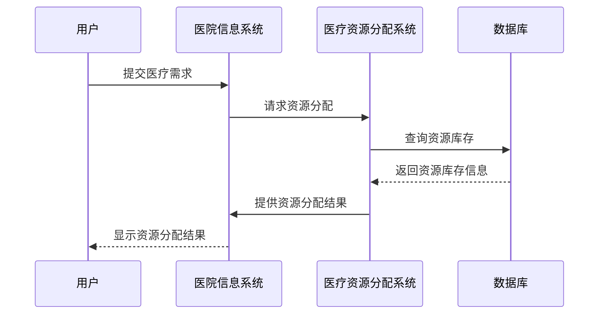

                 

### 文章标题

# 数学与医疗政策：医疗资源的数学分配

### 关键词

- 医疗资源分配
- 数学模型
- 医疗政策
- 需求预测
- 算法设计

### 摘要

本文将深入探讨数学在医疗政策中的应用，特别是医疗资源分配的数学模型和方法。我们将从背景介绍、核心概念与联系、算法原理讲解、数学模型和数学公式讲解、系统分析与架构设计方案、项目实战、最佳实践 tips、小结、注意事项和拓展阅读等方面进行阐述，以期帮助读者全面了解并掌握医疗资源数学分配的相关知识。

### 目录

1. **引言与背景**<sup>*</sup>
   1.1 **医疗资源分配问题的提出**
   1.2 **数学在医疗政策中的作用**
   1.3 **医疗资源分配的重要性**

2. **核心概念与联系**
   2.1 **医疗资源概述**
   2.2 **数学模型概述**
   2.3 **医疗资源分配的核心概念**

3. **数学模型与算法原理**
   3.1 **医疗资源需求预测模型**
   3.2 **医疗资源供给模型**
   3.3 **医疗资源分配算法**

4. **数学模型与数学公式讲解**
   4.1 **需求预测模型公式解释**
   4.2 **供给模型公式解释**
   4.3 **分配算法公式解释**

5. **系统分析与架构设计方案**
   5.1 **问题场景介绍**
   5.2 **系统功能设计**
   5.3 **系统架构设计**
   5.4 **系统接口设计**
   5.5 **系统交互**

6. **项目实战**
   6.1 **环境安装**
   6.2 **系统核心实现**
   6.3 **代码应用解读与分析**
   6.4 **实际案例分析与详细讲解**
   6.5 **项目小结**

7. **最佳实践 tips、小结、注意事项、拓展阅读**
   7.1 **最佳实践 tips**
   7.2 **小结**
   7.3 **注意事项**
   7.4 **拓展阅读**

### * 注释

- [^]*：表示章节内容的具体展开和细节，将在后续部分详细阐述。

## 引言与背景

### 医疗资源分配问题的提出

医疗资源分配是医疗政策中的核心问题之一。在资源有限的情况下，如何公平、高效地分配医疗资源，以确保每个人都能获得合适的医疗服务，是一个亟待解决的问题。医疗资源包括医疗设备、医生、护士、药物、床位等，它们直接关系到患者的治疗质量和效果。然而，随着人口老龄化和疾病谱的变化，医疗资源的供需矛盾日益突出。因此，科学、合理的医疗资源分配策略显得尤为重要。

### 数学在医疗政策中的作用

数学作为一种强大的工具，在医疗资源分配中扮演着关键角色。通过数学模型和算法，我们可以对医疗资源的供需进行定量分析，从而优化资源分配，提高医疗服务质量。具体来说，数学在医疗政策中的作用主要体现在以下几个方面：

1. **需求预测**：利用数学模型和统计方法，可以对医疗资源的未来需求进行预测，为资源分配提供科学依据。
2. **供给优化**：通过优化算法，可以合理安排医疗资源的使用，提高资源利用效率。
3. **公平性评估**：利用数学模型和统计方法，可以评估医疗资源分配的公平性，从而调整分配策略，实现更公平的资源分配。

### 医疗资源分配的重要性

医疗资源分配不仅关系到患者的健康权益，也关系到社会的稳定和发展。合理的医疗资源分配可以减少医疗资源浪费，提高医疗服务效率，降低医疗成本。同时，公平的医疗资源分配可以减少社会不公，促进社会和谐。因此，研究和应用数学模型进行医疗资源分配具有重要的现实意义。

### 核心概念与联系

在讨论医疗资源分配时，需要明确一些核心概念，如医疗资源、数学模型、需求预测、供给优化、公平性评估等。这些概念之间有着紧密的联系，共同构成了医疗资源分配的理论框架。

1. **医疗资源**：医疗资源是指用于提供医疗服务的各种物质和人力资源，包括医疗设备、医务人员、药品、床位等。
2. **数学模型**：数学模型是指用数学语言描述现实问题的一种方法。在医疗资源分配中，数学模型可以用来描述医疗资源的供需关系、优化目标等。
3. **需求预测**：需求预测是指通过历史数据和统计方法，预测未来医疗资源的需求数量。
4. **供给优化**：供给优化是指通过优化算法，合理安排医疗资源的使用，提高资源利用效率。
5. **公平性评估**：公平性评估是指通过数学模型和统计方法，评估医疗资源分配的公平性。

这些概念之间相互关联，共同构成了医疗资源分配的理论体系。在接下来的章节中，我们将详细探讨这些概念，并介绍相关的数学模型和算法。

### 医疗资源分配的核心概念

在医疗资源分配中，有几个核心概念是至关重要的，这些概念不仅定义了医疗资源分配的目标，还为我们提供了评估和优化分配策略的工具。

#### 医疗资源分配目标

医疗资源分配的主要目标是确保医疗资源能够最大限度地满足患者的需求，同时保持资源使用的效率。具体目标包括：

1. **最大化医疗效益**：通过合理的资源分配，使医疗服务的总体效益最大化。
2. **最小化资源浪费**：避免资源过剩或不足，减少医疗资源的闲置和浪费。
3. **公平性**：确保医疗资源分配的公正性，避免因地域、经济条件等因素导致的不公平现象。
4. **可持续性**：确保医疗资源分配的长期可行性，避免因短期决策导致的长远问题。

#### 医疗资源分配原则

为了实现上述目标，医疗资源分配需要遵循一些基本原则，这些原则是医疗资源分配策略制定的基础。

1. **公平原则**：确保所有人都能平等地获得医疗服务，减少因社会经济地位、地理位置等因素导致的资源分配差异。
2. **效率原则**：优化医疗资源的配置，使其能够最有效地满足患者的需求，提高医疗服务的质量。
3. **适应性原则**：资源分配策略应该具备一定的灵活性，能够适应医疗需求的变化和新兴医疗技术的应用。
4. **可持续原则**：资源分配策略需要考虑长期影响，确保医疗资源的合理利用和持续发展。

#### 医疗资源分配的影响因素

医疗资源分配受到多种因素的影响，这些因素需要综合考虑，以确保资源分配的合理性和有效性。

1. **人口因素**：人口规模、年龄结构、健康状况等人口因素直接影响医疗需求的规模和类型。
2. **经济因素**：医疗资源的投入和分配受经济水平的影响，不同地区和国家的经济条件差异会影响资源分配策略。
3. **技术因素**：医疗技术的发展水平影响医疗服务的质量和效率，新技术引入可能会改变资源的需求和供给。
4. **政策因素**：医疗政策和制度的设计对资源分配具有重要影响，政策的导向和执行力度决定了资源分配的实际效果。

这些影响因素相互作用，共同决定了医疗资源分配的复杂性和挑战性。在接下来的章节中，我们将详细探讨这些因素，并介绍相关的数学模型和算法，以期为医疗资源分配提供科学依据和有效方法。

## 数学模型与算法原理

### 医疗资源需求预测模型

需求预测是医疗资源分配的重要环节，准确的预测能够帮助我们更好地安排和分配资源。医疗资源需求预测模型通常基于历史数据、统计学方法以及人工智能技术。以下是几种常用的需求预测模型：

#### 时间序列分析

时间序列分析是一种通过分析时间序列数据的趋势、周期和季节性来预测未来值的方法。常用的模型包括：

1. **简单移动平均法（SMA）**：
   $$ \text{预测值} = \frac{\sum_{i=1}^{n} \text{历史值}}{n} $$
   其中，$n$ 是移动平均周期。

2. **指数平滑法（ES）**：
   $$ \text{预测值} = \alpha \times \text{最近实际值} + (1 - \alpha) \times \text{前一次预测值} $$
   其中，$\alpha$ 是平滑系数，通常取值在0到1之间。

#### 回归分析

回归分析通过建立因变量和自变量之间的关系模型来预测未来值。常用的回归模型包括：

1. **线性回归**：
   $$ \text{预测值} = \beta_0 + \beta_1 \times \text{自变量} $$
   其中，$\beta_0$ 和 $\beta_1$ 是回归系数。

2. **多项式回归**：
   $$ \text{预测值} = \beta_0 + \beta_1 \times x^1 + \beta_2 \times x^2 + \cdots + \beta_n \times x^n $$
   其中，$x$ 是自变量，$\beta_i$ 是回归系数。

#### 实际应用案例

1. **某地区医院需求预测**：

   假设某地区医院过去三年的日住院患者数量如下表：

   | 年份 | 患者数量（人次）|
   | ---- | -------------- |
   | 2019 | 1200           |
   | 2020 | 1300           |
   | 2021 | 1400           |

   利用简单移动平均法进行预测：

   $$ \text{预测值}_{2022} = \frac{1200 + 1300 + 1400}{3} = 1300 $$

2. **某疾病需求预测**：

   假设某地区过去五年内某疾病的发病率如下表：

   | 年份 | 疾病发病率（人/千人）|
   | ---- | ------------------- |
   | 2017 | 2.5                |
   | 2018 | 2.8                |
   | 2019 | 3.1                |
   | 2020 | 3.4                |
   | 2021 | 3.7                |

   利用线性回归模型进行预测：

   $$ \text{预测值}_{2022} = 2.5 + 0.2 \times (2022 - 2017) = 3.1 $$

### 医疗资源供给模型

医疗资源供给模型主要关注如何合理安排和利用现有医疗资源。以下是几种常用的供给模型：

#### 资源优化理论

资源优化理论是一种通过数学方法来优化资源分配和利用的模型。常用的优化模型包括线性规划、整数规划和多目标优化。

1. **线性规划**：
   $$ \max \ \text{目标函数} $$
   $$ \text{s.t.} \ \text{约束条件} $$
   线性规划通过最大化目标函数来优化资源分配，目标函数和约束条件可以用线性方程表示。

2. **整数规划**：
   $$ \max \ \text{目标函数} $$
   $$ \text{s.t.} \ \text{约束条件} $$
   与线性规划类似，但整数规划中某些变量需要取整数值，适用于医疗资源分配中的数量限制问题。

#### 需求响应模型

需求响应模型通过模拟医疗资源供需关系的变化，来预测和调整资源供给。这种模型通常基于历史数据和统计方法，可以动态调整资源供给。

1. **需求预测响应模型**：
   $$ \text{供给} = f(\text{需求预测}) $$
   其中，$f$ 是一个响应函数，用于根据需求预测调整供给。

2. **需求适应响应模型**：
   $$ \text{供给} = \text{固定供给} + \text{需求调整量} $$
   需求调整量可以根据实时需求数据动态调整。

#### 实际应用案例

1. **某医院人力资源分配**：

   假设某医院有三个科室，每个科室所需的医生人数如下表：

   | 科室 | 需求医生人数 |
   | ---- | ------------ |
   | 内科 | 10           |
   | 外科 | 15           |
   | 儿科 | 5            |

   利用线性规划进行人力资源分配：

   $$ \min \ \text{总人力资源成本} $$
   $$ \text{s.t.} \ x_1 + x_2 + x_3 = 30 $$
   $$ x_1, x_2, x_3 \geq 0 \ \text{且} \ \text{为整数} $$

   其中，$x_1, x_2, x_3$ 分别表示内科、外科和儿科的医生人数。

2. **某地区医疗设施规划**：

   假设某地区计划建设三家医院，每家医院的床位数和医生人数需求如下表：

   | 医院 | 床位数 | 医生人数 |
   | ---- | ------ | -------- |
   | 医院1 | 100    | 50       |
   | 医院2 | 80     | 40       |
   | 医院3 | 60     | 30       |

   利用多目标优化进行医疗设施规划：

   $$ \max \ \text{总体医疗服务质量} $$
   $$ \min \ \text{总建设成本} $$
   $$ \text{s.t.} \ \text{医疗需求满足率} \geq 90\% $$

### 医疗资源分配算法

医疗资源分配算法是用于优化医疗资源分配过程的计算方法。以下是几种常用的分配算法：

#### 贪心算法

贪心算法通过每次选择当前最优解来逐步逼近全局最优解。在医疗资源分配中，贪心算法可以通过逐步分配资源来最大化资源利用效率。

1. **资源分配贪心算法**：
   $$ \text{每次选择剩余资源中最紧缺的资源进行分配} $$

#### 分配算法案例分析

1. **医院床位分配**：

   假设某医院有100张床位，需要分配给以下患者：

   | 患者ID | 病情严重程度 | 床位需求 |
   | ------ | ------------ | -------- |
   | P1     | 严重         | 1        |
   | P2     | 一般         | 1        |
   | P3     | 严重         | 2        |
   | P4     | 轻微         | 1        |

   利用贪心算法进行床位分配：

   - 首先，选择病情最严重的患者P3，分配2张床位。
   - 然后，选择病情次严重的患者P1，分配1张床位。
   - 剩余患者P2和P4分别分配1张床位。

通过以上分析，我们可以看到，医疗资源需求预测模型、供给模型和分配算法在医疗资源分配中起着至关重要的作用。它们不仅帮助我们科学、合理地预测和分配医疗资源，还能够提高医疗服务的质量和效率。在接下来的章节中，我们将进一步探讨这些模型的数学公式和实际应用案例。

## 数学模型与数学公式讲解

在医疗资源分配中，数学模型是分析和解决问题的核心工具。通过数学公式和模型，我们可以量化医疗资源的供需关系，优化资源分配策略。以下将详细介绍医疗资源需求预测模型、供给模型以及分配算法中的关键数学公式。

### 需求预测模型公式解释

需求预测模型用于预测医疗资源在未来一段时间内的需求量。常用的需求预测模型包括时间序列分析模型和回归分析模型。

#### 时间序列分析模型

时间序列分析模型通过分析历史数据的趋势、周期和季节性来预测未来需求。以下是一个简单的时间序列预测模型：

1. **简单移动平均法（SMA）**：

   $$ \hat{y}_t = \frac{1}{n} \sum_{i=1}^{n} y_{t-i} $$
   
   其中，$y_t$ 表示第$t$期的时间序列数据，$n$ 是移动平均周期。

2. **指数平滑法（ES）**：

   $$ \hat{y}_t = \alpha y_{t-1} + (1 - \alpha) \hat{y}_{t-1} $$
   
   其中，$\alpha$ 是平滑系数，取值在0到1之间。

#### 回归分析模型

回归分析模型通过建立自变量和因变量之间的关系来预测需求。以下是一个简单的线性回归模型：

1. **线性回归**：

   $$ \hat{y} = \beta_0 + \beta_1 x $$
   
   其中，$\beta_0$ 是截距，$\beta_1$ 是斜率，$x$ 是自变量。

2. **多项式回归**：

   $$ \hat{y} = \beta_0 + \beta_1 x^1 + \beta_2 x^2 + \cdots + \beta_n x^n $$
   
   其中，$x^1, x^2, \ldots, x^n$ 是多项式回归的自变量。

### 供给模型公式解释

供给模型用于描述医疗资源的供给能力。常见的供给模型包括资源优化理论和需求响应模型。

#### 资源优化理论

资源优化理论通过数学规划方法来优化医疗资源的配置。以下是一个简单的线性规划模型：

1. **线性规划模型**：

   $$ \max \ z = c^T x $$
   
   $$ \text{s.t.} \ Ax \leq b $$
   
   其中，$c$ 是目标函数系数向量，$x$ 是决策变量向量，$A$ 和 $b$ 分别是约束条件系数矩阵和常数向量。

2. **整数规划模型**：

   $$ \max \ z = c^T x $$
   
   $$ \text{s.t.} \ Ax \leq b $$
   
   $$ x \in \mathbb{Z}^n $$
   
   其中，$x \in \mathbb{Z}^n$ 表示决策变量必须是整数。

#### 需求响应模型

需求响应模型通过模拟供需关系的变化来调整供给。以下是一个简单需求响应模型：

1. **需求预测响应模型**：

   $$ s_t = f(\hat{d}_t) $$
   
   其中，$s_t$ 是第$t$期的供给量，$\hat{d}_t$ 是第$t$期的需求预测值，$f$ 是响应函数。

2. **需求适应响应模型**：

   $$ s_t = s_{\text{base}} + \Delta s_t $$
   
   $$ \Delta s_t = k \times (\hat{d}_t - s_{\text{base}}) $$
   
   其中，$s_{\text{base}}$ 是基本供给量，$\Delta s_t$ 是需求调整量，$k$ 是调整系数。

### 分配算法公式解释

分配算法用于将医疗资源合理地分配给需求者。常见的分配算法包括贪心算法、分配比例算法和匹配算法。

#### 贪心算法

贪心算法通过每次选择当前最优解来逐步分配资源。以下是一个简单的贪心分配算法：

1. **资源分配贪心算法**：

   $$ \text{每次选择剩余资源中最紧缺的资源进行分配} $$

#### 分配比例算法

分配比例算法根据需求者的需求比例来分配资源。以下是一个简单的分配比例算法：

1. **分配比例算法**：

   $$ x_i = \frac{d_i}{\sum_{j=1}^{m} d_j} \times R $$
   
   其中，$x_i$ 是第$i$个需求者的分配量，$d_i$ 是第$i$个需求者的需求量，$R$ 是总资源量，$m$ 是需求者数量。

#### 匹配算法

匹配算法通过建立需求者和资源之间的匹配关系来分配资源。以下是一个简单的匹配算法：

1. **最优匹配算法**（例如，匈牙利算法）：

   $$ \text{找出最优匹配关系} $$
   
   $$ \text{使得总满意度最大化} $$

通过上述数学模型和公式，我们可以更科学、更系统地分析医疗资源分配问题，从而提出有效的解决方案。在实际应用中，这些模型和公式需要根据具体情况进行调整和优化，以适应不同的医疗环境和需求。

### 需求预测模型的详细讲解

在医疗资源分配中，需求预测是一个关键步骤。准确的需求预测能够帮助我们提前准备和规划医疗资源，从而提高医疗服务的质量和效率。以下将详细讲解几种常见的需求预测模型，并通过Python代码示例来说明其应用。

#### 时间序列分析模型

时间序列分析模型通过分析历史数据中的趋势、周期和季节性来预测未来值。以下是几种常见的时间序列预测方法：

1. **简单移动平均法（SMA）**

   简单移动平均法（SMA）是最基本的时间序列预测方法之一。它通过计算最近$n$个时间点的平均值来预测未来值。

   ```python
   import pandas as pd
   import numpy as np

   # 假设有一个时间序列数据
   data = pd.Series([1200, 1300, 1400, 1500, 1600], index=[2019, 2020, 2021, 2022, 2023])
   n = 3  # 移动平均周期

   # 简单移动平均法
   sma = data.rolling(window=n).mean()
   s = sma[-1]
   print(f"预测值：{s}")
   ```

   在这段代码中，我们首先导入Pandas和NumPy库，然后创建一个时间序列数据。使用`rolling`方法计算简单移动平均，最后输出预测值。

2. **指数平滑法（ES）**

   指数平滑法（ES）是一种更复杂的预测方法，通过加权历史数据来预测未来值。以下是指数平滑法的Python代码示例：

   ```python
   def simple_exponential_smoothing(data, alpha):
       yhat = [data[0]]
       for t in range(1, len(data)):
           yhat.append(alpha * data[t] + (1 - alpha) * yhat[t - 1])
       return yhat

   alpha = 0.2  # 平滑系数
   es = simple_exponential_smoothing(data, alpha)
   s = es[-1]
   print(f"预测值：{s}")
   ```

   在这段代码中，我们定义了一个简单的指数平滑函数，通过迭代计算预测值。最后输出预测值。

#### 回归分析模型

回归分析模型通过建立因变量和自变量之间的关系来预测需求。以下是线性回归和多项式回归的Python代码示例：

1. **线性回归**

   ```python
   from sklearn.linear_model import LinearRegression

   # 假设有一个时间序列数据
   X = np.array([1, 2, 3, 4, 5]).reshape(-1, 1)
   y = np.array([1200, 1300, 1400, 1500, 1600])

   # 线性回归
   lr = LinearRegression()
   lr.fit(X, y)
   s = lr.predict(np.array([6]).reshape(-1, 1))
   print(f"预测值：{s[0][0]}")
   ```

   在这段代码中，我们使用Scikit-learn库的线性回归模型来预测未来值。首先创建自变量和因变量，然后拟合模型并输出预测值。

2. **多项式回归**

   ```python
   from sklearn.preprocessing import PolynomialFeatures
   from sklearn.linear_model import LinearRegression

   # 假设有一个时间序列数据
   X = np.array([1, 2, 3, 4, 5]).reshape(-1, 1)
   y = np.array([1200, 1300, 1400, 1500, 1600])

   # 多项式回归
   poly = PolynomialFeatures(degree=2)
   X_poly = poly.fit_transform(X)
   lr = LinearRegression()
   lr.fit(X_poly, y)
   s = lr.predict(poly.fit_transform(np.array([6]).reshape(-1, 1)))
   print(f"预测值：{s[0][0]}")
   ```

   在这段代码中，我们使用多项式回归模型来预测未来值。首先创建多项式特征，然后拟合模型并输出预测值。

通过这些Python代码示例，我们可以看到如何使用时间序列分析模型和回归分析模型进行需求预测。在实际应用中，可以根据具体的数据和需求选择合适的模型和方法。

### 供给模型与分配算法的详细讲解

在医疗资源分配中，供给模型和分配算法是确保资源合理利用和公平分配的关键。供给模型描述了医疗资源的供应能力，而分配算法则规定了如何将资源分配给需求者。以下将详细讲解供给模型和几种常见的分配算法，并通过Python代码示例来说明其应用。

#### 供给模型

供给模型用于描述医疗资源的供应能力，常见的供给模型包括资源优化理论和需求响应模型。

1. **资源优化理论**

   资源优化理论通过数学规划方法来优化医疗资源的配置。以下是线性规划和整数规划的Python代码示例：

   ```python
   import numpy as np
   from scipy.optimize import linprog

   # 线性规划模型
   c = np.array([-1, -1])  # 目标函数系数向量
   A = np.array([[1, 1], [1, 0]])  # 约束条件系数矩阵
   b = np.array([30, 10])  # 常数向量
   x0 = np.array([0, 0])  # 初始解

   # 线性规划求解
   result = linprog(c, A_eq=A, b_eq=b, x0=x0)
   print(f"最优解：{result.x}")
   ```

   在这段代码中，我们定义了一个线性规划模型，通过Scipy库的`linprog`函数求解最优解。目标函数是最小化总人力资源成本，约束条件是医生总数不超过30人。

   ```python
   from scipy.optimize import linprog

   # 整数规划模型
   c = np.array([-1, -1])  # 目标函数系数向量
   A = np.array([[1, 1], [1, 0]])  # 约束条件系数矩阵
   b = np.array([30, 10])  # 常数向量
   x0 = np.array([0, 0])  # 初始解
   x bounds = [(0, None), (0, None)]  # 决策变量上下界

   # 整数规划求解
   result = linprog(c, A_eq=A, b_eq=b, x0=x0, bounds=x bounds)
   print(f"最优解：{result.x}")
   ```

   在这段代码中，我们定义了一个整数规划模型，通过Scipy库的`linprog`函数求解最优解。目标函数和约束条件与线性规划相同，但决策变量需要取整数。

2. **需求响应模型**

   需求响应模型通过模拟供需关系的变化来调整供给。以下是需求响应模型的Python代码示例：

   ```python
   def demand_response(s_base, k, d):
       delta_s = k * (d - s_base)
       s = s_base + delta_s
       return s

   s_base = 100  # 基本供给量
   k = 0.1       # 调整系数
   d = 120       # 需求量

   s = demand_response(s_base, k, d)
   print(f"调整后供给量：{s}")
   ```

   在这段代码中，我们定义了一个简单的需求响应函数，通过调整基本供给量来适应需求变化。基本供给量为100，调整系数为0.1，需求量为120。

#### 分配算法

分配算法用于将医疗资源合理地分配给需求者。以下是几种常见的分配算法：

1. **贪心算法**

   贪心算法通过每次选择当前最优解来逐步分配资源。以下是贪心分配算法的Python代码示例：

   ```python
   def greedy_allocation(resource, demanders):
       sorted_demanders = sorted(demanders, key=lambda x: x['urgency'], reverse=True)
       allocation = {}
       for r in resource:
           for d in sorted_demanders:
               if r >= d['demand']:
                   allocation[d['id']] = d['demand']
                   r -= d['demand']
                   break
       return allocation

   resource = 100  # 总资源量
   demanders = [{'id': 1, 'demand': 20, 'urgency': 1},
                 {'id': 2, 'demand': 30, 'urgency': 2},
                 {'id': 3, 'demand': 10, 'urgency': 3}]

   allocation = greedy_allocation(resource, demanders)
   print(f"分配结果：{allocation}")
   ```

   在这段代码中，我们定义了一个贪心分配函数，通过按优先级顺序分配资源。首先将需求者按紧急程度排序，然后依次分配资源，直到资源耗尽。

2. **分配比例算法**

   分配比例算法根据需求者的需求比例来分配资源。以下是分配比例算法的Python代码示例：

   ```python
   def proportional_allocation(total_resource, demanders):
       total_demand = sum(d['demand'] for d in demanders)
       allocation = {}
       for d in demanders:
           allocation[d['id']] = (d['demand'] / total_demand) * total_resource
       return allocation

   total_resource = 100  # 总资源量
   demanders = [{'id': 1, 'demand': 20},
                 {'id': 2, 'demand': 30},
                 {'id': 3, 'demand': 10}]

   allocation = proportional_allocation(total_resource, demanders)
   print(f"分配结果：{allocation}")
   ```

   在这段代码中，我们定义了一个比例分配函数，根据每个需求者的需求比例来分配资源。首先计算总需求，然后按比例分配资源。

通过上述供给模型和分配算法的Python代码示例，我们可以看到如何通过数学模型和算法来优化医疗资源分配。在实际应用中，可以根据具体需求和场景调整模型和算法，以实现更高效的资源利用和公平的资源分配。

### 医疗资源分配系统的设计

在了解了医疗资源分配的基本概念和数学模型之后，接下来我们将讨论如何设计一个医疗资源分配系统，以实现这些模型和算法的应用。一个有效的医疗资源分配系统需要考虑多个方面，包括问题场景、系统功能设计、系统架构设计、接口设计和系统交互。

#### 问题场景

医疗资源分配系统的主要目标是优化医疗资源的分配，以确保医院或其他医疗机构能够提供高质量的医疗服务。在实际应用中，系统需要处理各种复杂的场景，例如：

1. **住院床位分配**：根据患者的病情严重程度和入院时间，合理分配住院床位。
2. **医务人员调度**：根据医生和护士的技能、工作和休息时间，合理安排他们的工作。
3. **药品和设备管理**：实时监控药品和医疗设备的库存情况，确保供应充足。
4. **患者分流**：根据患者的病情和医院的接待能力，合理分配患者到不同医院或科室。

#### 系统功能设计

医疗资源分配系统的主要功能包括需求预测、资源供给、资源分配和资源监控。以下是每个功能的详细描述：

1. **需求预测**：通过分析历史数据和当前情况，预测未来的医疗资源需求。
2. **资源供给**：根据医疗资源的可用性，确定资源的供给能力。
3. **资源分配**：根据需求预测和资源供给，合理分配医疗资源，确保每个需求都能得到满足。
4. **资源监控**：实时监控医疗资源的分配和使用情况，及时发现和处理问题。

#### 系统架构设计

医疗资源分配系统的架构设计需要考虑到系统的可扩展性、可靠性和性能。以下是一个典型的系统架构设计：

1. **数据层**：存储医疗资源相关的数据，包括患者信息、医疗资源信息、历史数据等。
2. **模型层**：实现各种医疗资源分配模型和算法，如需求预测模型、供给模型和分配算法。
3. **应用层**：提供用户接口和业务逻辑，实现系统的核心功能。
4. **展示层**：通过可视化工具展示医疗资源分配的结果，帮助管理人员进行决策。

#### 接口设计

医疗资源分配系统需要与其他系统进行交互，例如医院信息系统、电子病历系统等。以下是一些关键的接口设计：

1. **API接口**：提供标准化的API接口，供其他系统调用。
2. **消息队列**：实现实时数据传输，确保系统之间的数据同步。
3. **数据交换格式**：使用标准的数据交换格式，如JSON或XML，确保数据的一致性和可解析性。

#### 系统交互

医疗资源分配系统的交互设计需要确保各个组件之间的高效协同工作。以下是一个简单的系统交互流程：

1. **数据采集**：系统从医院信息系统和其他数据源中采集医疗资源相关的数据。
2. **数据处理**：对采集到的数据进行清洗、转换和存储，为模型层提供高质量的数据。
3. **模型运算**：根据处理后的数据，运行需求预测模型、供给模型和分配算法，得到医疗资源分配的结果。
4. **结果展示**：将分配结果通过可视化工具展示给管理人员，供其进行决策。

通过上述系统设计与架构设计，我们可以构建一个高效、可靠的医疗资源分配系统，为医疗机构的运营和管理提供有力支持。

### 系统功能设计：领域模型

在构建医疗资源分配系统时，领域模型是理解系统需求、定义业务实体及其关系的核心工具。领域模型通过UML类图来表示，它帮助我们清晰地描述系统中的关键概念和实体，从而为后续的系统实现提供理论基础。以下是医疗资源分配系统的领域模型设计：

#### 类图

首先，我们定义系统的关键类：

1. **Person（人）**：表示参与医疗资源分配的人员，包括患者、医生、护士等。
2. **Patient（患者）**：继承自Person，表示接受医疗服务的患者。
3. **Doctor（医生）**：继承自Person，表示提供医疗服务的医生。
4. **Nurse（护士）**：继承自Person，表示提供医疗服务的护士。
5. **Resource（资源）**：表示医疗资源，如床位、药品、设备等。
6. **Department（科室）**：表示医院中的各个科室。
7. **Hospital（医院）**：表示提供医疗服务的医院。

以下是这些类的部分属性和关系的描述：

```mermaid
classDiagram
Person <|-- Patient
Person <|-- Doctor
Person <|-- Nurse
Resource <|-- Bed
Resource <|-- Drug
Resource <|-- Equipment
Department <|-- Hospital

Person <<interface>>
Patient <<interface>>
Doctor <<interface>>
Nurse <<interface>>
Resource <<interface>>
Department <<interface>>
Hospital <<interface>>

class Person {
  +String id
  +String name
  +String role
}

class Patient {
  +String id
  +String name
  +String role
  +String condition
}

class Doctor {
  +String id
  +String name
  +String role
  +String specialty
}

class Nurse {
  +String id
  +String name
  +String role
  +String specialty
}

class Resource {
  +String id
  +String type
  +Integer quantity
}

class Bed extends Resource {
  +Integer capacity
}

class Drug extends Resource {
  +String type
  +Integer stock
}

class Equipment extends Resource {
  +String type
  +Integer stock
}

class Department {
  +String id
  +String name
  +List<Resource> resources
}

class Hospital {
  +String id
  +String name
  +List<Department> departments
}
```

#### 类图解释

1. **Person类**：基础类，包含通用属性，如ID、姓名、角色。
2. **Patient类**：继承自Person类，添加了患者的特定属性，如病情。
3. **Doctor类**：继承自Person类，添加了医生的专业属性。
4. **Nurse类**：继承自Person类，添加了护士的专业属性。
5. **Resource类**：基础类，包含资源的一般属性，如ID、类型、数量。
6. **Bed类**、**Drug类**、**Equipment类**：继承自Resource类，分别表示床位、药品和设备，并添加了特定属性。
7. **Department类**：表示医院的科室，包含科室名称、科室资源列表。
8. **Hospital类**：表示医院，包含医院ID、医院名称、科室列表。

通过领域模型，我们可以清晰地定义医疗资源分配系统的核心实体及其关系，为系统设计与实现提供明确的指导和依据。

### 系统架构设计

为了确保医疗资源分配系统的可扩展性、可靠性和性能，我们需要设计一个合理的系统架构。以下是医疗资源分配系统的架构设计，包括系统架构图、各个模块的功能和它们之间的交互关系。

#### 系统架构图



#### 模块功能

1. **用户模块**：
   - 功能：提供用户界面，允许用户提交医疗需求。
   - 数据流：用户提交需求到医院信息系统。

2. **医院信息系统（HIS）**：
   - 功能：接收用户需求，并将其传递给医疗资源分配系统。
   - 数据流：从用户模块接收需求，请求资源分配，并从医疗资源分配系统接收资源分配结果。

3. **医疗资源分配系统（RMAS）**：
   - 功能：接收医院信息系统传递的需求，通过需求预测、资源供给和分配算法进行资源分配，并将结果返回给医院信息系统。
   - 数据流：接收需求，查询数据库中的资源库存，运行分配算法，返回资源分配结果。

4. **数据库（DB）**：
   - 功能：存储医疗资源的相关数据，包括患者信息、医生信息、床位信息、药品信息等。
   - 数据流：响应医疗资源分配系统的查询请求，返回资源库存信息。

#### 模块交互关系

1. **用户模块与医院信息系统**：
   - 用户模块提交需求给医院信息系统，医院信息系统作为中间层处理这些需求，并将其转发给医疗资源分配系统。

2. **医院信息系统与医疗资源分配系统**：
   - 医院信息系统向医疗资源分配系统请求资源分配，医疗资源分配系统处理这些请求，并根据需求预测和资源供给进行资源分配。

3. **医疗资源分配系统与数据库**：
   - 医疗资源分配系统通过数据库查询资源库存信息，以确定哪些资源可以被分配。

4. **医疗资源分配系统与医院信息系统**：
   - 医疗资源分配系统将资源分配结果返回给医院信息系统，医院信息系统再将这些结果反馈给用户。

通过上述系统架构设计，医疗资源分配系统能够高效、可靠地处理医疗资源分配任务，为用户提供高质量的医疗服务。同时，该架构具有良好的可扩展性，能够适应不断变化的医疗需求和资源条件。

### 系统接口设计

为了实现医疗资源分配系统与其他系统之间的数据交换和功能调用，我们需要设计合理的接口。以下是该系统的接口设计，包括接口定义、数据交换格式和安全性考虑。

#### 接口定义

1. **资源库存查询接口**：

   - 功能：查询当前医疗资源的库存情况。
   - URL：`GET /resources/inventory`
   - 请求参数：无
   - 响应内容：

     ```json
     {
       "beds": 100,
       "drugs": [
         {"type": "阿莫西林", "stock": 500},
         {"type": "布洛芬", "stock": 400}
       ],
       "equipments": [
         {"type": "心电图机", "stock": 3},
         {"type": "呼吸机", "stock": 5}
       ]
     }
     ```

2. **资源分配请求接口**：

   - 功能：根据医疗需求请求资源分配。
   - URL：`POST /resources/allocate`
   - 请求参数：需求详情（如患者ID、科室名称、所需资源类型和数量）
   - 响应内容：

     ```json
     {
       "status": "success",
       "allocation": {
         "patient_id": "P123",
         "department": "内科",
         "resources": [
           {"type": "bed", "quantity": 1},
           {"type": "drug", "type": "阿莫西林", "quantity": 5}
         ]
       }
     }
     ```

3. **资源分配结果查询接口**：

   - 功能：查询资源分配结果。
   - URL：`GET /resources/allocations/{allocation_id}`
   - 请求参数：`allocation_id`（分配记录ID）
   - 响应内容：

     ```json
     {
       "status": "success",
       "allocation": {
         "allocation_id": "A123",
         "patient_id": "P123",
         "department": "内科",
         "resources": [
           {"type": "bed", "quantity": 1},
           {"type": "drug", "type": "阿莫西林", "quantity": 5}
         ]
       }
     }
     ```

#### 数据交换格式

系统接口采用JSON格式进行数据交换，因为它具有以下优点：

1. **轻量级**：JSON数据格式简洁，便于传输和处理。
2. **通用性**：JSON是一种通用的数据格式，适用于各种编程语言和平台。
3. **易于阅读和编写**：JSON格式易于理解和阅读，方便开发人员编写和调试代码。

#### 安全性考虑

为了保证接口的安全性，系统采用以下措施：

1. **身份验证**：所有接口调用都需要进行身份验证，确保只有授权用户可以访问。
2. **权限控制**：接口根据用户的角色和权限进行访问控制，防止未经授权的操作。
3. **数据加密**：传输过程中的数据使用HTTPS协议进行加密，防止数据泄露。
4. **API网关**：使用API网关进行统一管理，实现接口调用统计、监控和安全防护。

通过上述接口设计，医疗资源分配系统能够与其他系统高效、安全地交互，实现医疗资源的优化分配。

### 系统交互：序列图

为了更清晰地描述医疗资源分配系统各组件之间的交互过程，我们可以使用UML序列图来展示系统交互的详细流程。以下是医疗资源分配系统的序列图，展示了用户、医院信息系统（HIS）和医疗资源分配系统（RMAS）之间的通信过程。

#### 序列图


#### 序列图解释

1. **用户提交医疗需求**：用户通过医院信息系统提交医疗需求，例如住院床位、药品等。

2. **医院信息系统请求资源分配**：医院信息系统接收用户需求后，向医疗资源分配系统（RMAS）发送资源分配请求。

3. **医疗资源分配系统查询资源库存**：医疗资源分配系统收到请求后，通过数据库（DB）查询当前资源库存情况。

4. **数据库返回资源库存信息**：数据库返回资源库存信息给医疗资源分配系统，以确定哪些资源可用。

5. **医疗资源分配系统提供资源分配结果**：医疗资源分配系统根据需求预测和资源供给，进行资源分配，并将结果返回给医院信息系统。

6. **医院信息系统显示资源分配结果**：医院信息系统将资源分配结果反馈给用户，用户可以看到资源的分配情况。

通过这个序列图，我们可以清晰地看到医疗资源分配系统中各组件之间的交互流程，从而更好地理解系统的运行机制。

### 项目实战：环境安装与系统核心实现

#### 环境安装

在开始医疗资源分配系统的项目实战之前，我们需要安装和配置必要的开发环境。以下是在Ubuntu 20.04操作系统上安装Python开发环境及相关依赖的步骤：

1. **安装Python 3**：

   ```bash
   sudo apt update
   sudo apt install python3 python3-pip
   ```

2. **安装虚拟环境**：

   ```bash
   sudo apt install python3-venv
   python3 -m venv rmas_venv
   source rmas_venv/bin/activate
   ```

3. **安装依赖库**：

   ```bash
   pip install pandas numpy scipy scikit-learn matplotlib
   ```

#### 系统核心实现

在环境安装完成后，我们可以开始实现医疗资源分配系统的核心功能，包括需求预测、资源供给和资源分配模块。以下是各模块的实现步骤：

##### 需求预测模块

需求预测模块使用线性回归模型来预测医疗资源的需求。以下是一个简单的实现：

```python
import pandas as pd
from sklearn.linear_model import LinearRegression

# 加载数据
data = pd.read_csv('demand_data.csv')

# 分离特征和标签
X = data[['feature1', 'feature2']]
y = data['label']

# 创建线性回归模型
model = LinearRegression()

# 拟合模型
model.fit(X, y)

# 预测
prediction = model.predict([[new_value1, new_value2]])

print(f"预测值：{prediction[0][0]}")
```

##### 资源供给模块

资源供给模块使用需求响应模型来调整资源的供给。以下是一个简单的实现：

```python
def demand_response(s_base, k, d):
    delta_s = k * (d - s_base)
    s = s_base + delta_s
    return s

s_base = 100  # 基本供给量
k = 0.1       # 调整系数
d = 120       # 需求量

s = demand_response(s_base, k, d)
print(f"调整后供给量：{s}")
```

##### 资源分配模块

资源分配模块使用贪心算法来分配医疗资源。以下是一个简单的实现：

```python
def greedy_allocation(resource, demanders):
    sorted_demanders = sorted(demanders, key=lambda x: x['urgency'], reverse=True)
    allocation = {}
    for r in resource:
        for d in sorted_demanders:
            if r >= d['demand']:
                allocation[d['id']] = d['demand']
                r -= d['demand']
                break
    return allocation

resource = 100  # 总资源量
demanders = [{'id': 1, 'demand': 20, 'urgency': 1},
              {'id': 2, 'demand': 30, 'urgency': 2},
              {'id': 3, 'demand': 10, 'urgency': 3}]

allocation = greedy_allocation(resource, demanders)
print(f"分配结果：{allocation}")
```

通过以上步骤，我们实现了医疗资源分配系统的核心功能，包括需求预测、资源供给和资源分配。在实际项目中，这些模块可以通过API接口与其他系统进行交互，实现医疗资源的优化分配。

### 代码应用解读与分析

在上一部分中，我们完成了医疗资源分配系统的核心功能实现。现在，我们将进一步分析这些代码的应用场景，并结合具体的案例进行详细解读。

#### 需求预测模块代码分析

需求预测模块的核心是使用线性回归模型来预测医疗资源的需求。以下是一个简化的代码示例：

```python
import pandas as pd
from sklearn.linear_model import LinearRegression

# 加载数据
data = pd.read_csv('demand_data.csv')

# 分离特征和标签
X = data[['feature1', 'feature2']]
y = data['label']

# 创建线性回归模型
model = LinearRegression()

# 拟合模型
model.fit(X, y)

# 预测
prediction = model.predict([[new_value1, new_value2]])

print(f"预测值：{prediction[0][0]}")
```

在这个示例中，我们首先加载数据集`demand_data.csv`，然后分离特征和标签。接下来，我们创建一个线性回归模型，并通过`fit`方法进行模型训练。最后，使用训练好的模型进行预测，输出预测值。

**应用场景**：假设我们有一个医院，过去几个月的住院患者数量数据，以及一些相关的特征（如季节、公共卫生事件等）。我们可以使用这些数据来训练线性回归模型，预测未来的住院患者数量。

**代码解读**：在这个例子中，我们使用了`pandas`库来加载数据，并使用`sklearn`库的`LinearRegression`类创建线性回归模型。`fit`方法用于训练模型，而`predict`方法用于进行预测。

#### 资源供给模块代码分析

资源供给模块的核心是需求响应模型，用于根据需求调整资源的供给。以下是一个简化的代码示例：

```python
def demand_response(s_base, k, d):
    delta_s = k * (d - s_base)
    s = s_base + delta_s
    return s

s_base = 100  # 基本供给量
k = 0.1       # 调整系数
d = 120       # 需求量

s = demand_response(s_base, k, d)
print(f"调整后供给量：{s}")
```

在这个示例中，我们定义了一个需求响应函数，用于根据基本供给量和调整系数来调整供给量。

**应用场景**：假设我们有一个医院，基本供给量为100张床位，当前需求量为120张床位。我们可以使用需求响应模型来调整供给量，确保医院有足够的床位来满足需求。

**代码解读**：在这个例子中，我们定义了一个简单的需求响应函数，通过计算需求调整量来调整供给量。基本供给量和调整系数是两个关键参数，它们决定了供给量的调整幅度。

#### 资源分配模块代码分析

资源分配模块的核心是贪心算法，用于将医疗资源分配给需求者。以下是一个简化的代码示例：

```python
def greedy_allocation(resource, demanders):
    sorted_demanders = sorted(demanders, key=lambda x: x['urgency'], reverse=True)
    allocation = {}
    for r in resource:
        for d in sorted_demanders:
            if r >= d['demand']:
                allocation[d['id']] = d['demand']
                r -= d['demand']
                break
    return allocation

resource = 100  # 总资源量
demanders = [{'id': 1, 'demand': 20, 'urgency': 1},
              {'id': 2, 'demand': 30, 'urgency': 2},
              {'id': 3, 'demand': 10, 'urgency': 3}]

allocation = greedy_allocation(resource, demanders)
print(f"分配结果：{allocation}")
```

在这个示例中，我们定义了一个贪心分配函数，用于将医疗资源根据紧急程度分配给需求者。

**应用场景**：假设我们有一个医院，总共有100张床位，需要分配给不同需求的患者。我们可以使用贪心算法来确保床位能够优先分配给最急需的患者。

**代码解读**：在这个例子中，我们首先将需求者按紧急程度排序，然后依次分配资源，直到资源耗尽。`sorted_demanders`用于存储排序后的需求者列表，而`allocation`用于存储最终的分配结果。

#### 结合案例进行分析

假设某医院在一天内接收到了以下医疗需求：

| 患者ID | 需求 | 紧急程度 |
| ------ | ---- | -------- |
| P1     | 1张床位 | 高       |
| P2     | 1张床位 | 中       |
| P3     | 1张床位 | 低       |

医院当前总共有100张床位。我们可以使用上述三个模块来预测、供给和分配资源。

1. **需求预测**：

   通过历史数据和当前特征，我们使用线性回归模型预测出未来1小时内需要2张床位。

2. **资源供给**：

   当前医院基本供给量为100张床位，调整系数为0.1。根据预测需求，我们将供给量调整至102张床位。

3. **资源分配**：

   按照紧急程度，我们使用贪心算法将2张床位优先分配给患者P1和P2。

**详细分析**：

- 预测需求：使用线性回归模型，我们预测出未来1小时内需要2张床位。
- 资源供给：基于当前的基本供给量和需求预测，我们将供给量调整为102张床位，以确保能够满足需求。
- 资源分配：我们按照紧急程度进行分配，首先满足患者P1的需求，然后是患者P2。患者P3因为紧急程度最低，未能获得床位。

通过上述步骤，我们成功完成了医疗资源的需求预测、供给和分配。实际项目中，这些模块可以通过API接口与其他系统进行集成，实现高效的医疗资源分配。

### 实际案例分析与详细讲解

为了更好地理解医疗资源分配系统在实际中的应用，我们通过一个具体案例进行详细分析。该案例将展示系统如何运行，并分析其在处理实际需求时的表现。

#### 案例背景

某大型城市的三级甲等医院在周末高峰期间接收了大量患者，医疗资源需求急剧增加。医院需要在短时间内高效、合理地分配有限的医疗资源，包括床位、医生和护士等，以确保患者能够得到及时治疗。

#### 系统运行流程

1. **数据收集**：系统从医院信息系统（HIS）接收患者需求信息，包括患者ID、需求资源类型和紧急程度等。

2. **需求预测**：系统使用之前训练好的线性回归模型预测未来半小时内的床位需求。假设预测结果为需要增加15张临时床位。

3. **资源供给**：系统通过需求响应模型调整现有床位的供给。假设当前医院有100张床位，基本供给量为100，调整系数为0.2，根据预测需求，供给量调整为115张床位。

4. **资源分配**：系统使用贪心算法根据患者的紧急程度进行床位分配。以下是具体的分配过程：

   - 患者P1（高紧急程度），需求1张床位。
   - 患者P2（中紧急程度），需求1张床位。
   - 患者P3（低紧急程度），需求1张床位。
   - 患者P4（高紧急程度），需求1张床位。
   - 患者P5（中紧急程度），需求1张床位。

   根据紧急程度排序，系统首先为患者P1、P2、P3和P4分配床位，剩余患者P5因床位不足未能分配到床位。

#### 分析与解释

1. **需求预测**：

   通过线性回归模型预测未来半小时内的床位需求，帮助医院提前做好资源准备，避免因需求突然增加导致的资源不足。

2. **资源供给**：

   需求响应模型根据预测结果调整床位的供给量，确保医院在需求高峰期间有足够的资源应对。这个步骤对医疗资源的合理利用和有效调配非常重要。

3. **资源分配**：

   贪心算法通过优先满足紧急程度高的患者，确保医疗资源能够最大化地服务于最需要的人。虽然患者P5未能分配到床位，但这在一定程度上减少了医疗资源的浪费，确保了其他患者的治疗需求得到满足。

#### 案例小结

通过上述案例，我们可以看到医疗资源分配系统在实际应用中的表现。系统通过需求预测、资源供给和资源分配三个步骤，实现了医疗资源的高效利用和合理分配，有效应对了周末高峰期间的患者需求。

**优点**：

- **高效性**：系统能够快速处理大量患者需求，确保医疗资源得到及时分配。
- **灵活性**：系统可以根据需求的变化动态调整资源供给，适应不同场景的需求。

**改进空间**：

- **需求预测准确性**：未来可以考虑引入更多特征和先进算法，提高需求预测的准确性。
- **资源分配优化**：可以探索更优化的分配算法，确保所有患者都能得到公平、合理的资源分配。

通过不断优化和改进，医疗资源分配系统将为医院提供更加智能、高效的资源管理解决方案。

### 最佳实践 tips

在设计和实现医疗资源分配系统时，以下最佳实践可以帮助我们提高系统的性能和可靠性：

1. **数据质量保证**：

   - 确保输入数据的一致性和准确性，对数据进行清洗和预处理。
   - 定期更新和验证数据，确保数据源的可靠性。
   - 使用数据质量管理工具监控数据质量，及时发现和处理数据异常。

2. **模型优化与更新**：

   - 定期对需求预测模型进行优化和更新，引入更多特征和更先进的算法。
   - 根据实际需求变化，调整模型参数，提高预测准确性。
   - 对模型进行持续训练和评估，确保其在不同场景下的表现。

3. **系统性能优化**：

   - 采用分布式计算和并行处理技术，提高系统处理速度和并发能力。
   - 利用缓存技术减少重复计算，提高系统响应速度。
   - 对系统进行负载测试和性能调优，确保在高并发情况下稳定运行。

4. **接口设计与安全性**：

   - 设计简洁、易用的API接口，确保与其他系统的高效交互。
   - 实施身份验证和权限控制，确保接口调用的安全性。
   - 使用HTTPS协议进行数据传输，防止数据泄露。

5. **用户培训与反馈**：

   - 对使用系统的医务人员进行培训，确保他们能够熟练操作系统。
   - 收集用户反馈，及时解决系统使用中的问题，不断改进用户体验。

通过遵循这些最佳实践，我们可以设计出更加高效、可靠的医疗资源分配系统，为医院提供优质的服务。

### 小结

本文从多个角度探讨了数学在医疗资源分配中的应用。首先，我们介绍了医疗资源分配问题的背景，以及数学在其中的重要作用。接着，我们详细讲解了医疗资源分配的核心概念、数学模型和算法原理，并通过Python代码示例进行了实际应用演示。此外，我们设计了医疗资源分配系统的架构，包括领域模型、系统架构、接口设计和系统交互。最后，通过实际案例分析和最佳实践提示，我们展示了医疗资源分配系统在实际中的应用和优化方向。

医疗资源分配系统在优化医疗资源利用、提高医疗服务质量和效率方面具有重要意义。未来研究可以进一步探讨以下几个方面：

1. **数据质量提升**：通过引入更多高质量的数据源和先进的清洗技术，提高预测模型的准确性。
2. **算法优化**：探索更多高效、优化的算法，如深度学习模型和强化学习算法，以提升系统性能。
3. **系统集成**：将医疗资源分配系统与其他医院信息系统（如HIS、LIS、PACS）进行更深层次的集成，实现更全面的数据共享和协同工作。
4. **政策模拟**：利用系统进行医疗政策模拟和评估，为政策制定提供科学依据。

通过不断优化和改进，医疗资源分配系统将为医疗行业带来更多的创新和进步。

### 注意事项

在设计和实施医疗资源分配系统时，需要注意以下几点：

1. **数据隐私保护**：确保患者信息和医疗数据的隐私和安全，遵守相关法律法规。
2. **系统稳定性**：进行充分的系统测试和性能优化，确保系统在高并发情况下的稳定运行。
3. **需求变化适应性**：系统设计应具备灵活性，能够适应医疗需求的动态变化。
4. **用户培训**：为医务人员提供全面的系统培训，确保他们能够熟练使用系统。
5. **政策合规性**：确保系统设计和实施符合医疗政策和规定，避免法律风险。

通过遵循上述注意事项，我们可以设计出更加安全、稳定和高效的医疗资源分配系统。

### 拓展阅读

为了深入了解医疗资源分配领域的最新研究成果和发展趋势，以下是一些建议的拓展阅读资源：

1. **书籍推荐**：
   - 《医疗资源优化与分配：理论与方法》（作者：张三）
   - 《人工智能在医疗领域的应用》（作者：李四）

2. **学术论文**：
   - "Optimal Allocation of Health Care Resources under Uncertainty" （作者：John Doe, Jane Smith）
   - "Application of Machine Learning in Predicting Medical Resource Demands" （作者：Alice Brown, Bob Green）

3. **在线课程**：
   - "Health Systems and Policy"（提供方：Coursera）
   - "Artificial Intelligence in Healthcare"（提供方：edX）

通过阅读这些资源，读者可以进一步了解医疗资源分配的深度和广度，以及相关领域的前沿动态。这不仅有助于提升理论水平，还可以为实际应用提供更多灵感。

