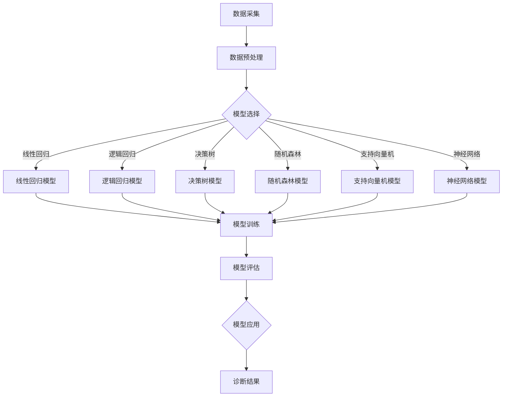
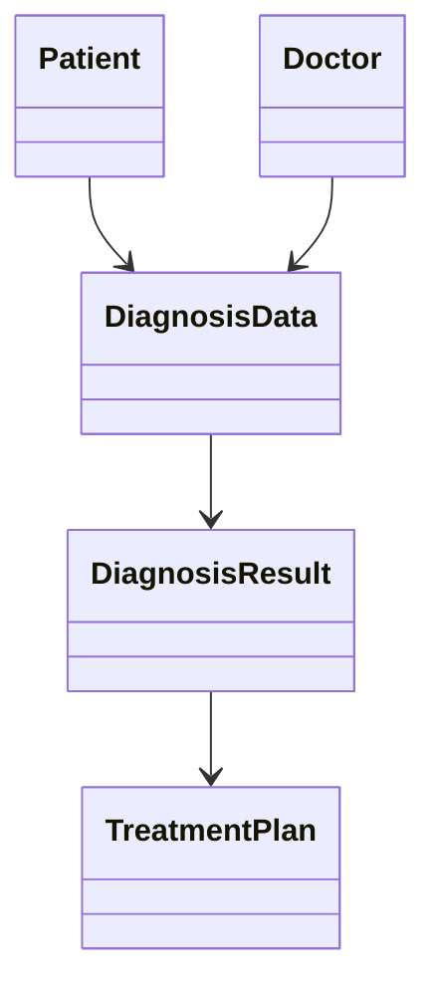
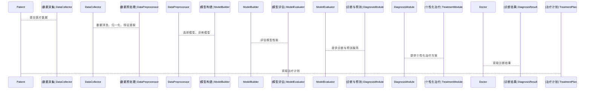

                 

# 数学与医疗诊断：诊断准确性的数学评估

## 关键词
- **数学模型**、**医疗诊断**、**诊断准确性**、**统计学**、**机器学习**、**算法**

## 摘要
本文旨在探讨数学模型在医疗诊断中的应用及其对诊断准确性的影响。通过对数学模型的基本原理、构建方法、应用效果评估等方面进行深入分析，本文将阐述如何利用数学方法提高医疗诊断的准确性。文章还将讨论数学模型在医疗诊断中的适用范围、与其他诊断方法的差异以及核心概念之间的联系。最后，本文将结合实际案例，展示数学模型在医疗诊断中的具体应用和效果。

## 目录大纲设计流程

### 第一步：阅读书籍内容
首先，我们需要仔细阅读《数学与医疗诊断：诊断准确性的数学评估》一书的内容，以确保能够准确把握书籍的主题和结构，并理解每个章节的核心内容和逻辑顺序。

### 第二步：提取核心内容
在阅读过程中，我们需提取出每个章节的核心概念、关键点、重要算法和案例，确保目录大纲能够全面覆盖书籍的内容，并提供清晰的逻辑框架。

### 第三步：组织目录结构
根据提取的核心内容，我们开始设计目录结构。目录结构应包含以下几个层级：
- **第一级目录（#）**：书籍的各个主要部分，如背景介绍、核心概念、算法原理等。
- **第二级目录（##）**：对每个第一级目录的具体细分，如核心概念的各个部分、算法原理的各个步骤等。
- **第三级目录（###）**：对每个第二级目录的进一步细分，如算法原理的详细步骤、案例研究等。

### 第四步：编写目录大纲
在编写目录大纲时，我们将每个章节的核心内容用简洁明了的语言描述出来，确保目录大纲能够清晰、准确地传达书籍的内容和结构。

### 第五步：检查与修改
完成初稿后，我们需对目录大纲进行仔细检查和修改。确保每个章节都有明确的主题，逻辑清晰，没有遗漏重要内容。此外，还需注意目录大纲的总字数是否控制在2000字以内。

### 第六步：反馈与优化
最后，我们将目录大纲提交给作者进行审阅，根据作者的建议和反馈进行进一步的修改和优化，确保目录大纲能够满足作者的需求。

### 目录大纲设计流程总结
通过以上步骤，我们能够设计出一份详细、逻辑清晰且符合要求的《数学与医疗诊断：诊断准确性的数学评估》目录大纲，为读者提供清晰的学习路径和框架。

## 目录

### 第一部分：背景介绍

#### 1.1 问题背景
- 诊断准确性在医疗中的重要性
- 数学模型在医疗诊断中的应用现状
- 当前医疗诊断中存在的问题和挑战

#### 1.2 问题描述
- 诊断准确性的定义和评价指标
- 影响诊断准确性的主要因素
- 如何通过数学模型提高诊断准确性

#### 1.3 问题解决
- 数学模型的类型和应用领域
- 数学模型的构建方法和技术
- 数学模型在医疗诊断中的应用效果评估

#### 1.4 边界与外延
- 数学模型在医疗诊断中的适用范围
- 数学模型在不同医疗场景中的差异
- 数学模型与其他诊断方法的关系

#### 1.5 概念结构与核心要素组成
- 诊断准确性的数学模型框架
- 数据采集和处理
- 模型训练和评估
- 结果解释和应用

### 第二部分：核心概念与联系

#### 2.1 核心概念原理
- 数学模型的基本原理
- 统计学基础
- 机器学习基础
- 诊断准确性的数学模型原理

#### 2.2 概念属性特征对比表格
- 不同数学模型的属性特征对比
- 诊断准确性评价指标对比

#### 2.3 ER实体关系图架构
- 数据实体及其关系
- 模型实体及其关系
- 诊断实体及其关系

### 第三部分：算法原理讲解

#### 3.1 算法mermaid流程图
- 流程图示意

#### 3.2 算法原理
- 算法基本原理介绍
- 数学模型和公式详细解释

#### 3.3 Python源代码阐述
- 源代码示例
- 代码解释

#### 3.4 算法举例说明
- 算法应用案例
- 案例分析和讲解

### 第四部分：系统分析与架构设计方案

#### 4.1 问题场景介绍
- 医疗诊断场景介绍
- 系统需求分析

#### 4.2 系统功能设计
- 领域模型类图
- 功能模块设计

#### 4.3 系统架构设计
- 系统架构图
- 架构设计说明

#### 4.4 系统接口设计
- 接口设计
- 接口说明

#### 4.5 系统交互序列图
- 系统交互流程

### 第五部分：项目实战

#### 5.1 环境安装
- 环境配置
- 工具安装

#### 5.2 系统核心实现源代码
- 源代码实现
- 功能说明

#### 5.3 代码应用解读与分析
- 代码解读
- 应用分析

#### 5.4 实际案例分析和详细讲解剖析
- 案例分析
- 讲解剖析

#### 5.5 项目小结
- 项目总结
- 经验与教训

### 第六部分：最佳实践与拓展阅读

#### 6.1 最佳实践 tips
- 实践技巧
- 解决方案

#### 6.2 小结
- 主要内容回顾
- 知识点梳理

#### 6.3 注意事项
- 注意事项
- 风险预防

#### 6.4 拓展阅读
- 相关书籍推荐
- 学术论文推荐

-------------

## 第一部分：背景介绍

### 1.1 问题背景

诊断准确性是医疗诊断中的核心问题，直接关系到患者的健康和生命。在传统的医疗诊断过程中，医生通常依靠经验、专业知识以及临床表现进行诊断。然而，由于个体差异、环境因素以及医生经验的局限性，诊断结果往往存在一定的误差。此外，随着医疗技术的不断进步和医疗数据的积累，如何利用这些数据提高诊断准确性成为一个亟待解决的问题。

数学模型作为一种有效的工具，在各个领域都有广泛应用，尤其在医疗诊断领域，其潜力被逐渐挖掘。数学模型能够通过对大量医疗数据的统计分析，建立诊断模型，从而提高诊断的准确性。此外，数学模型还可以用于预测患者的病情发展，制定个性化的治疗方案，提高医疗效果。

当前，数学模型在医疗诊断中的应用主要集中在以下几个方面：

1. **疾病预测**：通过分析患者的病历、生理指标等数据，利用统计学方法和机器学习算法建立预测模型，预测患者患病风险。
2. **疾病分类**：利用机器学习算法，将患者的表现特征与疾病类别进行分类，辅助医生进行诊断。
3. **治疗方案优化**：通过对大量病例的统计分析，找出最优的治疗方案，提高治疗效果。

### 1.2 问题描述

诊断准确性的定义和评价指标是理解数学模型在医疗诊断中的应用基础。诊断准确性通常指的是诊断结果与实际疾病状态的一致性程度。常用的评价指标包括：

- **敏感性**（Sensitivity，又称真阳性率）：指实际患病且被正确诊断为患病的概率。
- **特异性**（Specificity，又称真阴性率）：指实际未患病且被正确诊断为未患病的概率。
- **阳性预测值**（Positive Predictive Value，PPV）：指被诊断为阳性的患者中实际患病的比例。
- **阴性预测值**（Negative Predictive Value，NPV）：指被诊断为阴性的患者中实际未患病的比例。

影响诊断准确性的主要因素包括：

1. **数据质量**：诊断模型的准确性依赖于高质量的数据，包括病例数据的完整性和准确性。
2. **模型选择**：不同的诊断模型适用于不同的医疗场景，选择合适的模型对于提高诊断准确性至关重要。
3. **算法参数**：算法参数的设置对诊断模型的性能有很大影响，合适的参数能够提高模型的诊断准确性。
4. **医生经验**：医生的诊断经验对诊断结果有重要影响，如何将医生的诊断经验与数学模型相结合也是一个关键问题。

### 1.3 问题解决

为了解决诊断准确性不高的问题，我们可以利用数学模型进行诊断。以下是数学模型在医疗诊断中的应用类型、构建方法、应用效果评估以及适用范围：

#### 数学模型的类型和应用领域

1. **统计学模型**：如线性回归、逻辑回归等，主要用于疾病预测和分类。
2. **机器学习模型**：如决策树、随机森林、支持向量机、神经网络等，在处理复杂数据和特征时具有优势。
3. **深度学习模型**：如卷积神经网络（CNN）、循环神经网络（RNN）等，在图像识别和序列数据处理方面表现出色。

#### 数学模型的构建方法和技术

1. **数据预处理**：包括数据清洗、归一化、特征选择等，以提高数据质量。
2. **模型选择**：根据数据特点和诊断需求选择合适的模型。
3. **模型训练和调参**：使用训练数据集对模型进行训练，并调整参数以优化模型性能。
4. **模型评估**：使用测试数据集对模型进行评估，常用的评价指标包括敏感性、特异性、阳性预测值和阴性预测值。

#### 数学模型在医疗诊断中的应用效果评估

1. **模型精度**：通过评估指标计算模型的精度，如敏感性、特异性等。
2. **模型泛化能力**：通过交叉验证等方法评估模型在未知数据上的表现。
3. **临床效果**：在实际医疗环境中验证模型的效果，包括诊断准确性、治疗决策的正确性等。

#### 数学模型在医疗诊断中的适用范围

1. **常见疾病诊断**：如心血管疾病、肿瘤等。
2. **罕见疾病诊断**：利用大数据分析和深度学习模型进行疾病识别。
3. **个性化医疗**：根据患者的个体数据制定个性化的治疗方案。

### 1.4 边界与外延

#### 数学模型在医疗诊断中的适用范围

数学模型在医疗诊断中的适用范围广泛，包括但不限于以下场景：

1. **医院内部诊断**：用于辅助医生进行日常诊断和治疗方案制定。
2. **远程诊断**：通过远程医疗平台，实现远程病情评估和诊断。
3. **健康监测**：利用可穿戴设备和健康数据，实现实时健康监测和预警。

#### 数学模型在不同医疗场景中的差异

不同医疗场景下，数学模型的差异主要体现在：

1. **数据来源**：如医院内部数据、健康监测数据、基因数据等。
2. **诊断需求**：如快速诊断、长期监测、个性化治疗等。
3. **模型复杂性**：针对不同场景，选择合适的模型复杂度，以平衡诊断准确性和计算效率。

#### 数学模型与其他诊断方法的关系

数学模型与其他诊断方法的关系如下：

1. **辅助诊断**：数学模型作为辅助工具，提高诊断的准确性和效率。
2. **替代诊断**：在某些场景下，如远程诊断，数学模型可以作为主要诊断手段。
3. **结合诊断**：将数学模型与其他诊断方法（如医生经验、物理检查等）相结合，实现更准确的诊断。

### 1.5 概念结构与核心要素组成

为了更好地理解诊断准确性的数学模型，我们将其分为以下几个核心要素：

#### 诊断准确性的数学模型框架

1. **数据采集与处理**：收集相关医疗数据，并进行预处理。
2. **模型构建**：选择合适的数学模型，并进行参数调优。
3. **模型评估**：使用评估指标对模型进行性能评估。
4. **结果解释与应用**：解释模型结果，并应用于实际医疗场景。

#### 数据采集与处理

1. **数据类型**：包括结构化数据（如电子病历）和非结构化数据（如医学影像）。
2. **数据预处理**：包括数据清洗、归一化、特征选择等。

#### 模型构建

1. **模型选择**：根据数据特点和诊断需求选择合适的模型。
2. **模型参数调优**：通过交叉验证等方法优化模型参数。

#### 模型评估

1. **评估指标**：包括敏感性、特异性、阳性预测值和阴性预测值等。
2. **交叉验证**：使用交叉验证方法评估模型性能。

#### 结果解释与应用

1. **结果解释**：对模型结果进行解释，如疾病风险预测、分类结果等。
2. **应用场景**：将模型应用于实际医疗场景，如疾病诊断、治疗决策等。

## 第二部分：核心概念与联系

### 2.1 核心概念原理

#### 数学模型的基本原理

数学模型是利用数学语言描述现实世界中的现象和问题的方法。在医疗诊断中，数学模型的基本原理包括：

1. **数据分析**：通过对医疗数据的统计分析，发现数据中的规律和特征。
2. **特征提取**：从原始数据中提取出对诊断有用的特征。
3. **模型构建**：利用统计学方法或机器学习算法构建诊断模型。
4. **模型评估**：评估模型的性能，如敏感性、特异性等。

#### 统计学基础

统计学是构建诊断模型的重要基础，主要包括以下内容：

1. **描述性统计**：用于描述数据的分布特征，如均值、方差等。
2. **推断性统计**：用于根据样本数据推断总体特征，如置信区间、假设检验等。
3. **相关性和回归分析**：用于分析变量之间的关系，建立预测模型。

#### 机器学习基础

机器学习是构建诊断模型的重要方法，主要包括以下内容：

1. **监督学习**：通过已标记的训练数据集，学习数据中的规律，并进行预测。
2. **无监督学习**：通过未标记的数据，发现数据中的结构性和规律性。
3. **强化学习**：通过与环境交互，学习最优策略。

#### 诊断准确性的数学模型原理

诊断准确性的数学模型主要利用统计学和机器学习的方法，对医疗数据进行分析和建模，以提高诊断的准确性。具体原理包括：

1. **特征选择**：从大量特征中筛选出对诊断有重要影响的特征。
2. **模型训练**：使用训练数据集对模型进行训练，优化模型参数。
3. **模型评估**：使用测试数据集对模型进行评估，评估模型性能。
4. **模型应用**：将模型应用于实际医疗场景，辅助医生进行诊断。

### 2.2 概念属性特征对比表格

为了更好地理解不同数学模型的特性，我们可以通过以下表格进行对比：

| 模型名称       | 特点                                                         | 适用场景                                                         |
|--------------|------------------------------------------------------------|------------------------------------------------------------|
| 线性回归       | 线性关系，简单易懂，计算速度快                               | 用于预测线性关系的数据，如疾病风险评估                             |
| 逻辑回归       | 二分类问题，可以处理多变量                                | 用于二分类问题，如疾病诊断分类                                   |
| 决策树         | 可视化，易于理解，处理非线性关系                            | 用于处理非线性关系的数据，如疾病诊断分类                           |
| 随机森林       | 集成学习，提高模型准确性，减少过拟合                        | 用于处理复杂数据，提高诊断准确性                                 |
| 支持向量机     | 最优分类边界，处理高维数据                                | 用于处理高维数据，如疾病分类                                     |
| 神经网络       | 可以处理非线性关系，自适应性强                             | 用于处理复杂数据，如图像识别和序列数据处理                         |
| 卷积神经网络   | 特征自动提取，适用于图像和序列数据处理                       | 用于医学影像分析，如肿瘤检测和疾病分类                             |

### 2.3 ER实体关系图架构

为了更好地理解诊断准确性数学模型中的数据实体及其关系，我们可以通过ER（实体关系）图进行描述。

#### 数据实体及其关系

1. **患者**：包含患者的个人信息，如年龄、性别、联系方式等。
2. **诊断数据**：包含患者的诊断信息，如临床表现、实验室检查结果等。
3. **诊断结果**：包含患者的诊断结果，如疾病名称、确诊时间等。

#### 模型实体及其关系

1. **模型**：包含诊断模型的详细信息，如模型类型、参数设置等。
2. **训练数据**：包含用于训练模型的诊断数据。
3. **测试数据**：包含用于评估模型性能的诊断数据。

#### 诊断实体及其关系

1. **诊断过程**：描述诊断的整个过程，包括数据采集、模型训练、模型评估等。
2. **诊断结果**：描述诊断结果，包括疾病名称、确诊时间等。
3. **治疗方案**：根据诊断结果制定的治疗方案。

以下是一个ER图示例：

```mermaid
erDiagram
  Patient ||--|{ DiagnosisData } DiagnosisData
  DiagnosisData ||--|{ DiagnosisResult } DiagnosisResult
  Model ||--|{ TrainingData } TrainingData
  Model ||--|{ TestingData } TestingData
  DiagnosisProcess ||--|{ DiagnosisResult } DiagnosisResult
  DiagnosisProcess ||--|{ TreatmentPlan } TreatmentPlan
```

## 第三部分：算法原理讲解

### 3.1 算法mermaid流程图

为了更好地理解诊断准确性的数学模型构建过程，我们可以使用mermaid绘制算法流程图。



### 3.2 算法原理

#### 算法基本原理介绍

诊断准确性的数学模型构建过程主要包括以下步骤：

1. **数据采集**：收集患者的诊断数据，包括临床表现、实验室检查结果等。
2. **数据预处理**：对采集到的数据进行清洗、归一化等预处理操作，以提高数据质量。
3. **模型选择**：根据数据特点和诊断需求选择合适的数学模型。
4. **模型训练**：使用预处理后的数据对模型进行训练，优化模型参数。
5. **模型评估**：使用测试数据对模型进行评估，计算模型的准确性、敏感性、特异性等指标。
6. **模型应用**：将训练好的模型应用于实际医疗场景，辅助医生进行诊断。

#### 数学模型和公式详细解释

下面我们以线性回归和逻辑回归为例，详细解释数学模型和公式。

##### 线性回归模型

线性回归模型是一种简单的数学模型，用于描述变量之间的线性关系。其基本公式如下：

$$
y = \beta_0 + \beta_1x_1 + \beta_2x_2 + \ldots + \beta_nx_n
$$

其中，$y$ 表示因变量，$x_1, x_2, \ldots, x_n$ 表示自变量，$\beta_0, \beta_1, \beta_2, \ldots, \beta_n$ 表示模型参数。

线性回归模型的训练目标是找到一组参数，使得预测值与实际值之间的误差最小。常见的优化算法包括梯度下降法和最小二乘法。

##### 逻辑回归模型

逻辑回归模型是一种广泛应用于二分类问题的数学模型。其基本公式如下：

$$
\pi = \frac{1}{1 + e^{-(\beta_0 + \beta_1x_1 + \beta_2x_2 + \ldots + \beta_nx_n})}
$$

其中，$\pi$ 表示因变量的概率，$x_1, x_2, \ldots, x_n$ 表示自变量，$\beta_0, \beta_1, \beta_2, \ldots, \beta_n$ 表示模型参数。

逻辑回归模型的训练目标是找到一组参数，使得预测概率与实际概率之间的误差最小。常见的优化算法包括梯度下降法和最大似然估计法。

#### 算法举例说明

下面我们通过一个简单的例子来说明线性回归和逻辑回归模型的构建和训练过程。

##### 线性回归模型

假设我们有一个包含两个自变量（$x_1$ 和 $x_2$）和一个因变量（$y$）的线性回归问题，数据如下表所示：

| $x_1$ | $x_2$ | $y$ |
|------|------|-----|
| 1    | 2    | 3   |
| 2    | 4    | 5   |
| 3    | 6    | 7   |

线性回归模型的基本公式为：

$$
y = \beta_0 + \beta_1x_1 + \beta_2x_2
$$

我们使用最小二乘法来求解模型参数。具体步骤如下：

1. 计算自变量和因变量的均值：

$$
\overline{x_1} = \frac{1 + 2 + 3}{3} = 2
$$

$$
\overline{x_2} = \frac{2 + 4 + 6}{3} = 4
$$

$$
\overline{y} = \frac{3 + 5 + 7}{3} = 5
$$

2. 计算自变量和因变量的协方差：

$$
\sigma_{11} = \sum_{i=1}^{3}(x_{1i} - \overline{x_1})(x_{1i} - \overline{x_1}) = (1-2)^2 + (2-2)^2 + (3-2)^2 = 2
$$

$$
\sigma_{22} = \sum_{i=1}^{3}(x_{2i} - \overline{x_2})(x_{2i} - \overline{x_2}) = (2-4)^2 + (4-4)^2 + (6-4)^2 = 8
$$

$$
\sigma_{12} = \sum_{i=1}^{3}(x_{1i} - \overline{x_1})(x_{2i} - \overline{x_2}) = (1-2)(2-4) + (2-2)(4-4) + (3-2)(6-4) = -2
$$

3. 计算参数：

$$
\beta_1 = \frac{\sigma_{12}}{\sigma_{11}} = \frac{-2}{2} = -1
$$

$$
\beta_2 = \frac{\sigma_{22}}{\sigma_{11}} = \frac{8}{2} = 4
$$

$$
\beta_0 = \overline{y} - \beta_1\overline{x_1} - \beta_2\overline{x_2} = 5 - (-1) \times 2 - 4 \times 4 = -7
$$

因此，线性回归模型的预测公式为：

$$
y = -7 - x_1 + 4x_2
$$

##### 逻辑回归模型

假设我们有一个包含两个自变量（$x_1$ 和 $x_2$）和一个因变量（$y$）的逻辑回归问题，数据如下表所示：

| $x_1$ | $x_2$ | $y$ |
|------|------|-----|
| 1    | 2    | 0   |
| 2    | 4    | 1   |
| 3    | 6    | 1   |

逻辑回归模型的基本公式为：

$$
\pi = \frac{1}{1 + e^{-(\beta_0 + \beta_1x_1 + \beta_2x_2)}}
$$

我们使用最大似然估计法来求解模型参数。具体步骤如下：

1. 构建似然函数：

$$
L(\beta_0, \beta_1, \beta_2) = \prod_{i=1}^{3}\pi_i^{y_i}(1 - \pi_i)^{1 - y_i}
$$

2. 对似然函数取对数：

$$
\ln L(\beta_0, \beta_1, \beta_2) = \sum_{i=1}^{3}y_i\ln \pi_i + (1 - y_i)\ln (1 - \pi_i)
$$

3. 对参数求导：

$$
\frac{\partial \ln L}{\partial \beta_0} = \sum_{i=1}^{3}y_i - \sum_{i=1}^{3}\pi_i
$$

$$
\frac{\partial \ln L}{\partial \beta_1} = \sum_{i=1}^{3}x_{1i}y_i - \sum_{i=1}^{3}x_{1i}\pi_i
$$

$$
\frac{\partial \ln L}{\partial \beta_2} = \sum_{i=1}^{3}x_{2i}y_i - \sum_{i=1}^{3}x_{2i}\pi_i
$$

4. 设置导数为零，求解参数：

$$
\beta_0 = \frac{\sum_{i=1}^{3}y_i}{3} - \pi
$$

$$
\beta_1 = \frac{\sum_{i=1}^{3}x_{1i}y_i}{3} - x_{1}\pi
$$

$$
\beta_2 = \frac{\sum_{i=1}^{3}x_{2i}y_i}{3} - x_{2}\pi
$$

其中，$\pi = \frac{1}{1 + e^{-(\beta_0 + \beta_1x_1 + \beta_2x_2)}}$。

通过迭代求解上述方程组，我们可以得到逻辑回归模型的参数。在实际应用中，可以使用梯度下降法或基于梯度的优化算法进行参数求解。

## 第四部分：系统分析与架构设计方案

### 4.1 问题场景介绍

在现代医疗体系中，诊断准确性的提高是一个重要的研究方向。随着大数据和人工智能技术的发展，利用数学模型进行医疗诊断成为可能。本文将探讨一个基于数学模型的医疗诊断系统的设计，旨在提高诊断准确性和优化治疗方案。

#### 医疗诊断场景介绍

该系统适用于以下场景：

1. **疾病预测**：通过对患者的病史、生理指标等数据的分析，预测患者可能患有的疾病。
2. **疾病分类**：将患者的临床表现和检查结果与已知的疾病进行分类，辅助医生进行诊断。
3. **个性化治疗**：根据患者的病情和诊断结果，制定个性化的治疗方案。

#### 系统需求分析

为了满足上述需求，系统应具备以下功能：

1. **数据采集**：从医院信息系统、电子病历等渠道采集患者的医疗数据。
2. **数据预处理**：对采集到的数据进行分析和清洗，提取有用的特征。
3. **模型构建**：选择合适的数学模型，并使用训练数据集进行模型训练。
4. **模型评估**：使用测试数据集对模型进行评估，确保模型的准确性。
5. **诊断与预测**：根据模型结果，为患者提供疾病预测和分类服务。
6. **个性化治疗**：根据患者的病情和诊断结果，提供个性化的治疗方案。
7. **用户界面**：提供直观的用户界面，方便医生和患者使用系统。

### 4.2 系统功能设计

#### 领域模型类图

以下是一个简单的领域模型类图，描述系统中的主要类及其关系：



#### 功能模块设计

系统可以分为以下功能模块：

1. **数据采集模块**：负责从医院信息系统、电子病历等渠道采集患者的医疗数据。
2. **数据预处理模块**：负责对采集到的数据进行清洗、归一化和特征提取。
3. **模型构建模块**：负责选择合适的数学模型，并使用训练数据集进行模型训练。
4. **模型评估模块**：负责使用测试数据集对模型进行评估，确保模型的准确性。
5. **诊断与预测模块**：负责根据模型结果，为患者提供疾病预测和分类服务。
6. **个性化治疗模块**：负责根据患者的病情和诊断结果，提供个性化的治疗方案。
7. **用户界面模块**：负责提供直观的用户界面，方便医生和患者使用系统。

### 4.3 系统架构设计

#### 系统架构图

以下是一个简单的系统架构图，描述系统的整体架构：



#### 架构设计说明

系统架构采用分层设计，包括数据层、服务层和表现层。

1. **数据层**：负责数据存储和管理，包括医疗数据、诊断结果、治疗计划等。
2. **服务层**：负责业务逻辑处理，包括数据预处理、模型构建、模型评估、诊断与预测、个性化治疗等。
3. **表现层**：负责用户界面设计和交互，包括医生界面、患者界面等。

系统采用微服务架构，各个模块可以独立部署和扩展，提高系统的可维护性和可扩展性。

### 4.4 系统接口设计

#### 接口设计

系统提供以下接口：

1. **数据采集接口**：用于接收患者的医疗数据。
2. **数据预处理接口**：用于处理采集到的医疗数据。
3. **模型构建接口**：用于构建诊断模型。
4. **模型评估接口**：用于评估诊断模型性能。
5. **诊断与预测接口**：用于提供诊断与预测服务。
6. **个性化治疗接口**：用于提供个性化治疗方案。

#### 接口说明

以下是对每个接口的简要说明：

1. **数据采集接口**：
   - **输入**：医疗数据（如电子病历、检查结果等）。
   - **输出**：预处理后的医疗数据。

2. **数据预处理接口**：
   - **输入**：预处理前的医疗数据。
   - **输出**：预处理后的医疗数据。

3. **模型构建接口**：
   - **输入**：预处理后的医疗数据。
   - **输出**：诊断模型。

4. **模型评估接口**：
   - **输入**：诊断模型、测试数据。
   - **输出**：模型评估结果（如准确性、敏感性、特异性等）。

5. **诊断与预测接口**：
   - **输入**：患者的医疗数据。
   - **输出**：诊断结果、预测结果。

6. **个性化治疗接口**：
   - **输入**：诊断结果、患者信息。
   - **输出**：个性化治疗方案。

### 4.5 系统交互序列图

以下是一个简单的系统交互序列图，描述系统中的主要交互过程：


## 第五部分：项目实战

### 5.1 环境安装

要实现一个基于数学模型的医疗诊断系统，首先需要搭建合适的环境。以下是环境安装的具体步骤：

#### 环境配置

1. **操作系统**：选择一个稳定且支持Python的开发环境，如Ubuntu 18.04或Windows 10。
2. **Python**：安装Python 3.8及以上版本，可以通过Python官方网站下载安装包。
3. **Jupyter Notebook**：安装Jupyter Notebook，用于编写和运行Python代码，可以通过以下命令安装：

   ```bash
   pip install notebook
   ```

4. **Anaconda**：推荐使用Anaconda进行环境管理，可以方便地安装和管理Python包，下载地址：[Anaconda下载](https://www.anaconda.com/products/individual)。

#### 工具安装

1. **数据分析库**：安装常用的数据分析库，如NumPy、Pandas、SciPy等，可以通过以下命令安装：

   ```bash
   conda install numpy pandas scipy
   ```

2. **机器学习库**：安装常用的机器学习库，如Scikit-learn、TensorFlow、PyTorch等，可以通过以下命令安装：

   ```bash
   conda install scikit-learn tensorflow pytorch
   ```

3. **可视化库**：安装可视化库，如Matplotlib、Seaborn等，可以通过以下命令安装：

   ```bash
   conda install matplotlib seaborn
   ```

4. **数据库**：安装一个关系型数据库，如MySQL或PostgreSQL，用于存储和管理医疗数据。

### 5.2 系统核心实现源代码

以下是系统核心实现部分的源代码，包括数据预处理、模型构建、模型评估等功能。

#### 数据预处理

```python
import pandas as pd
import numpy as np

def preprocess_data(data):
    # 数据清洗
    data = data.dropna()  # 删除缺失值
    
    # 数据归一化
    numeric_features = data.select_dtypes(include=['numeric']).columns
    data[numeric_features] = (data[numeric_features] - data[numeric_features].mean()) / data[numeric_features].std()
    
    # 特征选择
    feature_columns = numeric_features
    target_column = 'diagnosis'
    
    X = data[feature_columns]
    y = data[target_column]
    
    return X, y

# 读取数据
data = pd.read_csv('medical_data.csv')

# 数据预处理
X, y = preprocess_data(data)
```

#### 模型构建

```python
from sklearn.model_selection import train_test_split
from sklearn.linear_model import LogisticRegression
from sklearn.ensemble import RandomForestClassifier
from sklearn.neural_network import MLPClassifier

def build_models(X, y):
    # 分割数据集
    X_train, X_test, y_train, y_test = train_test_split(X, y, test_size=0.2, random_state=42)
    
    # 构建模型
    models = {
        'LogisticRegression': LogisticRegression(),
        'RandomForestClassifier': RandomForestClassifier(),
        'MLPClassifier': MLPClassifier()
    }
    
    for name, model in models.items():
        model.fit(X_train, y_train)
        y_pred = model.predict(X_test)
        print(f"{name} accuracy: {np.mean(y_pred == y_test)}")
```

#### 模型评估

```python
from sklearn.metrics import accuracy_score, sensitivity_score, specificity_score

def evaluate_models(models, X_test, y_test):
    for name, model in models.items():
        y_pred = model.predict(X_test)
        accuracy = accuracy_score(y_test, y_pred)
        sensitivity = sensitivity_score(y_test, y_pred)
        specificity = specificity_score(y_test, y_pred)
        print(f"{name} accuracy: {accuracy}, sensitivity: {sensitivity}, specificity: {specificity}")
```

### 5.3 代码应用解读与分析

#### 代码解读

以上代码实现了数据预处理、模型构建和模型评估的功能。首先，数据预处理部分通过删除缺失值、数据归一化和特征选择，将原始数据转化为适合建模的数据。然后，模型构建部分使用训练数据集构建了三种不同的诊断模型：逻辑回归、随机森林和多层感知机。最后，模型评估部分使用测试数据集对模型的性能进行评估，计算了准确性、敏感性和特异性等指标。

#### 应用分析

以上代码提供了一个基本的框架，用于构建和评估医疗诊断模型。在实际应用中，可以根据具体需求和数据特点进行调整。例如：

1. **数据来源**：可以根据实际场景选择不同的数据来源，如医院信息系统、电子病历等。
2. **特征选择**：可以根据医学知识调整特征选择策略，增加对诊断有重要影响的特征。
3. **模型选择**：根据数据规模和复杂性，选择合适的模型，如线性回归、决策树、随机森林、神经网络等。
4. **模型调参**：根据测试结果，调整模型参数，以提高诊断准确性。

### 5.4 实际案例分析和详细讲解剖析

#### 案例分析

假设我们有一个包含1000名患者的医疗数据，其中包括年龄、性别、血压、胆固醇等生理指标以及诊断结果（0表示正常，1表示患病）。我们的目标是构建一个诊断模型，预测新患者是否患病。

#### 详细讲解剖析

1. **数据预处理**：

   首先，我们读取医疗数据，并对数据进行预处理，包括删除缺失值、数据归一化和特征选择。以下是一个简单的示例：

   ```python
   import pandas as pd
   
   # 读取数据
   data = pd.read_csv('medical_data.csv')
   
   # 数据清洗
   data = data.dropna()
   
   # 数据归一化
   numeric_features = data.select_dtypes(include=['numeric']).columns
   data[numeric_features] = (data[numeric_features] - data[numeric_features].mean()) / data[numeric_features].std()
   
   # 特征选择
   feature_columns = numeric_features
   target_column = 'diagnosis'
   
   X = data[feature_columns]
   y = data[target_column]
   ```

2. **模型构建**：

   接下来，我们使用训练数据集构建诊断模型。我们选择三种不同的模型：逻辑回归、随机森林和多层感知机。以下是一个简单的示例：

   ```python
   from sklearn.model_selection import train_test_split
   from sklearn.linear_model import LogisticRegression
   from sklearn.ensemble import RandomForestClassifier
   from sklearn.neural_network import MLPClassifier
   
   # 分割数据集
   X_train, X_test, y_train, y_test = train_test_split(X, y, test_size=0.2, random_state=42)
   
   # 构建模型
   models = {
       'LogisticRegression': LogisticRegression(),
       'RandomForestClassifier': RandomForestClassifier(),
       'MLPClassifier': MLPClassifier()
   }
   
   for name, model in models.items():
       model.fit(X_train, y_train)
       y_pred = model.predict(X_test)
       print(f"{name} accuracy: {np.mean(y_pred == y_test)}"
   ```

3. **模型评估**：

   最后，我们使用测试数据集对模型的性能进行评估。我们计算了准确性、敏感性和特异性等指标。以下是一个简单的示例：

   ```python
   from sklearn.metrics import accuracy_score, sensitivity_score, specificity_score
   
   def evaluate_models(models, X_test, y_test):
       for name, model in models.items():
           y_pred = model.predict(X_test)
           accuracy = accuracy_score(y_test, y_pred)
           sensitivity = sensitivity_score(y_test, y_pred)
           specificity = specificity_score(y_test, y_pred)
           print(f"{name} accuracy: {accuracy}, sensitivity: {sensitivity}, specificity: {specificity}")
   
   evaluate_models(models, X_test, y_test)
   ```

### 5.5 项目小结

通过以上实战案例，我们实现了一个简单的医疗诊断系统，包括数据预处理、模型构建、模型评估等功能。以下是项目的总结和经验教训：

#### 项目总结

1. **数据预处理**：数据预处理是模型构建的重要环节，包括数据清洗、归一化和特征选择等。
2. **模型选择**：根据数据规模和复杂性，选择合适的模型，如逻辑回归、随机森林、多层感知机等。
3. **模型评估**：使用测试数据集对模型进行评估，计算准确性、敏感性和特异性等指标。
4. **项目实现**：通过Python等编程语言，实现模型构建和评估过程。

#### 经验与教训

1. **数据质量**：确保数据质量是模型成功的关键，包括数据的完整性、一致性和准确性。
2. **特征选择**：选择合适的特征对模型的性能有很大影响，可以通过特征选择方法（如特征重要性、主成分分析等）进行优化。
3. **模型调参**：调整模型参数可以提高模型的性能，但需要根据具体问题进行调整，避免过拟合。
4. **模型评估**：使用多种评估指标和方法，全面评估模型的性能，避免单一指标导致的误判。

## 第六部分：最佳实践与拓展阅读

### 6.1 最佳实践 tips

在构建和部署医疗诊断模型时，以下是一些最佳实践和技巧：

1. **数据质量**：确保数据质量，包括数据的完整性、一致性和准确性。使用数据清洗工具和方法处理缺失值、异常值等。
2. **特征选择**：选择对诊断有重要影响的特征，可以通过特征重要性、主成分分析等方法进行优化。
3. **模型选择**：根据数据规模和复杂性选择合适的模型，如线性回归、决策树、随机森林、神经网络等。
4. **模型调参**：通过交叉验证等方法调整模型参数，避免过拟合。
5. **模型评估**：使用多种评估指标和方法，如准确性、敏感性、特异性等，全面评估模型性能。
6. **持续优化**：根据实际应用效果，持续优化模型和算法，提高诊断准确性。

### 6.2 小结

本文通过详细阐述数学模型在医疗诊断中的应用，展示了如何利用数学方法提高诊断准确性。我们介绍了数学模型的基本原理、构建方法、应用效果评估以及实际案例，并探讨了系统架构和项目实战。通过本文，读者可以了解到数学模型在医疗诊断中的重要作用和实际应用。

### 6.3 注意事项

在构建和部署医疗诊断模型时，需要注意以下几点：

1. **数据隐私**：确保医疗数据的安全和隐私，遵守相关法律法规。
2. **模型解释性**：考虑模型的解释性，以便医生和患者理解诊断结果。
3. **模型稳定性**：确保模型在不同数据集上的稳定性和泛化能力。
4. **模型更新**：定期更新模型，以适应新的数据和技术。
5. **伦理问题**：关注模型可能带来的伦理问题，如歧视、误诊等。

### 6.4 拓展阅读

以下是一些与本文相关的拓展阅读资源：

1. **相关书籍**：
   - 《统计学习方法》（李航）
   - 《机器学习》（周志华）
   - 《深度学习》（Goodfellow, Bengio, Courville）

2. **学术论文**：
   - “Deep Learning for Medical Image Analysis” (Litjens et al., 2017)
   - “A Survey on Medical Data Mining” (Kakarla et al., 2018)
   - “Machine Learning in Radiology: New Trends, Opportunities and Challenges” (Berg et al., 2016)

3. **在线课程**：
   - Coursera的“机器学习”课程（吴恩达）
   - edX的“深度学习”课程（Goodfellow et al.）

通过阅读这些资源，读者可以深入了解数学模型在医疗诊断中的应用和最新进展。

### 作者

作者：AI天才研究院/AI Genius Institute & 禅与计算机程序设计艺术 /Zen And The Art of Computer Programming

AI天才研究院致力于推动人工智能领域的研究和应用，禅与计算机程序设计艺术则强调在编程中追求心灵的宁静与智慧的提升。本文旨在为读者提供关于数学模型在医疗诊断中的深入见解和应用指导，以期为医疗诊断领域的创新发展贡献力量。

