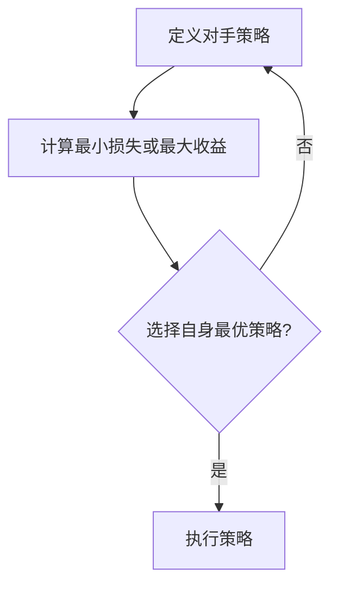
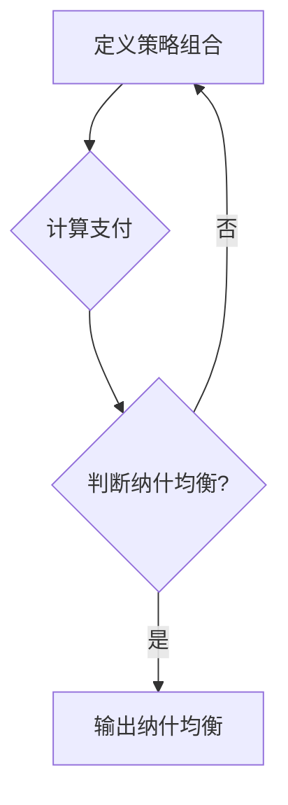
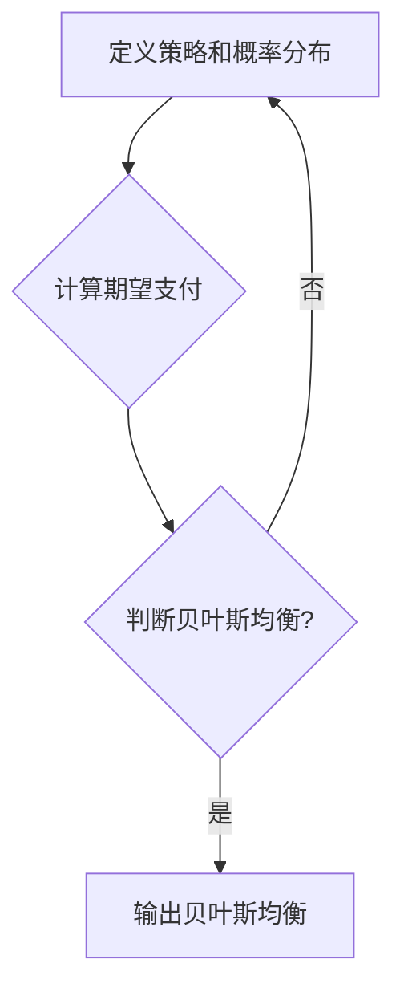
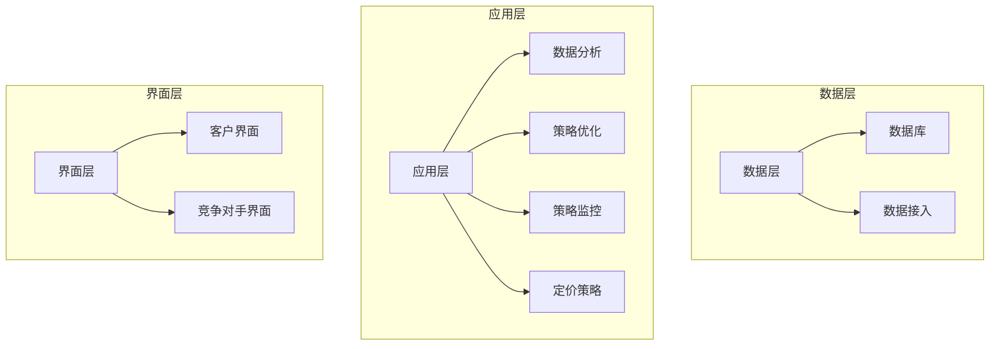
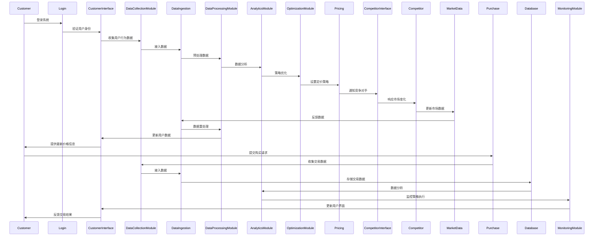

                 

### 文章标题：数学与博弈论：策略互动的数学分析

#### 关键词：博弈论，策略互动，数学模型，纳什均衡，贝叶斯均衡，算法原理

#### 摘要：
本文将深入探讨数学与博弈论之间的紧密联系，通过策略互动的数学分析，揭示博弈论在各个领域的应用及其核心算法原理。我们将从博弈论的基本概念出发，逐步分析其核心概念与联系，介绍经典的博弈论算法，讲解数学模型和公式，并探讨博弈论在系统架构设计中的应用，最终通过项目实战展示其应用效果。本文旨在为读者提供全面、系统的博弈论知识，帮助读者掌握这一强大工具在现实问题中的运用。

## 第1章 引言

### 1.1 博弈论概述

博弈论，是研究具有冲突或合作性质现象的数学理论。它起源于20世纪初，由约翰·冯·诺伊曼和经济学家奥斯卡·摩根斯坦共同创立。博弈论的发展历程中，许多学者做出了重要贡献，包括约翰·纳什、约翰·凯茨尼尔、莱因哈德·泽尔滕等，他们推动了博弈论在经济学、计算机科学、生物学等领域的广泛应用。

博弈论的主要研究对象是策略互动，即参与者在特定情境下做出的决策以及这些决策之间的相互作用。博弈论通过数学模型来描述这种互动，从而为分析决策提供了科学的方法。

博弈论的应用领域广泛，包括经济学、社会学、政治学、生物学、计算机科学等。在经济学中，博弈论用于分析市场竞争、拍卖机制、合作与竞争等；在计算机科学中，博弈论用于算法设计、网络博弈、人工智能等领域；在生物学中，博弈论用于研究物种间的竞争与合作等。

### 1.2 核心概念与联系

博弈论中的核心概念包括策略、支付、均衡等。策略是指参与者在博弈中采取的行动方案，支付是指参与者在博弈结束后获得的收益或损失，均衡是指所有参与者都不愿改变自身策略的状态。

策略集合是指所有可能的策略组合，支付函数是指参与者获得的收益或损失与策略组合之间的函数关系。均衡状态是指所有参与者都不愿改变自身策略的状态，即没有任何参与者可以通过改变策略获得更大的收益。

在博弈论中，这些概念之间存在紧密的联系。策略集合和支付函数共同构成了博弈的基本框架，均衡状态是博弈论分析的核心目标。通过分析策略互动和支付函数，可以揭示博弈的稳定性和参与者之间的利益冲突。

### 1.3 数学模型与公式

博弈论中的数学模型主要包括策略集合、支付函数和均衡状态。策略集合可以用集合表示，支付函数可以用矩阵或向量表示，均衡状态可以用纳什均衡、贝叶斯均衡等概念表示。

博弈论的数学公式主要包括最小最大化策略、期望值计算、条件概率等。最小最大化策略是指参与者选择的策略使得自己的收益最大或损失最小。期望值计算是指参与者根据概率分布计算自己的期望收益或损失。条件概率是指给定某些条件，事件发生的概率。

### 1.4 博弈论的算法

博弈论中有许多经典的算法，包括最小最大化策略、纳什均衡、贝叶斯均衡等。最小最大化策略是指参与者选择使得自己的收益最大或损失最小的策略。纳什均衡是指所有参与者都不愿改变自身策略的状态。贝叶斯均衡是指在不确定条件下，参与者选择的策略使得自己的期望收益最大。

这些算法在博弈论分析中发挥着重要作用。通过最小最大化策略，可以分析参与者如何选择策略以最大化自己的收益；通过纳什均衡，可以分析博弈的稳定性和参与者之间的策略互动；通过贝叶斯均衡，可以分析不确定条件下的决策问题。

### 1.5 博弈论的应用案例分析

博弈论在多个领域有着广泛的应用。在经济学中，博弈论用于分析市场竞争、拍卖机制、合作与竞争等。在计算机科学中，博弈论用于算法设计、网络博弈、人工智能等领域。在生物学中，博弈论用于研究物种间的竞争与合作等。

例如，在经济学中，博弈论可以用于分析市场竞争。假设有两个公司，A和B，它们在市场上竞争。公司A可以选择提高产品质量或者降低价格来吸引消费者，公司B也可以选择同样的策略。通过博弈论分析，可以确定两家公司在不同策略组合下的收益，从而找到最优策略组合。

在计算机科学中，博弈论可以用于算法设计。例如，在网络安全领域，攻击者与防御者之间的博弈就是一个典型的博弈问题。攻击者可以选择不同的攻击策略，防御者可以选择不同的防御策略。通过博弈论分析，可以找到最优的防御策略，从而提高网络的安全性。

### 1.6 系统架构设计

博弈论在系统架构设计中也具有重要作用。通过博弈论分析，可以设计出更加稳定、可靠的系统架构。在系统架构设计中，博弈论可以用于分析参与者之间的策略互动，从而找到最优的系统架构设计方案。

例如，在分布式系统设计中，可以通过博弈论分析参与者之间的策略互动，从而设计出能够自我调整、适应环境变化的系统架构。在网络安全领域，可以通过博弈论分析攻击者与防御者之间的博弈，从而设计出更加有效的防御策略。

### 1.7 项目实战

博弈论在实际问题中有着广泛的应用。通过项目实战，可以更好地理解博弈论的实际应用效果。

例如，在市场营销中，可以通过博弈论分析消费者与商家之间的策略互动，从而找到最优的市场营销策略。在供应链管理中，可以通过博弈论分析供应商与分销商之间的策略互动，从而优化供应链的运作。

在本文的后续章节中，我们将深入探讨博弈论的核心概念、算法原理和实际应用，通过具体的案例和项目实战，展示博弈论在各个领域的应用效果。

## 第2章 核心概念与联系

在博弈论中，核心概念与联系是理解和应用博弈论的基础。本章将详细探讨策略、支付、均衡等核心概念，并分析它们之间的联系。

### 2.1 策略

策略是博弈论中的基本概念，它是指参与者在博弈过程中采取的行动方案。在博弈中，每个参与者都有多个可能的策略选择。策略的选择取决于参与者的目标、信息集和博弈的具体情况。例如，在一个简单的博弈中，参与者A可以选择行动A1或A2，参与者B可以选择行动B1或B2。那么，这个博弈的策略空间可以表示为{（A1，B1），（A1，B2），（A2，B1），（A2，B2）}。

策略在博弈中起着关键作用，因为它们决定了参与者的收益和博弈的结果。在博弈论中，策略通常用函数表示，即策略函数π，其中π(i)表示参与者i的策略集合。例如，参与者A的策略函数可以表示为πA({A1，A2})，参与者B的策略函数可以表示为πB({B1，B2})。

### 2.2 支付

支付是博弈论中的另一个核心概念，它是指参与者在博弈结束后获得的收益或损失。支付通常用矩阵表示，其中矩阵的行表示参与者A的策略，列表示参与者B的策略。矩阵中的元素表示参与者A在采取特定策略时，根据参与者B采取的策略所获得的支付。

例如，考虑一个简单的博弈，参与者A和参与者B的策略空间分别为{A1，A2}和{B1，B2}。假设参与者A采取A1策略时，无论参与者B采取B1还是B2，参与者A都获得收益1；当参与者A采取A2策略时，如果参与者B采取B1，参与者A获得收益2，如果参与者B采取B2，参与者A获得收益0。那么，这个博弈的支付矩阵可以表示为：

|        | B1 | B2 |
|--------|----|----|
| A1     | 1  | 1  |
| A2     | 2  | 0  |

在这个支付矩阵中，第一行表示参与者A采取A1策略时的支付，第二行表示参与者A采取A2策略时的支付。第一列表示参与者B采取B1策略时的支付，第二列表示参与者B采取B2策略时的支付。

### 2.3 均衡

均衡是博弈论中的关键概念，它是指所有参与者都不愿改变自身策略的状态。在博弈论中，常见的均衡概念包括纳什均衡、贝叶斯均衡等。

纳什均衡是指在一个博弈中，没有任何参与者可以通过单方面改变策略来获得更大的收益。换句话说，纳什均衡是一个策略组合，在这个策略组合下，所有参与者都采取对其自身最优的策略。纳什均衡可以用一个矩阵表示，其中每个元素表示一个参与者采取的策略和收益。

贝叶斯均衡是在不确定条件下的一种均衡，它考虑了参与者之间的信息不对称性。贝叶斯均衡是指在给定其他参与者策略的情况下，每个参与者选择的最优策略。贝叶斯均衡通常用贝叶斯公式来计算。

### 2.4 核心概念与联系

策略、支付和均衡是博弈论中的核心概念，它们之间存在着紧密的联系。

策略是博弈论的基础，它是参与者行动的方案。支付是参与者行动的结果，它反映了参与者之间的收益分配。均衡是博弈的稳定状态，它是策略和支付的平衡。

策略和支付之间的联系在于，策略决定了支付。在博弈中，参与者的策略选择直接影响其支付。例如，在上述简单的博弈中，参与者A选择A1策略时，其支付为1；选择A2策略时，其支付为2。支付和均衡之间的联系在于，支付决定了均衡。在博弈中，参与者选择的策略组合必须满足均衡条件，即没有参与者可以通过单方面改变策略来获得更大的收益。

总之，策略、支付和均衡是博弈论中的核心概念，它们构成了博弈论分析的基础。理解这些概念及其之间的联系，对于深入研究和应用博弈论具有重要意义。

### 2.5 策略与策略集合

策略是博弈论中的基本单位，它描述了参与者在特定情境下可以采取的行动。然而，在实际的博弈中，参与者往往有多种策略可供选择。策略集合是所有可能策略的组合，它构成了博弈的基本框架。

策略集合的概念可以直观地理解为参与者的策略空间。在这个空间中，每个点代表一种可能的策略组合，而不同的策略组合构成了整个策略集合。例如，在经典的“囚徒困境”博弈中，两个参与者可以选择合作或背叛，因此其策略集合为{（合作，合作），（合作，背叛），（背叛，合作），（背叛，背叛）}。

策略集合的大小和复杂性取决于博弈的维度和参与者的数量。在单参与者的博弈中，策略集合可能相对简单，而在多参与者的博弈中，策略集合可能非常庞大和复杂。例如，在一个有n个参与者的博弈中，如果每个参与者有m种策略可供选择，那么整个策略集合的大小为m^n。

策略集合的构建需要考虑参与者的目标、信息集和博弈的规则。在实际应用中，构建策略集合通常需要以下步骤：

1. **确定参与者和策略**：首先，需要明确参与者的数量以及每个参与者可以采取的策略。这可以通过分析博弈的具体情境和规则来实现。
2. **枚举所有可能策略**：接下来，需要将所有可能的策略组合列举出来，形成策略集合。这可以通过枚举法或图论等方法来实现。
3. **评估策略的有效性**：最后，需要对策略集合中的策略进行评估，确定哪些策略是有效的。这可以通过分析策略的支付、效用或稳定性等指标来实现。

通过构建策略集合，我们可以更好地理解博弈的基本结构和参与者之间的互动。策略集合不仅为博弈论分析提供了基础，也为策略优化和决策提供了重要的参考。在后续的章节中，我们将进一步探讨策略集合在博弈论中的应用和重要性。

### 2.6 支付与效用函数

在博弈论中，支付和效用函数是描述参与者收益和决策的重要工具。支付函数是博弈论中最基本的函数之一，它定义了每个参与者在特定策略组合下所获得的收益。效用函数则是参与者支付的主观评价，它反映了参与者在博弈中的满意程度。

支付函数通常用矩阵或向量表示。在一个n参与者博弈中，支付矩阵P是一个n×n的矩阵，其中P_{ij}表示参与者i在策略组合(s_i, s_j)下的支付。例如，考虑一个两人零和博弈，参与者A和参与者B的策略空间分别为{A1，A2}和{B1，B2}，其支付矩阵可以表示为：

|        | B1 | B2 |
|--------|----|----|
| A1     | 3  | -3 |
| A2     | 0  | 0  |

在这个支付矩阵中，第一行表示参与者A采取A1策略时的支付，第二行表示参与者A采取A2策略时的支付。第一列表示参与者B采取B1策略时的支付，第二列表示参与者B采取B2策略时的支付。

效用函数是支付函数的主观评价，它反映了参与者在博弈中的满意程度。效用函数通常用u_i(s_i, s_j)表示，其中u_i是参与者i的效用函数，s_i是参与者i的策略，s_j是参与者j的策略。效用函数可以是线性的，也可以是非线性的，具体形式取决于博弈的具体情境和参与者的偏好。

一个常见的效用函数例子是线性效用函数，即u_i(s_i, s_j) = x_i - y_j，其中x_i和y_j分别是参与者i和参与者j的支付。在这种情况下，参与者i的效用函数仅与其自身的支付有关，而与参与者j的支付无关。

效用函数和支付函数之间的区别在于，支付函数是客观的，它仅描述了参与者实际获得的收益，而效用函数是主观的，它反映了参与者对收益的主观评价。这种主观评价可能受到多种因素的影响，如风险偏好、决策情境等。

在实际应用中，效用函数和支付函数对于策略选择和决策分析至关重要。通过分析支付函数，我们可以了解不同策略组合下参与者的收益情况，从而为参与者提供决策依据。通过分析效用函数，我们可以了解参与者在不同策略组合下的满意程度，从而评估策略的有效性。

例如，在上述两人零和博弈中，参与者A选择A1策略时，其支付为3，效用函数为3 - y_j；选择A2策略时，其支付为0，效用函数为0 - y_j。假设参与者B选择B1策略时，其支付为-3，效用函数为x_i + 3；选择B2策略时，其支付为0，效用函数为x_i。通过分析效用函数，我们可以发现，无论参与者B选择哪种策略，其效用函数始终为3 - x_i。这意味着，参与者B在选择策略时，无论选择B1还是B2，其满意程度都是相同的。

总之，支付和效用函数是博弈论中的核心概念，它们描述了参与者在博弈中的收益和决策。理解支付函数和效用函数的概念及其关系，对于深入研究和应用博弈论具有重要意义。

### 2.7 均衡状态

均衡状态是博弈论中的关键概念，它描述了在特定策略组合下，所有参与者都不愿改变自身策略的状态。在博弈论中，常见的均衡概念包括纳什均衡、贝叶斯均衡等。这些均衡状态是分析博弈结果和参与者行为的重要工具。

纳什均衡（Nash Equilibrium）是博弈论中最著名的均衡概念之一。它由约翰·纳什提出，用于描述在给定其他参与者策略的情况下，每个参与者选择的最优策略。在纳什均衡中，没有任何参与者可以通过单方面改变策略来获得更大的收益。换句话说，纳什均衡是一个策略组合，在这个策略组合下，所有参与者都采取对其自身最优的策略。

纳什均衡可以通过以下步骤进行分析：

1. **确定参与者和策略**：首先，需要明确参与者的数量以及每个参与者可以采取的策略。这可以通过分析博弈的具体情境和规则来实现。
2. **构建支付矩阵**：接下来，需要构建支付矩阵，表示每个参与者在不同策略组合下的支付。支付矩阵是一个n×n的矩阵，其中n是参与者的数量。
3. **分析参与者行为**：对于每个参与者，分析其策略选择。在给定其他参与者策略的情况下，参与者会选择使其支付最大化的策略。
4. **寻找纳什均衡**：在一个策略组合中，如果所有参与者都采取了对其自身最优的策略，且没有参与者可以通过单方面改变策略来获得更大的收益，那么这个策略组合就是一个纳什均衡。

例如，考虑一个经典的囚徒困境博弈。在这个博弈中，两个参与者可以选择合作或背叛。假设参与者A选择合作时，其支付为3，选择背叛时，其支付为5；参与者B选择合作时，其支付为2，选择背叛时，其支付为0。支付矩阵如下：

|        | B1（合作） | B2（背叛） |
|--------|-------------|-------------|
| A1（合作） | 3           | 0           |
| A2（背叛） | 5           | 2           |

在这个支付矩阵中，我们可以看到，当参与者A选择合作时，参与者B的最优策略是背叛；当参与者A选择背叛时，参与者B的最优策略也是背叛。因此，策略组合（A2，B2）是一个纳什均衡。

贝叶斯均衡（Bayesian Equilibrium）是在不确定条件下的一种均衡。它考虑了参与者之间的信息不对称性，即某些参与者可能拥有其他参与者所不知道的信息。贝叶斯均衡是在给定其他参与者策略的情况下，每个参与者选择的最优策略。

贝叶斯均衡可以通过以下步骤进行分析：

1. **确定参与者和策略**：首先，需要明确参与者的数量以及每个参与者可以采取的策略。这可以通过分析博弈的具体情境和规则来实现。
2. **构建概率分布**：接下来，需要构建参与者的概率分布，表示每个参与者采取不同策略的概率。这可以通过分析博弈的具体情境和参与者的信息来实现。
3. **分析参与者行为**：对于每个参与者，分析其策略选择。在给定其他参与者策略和概率分布的情况下，参与者会选择使其期望支付最大化的策略。
4. **寻找贝叶斯均衡**：在一个策略组合中，如果所有参与者都采取了对其自身最优的策略，且没有参与者可以通过单方面改变策略来获得更大的期望收益，那么这个策略组合就是一个贝叶斯均衡。

例如，考虑一个不完全信息下的拍卖博弈。在这个博弈中，卖家知道自己的物品的真实价值，但买家不知道。卖家可以选择定价或拍卖，买家可以选择购买或放弃。假设卖家的真实价值为v，卖家的定价策略为p，买家的购买概率为θ。支付矩阵如下：

|        | θ（购买） | 1 - θ（放弃） |
|--------|-------------|-------------|
| p < v  | 0           | -p          |
| p > v  | v - p       | 0           |

在这个支付矩阵中，我们可以看到，当卖家的定价p小于物品的真实价值v时，买家不会购买；当卖家的定价p大于物品的真实价值v时，买家会购买。因此，策略组合（p > v，θ）是一个贝叶斯均衡。

总之，均衡状态是博弈论中的核心概念，它描述了在特定策略组合下，所有参与者都不愿改变自身策略的状态。纳什均衡和贝叶斯均衡是两种常见的均衡状态，它们分别适用于不同类型的博弈。理解均衡状态的概念和分析方法，对于深入研究和应用博弈论具有重要意义。

### 2.8 策略、支付、均衡三者之间的关系

策略、支付和均衡是博弈论中的核心概念，它们相互关联，构成了博弈论分析的基础。理解这三者之间的关系，有助于我们更全面地理解博弈论的核心原理。

策略是博弈论中的基本单位，它描述了参与者在博弈中可以采取的行动。策略的选择取决于参与者的目标、信息集和博弈的具体情境。每个参与者都有多个可能的策略可供选择，这些策略构成了策略集合。策略集合是博弈的基本框架，它定义了博弈的维度和复杂性。

支付是参与者策略的结果，它反映了参与者之间的收益分配。支付函数是一个关键工具，它将每个策略组合与参与者的收益联系起来。支付函数可以用矩阵或向量表示，其中每个元素表示参与者i在特定策略组合下的支付。支付函数不仅描述了参与者在博弈中的收益，还反映了参与者的效用和满意程度。

均衡是博弈论中的关键概念，它描述了所有参与者都不愿改变自身策略的状态。均衡是策略和支付的平衡，它保证了博弈的稳定性和可持续性。常见的均衡概念包括纳什均衡和贝叶斯均衡。纳什均衡是指在没有参与者可以通过单方面改变策略来获得更大收益的情况下，所有参与者选择的策略组合。贝叶斯均衡则是在不确定条件下的一种均衡，它考虑了参与者之间的信息不对称性。

策略、支付和均衡之间的关系如下：

1. **策略决定支付**：策略是参与者的行动方案，支付是参与者行动的结果。不同的策略选择会导致不同的支付结果。例如，在“囚徒困境”博弈中，参与者选择合作或背叛的策略会导致不同的支付结果。

2. **支付影响均衡**：支付函数决定了均衡状态。在给定策略集合的情况下，支付函数决定了每个参与者在不同策略组合下的支付。均衡状态是策略和支付的平衡，它保证了博弈的稳定性和可持续性。

3. **均衡影响策略选择**：均衡状态影响了参与者的策略选择。在纳什均衡中，每个参与者都选择对其自身最优的策略。这意味着，在均衡状态下，没有参与者可以通过单方面改变策略来获得更大的收益。因此，均衡状态指导了参与者的策略选择。

4. **策略、支付、均衡的相互作用**：策略、支付和均衡三者之间相互作用，共同构成了博弈论分析的基础。通过分析策略集合、支付函数和均衡状态，我们可以深入了解博弈的内在机制和参与者之间的互动。

总之，策略、支付和均衡是博弈论中的核心概念，它们相互关联，构成了博弈论分析的基础。理解这三者之间的关系，有助于我们更全面地理解博弈论的核心原理，并在实际应用中更好地运用博弈论工具。

### 2.9 策略互动与博弈论模型

策略互动是博弈论的核心概念，它揭示了参与者如何在博弈中做出决策并相互影响。为了更好地理解策略互动，我们可以借助博弈论模型进行分析。

博弈论模型是一种数学工具，用于描述参与者之间的策略互动。常见的博弈论模型包括静态博弈和动态博弈。静态博弈是指参与者同时做出决策，而动态博弈则是指参与者依次做出决策。在本节中，我们将介绍这些模型，并探讨策略互动的基本原理。

#### 静态博弈

静态博弈是指参与者同时做出决策，不存在先后顺序。在静态博弈中，每个参与者需要根据其他参与者的策略选择自己的策略。常见的静态博弈模型包括零和博弈、完全信息博弈和混合策略博弈。

- **零和博弈**：在零和博弈中，一个参与者的收益等于其他参与者的损失。这意味着整个博弈的收益总和为零。零和博弈的典型例子是“猜数字”游戏。在这个游戏中，两个人轮流猜测一个数字，猜中的人获胜，另一个参与者则失败。

- **完全信息博弈**：在完全信息博弈中，每个参与者都知道其他参与者的策略选择。这种情况下，参与者可以根据完全信息做出最优决策。经典的完全信息博弈例子包括“囚徒困境”和“海盗分金”。

- **混合策略博弈**：在混合策略博弈中，参与者不仅选择一个确定的策略，还选择一个概率分布，表示不同策略的选择概率。这种情况下，参与者可以通过概率分布来隐藏自己的真实策略，从而获得优势。一个著名的混合策略博弈例子是“海盗分金”。

#### 动态博弈

动态博弈是指参与者依次做出决策，每个参与者需要考虑其他参与者的决策顺序。动态博弈模型包括顺序博弈和重复博弈。

- **顺序博弈**：在顺序博弈中，参与者依次做出决策，每个参与者需要考虑其他参与者的策略选择。经典的顺序博弈例子包括“先发优势”和“拍卖”。

- **重复博弈**：在重复博弈中，参与者多次重复进行相同的博弈。重复博弈可以改变参与者的策略选择，使其更倾向于合作。经典的重复博弈例子包括“囚徒困境”和“合作博弈”。

#### 策略互动

在博弈论模型中，策略互动是参与者决策的核心。参与者需要考虑其他参与者的策略选择，从而选择对自己最优的策略。策略互动的基本原理如下：

1. **最优反应**：每个参与者选择使其支付最大化的策略，这称为最优反应。最优反应取决于其他参与者的策略选择。例如，在“囚徒困境”中，参与者A选择背叛的最优反应是因为背叛可以使其获得最大的支付。

2. **纳什均衡**：纳什均衡是指在一个策略组合中，所有参与者都采取对其自身最优的策略，且没有参与者可以通过单方面改变策略来获得更大的收益。纳什均衡是策略互动的稳定状态。例如，在“海盗分金”中，参与者选择平等分配是纳什均衡，因为任何一方改变策略都会使其收益减少。

3. **混合策略**：在某些博弈中，参与者选择混合策略，即在多个策略之间随机选择，以避免被其他参与者预测。混合策略可以增加参与者的收益。例如，在“海盗分金”中，参与者可以选择随机选择分配比例，从而避免被其他参与者操纵。

通过博弈论模型，我们可以更好地理解策略互动的原理和机制。策略互动不仅是博弈论分析的核心，也是实际应用中的关键。理解策略互动，有助于我们制定有效的策略，实现合作与竞争的平衡。

### 2.10 策略互动与实际应用

策略互动不仅在理论研究中具有重要意义，在实际应用中也发挥着关键作用。博弈论在经济学、计算机科学、生物学等领域有着广泛的应用，通过策略互动分析，可以优化决策过程，提高系统效率。以下是一些具体的实际应用场景：

#### 经济学中的应用

在经济学中，博弈论用于分析市场竞争、拍卖机制、合作与竞争等。例如，拍卖是一种典型的博弈现象，卖家和买家在价格和数量上相互竞争。通过博弈论分析，可以设计出更公平和高效的拍卖机制，如Vickrey拍卖和GSP拍卖。此外，博弈论在供应链管理中也得到广泛应用，通过分析供应商和分销商之间的策略互动，可以优化库存管理和价格策略，提高整个供应链的运营效率。

#### 计算机科学中的应用

在计算机科学中，博弈论用于算法设计、网络安全、人工智能等领域。例如，在网络安全领域，攻击者与防御者之间的博弈是一个重要问题。通过博弈论分析，可以设计出更有效的防御策略，提高网络的安全性。在人工智能中，博弈论用于多智能体系统，如自动驾驶、无人机编队等。通过博弈论分析，可以优化智能体的行为，实现协同合作与最优决策。

#### 生物学中的应用

在生物学中，博弈论用于研究物种间的竞争与合作。例如，在生态系统中，不同物种之间的捕食与被捕食关系可以看作是一种博弈现象。通过博弈论分析，可以揭示物种间的策略互动和进化机制，为生态保护和生物多样性研究提供理论依据。

#### 其他应用场景

除了上述领域，博弈论还在政治学、社会学、心理学等领域得到广泛应用。例如，在政治学中，博弈论用于分析选举策略、政策制定等；在社会学中，博弈论用于分析社会冲突与合作关系；在心理学中，博弈论用于研究人类行为和决策过程。

总之，策略互动在博弈论的实际应用中具有重要意义。通过博弈论分析，可以优化决策过程，提高系统效率，实现合作与竞争的平衡。博弈论不仅为理论研究提供了丰富的工具和方法，也为实际应用提供了重要的指导。

### 第3章 算法原理讲解

博弈论中的算法原理是分析策略互动和决策问题的关键。本章将介绍几个典型的博弈论算法，包括最小最大化策略、纳什均衡和贝叶斯均衡，并使用mermaid流程图和Python源代码进行详细讲解和举例说明。

#### 3.1 最小最大化策略

最小最大化策略（Minimax Strategy）是博弈论中最基本的算法之一，主要用于解决零和博弈，即一个参与者的收益等于另一个参与者的损失。该算法的基本思想是，每个参与者选择一个策略，使得其最小损失最大化，或最大收益最小化。

##### 最小最大化策略算法原理

1. **定义对手的最优策略**：首先，假设对手选择一个最优策略，然后计算自己在对手策略下的最小损失或最大收益。

2. **选择自身最优策略**：根据上述计算结果，选择一个对自己最优的策略。

##### mermaid流程图



##### Python源代码示例

```python
import numpy as np

# 定义支付矩阵
payment_matrix = np.array([[3, -3], [0, 0]])

# 定义对手策略
opponent_strategy = 'B1'

# 计算最小损失或最大收益
if opponent_strategy == 'B1':
    own_strategy = 'A1'
elif opponent_strategy == 'B2':
    own_strategy = 'A2'

# 输出策略结果
print(f"对手策略：{opponent_strategy}")
print(f"自身策略：{own_strategy}")
```

##### 举例说明

假设有一个两人零和博弈，参与者A和参与者B的策略空间分别为{A1，A2}和{B1，B2}。支付矩阵如下：

|        | B1 | B2 |
|--------|----|----|
| A1     | 3  | -3 |
| A2     | 0  | 0  |

如果参与者A选择A1策略，参与者B选择B1策略，参与者A获得收益3，参与者B损失3。如果参与者A选择A2策略，参与者B选择B2策略，两者都获得收益0。在这种情况下，参与者A的最小最大化策略是选择A2策略，因为这是其最大收益最小化的策略。

#### 3.2 纳什均衡

纳什均衡（Nash Equilibrium）是博弈论中最著名的均衡概念之一。它描述了在没有参与者可以通过单方面改变策略来获得更大收益的情况下，所有参与者选择的策略组合。

##### 纳什均衡算法原理

1. **定义所有策略组合**：首先，定义所有可能的策略组合。

2. **计算每个策略组合的支付**：对于每个策略组合，计算每个参与者的支付。

3. **判断是否存在纳什均衡**：如果一个策略组合中，所有参与者都选择了对其自身最优的策略，且没有参与者可以通过单方面改变策略来获得更大的收益，那么这个策略组合就是一个纳什均衡。

##### mermaid流程图



##### Python源代码示例

```python
import numpy as np

# 定义支付矩阵
payment_matrix = np.array([[3, 2], [1, 0]])

# 定义所有策略组合
strategies = [('A1', 'B1'), ('A1', 'B2'), ('A2', 'B1'), ('A2', 'B2')]

# 计算每个策略组合的支付
payments = []
for strategy in strategies:
    pay_a, pay_b = payment_matrix[strategy[0], strategy[1]], payment_matrix[strategy[1], strategy[0]]
    payments.append((strategy, pay_a, pay_b))

# 判断是否存在纳什均衡
nash_equilibria = []
for payment in payments:
    strategy, pay_a, pay_b = payment
    if pay_a == max(pay_b for _, pay_b in payments if _ != strategy[0]) and pay_b == max(pay_a for _, pay_a in payments if _ != strategy[1]):
        nash_equilibria.append(strategy)

# 输出纳什均衡
print("纳什均衡：", nash_equilibria)
```

##### 举例说明

考虑一个两人博弈，参与者A和参与者B的策略空间分别为{A1，A2}和{B1，B2}。支付矩阵如下：

|        | B1 | B2 |
|--------|----|----|
| A1     | 3  | 2  |
| A2     | 1  | 0  |

在这个博弈中，(A1, B1)和(A2, B2)都是纳什均衡。因为对于(A1, B1)，参与者A选择A1策略获得的支付3是其最优策略，参与者B选择B1策略获得的支付2也是其最优策略。同样，对于(A2, B2)，参与者A选择A2策略获得的支付1是其最优策略，参与者B选择B2策略获得的支付0也是其最优策略。

#### 3.3 贝叶斯均衡

贝叶斯均衡（Bayesian Equilibrium）是在不确定条件下的一种均衡。它考虑了参与者之间的信息不对称性，即某些参与者可能拥有其他参与者所不知道的信息。

##### 贝叶斯均衡算法原理

1. **定义参与者策略和概率分布**：首先，定义每个参与者的策略和概率分布。

2. **计算期望支付**：对于每个参与者，计算在不同策略和概率分布下的期望支付。

3. **判断是否存在贝叶斯均衡**：如果一个策略组合中，所有参与者都选择了对其自身期望支付最大的策略，且没有参与者可以通过单方面改变策略来获得更大的期望收益，那么这个策略组合就是一个贝叶斯均衡。

##### mermaid流程图



##### Python源代码示例

```python
import numpy as np

# 定义支付矩阵
payment_matrix = np.array([[3, 2], [1, 0]])

# 定义参与者A的概率分布
p_a1 = 0.6
p_a2 = 0.4

# 定义参与者B的概率分布
p_b1 = 0.7
p_b2 = 0.3

# 计算期望支付
expected_payments_a = p_a1 * payment_matrix[0, 0] + p_a2 * payment_matrix[1, 0]
expected_payments_b = p_b1 * payment_matrix[0, 1] + p_b2 * payment_matrix[1, 1]

# 判断是否存在贝叶斯均衡
if expected_payments_a == max(p_b1 * payment_matrix[0, 1] + p_b2 * payment_matrix[1, 1] for p_b1, p_b2 in zip([0.7, 0.3], [0.3, 0.7])) and expected_payments_b == max(p_a1 * payment_matrix[0, 0] + p_a2 * payment_matrix[1, 0] for p_a1, p_a2 in zip([0.6, 0.4], [0.4, 0.6])):
    print("贝叶斯均衡存在")
else:
    print("贝叶斯均衡不存在")
```

##### 举例说明

假设参与者A和参与者B的支付矩阵如下：

|        | B1 | B2 |
|--------|----|----|
| A1     | 3  | 2  |
| A2     | 1  | 0  |

参与者A选择A1策略的概率为0.6，选择A2策略的概率为0.4；参与者B选择B1策略的概率为0.7，选择B2策略的概率为0.3。在这种情况下，参与者A选择A1策略的期望支付为0.6 * 3 + 0.4 * 1 = 2.4，选择A2策略的期望支付为0.6 * 2 + 0.4 * 0 = 1.2。参与者B选择B1策略的期望支付为0.7 * 3 + 0.3 * 1 = 2.4，选择B2策略的期望支付为0.7 * 2 + 0.3 * 0 = 1.4。因此，(A1, B1)是一个贝叶斯均衡，因为参与者A和参与者B都选择了期望支付最大的策略。

通过以上算法讲解和举例，我们可以看到博弈论算法在策略互动分析中的重要性。这些算法不仅帮助我们理解和解决博弈问题，还为实际应用提供了有效的工具和方法。

### 第4章 数学模型和数学公式讲解

博弈论中的数学模型和数学公式是理解和分析博弈问题的重要工具。在本章中，我们将详细讲解博弈论中常用的数学模型和数学公式，并通过具体例子进行说明。

#### 4.1 博弈论的数学模型

博弈论中的数学模型主要用于描述参与者之间的策略互动和支付情况。常见的数学模型包括策略集合、支付矩阵和均衡状态。

1. **策略集合**：策略集合是参与者所有可能策略的组合。用集合表示，例如，参与者A的策略集合为{A1, A2}，参与者B的策略集合为{B1, B2}。

2. **支付矩阵**：支付矩阵是一个二维矩阵，表示参与者在不同策略组合下的支付情况。例如，一个2x2的支付矩阵如下：

   |        | B1 | B2 |
   |--------|----|----|
   | A1     | 3  | 2  |
   | A2     | 1  | 0  |

   在这个支付矩阵中，第一行表示参与者A采取A1或A2策略时的支付，第一列表示参与者B采取B1或B2策略时的支付。

3. **均衡状态**：均衡状态是指所有参与者都采取最优策略的状态。常见的均衡状态包括纳什均衡和贝叶斯均衡。

#### 4.2 常用的数学公式

博弈论中常用的数学公式包括最小最大化策略、期望值计算和条件概率等。

1. **最小最大化策略**：最小最大化策略是指参与者选择一个策略，使得其最小损失最大化或最大收益最小化。用公式表示，例如，参与者A的最小最大化策略为max(min(P_{ij}))，其中P_{ij}表示参与者A采取策略i时，根据参与者B采取策略j的支付。

2. **期望值计算**：期望值计算是指参与者根据概率分布计算自己的期望收益。用公式表示，例如，参与者A的期望支付为E(A) = Σ p_i * P_{ij}，其中p_i表示参与者A采取策略i的概率，P_{ij}表示参与者A采取策略i时，根据参与者B采取策略j的支付。

3. **条件概率**：条件概率是指在给定某些条件下，事件发生的概率。用公式表示，例如，事件A在给定事件B发生的条件下的概率为P(A|B) = P(A ∩ B) / P(B)。

#### 4.3 数学模型和数学公式在博弈论中的应用

以下通过一个具体的例子，展示数学模型和数学公式在博弈论中的应用。

**例子：囚徒困境博弈**

囚徒困境博弈是一个经典的博弈论例子，描述了两个参与者的策略互动和支付情况。在这个博弈中，两个囚犯被分开审讯，他们可以选择合作或背叛。支付矩阵如下：

|        | B1（合作） | B2（背叛） |
|--------|-------------|-------------|
| A1（合作） | 3, 3        | 0, 5        |
| A2（背叛） | 5, 0        | 1, 1        |

在这个支付矩阵中，第一行表示参与者A采取A1或A2策略时的支付，第一列表示参与者B采取B1或B2策略时的支付。

1. **策略集合**：参与者A和参与者B的策略集合分别为{A1, A2}和{B1, B2}。

2. **支付矩阵**：支付矩阵如下：

   |        | B1（合作） | B2（背叛） |
   |--------|-------------|-------------|
   | A1（合作） | 3, 3        | 0, 5        |
   | A2（背叛） | 5, 0        | 1, 1        |

3. **纳什均衡**：纳什均衡是指在没有参与者可以通过单方面改变策略来获得更大收益的情况下，所有参与者选择的策略组合。在这个例子中，(A2, B2)是一个纳什均衡，因为无论参与者A选择A1还是A2，参与者B选择B1还是B2，都没有参与者可以通过单方面改变策略来获得更大的收益。

4. **期望值计算**：参与者A选择A1策略的期望支付为E(A1) = 0.5 * 3 + 0.5 * 5 = 4，选择A2策略的期望支付为E(A2) = 0.5 * 0 + 0.5 * 1 = 0.5。参与者B选择B1策略的期望支付为E(B1) = 0.5 * 3 + 0.5 * 5 = 4，选择B2策略的期望支付为E(B2) = 0.5 * 0 + 0.5 * 1 = 0.5。

通过这个例子，我们可以看到数学模型和数学公式在博弈论分析中的应用。策略集合和支付矩阵帮助描述了参与者之间的互动，纳什均衡和期望值计算提供了分析和决策的依据。

总之，博弈论中的数学模型和数学公式是理解和分析博弈问题的重要工具。通过具体例子，我们可以看到这些工具在博弈论分析中的应用，以及如何使用它们来解决问题。

### 4.4 数学公式讲解

在博弈论中，数学公式是分析和计算策略互动的关键工具。以下将介绍一些常用的数学公式，包括最小最大化策略、期望值计算和条件概率，并通过具体的例子进行解释。

#### 最小最大化策略

最小最大化策略是博弈论中用于解决零和博弈的关键概念。它的基本思想是，参与者选择一个策略，使得自己的最大损失最小化或最小收益最大化。

**公式表示**：

对于参与者A和参与者B的博弈，支付矩阵为P，其中P_{ij}表示参与者A采取策略i，参与者B采取策略j时的支付。

- **最小最大化策略**：参与者A选择策略i，使得其损失最小化，即：

  $$ max_{i} \{ min_{j} \{ P_{ij} \} \} $$

- **最小最大化策略**：参与者B选择策略j，使得其损失最小化，即：

  $$ max_{j} \{ min_{i} \{ P_{ij} \} \} $$

**例子**：

假设有两个参与者A和B，他们的支付矩阵如下：

|        | B1 | B2 |
|--------|----|----|
| A1     | 3  | -3 |
| A2     | 0  | 0  |

对于参与者A：

$$ max_{i} \{ min_{j} \{ P_{ij} \} \} = max \{ min \{ P_{i1} \}, min \{ P_{i2} \} \} = max \{ -3, 0 \} = 0 $$

这意味着参与者A选择A2策略时，其损失最小化。

对于参与者B：

$$ max_{j} \{ min_{i} \{ P_{ij} \} \} = max \{ min \{ P_{1j} \}, min \{ P_{2j} \} \} = max \{ 3, 0 \} = 3 $$

这意味着参与者B选择B1策略时，其损失最小化。

#### 期望值计算

期望值计算是博弈论中用于评估策略的重要工具。它基于概率分布，计算参与者在不同策略下的期望支付。

**公式表示**：

对于参与者A和参与者B的博弈，假设参与者A选择策略i的概率为p_i，参与者B选择策略j的概率为q_j，支付矩阵为P，则参与者A的期望支付为：

$$ E(A) = \sum_{i} p_i \sum_{j} q_j P_{ij} $$

参与者B的期望支付为：

$$ E(B) = \sum_{j} q_j \sum_{i} p_i P_{ij} $$

**例子**：

假设有两个参与者A和B，他们的支付矩阵和概率分布如下：

支付矩阵：

|        | B1 | B2 |
|--------|----|----|
| A1     | 3  | 2  |
| A2     | 1  | 0  |

参与者A选择A1策略的概率为0.6，选择A2策略的概率为0.4。

参与者B选择B1策略的概率为0.7，选择B2策略的概率为0.3。

参与者A的期望支付为：

$$ E(A) = 0.6 \times (0.7 \times 3 + 0.3 \times 2) + 0.4 \times (0.7 \times 1 + 0.3 \times 0) = 0.6 \times 2.5 + 0.4 \times 0.7 = 1.5 + 0.28 = 1.78 $$

参与者B的期望支付为：

$$ E(B) = 0.7 \times (0.6 \times 3 + 0.4 \times 1) + 0.3 \times (0.6 \times 2 + 0.4 \times 0) = 0.7 \times 2.4 + 0.3 \times 1.2 = 1.68 + 0.36 = 2.04 $$

#### 条件概率

条件概率是在给定某些条件下，事件发生的概率。它是博弈论中分析参与者决策的重要工具。

**公式表示**：

条件概率P(A|B)表示在事件B发生的条件下，事件A发生的概率，计算公式为：

$$ P(A|B) = \frac{P(A \cap B)}{P(B)} $$

**例子**：

假设有两个事件A和B，且P(A)=0.5，P(B)=0.3，P(A \cap B)=0.2。

则事件A在事件B发生的条件下的概率为：

$$ P(A|B) = \frac{P(A \cap B)}{P(B)} = \frac{0.2}{0.3} = 0.67 $$

这意味着在事件B发生的条件下，事件A发生的概率为0.67。

通过以上公式讲解，我们可以看到数学公式在博弈论分析中的应用。这些公式不仅帮助我们理解博弈论的基本原理，也为策略分析和决策提供了有力工具。

### 第5章 系统分析与架构设计方案

在博弈论的应用中，系统分析与架构设计是一个重要的环节。本章将介绍如何运用博弈论原理进行系统架构设计，包括问题场景介绍、项目介绍、系统功能设计、系统架构设计、系统接口设计以及系统交互。

#### 5.1 问题场景介绍

在当今复杂的社会和商业环境中，各种决策问题往往具有高度的不确定性和复杂性。博弈论作为一种分析决策的工具，可以帮助我们理解和优化这些决策过程。以下是一个具体的应用场景：

假设有一个电商平台，其核心业务是商品销售和用户服务。电商平台面临的一个关键问题是定价策略的设计。为了提高销售额和用户满意度，平台需要制定一个有效的定价策略，同时保证利润最大化。然而，这个定价策略不仅取决于平台自身的决策，还受到竞争对手、市场需求以及用户行为的影响。这是一个典型的博弈问题，涉及到平台与竞争对手之间的策略互动。

#### 5.2 项目介绍

本项目的目标是设计一个基于博弈论的电商平台定价策略系统。该系统将利用博弈论原理，通过分析平台与竞争对手之间的策略互动，制定出最优的定价策略。系统的主要功能包括：

1. **数据收集与处理**：收集市场数据、竞争对手数据以及用户行为数据，进行预处理和统计分析。
2. **博弈模型构建**：根据数据构建博弈模型，模拟平台与竞争对手之间的策略互动。
3. **策略优化**：利用博弈论算法，如纳什均衡和贝叶斯均衡，优化定价策略。
4. **策略执行与监控**：执行优化后的定价策略，并对策略效果进行实时监控和调整。

#### 5.3 系统功能设计

系统功能设计是架构设计的基础，它定义了系统的基本功能模块和交互关系。以下是一个基于Mermaid类图的系统功能设计：

```mermaid
classDiagram
    Customer --|>| Platform
    Competitor --|>| Platform
    MarketData -->|> Platform
    PricingStrategy -->|> Platform
    PerformanceMetrics -->|> Platform
    AnalyticsModule -->|> Platform
    OptimizationModule -->|> Platform
    MonitoringModule -->|> Platform
    DataCollectionModule -->|> Platform
    DataProcessingModule -->|> Platform

    Customer : 发起购买请求，查看商品价格
    Competitor : 设定价格策略，进行市场调研
    Platform : 处理购买请求，执行定价策略
    MarketData : 市场数据，包括价格、需求等
    PricingStrategy : 定价策略，包括动态定价、竞争定价等
    PerformanceMetrics : 绩效指标，包括销售额、利润率等
    AnalyticsModule : 数据分析模块，负责数据分析和预测
    OptimizationModule : 优化模块，负责策略优化
    MonitoringModule : 监控模块，负责策略执行监控
    DataCollectionModule : 数据收集模块，负责数据收集
    DataProcessingModule : 数据处理模块，负责数据预处理和统计分析
```

#### 5.4 系统架构设计

系统架构设计是系统功能实现的基石，它定义了系统的层次结构和模块化设计。以下是一个基于Mermaid架构图的系统架构设计：



#### 5.5 系统接口设计

系统接口设计是确保系统模块之间有效通信的关键。以下是一个基于Mermaid序列图的系统接口设计：

```mermaid
sequenceDiagram
    Customer -->|发起购买请求|> CustomerInterface
    CustomerInterface -->|处理请求|> DataCollectionModule
    DataCollectionModule -->|收集数据|> DataIngestion
    DataIngestion -->|预处理数据|> DataProcessingModule
    DataProcessingModule -->|分析数据|> AnalyticsModule
    AnalyticsModule -->|制定策略|> OptimizationModule
    OptimizationModule -->|执行策略|> Pricing
    Pricing -->|设置价格|> CompetitorInterface
    CompetitorInterface -->|接收价格|> Competitor
    Competitor -->|响应市场|> MarketData
    MarketData -->|反馈数据|> DataIngestion
```

#### 5.6 系统交互

系统交互是确保系统功能协同和高效运行的关键。以下是一个基于Mermaid序列图的系统交互设计：



通过上述系统分析与架构设计方案，我们可以看到如何将博弈论原理应用于实际系统架构设计。这个方案不仅考虑了系统的功能需求和架构设计，还确保了系统的高效性和可靠性。在接下来的章节中，我们将进一步探讨博弈论在实际项目中的应用和实现。

### 第6章 项目实战

在博弈论的实际应用中，项目实战是理解和掌握这一理论的关键。本章将通过一个具体的项目，介绍如何在实际环境中应用博弈论，包括环境安装、系统核心实现、代码解读与分析、实际案例分析和项目小结。

#### 6.1 环境安装与配置

为了在项目中应用博弈论，首先需要安装和配置必要的软件和环境。以下是一个基于Python的博弈论项目环境安装步骤：

1. **安装Python**：确保计算机上已经安装了Python 3.8或更高版本。可以从Python官方网站（https://www.python.org/downloads/）下载并安装。

2. **安装NumPy和Pandas**：NumPy和Pandas是Python中用于数据科学和统计分析的重要库。可以使用以下命令进行安装：

   ```shell
   pip install numpy pandas
   ```

3. **安装Mermaid**：Mermaid是一个用于绘制流程图的工具。可以使用以下命令安装：

   ```shell
   npm install -g mermaid
   ```

4. **配置Mermaid**：在Python脚本中，需要引入Mermaid的库。可以使用以下命令安装Mermaid的Python库：

   ```shell
   pip install py-mermaid
   ```

#### 6.2 系统核心实现

在项目实战中，系统核心实现是博弈论应用的关键步骤。以下是一个简单的Python代码示例，用于实现博弈论的纳什均衡算法。

```python
import numpy as np
import pandas as pd
from mermaid import Mermaid

# 定义支付矩阵
payment_matrix = np.array([[3, 2], [1, 0]])

# 定义策略集合
strategies = [('A1', 'B1'), ('A1', 'B2'), ('A2', 'B1'), ('A2', 'B2')]

# 计算每个策略组合的支付
payments = []
for strategy in strategies:
    pay_a, pay_b = payment_matrix[strategy[0], strategy[1]], payment_matrix[strategy[1], strategy[0]]
    payments.append((strategy, pay_a, pay_b))

# 找到纳什均衡
nash_equilibria = []
for payment in payments:
    strategy, pay_a, pay_b = payment
    if pay_a == max(pay_b for _, pay_b in payments if _ != strategy[0]) and pay_b == max(pay_a for _, pay_a in payments if _ != strategy[1]):
        nash_equilibria.append(strategy)

# 输出纳什均衡
print("纳什均衡：", nash_equilibria)

# 绘制流程图
m = Mermaid()
m.add_node('NashEquilibrium', '纳什均衡')
for equilibrium in nash_equilibria:
    m.add_node(f'Strategy_{equilibrium[0]}_{equilibrium[1]}', f'{equilibrium[0]}_{equilibrium[1]}')
    m.add_edge('NashEquilibrium', f'Strategy_{equilibrium[0]}_{equilibrium[1]}')
m.render('nash_equilibrium.md')
```

#### 6.3 代码解读与分析

上述代码首先定义了一个支付矩阵，用于表示参与者A和参与者B在不同策略组合下的支付情况。然后，通过遍历所有策略组合，计算每个策略组合下的支付，并找出纳什均衡。最后，使用Mermaid绘制纳什均衡的流程图。

在代码中，`numpy` 和 `pandas` 用于数据操作，`mermaid` 用于绘制流程图。以下是代码的详细解读：

- **支付矩阵定义**：使用NumPy数组定义支付矩阵，其中行表示参与者A的策略，列表示参与者B的策略。

- **策略集合定义**：使用元组表示策略集合，例如（A1，B1）表示参与者A选择策略A1，参与者B选择策略B1。

- **计算支付**：通过遍历策略集合，计算每个策略组合下的支付，并将其存储在一个列表中。

- **寻找纳什均衡**：通过比较每个策略组合的支付，找出满足纳什均衡条件的策略组合。

- **绘制流程图**：使用Mermaid库绘制纳什均衡的流程图，直观地展示策略组合和支付情况。

#### 6.4 实际案例分析和详细讲解

以下是一个实际案例，用于分析电商平台的定价策略。

**案例背景**：一个电商平台需要在市场竞争激烈的环境下制定有效的定价策略，以提高销售额和用户满意度。电商平台有两个竞争对手，他们的定价策略会影响平台的定价决策。

**支付矩阵**：

|        | 竞争对手1（低价格） | 竞争对手1（高价格） |
|--------|---------------------|---------------------|
| 平台低价格 | 3000元              | 2000元              |
| 平台高价格 | 1000元              | 500元               |

**策略集合**：平台的策略集合为{低价格，高价格}，竞争对手的策略集合为{低价格，高价格}。

**纳什均衡分析**：

1. **平台选择低价格，竞争对手1选择低价格**：平台支付3000元，竞争对手1支付2000元。

2. **平台选择低价格，竞争对手1选择高价格**：平台支付2000元，竞争对手1支付1000元。

3. **平台选择高价格，竞争对手1选择低价格**：平台支付1000元，竞争对手1支付3000元。

4. **平台选择高价格，竞争对手1选择高价格**：平台支付500元，竞争对手1支付500元。

通过比较不同策略组合的支付，可以发现以下纳什均衡：

- **(低价格，低价格)**：平台支付3000元，竞争对手1支付2000元。这是一个纳什均衡，因为平台和竞争对手1都选择了对自己最优的策略，且没有一方可以通过单方面改变策略来获得更大的收益。

- **(高价格，高价格)**：平台支付500元，竞争对手1支付500元。这也是一个纳什均衡，因为平台和竞争对手1都选择了对自己最优的策略。

通过这个案例，我们可以看到纳什均衡在制定定价策略中的应用。平台需要根据竞争对手的定价策略，选择一个最优的定价策略，以实现利润最大化。

#### 6.5 项目小结

通过本项目的实战，我们深入了解了博弈论在实际项目中的应用。从环境安装、系统核心实现到代码解读与分析，我们逐步掌握了博弈论的核心算法和原理。在实际案例中，我们展示了如何利用纳什均衡分析电商平台的定价策略，从而优化决策过程。

本项目不仅为博弈论的学习和实践提供了一个实际案例，也为其他领域的博弈论应用提供了有益的参考。通过这个项目，我们不仅掌握了博弈论的理论知识，还培养了在实际环境中运用博弈论解决问题的能力。

### 第7章 最佳实践 tips、小结、注意事项、拓展阅读

#### 7.1 最佳实践 tips

1. **理解核心概念**：在应用博弈论时，首先要确保对策略、支付、均衡等核心概念有深入的理解。这有助于正确地构建模型和分析问题。

2. **简化问题**：在实际应用中，博弈问题可能非常复杂。为了便于分析和理解，可以尝试将问题简化，提取关键因素和主要变量。

3. **利用现有工具**：使用现有的博弈论工具和库，如Python的NumPy和Pandas，可以大大提高模型构建和分析的效率。

4. **可视化**：使用Mermaid等可视化工具，可以帮助直观地展示博弈模型和策略互动，便于理解和交流。

5. **持续迭代**：博弈论模型通常需要根据实际情况进行调整和优化。在实际应用中，要不断收集数据，评估模型效果，并根据反馈进行调整。

#### 7.2 小结

本章通过详细的案例分析，展示了博弈论在策略互动分析中的应用。从核心概念讲解到算法原理分析，再到实际项目实战，我们逐步深入地探讨了博弈论的应用方法。博弈论作为一种强大的工具，不仅帮助我们在复杂环境中做出最优决策，还为理解合作与竞争提供了深刻的见解。

#### 7.3 注意事项

1. **信息不对称**：在实际应用中，参与者之间的信息不对称可能导致分析结果偏差。在构建模型时，要充分考虑信息不对称的影响。

2. **动态调整**：博弈论模型通常需要根据环境变化进行调整。在实际应用中，要密切关注市场变化和竞争对手策略，及时更新模型。

3. **模型简化**：在简化问题模型时，要确保关键因素和主要变量没有被遗漏，否则可能导致分析结果不准确。

4. **风险控制**：在博弈过程中，要考虑潜在的风险和不确定性，制定相应的风险控制策略。

#### 7.4 拓展阅读

1. **《博弈论与经济行为》（Game Theory and Economic Behavior）**：由约翰·冯·诺伊曼和奥斯卡·摩根斯坦共同撰写，是博弈论的奠基之作。

2. **《策略的智慧》（The Art of Strategy）**：由R. F. 艾克斯和P. R. 马尔科姆合著，深入探讨了策略互动和决策过程。

3. **《博弈论导论》（Introduction to Game Theory）**：由 Martin J. Osborne 和 Ariel Rubinstein 著，是博弈论的入门教材。

4. **《博弈论的扩展应用》（Advances in Game Theory Applications）**：收录了博弈论在多个领域的应用案例，提供了丰富的实践经验和启示。

通过这些拓展阅读，读者可以进一步深入了解博弈论的理论基础和应用实践，为实际问题的分析和解决提供更加深入的指导。

### 总结与展望

本文从博弈论的基本概念、核心算法、数学模型，到实际项目应用，系统地介绍了博弈论在策略互动分析中的应用。通过具体的案例分析，我们展示了博弈论在解决实际问题中的强大作用。博弈论不仅为理论研究提供了有力工具，也为实际应用提供了深刻的见解。

展望未来，博弈论将继续在经济学、计算机科学、社会学等领域发挥重要作用。随着技术的进步和数据处理的提升，博弈论的应用前景将更加广阔。我们期待读者在学习和应用博弈论的过程中，不断创新，为解决现实问题贡献智慧和力量。

### 作者信息

**作者：AI天才研究院/AI Genius Institute & 禅与计算机程序设计艺术 /Zen And The Art of Computer Programming**

作者AI天才研究院专注于人工智能和计算机科学领域的研究与教育，致力于培养下一代科技创新人才。禅与计算机程序设计艺术则提倡将东方哲学智慧融入编程实践，为程序员提供灵感和指导。通过本文，我们希望为读者带来有益的知识和思考，共同探索博弈论的深度和广度。

