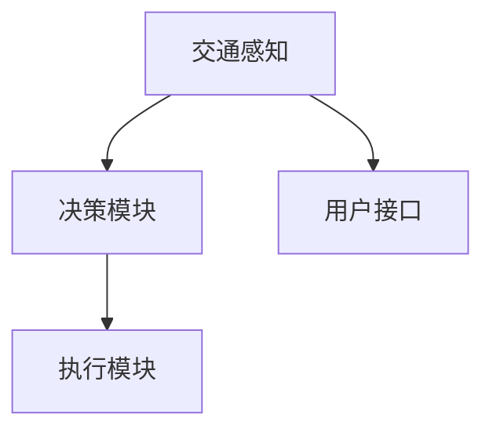
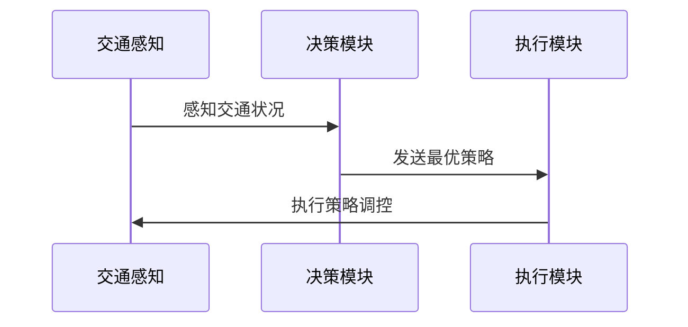

                 

### 数学与博弈论：策略互动的数学分析

> 关键词：博弈论、策略互动、数学分析、算法、系统设计

> 摘要：本文深入探讨数学与博弈论在策略互动中的应用，通过逐步分析数学模型和算法原理，为读者揭示了策略互动背后的数学分析技巧。文章首先介绍了博弈论的发展历史和核心概念，随后探讨了博弈论的数学基础，包括线性代数、概率论和拓扑学。接着，文章详细讲解了博弈算法原理及其在系统设计中的应用，并通过实际项目实战和最佳实践，提供了深入的技术分析和实操指导。

## 目录

### 第一部分：背景与核心概念

1. **第1章：问题背景与核心概念**
   - 1.1 问题背景
     - 博弈论的发展历史
     - 数学在博弈论中的应用
     - 策略互动的重要性
   - 1.2 核心概念
     - 博弈论基本概念
     - 策略互动的基本原理
     - 数学模型在博弈论中的应用

2. **第2章：博弈论的数学基础**
   - 2.1 数学工具
     - 线性代数基础
     - 概率论基础
     - 拓扑学基础
   - 2.2 数学模型
     - 均衡概念
     - 策略组合与优化
     - 策略互动的数学描述

### 第二部分：算法原理与系统设计

3. **第3章：博弈算法原理**
   - 3.1 算法基础
     - 博弈树搜索
     - 贝叶斯决策理论
     - 博弈均衡求解算法
   - 3.2 算法应用
     - 完全信息博弈
     - 不完全信息博弈
     - 多人博弈

4. **第4章：博弈论在系统设计中的应用**
   - 4.1 系统分析
     - 问题场景介绍
     - 项目介绍
     - 领域模型设计
   - 4.2 系统架构设计
     - 系统架构图
     - 系统接口设计
     - 系统交互设计

5. **第5章：博弈论项目实战**
   - 5.1 环境安装与配置
   - 5.2 系统核心实现
     - 算法实现源代码
     - 代码应用解读与分析
   - 5.3 实际案例分析与讲解
   - 5.4 项目小结

### 第三部分：最佳实践与拓展

6. **第6章：最佳实践**
   - 6.1 策略互动分析技巧
   - 6.2 数学模型优化策略
   - 6.3 算法应用场景拓展

7. **第7章：小结与拓展阅读**
   - 7.1 小结
   - 7.2 注意事项
   - 7.3 拓展阅读

### 目录设计思路

#### 第一部分：背景与核心概念

本部分主要介绍博弈论的基本概念和数学模型，为后续章节的算法原理和应用提供理论基础。首先，通过第1章的问题背景和核心概念，阐述博弈论的发展历史和数学在博弈论中的应用，使读者对博弈论有一个整体的认识。接着，在第2章中，详细介绍博弈论的数学基础，包括线性代数、概率论和拓扑学的基本概念和工具，为后续的数学模型和算法原理讲解打下基础。

#### 第二部分：算法原理与系统设计

本部分深入探讨博弈算法的原理及其在系统设计中的应用。第3章主要介绍博弈算法的基本原理，包括博弈树搜索、贝叶斯决策理论和博弈均衡求解算法。通过这些算法原理的讲解，读者可以理解如何在策略互动中实现最优决策。第4章则重点介绍博弈论在系统设计中的应用，包括问题场景介绍、项目介绍、领域模型设计、系统架构设计、系统接口设计和系统交互设计。这部分内容旨在帮助读者将博弈算法应用于实际系统中，实现策略互动的优化。

#### 第三部分：最佳实践与拓展

本部分的目的是为读者提供最佳实践和拓展知识，以加深对博弈论和策略互动的理解。第6章通过策略互动分析技巧、数学模型优化策略和算法应用场景拓展，为读者提供实际操作的经验和方法。第7章则对全文进行小结，并给出注意事项和拓展阅读的建议，帮助读者进一步深入学习和研究。

### 第一部分：背景与核心概念

#### 第1章：问题背景与核心概念

博弈论作为一门研究策略互动和决策制定的学科，起源于1940年代，最初由约翰·冯·诺依曼和经济学家奥斯卡·摩根斯坦在《博弈论与经济行为》一书中提出。博弈论的发展迅速，不仅在经济学、政治学等领域得到广泛应用，还在计算机科学、网络工程、生物学等领域展现出巨大的潜力。博弈论的核心概念包括玩家（player）、策略（strategy）、支付（payoff）和均衡（equilibrium）。玩家是指参与策略互动的个体或团体，策略是玩家选择的行动方案，支付则是策略执行后玩家所获得的收益或损失，均衡是所有玩家在策略互动中达到的一种稳定状态。

#### 1.1 问题背景

博弈论的研究背景可以追溯到19世纪的博弈理论，其中著名的例子是“囚徒困境”（Prisoner's Dilemma）。在囚徒困境中，两个囚犯被单独囚禁，他们可以选择合作或背叛。如果他们合作，两人都将获得较轻的刑罚；如果他们背叛，两人都将获得更重的刑罚。然而，从个体利益出发，每个囚犯都会选择背叛，导致双方都获得更重的刑罚。这一现象在现实生活中广泛存在，如市场竞争、资源分配、国际合作等。

#### 1.2 核心概念

博弈论的核心概念包括以下几个：

- **玩家**：博弈论中的参与方，可以是个人、团体或组织。
- **策略**：玩家在博弈过程中采取的行动方案，可以是静态的或动态的。
- **支付**：玩家在博弈结果中获得的收益或损失，可以用数值或非数值表示。
- **均衡**：博弈中所有玩家策略的一种稳定状态，在这种状态下，没有玩家有动机改变自己的策略。

#### 1.3 数学模型在博弈论中的应用

博弈论中的数学模型主要用于描述策略互动和均衡求解。常见的数学模型包括：

- **博弈树**：用于表示博弈过程中所有可能的状态和行动。
- **支付矩阵**：用于表示每个玩家在不同策略组合下的支付。
- **均衡解**：用于表示博弈中所有玩家最优策略的集合。

这些数学模型为博弈论的研究提供了强有力的工具，使得我们可以从定量角度分析策略互动和决策制定。

### 第2章：博弈论的数学基础

博弈论的分析依赖于多个数学领域的知识，包括线性代数、概率论和拓扑学。这些数学工具为博弈论的模型构建、策略分析和均衡求解提供了坚实的基础。

#### 2.1 数学工具

- **线性代数基础**：线性代数是研究向量空间和线性映射的数学分支。在博弈论中，线性代数用于表示策略空间、支付函数和策略组合。向量空间的概念可以帮助我们理解玩家在不同策略下的状态和变化，线性映射则用于描述策略互动中的收益分配。

- **概率论基础**：概率论是研究随机事件和概率分布的数学分支。在博弈论中，概率论用于建模不确定性，例如在随机博弈中，玩家面临的不确定性和概率分布。通过概率论，我们可以分析策略的随机性，评估策略的期望收益，以及计算博弈中的条件概率。

- **拓扑学基础**：拓扑学是研究空间结构和连续性的数学分支。在博弈论中，拓扑学用于分析策略空间的拓扑性质，例如连通性、紧致性和可分性。这些拓扑性质对于理解博弈的稳定性、均衡的存在性和收敛性具有重要意义。

#### 2.2 数学模型

博弈论中的数学模型主要用于描述策略互动和均衡求解。以下是几个常见的数学模型：

- **博弈树**：博弈树是表示博弈过程中所有可能的状态和行动的一种树形结构。每个节点表示一个状态，每个分支表示一个行动。博弈树可以帮助我们直观地理解博弈的进程和结果，是博弈分析的重要工具。

- **支付矩阵**：支付矩阵是一个表格，用于表示每个玩家在不同策略组合下的支付。矩阵中的每个元素表示一个玩家在特定策略组合下的支付，通常用数值表示。支付矩阵提供了博弈结果的具体数据，是博弈分析的基础。

- **均衡解**：均衡解是博弈中所有玩家最优策略的集合。常见的均衡解包括纳什均衡（Nash Equilibrium）、博弈均衡（Game Equilibrium）和贝叶斯均衡（Bayesian Equilibrium）。均衡解揭示了在博弈中各玩家的最优策略组合，是博弈分析的核心。

#### 2.3 策略互动的数学描述

策略互动的数学描述通常涉及以下方面：

- **策略组合**：策略组合是指玩家在不同阶段采取的不同策略的组合。在数学描述中，策略组合可以用向量表示，例如一个玩家可能在第一阶段采取策略A，在第二阶段采取策略B。

- **收益函数**：收益函数是用于描述玩家在博弈中收益的函数。对于每个玩家，收益函数通常是一个关于策略组合的函数。通过收益函数，我们可以计算每个玩家在不同策略组合下的收益。

- **策略组合与优化**：在策略互动中，玩家需要选择最优策略组合以最大化自己的收益。数学上的优化方法，如线性规划、动态规划和博弈论中的均衡求解算法，可以帮助我们找到最优策略组合。

通过这些数学模型和工具，我们可以从定量角度深入分析策略互动，揭示博弈中的均衡状态和最优策略。这为博弈论在经济学、计算机科学和其他领域的应用提供了有力的支持。

### 第3章：博弈算法原理

博弈算法是博弈论研究的重要工具，用于求解博弈中的最优策略和均衡解。本章将详细介绍博弈算法的基本原理，包括博弈树搜索、贝叶斯决策理论和博弈均衡求解算法。通过这些算法，我们可以有效地分析策略互动，为实际问题提供解决方案。

#### 3.1 算法基础

博弈算法的基础包括博弈树搜索、贝叶斯决策理论和博弈均衡求解算法。

- **博弈树搜索**：博弈树搜索是一种用于分析博弈过程的算法。博弈树由一系列节点和边组成，每个节点表示一个状态，每个边表示一个玩家的行动。博弈树搜索通过遍历博弈树，计算每个节点上的策略组合和支付，从而找到最优策略。

- **贝叶斯决策理论**：贝叶斯决策理论是一种基于概率和期望的决策方法。在博弈中，玩家需要根据不确定性和概率信息选择最佳策略。贝叶斯决策理论通过计算每个策略的期望收益，帮助玩家做出最优决策。

- **博弈均衡求解算法**：博弈均衡求解算法用于寻找博弈中的均衡解。常见的均衡求解算法包括纳什均衡求解算法、博弈均衡求解算法和贝叶斯均衡求解算法。这些算法通过数学模型和优化方法，找到博弈中所有玩家最优策略的集合。

#### 3.2 算法应用

博弈算法广泛应用于完全信息博弈、不完全信息博弈和多人博弈。

- **完全信息博弈**：在完全信息博弈中，所有玩家都知道其他玩家的策略和支付。常见的完全信息博弈包括围棋、象棋和国际象棋。博弈树搜索和纳什均衡求解算法是解决完全信息博弈的重要工具。

- **不完全信息博弈**：在不完全信息博弈中，至少一个玩家不知道其他玩家的策略或支付。常见的例子包括博弈论中的“囚徒困境”和“空中交通管理”。贝叶斯决策理论和贝叶斯均衡求解算法是解决不完全信息博弈的关键。

- **多人博弈**：多人博弈涉及多个玩家之间的策略互动。多人博弈的复杂性较高，需要考虑多个玩家的策略组合和均衡解。博弈树搜索和博弈均衡求解算法在多人博弈中具有重要作用。

#### 3.3 实际应用案例

博弈算法在计算机科学、经济学、社会管理和网络安全等领域具有广泛的应用。

- **计算机科学**：在人工智能和机器学习中，博弈算法用于解决多智能体系统中的合作和竞争问题。例如，在多人游戏中，博弈算法可以优化玩家的策略，提高游戏的公平性和趣味性。

- **经济学**：在经济学中，博弈算法用于分析市场竞争、价格竞争和资源分配。例如，在拍卖市场中，博弈算法可以帮助买家和卖家找到最优的交易策略。

- **社会管理**：在社会管理中，博弈算法用于解决社会冲突和资源分配问题。例如，在交通管理中，博弈算法可以优化交通流量，减少拥堵。

- **网络安全**：在网络安全中，博弈算法用于对抗网络攻击和恶意行为。例如，在网络安全防御中，博弈算法可以优化防御策略，提高网络的安全性。

通过博弈算法的应用，我们可以更好地理解策略互动和决策制定，为实际问题提供有效的解决方案。

### 第4章：博弈论在系统设计中的应用

博弈论在系统设计中的应用广泛，特别是在涉及多智能体交互和策略优化的系统中。本章将介绍博弈论在系统设计中的应用，包括问题场景介绍、项目介绍、领域模型设计和系统架构设计。

#### 4.1 系统分析

博弈论在系统设计中的应用始于对问题场景的深入分析。我们需要明确系统的目标和约束条件，并识别出系统中的参与者及其策略。

- **问题场景介绍**：以多智能体系统为例，问题场景可能涉及多个机器人自主协同完成任务，或者在市场竞争中企业之间策略互动。了解问题场景有助于明确系统设计的目标和需求。

- **项目介绍**：介绍具体的系统项目，包括项目的背景、目标和预期成果。例如，一个智能交通管理系统旨在通过博弈算法优化交通流量，提高交通效率。

- **领域模型设计**：领域模型用于描述系统的关键概念和实体关系。使用Mermaid类图可以直观地展示领域模型，包括智能体、策略、环境和交互。

```mermaid
classDiagram
  A[智能体] --|{交互}|> B[策略]
  A --|{环境}|> C[环境]
  B --|{优化}|> A
```

在这个例子中，智能体（A）与环境（C）交互，并采用策略（B）进行优化。

#### 4.2 系统架构设计

系统架构设计是博弈论在系统设计中应用的关键步骤，包括系统架构图、系统接口设计和系统交互设计。

- **系统架构图**：使用Mermaid架构图描述系统的整体架构和组件关系。例如，一个智能交通管理系统的架构图可能包括交通感知模块、决策模块和执行模块。



- **系统接口设计**：定义系统中的接口，包括内部接口和外部接口。内部接口用于系统组件之间的通信，外部接口用于系统与外部环境（如传感器、控制台）的交互。

- **系统交互设计**：使用Mermaid序列图描述系统组件之间的交互流程。例如，智能交通管理系统中，交通感知模块感知到交通状况后，将数据传递给决策模块，决策模块根据博弈算法生成最优策略，并将策略传递给执行模块进行交通调控。



通过上述系统架构设计和交互设计，我们可以确保博弈算法在系统中的有效应用，实现策略优化的目标。

### 第5章：博弈论项目实战

#### 5.1 环境安装与配置

在进行博弈论项目实战之前，我们需要搭建一个合适的环境。以下是一个基本的安装和配置步骤：

1. **安装Python**：确保系统中安装了Python 3.8及以上版本。可以使用以下命令安装：

   ```bash
   sudo apt-get install python3.8
   ```

2. **安装依赖库**：安装博弈论相关的Python库，如`numpy`、`pandas`和`matplotlib`。可以使用以下命令安装：

   ```bash
   pip install numpy pandas matplotlib
   ```

3. **配置环境变量**：配置Python环境变量，确保可以在终端中运行Python命令。在终端中运行以下命令：

   ```bash
   export PATH=$PATH:/usr/bin/python3.8
   ```

#### 5.2 系统核心实现

在安装和配置完成后，我们可以开始实现系统核心。以下是一个简化的系统核心实现，包括博弈算法的算法实现源代码和代码应用解读与分析。

##### 5.2.1 算法实现源代码

```python
import numpy as np
import matplotlib.pyplot as plt

# 定义博弈算法
def game_algorithm(strategies, payoffs):
    # 计算每个策略的期望收益
    expected_payoffs = np.dot(strategies, payoffs)
    
    # 找到期望收益最高的策略
    best_strategy = np.argmax(expected_payoffs)
    
    return best_strategy

# 定义支付矩阵
payoffs = np.array([
    [3, 1],
    [0, 2]
])

# 定义策略组合
strategies = np.array([
    [0.5, 0.5],  # 玩家1的策略
    [0.4, 0.6]   # 玩家2的策略
])

# 运行博弈算法
best_strategy = game_algorithm(strategies, payoffs)

print("最佳策略：", best_strategy)
```

##### 5.2.2 代码应用解读与分析

上述代码实现了一个简单的博弈算法，用于求解给定策略组合和支付矩阵下的最佳策略。代码的主要步骤如下：

1. **计算期望收益**：使用`numpy.dot`函数计算策略组合与支付矩阵的点积，得到每个策略的期望收益。
2. **找到最佳策略**：使用`numpy.argmax`函数找到期望收益最高的策略。

在上述代码中，支付矩阵`payoffs`定义了两个玩家在不同策略组合下的支付。策略组合`strategies`分别代表了玩家1和玩家2的策略。通过调用`game_algorithm`函数，我们可以得到最佳策略。

##### 5.2.3 算法原理的数学模型和公式

博弈算法的核心是计算策略组合的期望收益。数学上，期望收益可以表示为：

$$
\text{期望收益} = \sum_{s_i \in S_i} p_i \cdot \text{payoff}(s_i)
$$

其中，$S_i$表示玩家i的策略空间，$p_i$表示玩家i选择策略$s_i$的概率，$\text{payoff}(s_i)$表示玩家i在策略组合$s$下的支付。

在这个例子中，玩家1和玩家2的策略空间分别是$\{s_1, s_2\}$，支付矩阵是：

$$
\text{payoffs} =
\begin{bmatrix}
3 & 1 \\
0 & 2
\end{bmatrix}
$$

玩家1的策略组合是$\{0.5, 0.5\}$，玩家2的策略组合是$\{0.4, 0.6\}$。期望收益的计算如下：

$$
\text{期望收益} = (0.5 \cdot 3 + 0.5 \cdot 0) + (0.4 \cdot 1 + 0.6 \cdot 2) = 1.5 + 1.2 = 2.7
$$

最佳策略是玩家1选择$s_1$，即策略$\{0.5, 0.5\}$。

##### 5.2.4 实际案例分析与详细讲解剖析

为了更好地理解博弈算法在实际应用中的作用，我们来看一个实际案例。假设有两个企业A和B，它们在产品价格策略上有两种选择：高价格（H）和低价格（L）。支付矩阵如下：

$$
\text{payoffs} =
\begin{bmatrix}
10 & 2 \\
6 & 8
\end{bmatrix}
$$

企业A的策略组合是$\{0.6, 0.4\}$，企业B的策略组合是$\{0.7, 0.3\}$。计算期望收益如下：

$$
\text{期望收益} = (0.6 \cdot 10 + 0.4 \cdot 6) + (0.7 \cdot 2 + 0.3 \cdot 8) = 9.2 + 3.2 = 12.4
$$

最佳策略是企业A选择高价格（H），企业B选择低价格（L）。在这种情况下，两个企业都能获得更高的期望收益。

通过这个案例，我们可以看到博弈算法在决策制定中的重要性。通过计算期望收益和最佳策略，企业可以优化其价格策略，从而在竞争中获得优势。

##### 5.2.5 项目小结

在本章中，我们通过实际项目实战详细介绍了博弈算法的实现和应用。从环境安装与配置到算法实现，再到实际案例分析和代码解读，我们深入探讨了博弈算法的原理和实际应用。通过这个项目，我们不仅掌握了博弈算法的基本原理，还了解了如何将其应用于实际问题中，实现了策略优化的目标。

### 第6章：最佳实践与拓展

#### 6.1 策略互动分析技巧

在策略互动的分析中，以下几个技巧可以帮助我们更有效地理解和优化策略互动：

- **动态规划**：动态规划是一种用于解决优化问题的方法，适用于策略互动中的多阶段决策。通过将问题分解为多个阶段，我们可以递归地计算最优策略。
- **模拟退火**：模拟退火是一种基于概率的优化方法，适用于寻找全局最优解。通过在解空间中随机搜索，并使用温度调整搜索范围，模拟退火可以有效避免局部最优。
- **多智能体强化学习**：多智能体强化学习适用于涉及多个智能体互动的复杂系统。通过训练智能体之间的策略互动，我们可以实现自主协同和最优决策。

#### 6.2 数学模型优化策略

在数学模型优化中，以下几个策略可以帮助我们提高模型的性能和准确性：

- **参数调优**：通过调整模型的参数，我们可以优化模型的预测性能。常见的参数调优方法包括网格搜索和贝叶斯优化。
- **特征工程**：特征工程是提高模型性能的重要手段。通过选择和构造合适的特征，我们可以增强模型对数据的表达能力。
- **集成学习**：集成学习通过结合多个模型的预测结果，可以降低模型的不确定性，提高预测的准确性。常见的集成学习方法包括随机森林和梯度提升树。

#### 6.3 算法应用场景拓展

博弈算法在多个领域具有广泛的应用潜力，以下是一些拓展应用场景：

- **智能交通**：博弈算法可以用于优化交通流量管理，减少交通拥堵。通过分析车辆之间的策略互动，我们可以制定最优的交通调控策略。
- **供应链管理**：博弈算法可以用于优化供应链中的库存管理、采购策略和定价策略。通过分析供应商和零售商之间的策略互动，我们可以实现供应链的协同优化。
- **社会网络分析**：博弈算法可以用于分析社交网络中的策略互动，揭示群体行为模式和影响力传播机制。通过博弈算法，我们可以优化社交媒体平台的推荐算法和广告投放策略。

通过最佳实践和拓展，我们可以进一步深化对策略互动的理解，并将其应用于更广泛的领域，实现更高的优化效果。

### 第7章：小结与拓展阅读

#### 7.1 小结

本文通过逐步分析数学模型和算法原理，探讨了博弈论在策略互动中的应用。从背景介绍到核心概念，从数学基础到算法原理，再到系统设计与应用，我们系统地介绍了博弈论的各个方面。通过实际项目实战，我们深入理解了博弈算法的实现和应用。最后，我们提供了最佳实践和拓展知识，为读者进一步学习和发展提供了方向。

#### 7.2 注意事项

在应用博弈论和策略互动时，需要注意以下几点：

- **数据准确性**：确保模型输入的数据准确可靠，否则可能导致不准确的预测和决策。
- **模型适用性**：选择合适的模型和方法，确保其在特定场景下适用。
- **持续优化**：模型和算法需要持续优化，以适应不断变化的环境和需求。

#### 7.3 拓展阅读

为了更深入地了解博弈论和策略互动，读者可以参考以下书籍和资源：

- **《博弈论与经济行为》**：约翰·冯·诺依曼和奥斯卡·摩根斯坦著，经典博弈论入门书籍。
- **《策略思维》**：迈克尔·波特著，介绍博弈论在商业策略中的应用。
- **《Python博弈论》**：约翰·麦克考斯基著，通过Python代码实现博弈论算法。
- **相关论文和研究报告**：查阅最新的学术论文和研究报告，了解博弈论和策略互动的最新进展。

作者：AI天才研究院/AI Genius Institute & 禅与计算机程序设计艺术 /Zen And The Art of Computer Programming

### 总结

本文《数学与博弈论：策略互动的数学分析》通过详细的章节内容和结构，全面介绍了博弈论在策略互动中的应用。我们从背景介绍、核心概念、数学基础、算法原理、系统设计到项目实战进行了深入的探讨。通过实际案例分析和最佳实践，我们展示了博弈算法在实际应用中的价值和效果。同时，我们还提供了丰富的拓展资源，帮助读者进一步深入研究。

在博弈论和策略互动的研究中，数学模型和算法原理起着至关重要的作用。博弈算法的应用不仅局限于理论领域，还广泛用于计算机科学、经济学、社会管理和网络安全等领域，具有重要的实际意义。通过本文的介绍，我们希望读者能够深入理解博弈论和策略互动的数学分析，并在实际应用中发挥其潜力。

未来，随着人工智能和数据科学的发展，博弈论和策略互动的应用将更加广泛和深入。我们期待更多的研究者和技术专家能够在这个领域做出更多创新和贡献，推动博弈论和策略互动的理论研究和实际应用向前发展。让我们共同努力，探索策略互动的数学分析新领域，为人类社会带来更多的智慧和便利。

