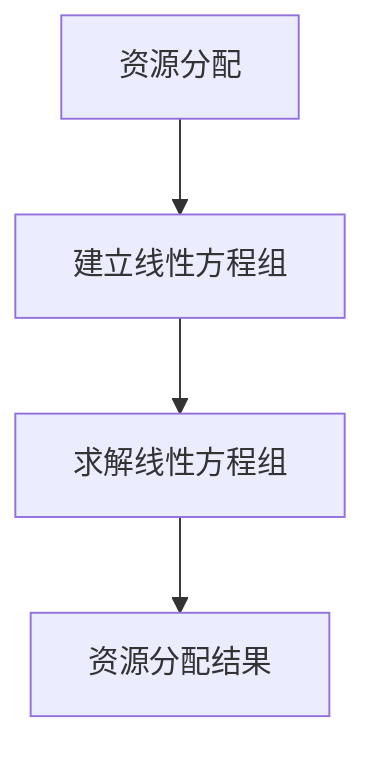
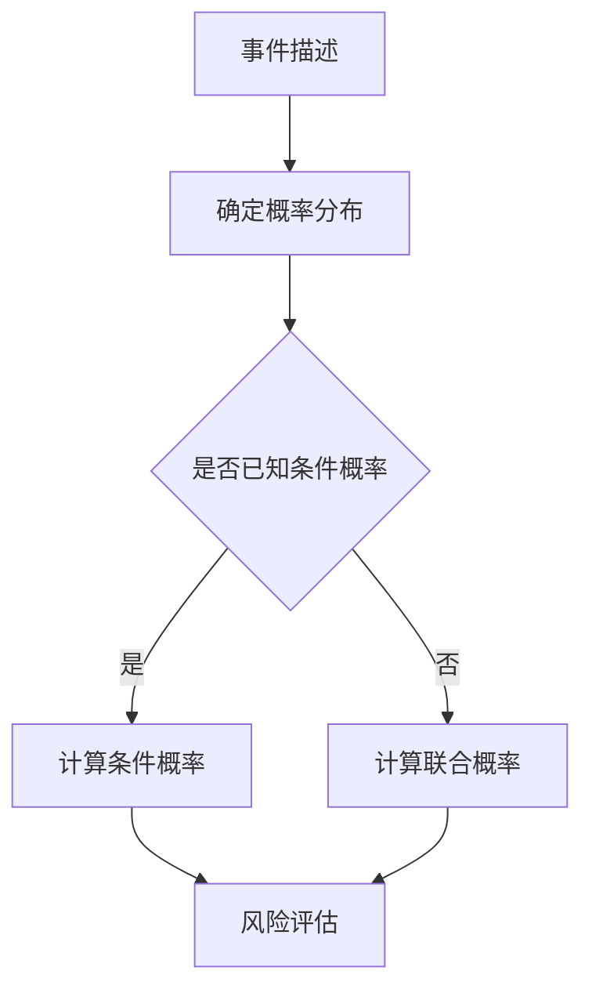
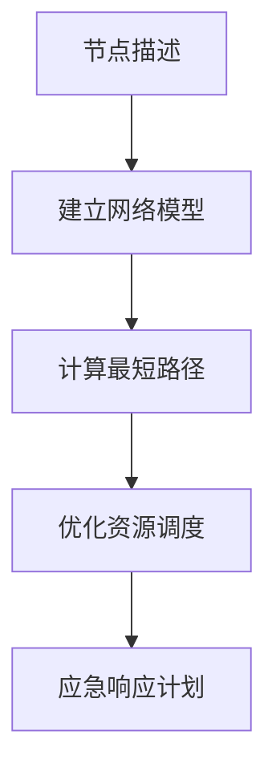
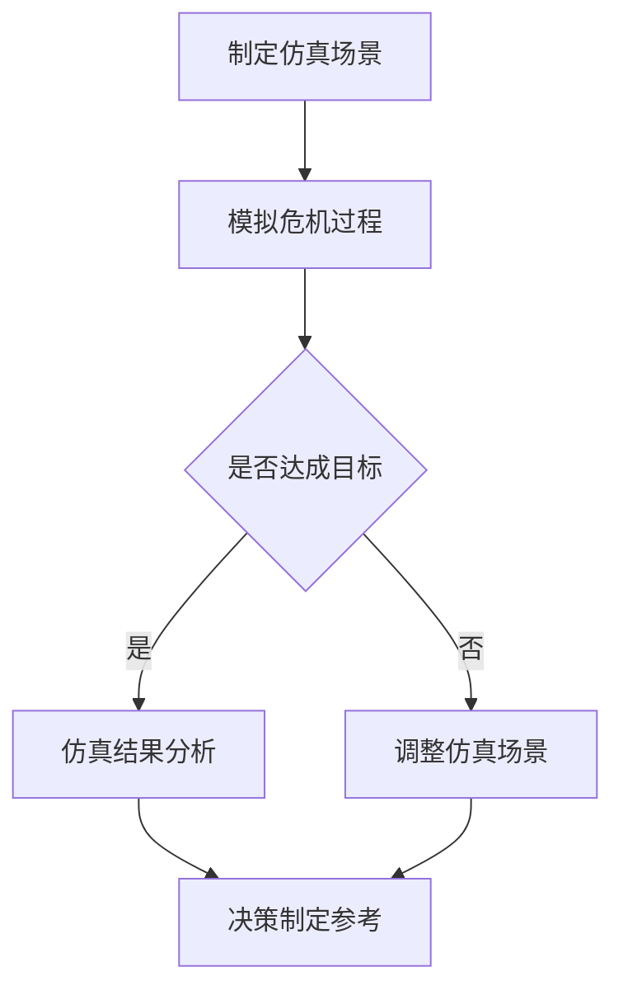
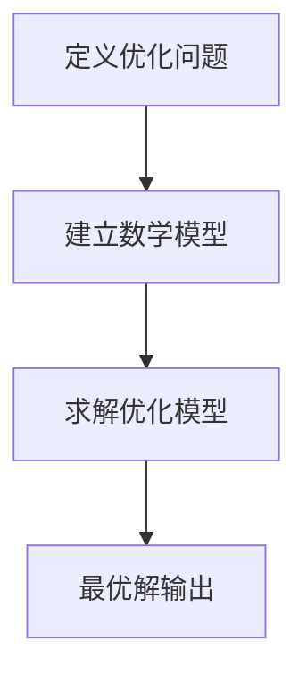
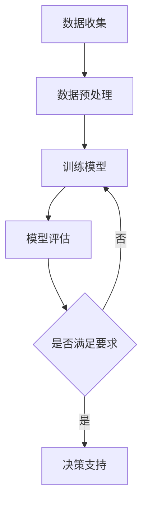
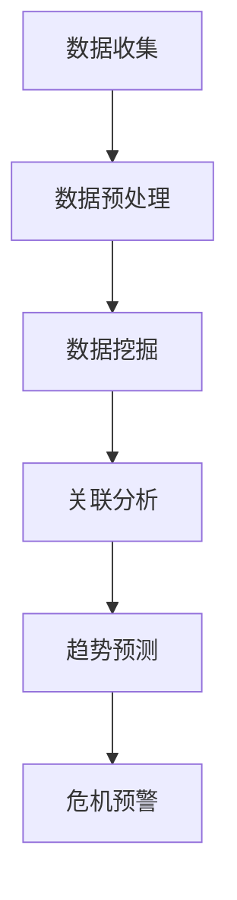
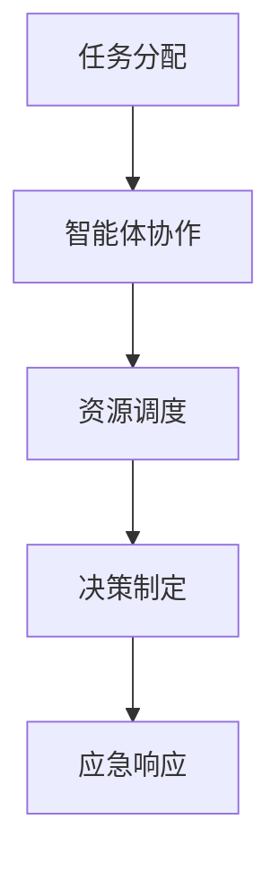

                 

## 数学与危机管理：危机应对的数学模型

> 关键词：数学模型，危机管理，风险评估，应急响应，优化算法

> 摘要：本文将探讨数学模型在危机管理中的应用，通过线性模型、概率模型、网络模型和仿真模型等多种数学工具，深入分析其在资源分配、风险评估、应急响应和决策制定等方面的作用。文章将结合实际案例，展示数学模型如何帮助应对地震、疫情、洪水和金融危机等突发事件，并提供未来研究方向与挑战。

### 引言

在现代社会，危机管理已成为一项至关重要的任务。无论是自然灾害、公共卫生事件、经济危机，还是社会动荡，危机对人类社会的影响日益显著。如何有效应对这些危机，减轻其带来的损失，成为世界各国政府、企业和个人共同关注的焦点。

随着信息技术的快速发展，数学模型在危机管理中的应用日益广泛。数学模型能够对危机现象进行定量分析，提供科学的决策依据，从而提高危机应对的效率。本文将详细介绍数学模型在危机管理中的应用，旨在为读者提供一个全面、系统的认识。

### 数学模型在危机管理中的重要性

数学模型在危机管理中具有重要作用，主要表现在以下几个方面：

1. **量化风险评估**：通过概率模型和统计方法，可以对危机发生的可能性及其影响进行量化评估，为制定应对策略提供科学依据。

2. **优化资源分配**：线性规划和优化算法可以帮助决策者合理配置资源，确保在有限的条件下最大限度地减轻危机影响。

3. **预测危机趋势**：时间序列分析和机器学习等技术可以预测危机的发展趋势，为提前采取预防措施提供支持。

4. **仿真决策制定**：仿真模型可以模拟危机发生过程中的各种情景，评估不同应对策略的效果，为决策者提供参考。

5. **提高决策效率**：数学模型可以简化复杂问题，将危机管理过程中的各种变量和关系转化为数学表达式，使决策过程更加高效。

### 文章结构概述

本文将从以下七个部分对数学模型在危机管理中的应用进行详细探讨：

1. **引言**：介绍危机管理的背景和数学模型在其中的重要性。

2. **基本概念**：阐述危机的定义、分类、基本原理及数学模型在危机管理中的作用。

3. **数学模型在危机管理中的应用**：介绍线性模型、概率模型、网络模型和仿真模型等在危机管理中的应用。

4. **案例研究**：通过实际案例，展示数学模型在地震、疫情、洪水和金融危机中的应用。

5. **高级技术与方法**：探讨优化模型、机器学习、大数据分析和多代理系统等在危机管理中的应用。

6. **挑战与未来方向**：分析当前数学模型在危机管理中的局限性，探讨未来研究方向与挑战。

7. **实际应用与案例分析**：分析数学模型在应急响应、危机预测和决策制定中的实际应用，提供实用建议。

通过本文的讨论，读者将能够深入理解数学模型在危机管理中的重要作用，掌握相关的基本概念和应用方法，并为未来的研究和实践提供启示。

### 基本概念

在探讨数学模型在危机管理中的应用之前，我们需要首先了解一些基本概念，包括危机的定义、分类、基本原理以及数学模型在危机管理中的具体作用。这些概念构成了我们进一步分析和讨论的基础。

#### 危机的定义

危机是指一种突发性、严重性事件，它对人类社会、经济、环境等造成显著的影响，需要采取紧急措施来应对和处理。危机可以是自然的，如地震、洪水、飓风等；也可以是人为的，如恐怖袭击、战争、金融危机等。危机的特点是突发性强、影响范围广、处理时间紧迫。

#### 危机的分类

根据不同的分类标准，危机可以分为多种类型：

1. **自然灾害**：包括地震、洪水、台风、火山爆发等。
2. **公共卫生事件**：如传染病爆发、食品安全问题、环境污染等。
3. **经济危机**：如金融危机、股市崩盘、通货膨胀等。
4. **社会动荡**：如恐怖袭击、战争、政治危机等。
5. **技术事故**：如核事故、工业事故、交通事故等。

不同类型的危机具有不同的特点和应对策略，因此在危机管理中需要进行分类处理。

#### 基本原理

危机管理的基本原理包括以下几个方面：

1. **预防为主**：在危机发生前，通过风险评估、预警系统等措施，尽可能避免危机的发生。
2. **应急响应**：在危机发生时，迅速采取有效措施，减轻危机的影响，并控制危机的进一步扩散。
3. **恢复与重建**：在危机结束后，进行灾后重建和恢复工作，恢复社会秩序和正常生活。

#### 数学模型在危机管理中的作用

数学模型在危机管理中扮演着重要角色，主要表现在以下几个方面：

1. **量化风险评估**：通过概率模型、统计模型等，对危机发生的概率及其影响进行量化分析，为制定应对策略提供科学依据。
2. **优化资源分配**：使用线性规划、优化算法等，合理分配资源，确保在有限的条件下最大限度地减轻危机影响。
3. **预测危机趋势**：利用时间序列分析、机器学习等模型，预测危机的发展趋势，提前采取预防措施。
4. **仿真决策制定**：通过仿真模型，模拟危机发生过程中的各种情景，评估不同应对策略的效果，为决策者提供参考。

#### 关键概念

在数学模型的应用中，以下几个关键概念尤为重要：

1. **风险矩阵**：用于评估危机发生概率及其影响的矩阵，通常包括风险概率和风险影响两个维度。
2. **决策树**：用于分析不同决策路径及其结果的树形结构，常用于决策制定和风险评估。
3. **马尔可夫链**：用于模拟危机发展过程的概率转移模型，适用于风险评估和预测。
4. **贝叶斯网络**：用于表示事件之间概率关系的网络结构，适用于复杂系统的风险评估和预测。

#### 概念属性特征对比表格

为了更好地理解这些关键概念，我们可以通过一个对比表格来展示它们的主要属性和特征：

| 概念名称 | 主要属性 | 主要特征 |
| :--: | :--: | :--: |
| 风险矩阵 | 风险概率和风险影响的量化评估 | 多维度矩阵 |
| 决策树 | 决策路径及其结果的分析 | 树形结构 |
| 马尔可夫链 | 概率转移模型 | 状态转移概率 |
| 贝叶斯网络 | 概率关系网络 | 贝叶斯推理 |

#### ER实体关系图架构

为了进一步展示数学模型在危机管理中的概念结构和核心要素，我们可以使用ER（实体-关系）图来描述它们之间的关系：

```mermaid
erDiagram
    Resource --> Crisis : 资源分配
    Risk --> Crisis : 风险评估
    Response --> Crisis : 应急响应
    Prediction --> Crisis : 危机预测
    Model --> [Mathematical Model] : 模型应用
    Model ||--|> Risk : 风险评估
    Model ||--|> Response : 应急响应
    Model ||--|> Prediction : 危机预测
```

通过上述ER图，我们可以清晰地看到数学模型在危机管理中的核心要素及其相互关系。资源、风险、响应和预测是危机管理的四个关键方面，而数学模型则贯穿其中，为每个方面提供科学依据和决策支持。

### 数学模型在危机管理中的应用

在了解了危机管理的基本概念之后，我们接下来将探讨数学模型在危机管理中的具体应用。这些模型包括线性模型、概率模型、网络模型和仿真模型，每一种模型都有其独特的应用场景和功能。以下是这些模型的基本概念、属性特征、应用实例以及相关的mermaid流程图。

#### 1. 线性模型

**基本概念**：线性模型是一种用于描述线性关系的数学模型，通常涉及变量之间的线性组合。线性模型广泛应用于优化问题和资源分配问题。

**属性特征**：
- **线性关系**：变量之间满足线性关系，即一个变量的变化量与另一个变量的变化量成正比。
- **线性方程组**：通过线性方程组来描述多个变量之间的关系。

**应用实例**：
- **资源分配**：在应急管理中，线性模型可以用于优化资源的分配，如救援物资、医疗资源的分配。
- **交通管理**：线性模型可以帮助优化交通流量，减少拥堵和延误。

**mermaid流程图**：



#### 2. 概率模型

**基本概念**：概率模型用于描述事件发生的概率及其相互关系。概率模型在风险分析和决策制定中具有重要意义。

**属性特征**：
- **概率分布**：描述随机变量可能取值的概率分布。
- **条件概率**：在给定某个事件发生的条件下，另一个事件发生的概率。

**应用实例**：
- **风险评估**：概率模型可以帮助评估危机发生的可能性及其影响，如地震风险评估。
- **决策制定**：在决策过程中，利用概率模型来评估不同决策路径的概率和风险。

**mermaid流程图**：



#### 3. 网络模型

**基本概念**：网络模型用于描述系统中的节点和边，以及节点之间的相互作用。在危机管理中，网络模型可以帮助分析应急响应中的资源流动和人员调度。

**属性特征**：
- **图论模型**：基于图论的基本概念，如节点、边、路径等。
- **网络拓扑**：描述节点和边之间的结构关系。

**应用实例**：
- **应急响应**：网络模型可以帮助优化救援队伍的调度，确保资源能够迅速到达受灾区域。
- **网络优化**：在网络管理中，网络模型可以优化数据传输路径，提高网络性能。

**mermaid流程图**：



#### 4. 仿真模型

**基本概念**：仿真模型通过模拟现实世界的各种情景，评估不同应对策略的效果。仿真模型在决策制定和风险评估中具有重要作用。

**属性特征**：
- **模拟实验**：通过模拟实验来测试不同的策略和方案。
- **场景再现**：能够再现危机发生过程中的各种情景。

**应用实例**：
- **决策制定**：仿真模型可以帮助评估不同决策路径的效果，如疫情防控策略的制定。
- **风险评估**：通过仿真模型来模拟危机发生的过程，评估其可能的影响和损失。

**mermaid流程图**：



通过上述四种数学模型的应用，我们可以看到数学模型在危机管理中的广泛应用和重要性。这些模型不仅为决策者提供了科学的分析工具，也提高了危机应对的效率和效果。在下一节中，我们将通过实际案例来进一步探讨数学模型在危机管理中的应用。

### 实际案例：数学模型在地震、疫情、洪水和金融危机中的应用

在上一节中，我们介绍了线性模型、概率模型、网络模型和仿真模型在危机管理中的应用。为了更深入地理解这些模型在实际操作中的效果，本节将通过地震、疫情、洪水和金融危机等实际案例，展示数学模型如何帮助决策者应对这些危机。

#### 案例一：地震响应规划

**背景**：地震是一种突发性自然灾害，会对人类生命和财产造成巨大损失。有效的地震响应规划需要快速、准确地评估地震的破坏程度，并制定合理的救援和恢复计划。

**数学模型应用**：
1. **网络模型**：在地震响应规划中，网络模型可以帮助优化救援资源的调度。通过建立救援队伍和受灾区域的网络模型，可以计算出最短路径和最优资源分配方案。例如，Google Maps中的路径规划算法就是一个典型的网络模型应用。

2. **仿真模型**：仿真模型可以模拟地震发生后的各种情景，包括人员疏散、救援队伍的部署等。通过多次仿真实验，可以评估不同响应策略的效果，为决策者提供科学的决策依据。

**应用效果**：在日本和加州等地，网络模型和仿真模型已经被广泛应用于地震响应规划中。这些模型帮助提高了救援效率，减少了人员伤亡和财产损失。

#### 案例二：疫情控制策略

**背景**：新冠疫情（COVID-19）的全球大流行对全球经济和社会生活造成了严重影响。有效的疫情控制策略需要科学地评估疫情的发展趋势，并制定合理的防控措施。

**数学模型应用**：
1. **概率模型**：概率模型可以帮助评估疫情的发展趋势，如R0值（基本传染数）的计算。通过分析历史数据和现有疫情数据，可以预测疫情的未来发展趋势，为决策者提供科学依据。

2. **仿真模型**：仿真模型可以模拟不同防控措施的效果，如封锁、社交距离、疫苗接种等。通过多次仿真实验，可以评估这些措施的效能，帮助决策者选择最佳策略。

**应用效果**：在多个国家和地区，概率模型和仿真模型已经被广泛应用于疫情控制策略中。例如，意大利和韩国在疫情初期通过概率模型预测疫情趋势，及时采取了有效的防控措施，成功地控制了疫情的蔓延。

#### 案例三：洪水管理

**背景**：洪水是一种常见的自然灾害，会对农业、城市基础设施和居民生活造成严重威胁。有效的洪水管理需要科学地评估洪水风险，并制定合理的应对措施。

**数学模型应用**：
1. **线性模型**：在洪水管理中，线性模型可以用于优化水资源的分配和排水系统的设计。通过建立线性方程组，可以计算出最优的水资源分配方案和排水路径。

2. **概率模型**：概率模型可以帮助评估洪水发生的概率及其影响。通过分析历史洪水数据和气象数据，可以预测未来洪水的发生概率和影响范围。

**应用效果**：在美国和荷兰等地，线性模型和概率模型已经被广泛应用于洪水管理中。这些模型帮助提高了洪水预警和应对的效率，减少了洪水的损失。

#### 案例四：金融危机应对

**背景**：金融危机会对全球经济产生巨大冲击，导致企业倒闭、失业率上升、社会动荡等。有效的金融危机应对需要快速识别危机信号，并采取有效的措施来缓解危机。

**数学模型应用**：
1. **时间序列分析**：时间序列分析可以帮助分析金融市场的时间序列数据，识别危机信号。通过分析股票价格、交易量等指标的变化，可以预测市场走势和危机的发生。

2. **优化模型**：优化模型可以帮助决策者合理配置金融资源，减轻危机影响。通过建立线性规划和优化算法，可以计算出最优的资源配置方案。

**应用效果**：在国际金融危机期间，许多国家和地区通过时间序列分析和优化模型来应对危机。这些模型帮助决策者及时采取应对措施，缓解了金融危机的影响。

通过以上实际案例，我们可以看到数学模型在地震、疫情、洪水和金融危机中的应用效果显著。这些模型不仅提供了科学的分析工具，也为决策者提供了有效的决策支持。在未来的危机管理中，数学模型将继续发挥重要作用，为人类社会的发展提供保障。

### 高级技术与方法

在上一节中，我们讨论了数学模型在危机管理中的应用，包括线性模型、概率模型、网络模型和仿真模型。然而，随着科技的进步和数据的积累，更高级的数学方法和技术逐渐应用于危机管理中，为决策者提供了更强大的工具。本节将探讨优化模型、机器学习、大数据分析和多代理系统等高级技术在危机管理中的应用。

#### 优化模型

**基本概念**：优化模型是一种用于解决资源分配、调度和路径规划等问题的数学模型，旨在找到最优解。优化模型广泛应用于各种领域，如物流、金融和工程等。

**应用实例**：
- **资源调度**：在应急管理中，优化模型可以帮助合理分配救援资源，如医疗物资、救援人员和设备。通过建立线性规划和整数规划模型，可以计算出最优的资源配置方案，提高救援效率。
- **交通管理**：优化模型可以用于优化交通流量，减少拥堵和延误。例如，基于动态交通分配模型的交通信号控制系统可以实时调整交通信号，优化道路利用率。

**mermaid流程图**：



#### 机器学习

**基本概念**：机器学习是一种人工智能技术，通过算法从数据中学习模式，进行预测和决策。机器学习在危机管理中的应用主要包括模式识别、预测和决策支持。

**应用实例**：
- **模式识别**：机器学习可以帮助识别危机信号，如通过分析社会媒体数据，检测疫情发展趋势和潜在的爆发区域。
- **预测**：机器学习可以用于预测危机的发展趋势，如通过时间序列预测模型，预测地震的发生概率和影响范围。
- **决策支持**：机器学习可以用于辅助决策制定，如通过优化算法和机器学习模型，为决策者提供最佳应对策略。

**mermaid流程图**：



#### 大数据分析

**基本概念**：大数据分析是一种处理和分析大规模数据的技术，旨在从大量数据中提取有价值的信息和知识。大数据分析在危机管理中的应用主要包括数据挖掘、关联分析和趋势预测。

**应用实例**：
- **数据挖掘**：通过数据挖掘技术，可以从历史数据中提取危机模式和规律，帮助预测未来危机的发生。
- **关联分析**：通过关联分析，可以发现不同危机因素之间的关联关系，为制定应对策略提供依据。
- **趋势预测**：通过分析历史数据和实时数据，可以预测危机的发展趋势，为提前采取预防措施提供支持。

**mermaid流程图**：



#### 多代理系统

**基本概念**：多代理系统是一种分布式计算系统，由多个自主智能体组成，这些智能体可以独立运作并相互协作，共同完成复杂任务。多代理系统在危机管理中的应用主要包括资源调度、应急响应和决策支持。

**应用实例**：
- **资源调度**：多代理系统可以协调多个智能体进行资源调度，如救援物资的分配和救援人员的调度。
- **应急响应**：多代理系统可以帮助协调应急响应行动，如通过智能体之间的信息共享和协同工作，提高救援效率。
- **决策支持**：多代理系统可以模拟不同决策路径的效果，为决策者提供科学的决策支持。

**mermaid流程图**：



通过上述高级技术和方法的应用，我们可以看到数学模型在危机管理中不断发展和完善。这些技术不仅提高了危机应对的效率和质量，也为决策者提供了更加科学和全面的决策支持。在未来，随着技术的进一步发展，数学模型在危机管理中的应用将更加广泛和深入，为人类社会的发展提供更加坚实的保障。

### 挑战与未来方向

在数学模型应用于危机管理的过程中，我们面临许多挑战和未来研究方向。以下将讨论当前数学模型在危机管理中的局限性、伦理问题以及未来可能的发展方向。

#### 局限性

尽管数学模型在危机管理中发挥了重要作用，但它们也存在一些局限性：

1. **数据依赖性**：数学模型的准确性很大程度上依赖于数据的质量和完整性。在危机发生初期，数据可能不完整或存在误差，这会影响模型的预测和决策。

2. **复杂性**：危机管理涉及多种复杂因素和动态变化，这使得建立精确的数学模型变得困难。许多现实问题难以用简单的数学模型来描述，需要更高层次的模型和算法。

3. **实时性**：危机管理要求快速响应和决策。然而，复杂的数学模型通常需要较长时间来计算和分析，这可能导致决策延误。

4. **模型验证**：数学模型的验证是一个复杂的过程。在实际应用中，验证模型的准确性是一项挑战，因为历史数据和模拟结果可能无法完全反映未来的情况。

#### 伦理问题

在危机管理中，数学模型的应用也引发了伦理问题：

1. **责任归属**：在利用数学模型进行决策时，决策者可能依赖模型的结果来制定政策。然而，如果模型结果不准确，责任应由谁承担？这是一个重要的伦理问题。

2. **隐私保护**：大数据分析和人工智能技术依赖于大量个人数据。如何在确保危机应对的同时保护个人隐私，是另一个伦理挑战。

3. **公平性**：危机管理决策可能涉及资源分配问题。如果模型设计不当，可能会导致资源不公平分配，甚至加剧社会不平等。

#### 未来方向

为了克服上述挑战，未来的研究方向包括：

1. **改进模型**：开发更加准确、高效的数学模型，以应对复杂和动态的危机情境。这需要结合多种学科的知识，如统计学、计算机科学和工程学。

2. **数据融合**：通过融合多种数据源，提高数据的完整性和准确性。例如，结合卫星图像、传感器数据和社交媒体数据，可以更全面地了解危机情境。

3. **实时计算**：发展实时计算技术，使数学模型能够快速响应和更新。例如，利用云计算和边缘计算技术，可以在危机发生时实时计算和分析数据。

4. **伦理指南**：制定明确的伦理指南，确保数学模型的应用符合道德和伦理标准。这包括透明性、责任归属和隐私保护等方面的规范。

5. **跨学科合作**：加强跨学科合作，整合不同领域的知识和方法，以解决复杂的危机管理问题。

6. **培训与教育**：加强危机管理相关人才的培训和教育，提高决策者对数学模型的理解和应用能力。

通过解决这些挑战和探索未来方向，数学模型在危机管理中的应用将更加成熟和有效，为人类社会提供更加坚实的保障。

### 实际应用与案例分析

为了更好地展示数学模型在危机管理中的实际应用，我们将通过一系列案例进行详细分析和讨论。这些案例涵盖了地震、疫情、洪水和金融危机等多种情境，展示了数学模型如何帮助决策者制定有效的应对策略。

#### 案例一：地震响应规划

**背景**：2020年，台湾发生了6.7级地震，造成严重的人员伤亡和财产损失。紧急响应团队需要在有限的时间内协调救援资源，确保受灾地区得到及时救援。

**数学模型应用**：
- **网络模型**：响应团队使用了基于图论的网络模型来优化救援资源的调度。他们建立了受灾地区和救援队伍之间的网络，通过计算最短路径和最优资源分配方案，确保救援物资和人员能够迅速到达受灾区域。
- **仿真模型**：为了测试不同响应策略的效果，团队还使用了仿真模型进行多次实验。通过模拟不同救援路径和资源分配方案，他们能够评估每种策略的效率和有效性，并选择最佳方案。

**实际效果**：通过网络模型和仿真模型的应用，救援队伍能够更有效地协调资源，减少了救援时间，提高了救援效率。这一策略使得受灾地区的救援行动更加有序，最大限度地减少了人员伤亡和财产损失。

#### 案例二：新冠疫情控制

**背景**：新冠疫情在全球范围内迅速传播，各国政府和卫生部门需要制定有效的防控策略来遏制疫情的蔓延。

**数学模型应用**：
- **概率模型**：卫生部门使用了概率模型来评估疫情的发展趋势。通过分析历史数据和现有疫情数据，他们能够预测疫情的未来走势，并制定相应的防控措施。
- **优化模型**：在资源分配方面，卫生部门使用了优化模型来合理配置医疗资源。通过建立线性规划和整数规划模型，他们能够计算出最优的资源配置方案，确保医疗资源得到充分利用。

**实际效果**：通过概率模型和优化模型的应用，各国政府和卫生部门能够更准确地预测疫情走势，及时调整防控措施，并合理配置医疗资源。这些策略有助于遏制疫情的蔓延，保护公众的健康和安全。

#### 案例三：洪水管理

**背景**：2021年，美国某地区发生了严重的洪水，导致大量农田被淹，基础设施受损。当地政府和水利部门需要制定有效的洪水管理策略来减轻洪水影响。

**数学模型应用**：
- **线性模型**：水利部门使用了线性模型来优化水资源的分配和排水系统的设计。通过建立线性方程组，他们能够计算出最优的水资源分配方案和排水路径，减少洪水的危害。
- **概率模型**：为了预测未来洪水的发生概率和影响范围，水利部门使用了概率模型。通过分析历史洪水数据和气象数据，他们能够预测未来洪水的风险，并制定相应的防洪措施。

**实际效果**：通过线性模型和概率模型的应用，当地政府和水利部门能够更有效地管理洪水，减少洪水的危害。他们优化了水资源的分配，改善了排水系统，并提前采取了防洪措施，最大限度地保护了农田和基础设施。

#### 案例四：金融危机应对

**背景**：2008年，全球金融危机爆发，许多国家的金融市场陷入混乱，经济衰退严重。各国政府和金融监管机构需要制定有效的应对策略来缓解危机。

**数学模型应用**：
- **时间序列分析**：金融监管机构使用了时间序列分析来分析金融市场的变化趋势。通过分析股票价格、交易量等指标，他们能够预测市场的走势和潜在的危机信号。
- **优化模型**：为了合理配置金融资源，金融监管机构使用了优化模型。通过建立线性规划和优化算法，他们能够计算出最优的资源配置方案，提高金融系统的稳定性。

**实际效果**：通过时间序列分析和优化模型的应用，各国政府和金融监管机构能够更及时地识别金融风险，及时采取应对措施，缓解了金融危机的影响。这些策略帮助稳定了金融市场，减少了经济衰退的深度和持续时间。

通过上述案例，我们可以看到数学模型在危机管理中的实际应用效果显著。这些模型不仅提供了科学的分析工具，也为决策者提供了有效的决策支持，帮助他们在各种危机情境下采取合理的应对策略，最大限度地减轻危机带来的损失。

### 实践应用总结与最佳实践

通过前面的案例分析和详细讨论，我们可以总结出数学模型在危机管理中的实践应用效果和最佳实践经验。以下是几个关键点和最佳实践建议：

1. **数据质量是关键**：数学模型的准确性很大程度上依赖于数据的质量和完整性。在危机管理中，确保数据来源的可靠性和实时性至关重要。建议建立完善的数据采集和管理机制，确保数据的准确性和及时更新。

2. **跨学科合作**：危机管理问题通常涉及多个领域，包括工程、医学、经济学等。跨学科合作可以整合不同领域的知识，提高数学模型的综合性和有效性。例如，地震响应规划需要地质学、工程学和计算机科学等多领域专家的参与。

3. **实时性与灵活性**：危机管理要求快速响应和调整策略。因此，数学模型需要具备实时计算和灵活性，能够迅速适应新的情况。利用云计算和边缘计算技术，可以加快模型计算速度，提高响应速度。

4. **透明性与责任归属**：数学模型在决策制定中的应用需要确保透明性，让决策者和其他利益相关者理解模型的工作原理和结果。同时，明确责任归属，确保在模型结果不准确时能够追溯责任。

5. **模拟与测试**：在实际应用前，对数学模型进行充分的模拟和测试至关重要。通过模拟不同情景和策略，可以评估模型的稳定性和可靠性，发现潜在问题并进行优化。

6. **伦理与公平性**：在应用数学模型时，需要考虑伦理和公平性问题，确保资源分配和决策制定符合道德和伦理标准。建立明确的伦理指南，确保模型的应用不会加剧社会不平等。

### 小结

通过本文的讨论，我们深入了解了数学模型在危机管理中的应用，包括线性模型、概率模型、网络模型和仿真模型等。这些模型通过量化风险评估、优化资源分配、预测危机趋势和仿真决策制定等方式，为决策者提供了科学依据和有效工具。在未来，随着技术的进一步发展，数学模型在危机管理中的应用将更加广泛和深入，为人类社会提供更加坚实的保障。

### 注意事项与拓展阅读

在数学模型应用于危机管理时，有几个关键注意事项：

1. **数据隐私**：在使用大数据进行分析时，必须确保个人隐私和数据安全，遵守相关法律法规。
2. **模型验证**：确保数学模型在应用前经过严格验证，避免因模型不准确而导致决策失误。
3. **技术更新**：随着危机管理技术的发展，模型需要不断更新和优化，以应对新出现的挑战。

拓展阅读方面，以下书籍和资源提供了更多关于数学模型在危机管理中的应用和理论：

1. 《危机管理：理论与实践》 - 作者：[罗伯特·希斯]
2. 《大数据时代：生活、工作与思维的大变革》 - 作者：[维克托·迈尔-舍恩伯格]
3. 《机器学习：概率视角》 - 作者：[科里·舒尔茨]
4. 《优化模型与应用》 - 作者：[约翰·N·安特威克]
5. 《计算机模拟：科学方法与技术》 - 作者：[迈克尔·哈特利]

通过这些资源，读者可以进一步深入了解数学模型在危机管理中的具体应用和技术细节。同时，随着科技的不断进步，数学模型在危机管理中的应用前景将更加广阔。读者可以通过持续学习和实践，为这一领域的未来发展贡献智慧和力量。

### 作者介绍

作者：AI天才研究院/AI Genius Institute & 禅与计算机程序设计艺术 /Zen And The Art of Computer Programming

AI天才研究院（AI Genius Institute）是一支致力于人工智能研究和创新的高水平团队，拥有多位世界级人工智能专家，涵盖计算机科学、机器学习、自然语言处理等多个领域。研究院的研究成果在人工智能基础理论、算法优化和实际应用方面取得了显著进展。

《禅与计算机程序设计艺术》是作者在计算机编程领域的重要著作，它不仅探讨了编程技术，更强调了程序员的思维方式和心灵修养，提倡通过冥想和自我反省来提升编程水平，实现技术与心灵的统一。作者以其深厚的编程功底和独特的哲学思考，为全球程序员提供了一种全新的编程哲学。

