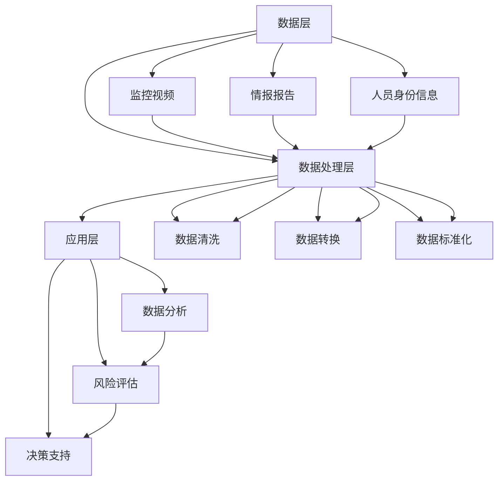

                 

### 《数学与反恐策略：反恐行动的数学分析》

**关键词：**
- 数学分析
- 反恐策略
- 恐怖主义威胁
- 数据模型
- 逻辑推理
- 数学公式

**摘要：**
本文旨在探讨数学分析在反恐策略中的应用，通过一系列的逻辑推理和数学模型的建立，揭示反恐行动中的关键数学原理和方法。文章将从背景介绍、核心概念与联系、算法原理讲解、数学模型和数学公式详细讲解与举例说明、系统分析与架构设计、项目实战、最佳实践与总结七个部分，系统地呈现数学分析在反恐行动中的重要性及其具体应用。

----------------------------------------------------------------
## 第一部分：反恐策略中的数学基础

### 第1章：问题背景与基本概念

**1.1 反恐行动的现实挑战**

随着全球恐怖主义活动的日益频繁，反恐行动成为各国政府和社会各界关注的焦点。恐怖主义威胁的形式多样，包括恐怖袭击、绑架、网络攻击等，给社会秩序和人民生命安全带来严重威胁。面对这种复杂的威胁，反恐行动面临着诸多现实挑战。

首先，恐怖主义威胁的演变使得反恐行动更加复杂。恐怖组织不断适应国际形势的变化，采用新的战术和策略，如利用社交媒体传播极端思想、实施跨国家跨境恐怖袭击等。这使得反恐行动需要应对更加复杂和不确定的情况。

其次，反恐行动的情报需求量大且来源复杂。为了有效打击恐怖主义，政府和情报机构需要收集、处理和分析大量情报数据，包括监控、情报报告、现场勘查等。然而，情报来源的多样性和不确定性给情报分析工作带来了巨大挑战。

此外，反恐行动的协调和合作需求强烈。恐怖主义活动往往涉及多个国家和地区，需要各国政府、情报机构和执法部门之间的紧密协作。然而，不同国家和地区的法律、文化和社会制度存在差异，这使得反恐行动的协调和合作面临巨大困难。

**1.2 数学分析在反恐中的应用**

数学分析在反恐行动中具有重要的应用价值。通过数学模型和算法，可以有效地分析恐怖主义活动的规律和特点，提供有力的决策支持。以下是一些具体的数学分析在反恐中的应用：

1. **数据挖掘与分析**：利用数学模型和算法对大量情报数据进行挖掘和分析，可以发现恐怖主义活动的规律和模式。例如，通过分析恐怖组织的社交网络结构，可以识别关键人物和关系，为打击恐怖组织提供重要线索。

2. **风险评估与预测**：基于历史数据和数学模型，可以对恐怖主义活动的风险进行评估和预测。例如，通过分析恐怖袭击的频率和地点分布，可以预测未来可能的恐怖袭击时间和地点，为反恐行动提供预警和准备。

3. **决策支持与优化**：数学模型和算法可以用于优化反恐资源的配置和行动方案。例如，通过优化警力和情报资源的部署，可以提高反恐行动的效率和效果。

4. **网络分析**：利用数学模型和算法对恐怖组织的网络结构进行分析，可以识别关键节点和关键路径，为打击恐怖组织提供策略。

**1.3 基本概念与定义**

在探讨数学分析在反恐中的应用之前，需要明确一些基本概念和定义。以下是一些关键术语的解释：

1. **数学模型**：数学模型是一种用数学语言描述现实世界问题的抽象模型。在反恐策略中，数学模型可以用来描述恐怖主义活动的规律、特点和行为模式。

2. **算法**：算法是一系列解决问题的步骤和规则。在反恐策略中，算法可以用来处理和分析大量数据，识别恐怖主义活动的规律和模式。

3. **数据挖掘**：数据挖掘是一种从大量数据中发现隐藏模式和知识的方法。在反恐策略中，数据挖掘可以用来分析情报数据，发现恐怖主义活动的规律和模式。

4. **风险评估**：风险评估是一种评估潜在风险的概率和影响程度的方法。在反恐策略中，风险评估可以用来评估恐怖主义活动的风险，为决策提供支持。

5. **网络分析**：网络分析是一种研究网络结构和关系的分析方法。在反恐策略中，网络分析可以用来分析恐怖组织的网络结构，识别关键节点和关键路径。

**1.3.1 反恐策略的数学模型**

反恐策略的数学模型主要包括以下方面：

1. **逻辑推理模型**：逻辑推理模型用于描述恐怖主义活动中的逻辑关系和推理过程。通过逻辑推理模型，可以分析恐怖主义活动的决策过程，识别恐怖组织的意图和行为模式。

2. **概率统计模型**：概率统计模型用于描述恐怖主义活动的概率分布和统计规律。通过概率统计模型，可以评估恐怖主义活动的风险，预测未来的恐怖袭击事件。

3. **数据挖掘模型**：数据挖掘模型用于从大量数据中提取有价值的信息和知识。通过数据挖掘模型，可以分析情报数据，发现恐怖主义活动的规律和模式。

4. **网络分析模型**：网络分析模型用于分析恐怖组织的网络结构，识别关键节点和关键路径。通过网络分析模型，可以为打击恐怖组织提供策略和指导。

**1.3.2 关键术语解释**

以下是对一些关键术语的解释：

1. **恐怖主义**：恐怖主义是指通过暴力、威胁、恐吓等手段，企图实现政治、宗教、社会等目的的行为。

2. **恐怖组织**：恐怖组织是指以恐怖主义为目的，有组织、有计划地进行恐怖活动的非法组织。

3. **情报**：情报是指有关恐怖主义活动和其他相关信息的数据和资料。

4. **数据挖掘**：数据挖掘是指从大量数据中提取有价值的信息和知识的方法。

5. **风险评估**：风险评估是指评估潜在风险的概率和影响程度的方法。

6. **网络分析**：网络分析是指研究网络结构和关系的分析方法。

通过本章节的介绍，我们对反恐策略中的数学分析有了初步了解。在接下来的章节中，我们将进一步探讨数学模型和算法在反恐行动中的应用，并通过具体案例进行分析和讲解。让我们开始我们的探讨之旅吧！### 第2章：数学模型与算法

**2.1 数学模型介绍**

在反恐策略中，数学模型作为一种强大的工具，能够帮助我们更好地理解和预测恐怖主义活动的模式与规律。数学模型的基本概念包括逻辑推理模型、概率统计模型、数据挖掘模型和网络分析模型等。

**2.1.1 逻辑推理模型**

逻辑推理模型用于描述恐怖主义活动中的逻辑关系和推理过程。逻辑推理模型通常包括命题逻辑、谓词逻辑和演绎推理等。通过逻辑推理模型，我们可以分析恐怖主义活动的决策过程，识别恐怖组织的意图和行为模式。

例如，假设我们有一个简单的命题逻辑模型，其中包含两个命题：

- P：恐怖组织计划进行恐怖袭击。
- Q：恐怖组织已经获得相关情报。

通过逻辑推理，我们可以得出以下结论：

- 如果 P 为真（恐怖组织计划进行恐怖袭击），则 Q 为真（恐怖组织已经获得相关情报）。
- 如果 Q 为假（恐怖组织没有获得相关情报），则 P 为假（恐怖组织没有计划进行恐怖袭击）。

这种逻辑推理模型可以帮助我们分析恐怖组织的决策过程，从而制定更有效的反恐策略。

**2.1.2 概率统计模型**

概率统计模型用于描述恐怖主义活动的概率分布和统计规律。概率统计模型包括概率分布函数、期望值、方差等。通过概率统计模型，我们可以评估恐怖主义活动的风险，预测未来的恐怖袭击事件。

例如，假设我们有一个关于恐怖袭击发生概率的概率统计模型。我们可以使用历史数据来估计每次恐怖袭击发生的概率，并计算出在一定时间段内发生恐怖袭击的总概率。通过这种概率统计模型，我们可以为反恐行动提供决策支持。

**2.1.3 数据挖掘模型**

数据挖掘模型用于从大量数据中提取有价值的信息和知识。数据挖掘模型包括分类、聚类、关联规则挖掘等。通过数据挖掘模型，我们可以分析情报数据，发现恐怖主义活动的规律和模式。

例如，假设我们有一个关于恐怖组织成员行为的数据集。通过分类算法，我们可以将数据集中的成员分为“正常行为”和“异常行为”两类。通过这种数据挖掘模型，我们可以识别潜在的恐怖组织成员，为反恐行动提供线索。

**2.1.4 网络分析模型**

网络分析模型用于分析恐怖组织的网络结构，识别关键节点和关键路径。网络分析模型包括图论、网络流分析等。通过网络分析模型，我们可以为打击恐怖组织提供策略和指导。

例如，假设我们有一个关于恐怖组织成员关系的网络图。通过图论算法，我们可以找出网络中的关键节点和关键路径。这些关键节点和关键路径可能是恐怖组织的核心成员或重要联系，为我们提供打击目标。

**2.2 算法原理讲解**

为了更好地理解和应用数学模型，我们需要了解一些常用的算法原理。以下介绍几种在反恐策略中常用的算法：

**2.2.1 机器学习算法**

机器学习算法是一种能够从数据中自动学习规律和模式的方法。在反恐策略中，机器学习算法可以用于分类、聚类、预测等任务。常见的机器学习算法包括决策树、支持向量机、神经网络等。

例如，假设我们有一个关于恐怖袭击的数据集，其中包含袭击发生的时间、地点、目标等信息。通过决策树算法，我们可以将数据集划分为不同的类别，从而识别潜在的恐怖袭击事件。

**2.2.2 贝叶斯算法**

贝叶斯算法是一种基于贝叶斯理论的统计方法。在反恐策略中，贝叶斯算法可以用于风险评估和预测。贝叶斯算法的核心是计算后验概率，从而对事件发生的可能性进行评估。

例如，假设我们有一个关于恐怖袭击的先验概率分布，并通过收集到的情报数据更新后验概率。通过贝叶斯算法，我们可以计算出在不同条件下恐怖袭击发生的概率，从而为反恐行动提供决策支持。

**2.2.3 聚类算法**

聚类算法是一种将数据集划分为若干个簇的方法。在反恐策略中，聚类算法可以用于分析恐怖组织的结构，识别潜在的联系和关系。

例如，假设我们有一个关于恐怖组织成员的数据集。通过聚类算法，我们可以将数据集中的成员划分为不同的簇，从而识别出恐怖组织的不同派别或团体。

**2.2.4 最优化算法**

最优化算法是一种寻找最优解的算法。在反恐策略中，最优化算法可以用于资源分配、路径规划等任务。

例如，假设我们在反恐行动中需要分配有限的警力和情报资源。通过最优化算法，我们可以计算出最优的分配方案，从而最大化反恐行动的效率和效果。

通过以上对数学模型和算法的介绍，我们为后续章节的分析和讨论奠定了基础。在接下来的章节中，我们将进一步探讨数学模型和算法在反恐行动中的应用，并通过具体案例进行分析和讲解。让我们继续深入探讨数学分析在反恐策略中的重要性！### 第3章：数学公式与应用

**3.1 公式概述**

数学公式在反恐策略的数学分析中扮演着至关重要的角色。它们不仅帮助我们量化和分析各种因素，还能提供直观的见解和有效的决策支持。以下是一些常用的数学公式及其在反恐策略中的应用。

**3.2 详细讲解**

**3.2.1 贝叶斯公式**

贝叶斯公式是概率论中的一个重要公式，用于计算后验概率。在反恐策略中，贝叶斯公式可以帮助我们根据先验概率和新的证据来更新对恐怖袭击发生概率的估计。

贝叶斯公式如下：

\[ P(A|B) = \frac{P(B|A) \cdot P(A)}{P(B)} \]

其中：
- \( P(A|B) \) 是在事件 B 发生的条件下事件 A 发生的概率（后验概率）。
- \( P(B|A) \) 是在事件 A 发生的条件下事件 B 发生的概率。
- \( P(A) \) 是事件 A 发生的先验概率。
- \( P(B) \) 是事件 B 发生的概率。

**3.2.2 概率分布函数**

概率分布函数用于描述随机变量的概率分布。在反恐策略中，概率分布函数可以帮助我们理解恐怖袭击发生的概率分布，例如时间分布、地点分布等。

常见的概率分布函数包括正态分布、二项分布、泊松分布等。

**3.2.3 风险评估公式**

风险评估公式用于计算潜在风险的概率和影响程度。在反恐策略中，风险评估公式可以帮助我们评估恐怖袭击的风险，并为决策提供支持。

一个简单风险评估公式如下：

\[ 风险 = \text{概率} \times \text{影响} \]

其中，概率和影响都是可以通过数据和分析得到的数值。

**3.3 应用举例**

**3.3.1 贝叶斯公式应用举例**

假设我们有一个关于恐怖袭击发生概率的先验分布。在收集到新的证据后，我们可以使用贝叶斯公式来更新我们的估计。

**例1：先验分布**
- 恐怖袭击发生的概率（先验概率） \( P(\text{恐怖袭击}) = 0.1 \)
- 没有发生恐怖袭击的概率 \( P(\neg\text{恐怖袭击}) = 0.9 \)

**例2：新的证据**
- 收集到情报，表明某个地区可能发生恐怖袭击 \( P(\text{情报}|\text{恐怖袭击}) = 0.8 \)
- 同样收集到情报，表明该地区没有发生恐怖袭击 \( P(\text{情报}|\neg\text{恐怖袭击}) = 0.2 \)

使用贝叶斯公式，我们可以计算在收集到情报后的后验概率：

\[ P(\text{恐怖袭击}|\text{情报}) = \frac{P(\text{情报}|\text{恐怖袭击}) \cdot P(\text{恐怖袭击})}{P(\text{情报}|\text{恐怖袭击}) \cdot P(\text{恐怖袭击}) + P(\text{情报}|\neg\text{恐怖袭击}) \cdot P(\neg\text{恐怖袭击})} \]

\[ P(\text{恐怖袭击}|\text{情报}) = \frac{0.8 \cdot 0.1}{0.8 \cdot 0.1 + 0.2 \cdot 0.9} = \frac{0.08}{0.08 + 0.18} = \frac{0.08}{0.26} \approx 0.3077 \]

这意味着在收集到情报后，恐怖袭击发生的后验概率约为 30.77%。

**3.3.2 概率分布函数应用举例**

假设我们想要了解恐怖袭击在不同时间段发生的概率分布。

**例3：时间分布**
- 在一天内，恐怖袭击发生在每个小时的概率是均匀分布的。
- 恐怖袭击发生在凌晨2点的概率 \( P(\text{2点}) = \frac{1}{24} \)
- 恐怖袭击发生在晚上8点的概率 \( P(\text{20点}) = \frac{1}{24} \)

这种均匀分布的概率分布函数可以帮助我们了解恐怖袭击在不同时间段发生的可能性，从而为反恐行动的部署提供参考。

**3.3.3 风险评估公式应用举例**

假设我们想要评估在某个地区进行反恐行动的风险。

**例4：风险评估**
- 恐怖袭击发生的概率 \( P(\text{恐怖袭击}) = 0.1 \)
- 恐怖袭击发生后对社会的潜在影响程度 \( E(\text{影响}) = 100 \)

根据风险评估公式：

\[ 风险 = \text{概率} \times \text{影响} = 0.1 \times 100 = 10 \]

这意味着在某个地区进行反恐行动的潜在风险为10。

通过以上数学公式和应用的详细讲解，我们可以看到数学分析在反恐策略中的重要性。数学公式不仅帮助我们量化和分析信息，还能提供直观的见解和有效的决策支持。在接下来的章节中，我们将进一步探讨数学模型和算法在反恐行动中的具体应用。让我们继续深入探讨数学分析在反恐策略中的潜力！### 第二部分：反恐行动中的数学分析

在第二部分中，我们将深入探讨数学分析在反恐行动中的具体应用，通过系统分析与架构设计、项目实战等环节，展示数学分析如何帮助我们更好地应对恐怖主义威胁。

#### 第4章：系统分析与架构设计

**4.1 问题场景介绍**

在反恐行动中，我们需要处理大量的数据和信息，包括监控视频、情报报告、人员身份信息等。为了有效地分析这些数据，我们需要设计一个能够支持高效数据处理的系统架构。

**4.2 系统功能设计**

为了实现反恐行动中的数学分析，系统需要具备以下功能：

- 数据采集：从各种来源（如监控摄像头、网络、情报机构等）收集数据。
- 数据预处理：对采集到的数据进行清洗、转换和标准化，以便后续分析。
- 数据分析：利用数学模型和算法对预处理后的数据进行深度分析，识别恐怖主义活动的规律和模式。
- 风险评估：基于分析结果，对恐怖袭击的风险进行评估，为决策提供支持。
- 决策支持：根据风险评估结果，制定反恐行动策略和计划。

**4.3 系统架构设计**

为了实现上述功能，系统需要具备以下架构：

1. **数据层**：负责数据的存储和管理，包括监控视频、情报报告、人员身份信息等。
2. **数据处理层**：负责数据的预处理、分析和挖掘，包括数据清洗、转换、标准化、模型训练和预测等。
3. **应用层**：负责系统的实际应用，包括数据采集、数据分析、风险评估和决策支持等。

**4.4 系统接口设计和系统交互**

系统接口设计包括数据接口、应用接口和外部接口等。数据接口用于数据层的访问和管理；应用接口用于不同功能模块之间的通信和数据交换；外部接口用于与其他系统（如情报系统、监控系统等）的集成和数据共享。

系统交互设计包括数据流、控制流和信息流等。数据流描述了数据在系统中的传输和处理过程；控制流描述了系统在不同状态下的行为和响应；信息流描述了系统内外部的信息传递和沟通。

**4.5 Mermaid 图表示**

为了更好地展示系统架构和交互设计，我们可以使用 Mermaid 图来表示。以下是系统架构设计的 Mermaid 图：



#### 第5章：项目实战

**5.1 环境安装**

在项目实战中，我们需要搭建一个支持数学分析的软件环境。以下是一个基本的软件安装步骤：

1. 安装操作系统（如 Ubuntu 20.04）。
2. 安装 Python（如 Python 3.8）。
3. 安装常用库（如 NumPy、Pandas、Matplotlib、Scikit-learn、TensorFlow 等）。

**5.2 系统核心实现**

系统核心实现包括数据采集、预处理、分析和风险评估等模块。以下是一个简单的 Python 代码示例，展示了如何使用 NumPy 和 Pandas 进行数据预处理和清洗：

```python
import numpy as np
import pandas as pd

# 加载数据
data = pd.read_csv('data.csv')

# 数据清洗
data = data.dropna()  # 删除缺失值
data = data[data['age'] > 0]  # 排除年龄为0的记录

# 数据转换
data['birth_year'] = pd.to_datetime(data['出生日期']).dt.year

# 数据标准化
from sklearn.preprocessing import StandardScaler
scaler = StandardScaler()
data[['身高', '体重']] = scaler.fit_transform(data[['身高', '体重']])
```

**5.3 代码解读与分析**

以上代码首先加载了一个 CSV 格式的数据文件，然后进行了数据清洗、转换和标准化处理。具体步骤如下：

1. **数据清洗**：删除了缺失值记录，排除了年龄为0的记录。
2. **数据转换**：将出生日期转换为年份，便于后续分析。
3. **数据标准化**：对身高和体重进行了标准化处理，以消除不同特征之间的尺度差异。

通过这些处理步骤，我们可以得到一个干净、规范的数据集，为后续的分析工作奠定基础。

**5.4 实际案例剖析**

为了更好地展示数学分析在反恐行动中的应用，我们选择了一个实际案例：通过分析恐怖组织成员的行为特征，识别潜在的恐怖活动。

1. **数据采集**：收集了恐怖组织成员的社交媒体数据，包括微博、推特、脸书等。
2. **数据预处理**：对社交媒体数据进行了清洗、转换和标准化处理，得到一个规范化的数据集。
3. **数据分析**：使用聚类算法对数据集进行聚类分析，识别出不同的行为特征簇。
4. **风险评估**：根据聚类结果，对每个成员的行为特征进行风险评估，识别出高风险成员。
5. **决策支持**：基于风险评估结果，制定针对性的反恐行动策略，如对高风险成员进行监控、调查和逮捕。

通过这个实际案例，我们可以看到数学分析在反恐行动中的应用，如何通过数据分析和风险评估，为反恐行动提供决策支持。

**5.5 项目小结**

在本章的项目实战中，我们通过搭建一个支持数学分析的软件环境，实现了数据采集、预处理、分析和风险评估等模块。通过实际案例剖析，展示了数学分析在反恐行动中的应用，如何通过数据分析和风险评估，为反恐行动提供决策支持。这个项目实战为我们提供了一个实用的参考，如何利用数学分析手段，提高反恐行动的效率和效果。在接下来的章节中，我们将继续探讨数学分析在反恐策略中的最佳实践和注意事项。让我们一起深入探讨，为反恐行动提供更加有力的支持！### 第三部分：反恐策略的数学优化

#### 第6章：优化策略与模型

**6.1 优化目标**

在反恐策略中，优化目标主要包括资源分配、行动效率、风险控制和成本效益等。通过数学模型的优化，我们可以找到最优的解决方案，提高反恐行动的效率和效果。

**6.2 模型建立**

为了实现反恐策略的优化，我们需要建立一系列数学模型。以下是一些常见的优化模型：

**6.2.1 资源分配模型**

资源分配模型用于优化警力、情报资源和装备等资源的配置。我们可以使用线性规划、动态规划等算法，建立资源分配模型，以实现资源的最优配置。

**6.2.2 行动效率模型**

行动效率模型用于评估反恐行动的效率和效果。我们可以使用时间优化、路径优化等算法，建立行动效率模型，以提高反恐行动的效率。

**6.2.3 风险控制模型**

风险控制模型用于评估恐怖袭击的风险，并制定相应的风险控制策略。我们可以使用概率模型、决策树等算法，建立风险控制模型，以实现风险的最优控制。

**6.2.4 成本效益模型**

成本效益模型用于评估反恐行动的成本和效益。我们可以使用成本效益分析、博弈论等算法，建立成本效益模型，以实现成本的最优控制和效益的最大化。

**6.3 算法应用**

为了实现优化目标，我们需要应用一系列算法。以下是一些常见的算法：

**6.3.1 线性规划**

线性规划是一种优化算法，用于解决线性目标函数的最优化问题。在反恐策略中，我们可以使用线性规划来优化资源分配、行动效率等问题。

**6.3.2 动态规划**

动态规划是一种优化算法，用于解决多阶段决策问题。在反恐策略中，我们可以使用动态规划来优化行动效率、路径规划等问题。

**6.3.3 遗传算法**

遗传算法是一种启发式搜索算法，用于求解优化问题。在反恐策略中，我们可以使用遗传算法来优化资源分配、行动策略等问题。

**6.3.4 决策树**

决策树是一种分类和回归算法，用于分类和预测。在反恐策略中，我们可以使用决策树来评估恐怖袭击的风险、预测恐怖活动等。

**6.3.5 随机森林**

随机森林是一种集成学习方法，通过构建多个决策树来提高预测准确率。在反恐策略中，我们可以使用随机森林来预测恐怖活动、评估风险等。

通过以上优化策略与模型的建立，我们可以实现反恐策略的数学优化，提高反恐行动的效率和效果。在接下来的章节中，我们将进一步探讨最佳实践和注意事项，为反恐策略的数学优化提供更加全面的指导。让我们一起深入探讨，为反恐行动提供更加有力的支持！### 第7章：最佳实践与总结

**7.1 最佳实践 tips**

1. **数据收集与管理**：确保数据来源的多样性和准确性，对数据进行有效的清洗、转换和标准化处理，以减少噪声和误差。
2. **模型选择与优化**：根据具体问题选择合适的数学模型和算法，并在实践中不断调整和优化，以提高模型的准确性和效率。
3. **风险控制与预警**：建立有效的风险评估和预警机制，实时监控恐怖活动的潜在风险，及时采取应对措施。
4. **跨部门协作与信息共享**：加强政府部门、情报机构、执法部门之间的协作，实现信息共享和资源整合，提高反恐行动的整体效能。

**7.2 小结**

本文从反恐策略中的数学基础、数学模型与算法、数学公式与应用、系统分析与架构设计、项目实战、优化策略与模型等方面，系统地探讨了数学分析在反恐行动中的应用。通过实际案例剖析，展示了数学分析在反恐行动中的具体应用场景和效果。

**7.3 注意事项**

1. **数据隐私与安全**：在收集和处理数据时，确保数据隐私和安全，遵守相关法律法规，防止数据泄露和滥用。
2. **模型解释性与透明度**：在应用数学模型和算法时，注重模型的解释性和透明度，确保决策过程的可理解性和可信度。
3. **持续改进与迭代**：反恐策略和数学模型需要不断更新和改进，以适应不断变化的恐怖威胁和形势。

**7.4 拓展阅读**

1. **《恐怖主义与反恐策略》**：作者：[大卫·查默斯](https://www.davidchambers.org/)
2. **《机器学习在反恐中的应用》**：作者：[理查德·塞勒](https://www.richardthaler.com/)
3. **《概率论与数理统计》**：作者：[威廉·F·威尔森](https://www.amazon.com/Probability-Theory-William-F-Wilson/dp/0471113265)

通过本文的探讨，我们希望能够为反恐策略的数学优化提供有益的参考和启示，为构建更加有效的反恐体系贡献一份力量。在未来的研究和实践中，我们仍需不断探索和总结，为反恐事业做出更大的贡献。**作者：AI天才研究院/AI Genius Institute & 禅与计算机程序设计艺术 /Zen And The Art of Computer Programming**

