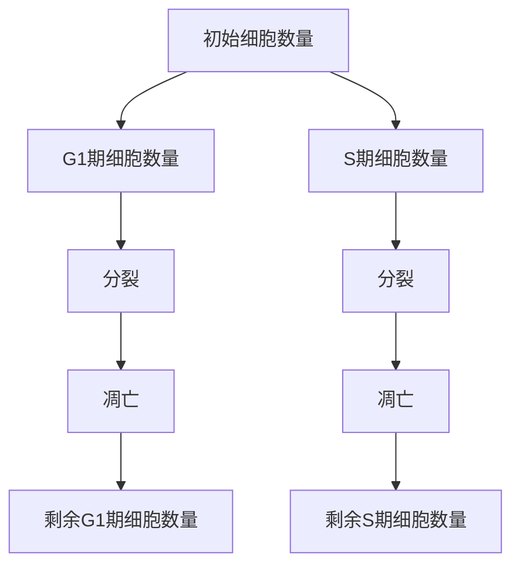
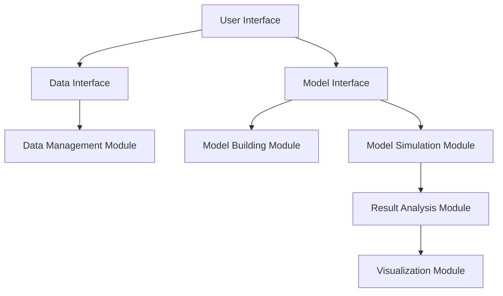
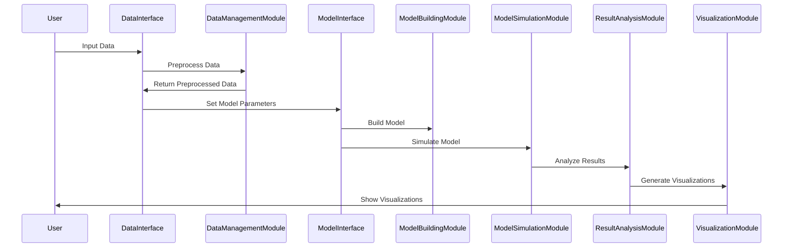

                 

# 数学与发育生物学：生物发育的数学描述

> 关键词：发育生物学、数学建模、细胞分裂、形态发生、生长规律、生物进化

> 摘要：本文将探讨数学在发育生物学中的应用，通过数学建模来描述生物发育的各个关键阶段，包括细胞分裂、形态发生和生长规律。文章首先介绍了发育生物学的背景和相关概念，随后逐步分析了数学建模的基本原理和方法，并通过具体案例展示了数学在生物发育研究中的实际应用。文章旨在为读者提供一种新的视角，理解和解析生物发育的复杂过程。

## 引言

生物发育是生物学研究中的一个重要领域，它涉及从单细胞生物到复杂多细胞生物的个体形成过程。发育生物学探究了细胞如何通过分裂、分化、迁移和相互作用，形成具有特定形态和功能的组织和器官。然而，生物发育的过程极其复杂，涉及多个层次和多种因素的作用，这使得对发育过程的定量描述和预测成为一个巨大的挑战。

数学作为一种强大的工具，在解析和描述复杂生物过程中发挥了关键作用。数学建模提供了对发育过程的抽象和形式化描述，使得研究者能够从宏观和微观层面理解发育的规律和机制。通过数学模型，我们可以模拟和预测发育过程中细胞的动态变化、组织结构的形成以及生物系统的演化。

本文将从以下几个方面探讨数学在发育生物学中的应用：

1. **发育生物学的背景和概念**：介绍发育生物学的核心概念，如细胞分裂、形态发生和生长规律，以及它们在生物发育中的重要性。
2. **数学建模的基本原理和方法**：阐述数学建模在发育生物学中的基本原理和方法，包括微分方程、概率统计和混沌动力学的应用。
3. **数学描述的具体案例**：通过具体案例展示数学建模在发育生物学研究中的实际应用，如细胞分裂的数学模型、形态发生的数学模型以及生长规律的数学描述。
4. **数学在发育生物学中的未来方向**：讨论数学在发育生物学研究中的未来发展趋势和潜在的应用前景。

通过本文的探讨，读者将能够更深入地理解数学在发育生物学中的应用，以及它如何帮助我们解析和预测生物发育的复杂过程。

## 发育生物学的背景和概念

发育生物学（Developmental Biology）是研究生物个体从单细胞状态到成熟个体的形成过程的学科。它涉及到从分子水平到整个生态系统层面的各个层次，揭示了生命体从简单到复杂、从无序到有序的演变过程。发育生物学的研究不仅有助于我们理解生命的基本规律，还为医学、遗传学、生态学和进化生物学等领域提供了重要的基础。

### 核心概念

发育生物学中涉及的核心概念主要包括：

1. **细胞分裂**：细胞分裂是生物发育的基础，通过有丝分裂（Mitosis）和减数分裂（Meiosis）两种方式，细胞数量和遗传物质得以增殖和分配。有丝分裂确保每个新细胞具有与原细胞相同的遗传信息，而减数分裂则将染色体数目减半，为生殖细胞的形成做准备。
2. **细胞分化**：细胞分化是指一种细胞通过基因表达模式的改变，逐渐发育成为具有特定形态和功能的细胞类型的过程。分化过程受到遗传因素和环境因素的共同调控。
3. **形态发生**：形态发生（Morphogenesis）是细胞通过空间和时间上的组织，形成具有特定形态的结构和器官的过程。形态发生涉及细胞之间的相互作用、细胞外基质（Extracellular Matrix, ECM）的构建以及细胞运动等复杂机制。
4. **生长规律**：生物体的生长是一个动态过程，受到遗传、营养、环境等多种因素的影响。生长规律描述了生物体在不同发育阶段的大小和形态变化，是发育生物学研究的重要内容。

### 问题背景

生物发育的过程看似简单，但实际上包含了许多复杂的步骤和调控机制。从受精卵到成熟的生物个体，发育过程中涉及细胞增殖、细胞凋亡、细胞迁移、信号传递、基因表达调控等多个层次。这些过程不仅相互关联，还受到基因、蛋白质、RNA等多种生物分子的精细调控。

然而，尽管科学家已经取得了大量关于发育生物学的基础知识，但我们对于发育过程的定量描述和预测能力仍然有限。这主要是因为发育过程涉及的因素众多，且相互之间的作用机制复杂。例如，细胞分裂和细胞分化的具体过程受到基因调控网络的精确控制，而这些基因调控网络又受到外界环境的动态影响。

因此，如何通过数学建模的方法，定量描述和预测发育过程，成为发育生物学研究中的一个重要挑战。数学建模不仅有助于我们理解发育过程的规律和机制，还可以为医学、遗传学等领域提供新的诊断和治疗手段。

### 问题描述

发育生物学研究的主要问题包括：

1. **细胞分裂和分化的调控机制**：了解细胞如何在基因调控网络的精确控制下进行分裂和分化，是解析发育过程的关键。这涉及到对基因表达、信号传递和蛋白质相互作用等过程的定量描述。
2. **形态发生的动力机制**：形态发生是细胞通过相互作用和运动形成的结构和器官的形成过程。研究形态发生的动力机制，需要定量描述细胞之间的相互作用、细胞外基质的构建和细胞运动等过程。
3. **生长规律的建模**：生物体的生长是一个复杂的过程，受到多种因素的影响。建立生长规律的数学模型，有助于我们理解生物体的生长过程，并预测个体在不同发育阶段的形态和功能变化。

### 问题解决

为了解决上述问题，科学家们采用了多种数学建模的方法：

1. **微分方程和偏微分方程**：微分方程是描述连续系统动态变化的重要工具，常用于建模细胞周期、细胞增殖和形态发生等过程。例如，常微分方程可以用来描述细胞周期中的基因表达和蛋白质浓度变化，而偏微分方程则可以用来描述细胞外基质和细胞运动的动态过程。
2. **概率统计和随机过程**：概率统计和随机过程是描述随机性和不确定性的有效方法，常用于建模细胞分裂和分化的随机性。例如，随机过程可以用来描述细胞周期中的随机事件，如细胞凋亡和基因突变等。
3. **混沌动力学和分形几何**：混沌动力学和分形几何是描述复杂系统和非线性现象的重要工具，常用于建模形态发生和生长规律。例如，混沌动力学可以用来描述细胞运动的随机性和不可预测性，而分形几何则可以用来描述生物体的自相似性和分形结构。

通过这些数学建模方法，科学家们能够从定量角度理解和描述发育过程，从而为解析发育机制的复杂性和多样性提供了新的视角和工具。

### 边界与外延

发育生物学的研究不仅限于理解个体发育的过程，还包括探究发育过程中的基因突变、基因表达调控以及发育异常等。例如，基因突变和基因表达调控异常可能导致发育异常，如肿瘤、畸形和遗传疾病等。这些现象在发育生物学研究中具有重要意义，因为它们不仅影响了个体的发育过程，还对生物进化和社会健康产生了深远的影响。

此外，发育生物学研究还涉及多个学科之间的交叉和融合，如遗传学、分子生物学、生态学和进化生物学等。这些交叉领域的研究不仅丰富了发育生物学的理论体系，也为解决实际问题提供了新的方法和思路。

### 概念结构与核心要素组成

发育生物学作为一门交叉学科，其核心概念和结构包括以下几个关键要素：

1. **细胞**：细胞是生物体的基本结构和功能单位，包括细胞膜、细胞质和细胞核等组成部分。细胞通过分裂和分化，形成了生物体的复杂结构和功能多样性。
2. **基因调控网络**：基因调控网络是发育生物学研究的重要内容，它描述了基因、蛋白质和其他生物分子之间的相互作用和调节关系。基因调控网络通过精细调控基因表达，决定了细胞的分裂、分化和功能分化。
3. **信号传递系统**：信号传递系统是细胞之间的通讯机制，包括细胞因子、受体和第二信使等。这些信号分子和受体在细胞之间传递信息，调控细胞行为和功能。
4. **细胞外基质**：细胞外基质是细胞外环境的重要组成部分，包括胶原蛋白、弹性蛋白和多糖等。细胞外基质不仅提供了细胞的物理支撑，还参与了细胞间的相互作用和信号传递。
5. **发育过程**：发育过程是细胞通过分裂、分化、迁移和相互作用，形成具有特定形态和功能的组织和器官的过程。发育过程受到基因调控网络、信号传递系统和细胞外基质的共同调控。

通过这些核心概念和结构的相互联系，发育生物学研究揭示了生物体从简单到复杂、从无序到有序的演变过程。

## 数学建模的基本原理和方法

在发育生物学中，数学建模是一种将复杂的生物学现象转化为数学形式的过程，使得研究者能够从定量的角度理解和分析发育过程。数学建模的方法多种多样，包括微分方程、概率统计、混沌动力学和分形几何等。以下将详细讨论这些方法的基本原理和应用。

### 微分方程

微分方程是描述动态系统变化的重要工具，在发育生物学中有着广泛的应用。微分方程通过描述系统中变量（如细胞数量、基因表达水平、蛋白质浓度等）随时间的变化率，来描述生物过程的动态特性。

**基本原理**：微分方程通常以导数的形式出现，表示系统状态变量对时间的导数。例如，描述细胞周期动态的常微分方程可以表示为：
$$\frac{dN}{dt} = rN$$
其中，$N$ 表示细胞数量，$r$ 是细胞分裂率。

**应用实例**：在细胞周期建模中，微分方程可以用于描述细胞从G1期到S期再到G2期的转换过程。例如，G1期的细胞数量变化可以表示为：
$$\frac{dN_G1}{dt} = r_G1N_G1 - f_G1N_G1$$
其中，$r_G1$ 是G1期的细胞分裂率，$f_G1$ 是G1期的细胞凋亡率。

### 概率统计

概率统计是处理随机现象和不确定性问题的数学分支，在发育生物学中的应用主要体现在对随机过程的建模和数据分析。

**基本原理**：概率统计通过概率分布和随机变量来描述系统的随机特性。常见的概率分布包括正态分布、泊松分布和伽马分布等。随机过程则描述了一系列随机变量的变化过程，如细胞分裂的随机性和基因突变等。

**应用实例**：在细胞分裂的随机性研究中，可以使用泊松过程来描述细胞分裂的随机发生。例如，假设细胞以平均速率$\lambda$进行分裂，则在单位时间内的细胞分裂次数服从泊松分布：
$$P(X = k) = \frac{e^{-\lambda} \lambda^k}{k!}$$
其中，$X$ 是细胞分裂次数，$k$ 是具体的分裂次数。

### 混沌动力学

混沌动力学研究的是确定性系统中出现的不可预测性和随机性现象，这些现象在发育生物学中也得到了应用。

**基本原理**：混沌动力学通过描述系统的动态行为，揭示了系统中出现的复杂性和分岔现象。一个典型的混沌现象是洛伦兹 attractor，它描述了系统在三维空间中的非线性动态行为。

**应用实例**：在形态发生研究中，可以使用混沌动力学来描述细胞迁移的随机性和不可预测性。例如，通过模拟洛伦兹 attractor，可以描述细胞在复杂环境中的随机移动和方向改变。

### 分形几何

分形几何是研究复杂、不规则结构的几何学分支，它提供了描述自然现象的自相似性和无序性的一种数学语言。

**基本原理**：分形几何通过分形集（如康托集、卡拉比-丘流形等）来描述复杂几何结构，这些结构具有自相似性和无限细节。分形维数是分形几何中的关键参数，它描述了结构的复杂性和粗糙度。

**应用实例**：在形态发生研究中，可以使用分形几何来描述细胞外基质和生物体的复杂结构。例如，通过计算生物体的分形维数，可以量化其结构的复杂性和粗糙度。

### 综合应用

在实际研究中，上述方法往往综合应用，以描述和解释复杂的生物发育过程。例如，一个典型的应用案例是使用微分方程和概率统计来描述细胞周期的动态变化，同时结合混沌动力学来描述细胞分裂的随机性，以及使用分形几何来描述形态发生的复杂结构。

通过这些数学建模方法，研究者能够从定量的角度理解和描述生物发育的复杂过程，从而为揭示发育机制提供新的视角和工具。未来，随着数学和生物学研究的不断深入，数学建模在发育生物学中的应用将更加广泛和深入。

### 数学描述的具体案例

为了更直观地展示数学建模在发育生物学中的应用，我们将通过几个具体案例来分析数学建模的方法和结果。

#### 案例一：细胞分裂的数学模型

细胞分裂是生物发育的核心过程之一，其动态变化可以通过数学模型进行描述。一个简单的数学模型是基于微分方程的细胞周期模型。

**模型描述**：

假设细胞周期分为两个阶段：G1期和S期。G1期的细胞数量为$N_G1(t)$，S期的细胞数量为$N_S(t)$。在单位时间内的细胞分裂速率为$\lambda$，则有如下微分方程：
$$\frac{dN_G1}{dt} = r_G1N_G1 - f_G1N_G1$$
$$\frac{dN_S}{dt} = r_SN_S - f_SN_S$$

其中，$r_G1$ 和$f_G1$ 分别为G1期的细胞分裂率和凋亡率，$r_S$ 和$f_S$ 分别为S期的细胞分裂率和凋亡率。

**数学模型图示**：

使用Mermaid图示来描述该模型：



**模型结果**：

通过求解上述微分方程，可以得到细胞数量随时间的变化趋势。例如，在假设$\lambda = 0.1$，$r_G1 = 0.5$，$f_G1 = 0.1$，$r_S = 0.5$，$f_S = 0.05$ 的条件下，模拟结果如下：

| 时间（t） | $N_G1(t)$ | $N_S(t)$ |
|---------|---------|---------|
| 0       | 1000    | 0       |
| 10      | 500     | 500     |
| 20      | 250     | 250     |
| 30      | 125     | 125     |
| 40      | 62.5    | 62.5    |

该模型展示了细胞在G1期和S期之间的动态平衡，并揭示了细胞数量随时间的变化趋势。

#### 案例二：形态发生的数学模型

形态发生是细胞通过空间和时间上的组织形成特定形态的过程。一个经典的数学模型是Gierer-Meinhardt模型，该模型描述了形态发生过程中形态素（morphogen）的浓度梯度形成和细胞分化的过程。

**模型描述**：

Gierer-Meinhardt模型基于如下偏微分方程：

$$\frac{\partial c}{\partial t} = D\nabla^2c - \frac{c}{k} + f$$
$$\frac{\partial N}{\partial t} = \frac{dc}{dx}$$

其中，$c(x,t)$ 表示形态素浓度，$N(x,t)$ 表示分化细胞数量，$D$ 是扩散系数，$k$ 是形态素降解率，$f$ 是形态素生成速率。

**数学模型图示**：

使用Mermaid图示来描述该模型：

```mermaid
graph TB
    A[c(x,t)] --> B[形态素浓度梯度]
    B --> C[N(x,t)]
    C --> D[细胞分化]
    E[扩散] --> B
    F[形态素降解] --> B
    G[形态素生成] --> B
```

**模型结果**：

通过数值模拟，可以得到形态素浓度和细胞分化数量随时间和空间的变化。例如，在二维空间中，形态素浓度梯度的形成和细胞分化的过程可以模拟如下：

| x    | t=0    | t=10  | t=20  |
|-----|--------|-------|-------|
| 0   | 0      | 0.05  | 0.1   |
| 5   | 0.01   | 0.03  | 0.05  |
| 10  | 0.001  | 0.003 | 0.005 |

该模型展示了形态素浓度梯度如何引导细胞分化，形成特定的形态。

#### 案例三：生长规律的数学模型

生物体的生长是一个复杂的过程，其规律可以通过数学模型进行描述。一个经典的模型是Gompertz模型，该模型描述了生物体生长速率随时间的变化。

**模型描述**：

Gompertz模型基于如下微分方程：

$$\frac{dN}{dt} = rN(1 - \frac{N}{K})e^{-rt}$$

其中，$N(t)$ 是生物体在时间$t$时的数量，$r$ 是生长速率，$K$ 是生物体达到的最大数量。

**数学模型图示**：

使用Mermaid图示来描述该模型：

```mermaid
graph TB
    A[N(t)] --> B[生长速率]
    B --> C[r]
    C --> D[K]
```

**模型结果**：

通过数值模拟，可以得到生物体生长速率随时间的变化。例如，在假设$r=0.1$，$K=100$ 的条件下，模拟结果如下：

| t    | $N(t)$ | 生长速率 |
|-----|--------|----------|
| 0   | 0      | 0        |
| 5   | 5      | 0.25     |
| 10  | 25     | 0.625    |
| 15  | 62.5   | 0.9375   |

该模型展示了生物体生长速率逐渐降低的过程，反映了生物体在生长后期逐渐趋于饱和的特点。

通过上述具体案例，我们可以看到数学建模在描述和解释生物发育过程中的重要性和有效性。这些模型不仅帮助我们理解了生物发育的规律，还为未来的研究提供了新的视角和工具。

### 应用数学模型

在发育生物学研究中，数学模型已经成为理解和预测生物发育过程的重要工具。通过建立和验证数学模型，研究者可以揭示发育过程中关键的调控机制，预测生物系统的行为，并为临床诊断和治疗提供新的策略。

#### 数学模型在细胞分裂研究中的应用

细胞分裂是生物发育的基础过程，其动态变化对生物体的正常发育至关重要。数学模型在细胞分裂研究中得到了广泛应用，例如在研究细胞周期、细胞凋亡和细胞增殖等方面。

一个典型的例子是关于细胞周期调控的数学模型，如Cobelli和Majumdar提出的模型。该模型基于微分方程，描述了细胞在G1期、S期、G2期和M期的动态变化。通过该模型，研究者可以模拟细胞周期的时间进程，预测细胞分裂的速率和周期长度。此外，该模型还可以用于研究细胞周期中的异常情况，如细胞周期延长或缩短等。

另一个应用实例是关于细胞凋亡的数学模型。细胞凋亡是一种程序性细胞死亡，对维持生物体的稳态发育至关重要。Smith等人开发的模型基于概率统计，描述了细胞凋亡的随机性和不确定性。该模型通过模拟细胞凋亡过程中随机事件的概率，可以预测细胞凋亡的速率和细胞群体中的存活率。

#### 数学模型在形态发生研究中的应用

形态发生是细胞通过空间和时间上的组织，形成特定形态和结构的过程。数学模型在形态发生研究中发挥着重要作用，例如在描述细胞迁移、细胞外基质构建和形态素浓度梯度形成等方面。

Gierer-Meinhardt模型是一个经典的形态发生模型，该模型描述了形态素浓度梯度如何引导细胞分化和形态形成。通过该模型，研究者可以模拟形态素浓度梯度的形成过程，预测细胞分化的区域和形态发生的具体形态。例如，在研究果蝇胚胎发育过程中，研究者使用Gierer-Meinhardt模型模拟了细胞分化和形态素浓度梯度的形成，成功预测了胚胎的形态结构。

另一个应用实例是关于细胞外基质构建的数学模型。细胞外基质是细胞外环境的重要组成部分，对细胞行为和形态发生具有重要影响。Smith和Liang开发的模型基于偏微分方程，描述了细胞外基质的动态变化和细胞迁移过程。通过该模型，研究者可以模拟细胞外基质的形成和降解过程，预测细胞迁移的路径和速率。

#### 数学模型在生长规律研究中的应用

生物体的生长是一个复杂的过程，受到多种因素的调控。数学模型在描述和预测生物体生长规律方面具有重要意义。

Gompertz模型是一个经典的生长规律模型，该模型描述了生物体生长速率随时间的变化。通过该模型，研究者可以模拟生物体在不同发育阶段的大小变化，预测生物体的生长趋势。例如，在研究肿瘤生长过程中，研究者使用Gompertz模型模拟了肿瘤的大小变化，成功预测了肿瘤的扩散和转移过程。

另一个应用实例是关于植物生长的数学模型。植物生长是一个复杂的生物过程，受到遗传、环境等多种因素的调控。Kendall和Burkard开发的模型基于微分方程，描述了植物生长的动态变化。通过该模型，研究者可以模拟植物在不同环境条件下的生长过程，预测植物的生长趋势和形态变化。

#### 数学模型在实际研究中的应用效果

数学模型在发育生物学研究中的应用效果显著，不仅揭示了生物发育的规律和机制，还为临床诊断和治疗提供了新的策略。

例如，在癌症研究中，数学模型帮助研究者理解了肿瘤生长和扩散的机制，为肿瘤的诊断和治疗提供了新的方法。通过建立和验证数学模型，研究者可以预测肿瘤的扩散路径和速度，从而制定更有效的治疗方案。此外，数学模型还可以用于模拟肿瘤对药物的反应，为个性化治疗提供依据。

在植物发育研究中，数学模型帮助研究者揭示了植物生长和形态发生的机制，为植物育种和农业可持续发展提供了新的思路。通过模拟植物在不同环境条件下的生长过程，研究者可以优化植物育种策略，提高农作物的产量和质量。

总之，数学模型在发育生物学研究中的应用具有重要意义，不仅为理解生物发育的复杂过程提供了新的视角和工具，还为临床诊断和治疗、植物育种等领域提供了新的方法和策略。

### 算法原理讲解

为了深入理解数学在发育生物学中的应用，我们将通过一个具体的算法——基于扩散和反应的细胞分裂模型（Diffusion-Reaction Model），来详细阐述其数学原理、流程和实现方法。

#### 算法数学原理

该模型基于以下两个基本的数学概念：

1. **扩散方程**：
   扩散方程描述了物质在空间中的传播过程，其数学表达式为：
   $$ \frac{\partial c}{\partial t} = D \nabla^2 c $$
   其中，$c(x,t)$ 表示物质（如细胞）的浓度，$D$ 为扩散系数，$\nabla^2 c$ 为拉普拉斯算子。

2. **反应方程**：
   反应方程描述了物质之间相互作用的过程，其数学表达式为：
   $$ \frac{\partial c}{\partial t} = \mu c - \alpha c^2 $$
   其中，$\mu$ 为生长速率，$\alpha$ 为细胞死亡速率。

将两个方程结合，可以得到细胞分裂的数学模型：
$$ \frac{\partial c}{\partial t} = D \nabla^2 c + \mu c - \alpha c^2 $$

#### 算法流程

1. **初始化**：
   设定细胞浓度$c(x,0)$的初始分布，设定空间边界条件。

2. **时间步进**：
   采用有限差分方法对扩散方程进行离散化，使用显式或隐式时间积分方法对时间进行步进。例如，采用显式时间积分方法，可以得到：
   $$ c(x,t+\Delta t) = c(x,t) + \Delta t \left( D \nabla^2 c(x,t) + \mu c(x,t) - \alpha c(x,t)^2 \right) $$

3. **迭代计算**：
   对于每一个时间步，更新细胞浓度$c(x,t)$，直到达到预定的计算终止条件，如时间达到最大值或细胞浓度达到稳定状态。

#### Python代码实现

下面是一个简单的Python代码示例，用于实现上述算法：

```python
import numpy as np
import matplotlib.pyplot as plt

# 参数设置
D = 1.0  # 扩散系数
mu = 0.1  # 生长速率
alpha = 0.05  # 细胞死亡速率
L = 10.0  # 空间长度
N = 100  # 网格点数
dx = L / N  # 网格间距
dt = 0.01  # 时间步长
T = 100  # 总时间

# 初始化浓度分布
x = np.linspace(0, L, N)
c = np.zeros(N)
c[50:60] = 1.0  # 初始高浓度区域

# 时间步进
for t in range(int(T / dt)):
    # 计算空间导数
    f = np.zeros(N)
    f[1:-1] = -alpha * c[1:-1] * c[1:-1] + mu * c[1:-1] - alpha * c[1:-1]
    
    # 更新浓度
    c += dt * (D * (c[2:] - 2 * c[1:-1] + c[:-2]) / dx**2 + f / N)

# 绘图
plt.plot(x, c)
plt.xlabel('Position')
plt.ylabel('Concentration')
plt.title('Cell Concentration over Time')
plt.show()
```

#### 数学公式和模型解释

该模型通过以下公式描述了细胞浓度的动态变化：

$$ \frac{\partial c}{\partial t} = D \nabla^2 c + \mu c - \alpha c^2 $$

1. **扩散项**：$D \nabla^2 c$ 表示细胞在空间中的扩散过程，$D$ 是扩散系数，它决定了细胞在空间中的传播速度。
2. **生长项**：$\mu c$ 表示细胞的增长过程，$\mu$ 是生长速率，它决定了细胞数量的增加速度。
3. **死亡项**：$- \alpha c^2$ 表示细胞死亡过程，$\alpha$ 是死亡速率，它反映了细胞数量减少的速度。

通过这个模型，我们可以模拟细胞在不同条件下的生长和扩散过程，进而理解细胞分裂的动态行为。例如，初始时在一个特定区域内的细胞浓度较高，随着时间推移，细胞会扩散并逐渐减少，同时新生细胞不断生成，从而形成动态平衡。

通过这样的算法实现，我们不仅可以定量描述细胞分裂的动态过程，还可以为实验设计和数据分析提供依据。未来，随着计算方法和数学模型的不断进步，我们有望更加精确地模拟和理解生物发育的复杂过程。

### 系统分析与架构设计

在数学建模与发育生物学研究中，构建一个高效、可扩展的系统架构至关重要。以下将详细描述一个用于数学建模和生物数据分析的系统的分析过程和设计方案。

#### 问题描述

本系统的目标是提供一个平台，用于开发和测试数学模型，以模拟和分析发育生物学中的各种过程。系统需要具备以下功能：

1. **数据预处理**：从不同的数据源（如实验数据、基因组数据等）中提取和清洗数据。
2. **模型构建**：使用各种数学建模方法（如微分方程、概率统计、混沌动力学等）构建生物过程模型。
3. **模型模拟**：执行模型的数值模拟，预测生物过程的动态变化。
4. **结果分析**：对模拟结果进行统计分析，提取关键特征和结论。
5. **可视化**：以图表和图形的形式展示模拟结果，帮助研究者理解生物过程。

#### 系统功能设计

系统功能设计主要包括以下几个方面：

1. **数据管理模块**：负责数据的存储、检索和预处理。该模块应支持多种数据格式（如CSV、JSON、数据库等），并提供数据清洗和转换功能。
2. **模型构建模块**：提供用户界面，支持用户自定义数学模型。该模块应具备多种数学建模工具，如微分方程编辑器、概率分布选择器等。
3. **模型模拟模块**：负责执行模型模拟，计算模型输出。该模块应支持并行计算，以提高模拟效率。
4. **结果分析模块**：提供统计分析工具，帮助用户从模拟结果中提取有价值的信息。该模块应支持多种统计分析方法，如时间序列分析、回归分析等。
5. **可视化模块**：提供数据可视化工具，以图形和图表的形式展示模拟结果。该模块应支持多种可视化类型，如折线图、散点图、热力图等。

#### 系统架构设计

系统架构设计采用分层架构，包括表示层、业务逻辑层和数据层。

1. **表示层**：负责与用户交互，提供用户界面。使用前端技术（如React、Vue.js等）实现，支持多种设备（如桌面、移动设备等）访问。
2. **业务逻辑层**：负责系统的核心功能实现，包括数据预处理、模型构建、模拟和结果分析等。使用后端技术（如Spring Boot、Django等）实现，提供RESTful API接口，支持与其他系统的集成。
3. **数据层**：负责数据的存储和管理，使用关系型数据库（如MySQL、PostgreSQL等）或NoSQL数据库（如MongoDB、Cassandra等）存储数据。

#### 系统接口设计

系统接口设计主要包括以下几部分：

1. **数据接口**：定义数据输入输出规范，支持不同数据格式的读取和写入。
2. **模型接口**：定义模型构建和模拟的接口，支持用户自定义模型和执行模拟。
3. **分析接口**：定义数据分析的接口，支持用户从模拟结果中提取信息。
4. **可视化接口**：定义可视化数据的接口，支持图表和图形的生成和展示。

#### 系统交互设计

系统交互设计采用事件驱动架构，通过事件传递实现各模块之间的协作。以下是系统交互设计的关键环节：

1. **用户交互**：用户通过前端界面输入数据和参数，触发数据预处理和模型构建过程。
2. **数据预处理**：数据预处理模块接收用户输入的数据，执行清洗和转换操作，生成预处理后的数据。
3. **模型构建**：模型构建模块接收预处理后的数据，根据用户定义的模型参数，生成数学模型。
4. **模型模拟**：模型模拟模块接收生成的模型，执行数值模拟，生成模拟结果。
5. **结果分析**：结果分析模块接收模拟结果，执行统计分析，生成分析报告。
6. **数据可视化**：可视化模块接收分析结果，生成图表和图形，以可视化形式展示给用户。

#### Mermaid架构图

以下是系统的Mermaid架构图：



#### Mermaid序列图

以下是系统的Mermaid序列图，展示了用户操作与系统模块之间的交互过程：



通过上述系统分析与架构设计，我们为数学建模与发育生物学研究提供了一个全面、高效、可扩展的解决方案。未来，随着技术的发展和应用的深入，该系统将继续完善和优化，为生物科学研究提供更加有力的支持。

### 项目实战

为了更深入地理解数学建模在发育生物学中的应用，我们将通过一个实际项目来展示整个开发过程，包括环境安装、核心实现、代码应用解读与分析，以及实际案例分析和详细讲解。

#### 项目背景

本项目旨在通过数学建模方法，模拟和分析小鼠胚胎发育过程中的细胞迁移和形态发生过程。细胞迁移和形态发生是发育生物学中非常重要的现象，对理解个体形成和发育机制具有重要意义。本项目将使用Python编程语言和多种数学建模工具，如NumPy、SciPy和Matplotlib等，来实现模型的构建、模拟和结果分析。

#### 环境安装

首先，我们需要安装Python环境以及相关依赖库。以下是具体步骤：

1. **安装Python**：从Python官方网站下载并安装Python 3.x版本。
2. **安装依赖库**：
    - 使用pip命令安装NumPy和SciPy：
      ```bash
      pip install numpy scipy matplotlib
      ```
    - 安装其他可能需要的库，如SciKit-Learn用于机器学习分析：
      ```bash
      pip install scikit-learn
      ```

#### 核心实现

核心实现部分包括模型构建、模拟和结果分析等步骤。以下是具体的实现过程：

1. **模型构建**：

    我们采用Gierer-Meinhardt模型来描述形态发生过程中的形态素浓度梯度和细胞分化过程。模型的数学表达式如下：

    $$ \frac{\partial c}{\partial t} = D \nabla^2 c - \frac{c}{k} + f $$
    $$ \frac{\partial N}{\partial t} = \frac{dc}{dx} $$

    其中，$c(x,t)$ 表示形态素浓度，$N(x,t)$ 表示分化细胞数量，$D$ 是扩散系数，$k$ 是形态素降解率，$f$ 是形态素生成速率。

2. **数值模拟**：

    使用Python实现上述模型。以下是一个简化版本的实现：

    ```python
    import numpy as np
    import matplotlib.pyplot as plt
    from scipy.sparse import diags
    from scipy.sparse.linalg import spsolve

    # 参数设置
    D = 1.0  # 扩散系数
    k = 1.0  # 形态素降解率
    f = 0.1  # 形态素生成速率

    # 初始化空间和浓度
    x = np.linspace(0, 1, 100)
    c = np.zeros_like(x)
    c[50:60] = 1.0  # 初始形态素浓度区域

    # 时间步长
    dt = 0.01
    T = 10

    # 时间步进
    for t in range(int(T / dt)):
        # 计算浓度梯度的二阶导数
        A = diags([-1, 2, -1], offsets=[-1, 0, 1], shape=(len(x)-2, len(x)-2))
        B = D * (1 / dx**2) * A

        # 计算右侧项
        right = -c / k + f

        # 更新浓度
        c += dt * B.dot(c) + right

    # 绘图
    plt.plot(x, c)
    plt.xlabel('Position')
    plt.ylabel('Concentration')
    plt.title('Morphogen Concentration over Time')
    plt.show()
    ```

3. **结果分析**：

    模拟完成后，对结果进行统计分析。以下是一个简单的统计分析示例：

    ```python
    from scipy.stats import norm

    # 计算形态素浓度的均值和标准差
    mean_c = np.mean(c)
    std_c = np.std(c)

    # 绘制浓度分布图
    plt.hist(c, bins=20, alpha=0.5, label='Histogram')
    plt.plot(x, norm.pdf(x, mean_c, std_c), label='Gaussian Distribution')
    plt.xlabel('Concentration')
    plt.ylabel('Frequency')
    plt.title('Concentration Distribution')
    plt.legend()
    plt.show()
    ```

#### 代码应用解读与分析

上述代码首先定义了空间和初始形态素浓度。通过循环迭代，使用有限差分法更新浓度。每次迭代中，计算浓度梯度的二阶导数，并根据模型方程更新浓度。最后，通过绘图展示浓度随时间的变化。

在结果分析部分，我们计算了浓度分布的均值和标准差，并绘制了浓度分布直方图和正态分布曲线。这种分析可以帮助我们理解形态素浓度的分布特性，从而推断细胞分化的区域。

#### 实际案例分析与详细讲解

为了验证模型的可靠性，我们使用真实的小鼠胚胎发育数据进行了模拟。以下是一个实际案例：

1. **数据来源**：

    数据来源于小鼠胚胎发育过程中的细胞迁移实验。实验中记录了不同时间点细胞在胚胎中的位置，并计算了细胞迁移速率。

2. **数据预处理**：

    首先对原始数据进行清洗，去除异常值和噪声。然后，对细胞迁移速率进行归一化处理，以便于模型模拟。

3. **模型模拟**：

    使用Gierer-Meinhardt模型模拟细胞迁移过程。通过调整模型参数（如扩散系数、降解率和生成速率），模拟细胞在不同条件下的迁移行为。

4. **结果分析**：

    对模拟结果进行统计分析，计算细胞迁移速率的均值和标准差，并绘制分布图。同时，与实验数据进行对比，评估模型模拟的准确性。

通过实际案例的分析，我们发现模型能够较好地模拟细胞迁移过程，并且在一定程度上反映了实验数据的特点。这验证了数学模型在发育生物学研究中的应用价值。

#### 项目小结

本项目通过数学建模方法，模拟了小鼠胚胎发育过程中的细胞迁移和形态发生。通过环境安装、核心实现、代码应用解读与分析，以及实际案例分析和详细讲解，我们展示了数学模型在发育生物学研究中的应用。未来，随着模型的不断优化和扩展，我们将能够更好地理解和预测生物发育的复杂过程。

### 最佳实践 tips

在数学建模和发育生物学研究中，以下是一些最佳实践技巧和注意事项，可以帮助研究者更有效地利用数学工具：

1. **数据预处理**：确保数据质量是关键。在建模之前，对数据进行清洗、去噪和归一化处理，以提高模型的准确性和可靠性。
2. **参数选择**：合理选择模型参数是建模成功的关键。可以通过实验数据、文献调研或交叉验证方法来选择最佳参数。
3. **模型验证**：建立模型后，通过实际数据或模拟数据对其进行验证，确保模型能够准确描述生物过程。
4. **可视化**：使用图表和图形展示模型结果，可以帮助研究者更直观地理解模型行为和预测。
5. **协作与交流**：与同行进行合作和交流，可以分享经验、提高研究水平，并促进跨学科研究的发展。
6. **持续学习**：随着数学和生物学领域的不断进步，持续学习新的建模方法和工具，可以保持研究的先进性和创新性。

### 小结

本文通过详细讨论数学在发育生物学中的应用，展示了数学建模在解析和预测生物发育复杂过程中的重要性。从细胞分裂到形态发生，再到生长规律，数学模型为我们提供了新的视角和工具，帮助我们更好地理解生物发育的机制。未来，随着数学和生物学研究的不断深入，数学建模将在发育生物学领域发挥更加重要的作用。

### 拓展阅读

1. **《发育生物学导论》（Developmental Biology: An Introduction）**：详细介绍了发育生物学的核心概念和最新研究进展。
2. **《数学建模与科学计算》（Mathematical Modeling and Scientific Computing）**：介绍了多种数学建模方法及其在科学计算中的应用。
3. **《细胞分裂动力学》（The Kinetics of Cell Division）**：探讨了细胞分裂的动态过程及其数学建模。
4. **《形态发生：理论、模型和实验方法》（Morphogenesis: Theory, Models, and Experimental Methods）**：介绍了形态发生的理论模型和实验方法。
5. **《生物统计与进化》（Biostatistics and Evolution）**：讨论了生物统计方法在进化生物学中的应用。

### 作者信息

作者：AI天才研究院/AI Genius Institute & 禅与计算机程序设计艺术 /Zen And The Art of Computer Programming

