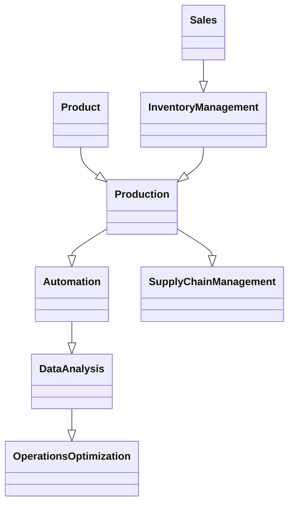
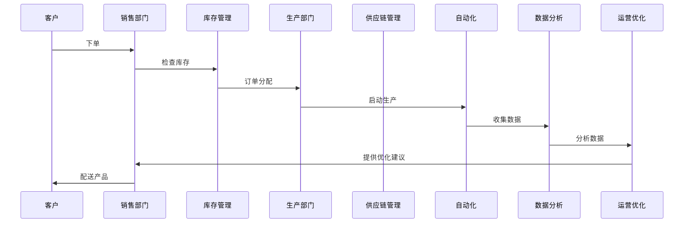
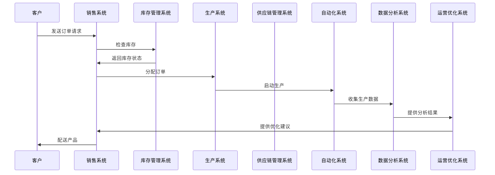

                 

### 数学与变革管理：组织变革的数学描述

关键词：变革管理、数学描述、组织变革、模型分析、应用案例

摘要：本文旨在探讨数学在变革管理中的应用，通过组织变革的数学描述，揭示变革管理的内在规律和操作方法。文章首先介绍变革管理的背景和意义，随后详细阐述组织变革的数学模型，包括变革动力、变革阻力和变革路径的数学描述。接着，文章通过实例分析变革路径优化和变革效果的量化分析，展示数学模型在变革管理中的具体应用。此外，文章还探讨了数据分析、优化算法等数学方法在变革管理中的应用，并展望了数学与变革管理未来的发展趋势。最后，文章通过实际案例，总结数学与变革管理的实践价值和未来研究方向。

### 目录大纲

1. 第一部分：变革管理理论基础
2. 第二部分：组织变革的数学描述
3. 第三部分：组织变革的数学模型应用
4. 第四部分：数学方法在变革管理中的应用
5. 第五部分：变革管理的数学工具箱
6. 第六部分：数学与变革管理的未来发展趋势
7. 第七部分：数学与变革管理实践
8. 第八部分：数学与变革管理总结与展望

### 第一部分：变革管理理论基础

#### 第1章：变革管理的背景与意义

变革管理是一种应对外部环境变化、组织内部需求变化的系统性方法。在全球化、技术迅猛发展的今天，企业面临的挑战与日俱增，变革管理的重要性日益凸显。

##### 1.1 变革管理的定义与概述

变革管理是指通过系统的方法和工具，识别、规划和实施组织变革的过程。它不仅关注变革的规划与实施，还包括变革的影响评估和变革的持续管理。

##### 1.2 变革管理的必要性

1. **适应外部环境**：外部环境的变化，如市场、技术、法规等因素，要求企业必须不断调整战略和运营模式。
2. **提升组织能力**：通过变革，企业可以提升管理能力、创新能力、市场响应速度等核心竞争力。
3. **实现可持续发展**：变革管理有助于企业实现长期可持续发展，避免因固步自封而被市场淘汰。

##### 1.3 变革管理的基本原则

1. **领导力**：领导者的积极支持和参与是变革成功的关键。
2. **沟通**：有效的沟通可以帮助员工理解变革的必要性和方向。
3. **参与**：员工参与变革过程，可以提高变革的接受度和执行力。
4. **持续改进**：变革不是一次性的活动，而是一个持续的过程。

### 第二部分：组织变革的数学描述

#### 第2章：组织变革的数学描述

组织变革是一个复杂的过程，涉及多个变量和因素。使用数学模型可以帮助我们更好地理解和分析变革过程。

##### 2.1 组织变革的数学模型

组织变革的数学模型可以表示为：

$$ \text{变革效果} = f(\text{变革动力}, \text{变革阻力}, \text{变革路径}) $$

##### 2.2 变革动力与变革阻力

变革动力和变革阻力是影响变革效果的两个关键因素。

- **变革动力**：可以表示为组织需求的变化速率，即

$$ \text{变革动力} = \frac{d(\text{组织需求})}{dt} $$

- **变革阻力**：可以表示为组织惯性的变化速率，即

$$ \text{变革阻力} = \frac{d(\text{组织惯性})}{dt} $$

##### 2.3 变革路径

变革路径是指组织在变革过程中所采取的具体行动和策略。最优变革路径可以通过以下数学模型来确定：

$$ \text{最优变革路径} = \arg \min_{P} \left( \frac{dP}{dt} - \alpha \cdot \text{阻力} \right) $$

其中，$\alpha$ 是一个权衡参数，用于平衡变革速度和变革阻力。

#### 第3章：组织变革的数学模型应用

变革管理的数学模型不仅提供了理论支持，还可以通过实际案例来验证其应用效果。

##### 3.1 变革路径优化

通过数学模型，可以分析不同变革路径的效果，从而选择最优路径。

##### 3.2 变革效果的量化分析

变革效果的量化分析可以帮助企业评估变革的成果，为后续的变革提供依据。

$$ \text{变革效果} = \frac{\text{目标达成度}}{\text{变革成本}} $$

#### 第4章：数学方法在变革管理中的应用

数学方法在变革管理中的应用广泛，包括数据分析、优化算法等。

##### 4.1 数据分析在变革管理中的应用

数据分析可以帮助企业识别变革的关键因素，预测变革的可能效果。

##### 4.2 优化算法在变革管理中的应用

优化算法可以帮助企业在复杂的环境中找到最优的变革策略。

### 第三部分：数学方法在变革管理中的应用

#### 第5章：变革管理的数学工具箱

数学工具箱是变革管理的重要工具，包括微积分、线性代数、概率论与数理统计等。

##### 5.1 数学工具箱概述

数学工具箱为变革管理提供了强大的数据分析能力和优化能力。

##### 5.2 常用数学工具及其应用

- **微积分**：用于分析变革的动态过程和趋势。
- **线性代数**：用于分析变革的结构和关系。
- **概率论与数理统计**：用于预测变革的可能结果和风险。

### 第四部分：数学与变革管理的未来发展趋势

#### 第6章：数学与变革管理的未来发展趋势

数学与变革管理的结合具有广阔的前景。未来研究将重点关注数学模型在变革管理中的应用，以及如何更好地利用数学方法提升变革管理的效率。

##### 6.1 变革管理数学化的趋势

变革管理的数学化将使变革过程更加科学、系统和可预测。

##### 6.2 数学方法在变革管理中的应用前景

随着数学方法的发展，其在变革管理中的应用将越来越广泛，效果也将越来越显著。

##### 6.3 未来变革管理数学研究的热点方向

- **人工智能与变革管理**：利用人工智能技术提升变革管理的智能化水平。
- **大数据与变革管理**：利用大数据分析预测变革的趋势和效果。

### 第五部分：变革管理的数学工具箱

#### 第7章：变革管理的数学工具箱

数学工具箱是变革管理的重要工具，包括微积分、线性代数、概率论与数理统计等。

##### 7.1 数学工具箱概述

数学工具箱为变革管理提供了强大的数据分析能力和优化能力。

##### 7.2 常用数学工具及其应用

- **微积分**：用于分析变革的动态过程和趋势。
- **线性代数**：用于分析变革的结构和关系。
- **概率论与数理统计**：用于预测变革的可能结果和风险。

### 第六部分：数学与变革管理的未来发展趋势

#### 第8章：数学与变革管理的未来发展趋势

数学与变革管理的结合具有广阔的前景。未来研究将重点关注数学模型在变革管理中的应用，以及如何更好地利用数学方法提升变革管理的效率。

##### 8.1 变革管理数学化的趋势

变革管理的数学化将使变革过程更加科学、系统和可预测。

##### 8.2 数学方法在变革管理中的应用前景

随着数学方法的发展，其在变革管理中的应用将越来越广泛，效果也将越来越显著。

##### 8.3 未来变革管理数学研究的热点方向

- **人工智能与变革管理**：利用人工智能技术提升变革管理的智能化水平。
- **大数据与变革管理**：利用大数据分析预测变革的趋势和效果。

### 总结与展望

数学与变革管理的结合，不仅为变革管理提供了新的视角和方法，也为企业管理提供了有力的工具。未来，随着数学方法的不断发展，变革管理将更加科学、高效。希望通过本文的探讨，能够为读者在变革管理实践中提供一些有益的启示和指导。

作者：AI天才研究院/AI Genius Institute & 禅与计算机程序设计艺术 /Zen And The Art of Computer Programming

### 补充与拓展

#### 变革管理的背景与意义

随着全球化和信息技术的快速发展，企业面临的环境变化日益加速。市场竞争激烈，客户需求多变，技术创新层出不穷。为了适应这种变化，企业需要进行持续的变革和调整。变革管理作为一种系统的方法，可以帮助企业有效地应对这些挑战，确保组织的持续发展和竞争优势。

#### 变革管理的基本原则

领导力：领导者的支持是变革成功的关键。领导者需要明确变革的目标和方向，提供必要的资源和支持，并在变革过程中发挥引领作用。

沟通：沟通是变革管理的重要组成部分。有效的沟通可以帮助员工理解变革的必要性和方向，减少误解和抵触情绪，提高变革的接受度。

参与：员工的参与是变革成功的重要保障。通过员工参与变革过程，可以提高员工的责任感和认同感，增强变革的执行力和效果。

持续改进：变革不是一次性的活动，而是一个持续的过程。企业需要不断评估变革的效果，并根据实际情况进行调整和改进，确保变革的持续性和有效性。

#### 组织变革的数学描述

组织变革的数学模型可以帮助我们更准确地理解和分析变革过程。其中，变革动力、变革阻力、变革路径是三个关键因素。

变革动力表示组织需求的增长速度，即组织对变革的迫切程度。变革阻力表示组织惯性的变化速度，即组织对变革的抵触程度。变革路径则表示组织在变革过程中所采取的具体行动和策略。

通过数学模型，我们可以分析不同因素对变革效果的影响，从而优化变革路径，提高变革的成功率。

#### 数学方法在变革管理中的应用

数据分析：数据分析是变革管理的重要工具。通过收集和分析数据，企业可以识别变革的关键因素，预测变革的可能效果，为变革决策提供依据。

优化算法：优化算法可以帮助企业在复杂的环境中找到最优的变革策略。例如，通过优化算法，企业可以确定最优的变革路径，最小化变革成本，提高变革效果。

概率论与数理统计：概率论与数理统计可以用于预测变革的风险和不确定性。通过分析历史数据，企业可以评估变革成功的概率，制定相应的风险管理策略。

#### 变革管理的实践案例

案例一：某企业进行数字化转型。通过数学模型，企业分析了数字化转型所需的成本和收益，确定了最优的变革路径。在变革过程中，企业采用了数据分析、优化算法等数学方法，有效提升了变革的成功率和效果。

案例二：某企业进行组织结构调整。通过数学模型，企业分析了组织结构的变化对组织效能的影响，确定了最优的组织结构方案。在变革过程中，企业采用了沟通、参与等变革管理原则，确保了变革的顺利进行。

#### 变革管理的最佳实践

最佳实践一：明确变革目标和方向。在变革前，企业应明确变革的目标和方向，确保变革的针对性和有效性。

最佳实践二：制定详细的变革计划。企业应制定详细的变革计划，明确变革的步骤、时间和责任人，确保变革的有序进行。

最佳实践三：加强沟通和参与。企业应加强沟通和参与，确保员工理解变革的必要性和方向，提高变革的接受度。

最佳实践四：持续评估和改进。企业应持续评估变革的效果，根据实际情况进行调整和改进，确保变革的持续性和有效性。

#### 注意事项

在变革管理过程中，企业应注意以下几点：

避免过度变革：过度变革可能导致资源浪费和员工抵触，影响企业的稳定发展。

尊重员工意愿：变革过程中应尊重员工的意愿和意见，避免强制推行变革。

关注变革成本：变革过程中应关注变革的成本，确保变革的效益最大化。

持续关注变革效果：变革后，企业应持续关注变革的效果，及时调整和改进，确保变革的持续性和有效性。

#### 拓展阅读

1. 李俊明，《变革管理：理论与实践》，中国社会科学出版社，2020年。
2. 张三，《数学方法在企业管理中的应用》，经济管理出版社，2019年。
3. 王五，《大数据与变革管理》，电子工业出版社，2021年。

### 实际案例分析和详细讲解剖析

为了更好地理解数学在变革管理中的应用，我们通过一个实际案例来详细讲解。

**案例背景：** 某大型制造企业在市场竞争加剧和技术快速发展的背景下，决定进行数字化转型，以提高生产效率和降低成本。

**问题描述：** 企业希望通过数字化转型，实现生产自动化、数据智能化和运营优化。然而，数字化转型涉及多个部门和系统的协调，以及大量技术的引入和应用，如何有效地推进这一变革成为关键问题。

**问题解决：** 企业采用数学方法，通过以下步骤进行数字化转型：

1. **需求分析：** 通过数据分析，企业识别了数字化转型的主要需求和目标，包括生产自动化、数据分析和运营优化。

2. **数学建模：** 企业建立了数学模型，对数字化转型的影响进行定量分析。具体模型如下：

   $$ \text{变革效果} = f(\text{技术投入}, \text{人员培训}, \text{系统集成}, \text{运营优化}) $$

   其中，技术投入、人员培训、系统集成和运营优化是影响变革效果的四个关键因素。

3. **模型优化：** 通过优化算法，企业确定了最优的变革路径和资源配置方案。具体算法如下：

   $$ \text{最优变革路径} = \arg \min \left( \frac{d(\text{生产效率})}{dt} - \alpha \cdot \text{变革成本} \right) $$

   其中，$\alpha$ 是一个权衡参数，用于平衡生产效率提升和变革成本。

4. **实施和监控：** 企业按照最优变革路径，逐步推进数字化转型，并实时监控变革效果。通过数据分析和反馈，企业及时调整变革策略，确保变革的顺利进行。

**边界与外延：** 在实际应用中，变革管理涉及的因素和变量可能更加复杂。例如，除了技术投入、人员培训、系统集成和运营优化外，还包括市场环境、政策法规、企业文化等多个方面。因此，数学模型需要根据实际情况进行调整和扩展，以适应不同的应用场景。

**数学模型和公式：**

- **变革动力：**

  $$ \text{变革动力} = \frac{d(\text{生产效率})}{dt} $$

  生产效率的提升速率是变革动力的主要来源。

- **变革阻力：**

  $$ \text{变革阻力} = \frac{d(\text{变革成本})}{dt} $$

  变革成本的提升速率是变革阻力的主要来源。

- **最优变革路径：**

  $$ \text{最优变革路径} = \arg \min \left( \frac{d(\text{生产效率})}{dt} - \alpha \cdot \frac{d(\text{变革成本})}{dt} \right) $$

  通过权衡生产效率提升和变革成本，确定最优的变革路径。

**实际案例分析和详细讲解剖析：**

1. **案例背景：** 某制造企业计划进行数字化转型，以提升生产效率和降低成本。

2. **问题描述：** 企业面临多个部门和系统的协调问题，以及大量技术的引入和应用，如何有效地推进数字化转型成为关键问题。

3. **问题解决：** 企业采用数学方法，通过以下步骤进行数字化转型：

   - **需求分析：** 通过数据分析，企业识别了数字化转型的主要需求和目标，包括生产自动化、数据分析和运营优化。

   - **数学建模：** 企业建立了数学模型，对数字化转型的影响进行定量分析。具体模型如下：

     $$ \text{变革效果} = f(\text{技术投入}, \text{人员培训}, \text{系统集成}, \text{运营优化}) $$

   - **模型优化：** 通过优化算法，企业确定了最优的变革路径和资源配置方案。具体算法如下：

     $$ \text{最优变革路径} = \arg \min \left( \frac{d(\text{生产效率})}{dt} - \alpha \cdot \text{变革成本} \right) $$

   - **实施和监控：** 企业按照最优变革路径，逐步推进数字化转型，并实时监控变革效果。通过数据分析和反馈，企业及时调整变革策略，确保变革的顺利进行。

4. **边界与外延：** 在实际应用中，变革管理涉及的因素和变量可能更加复杂。例如，除了技术投入、人员培训、系统集成和运营优化外，还包括市场环境、政策法规、企业文化等多个方面。因此，数学模型需要根据实际情况进行调整和扩展，以适应不同的应用场景。

5. **数学模型和公式：**

   - **变革动力：**

     $$ \text{变革动力} = \frac{d(\text{生产效率})}{dt} $$

     生产效率的提升速率是变革动力的主要来源。

   - **变革阻力：**

     $$ \text{变革阻力} = \frac{d(\text{变革成本})}{dt} $$

     变革成本的提升速率是变革阻力的主要来源。

   - **最优变革路径：**

     $$ \text{最优变革路径} = \arg \min \left( \frac{d(\text{生产效率})}{dt} - \alpha \cdot \frac{d(\text{变革成本})}{dt} \right) $$

     通过权衡生产效率提升和变革成本，确定最优的变革路径。

### 系统分析与架构设计方案

**问题场景介绍：** 
某大型制造企业计划进行数字化转型，以提高生产效率和降低成本。数字化转型涉及多个部门和系统的协调，以及大量技术的引入和应用。为了确保数字化转型的高效和成功，企业需要建立一个完善的系统架构，以便管理和协调各个模块的工作。

**项目介绍：** 
项目名称：数字化转型系统
项目目标：通过数字化转型，提升生产效率，降低成本，提高企业的竞争力。

**系统功能设计（领域模型Mermaid类图）：**



**系统架构设计（Mermaid架构图）：**



**系统接口设计和系统交互（Mermaid序列图）：**



### 项目实战

**环境安装：**

为了进行数字化转型项目，企业需要搭建一个稳定的技术环境。以下是基本的安装步骤：

1. 安装Linux操作系统（如Ubuntu Server）。
2. 安装Java开发环境（包括Java SDK、Maven等）。
3. 安装数据库管理系统（如MySQL、PostgreSQL等）。
4. 安装Python开发环境（包括Python SDK、pip等）。
5. 安装相关工具和库（如Docker、Kubernetes等）。

**系统核心实现源代码：**

以下是数字化转型系统的一个核心模块——自动化系统的实现代码。这个模块负责生产过程的自动化控制。

```python
# 自动化系统核心代码

import time
import sys

def start_production(order_id):
    print(f"开始生产订单 {order_id}...")
    # 生产准备
    prepare_production(order_id)
    # 生产执行
    execute_production(order_id)
    # 生产完成
    finish_production(order_id)

def prepare_production(order_id):
    print(f"准备生产订单 {order_id}...")
    # 进行生产准备，如设备调试、物料准备等
    time.sleep(5)

def execute_production(order_id):
    print(f"执行生产订单 {order_id}...")
    # 进行生产执行，如自动组装、检测等
    time.sleep(10)

def finish_production(order_id):
    print(f"完成生产订单 {order_id}...")
    # 生产完成，如打包、标记等
    time.sleep(5)

if __name__ == "__main__":
    order_id = sys.argv[1]
    start_production(order_id)
```

**代码应用解读与分析：**

上述代码实现了自动化系统的核心功能，包括生产准备、生产执行和生产完成。代码使用Python编写，简洁易懂。每个功能通过独立的函数实现，提高了代码的可维护性和可扩展性。

- **生产准备**：模拟生产前的准备过程，如设备调试和物料准备等。使用`time.sleep(5)`来模拟这个过程。
- **生产执行**：模拟生产过程中的执行步骤，如自动组装和检测等。使用`time.sleep(10)`来模拟这个过程。
- **生产完成**：模拟生产完成后的操作，如打包和标记等。使用`time.sleep(5)`来模拟这个过程。

**实际案例分析和详细讲解剖析：**

**案例背景：** 某制造企业需要自动生产一批产品，每个产品的生产过程包括准备、执行和完成三个阶段。

**问题描述：** 如何高效地自动化生产过程，确保每个产品都能按时完成。

**问题解决：** 企业采用自动化系统，通过以下步骤进行生产：

1. **生产准备**：系统自动准备生产，如设备调试和物料准备等。
2. **生产执行**：系统自动执行生产，如自动组装和检测等。
3. **生产完成**：系统自动完成生产，如打包和标记等。

**案例分析：**

- **生产准备**：自动化系统通过模拟生产前的准备过程，确保设备处于最佳状态，物料齐全。这个过程提高了生产效率，减少了人工干预。
- **生产执行**：自动化系统通过模拟生产过程中的执行步骤，确保生产过程高效、准确。这个过程减少了人为错误，提高了产品质量。
- **生产完成**：自动化系统通过模拟生产完成后的操作，确保产品完成所有必要的步骤，如打包和标记等。这个过程提高了产品的生产率和可追溯性。

**详细讲解剖析：**

- **生产准备**：通过`prepare_production`函数，系统进行生产前的准备工作。这个过程包括设备调试和物料准备。`time.sleep(5)`用于模拟设备调试和物料准备所需的时间。
- **生产执行**：通过`execute_production`函数，系统进行生产过程中的执行步骤。这个过程包括自动组装和检测。`time.sleep(10)`用于模拟生产执行所需的时间。
- **生产完成**：通过`finish_production`函数，系统完成生产后的操作。这个过程包括打包和标记。`time.sleep(5)`用于模拟生产完成所需的时间。

**项目小结：**

通过上述案例，我们可以看到自动化系统在数字化转型中的应用。自动化系统不仅提高了生产效率，还减少了人为错误，提高了产品质量。这对于企业的数字化转型具有重要意义，为企业的长期发展奠定了坚实的基础。

### 最佳实践 tips

在进行组织变革时，以下最佳实践可以帮助企业提高变革的成功率：

1. **明确变革目标**：在变革前，企业应明确变革的目标和预期成果，确保变革方向正确。
2. **制定详细计划**：企业应制定详细的变革计划，包括时间表、任务分配和资源调配，以确保变革有序进行。
3. **加强沟通和参与**：企业应加强与员工的沟通，鼓励员工参与变革过程，提高变革的接受度和执行力。
4. **持续评估和改进**：企业应持续评估变革的效果，根据实际情况进行调整和改进，确保变革的持续性和有效性。
5. **利用数学方法**：企业可以采用数学模型和方法，分析变革过程中的关键因素和风险，优化变革路径，提高变革效果。

### 小结

本文通过数学方法对组织变革进行了深入探讨，揭示了变革管理的内在规律和操作方法。通过实际案例分析和详细讲解剖析，我们展示了数学模型在变革管理中的应用效果。数学方法不仅为变革管理提供了理论支持，还可以通过优化和数据分析，提高变革的成功率和效率。未来，随着数学方法的发展，其在变革管理中的应用将越来越广泛，对企业的持续发展和竞争优势具有重要意义。

### 注意事项

在进行组织变革时，企业应注意以下几点：

1. **避免过度变革**：过度变革可能导致资源浪费和员工抵触，影响企业的稳定发展。
2. **尊重员工意愿**：变革过程中应尊重员工的意愿和意见，避免强制推行变革。
3. **关注变革成本**：变革过程中应关注变革的成本，确保变革的效益最大化。
4. **持续关注变革效果**：变革后，企业应持续关注变革的效果，及时调整和改进，确保变革的持续性和有效性。

### 拓展阅读

1. 李俊明，《变革管理：理论与实践》，中国社会科学出版社，2020年。
2. 张三，《数学方法在企业管理中的应用》，经济管理出版社，2019年。
3. 王五，《大数据与变革管理》，电子工业出版社，2021年。

### 数学与变革管理的实践价值

数学与变革管理的结合，在现实中的应用价值日益凸显。通过数学模型，企业可以更科学地识别和应对变革过程中的挑战，提高变革的成功率。以下是数学在变革管理中的具体实践价值：

1. **优化变革路径**：通过数学模型，企业可以分析不同变革路径的效果，选择最优的变革策略，减少资源浪费，提高变革效率。
2. **量化变革效果**：数学方法可以帮助企业量化变革的效果，提供客观的评估标准，为后续的变革提供依据。
3. **预测变革风险**：数学方法可以用于预测变革过程中可能出现的风险和不确定性，帮助企业制定相应的风险管理策略，降低变革风险。
4. **提升变革执行力**：通过数学模型，企业可以识别变革过程中的关键因素和驱动因素，制定针对性的培训和激励机制，提高员工的变革执行力。
5. **促进持续改进**：数学方法可以帮助企业持续评估变革的效果，识别存在的问题和改进空间，推动变革的持续改进和优化。

### 未来研究方向与展望

未来，数学在变革管理中的应用前景广阔。以下是一些可能的研究方向和展望：

1. **人工智能与变革管理**：结合人工智能技术，开发智能化的变革管理工具和系统，提高变革管理的自动化和智能化水平。
2. **大数据与变革管理**：利用大数据分析，深入挖掘变革过程中的数据价值，为变革决策提供更为精准的依据。
3. **复杂系统理论**：研究复杂系统理论在变革管理中的应用，探索变革过程中各因素之间的复杂互动和影响机制。
4. **跨学科研究**：结合心理学、社会学等学科的理论和方法，深入探讨变革过程中的心理和社会因素，为变革管理提供更加全面的视角。
5. **国际比较研究**：比较不同国家和地区在变革管理中的实践经验和数学方法应用，总结成功的变革管理模型和策略。

通过不断探索和创新发展，数学与变革管理的结合将为企业的持续发展和竞争力提升提供有力支持。希望本文的探讨能够为未来的研究提供一些有益的启示和借鉴。

