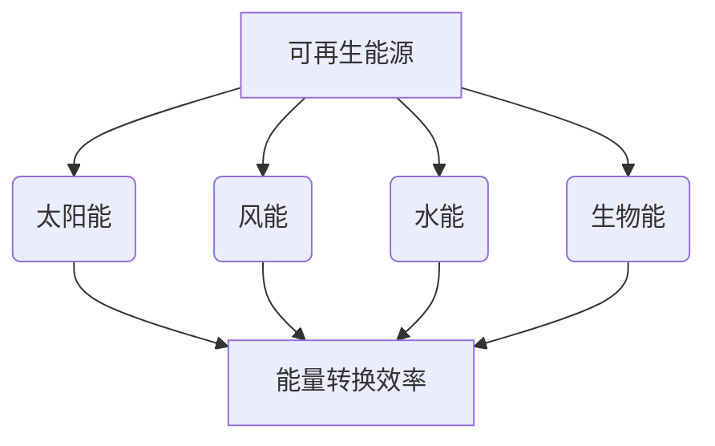
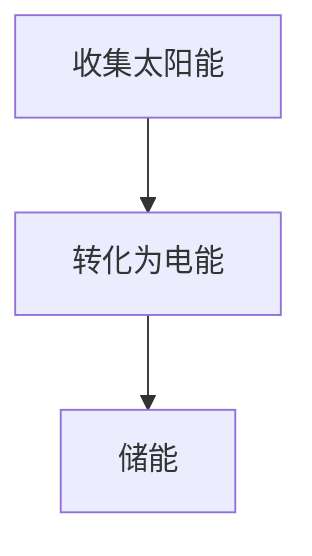
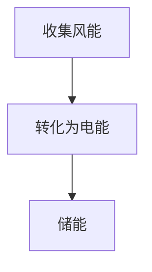
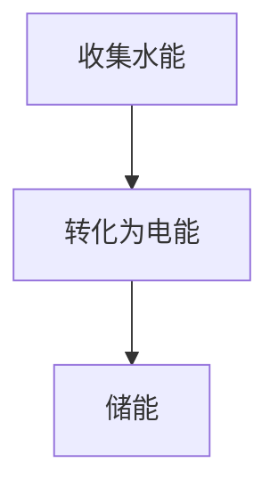
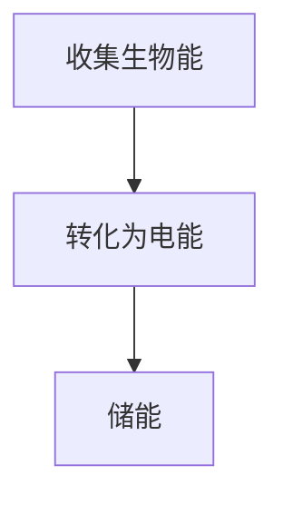
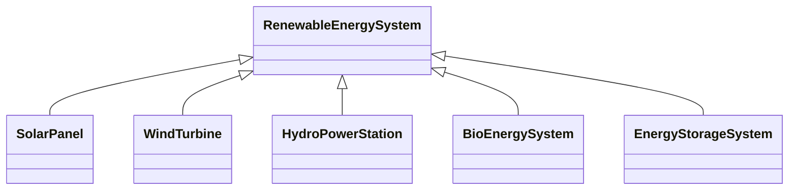
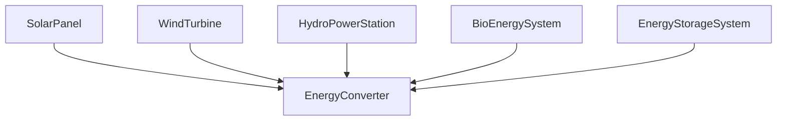
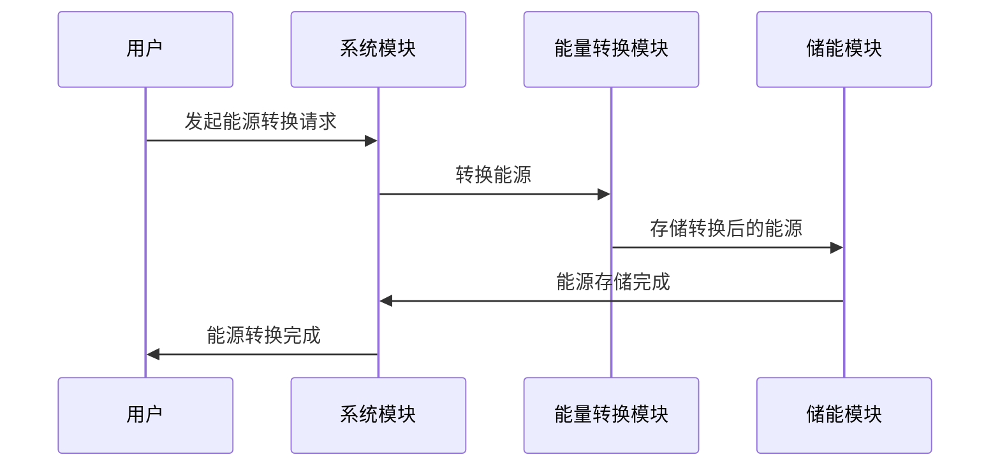

                 


## 数学与可再生能源：可再生能源利用的数学模型

### 关键词：
- 数学模型
- 可再生能源
- 太阳能
- 风能
- 优化算法

### 摘要：
本文将探讨数学模型在可再生能源领域中的应用，重点分析太阳能、风能和水能等可再生能源的数学模型，以及如何通过优化算法提升可再生能源的利用效率。文章旨在为读者提供一个清晰、易懂的指南，帮助理解可再生能源利用中的数学原理和方法。

## 第一部分：背景介绍

### 第1章：可再生能源概述

#### 1.1 可再生能源的定义与类型

可再生能源是指在人类时间尺度内不会枯竭或可以持续利用的能源，主要包括太阳能、风能、水能和生物能。这些能源具有环保、可再生、分布广泛等优点，越来越受到全球的关注。

#### 1.2 可再生能源的重要性

可再生能源不仅有助于减少温室气体排放，缓解气候变化，还能提高能源安全，减少对化石燃料的依赖。随着技术进步和成本降低，可再生能源正在逐渐成为全球能源结构中的重要组成部分。

#### 1.3 全球可再生能源现状

全球可再生能源的发展迅速，各国纷纷制定可再生能源发展目标。太阳能和风能已经成为最具竞争力的可再生能源技术，而水能和生物能也在不断发展壮大。

### 第2章：数学模型的基础知识

#### 2.1 数学模型的基本概念

数学模型是用数学语言描述现实世界问题的一种工具，通过建立数学方程或公式来模拟和预测实际现象。数学模型在科学研究和工程应用中具有重要意义。

#### 2.2 常用的数学工具

在可再生能源领域，常用的数学工具有微积分、线性代数、概率论和数理统计等。这些工具帮助研究者分析能源系统中的动态行为和不确定性。

#### 2.3 数学模型的应用领域

数学模型广泛应用于能源系统的优化、预测、控制和管理。在可再生能源领域，数学模型有助于提高能源效率、降低成本、预测能源需求和优化能源配置。

### 第3章：可再生能源利用的挑战与机遇

#### 3.1 挑战分析

可再生能源利用面临诸多挑战，如能源波动、储存难题、电网兼容性和成本高等。这些挑战限制了可再生能源的大规模应用。

#### 3.2 机遇探讨

随着技术的进步和政策支持，可再生能源利用面临前所未有的机遇。优化算法和智能电网技术的发展为解决这些挑战提供了新的思路。

### 第4章：可再生能源的数学模型

#### 4.1 太阳能利用的数学模型

太阳能利用的数学模型主要关注太阳能转化为电能的过程，包括能量转换效率、太阳能电池性能预测和储能系统优化等方面。

#### 4.2 风能利用的数学模型

风能利用的数学模型涉及风力发电机的优化设计、风能资源评估和风能发电系统优化等。这些模型有助于提高风能利用效率和降低成本。

#### 4.3 水能利用的数学模型

水能利用的数学模型主要研究水电站的运行优化、水资源调配和防洪减灾等方面。这些模型有助于实现水能资源的最大化利用。

#### 4.4 生物能利用的数学模型

生物能利用的数学模型涉及生物质能源的生产、转化和利用过程。这些模型有助于优化生物质能源的生产和降低成本。

### 第5章：数学模型在可再生能源系统优化中的应用

#### 5.1 系统优化目标

可再生能源系统优化旨在提高能源效率、降低成本和减少环境影响。系统优化目标包括能源生产最大化、能源消耗最小化和环境污染最小化等。

#### 5.2 优化算法

优化算法在可再生能源系统中起着关键作用。常见的优化算法有线性规划、非线性规划、遗传算法、粒子群优化算法等。这些算法有助于找到系统优化的最佳方案。

#### 5.3 优化案例分析

通过实际案例分析，本文将展示如何使用优化算法解决可再生能源系统中的具体问题，如太阳能电池板安装位置优化、风能发电系统调度优化等。

## 第二部分：核心概念与联系

### 第6章：核心概念原理

可再生能源与数学模型是本文的核心概念。本章节将详细介绍这两个概念的基本原理，包括可再生能源的定义、类型和特性，以及数学模型的概念、类型和应用。

### 第7章：概念属性特征对比

#### 7.1 不同可再生能源特性对比

表1 不同可再生能源特性对比

| 可再生能源 | 特性 |
| --- | --- |
| 太阳能 | 分布广泛、清洁、高效 |
| 风能 | 可再生、灵活、高效 |
| 水能 | 可持续、稳定、高效 |
| 生物能 | 可再生、环保、多样化 |

#### 7.2 数学模型特性对比

表2 数学模型特性对比

| 数学模型 | 特性 |
| --- | --- |
| 线性模型 | 简单、易解、适用于线性问题 |
| 非线性模型 | 复杂、准确、适用于非线性问题 |
| 遗传算法 | 搜索能力强、适用于大规模优化问题 |
| 粒子群优化算法 | 简单、高效、适用于复杂优化问题 |

### 第8章：ER实体关系图架构

图1 ER实体关系图架构



## 第三部分：算法原理讲解

### 第9章：太阳能利用的算法原理

#### 9.1 算法流程图

图2 太阳能利用算法流程图



#### 9.2 Python源代码实现

```python
# Python代码示例：太阳能转化为电能
def convert_solar_to_electric(solar_energy):
    electric_energy = solar_energy * conversion_factor
    return electric_energy

solar_energy = 1000  # 假设收集到1000单位的太阳能
electric_energy = convert_solar_to_electric(solar_energy)
print(f"转化后的电能为：{electric_energy}")
```

#### 9.3 数学模型和公式

$$
\text{electric\_energy} = \text{solar\_energy} \times \text{conversion\_factor}
$$

#### 9.4 举例说明

假设太阳能转化效率为20%，则1000单位的太阳能将转化为200单位的电能。

### 第10章：风能利用的算法原理

#### 10.1 算法流程图

图3 风能利用算法流程图



#### 10.2 Python源代码实现

```python
# Python代码示例：风能转化为电能
def convert_wind_to_electric(wind_energy):
    electric_energy = wind_energy * conversion_factor
    return electric_energy

wind_energy = 1000  # 假设收集到1000单位的风能
electric_energy = convert_wind_to_electric(wind_energy)
print(f"转化后的电能为：{electric_energy}")
```

#### 10.3 数学模型和公式

$$
\text{electric\_energy} = \text{wind\_energy} \times \text{conversion\_factor}
$$

#### 10.4 举例说明

假设风能转化效率为40%，则1000单位的风能将转化为400单位的电能。

### 第11章：水能利用的算法原理

#### 11.1 算法流程图

图4 水能利用算法流程图



#### 11.2 Python源代码实现

```python
# Python代码示例：水能转化为电能
def convert_water_to_electric(water_energy):
    electric_energy = water_energy * conversion_factor
    return electric_energy

water_energy = 1000  # 假设收集到1000单位的水能
electric_energy = convert_water_to_electric(water_energy)
print(f"转化后的电能为：{electric_energy}")
```

#### 11.3 数学模型和公式

$$
\text{electric\_energy} = \text{water\_energy} \times \text{conversion\_factor}
$$

#### 11.4 举例说明

假设水能转化效率为60%，则1000单位的水能将转化为600单位的电能。

### 第12章：生物能利用的算法原理

#### 12.1 算法流程图

图5 生物能利用算法流程图



#### 12.2 Python源代码实现

```python
# Python代码示例：生物能转化为电能
def convert_bio_to_electric(bio_energy):
    electric_energy = bio_energy * conversion_factor
    return electric_energy

bio_energy = 1000  # 假设收集到1000单位的生物能
electric_energy = convert_bio_to_electric(bio_energy)
print(f"转化后的电能为：{electric_energy}")
```

#### 12.3 数学模型和公式

$$
\text{electric\_energy} = \text{bio\_energy} \times \text{conversion\_factor}
$$

#### 12.4 举例说明

假设生物能转化效率为50%，则1000单位的生物能将转化为500单位的电能。

## 第四部分：系统分析与架构设计

### 第13章：系统功能设计与架构设计

#### 13.1 问题场景介绍

介绍可再生能源系统的应用场景，如家庭光伏电站、风力发电场等。

#### 13.2 系统功能设计

使用Mermaid类图展示系统的功能模块及其关系。



#### 13.3 系统架构设计

使用Mermaid架构图展示系统的整体架构。



#### 13.4 系统接口设计和系统交互

使用Mermaid序列图展示系统的接口设计和系统交互。



## 第五部分：项目实战

### 第14章：环境安装与系统核心实现

#### 14.1 环境安装

介绍可再生能源系统开发所需的环境安装，包括Python、NumPy、Matplotlib等。

#### 14.2 系统核心实现

展示系统核心功能的实现代码，包括太阳能、风能、水能和生物能的转换算法实现。

```python
# 示例：太阳能转换算法实现
def solar_energy_conversion(solar_energy, conversion_factor):
    electric_energy = solar_energy * conversion_factor
    return electric_energy
```

#### 14.3 代码应用解读与分析

对实现的代码进行解读和分析，解释代码的功能和实现原理。

### 第15章：实际案例分析与详细讲解

#### 15.1 案例背景

介绍一个实际的太阳能光伏电站案例，包括地理位置、装机容量和能源消耗等。

#### 15.2 案例分析

使用数学模型和优化算法分析案例中的能源转换效率和储能优化。

#### 15.3 详细讲解

详细讲解案例中使用的数学模型、优化算法和实现步骤。

### 第16章：项目小结

总结项目的主要成果，包括算法实现、性能分析和实际应用。

### 第17章：最佳实践与拓展阅读

#### 17.1 最佳实践

分享可再生能源系统开发的最佳实践，包括设计原则、性能优化和安全性保障。

#### 17.2 拓展阅读

推荐相关的拓展阅读材料，包括学术研究论文、技术报告和行业指南等。

## 作者信息

作者：AI天才研究院/AI Genius Institute & 禅与计算机程序设计艺术 /Zen And The Art of Computer Programming

---

以上是文章的整体大纲和部分内容，接下来将逐步完善每个章节的详细内容。如有需要修改或补充的地方，请告知。同时，请确认文章的关键字和摘要是否符合要求。接下来，我将开始撰写每个章节的具体内容。让我们一步步深入探讨数学与可再生能源的奥秘。

