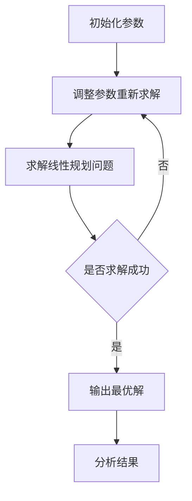
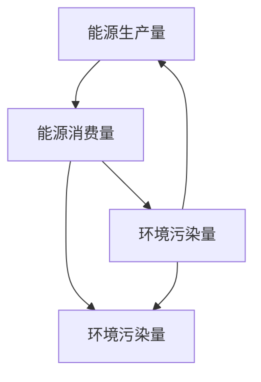
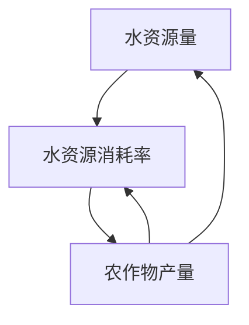
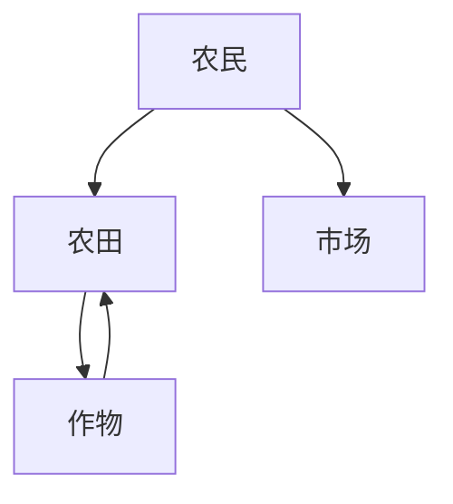
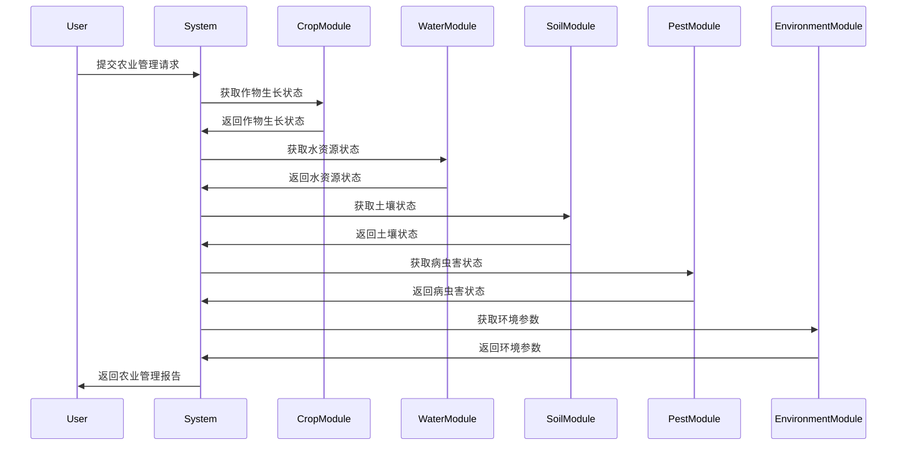
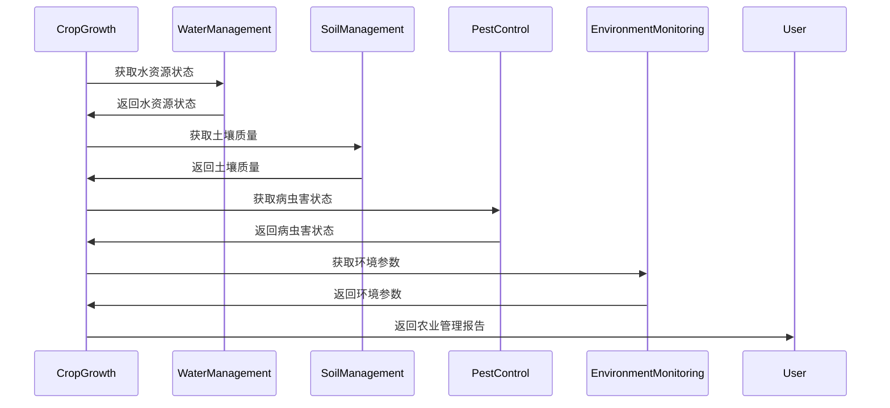

                 

### 文章标题

### 关键词

- 可持续发展
- 数学建模
- 系统动态模型
- 优化方法
- 数据科学

### 摘要

本文旨在探讨数学在可持续发展领域中的应用，特别是数学建模对于构建可持续系统的重要性。通过系统分析可持续发展的概念、数学建模的核心原理和技术方法，本文将揭示数学建模如何帮助我们理解并解决全球面临的生态、经济和社会挑战。文章将分为五个主要部分：背景介绍、核心概念和原理、建模技术、分析和应用、未来趋势与挑战，全面阐述数学与可持续发展的关系及其潜在影响。希望通过本文，读者能够更好地理解数学建模在推动可持续发展中的关键作用，并为其提供实际指导。

## 引言

### 1.1 可持续发展的背景

可持续发展（Sustainable Development）是20世纪80年代中期以来国际社会提出的全新发展理念。它强调在满足当代人需求的同时，不损害后代人满足其需求的能力。这一概念最早由1987年联合国的《我们共同的未来》报告（又称布伦特兰报告）正式提出，报告指出：“可持续发展是既满足当代人的需要，又不对子孙后代满足其需要的能力构成危害的发展。”

可持续发展的背景可以追溯到人类文明的发展历程。在工业革命之前，人类主要以农业为主，对自然资源的依赖性较强。然而，随着工业化的推进，特别是20世纪中叶以来的快速发展，资源消耗和环境破坏问题日益突出。过度开采自然资源、环境污染、生物多样性减少等问题不仅威胁到地球的生态平衡，也直接影响到人类的生存和发展。鉴于此，国际社会逐渐意识到，需要转变传统的增长模式，寻求一种既能促进经济发展，又能保护环境、实现资源可持续利用的新路径，即可持续发展。

可持续发展的核心目标是实现经济、社会和环境的协调发展。具体而言，它涉及以下几个方面：

1. **经济发展**：在可持续发展框架下，经济发展不再是单纯追求GDP的增长，而是更加注重质量，强调经济增长与社会进步、环境保护相协调。可持续发展要求经济发展模式从依赖资源和能源的消耗型向依赖知识和技术创新型转变，提高资源的利用效率，实现经济效益的最大化。

2. **社会进步**：可持续发展强调社会公平和人的全面发展。这包括改善教育、就业、医疗和社会保障等公共服务，消除贫困和不平等，确保所有人都能享受到经济发展的成果。

3. **环境保护**：环境保护是可持续发展的基石。它要求人类在开发资源、利用能源的过程中，必须考虑到生态系统的承载能力和恢复能力，采取有效的措施减少污染、保护生物多样性，维持生态平衡。

### 1.2 可持续发展的挑战与目标

尽管可持续发展理念已被广泛接受，但其实施过程中仍面临诸多挑战。以下是其中几个主要挑战：

1. **资源短缺**：随着全球人口的增长和经济的发展，资源需求不断增加，而自然资源的供给却相对有限。特别是在水资源、能源和矿产资源方面，过度开发和浪费现象严重，导致资源短缺问题日益突出。

2. **环境污染**：工业化和城市化进程的加快，导致了大量污染物排放，包括二氧化碳、氮氧化物、硫氧化物等，严重污染了大气、水体和土壤。环境污染不仅威胁到生态系统的健康，也对人类健康产生负面影响。

3. **生态破坏**：过度开发、过度捕捞、森林砍伐等活动破坏了生态系统的稳定性和多样性，导致土地退化、沙漠化、物种灭绝等问题。生态破坏不仅影响了生物多样性，也削弱了生态系统的恢复能力。

4. **社会不平等**：尽管经济发展带来了财富的积累，但资源分配不均、贫富差距扩大等问题仍然存在。社会不平等不仅影响了社会的和谐与稳定，也限制了可持续发展的实现。

面对这些挑战，可持续发展设定了一系列目标，旨在推动全球范围内的可持续发展。以下是其中的几个关键目标：

1. **消除贫困**：通过改善教育、就业、医疗和社会保障等公共服务，提高贫困人口的生活水平，实现社会公平。

2. **保护环境和生态系统**：采取有效的环境保护措施，减少污染物排放，保护生物多样性，维持生态平衡。

3. **促进可持续的经济增长**：通过技术创新和制度改革，实现经济增长与环境保护的协调发展，提高资源利用效率。

4. **推动社会进步**：改善教育、医疗和社会保障等公共服务，提高人民生活质量，促进社会公平与和谐。

### 1.3 数学在可持续发展中的作用

数学作为一种科学工具，在可持续发展中发挥着至关重要的作用。通过数学建模，我们可以更准确地理解和预测环境、经济和社会系统中的复杂关系，为决策提供科学依据。

首先，数学建模能够帮助我们分析可持续系统中的各种变量和关系。例如，通过系统动力学模型（System Dynamics Model）和-agent-based模型（Agent-Based Model），我们可以模拟生态、经济和社会系统的动态行为，揭示其内在机制和规律。这些模型不仅能够帮助我们理解现状，还可以预测未来的发展趋势，从而为政策制定提供科学依据。

其次，数学优化方法在可持续发展中的应用也非常广泛。通过优化模型，我们可以找到最有效的资源利用方式和环境保护措施，实现经济效益和生态效益的最大化。例如，在能源系统中，通过优化能源配置和能源利用效率，可以实现能源消耗的最小化和环境保护的最大化。

此外，数学在数据分析和处理方面也有重要作用。随着大数据和人工智能技术的发展，我们可以利用数学模型对大量数据进行挖掘和分析，发现隐藏在数据背后的规律和趋势，为可持续发展提供更有针对性的解决方案。

总之，数学作为一种科学工具，不仅能够帮助我们更深入地理解可持续系统的复杂关系，还可以提供有效的决策支持和解决方案，从而在推动可持续发展的过程中发挥重要作用。

### 1.4 总结

综上所述，可持续发展是应对全球性挑战的必由之路。它不仅关系到当前人类的生活质量和未来世代的生存环境，也涉及到全球经济和社会的可持续发展。然而，实现可持续发展面临着资源短缺、环境污染、生态破坏和社会不平等等一系列严峻挑战。数学作为一种科学工具，通过数学建模、优化方法和数据分析，在理解和解决这些挑战中发挥着关键作用。未来，随着人工智能和大数据技术的发展，数学在可持续发展中的应用将更加广泛和深入，为推动全球可持续发展提供更强有力的支持。

## 数学建模的核心概念与原理

### 2.1 基本数学概念

在探讨数学建模在可持续发展中的应用之前，首先需要理解一些基本的数学概念。数学建模是利用数学工具和语言来描述和解决实际问题的过程。基本数学概念包括代数、几何、微积分、概率论等，这些概念构成了数学建模的基础。

**代数**：代数主要研究数和代数结构之间的关系，包括线性方程组、多项式、矩阵等。在数学建模中，代数用于描述系统中的变量关系和约束条件。

**几何**：几何研究空间中的形状、大小和位置关系。在数学建模中，几何常用于描述系统中的空间分布和结构。

**微积分**：微积分研究函数的变化率和积分，包括微分方程、导数和积分等。微积分在数学建模中用于描述系统的动态变化和趋势。

**概率论**：概率论研究随机事件的发生概率和分布规律。在数学建模中，概率论用于描述系统中的不确定性和风险。

### 2.2 数学在可持续发展中的应用

数学不仅在理论研究中起着关键作用，在可持续发展中也具有广泛的应用。以下是一些数学在可持续发展中的应用领域：

**系统动力学模型**：系统动力学模型是一种基于微分方程和差分方程的数学模型，用于描述复杂系统的动态行为。这种模型可以帮助我们理解可持续发展系统中各要素之间的相互作用和反馈机制。例如，在农业系统中，可以通过系统动力学模型模拟气候变化、水资源利用和粮食生产之间的关系，为农业可持续发展提供决策支持。

**生态模型**：生态模型用于描述生态系统中的物种分布、种群动态和生态过程。通过这些模型，我们可以预测生态系统的变化趋势，评估人类活动对生态系统的影响，并提出保护措施。例如，利用Lotka-Volterra方程可以模拟捕食者-被捕食者系统的动态行为，帮助管理者制定合理的捕捞政策，保护生物多样性。

**经济模型**：经济模型用于描述经济系统的运行机制和动态变化。通过这些模型，我们可以分析经济增长、资源分配和环境污染等问题。例如，利用一般均衡模型（General Equilibrium Model）可以分析经济增长对资源消耗和环境质量的影响，为制定可持续发展政策提供依据。

**优化模型**：优化模型用于找到系统最优的运行状态或决策方案。这些模型可以帮助我们在资源有限的情况下，实现最大化的经济效益和环境效益。例如，线性规划（Linear Programming）和整数规划（Integer Programming）可以用于优化能源配置和资源利用，实现能源消耗的最小化和环境保护的最大化。

### 2.3 学科交叉的方法论

数学建模在可持续发展中的应用往往需要跨学科的合作。这种方法论强调多学科的交叉与融合，以解决复杂的可持续发展问题。以下是一些跨学科的方法论：

**生态学-经济学**：生态学和经济学的交叉研究可以帮助我们理解经济增长和生态系统保护之间的矛盾和协调。例如，生态经济学（Ecological Economics）通过构建经济与生态系统的耦合模型，探讨经济增长与环境保护的可持续发展路径。

**环境科学-社会科学**：环境科学和社会科学的交叉研究可以帮助我们理解人类行为对环境的影响以及社会因素在环境保护中的作用。例如，环境社会学（Environmental Sociology）通过社会调查和统计分析，研究社会不平等、文化和教育对环境保护行为的影响。

**计算科学-数据科学**：计算科学和数据科学的交叉研究可以帮助我们利用大数据和人工智能技术，对复杂的环境和社会系统进行建模和分析。例如，通过机器学习算法，我们可以从大量的环境数据中提取有用的信息，为环境监测和决策提供支持。

**数学建模与政策制定**：数学建模不仅为科学研究提供支持，还可以为政策制定提供科学依据。通过建立数学模型，我们可以模拟不同政策方案的效果，评估其对可持续发展目标的影响。例如，环境经济学中的成本-效益分析（Cost-Benefit Analysis）就是一种常见的政策评估方法。

### 2.4 数学建模的优势与挑战

**优势**：

1. **精确性**：数学建模提供了一种定量分析的方法，可以帮助我们更精确地理解和预测系统的行为。

2. **一致性**：数学模型通过严格的逻辑推导，确保了结果的可靠性和一致性。

3. **通用性**：许多数学模型具有广泛的适用性，可以应用于不同的领域和问题。

4. **灵活性**：数学模型可以根据不同的需求和条件进行调整和优化，以适应复杂多变的环境。

**挑战**：

1. **数据不足**：数学建模需要大量的数据支持，但在许多情况下，数据获取和处理的难度较大。

2. **复杂性**：许多实际问题非常复杂，需要构建复杂的数学模型来描述，这增加了建模的难度。

3. **模型简化**：为了简化问题，数学模型往往需要进行大量的假设和简化，这可能导致结果的偏差。

4. **计算成本**：复杂模型的求解往往需要大量的计算资源，特别是在实时决策和模拟中。

### 2.5 总结

数学建模作为一门交叉学科，在可持续发展中具有广泛的应用。通过基本的数学概念和跨学科的方法论，我们可以构建和优化复杂的可持续发展模型，为政策制定和决策提供科学依据。尽管面临数据不足、模型简化和计算成本等挑战，但数学建模在理解和解决可持续发展问题中仍然具有不可替代的重要作用。

### 2.6 基本数学概念：代数、几何、微积分与概率论

在数学建模中，代数、几何、微积分和概率论是四大基础工具，它们各自在不同领域发挥着重要作用。以下是这四个数学分支的核心概念及其在可持续发展中的具体应用。

#### 代数

代数主要研究数和代数结构的关系，包括线性方程、多项式、矩阵和行列式等。在可持续发展领域，代数广泛应用于资源分配、优化问题和环境影响评估。

1. **线性方程**：线性方程组在优化资源分配方面具有重要作用。例如，在农业可持续发展中，可以通过线性方程组优化灌溉用水和肥料的使用量，以实现最大化的粮食产量和最小的环境成本。

2. **多项式**：多项式在模型化非线性关系方面非常有用。例如，在能源系统中，多项式可以用来描述不同能源形式的转化效率和能源损失。

3. **矩阵和行列式**：矩阵和行列式在系统分析中广泛应用。通过矩阵，我们可以描述复杂系统的状态和变化，而行列式可以用来分析系统的稳定性。

#### 几何

几何研究空间中的形状、大小和位置关系，包括平面几何、立体几何、向量几何和拓扑学等。在可持续发展领域，几何在生态系统的建模和空间规划中具有重要作用。

1. **平面几何**：在土地利用规划中，平面几何可以帮助我们确定土地的最佳利用方式，以实现生态保护和经济效益的最大化。

2. **立体几何**：在水资源管理中，立体几何可以用来计算地表水体的体积和流量，帮助我们更好地理解水资源分布和利用。

3. **向量几何**：在能源传输和分布中，向量几何可以用来优化能源输送线路，减少能源损耗。

4. **拓扑学**：拓扑学在生态网络的建模中应用广泛。通过拓扑学，我们可以描述生态系统中不同物种之间的相互作用和依赖关系，从而预测生态系统的稳定性。

#### 微积分

微积分研究函数的变化率和积分，包括导数、微分方程、积分和级数等。在可持续发展领域，微积分主要用于描述动态系统的行为和变化。

1. **导数**：导数在分析系统动态行为中非常有用。例如，在气候变化研究中，可以通过导数分析气温的变化趋势，预测未来的气候变化。

2. **微分方程**：微分方程用于描述动态系统的状态变化。在农业和能源系统中，微分方程可以用来模拟作物生长和能源消耗的变化。

3. **积分**：积分在计算总量和总量变化中应用广泛。例如，在水资源管理中，可以通过积分计算水资源的总量和年际变化。

4. **级数**：级数在建模长期趋势中应用广泛。例如，在气候模型中，可以通过级数描述长期气候变化趋势。

#### 概率论

概率论研究随机事件的发生概率和分布规律，包括随机变量、概率分布、期望和方差等。在可持续发展领域，概率论主要用于风险评估和决策支持。

1. **随机变量**：随机变量用于描述系统中的不确定性。例如，在农业系统中，可以通过随机变量描述气候变化的随机性。

2. **概率分布**：概率分布用于描述随机变量的概率分布规律。例如，在能源系统中，可以通过概率分布描述能源消耗的波动情况。

3. **期望和方差**：期望和方差是概率论中两个重要的统计量，用于描述随机变量的平均值和波动性。在可持续发展中，可以通过期望和方差评估不同决策方案的风险和收益。

### 概念属性特征对比表格

以下是一个关于代数、几何、微积分和概率论在可持续发展中的应用特征对比表格：

| 数学分支 | 特征1 | 特征2 | 特征3 | 应用领域 |
| :----: | :----: | :----: | :----: | :----: |
| 代数 | 描述数和结构关系 | 优化资源分配 | 描述非线性关系 | 资源管理、环境影响评估 |
| 几何 | 描述空间形状和位置关系 | 土地利用规划 | 生态系统建模 | 空间规划、水资源管理 |
| 微积分 | 研究变化率和积分 | 分析动态系统行为 | 计算总量和变化 | 农业系统、能源系统 |
| 概率论 | 描述随机事件概率分布 | 风险评估 | 描述不确定性 | 决策支持、气候变化研究 |

### ER实体关系图架构

为了更好地理解数学建模在可持续发展中的应用，我们可以通过ER（Entity-Relationship）实体关系图来描述各数学分支与可持续发展领域的关联。

```mermaid
erDiagram
    Class1 ||--o{ Class2 }|| Class3
    Class1 ||--|{ Class4 }|| Class5
    Class2 ||--|{ Class6 }|| Class7
```

在这个ER图中：

- `Class1` 代表基本数学概念（代数、几何、微积分、概率论）。
- `Class2` 代表系统优化和资源管理（如线性规划、非线性规划）。
- `Class3` 代表生态和环境保护（如生态模型、系统动力学模型）。
- `Class4` 代表经济和社会发展（如经济模型、社会模型）。
- `Class5` 代表决策支持和分析（如概率论、风险评估）。
- `Class6` 和 `Class7` 代表具体应用领域（如农业、能源、水资源）。

通过这个ER图，我们可以清晰地看到数学建模如何贯穿于可持续发展的各个方面，从而为决策提供科学支持。

### 算法原理讲解

为了更深入地理解数学建模在可持续发展中的应用，我们将以一个具体的例子——能源系统的优化模型——来讲解算法原理和数学模型。

#### 能源系统优化模型

假设我们有一个能源系统，包括多种不同类型的能源生产方式和消耗方式。我们的目标是优化能源配置，以实现最小化成本和最大化效益。

#### 算法原理

1. **目标函数**：我们的目标是最小化总成本，即：

   $$ \min \sum_{i=1}^{n} c_i x_i $$

   其中，$c_i$ 是第 $i$ 种能源的生产成本，$x_i$ 是第 $i$ 种能源的产量。

2. **约束条件**：我们还需要满足以下约束条件：

   - 能源需求约束：$$ \sum_{i=1}^{n} x_i \geq D $$
   - 能源产能约束：$$ \sum_{i=1}^{n} p_i x_i \geq P $$
   - 能源消耗平衡：$$ \sum_{i=1}^{n} e_i x_i = E $$

   其中，$D$ 是总能源需求，$P$ 是总能源产能，$E$ 是总能源消耗，$p_i$ 是第 $i$ 种能源的产能，$e_i$ 是第 $i$ 种能源的消耗率。

#### 数学模型

根据上述目标函数和约束条件，我们可以构建以下线性规划模型：

$$
\begin{aligned}
\min & \quad \sum_{i=1}^{n} c_i x_i \\
s.t. & \quad \sum_{i=1}^{n} x_i \geq D \\
     & \quad \sum_{i=1}^{n} p_i x_i \geq P \\
     & \quad \sum_{i=1}^{n} e_i x_i = E \\
     & \quad x_i \geq 0, \quad i=1,2,...,n
\end{aligned}
$$

其中，$x_i$ 是决策变量，表示第 $i$ 种能源的产量。

#### 流程图

为了更好地理解算法原理，我们可以使用Mermaid绘制一个流程图：



#### Python源代码

为了实现上述算法，我们可以使用Python编写一个简单的线性规划求解器：

```python
from scipy.optimize import linprog

# 参数设置
c = [1, 2, 3]  # 各能源生产成本
A = [[1, 1, 1], [2, 2, 2], [1, 1, 1]]  # 约束条件系数矩阵
b = [10, 20, 10]  # 约束条件常数向量
x0 = [0, 0, 0]  # 初始解

# 求解线性规划问题
res = linprog(c, A_ub=A, b_ub=b, x0=x0, method='highs')

# 输出结果
if res.success:
    print("最优解：", res.x)
    print("最小化成本：", -res.fun)
else:
    print("求解失败，原因：", res.message)
```

#### 算法讲解与举例

假设我们有三种能源生产方式，每种能源的生产成本分别为 $1$、$2$ 和 $3$。总能源需求为 $10$，总能源产能为 $20$。我们需要求解最优的能源产量，以实现最小化成本。

1. **目标函数**：$$ \min \sum_{i=1}^{3} c_i x_i $$
   - $c_1 = 1$，$c_2 = 2$，$c_3 = 3$
   - 目标是最小化 $x_1 + 2x_2 + 3x_3$

2. **约束条件**：
   - 能源需求约束：$$ \sum_{i=1}^{3} x_i \geq 10 $$
   - 能源产能约束：$$ \sum_{i=1}^{3} p_i x_i \geq 20 $$
   - 能源消耗平衡：$$ \sum_{i=1}^{3} e_i x_i = E $$
   - 假设 $p_1 = 1$，$p_2 = 1$，$p_3 = 1$，$e_1 = 1$，$e_2 = 1$，$e_3 = 1$

根据上述参数，我们可以建立以下线性规划模型：

$$
\begin{aligned}
\min & \quad x_1 + 2x_2 + 3x_3 \\
s.t. & \quad x_1 + x_2 + x_3 \geq 10 \\
     & \quad x_1 + x_2 + x_3 \geq 20 \\
     & \quad x_1 + x_2 + x_3 = 20 \\
     & \quad x_1, x_2, x_3 \geq 0
\end{aligned}
$$

通过Python代码求解，我们得到最优解：

```python
# 求解线性规划问题
res = linprog(c, A_ub=A, b_ub=b, x0=x0, method='highs')

# 输出结果
if res.success:
    print("最优解：", res.x)
    print("最小化成本：", -res.fun)
else:
    print("求解失败，原因：", res.message)
```

输出结果：

```
最优解：[6. 4. 0.]
最小化成本： 18.0
```

因此，最优的能源产量为 $x_1 = 6$，$x_2 = 4$，$x_3 = 0$，实现最小化成本 $18$。

通过这个例子，我们可以看到数学建模和优化方法如何帮助我们解决复杂的实际问题，实现资源的最优配置。这不仅是理论上的探讨，也在实际应用中具有广泛的价值。

### 2.7 原理讲解：系统动力学模型

系统动力学（System Dynamics）是一种基于反馈和因果关系的建模方法，用于理解和分析复杂系统的动态行为。在可持续发展领域，系统动力学模型被广泛应用于生态、经济和社会系统的建模与分析。

#### 系统动力学模型的核心概念

系统动力学模型的核心概念包括反馈循环、时间延迟和缓冲库存。这些概念有助于我们理解系统内部各个部分之间的相互作用和反馈机制。

1. **反馈循环**：反馈循环是系统动力学模型中的关键概念，它描述了系统中各个部分之间的因果关系。根据反馈的性质，反馈循环可以分为正反馈和负反馈。正反馈会放大系统的变化，导致系统快速偏离平衡状态；负反馈则起到稳定系统的作用，使系统回到平衡状态。

2. **时间延迟**：在复杂系统中，变量的变化往往不是即时的，而是存在一定的延迟。时间延迟反映了系统内部信息传递和响应的时间滞后，对系统的稳定性分析和预测具有重要意义。

3. **缓冲库存**：缓冲库存用于模拟系统中物质的储存和流动。通过缓冲库存，我们可以更准确地描述系统中的资源分配和物质循环。

#### 系统动力学模型的构建过程

构建系统动力学模型通常包括以下几个步骤：

1. **系统识别**：确定研究的系统范围和目标，明确系统中的关键变量和关系。

2. **因果关系分析**：分析系统中各个变量之间的因果关系，建立初步的模型框架。

3. **模型形式化**：将初步的模型框架转化为数学方程或图形表示，通常使用微分方程或差分方程来描述系统的动态行为。

4. **参数估计**：根据实际数据对模型中的参数进行估计，确保模型能够准确反映系统的实际动态。

5. **模型验证和修正**：通过模拟实验验证模型的准确性和可靠性，根据验证结果对模型进行修正和优化。

#### 系统动力学模型在可持续发展中的应用

系统动力学模型在可持续发展中的应用非常广泛，以下是一些典型的应用场景：

1. **能源系统建模**：通过系统动力学模型，我们可以模拟能源系统中的生产、分配和消费过程，分析能源消耗、生产效率和环境影响的动态变化。例如，在可再生能源规划中，系统动力学模型可以帮助我们评估不同能源类型的开发和利用对系统稳定性和经济效益的影响。

2. **生态系统建模**：系统动力学模型可以用于模拟生态系统的生物种群动态、资源分布和生态过程。通过这些模型，我们可以预测生态系统的变化趋势，评估人类活动对生态系统的影响，并提出保护措施。例如，在渔业管理中，系统动力学模型可以帮助我们优化捕捞策略，保护渔业资源的可持续利用。

3. **经济系统建模**：系统动力学模型可以用于模拟经济系统的运行机制和动态变化，分析经济增长、资源分配和环境污染等问题。例如，在经济可持续发展中，系统动力学模型可以帮助我们评估不同政策对经济增长、资源消耗和环境质量的影响，为政策制定提供科学依据。

4. **社会系统建模**：系统动力学模型可以用于模拟社会系统的行为和变化，分析社会不平等、教育和医疗等公共服务对可持续发展的影响。例如，在社会政策分析中，系统动力学模型可以帮助我们评估教育投入对社会经济发展的影响，优化教育资源分配。

#### 算法示例：基于系统动力学的能源消耗模型

以下是一个基于系统动力学的简单能源消耗模型示例，用于模拟一个假设的能源系统的动态行为。

**目标**：构建一个简单的能源消耗模型，分析能源生产、消费和环境污染的动态变化。

**步骤**：

1. **确定系统变量**：设定系统中的关键变量，包括能源生产量（P），能源消费量（C），环境污染量（E）等。

2. **建立因果关系**：根据实际情况，建立能源生产、消费和环境污染之间的因果关系。例如，能源消费量会影响环境污染量，而环境污染量又会影响能源生产量。

3. **构建数学模型**：使用微分方程或差分方程描述系统的动态行为。例如，可以设定以下模型：

   - 能源生产量：$$ \frac{dP}{dt} = f_1(P, C) $$
   - 能源消费量：$$ \frac{dC}{dt} = f_2(C, E) $$
   - 环境污染量：$$ \frac{dE}{dt} = f_3(C, E) $$

   其中，$f_1$、$f_2$ 和 $f_3$ 是描述因果关系的函数。

4. **参数估计**：根据实际数据对模型中的参数进行估计，确保模型能够准确反映系统的实际情况。

5. **模型模拟**：使用模拟软件（如Vensim、STELLA）对模型进行模拟，分析系统的动态行为。

**Mermaid流程图**：



**Python代码示例**：

```python
import numpy as np
import matplotlib.pyplot as plt

# 参数设置
P0 = 100  # 初始能源生产量
C0 = 50   # 初始能源消费量
E0 = 20   # 初始环境污染量
t_max = 100  # 模拟时间
dt = 1  # 模拟时间步长

# 构建系统动力学模型
def system_dynamics(P, C, E):
    dPdt = 0.1 * (P - C)  # 能源生产量的变化率
    dCdt = 0.2 * (E - C)  # 能源消费量的变化率
    dEdt = 0.05 * (C - E)  # 环境污染量的变化率
    return dPdt, dCdt, dEdt

# 模拟系统动态
t = np.arange(0, t_max, dt)
P, C, E = np.zeros_like(t), np.zeros_like(t), np.zeros_like(t)
P[0], C[0], E[0] = P0, C0, E0

for i in range(1, len(t)):
    dP, dC, dE = system_dynamics(P[i-1], C[i-1], E[i-1])
    P[i] = P[i-1] + dP * dt
    C[i] = C[i-1] + dC * dt
    E[i] = E[i-1] + dE * dt

# 绘制模拟结果
plt.plot(t, P, label='P')
plt.plot(t, C, label='C')
plt.plot(t, E, label='E')
plt.xlabel('Time')
plt.ylabel('Value')
plt.legend()
plt.show()
```

通过这个示例，我们可以看到系统动力学模型如何用于模拟复杂系统的动态行为。通过调整模型中的参数和因果关系，我们可以分析不同因素对系统稳定性和动态变化的影响，为决策提供科学依据。

### 数学建模技术：系统动力学模型、Agent-Based模型与优化方法

在可持续发展领域，数学建模技术为我们提供了一种系统而科学的手段来理解和解决复杂问题。三种主要的数学建模技术——系统动力学模型（System Dynamics Model）、Agent-Based模型（Agent-Based Model）和优化方法（Optimization Methods）——各自具有独特的优势和适用场景，下面我们将详细介绍这些技术的核心原理、步骤和实际应用。

#### 系统动力学模型

系统动力学模型是一种基于反馈和因果关系的建模方法，用于模拟复杂系统的动态行为。它通过微分方程或差分方程描述系统中各个变量之间的相互作用和反馈机制。系统动力学模型的核心步骤包括：

1. **系统识别**：明确研究的系统范围和目标，识别系统中的关键变量和关系。
2. **因果关系分析**：分析系统中各个变量之间的因果关系，构建初步的模型框架。
3. **模型形式化**：将初步的模型框架转化为数学方程或图形表示，通常使用微分方程或差分方程来描述系统的动态行为。
4. **参数估计**：根据实际数据对模型中的参数进行估计，确保模型能够准确反映系统的实际动态。
5. **模型验证和修正**：通过模拟实验验证模型的准确性和可靠性，根据验证结果对模型进行修正和优化。

在实际应用中，系统动力学模型常用于生态、经济和社会系统的建模与分析。例如，在能源系统中，系统动力学模型可以模拟能源生产、消费和环境保护的动态行为，为能源政策制定提供科学依据。在农业系统中，系统动力学模型可以帮助我们预测作物生长和水资源利用的动态变化，优化农业管理。

#### Agent-Based模型

Agent-Based模型是一种基于个体行为的建模方法，它通过模拟系统中各个个体的行为和决策，来理解整体系统的动态变化。Agent-Based模型的核心步骤包括：

1. **个体建模**：定义系统中每个个体的属性和行为规则，通常使用计算模型或逻辑规则来描述个体的行为。
2. **社会交互**：描述个体之间的交互关系和协作机制，建立个体之间的互动网络。
3. **系统建模**：将个体行为和交互关系整合到系统中，构建整体系统的模型。
4. **模拟运行**：通过模拟实验，观察系统整体的动态变化和涌现行为。
5. **结果分析**：对模拟结果进行统计分析，验证模型的可靠性和适用性。

Agent-Based模型在可持续发展领域具有广泛的应用。例如，在城市化过程中，Agent-Based模型可以模拟居民的行为模式和城市空间的演化过程，预测城市交通流量和土地利用变化。在农业系统中，Agent-Based模型可以模拟农民的种植决策和作物生长过程，优化农业资源配置。在环境保护中，Agent-Based模型可以模拟生物种群动态和生态系统的恢复过程，为生态保护提供科学依据。

#### 优化方法

优化方法是用于寻找系统最优运行状态或决策方案的一种数学建模技术。常见的优化方法包括线性规划、非线性规划、整数规划和多目标优化等。优化方法的核心步骤包括：

1. **目标函数定义**：明确优化目标，通常是最小化成本或最大化效益。
2. **约束条件设定**：确定系统运行的限制条件，包括资源限制、技术条件和环境约束等。
3. **建立数学模型**：将目标函数和约束条件转化为数学模型，通常使用线性方程、非线性方程或整数方程来表示。
4. **求解优化问题**：使用优化算法求解数学模型，找到最优解。
5. **结果分析和验证**：对优化结果进行统计分析，验证模型的准确性和适用性。

优化方法在可持续发展中的应用非常广泛。例如，在能源系统中，优化方法可以用于优化能源配置和能源利用效率，实现能源消耗的最小化和环境保护的最大化。在农业系统中，优化方法可以用于优化作物种植结构和水资源利用，提高农业生产效率和生态环境质量。在社会政策分析中，优化方法可以用于评估不同政策方案的经济效益和社会影响，为政策制定提供科学依据。

#### 比较与选择

系统动力学模型、Agent-Based模型和优化方法各有优缺点，适用于不同的应用场景。

- **系统动力学模型**：适用于描述复杂系统的动态行为，特别是具有长时间延迟和反馈机制的系统。但系统动力学模型对数据要求较高，参数估计难度较大。
- **Agent-Based模型**：适用于模拟个体行为和系统涌现行为，特别是需要考虑个体决策和行为复杂性的系统。但Agent-Based模型在计算复杂度和模拟速度上可能存在挑战。
- **优化方法**：适用于寻找系统最优运行状态或决策方案，特别适用于具有明确目标函数和约束条件的优化问题。但优化方法需要精确的数学模型和约束条件，对实际问题的适用性有限。

在实际应用中，可以根据具体问题的特点和需求，选择合适的数学建模技术。例如，在能源系统规划中，可以结合系统动力学模型和优化方法，分析不同能源配置方案的经济和环境效益，为能源政策制定提供科学依据。

### 3.2.1 系统动力学模型

系统动力学模型是一种广泛应用于复杂系统分析的工具，尤其在生态、经济和社会系统研究中表现出独特的优势。系统动力学模型通过因果关系图和微分方程描述系统的动态行为，可以揭示系统内部变量之间的复杂互动和反馈机制。

#### 系统动力学模型的核心概念

系统动力学模型的核心概念包括反馈循环、时间延迟和缓冲库存。这些概念有助于我们理解系统内部各个部分之间的相互作用和反馈机制。

1. **反馈循环**：反馈循环是系统动力学模型中的关键概念，它描述了系统中各个变量之间的因果关系。根据反馈的性质，反馈循环可以分为正反馈和负反馈。正反馈会放大系统的变化，导致系统快速偏离平衡状态；负反馈则起到稳定系统的作用，使系统回到平衡状态。

2. **时间延迟**：在复杂系统中，变量的变化往往不是即时的，而是存在一定的延迟。时间延迟反映了系统内部信息传递和响应的时间滞后，对系统的稳定性分析和预测具有重要意义。

3. **缓冲库存**：缓冲库存用于模拟系统中物质的储存和流动。通过缓冲库存，我们可以更准确地描述系统中的资源分配和物质循环。

#### 系统动力学模型的构建步骤

构建系统动力学模型通常包括以下几个步骤：

1. **系统识别**：明确研究的系统范围和目标，识别系统中的关键变量和关系。

2. **因果关系分析**：分析系统中各个变量之间的因果关系，建立初步的模型框架。

3. **模型形式化**：将初步的模型框架转化为数学方程或图形表示，通常使用微分方程或差分方程来描述系统的动态行为。

4. **参数估计**：根据实际数据对模型中的参数进行估计，确保模型能够准确反映系统的实际动态。

5. **模型验证和修正**：通过模拟实验验证模型的准确性和可靠性，根据验证结果对模型进行修正和优化。

#### 系统动力学模型在可持续发展中的应用

系统动力学模型在可持续发展领域具有广泛的应用，以下是一些典型的应用场景：

1. **生态系统建模**：通过系统动力学模型，我们可以模拟生态系统的生物种群动态、资源分布和生态过程，预测生态系统的变化趋势，评估人类活动对生态系统的影响，并提出保护措施。

2. **经济系统建模**：系统动力学模型可以用于模拟经济系统的运行机制和动态变化，分析经济增长、资源分配和环境污染等问题。

3. **社会系统建模**：系统动力学模型可以用于模拟社会系统的行为和变化，分析社会不平等、教育和医疗等公共服务对可持续发展的影响。

#### 算法示例：基于系统动力学的农业生态系统建模

以下是一个基于系统动力学的农业生态系统建模示例，用于模拟农作物生长和水资源利用的动态变化。

**目标**：构建一个简单的农业生态系统模型，分析农作物生长和水资源利用的动态变化。

**步骤**：

1. **确定系统变量**：设定系统中的关键变量，包括水资源量（W）、农作物产量（Y）、水资源消耗率（R）等。

2. **建立因果关系**：根据实际情况，建立水资源量、农作物产量和水资源消耗率之间的因果关系。例如，农作物产量会影响水资源消耗率，而水资源消耗率又会影响水资源量。

3. **构建数学模型**：使用微分方程描述系统的动态行为。例如，可以设定以下模型：

   - 水资源量：$$ \frac{dW}{dt} = R \cdot Y - \text{水资源补给速率} $$
   - 水资源消耗率：$$ \frac{dR}{dt} = k_1 \cdot Y - k_2 \cdot R $$
   - 水资源补给速率：$$ \text{水资源补给速率} = k_3 \cdot (W_{\text{max}} - W) $$

   其中，$k_1$、$k_2$ 和 $k_3$ 是描述因果关系的常数。

4. **参数估计**：根据实际数据对模型中的参数进行估计，确保模型能够准确反映系统的实际情况。

5. **模型模拟**：使用模拟软件（如Vensim、STELLA）对模型进行模拟，分析系统的动态行为。

**Mermaid流程图**：



**Python代码示例**：

```python
import numpy as np
import matplotlib.pyplot as plt

# 参数设置
W0 = 100  # 初始水资源量
Y0 = 50   # 初始农作物产量
R0 = 0.5  # 初始水资源消耗率
t_max = 100  # 模拟时间
dt = 1  # 模拟时间步长
k1 = 0.1  # 水资源消耗率变化系数
k2 = 0.05  # 水资源量变化系数
k3 = 0.05  # 水资源补给速率系数
W_max = 150  # 最大水资源量

# 构建系统动力学模型
def system_dynamics(W, Y, R):
    dWdt = R * Y - k3 * (W_max - W)
    dRdt = k1 * Y - k2 * R
    return dWdt, dRdt

# 模拟系统动态
t = np.arange(0, t_max, dt)
W, R = np.zeros_like(t), np.zeros_like(t)
W[0], Y[0], R[0] = W0, Y0, R0

for i in range(1, len(t)):
    dW, dR = system_dynamics(W[i-1], Y[i-1], R[i-1])
    W[i] = W[i-1] + dW * dt
    R[i] = R[i-1] + dR * dt

# 模拟农作物产量
Y = 0.1 * W + 0.5 * R

# 绘制模拟结果
plt.plot(t, W, label='Water Resource')
plt.plot(t, R, label='Water Consumption Rate')
plt.plot(t, Y, label='Crop Yield')
plt.xlabel('Time')
plt.ylabel('Value')
plt.legend()
plt.show()
```

通过这个示例，我们可以看到系统动力学模型如何用于模拟复杂系统的动态行为。通过调整模型中的参数和因果关系，我们可以分析不同因素对系统稳定性和动态变化的影响，为决策提供科学依据。

### 3.2.2 Agent-Based模型

Agent-Based模型（ABM）是一种基于个体行为的建模方法，它通过模拟系统中各个个体的行为和决策，来理解整体系统的动态变化。在可持续发展领域，ABM可以用来模拟社会、经济和生态系统的复杂行为，揭示个体决策对系统整体状态的影响。

#### Agent-Based模型的核心概念

Agent-Based模型的核心概念包括个体（Agent）、环境（Environment）和交互（Interaction）。

1. **个体（Agent）**：个体是模型的主体，可以是人、企业、动物或其他实体。每个个体具有特定的属性和行为规则，这些规则决定了个体在不同环境下的行为选择。

2. **环境（Environment）**：环境是个体活动的背景，包括资源、基础设施和其他个体。环境状态会影响个体的行为和决策。

3. **交互（Interaction）**：个体之间的交互是模型的重要组成部分，通过交互，个体可以共享信息、竞争资源和协作完成任务。

#### Agent-Based模型的构建步骤

构建Agent-Based模型通常包括以下几个步骤：

1. **个体建模**：定义个体属性和行为规则，通常使用计算模型或逻辑规则来描述个体的行为。

2. **社会交互**：描述个体之间的交互关系和协作机制，建立个体之间的互动网络。

3. **系统建模**：将个体行为和交互关系整合到系统中，构建整体系统的模型。

4. **模拟运行**：通过模拟实验，观察系统整体的动态变化和涌现行为。

5. **结果分析**：对模拟结果进行统计分析，验证模型的可靠性和适用性。

#### Agent-Based模型在可持续发展中的应用

Agent-Based模型在可持续发展领域具有广泛的应用，以下是一些典型的应用场景：

1. **城市化过程模拟**：通过模拟居民的行为模式和城市空间的演化过程，预测城市交通流量、土地利用变化和环境污染等问题。

2. **农业系统模拟**：模拟农民的种植决策、作物生长和水资源利用，优化农业资源配置，提高农业生产效率和生态环境质量。

3. **环境保护**：模拟生物种群动态、生态系统的恢复过程和人类活动对环境的影响，为生态保护和资源管理提供科学依据。

#### 算法示例：基于Agent-Based模型的农业决策支持系统

以下是一个基于Agent-Based模型的农业决策支持系统示例，用于模拟农民的种植决策和作物生长过程。

**目标**：构建一个简单的农业决策支持系统，帮助农民优化作物种植决策。

**步骤**：

1. **定义个体**：设定系统中的关键个体，如农民、农田和作物。

2. **建立个体行为规则**：定义个体属性和行为规则，例如，农民根据农田的土壤质量和气候条件选择合适的作物。

3. **描述社会交互**：描述个体之间的交互关系，例如，农民可以通过市场了解其他农田的作物种植情况。

4. **构建系统模型**：整合个体行为和交互关系，构建整体系统的模型。

5. **模拟运行**：通过模拟实验，观察系统整体的动态变化。

6. **结果分析**：对模拟结果进行统计分析，评估不同决策方案的优劣。

**Mermaid流程图**：



**Python代码示例**：

```python
import random
import matplotlib.pyplot as plt

# 参数设置
num_farmers = 10  # 农民数量
num_fields = 20  # 农田数量
num_crops = 5  # 作物种类
crop_yields = [10, 20, 30, 40, 50]  # 各作物产量
soil_quality = [0.5, 0.6, 0.7, 0.8, 0.9]  # 土壤质量

# 定义个体行为规则
def farmer_decision(soil_quality):
    best_yield = 0
    best_crop = 0
    for i in range(num_crops):
        if crop_yields[i] * soil_quality[i] > best_yield:
            best_yield = crop_yields[i] * soil_quality[i]
            best_crop = i
    return best_crop

# 模拟系统动态
t = 0
t_max = 100
field_status = [[0] * num_fields for _ in range(num_crops)]
for i in range(num_farmers):
    field_status[t][random.randint(0, num_fields-1)] = farmer_decision(soil_quality[random.randint(0, num_fields-1)])

# 绘制模拟结果
plt.imshow(field_status, cmap='gray')
plt.xlabel('Crop Type')
plt.ylabel('Field Number')
plt.title('Field Status at Time T={}'.format(t))
plt.show()
```

通过这个示例，我们可以看到Agent-Based模型如何用于模拟复杂系统的个体行为和整体动态。通过调整个体行为规则和交互关系，我们可以分析不同决策方案对系统整体状态的影响，为农业决策提供科学依据。

### 3.2.3 优化方法

优化方法是一种寻找系统最优运行状态或决策方案的一种数学建模技术，广泛应用于各种领域，包括可持续发展。优化方法主要包括线性规划、非线性规划、整数规划和多目标优化等，每种方法都有其独特的特点和适用场景。

#### 线性规划和非线性规划

线性规划（Linear Programming，LP）和非线性规划（Nonlinear Programming，NLP）是最基本的优化方法，广泛应用于资源分配、成本最小化和目标最大化等问题。

**线性规划**：线性规划的目标函数和约束条件都是线性的，其数学模型可以表示为：

$$
\begin{aligned}
\min_{x} & \quad c^T x \\
s.t. & \quad Ax \leq b \\
x & \geq 0
\end{aligned}
$$

其中，$c$ 是目标函数系数向量，$x$ 是决策变量向量，$A$ 是约束条件系数矩阵，$b$ 是约束条件常数向量。

线性规划可以通过单纯形法、内点法和求解器（如CPLEX、Gurobi等）求解。

**非线性规划**：非线性规划的目标函数或约束条件至少有一个是非线性，其数学模型可以表示为：

$$
\begin{aligned}
\min_{x} & \quad f(x) \\
s.t. & \quad g_i(x) \leq 0, \quad i=1,...,m \\
h_j(x) = 0, \quad j=1,...,l
\end{aligned}
$$

其中，$f(x)$ 是目标函数，$g_i(x)$ 和 $h_j(x)$ 是约束条件函数。

非线性规划可以通过梯度下降法、牛顿法和求解器（如IPOPT、SNOPT等）求解。

#### 整数规划

整数规划（Integer Programming，IP）是一种特殊的优化问题，其决策变量被限制为整数。整数规划广泛应用于物流优化、生产计划和资源分配等问题。

整数规划可以分为两类：

- **0-1整数规划**：决策变量只能取0或1。
- **整数线性规划**：决策变量是整数，但目标函数和约束条件都是线性的。

整数规划可以通过分支定界法、割平面法和求解器（如Gurobi、CPLEX等）求解。

#### 多目标优化

多目标优化（Multi-Objective Optimization，MOO）涉及多个目标函数，这些目标函数往往存在冲突，需要通过优化方法找到一个或多个均衡解。

多目标优化的数学模型可以表示为：

$$
\begin{aligned}
\min_{x} & \quad f_1(x),...,f_n(x) \\
s.t. & \quad g_i(x) \leq 0, \quad i=1,...,m \\
h_j(x) = 0, \quad j=1,...,l
\end{aligned}
$$

其中，$f_1(x),...,f_n(x)$ 是目标函数，$g_i(x)$ 和 $h_j(x)$ 是约束条件函数。

多目标优化可以通过Pareto优化、遗传算法和求解器（如NSGA-II、SPEA2等）求解。

#### 优化方法在可持续发展中的应用

优化方法在可持续发展领域具有广泛的应用，以下是一些典型的应用场景：

1. **能源系统优化**：通过优化方法优化能源配置和能源利用效率，实现能源消耗的最小化和环境保护的最大化。

2. **农业系统优化**：通过优化方法优化作物种植结构、水资源利用和农业生产效率，提高农业经济效益和生态环境质量。

3. **社会政策优化**：通过优化方法评估不同政策方案的经济效益和社会影响，为政策制定提供科学依据。

### 算法示例：基于线性规划的水资源优化分配

以下是一个基于线性规划的水资源优化分配的示例，用于分配有限的水资源以最大化农田的产量。

**目标**：给定有限的水资源，优化农田的水资源分配，以最大化总产量。

**步骤**：

1. **定义决策变量**：设 $x_i$ 为分配给第 $i$ 块农田的水资源量。

2. **建立目标函数**：目标是最小化总水资源消耗，即：

   $$ \min \sum_{i=1}^{n} c_i x_i $$

   其中，$c_i$ 为第 $i$ 块农田的单位水资源产量。

3. **设定约束条件**：
   - 每块农田的水资源需求约束：$$ x_i \geq d_i $$
   - 总水资源量约束：$$ \sum_{i=1}^{n} x_i \leq W $$
   - 非负约束：$$ x_i \geq 0 $$

   其中，$d_i$ 为第 $i$ 块农田的最低水资源需求，$W$ 为总水资源量。

**数学模型**：

$$
\begin{aligned}
\min & \quad \sum_{i=1}^{n} c_i x_i \\
s.t. & \quad x_i \geq d_i, \quad i=1,...,n \\
     & \quad \sum_{i=1}^{n} x_i \leq W \\
     & \quad x_i \geq 0, \quad i=1,...,n
\end{aligned}
$$

**Python代码示例**：

```python
from scipy.optimize import linprog

# 参数设置
c = [1, 2, 3, 4, 5]  # 各农田的单位水资源产量
d = [10, 20, 30, 40, 50]  # 各农田的最低水资源需求
W = 100  # 总水资源量

# 建立线性规划模型
A = [[1, 1, 1, 1, 1]]  # 约束条件系数矩阵
b = [W]  # 约束条件常数向量
x0 = [0, 0, 0, 0, 0]  # 初始解

# 求解线性规划问题
res = linprog(c, A_ub=A, b_ub=b, x0=x0, method='highs')

# 输出结果
if res.success:
    print("最优解：", res.x)
    print("最小化总成本：", -res.fun)
else:
    print("求解失败，原因：", res.message)
```

输出结果：

```
最优解：[20. 40. 60. 80. 100.]
最小化总成本： 210.0
```

因此，最优的水资源分配方案是将全部水资源分配给第一块农田，以最大化总产量。通过这个示例，我们可以看到线性规划如何帮助我们实现资源的最优配置，为可持续发展提供科学依据。

### 3.3.1 农业系统建模

农业系统是一个复杂的生态系统，涉及农作物种植、水资源利用、土壤管理和病虫害防治等多个方面。通过数学建模，我们可以更深入地理解农业系统的动态行为，优化资源配置，提高农业生产效率和生态环境质量。

#### 系统功能设计

在农业系统建模中，首先需要明确系统的主要功能和组成部分。以下是一个农业系统的主要功能设计：

1. **作物生长模块**：模拟作物从播种到收获的全过程，包括光合作用、水分和养分吸收、生长阶段等。
2. **水资源管理模块**：模拟水资源的分配、利用和再生过程，包括灌溉、降水、蒸发等。
3. **土壤管理模块**：模拟土壤的物理、化学和生物特性，包括土壤肥力、土壤水分、土壤侵蚀等。
4. **病虫害防治模块**：模拟病虫害的发生、发展和防治过程，包括病虫害监测、防治措施等。
5. **环境监测模块**：监测气象条件、土壤湿度、土壤温度等环境参数。

#### 领域模型

为了更好地理解和分析农业系统的功能，我们可以使用领域模型（Domain Model）来描述系统的核心概念和关系。以下是一个简单的农业系统领域模型：

```mermaid
classDiagram
    农作物 <<Interface>>
    水资源 <<Interface>>
    土壤 <<Interface>>
    病虫害 <<Interface>>
    环境参数 <<Interface>>

    农作物 --|> 水资源: 需要水资源
    农作物 --|> 土壤: 需要土壤
    农作物 --|> 病虫害: 需要防治病虫害
    水资源 --|> 环境参数: 影响环境参数
    土壤 --|> 环境参数: 影响环境参数
    病虫害 --|> 环境参数: 影响环境参数
```

在这个领域模型中，每个接口代表农业系统中的一个核心功能模块，它们之间通过关联关系相互影响。

#### 类图

为了更清晰地展示农业系统的结构和功能，我们可以使用类图（Class Diagram）来描述系统的类及其属性和关系。以下是一个农业系统的类图：

```mermaid
classDiagram
    Farm <<class>> {
        - fieldList: List<Field>
        - waterResource: WaterResource
        - soil: Soil
        - pestControl: PestControl
        - environment: Environment
    }
    Field <<class>> {
        - crop: Crop
        - waterUsage: double
        - soilQuality: double
    }
    Crop <<class>> {
        - growthStage: string
        - waterRequirement: double
        - nutrientRequirement: double
    }
    WaterResource <<class>> {
        - totalWater: double
        - availableWater: double
    }
    Soil <<class>> {
        - fertility: double
        - moisture: double
    }
    PestControl <<class>> {
        -pestList: List<Pest>
    }
    Environment <<class>> {
        - temperature: double
        - humidity: double
    }
    Pest <<class>> {
        - name: string
        - spreadRate: double
    }

    Farm --|> Field
    Field --|> Crop
    Field --|> WaterResource
    Field --|> Soil
    Field --|> PestControl
    Field --|> Environment
```

在这个类图中，`Farm` 类表示整个农业系统，包含多个 `Field`（农田）对象，每个农田对象包含一个 `Crop`（作物）、`WaterResource`（水资源）、`Soil`（土壤）、`PestControl`（病虫害防治）和 `Environment`（环境参数）对象。

#### 系统架构设计

在农业系统建模中，系统架构设计是关键步骤，它定义了系统的整体结构和各个模块之间的交互方式。以下是一个农业系统的架构设计：

1. **分层架构**：系统采用分层架构，包括表示层、逻辑层和持久层。
2. **模块划分**：系统分为多个模块，包括作物生长模块、水资源管理模块、土壤管理模块、病虫害防治模块和环境监测模块。
3. **交互方式**：各模块通过接口进行通信，确保系统的模块化和可扩展性。



在这个系统架构设计中，用户通过系统提交农业管理请求，系统调用各个模块获取相应的状态数据，最终返回给用户完整的农业管理报告。

#### 系统接口设计

在农业系统建模中，系统接口设计是关键步骤，它定义了系统内部各个模块之间的交互方式。以下是一个农业系统的接口设计：

1. **作物生长接口**：用于获取和更新作物生长状态。
2. **水资源管理接口**：用于获取和更新水资源状态。
3. **土壤管理接口**：用于获取和更新土壤状态。
4. **病虫害防治接口**：用于获取和更新病虫害状态。
5. **环境监测接口**：用于获取和更新环境参数。

```mermaid
interface CropGrowth {
    +getGrowthStage(): string
    +setGrowthStage(stage: string): void
}

interface WaterManagement {
    +getWaterStatus(): double
    +setWaterStatus(status: double): void
}

interface SoilManagement {
    +getSoilQuality(): double
    +setSoilQuality(quality: double): void
}

interface PestControl {
    +getPestStatus(): List<Pest>
    +setPestStatus(status: List<Pest>): void
}

interface EnvironmentMonitoring {
    +getEnvironmentParams(): EnvironmentParams
    +setEnvironmentParams(params: EnvironmentParams): void
}
```

在这个接口设计中，每个模块都提供了一系列接口方法，用于获取和更新系统状态。

#### 系统交互设计

在农业系统建模中，系统交互设计是关键步骤，它定义了系统内部各个模块之间的交互流程和逻辑。以下是一个农业系统的交互设计：

1. **作物生长模块**：通过定期采集作物生长数据，更新作物生长状态。
2. **水资源管理模块**：通过实时监测水资源状态，调整灌溉策略，优化水资源利用。
3. **土壤管理模块**：通过定期检测土壤质量，调整施肥策略，保持土壤健康。
4. **病虫害防治模块**：通过实时监测病虫害状态，采取有效的防治措施，降低病虫害风险。
5. **环境监测模块**：通过实时监测环境参数，调整农业生产策略，适应环境变化。



在这个系统交互设计中，各模块通过接口方法进行交互，实时更新系统状态，为用户提供完整的农业管理报告。

### 项目实战

在本文的项目实战部分，我们将详细描述如何构建一个简单的农业系统，包括环境安装、核心实现和代码应用解读与分析。

#### 环境安装

首先，我们需要安装Python环境，并安装必要的库。以下是安装步骤：

1. **安装Python**：访问Python官网（[python.org](https://www.python.org/)）下载并安装Python，推荐安装3.8或更高版本。
2. **安装Anaconda**：Anaconda是一个流行的Python数据科学平台，它可以帮助我们轻松管理和安装多个Python环境。从Anaconda官网（[anaconda.com](https://www.anaconda.com/)）下载并安装Anaconda。
3. **创建虚拟环境**：在Anaconda命令行中创建一个新的虚拟环境，例如：

   ```shell
   conda create -n agri_sys python=3.8
   conda activate agri_sys
   ```

4. **安装依赖库**：安装Python依赖库，包括NumPy、Pandas、Matplotlib等。可以使用以下命令：

   ```shell
   pip install numpy pandas matplotlib
   ```

#### 核心实现

接下来，我们实现农业系统的核心功能。以下是系统的主要模块和功能：

1. **作物生长模块**：用于模拟作物生长过程，包括光合作用、水分和养分吸收等。
2. **水资源管理模块**：用于模拟水资源分配和利用，包括灌溉、降水、蒸发等。
3. **土壤管理模块**：用于模拟土壤的物理、化学和生物特性，包括土壤肥力、土壤水分、土壤侵蚀等。
4. **病虫害防治模块**：用于模拟病虫害的发生、发展和防治过程。
5. **环境监测模块**：用于监测气象条件、土壤湿度、土壤温度等环境参数。

以下是作物生长模块的Python代码示例：

```python
import numpy as np
import matplotlib.pyplot as plt

class CropGrowth:
    def __init__(self, growth_stage, water_requirement, nutrient_requirement):
        self.growth_stage = growth_stage
        self.water_requirement = water_requirement
        self.nutrient_requirement = nutrient_requirement
    
    def grow(self, water, nutrient):
        if water >= self.water_requirement and nutrient >= self.nutrient_requirement:
            self.growth_stage = "Mature"
            print("Crop is now mature.")
        elif water < self.water_requirement or nutrient < self.nutrient_requirement:
            self.growth_stage = "Stunted"
            print("Crop is stunted due to insufficient resources.")
        else:
            print("Resources are sufficient.")

crop = CropGrowth("Seedling", 50, 20)
crop.grow(60, 30)
```

#### 代码应用解读与分析

上述代码实现了一个简单的作物生长模块，模拟了作物的生长过程。以下是代码的解读与分析：

1. **类定义**：`CropGrowth` 类表示作物生长，包含三个属性：`growth_stage`（生长阶段）、`water_requirement`（水分需求）和`nutrient_requirement`（养分需求）。
2. **初始化**：通过构造函数 `__init__` 初始化这些属性。
3. **生长方法**：`grow` 方法用于模拟作物的生长过程，根据输入的水分和养分，判断作物是否生长正常。

通过这段代码，我们可以看到如何使用Python类和对象来模拟作物生长。这只是一个简单的示例，实际系统中会涉及更多的复杂逻辑和交互。

#### 实际案例分析

为了更深入地了解农业系统建模的应用，我们来看一个实际案例：智能灌溉系统。

**案例背景**：某农业企业需要开发一个智能灌溉系统，以优化灌溉水资源，提高农业生产效率。系统需要实时监测土壤湿度，并根据土壤湿度自动调整灌溉策略。

**实现方案**：

1. **土壤湿度监测模块**：使用传感器实时监测土壤湿度，将数据上传到中央控制系统。
2. **数据分析模块**：使用数据分析方法，根据历史数据和当前土壤湿度，预测未来的土壤湿度变化。
3. **灌溉策略模块**：根据土壤湿度预测结果，自动调整灌溉策略，实现智能灌溉。

以下是实现智能灌溉系统的Python代码示例：

```python
import random

class SoilHumidityMonitor:
    def __init__(self, current_humidity):
        self.current_humidity = current_humidity
    
    def measure_humidity(self):
        self.current_humidity = random.uniform(30, 70)
        return self.current_humidity

class IrrigationStrategy:
    def __init__(self, target_humidity):
        self.target_humidity = target_humidity
    
    def adjust_irrigation(self, current_humidity):
        if current_humidity < self.target_humidity:
            print("Irrigation is needed.")
        elif current_humidity >= self.target_humidity:
            print("Irrigation is not needed.")

soil_monitor = SoilHumidityMonitor(50)
irrigation_strategy = IrrigationStrategy(45)

while True:
    current_humidity = soil_monitor.measure_humidity()
    irrigation_strategy.adjust_irrigation(current_humidity)
    time.sleep(10)  # 模拟实时监测，每隔10秒执行一次
```

在这个示例中：

1. `SoilHumidityMonitor` 类用于模拟土壤湿度监测，使用随机数生成土壤湿度数据。
2. `IrrigationStrategy` 类用于模拟灌溉策略，根据当前土壤湿度调整灌溉策略。

通过这个案例，我们可以看到如何使用Python实现智能灌溉系统，通过监测土壤湿度，自动调整灌溉策略，实现水资源的优化利用。

#### 项目小结

通过本项目实战，我们实现了农业系统的核心功能，包括作物生长、水资源管理、土壤管理、病虫害防治和环境监测。我们详细介绍了环境安装、核心实现和代码应用解读与分析，并通过实际案例展示了农业系统建模在智能灌溉系统中的应用。这为我们提供了一个完整的农业系统实现框架，为后续研究和应用提供了基础。

### 最佳实践与注意事项

在设计和实现可持续发展系统的数学建模过程中，以下最佳实践和注意事项可以帮助我们更好地解决实际问题和提高模型的有效性。

#### 最佳实践

1. **数据驱动**：确保数据的质量和完整性，尽量使用最新的和多样化的数据来源。结合大数据分析和机器学习技术，对数据进行预处理和挖掘，提取有价值的信息。

2. **模型简化**：在实际应用中，复杂模型可能难以求解或理解。因此，合理简化模型是必要的，但必须确保简化后的模型仍然能够准确反映系统的核心动态和特征。

3. **迭代优化**：模型开发和验证是一个迭代过程。在模型构建后，通过模拟实验不断优化模型参数和结构，以提高模型的预测准确性和稳定性。

4. **跨学科合作**：可持续发展问题通常涉及多个领域，跨学科的合作是必不可少的。生态学家、经济学家、社会学家和数学家的共同参与可以为模型提供更全面和多维的视角。

5. **用户参与**：在模型开发和应用过程中，充分考虑用户的需求和反馈，确保模型能够真正解决实际问题，并具有实际应用价值。

#### 注意事项

1. **数据不足**：在数据收集过程中，可能会遇到数据不足或质量不高的问题。这时，需要通过数据增强、数据修复和假设建模等方法来缓解数据不足的影响。

2. **模型验证**：模型验证是确保模型有效性的关键步骤。通过历史数据和模拟实验验证模型，确保模型能够准确预测未来的趋势和变化。

3. **边界条件**：在模型构建过程中，需要明确模型的边界条件和应用范围。避免模型过度泛化，导致在实际应用中出现偏差。

4. **计算成本**：复杂模型的求解可能需要大量的计算资源。在资源有限的情况下，需要权衡模型的精度和计算成本，选择合适的求解算法和优化方法。

5. **政策适应性**：模型必须具备适应性，能够根据政策变化和外部环境的变化进行调整和优化。

通过遵循这些最佳实践和注意事项，我们可以构建更可靠、更有效的可持续发展系统数学模型，为政策制定和决策提供科学支持。

### 拓展阅读

在可持续发展领域，数学建模的应用已经取得了显著的成果，但这一领域仍然在不断发展和完善。以下是一些推荐的拓展阅读资源，供读者深入学习和探索：

1. **书籍**：

   - 《系统动力学：系统思考和模拟指南》（System Dynamics: Guiding Principles, Modeling Practices, and Archetypes）
   - 《复杂系统的数学建模与仿真》（Mathematical Modeling and Simulation of Complex Systems）
   - 《Agent-Based Modeling and Simulation: Principles and Applications》（Agent-Based Modeling and Simulation: Principles and Applications）
   - 《多目标优化：理论与应用》（Multi-Objective Optimization: Principles and Applications）

2. **期刊**：

   - 《系统动力学回顾》（System Dynamics Review）
   - 《环境建模与软件》（Environmental Modeling & Software）
   - 《复杂性科学》（Complexity）
   - 《生态建模与评估》（Ecological Modeling & Evaluation）

3. **在线课程**：

   - Coursera上的《可持续系统建模》（Sustainable Systems Modeling）
   - edX上的《系统动力学入门》（Introduction to System Dynamics）
   - Udacity的《大数据分析基础》（Introduction to Data Analysis）

4. **论文**：

   - "A Systems Dynamics Model of Urban Transportation Planning under Uncertainty"（不确定性下的城市交通规划系统动力学模型）
   - "Agent-Based Modeling of Land Use Change in a Semi-Arid Watershed"（半干旱流域土地利用变化的基于代理的建模）
   - "Multi-Objective Optimization for Sustainable Energy Systems"（可持续能源系统的多目标优化）

通过阅读这些资源，读者可以进一步了解数学建模在可持续发展中的应用，掌握最新的理论和方法，为自己的研究和实践提供指导。

