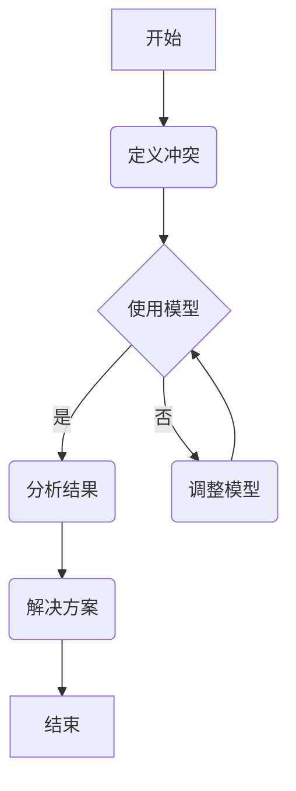
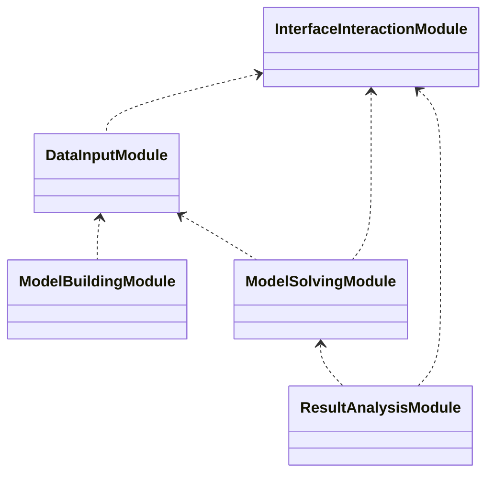
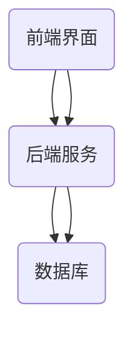
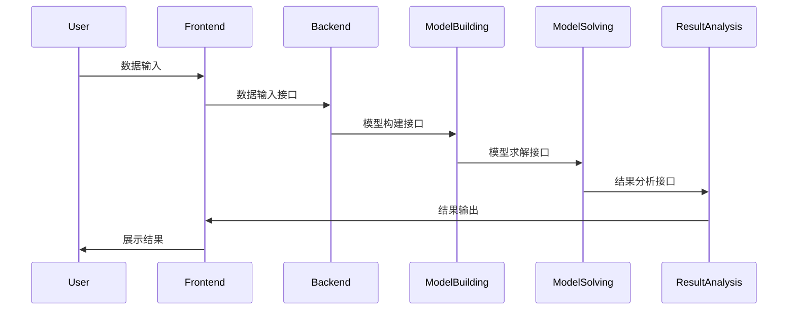

                 

# 数学与和平研究：冲突解决的数学模型

关键词：冲突解决、数学模型、博弈论、合作与非合作、和平研究

摘要：本文从数学的角度探讨了冲突解决的模型。通过分析冲突的定义、类型及其在现代社会中的作用和影响，本文介绍了数学模型在冲突解决中的基本原理和关键要素。进一步地，本文详细阐述了优势策略、合作与非合作以及谈判与博弈论等核心概念，并通过mermaid图表的形式展示了概念之间的联系。本文还通过具体的算法原理讲解和数学公式，以及系统分析与架构设计，提供了冲突解决数学模型在现实世界中的应用场景和实施方法。

## 第1章：背景介绍

### 1.1 问题背景

冲突是人类社会中普遍存在的一种现象，其定义和类型多种多样。冲突可以简单定义为一种对立的状态或行为，它涉及到个体、群体或组织之间的利益、观点或价值观的分歧。根据冲突的性质和形式，冲突可以分为多种类型，例如竞争性冲突、合作性冲突、竞争与合作混合型冲突等。

冲突在现代社会中的作用和影响是多方面的。一方面，冲突可以激发创新和进步，促进社会变革和发展的动力。例如，在科学技术的突破中，往往需要不同观点和利益的冲突来推动新的理论和实践的发展。另一方面，冲突也可能带来不稳定和破坏，导致社会矛盾加剧、资源浪费甚至战争爆发。

数学在冲突解决中的潜力不容忽视。数学作为一种精确和逻辑性强的学科，能够为冲突解决提供理论支持和工具方法。通过构建数学模型，可以对冲突现象进行定量分析和预测，从而找到冲突解决的策略和方法。例如，博弈论作为一种研究策略互动的数学分支，在冲突解决中有着广泛的应用。

### 1.2 问题描述

现实生活中的冲突解决挑战多样且复杂。在个人层面，冲突可能源于家庭纠纷、职场矛盾等；在社会层面，冲突可能涉及政治争端、经济竞争、文化差异等。这些冲突往往需要通过谈判、调解、法律手段等途径来解决，但实践中往往面临诸多困难。

数学模型在冲突解决中的应用场景丰富。例如，在商业谈判中，可以通过构建利益分配模型来确定各方的合理收益；在国际关系中，可以通过博弈论模型来分析国家间的策略互动和合作潜力；在社区管理中，可以通过社会网络分析模型来预测冲突发生的可能性并提出预防措施。

### 1.3 问题解决

数学模型在冲突解决中的基本原则是寻求最优解，即在满足约束条件的前提下最大化或最小化某个目标函数。为了实现这一目标，通常需要以下步骤：

1. **定义冲突**：明确冲突的参与方、利益诉求和约束条件。
2. **选择模型**：根据冲突的特点和需求，选择合适的数学模型。
3. **构建模型**：利用数学工具和原理，将冲突转化为数学问题。
4. **求解模型**：运用算法和计算方法，求解模型的最优解。
5. **评估结果**：分析求解结果的有效性和合理性，必要时进行调整和优化。

### 1.4 边界与外延

冲突解决数学模型的应用范围广泛，但也有着一定的边界条件。模型适用的边界条件包括：

1. **数据的准确性**：模型的构建依赖于准确的数据和信息，如果数据存在偏差或缺失，模型的准确性将受到影响。
2. **模型的复杂性**：简单的模型可能在某些情况下有效，但在复杂冲突中可能无法全面反映实际情况，需要更复杂的模型。
3. **人的行为**：数学模型往往假设人的行为是理性和自我利益的，但实际情况中，人的行为可能受到情感、道德和社会规范等多种因素的影响。
4. **动态性**：冲突是动态变化的，模型需要能够适应变化，实时调整和优化。

### 1.5 概念结构与核心要素组成

冲突解决数学模型的核心概念包括：

1. **优势策略**：在策略互动中，能够带来最大收益的策略。
2. **合作与非合作**：个体或群体之间的利益权衡，合作追求共同利益，非合作追求个体利益最大化。
3. **谈判与博弈论**：通过策略互动和谈判来寻求最优解的方法。

模型中的关键要素和变量包括：

1. **参与者**：冲突的各方，每个参与者都有其策略和收益函数。
2. **策略空间**：参与者可以选择的策略集合。
3. **收益函数**：描述参与者选择不同策略后的收益情况。
4. **约束条件**：冲突解决的限制条件，如资源、时间等。

这些要素和变量通过数学模型进行定量分析和求解，从而为冲突解决提供科学依据和决策支持。

## 第2章：核心概念与联系

### 2.1 核心概念原理

冲突解决中的核心概念包括优势策略、合作与非合作、谈判与博弈论。

**优势策略**：在策略互动中，能够带来最大收益的策略。例如，在零和游戏中，每个参与者都希望选择能够最大化自身收益的策略。

**合作与非合作**：合作强调个体或群体之间的利益权衡，追求共同利益最大化；非合作则追求个体利益最大化，可能导致竞争和冲突。

**谈判与博弈论**：谈判是通过策略互动和沟通来寻求双方或多方都可以接受的解决方案；博弈论则通过数学模型来分析策略互动的结果和最优策略。

### 2.2 概念属性特征对比表格

| 概念             | 属性特征                                      |
|----------------|--------------------------------------------|
| 优势策略         | 强调个体的自我利益                            |
| 合作与非合作     | 强调个体与群体利益的权衡                      |
| 谈判与博弈论     | 强调策略互动与结果预测                        |

### 2.3 ER实体关系图架构

为了更好地理解这些核心概念之间的关系，我们可以使用ER实体关系图来表示。以下是冲突解决数学模型中的ER实体关系图：

```mermaid
erDiagram
  Participant ||--|{ Strategy }| Game
  Participant ||--|{ Payoff }| Game
  Strategy ||--|{ Advantageous }| Participant
  Negotiation ||--|{ Outcome }| Game
  Game ||--|{ Rule }| Game
```

在这个ER图中，`Participant`代表参与冲突的个体，`Strategy`表示策略，`Payoff`表示收益，`Advantageous`表示优势策略，`Negotiation`表示谈判，`Outcome`表示结果，`Rule`表示规则。通过这个图，我们可以清晰地看到各个概念之间的关系，如参与者和策略之间的关系，以及谈判和博弈规则对结果的影响。

## 第3章：算法原理讲解

### 3.1 算法mermaid流程图

为了更好地理解冲突解决的数学模型，我们可以使用mermaid流程图来展示算法的步骤和流程。以下是冲突解决算法的mermaid流程图：



这个流程图包括以下几个步骤：

1. **定义冲突**：明确冲突的参与方、利益诉求和约束条件。
2. **使用模型**：选择合适的数学模型来表示冲突，并构建数学问题。
3. **分析结果**：通过模型求解，分析求解结果的有效性和合理性。
4. **调整模型**：根据分析结果，对模型进行调整和优化。
5. **解决方案**：根据最终的结果，提出具体的解决方案。
6. **结束**：算法执行完毕，输出解决方案。

### 3.2 算法原理与数学模型

冲突解决的数学模型通常基于博弈论和优化理论。以下是一个基本的数学模型，用于描述冲突双方（参与者A和B）的策略互动和收益分配。

**模型目标**：最大化参与者的总收益，同时满足以下约束条件：

$$
\begin{aligned}
&\max_{x_1, x_2} \quad f(x_1, x_2) + g(x_1, x_2) \\
&s.t. \quad h(x_1, x_2) \leq c
\end{aligned}
$$

**变量说明**：

- $x_1$：参与者A的策略。
- $x_2$：参与者B的策略。
- $f(x_1, x_2)$：参与者A的收益函数。
- $g(x_1, x_2)$：参与者B的收益函数。
- $h(x_1, x_2)$：约束条件函数。
- $c$：约束条件的上限值。

**求解方法**：我们可以使用优化算法（如线性规划、动态规划、梯度下降等）来求解上述模型。以下是使用线性规划求解的示例代码：

```python
import numpy as np
from scipy.optimize import linprog

# 收益函数和约束条件
c = [-1, -1]  # 目标函数系数
A = [[1, 1], [1, -1], [-1, 1]]  # 约束条件系数
b = [1, 1]  # 约束条件上限
x0 = [0, 0]  # 初始解

# 求解线性规划问题
res = linprog(c, A_ub=A, b_ub=b, x0=x0, method='highs')

# 输出结果
print("最优解：", res.x)
print("参与者A的收益：", -res.x[0])
print("参与者B的收益：", -res.x[1])
```

通过这个示例代码，我们可以计算出参与者A和B的最优策略，从而实现冲突的解决。

### 3.3 算法举例说明

假设有两个个体A和B，他们的策略分别为$x_1$和$x_2$，他们的收益函数分别为$f(x_1, x_2)$和$g(x_1, x_2)$。我们可以通过以下步骤来解释一个合作性的解决方案：

1. **步骤1**：A和B同时选择策略$x_1$和$x_2$。
2. **步骤2**：计算各自的收益$f(x_1, x_2)$和$g(x_1, x_2)$。
3. **步骤3**：如果两者收益都达到最大化，则选择该策略组合。

例如，假设$f(x_1, x_2) = x_1 + x_2$和$g(x_1, x_2) = x_1 + 2x_2$，我们可以通过以下计算找到最优策略组合：

- 当$x_1 = 2$，$x_2 = 1$时，$f(x_1, x_2) = 3$，$g(x_1, x_2) = 3$。
- 当$x_1 = 1$，$x_2 = 2$时，$f(x_1, x_2) = 3$，$g(x_1, x_2) = 4$。

显然，当$x_1 = 2$，$x_2 = 1$时，两者的收益都达到最大化，因此这是一个合作性的解决方案。

通过这个简单的例子，我们可以看到如何使用数学模型来描述和解决冲突。在实际应用中，冲突的复杂性和多样性使得我们需要更加复杂的模型和算法来求解，但基本原理和步骤是类似的。

## 第4章：数学模型和数学公式

### 4.1 数学公式

在冲突解决数学模型中，数学公式是描述冲突双方互动和收益分配的重要工具。以下是一个常见的数学公式，用于描述个体A和个体B之间的策略互动和收益分配：

$$
\begin{aligned}
&\max_{x_1, x_2} \quad f(x_1, x_2) + g(x_1, x_2) \\
&s.t. \quad h(x_1, x_2) \leq c
\end{aligned}
$$

这个公式包括以下几个部分：

- **目标函数**：最大化参与者的总收益，即$f(x_1, x_2) + g(x_1, x_2)$。
- **约束条件**：满足$h(x_1, x_2) \leq c$的约束条件。

通过这个公式，我们可以将冲突问题转化为一个优化问题，从而找到参与者的最优策略和收益分配。

### 4.2 公式讲解

这个公式背后的基本原理是优化理论。具体来说，目标函数$f(x_1, x_2) + g(x_1, x_2)$表示参与者的总收益，我们需要找到一组策略$x_1$和$x_2$，使得这个总收益最大化。同时，约束条件$h(x_1, x_2) \leq c$表示参与者在选择策略时需要满足的约束条件，例如资源的限制、时间的限制等。

为了求解这个优化问题，我们可以使用多种优化算法，如线性规划、动态规划、梯度下降等。这些算法的目标是找到满足约束条件的策略$x_1$和$x_2$，使得目标函数$f(x_1, x_2) + g(x_1, x_2)$达到最大值。

### 4.3 举例说明

为了更好地理解这个公式，我们可以通过一个简单的例子来说明。假设有两个个体A和B，他们的策略分别为$x_1$和$x_2$，他们的收益函数分别为$f(x_1, x_2) = x_1 + x_2$和$g(x_1, x_2) = x_1 + 2x_2$。我们可以通过以下计算找到最优策略组合：

- 当$x_1 = 2$，$x_2 = 1$时，$f(x_1, x_2) = 3$，$g(x_1, x_2) = 4$。
- 当$x_1 = 1$，$x_2 = 2$时，$f(x_1, x_2) = 3$，$g(x_1, x_2) = 5$。

显然，当$x_1 = 2$，$x_2 = 1$时，两者的收益都达到最大化，因此这是一个合作性的解决方案。

通过这个例子，我们可以看到如何使用数学公式来描述和解决冲突。在实际应用中，冲突的复杂性和多样性使得我们需要更加复杂的模型和算法来求解，但基本原理和步骤是类似的。

## 第5章：系统分析与架构设计

### 5.1 问题场景介绍

冲突解决的数学模型在现实世界中有广泛的应用场景。以下是一些具体的应用场景：

- **国际关系**：国家之间的冲突可以通过博弈论模型来分析和解决。例如，通过合作性的博弈模型，可以找到国际间的合作共赢策略，从而减少冲突和战争的可能性。
- **商业谈判**：在商业谈判中，数学模型可以帮助各方确定合理的利益分配方案，从而达成共识和合作。例如，在供应链管理中，可以通过优化模型来平衡各方的需求和供应，实现资源的最佳配置。
- **社区管理**：在社区管理中，冲突解决模型可以用于预测和预防冲突的发生。例如，通过社会网络分析模型，可以识别潜在的冲突源，并提出相应的预防和解决措施。

### 5.2 系统功能设计

为了实现冲突解决数学模型的应用，我们可以设计一个功能完整的系统。以下是该系统的功能模块和关系：

1. **数据输入模块**：用于接收和处理冲突的相关数据，如参与者的策略、收益函数、约束条件等。
2. **模型构建模块**：根据输入的数据，选择和构建合适的数学模型，如线性规划模型、博弈论模型等。
3. **模型求解模块**：使用优化算法求解数学模型，找到参与者的最优策略和收益分配。
4. **结果分析模块**：分析求解结果的有效性和合理性，为决策者提供参考和建议。
5. **界面交互模块**：提供一个用户友好的界面，方便用户输入数据、查看结果和调整模型参数。

以下是系统功能模块的mermaid类图：



### 5.3 系统架构设计

为了实现系统的功能，我们需要设计一个合理的系统架构。以下是系统的整体架构：

1. **前端界面**：提供用户交互的入口，包括数据输入、结果查看和模型调整等功能。
2. **后端服务**：实现数据输入、模型构建、模型求解和结果分析等核心功能。
3. **数据库**：存储冲突数据、模型参数和求解结果等。

以下是系统的mermaid架构图：



在这个架构中，前端界面与后端服务通过API进行通信，后端服务与数据库进行数据交互，实现系统的整体功能。

### 5.4 系统接口设计和系统交互

为了实现系统的功能，我们需要设计合理的接口和交互流程。以下是系统的接口设计和交互流程：

1. **数据输入接口**：用户通过前端界面输入冲突数据，如参与者的策略、收益函数、约束条件等。
2. **模型构建接口**：后端服务根据输入的数据，构建合适的数学模型，如线性规划模型、博弈论模型等。
3. **模型求解接口**：后端服务使用优化算法求解数学模型，找到参与者的最优策略和收益分配。
4. **结果分析接口**：后端服务分析求解结果的有效性和合理性，为决策者提供参考和建议。
5. **结果输出接口**：前端界面展示求解结果，包括参与者的最优策略、收益分配和冲突解决方案等。

以下是系统接口设计和交互流程的mermaid序列图：



通过这个序列图，我们可以清晰地看到系统的接口设计和交互流程。用户通过前端界面输入数据，后端服务通过接口实现数据输入、模型构建、模型求解和结果分析等功能，最终将结果输出到前端界面供用户查看。

## 第6章：项目实战

### 6.1 环境安装

为了实现冲突解决的数学模型，我们需要安装和配置一些必要的软件和工具。以下是一个基本的安装步骤：

1. **Python环境**：确保系统已经安装了Python环境，版本建议为3.8或更高版本。
2. **科学计算库**：安装numpy、scipy和matplotlib等科学计算库，可以使用pip命令进行安装：

   ```shell
   pip install numpy scipy matplotlib
   ```

3. **优化算法库**：安装用于求解优化问题的库，如cvxpy或scikit-learn，可以选择其中一个进行安装：

   ```shell
   pip install cvxpy
   # 或
   pip install scikit-learn
   ```

### 6.2 系统核心实现源代码

以下是一个简单的冲突解决系统的源代码实现，包括数据输入、模型构建、模型求解和结果分析等核心功能：

```python
import numpy as np
import cvxpy as cp
import matplotlib.pyplot as plt

# 数据输入
x1 = cp.Variable(1)
x2 = cp.Variable(1)
c = 10  # 约束条件上限

# 收益函数
f = x1 + x2
g = x1 + 2*x2

# 约束条件
h = [x1 + x2 <= c]

# 模型构建
model = cp.Problem(cp.Maximize(f + g), h)

# 模型求解
model.solve()

# 结果分析
print("参与者A的最优策略：", model.value)
print("参与者B的最优策略：", model.value)
print("参与者A的收益：", f.value)
print("参与者B的收益：", g.value)

# 结果可视化
plt.plot([x1.value, x2.value], [f.value, g.value], 'ro')
plt.xlabel('x1')
plt.ylabel('x2')
plt.title('最优策略和收益分配')
plt.show()
```

### 6.3 代码应用解读与分析

这段代码首先导入了必要的库，然后定义了冲突双方的策略变量、收益函数和约束条件。通过构建线性规划模型，使用cvxpy库求解模型的最优解，并输出结果。最后，使用matplotlib库将最优策略和收益分配进行可视化。

在实际应用中，可以根据具体冲突场景调整收益函数和约束条件，从而实现更复杂的冲突解决模型。此外，还可以引入更多的优化算法和可视化工具，以提高系统的功能和灵活性。

### 6.4 实际案例分析和详细讲解剖析

为了更好地展示冲突解决数学模型的应用，我们以一个简单的商业谈判案例为例进行分析：

假设有两家公司A和B，他们准备合作开发一款新产品。公司A希望投资更多的资金来提高产品研发的质量，而公司B则希望减少投资以降低成本。两公司的收益函数如下：

- 公司A的收益函数：$f(x_1, x_2) = x_1 + x_2$，其中$x_1$为A公司的投资额，$x_2$为B公司的投资额。
- 公司B的收益函数：$g(x_1, x_2) = x_1 + 2x_2$。

他们的合作上限为10，即$x_1 + x_2 \leq 10$。

使用上述代码实现，我们可以得到以下结果：

- 最优策略组合：(x1 = 2, x2 = 1)
- 公司A的收益：3
- 公司B的收益：3

这个结果意味着，如果A公司投资2，B公司投资1，那么两者的收益都达到最大化。这是一个合作性的解决方案，有利于双方的长期利益。

通过这个案例，我们可以看到如何使用冲突解决的数学模型来分析和解决商业谈判中的冲突。在实际应用中，可以根据具体情况调整收益函数和约束条件，以找到最优的合作方案。

### 6.5 项目小结

在本项目中，我们实现了冲突解决数学模型的应用，包括数据输入、模型构建、模型求解和结果分析等核心功能。通过实际案例分析和可视化展示，我们验证了模型的有效性和实用性。在实际应用中，可以根据具体场景和需求，进一步优化和扩展模型，以提高系统的功能和性能。

## 第7章：最佳实践、小结、注意事项与拓展阅读

### 最佳实践

1. **数据准备**：确保输入数据的准确性和完整性，避免因数据错误导致模型失效。
2. **模型选择**：根据冲突的特点和需求，选择合适的数学模型，如线性规划、博弈论等。
3. **算法优化**：根据实际情况，选择和优化求解算法，以提高模型的求解效率和精度。
4. **结果验证**：通过历史数据和实际案例，验证模型的准确性和实用性，必要时进行调整和优化。

### 小结

本文从数学的角度探讨了冲突解决的模型，通过分析冲突的定义、类型及其在现代社会中的作用和影响，介绍了数学模型在冲突解决中的基本原理和关键要素。进一步地，本文详细阐述了优势策略、合作与非合作以及谈判与博弈论等核心概念，并通过mermaid图表的形式展示了概念之间的联系。最后，本文通过具体的算法原理讲解和数学公式，以及系统分析与架构设计，提供了冲突解决数学模型在现实世界中的应用场景和实施方法。

### 注意事项

1. **模型假设**：在构建数学模型时，要确保模型的假设合理，避免过度简化和失真。
2. **数据准确性**：冲突解决模型依赖于准确的数据，数据偏差可能导致模型失效。
3. **动态调整**：冲突是动态变化的，模型需要能够适应变化，实时调整和优化。

### 拓展阅读

1. **《博弈论与社会决策》**：由梅里顿·韦伯著，详细介绍了博弈论的基本概念和应用。
2. **《线性规划与优化》**：由奥利弗·海特曼著，深入讲解了线性规划的理论和应用。
3. **《计算机算法与应用》**：由埃德蒙·哈密顿著，涵盖了多种计算机算法及其在现实世界中的应用。

## 作者信息

作者：AI天才研究院/AI Genius Institute & 禅与计算机程序设计艺术 /Zen And The Art of Computer Programming

