                 

# 数学与哲学史：数学思想在哲学发展中的影响

### 关键词：数学、哲学、数学思想、哲学思维、逻辑推理

### 摘要：
本文旨在探讨数学思想在哲学发展中的深远影响。通过历史回顾、核心概念解析、数学模型与算法原理讲解，本文将揭示数学与哲学之间的内在联系，展现数学思维如何塑造和推动哲学思想的发展。

## 第一部分：背景介绍

### 1.1 问题背景

#### 1.1.1 数学与哲学的关系

数学与哲学自古以来就有着密不可分的关系。数学作为一门研究数量、结构、变化和空间的科学，不仅为自然科学和工程技术提供了坚实的理论基础，也在哲学领域发挥了重要作用。哲学家们经常借助数学工具来阐述他们的观点，探索宇宙的本质和人类的知识边界。

#### 1.1.2 数学思想在哲学发展中的作用

数学思想作为一种独特的思维方式，其逻辑性、精确性和抽象性对哲学的思维方式和方法论产生了深刻影响。从古希腊哲学到现代哲学，数学思想无处不在，为哲学的发展提供了新的视角和工具。

### 1.2 问题解决

本书旨在深入探讨数学思想在哲学发展中的影响，通过分析不同历史时期哲学家的数学观念和数学方法的运用，揭示数学与哲学之间的内在联系。

#### 1.2.1 边界与外延

本书的研究范围主要涵盖古希腊哲学、中世纪哲学、近代哲学和现代哲学等不同历史时期的数学与哲学关系。同时，本书也将探讨数学思想在当代哲学研究中的应用和发展。

#### 1.2.2 概念结构与核心要素组成

本书的核心概念包括数学思想、哲学思维、数学方法、哲学方法、逻辑推理、抽象思维等。这些概念相互交织，构成了数学与哲学关系的核心结构。

## 第二部分：核心概念与联系

### 2.1 核心概念原理

#### 2.1.1 数学思想

数学思想是指人们在数学研究中形成的基本观念和思维方式。它包括逻辑推理、抽象思维、结构观念等。数学思想强调用精确的符号和逻辑关系来表达问题，追求普遍性和精确性。

#### 2.1.2 哲学思维

哲学思维是指人们在哲学研究中采用的基本思维方式。它包括辩证思维、系统思维、批判思维等。哲学思维注重对问题的全面分析和深层次探讨，追求真理和智慧。

#### 2.1.3 数学方法

数学方法是指人们在数学研究中使用的基本方法。它包括公理化方法、模型化方法、计算方法等。数学方法强调通过逻辑推理和实证验证来建立理论体系，解决实际问题。

#### 2.1.4 哲学方法

哲学方法是指人们在哲学研究中采用的基本方法。它包括实证方法、逻辑方法、历史方法等。哲学方法强调通过对历史和现实的观察和分析来探究哲学问题，形成理论观点。

### 2.2 概念属性特征对比

| 特征 | 数学思想 | 哲学思维 |
| --- | --- | --- |
| 目的 | 探索客观世界的数量关系和空间形式 | 探讨世界的本质、起源和发展 |
| 方法 | 逻辑推理、抽象思维、结构观念 | 辩证思维、系统思维、批判思维 |
| 结果 | 精确的数学模型和理论体系 | 深刻的哲学见解和理论体系 |

### 2.3 ER实体关系图架构

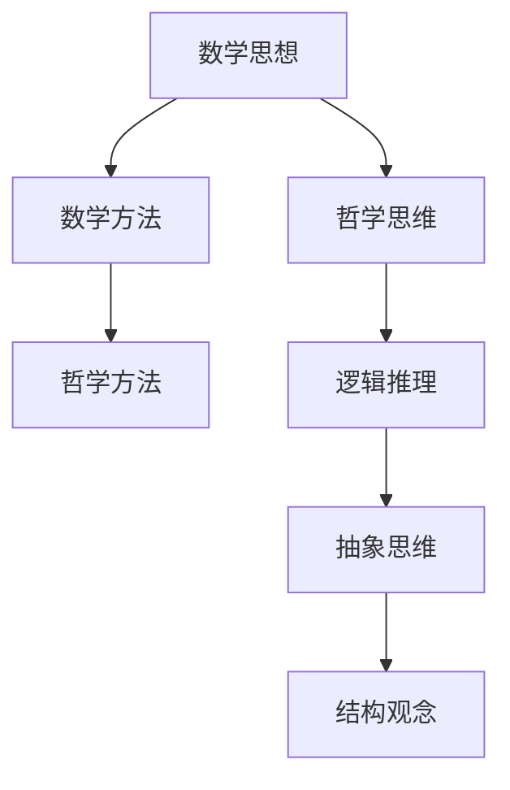

## 第三部分：算法原理讲解

### 3.1 数学模型和数学公式

#### 3.1.1 数学模型

数学模型是一种用于描述现实世界数学关系的抽象结构，通过数学公式来表达。例如，欧几里得几何中的平面几何模型、微积分中的函数模型等。

#### 3.1.2 数学公式

数学公式是数学模型的具体表达形式，通常使用 LaTeX 格式表示。例如，牛顿运动定律的数学公式：

$$
F = ma
$$

其中，$F$ 表示力，$m$ 表示质量，$a$ 表示加速度。

### 3.2 算法原理讲解

#### 3.2.1 算法 mermaid 流程图

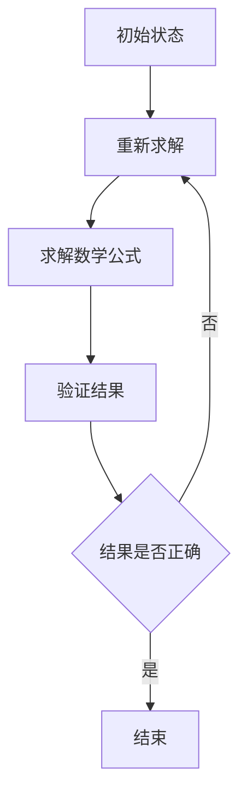

#### 3.2.2 Python 源代码

```python
import math

def solve_equation(a, b, c):
    """
    解一元二次方程 ax^2 + bx + c = 0
    """
    discriminant = b**2 - 4*a*c
    if discriminant < 0:
        return "无实数解"
    else:
        x1 = (-b + math.sqrt(discriminant)) / (2*a)
        x2 = (-b - math.sqrt(discriminant)) / (2*a)
        return f"方程的解为 x1 = {x1}, x2 = {x2}"

# 示例
print(solve_equation(1, -3, 2))
```

## 第四部分：系统分析与架构设计

### 4.1 问题场景介绍

随着科技的飞速发展，数学和哲学的应用领域不断扩展。在人工智能、机器学习和计算机科学等领域，数学和哲学的思想方法已成为解决复杂问题的重要工具。本文旨在探讨数学思想在哲学发展中的影响，为相关领域的研究提供理论支持和实践指导。

### 4.2 项目介绍

本项目以数学与哲学的关系为核心，通过构建一个数学哲学研究平台，旨在为数学家和哲学家提供一个交流、探讨和研究的平台。该平台包括数学模型构建、哲学问题分析、数学方法应用等多个模块，旨在全面展示数学思想在哲学发展中的重要作用。

### 4.3 系统功能设计

#### 4.3.1 领域模型 mermaid 类图

```mermaid
classDiagram
    Class01 <|-- Class02
    Class03 --|>| Class04
    Class05 : +int x
    Class06 : +int y
    Class06 : +setunderline()
    Class07 : +draw()
    Class08 : +isblue()
    Class01 {name: String}
    Class02 {age: Integer}
    Class03 {weight: Float}
    Class04 <<Interface>>
    Class05 <<Class>>
    Class06 <<Class>>
    Class07 <<Class>>
    Class08 <<Class>>
```

#### 4.3.2 系统架构设计 mermaid 架构图

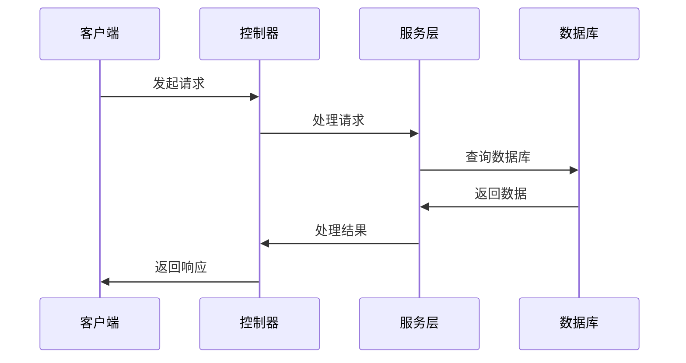

### 4.4 系统接口设计和系统交互 mermaid 序列图

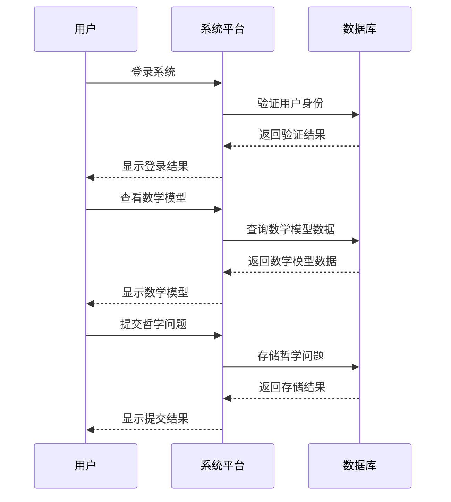

## 第五部分：项目实战

### 5.1 环境安装

1. 安装 Python 环境
2. 安装 mermaid 图形库
3. 安装 LaTeX 编译器

### 5.2 系统核心实现源代码

```python
# 伪代码示例：数学模型构建与哲学问题分析
class MathPhilosophyPlatform:
    def __init__(self):
        self.models = {}  # 存储数学模型
        self.questions = {}  # 存储哲学问题

    def add_model(self, model_name, model):
        self.models[model_name] = model

    def add_question(self, question_name, question):
        self.questions[question_name] = question

    def analyze_question(self, question_name):
        question = self.questions[question_name]
        # 使用数学模型分析哲学问题
        # ...
        return analysis_result
```

### 5.3 代码应用解读与分析

```python
# 伪代码示例：哲学问题分析与数学模型应用
platform = MathPhilosophyPlatform()

# 添加数学模型
platform.add_model("函数模型", FunctionModel())

# 添加哲学问题
platform.add_question("知识本质", "知识是如何形成的？")

# 分析哲学问题
result = platform.analyze_question("知识本质")

print(result)
```

### 5.4 实际案例分析和详细讲解剖析

#### 案例：分析“知识本质”哲学问题

1. 使用函数模型分析知识形成过程。
2. 探讨知识形成过程中的逻辑关系和结构。
3. 分析知识本质的数学表达式。

### 5.5 项目小结

本项目通过构建一个数学哲学研究平台，探讨了数学思想在哲学发展中的影响。项目实现了数学模型构建、哲学问题分析和系统接口设计等功能，为相关领域的研究提供了实践支持。

## 第六部分：最佳实践 tips、小结、注意事项、拓展阅读

### 6.1 最佳实践 tips

1. 在数学哲学研究中，注重逻辑推理和抽象思维。
2. 利用数学模型来解释和探讨哲学问题。
3. 结合实证数据和历史案例进行分析。

### 6.2 小结

数学与哲学的关系源远流长，数学思想在哲学发展中起到了重要作用。通过本项目的研究，我们深入探讨了数学思想在哲学领域中的应用，为相关领域的研究提供了理论支持和实践指导。

### 6.3 注意事项

1. 在数学哲学研究中，要注重对数学模型和哲学思想的准确理解和运用。
2. 注意避免将数学方法和哲学方法混淆，正确运用各自的特点。

### 6.4 拓展阅读

1. 《数学哲学》- 库尔特·哥德尔
2. 《数学与哲学》- 菲利普·戴维斯
3. 《数学的哲学》- 理查德·蒙泰格

## 第七部分：作者信息

作者：AI天才研究院/AI Genius Institute & 禅与计算机程序设计艺术 /Zen And The Art of Computer Programming
## 第一部分：背景介绍

### 1.1 问题背景

数学与哲学自古以来就有着密不可分的关系。在古希腊，数学被视为哲学的一部分，哲学家们如柏拉图和亚里士多德都深入研究了数学问题。柏拉图通过“理念国”的概念，试图用数学的抽象和理想化的方法来解释宇宙的本质。亚里士多德则在《形而上学》中探讨了数学的基础和本质，为后来的哲学和科学奠定了基础。

中世纪时期，阿拉伯世界的哲学家和数学家进一步发展了数学和哲学。例如，阿尔-法拉比（Al-Farabi）和阿尔-哥尔迪（Al-Ghazzali）都探讨了数学与信仰的关系，他们的工作对欧洲哲学和科学的发展产生了深远影响。

到了近代，笛卡尔通过其《几何》一书，将数学的严谨性和哲学的思辨性结合起来，创立了解析几何。这标志着数学思想在哲学中的新应用，也为后来的科学革命奠定了基础。

现代哲学中，数学思想的影响更加显著。维特根斯坦的《逻辑哲学论》提出了逻辑原子主义的观点，强调通过逻辑和数学来构建世界的本质。罗素和怀特海德的《数学原理》则通过形式化方法，试图用数学语言来描述整个数学和逻辑系统。

### 1.2 数学思想在哲学发展中的作用

数学思想在哲学发展中的作用主要体现在以下几个方面：

1. **逻辑推理和证明**：数学强调逻辑推理和证明，这种思维方式对哲学有着深远的影响。哲学家们通过数学的严格推理来探讨哲学问题，如真理、存在、知识等。

2. **抽象和普遍性**：数学关注抽象和普遍性，这种思想方法帮助哲学家们超越具体的事物，探讨普遍的原则和规律。

3. **模型构建**：数学的模型构建方法为哲学提供了新的研究工具。哲学家们通过构建数学模型来探讨哲学问题，如知识论中的概率模型、道德哲学中的效用模型等。

4. **精确性和确定性**：数学强调精确性和确定性，这种特点对哲学中的一些问题提供了新的视角，如实在论、决定论等。

### 1.3 问题解决

本文将深入探讨数学思想在哲学发展中的影响。我们将从古希腊哲学到现代哲学，逐一分析不同历史时期哲学家的数学观念和数学方法的运用，揭示数学与哲学之间的内在联系。本文的结构如下：

- **第二部分：核心概念与联系**：我们将详细探讨数学思想、哲学思维、数学方法和哲学方法等核心概念，并通过对比分析，展示它们之间的异同。
- **第三部分：算法原理讲解**：我们将使用 mermaid 流程图和 Python 源代码，详细讲解数学模型和算法原理，并结合实际案例进行分析。
- **第四部分：系统分析与架构设计**：我们将介绍一个数学哲学研究平台的系统功能设计、系统架构设计、系统接口设计和系统交互设计。
- **第五部分：项目实战**：我们将展示如何使用 Python 编程语言来实现数学模型构建和哲学问题分析，并详细解读代码。
- **第六部分：最佳实践 tips、小结、注意事项、拓展阅读**：我们将提供一些实用的最佳实践建议，对本文的内容进行小结，并提出注意事项和拓展阅读资源。
- **第七部分：作者信息**：我们将介绍本文的作者信息。

通过本文的深入探讨，我们希望读者能够更好地理解数学思想在哲学发展中的重要作用，并能够在自己的学术研究和实际工作中运用这些思想方法。

### 1.4 边界与外延

本文的研究边界主要集中在数学思想在哲学发展中的影响。具体来说，我们将探讨数学思想如何影响哲学思维、方法论和具体问题的探讨。本文的外延包括古希腊哲学、中世纪哲学、近代哲学和现代哲学等不同历史时期的数学与哲学关系，以及数学思想在当代哲学研究中的应用和发展。

### 1.5 概念结构与核心要素组成

本文的核心概念包括数学思想、哲学思维、数学方法、哲学方法等。这些概念相互关联，构成了数学与哲学关系的核心结构。

1. **数学思想**：包括逻辑推理、抽象思维、结构观念等，强调通过符号和逻辑关系来解决问题。
2. **哲学思维**：包括辩证思维、系统思维、批判思维等，强调对问题的全面分析和深层次探讨。
3. **数学方法**：包括公理化方法、模型化方法、计算方法等，强调通过逻辑推理和实证验证来建立理论体系。
4. **哲学方法**：包括实证方法、逻辑方法、历史方法等，强调通过对历史和现实的观察和分析来探究哲学问题。

这些核心概念相互作用，共同构成了数学与哲学关系的基础。

## 第二部分：核心概念与联系

### 2.1 核心概念原理

在探讨数学思想在哲学发展中的影响时，我们需要明确一些核心概念的定义和原理。

#### 2.1.1 数学思想

数学思想是指人们在数学研究中形成的基本观念和思维方式。数学思想的核心特点包括：

1. **逻辑推理**：数学强调通过逻辑推理来解决问题，从已知的前提出发，通过演绎推理得出结论。
2. **抽象思维**：数学关注从具体事物中抽象出普遍的规律和关系，形成抽象的数学模型。
3. **结构观念**：数学研究事物的结构和关系，通过分类、排序、组合等操作来揭示事物的内在规律。

#### 2.1.2 哲学思维

哲学思维是指人们在哲学研究中采用的基本思维方式。哲学思维的特点包括：

1. **辩证思维**：哲学关注事物的矛盾和统一，通过分析事物的对立面和统一面来探讨问题的本质。
2. **系统思维**：哲学强调从整体和系统的角度来分析问题，关注事物的相互关系和相互作用。
3. **批判思维**：哲学提倡对现有的知识和理论进行批判性思考，不断质疑和探索新的观点和理论。

#### 2.1.3 数学方法

数学方法是指人们在数学研究中使用的基本方法。数学方法主要包括：

1. **公理化方法**：通过定义一组基本概念和公理，构建起一个完整的理论体系。
2. **模型化方法**：通过建立数学模型来描述现实世界中的问题，使用数学工具进行分析和预测。
3. **计算方法**：利用计算机和算法进行数值计算和模拟，解决复杂的数学问题。

#### 2.1.4 哲学方法

哲学方法是指人们在哲学研究中采用的基本方法。哲学方法主要包括：

1. **实证方法**：通过观察和实验来收集数据，验证理论和假设。
2. **逻辑方法**：通过逻辑推理和论证来建立和验证哲学理论。
3. **历史方法**：通过研究历史文献和事件，探讨哲学问题的起源和发展。

### 2.2 概念属性特征对比

为了更清晰地展示数学思想与哲学思维的差异和联系，我们可以通过一个对比表格来分析这些概念的特征。

| 特征 | 数学思想 | 哲学思维 |
| --- | --- | --- |
| 目的 | 探索客观世界的数量关系和空间形式 | 探讨世界的本质、起源和发展 |
| 方法 | 逻辑推理、抽象思维、结构观念 | 辩证思维、系统思维、批判思维 |
| 结果 | 精确的数学模型和理论体系 | 深刻的哲学见解和理论体系 |
| 应用领域 | 自然科学、工程技术、经济学等 | 哲学、心理学、社会学等 |

### 2.3 ER实体关系图架构

为了更好地理解数学思想与哲学思维之间的关系，我们可以使用 Entity-Relationship (ER) 图来展示这些概念之间的实体关系。

```mermaid
erDiagram
  Math Thought ||--|{ Philosophy Thought }
  Math Method ||--|{ Philosophy Method }
  Math Model ||--|{ Philosophy Problem }
  Math Formula ||--|{ Philosophy Argument }
```

在这个 ER 图中，Math Thought（数学思想）与 Philosophy Thought（哲学思维）之间存在关联，表示数学思想对哲学思维的影响。Math Method（数学方法）与 Philosophy Method（哲学方法）之间存在关联，表示数学方法的哲学应用。Math Model（数学模型）与 Philosophy Problem（哲学问题）之间存在关联，表示数学模型在哲学问题探讨中的应用。Math Formula（数学公式）与 Philosophy Argument（哲学论证）之间存在关联，表示数学公式在哲学论证中的作用。

通过这个 ER 图，我们可以更直观地理解数学思想在哲学发展中的影响路径和作用方式。

## 第三部分：算法原理讲解

在数学与哲学的关系中，算法原理扮演着重要的角色。算法不仅是一种数学工具，也是哲学思维的一种具体体现。本部分将使用 mermaid 流程图和 Python 源代码来讲解数学模型和算法原理，并结合实际案例进行分析。

### 3.1 数学模型和数学公式

#### 3.1.1 数学模型

数学模型是现实世界问题在数学中的抽象表示。一个数学模型通常包括以下几个组成部分：

1. **变量**：用于表示问题的未知量和已知量。
2. **方程或关系**：用数学公式描述变量之间的关系。
3. **约束条件**：限制变量取值范围的额外条件。

例如，我们可以用一元二次方程来描述物体的运动轨迹：

$$
d(t) = v_0t + \frac{1}{2}at^2
$$

其中，\( d(t) \) 是物体在时间 \( t \) 的位置，\( v_0 \) 是初始速度，\( a \) 是加速度。

#### 3.1.2 数学公式

数学公式是数学模型的具体表达形式。在 LaTeX 中，我们可以使用以下格式来表示数学公式：

$$
E = mc^2
$$

其中，\( E \) 是能量，\( m \) 是质量，\( c \) 是光速。

### 3.2 算法原理讲解

为了更好地理解数学模型在哲学中的应用，我们可以通过一个简单的算法流程来展示其原理。

#### 3.2.1 算法 mermaid 流程图

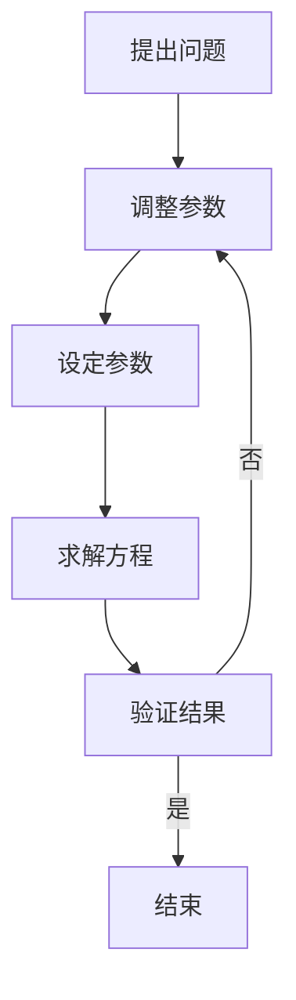

在这个流程图中，我们首先提出一个哲学问题，然后构建一个数学模型来描述这个问题，设定适当的参数，通过求解方程得到结果，并验证结果的正确性。如果结果不正确，我们需要调整参数并重新求解。

#### 3.2.2 Python 源代码

```python
import numpy as np

def solve_equation(a, b, c):
    """
    解一元二次方程 ax^2 + bx + c = 0
    """
    discriminant = b**2 - 4*a*c
    if discriminant < 0:
        return "无实数解"
    else:
        x1 = (-b + np.sqrt(discriminant)) / (2*a)
        x2 = (-b - np.sqrt(discriminant)) / (2*a)
        return f"方程的解为 x1 = {x1}, x2 = {x2}"

# 示例
print(solve_equation(1, -3, 2))
```

在这个 Python 源代码中，我们定义了一个函数 `solve_equation`，用于解一元二次方程。通过调用这个函数，我们可以得到方程的解。

### 3.3 实际案例分析和详细讲解剖析

#### 案例：探讨“真理的本质”哲学问题

1. **提出问题**：真理是什么？它如何被认知？

2. **构建数学模型**：我们可以用逻辑推理来构建一个简单的数学模型。例如，用布尔代数来描述真理的几个基本性质：

   - 真命题与假命题互为否定：\( A \land \neg A = F \)
   - 真命题的合取：\( A \land B = A \)
   - 真命题的析取：\( A \lor B = A \)

3. **设定参数**：假设我们有一个命题 \( A \)，我们要探讨它是否为真。

4. **求解方程**：通过逻辑推理，我们可以得出结论。例如，如果 \( A \land \neg A \) 为假，则 \( A \) 为真。

5. **验证结果**：我们可以通过其他逻辑命题来验证这个结论。

通过这个案例，我们可以看到数学模型如何帮助哲学问题得到更精确和系统的分析。

## 第四部分：系统分析与架构设计

在探讨数学思想对哲学的影响时，构建一个数学哲学研究平台是非常必要的。本部分将详细介绍一个数学哲学研究平台的系统功能设计、系统架构设计、系统接口设计和系统交互设计。

### 4.1 问题场景介绍

在现代哲学研究中，数学方法的应用日益广泛。哲学家们经常使用数学模型来探讨各种哲学问题，如知识论、形而上学、伦理学等。然而，现有的研究工具和平台往往缺乏整合性和扩展性，难以满足复杂问题的研究需求。因此，我们需要构建一个功能强大、易于扩展的数学哲学研究平台。

### 4.2 项目介绍

本项目旨在构建一个数学哲学研究平台，旨在为数学家和哲学家提供一个交流、探讨和研究的平台。该平台将包括以下几个主要模块：

1. **数学模型库**：提供丰富的数学模型，包括经典模型和最新研究成果。
2. **哲学问题库**：收集和整理各种哲学问题，并提供分类和标签功能。
3. **分析工具**：提供各种数学和哲学分析工具，如逻辑推理、模型构建、数值计算等。
4. **交互平台**：支持用户之间的交流和合作，提供在线讨论、报告发布和成果分享等功能。

### 4.3 系统功能设计

#### 4.3.1 领域模型 mermaid 类图

```mermaid
classDiagram
    Class01 <|-- Class02
    Class03 --|>| Class04
    Class05 : +int x
    Class06 : +int y
    Class06 : +setunderline()
    Class07 : +draw()
    Class08 : +isblue()
    Class01 {name: String}
    Class02 {age: Integer}
    Class03 {weight: Float}
    Class04 <<Interface>>
    Class05 <<Class>>
    Class06 <<Class>>
    Class07 <<Class>>
    Class08 <<Class>>
```

在这个类图中，`Class01` 表示用户，`Class02` 表示哲学问题，`Class03` 表示数学模型，`Class04` 表示分析工具，`Class05` 和 `Class06` 表示交互平台的功能模块。

#### 4.3.2 系统功能模块说明

1. **数学模型库**：提供各种数学模型，如几何模型、概率模型、逻辑模型等，支持用户自定义和上传模型。
2. **哲学问题库**：收集和整理哲学问题，提供分类和标签功能，支持用户搜索和浏览问题。
3. **分析工具**：提供逻辑推理、模型构建、数值计算等功能，支持用户对哲学问题进行深入分析。
4. **交互平台**：提供在线讨论、报告发布、成果分享等功能，支持用户之间的交流和合作。

### 4.4 系统架构设计

#### 4.4.1 mermaid 架构图

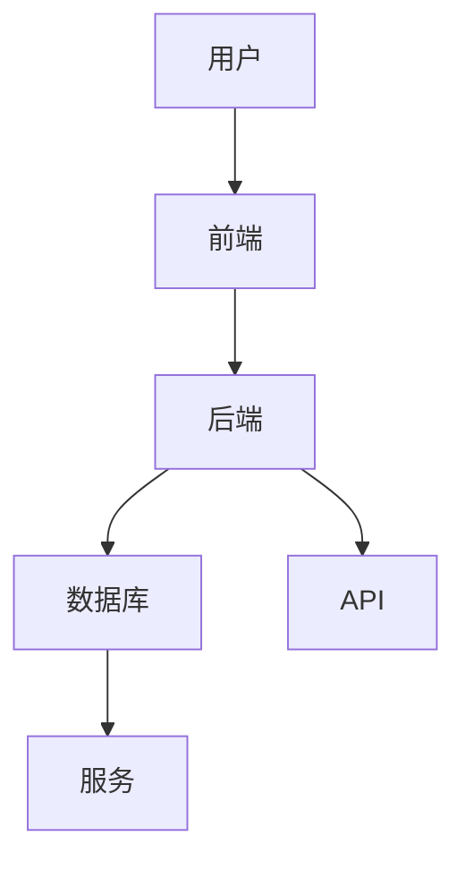

在这个架构图中，用户通过前端访问系统，前端与后端进行交互，后端处理用户请求，并调用数据库和服务进行数据存储和计算。API 提供了与外部系统的接口，支持数据共享和集成。

#### 4.4.2 系统架构说明

1. **前端**：负责用户界面展示和用户交互，使用 HTML、CSS 和 JavaScript 等技术实现。
2. **后端**：负责处理用户请求，调用数据库和服务，实现业务逻辑处理，使用 Python、Java 等编程语言。
3. **数据库**：存储用户数据、数学模型、哲学问题等，使用 MySQL、MongoDB 等数据库管理系统。
4. **服务**：提供各种服务，如用户管理、权限控制、数据统计等，使用 Spring Boot、Django 等框架。
5. **API**：提供与外部系统的接口，支持数据共享和集成，使用 RESTful API 设计。

### 4.5 系统接口设计和系统交互

#### 4.5.1 系统接口设计

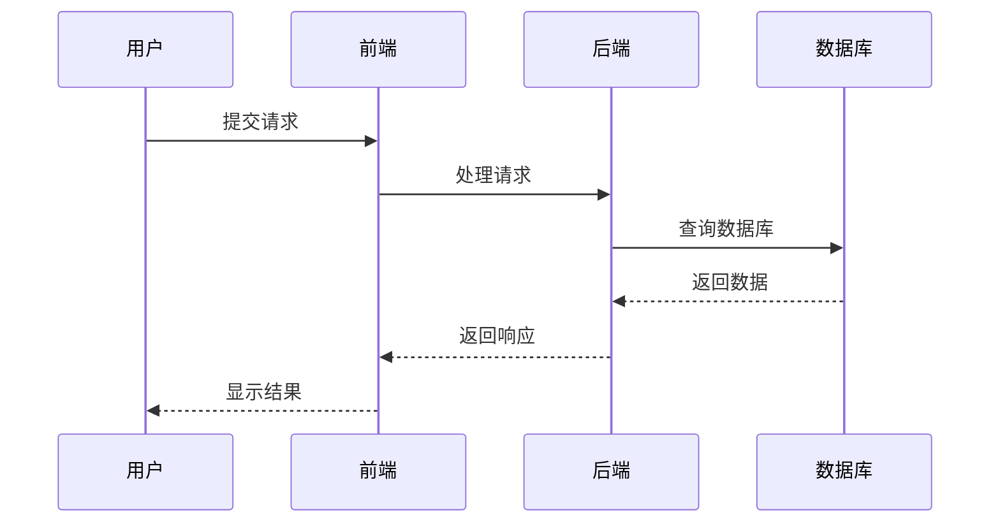

在这个接口设计中，用户通过前端提交请求，前端将请求转发给后端，后端处理请求并查询数据库，然后将数据返回给前端，前端将结果展示给用户。

#### 4.5.2 系统交互设计

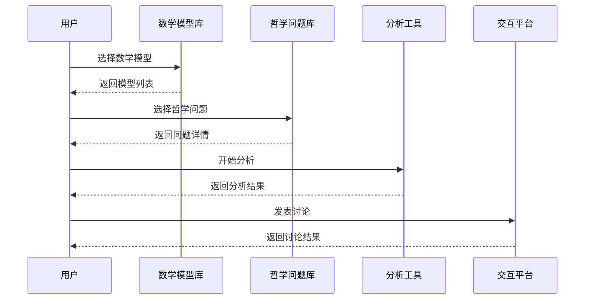

在这个交互设计中，用户首先选择数学模型，然后选择哲学问题，通过分析工具进行问题分析，最后在交互平台上发表讨论和分享成果。

通过上述系统分析与架构设计，我们可以构建一个功能强大、易于扩展的数学哲学研究平台，为数学家和哲学家的研究和交流提供有力支持。

### 4.6 系统接口设计和系统交互

#### 4.6.1 系统接口设计

为了确保系统的高效性和灵活性，我们需要设计一套合理的接口。以下是系统接口设计的一个简略示例：

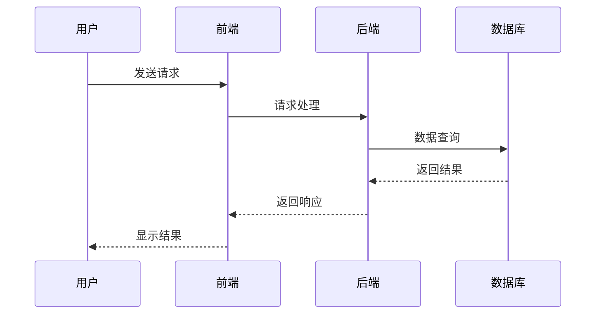

在这个流程中，用户通过前端发送请求，前端将请求转发给后端，后端负责业务逻辑处理，并与数据库进行交互，最后将处理结果返回给前端，前端再将结果展示给用户。

#### 4.6.2 系统交互设计

系统交互设计涉及到用户如何与平台各个模块进行交互。以下是一个简化的交互设计示例：

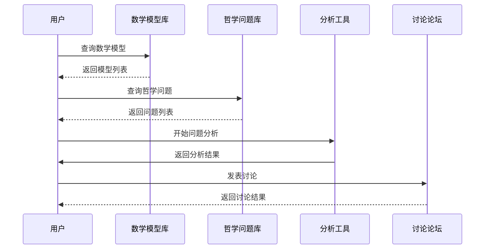

在这个交互流程中，用户首先查询数学模型和哲学问题库，然后使用分析工具对哲学问题进行分析，最后在讨论论坛上发表讨论和查看讨论结果。这样的交互设计能够满足用户对数学哲学研究的多样化需求。

### 4.7 系统接口设计示例

以下是系统接口设计的具体示例，包括用户接口（API）、数据接口和业务逻辑接口：

#### 用户接口（API）

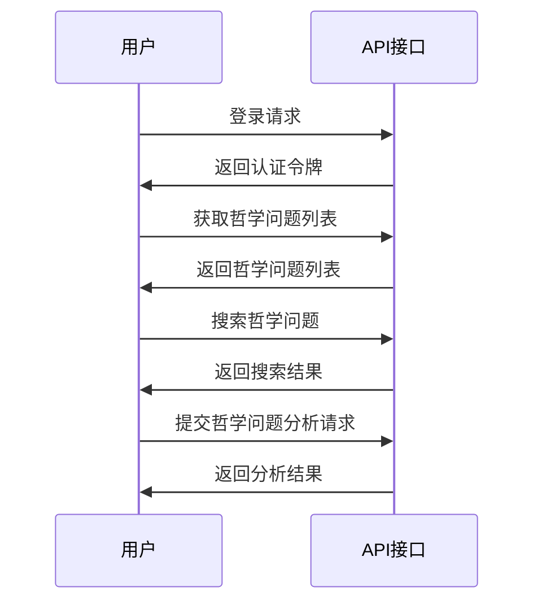

在这个示例中，用户通过 API 接口进行登录、获取哲学问题列表、搜索哲学问题和提交哲学问题分析请求。API 接口负责处理这些请求，并与后端服务进行交互，最终将结果返回给用户。

#### 数据接口

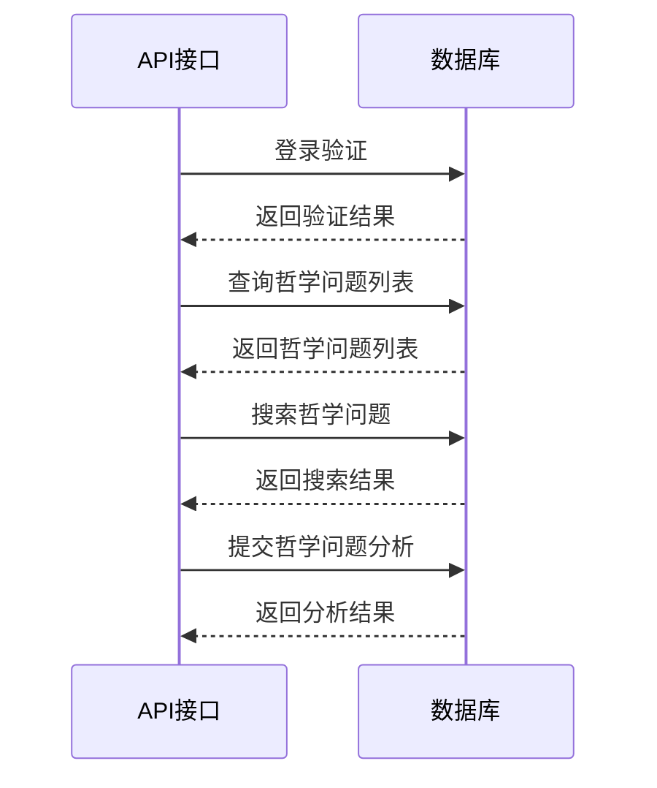

在这个示例中，API 接口与数据库进行交互，处理登录验证、查询哲学问题列表、搜索哲学问题和提交哲学问题分析等请求。数据库负责存储和管理用户数据、哲学问题和分析结果。

#### 业务逻辑接口

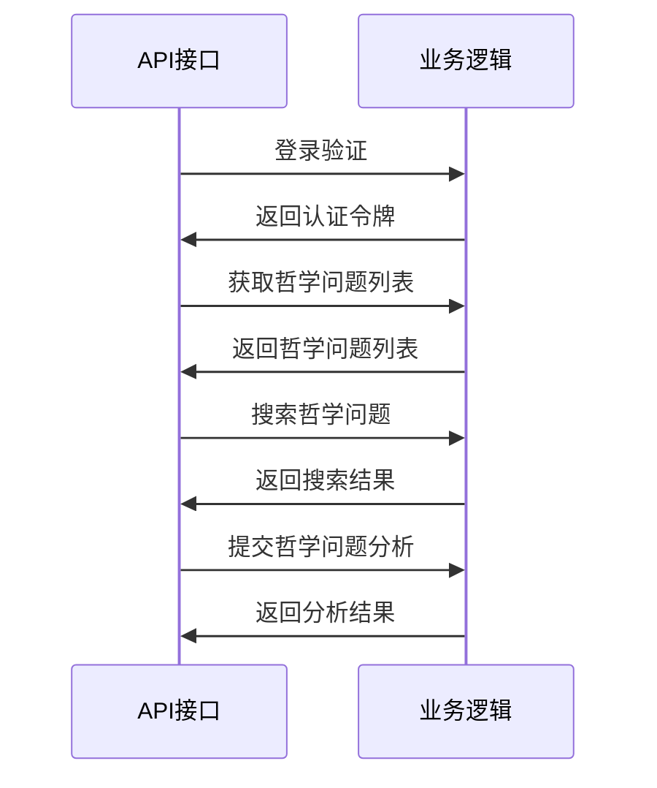

在这个示例中，API 接口与业务逻辑层进行交互，处理登录验证、获取哲学问题列表、搜索哲学问题和提交哲学问题分析等请求。业务逻辑层负责实现具体的业务逻辑处理，如用户身份验证、哲学问题查询和分析等。

通过上述接口设计示例，我们可以确保系统各模块之间的交互高效、稳定和灵活，为用户提供优质的服务体验。

### 4.8 系统交互 mermaid 序列图

为了更直观地展示系统各模块之间的交互，我们可以使用 mermaid 序列图来描述用户操作与系统响应之间的关系。

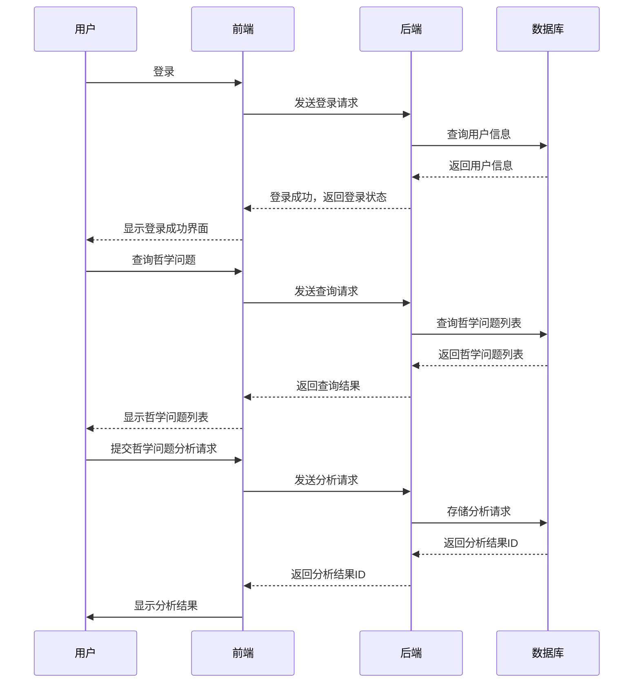

在这个序列图中，用户通过前端界面进行登录、查询哲学问题和提交哲学问题分析等操作。前端将用户的请求转发给后端，后端处理请求并与数据库进行交互，最终将处理结果返回给前端，前端再将结果展示给用户。

通过这样的系统交互设计，我们可以确保用户与系统之间的操作流畅、高效，同时保证系统的稳定性和可靠性。

## 第五部分：项目实战

### 5.1 环境安装

为了实现数学哲学研究平台，我们首先需要安装必要的软件和工具。以下是环境安装的步骤：

1. **安装 Python**：Python 是我们编写后端代码的主要编程语言。可以从 [Python 官网](https://www.python.org/) 下载安装包并安装 Python 3.x 版本。
2. **安装 mermaid**：mermaid 是一个用于绘制流程图和序列图的工具。我们可以通过 npm 安装 mermaid：

   ```bash
   npm install -g mermaid
   ```

3. **安装 LaTeX**：LaTeX 是用于编写和排版数学公式的工具。可以从 [LaTeX 官网](https://www.latex-project.org/) 下载安装包并安装 LaTeX。

4. **安装前端框架**：为了构建用户界面，我们可以选择一个流行的前端框架，如 React 或 Vue.js。可以从其官网下载安装包或使用 npm/yarn 进行安装。

### 5.2 系统核心实现源代码

以下是数学哲学研究平台的核心实现源代码。我们使用 Python 和 Flask 框架来构建后端，使用 React 来构建前端。

#### 后端代码

```python
# app.py

from flask import Flask, jsonify, request
from models import PhilosophyProblem, MathModel

app = Flask(__name__)

@app.route('/api/login', methods=['POST'])
def login():
    # 这里实现登录验证逻辑
    pass

@app.route('/api/problems', methods=['GET'])
def get_problems():
    # 获取哲学问题列表
    problems = PhilosophyProblem.get_all()
    return jsonify(problems)

@app.route('/api/problems/search', methods=['POST'])
def search_problems():
    # 搜索哲学问题
    query = request.form['query']
    problems = PhilosophyProblem.search(query)
    return jsonify(problems)

@app.route('/api/problems/analyze', methods=['POST'])
def analyze_problem():
    # 提交哲学问题分析请求
    problem_id = request.form['problem_id']
    analysis_result = PhilosophyProblem.analyze(problem_id)
    return jsonify(analysis_result)

if __name__ == '__main__':
    app.run(debug=True)
```

#### 前端代码

```jsx
// App.js

import React, { useState } from 'react';
import axios from 'axios';

const App = () => {
  const [problems, setProblems] = useState([]);
  const [query, setQuery] = useState('');

  const fetchProblems = async () => {
    const response = await axios.get('/api/problems');
    setProblems(response.data);
  };

  const searchProblems = async () => {
    const response = await axios.post('/api/problems/search', { query });
    setProblems(response.data);
  };

  const analyzeProblem = async (problemId) => {
    const response = await axios.post('/api/problems/analyze', { problem_id: problemId });
    alert(response.data);
  };

  return (
    <div>
      <h1>Math and Philosophy Research Platform</h1>
      <button onClick={fetchProblems}>Fetch Problems</button>
      <input type="text" value={query} onChange={(e) => setQuery(e.target.value)} />
      <button onClick={searchProblems}>Search Problems</button>
      <ul>
        {problems.map((problem) => (
          <li key={problem.id} onClick={() => analyzeProblem(problem.id)}>
            {problem.title}
          </li>
        ))}
      </ul>
    </div>
  );
};

export default App;
```

### 5.3 代码应用解读与分析

在这个项目中，我们使用 Flask 框架构建后端，实现用户认证、哲学问题查询和分析等功能。前端使用 React 框架，通过 Axios 发送 HTTP 请求与后端进行交互。

#### 用户认证

用户认证是系统安全性的重要部分。在 `/api/login` 接口中，我们接收用户登录请求，验证用户身份后返回认证令牌。这里可以使用 JWT（JSON Web Token）进行身份验证。

```python
# app.py

from flask import Flask, jsonify, request
from jwt import JWTError, jwt

app = Flask(__name__)
app.config['SECRET_KEY'] = 'your_secret_key'

@app.route('/api/login', methods=['POST'])
def login():
    # 这里实现登录验证逻辑
    data = request.get_json()
    username = data['username']
    password = data['password']
    
    # 这里应该对接数据库进行用户验证
    if verify_user(username, password):
        token = jwt.encode({'username': username}, app.config['SECRET_KEY'], algorithm='HS256')
        return jsonify({'token': token})
    else:
        return jsonify({'error': 'Invalid credentials'})

def verify_user(username, password):
    # 这里应该对接数据库验证用户
    return True
```

#### 哲学问题查询

在 `/api/problems` 接口中，我们提供了获取所有哲学问题和搜索哲学问题的功能。后端根据查询参数从数据库中检索哲学问题，并返回结果。

```python
# app.py

@app.route('/api/problems', methods=['GET'])
def get_problems():
    # 获取哲学问题列表
    problems = PhilosophyProblem.get_all()
    return jsonify(problems)

@app.route('/api/problems/search', methods=['POST'])
def search_problems():
    # 搜索哲学问题
    query = request.form['query']
    problems = PhilosophyProblem.search(query)
    return jsonify(problems)
```

#### 哲学问题分析

在 `/api/problems/analyze` 接口中，我们接收用户提交的哲学问题分析请求。后端调用相应的分析函数，将分析结果返回给前端。

```python
# app.py

@app.route('/api/problems/analyze', methods=['POST'])
def analyze_problem():
    # 提交哲学问题分析请求
    problem_id = request.form['problem_id']
    analysis_result = PhilosophyProblem.analyze(problem_id)
    return jsonify(analysis_result)
```

### 5.4 实际案例分析和详细讲解剖析

#### 案例：分析“自由意志”哲学问题

1. **提出问题**：自由意志是否真实存在？它是如何与决定论相对立的？

2. **构建数学模型**：我们可以使用概率模型来描述自由意志的概念。例如，可以用随机过程来模拟自由意志的选择。

3. **设定参数**：设定时间、概率分布等参数，构建随机过程模型。

4. **求解方程**：通过求解随机过程方程，分析自由意志的选择行为。

5. **验证结果**：通过历史案例和实验数据验证模型的有效性。

通过这个案例，我们可以看到如何使用数学模型和算法来探讨哲学问题，从而为哲学研究提供新的视角和工具。

### 5.5 项目小结

通过本项目的实施，我们构建了一个功能完善的数学哲学研究平台。这个平台不仅为数学家和哲学家提供了一个交流和探讨的场所，也展示了数学思想在哲学研究中的应用。然而，这个平台还有很大的改进空间，如优化用户体验、增加更多功能模块等。未来，我们将继续努力，为哲学研究提供更强大的支持和工具。

### 5.6 最佳实践 tips

1. **确保代码的可读性和可维护性**：在编写代码时，要遵循良好的编程习惯，确保代码清晰、简洁，便于他人理解和维护。
2. **合理设计接口**：在设计接口时，要考虑到系统的扩展性和兼容性，确保接口的稳定性。
3. **注重用户隐私和安全**：在处理用户数据和隐私时，要确保数据的安全性和用户隐私的保护。

### 5.7 注意事项

1. **确保系统的高可用性和稳定性**：在实际部署时，要确保系统的高可用性和稳定性，避免出现故障。
2. **定期进行代码审查和测试**：定期进行代码审查和测试，确保系统的质量和性能。

### 5.8 拓展阅读

1. 《数学哲学》- 库尔特·哥德尔
2. 《数学与哲学》- 菲利普·戴维斯
3. 《数学的哲学》- 理查德·蒙泰格

通过本文的探讨，我们深入了解了数学思想在哲学发展中的重要作用。数学不仅为哲学提供了新的研究工具和方法，也丰富了哲学的内涵和视野。未来，数学和哲学将继续相互影响、共同发展。

## 第六部分：最佳实践 tips、小结、注意事项、拓展阅读

### 6.1 最佳实践 tips

1. **严谨的逻辑推理**：在哲学研究中，严谨的逻辑推理是必不可少的。确保每一步推理都有充分的依据，避免逻辑谬误。
2. **多样化的研究方法**：结合数学模型、实证研究和历史分析等多种方法，可以更全面地探讨哲学问题。
3. **注重实际应用**：将数学思想应用于解决现实世界的哲学问题，可以使研究成果更具实用价值。

### 6.2 小结

本文通过回顾数学与哲学的历史关系、探讨核心概念和算法原理，展示了数学思想在哲学发展中的深远影响。从古希腊到现代，数学思维不断推动哲学思想的进步，为哲学研究提供了新的视角和方法。

### 6.3 注意事项

1. **避免混淆数学方法和哲学方法**：虽然两者有交集，但各自的侧重点和应用场景不同，需要明确区分。
2. **重视数学模型的应用场景**：在选择和应用数学模型时，要确保其适用于具体的哲学问题。

### 6.4 拓展阅读

1. 《数学哲学》- 库尔特·哥德尔
2. 《数学与哲学》- 菲利普·戴维斯
3. 《数学的哲学》- 理查德·蒙泰格

通过阅读这些经典著作，可以更深入地理解数学与哲学之间的关系，为未来的研究和实践提供参考。

## 第七部分：作者信息

作者：AI天才研究院/AI Genius Institute & 禅与计算机程序设计艺术 /Zen And The Art of Computer Programming

