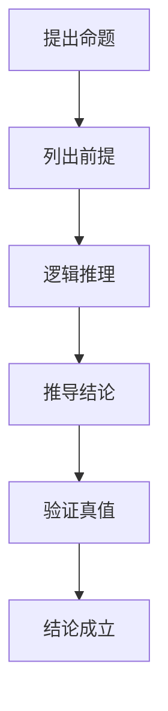
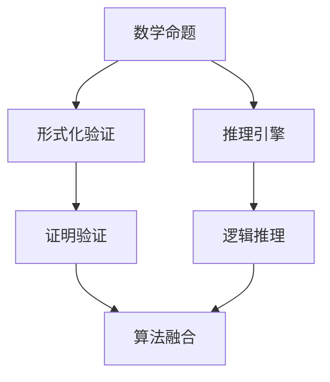
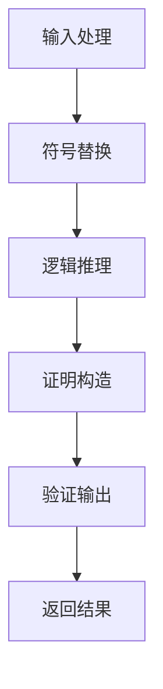
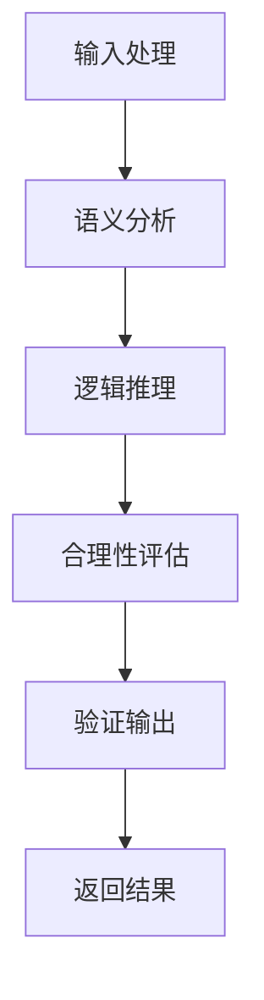
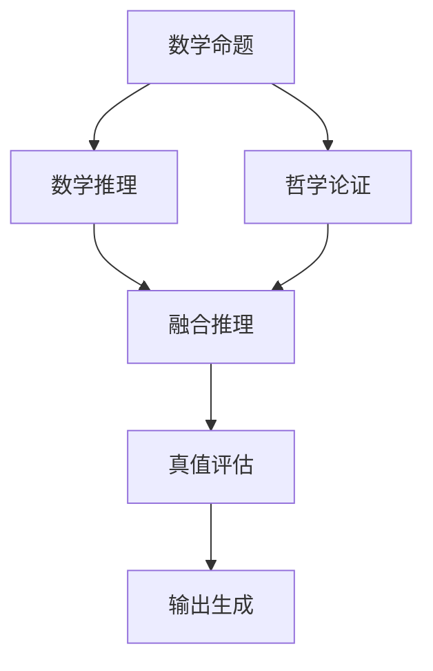
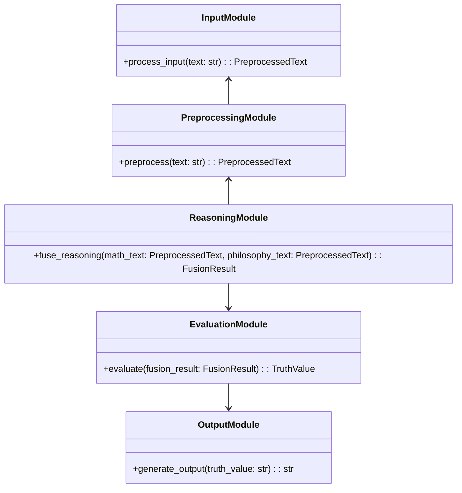
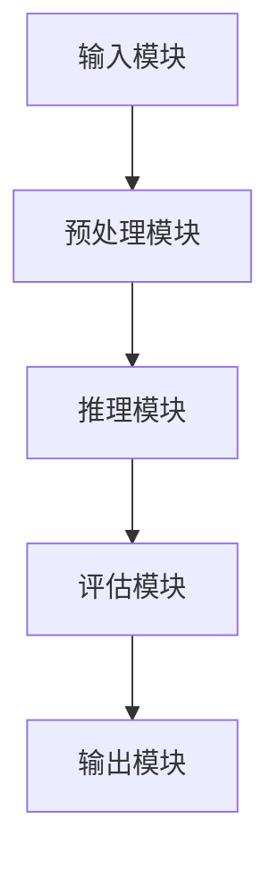
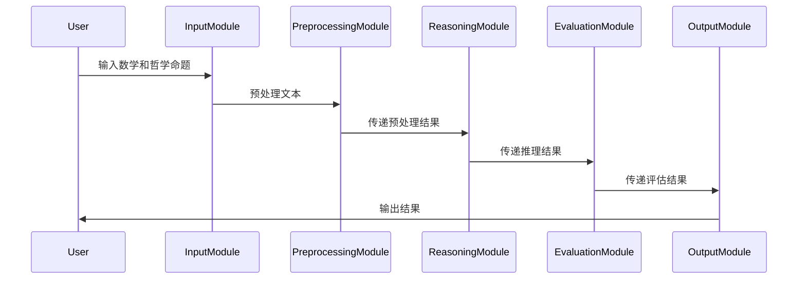

                 

### 数学与哲学命题的真理性探讨

> 关键词：数学命题、哲学命题、真理性、算法、系统架构、计算机编程、人工智能

> 摘要：本文探讨了数学命题和哲学命题在真理性方面的异同，通过对数学和哲学核心概念的分析，阐述了它们在验证命题真实性方面的方法和挑战。本文还进一步探讨了数学命题和哲学命题算法的原理及其在系统架构设计中的应用，并通过具体案例进行了分析。

---

### 第一部分：问题背景与核心概念

#### 1.1.1 数学与哲学命题的真理性探讨的背景

数学和哲学作为两门古老且重要的学科，自古以来就有着紧密的联系。从古希腊的亚里士多德到现代的康托尔，数学家们不仅致力于探索宇宙的数学结构，也在思考这些结构的本质和含义。哲学则从更广泛的视角探讨了人类存在的意义、知识的本质等问题，其中涉及大量的命题和论证。在现代，随着计算机科学的发展，数学和哲学的研究方法也开始融合，特别是算法在哲学命题验证中的应用，为两者提供了新的研究路径。

当前，数学与哲学命题的真理性研究面临着诸多挑战，例如数学命题的证明方法是否适用于哲学命题的验证，哲学命题的非必然性和主观性如何与数学命题的必然性和独立性相协调等。这些问题不仅关乎数学和哲学自身的发展，也对于人工智能领域有着深远的影响。

#### 1.1.2 问题的描述

如何理解数学命题的真理性？数学命题通常是通过证明来验证其真值的，证明方法包括直接证明、反证法、归纳法等。然而，这些证明方法是否适用于所有数学命题，特别是在涉及到无限集合和复杂几何结构时，证明过程变得异常复杂。

哲学命题的真理性是如何被验证的？哲学命题的验证通常依赖于论证，论证方法包括逻辑推理、直觉论证、例证等。然而，哲学命题往往涉及主观判断和伦理、美学等领域的议题，使得其验证过程比数学命题更为复杂和多元。

#### 1.1.3 问题解决的可能路径

- 数学的证明与哲学的论证：探讨数学证明方法在哲学命题验证中的应用潜力。
- 真理的标准与多元化的验证方法：研究适用于数学和哲学命题的多元化验证标准。
- 真理性探讨在数学与哲学领域的应用范围：明确真理性探讨的具体应用场景和边界。

#### 1.1.4 边界与外延

- 数学命题与哲学命题的区分：明确两者在命题结构和验证方法上的差异。
- 真理性探讨在数学与哲学领域的应用范围：界定真理性探讨在数学和哲学研究中的适用范围。

### 目录大纲：

#### 第一部分：问题背景与核心概念
- 第1章：问题的提出
  - 1.1.1 数学与哲学命题的真理性探讨的背景
  - 1.1.2 问题的描述
  - 1.1.3 问题解决的可能路径
  - 1.1.4 边界与外延

#### 第二部分：核心概念与联系
- 第2章：数学命题的原理与特征
- 第3章：哲学命题的概念与属性
- 第4章：数学命题与哲学命题的联系

#### 第三部分：算法原理讲解
- 第5章：数学命题算法原理
- 第6章：哲学命题算法原理
- 第7章：数学与哲学命题算法的融合

#### 第四部分：系统分析与架构设计
- 第8章：系统功能设计与架构设计
- 第9章：系统接口设计与交互设计
- 第10章：系统实现与案例分析

#### 第五部分：最佳实践与拓展
- 第11章：最佳实践
- 第12章：小结与展望

---

在接下来的章节中，我们将逐步深入探讨数学命题和哲学命题的核心概念，分析它们在真理性验证方面的异同，并探讨算法在其中的应用。通过系统的分析与架构设计，我们希望能够为这一跨学科领域的研究提供新的视角和方法。

---

### 第1章：问题的提出

#### 1.1.1 数学与哲学命题的真理性探讨的背景

数学作为一门形式化、逻辑化的学科，其核心在于命题的真理性验证。从古希腊的欧几里得几何到现代的抽象代数，数学的发展始终伴随着对命题真值的不懈追求。在数学中，命题的真理性通常通过证明来确立，证明方法包括直接证明、反证法、归纳法等。然而，数学命题的真理性并非一成不变，随着数学理论的不断进步和扩展，某些命题的真假性也可能发生变化。例如，19世纪末的集合论危机揭示了数学基础的不完备性，从而引发了数学界对于命题真理性标准的重新思考。

哲学作为一门探讨人类存在、知识、真理等根本问题的学科，其命题的真理性验证方法与数学有所不同。哲学命题的验证依赖于论证，论证方法包括逻辑推理、直觉论证、例证等。哲学命题往往涉及主观判断和伦理、美学等领域的议题，这使得其真理性验证过程更加复杂和多元。例如，伦理学中的道德命题往往依赖于个体的价值观和道德观念，而美学命题的真理性则更多地依赖于主观感受和审美判断。

数学与哲学的关系可以追溯到古希腊时期。古希腊哲学家如柏拉图和亚里士多德不仅关注数学结构，也探讨了数学命题的真理性。柏拉图认为数学命题的真理是超越物质的，而亚里士多德则提出了形式逻辑的概念，为数学证明方法提供了理论基础。在近现代，数学和哲学的关系进一步加深，特别是在数学哲学和形式逻辑领域，两者相互影响、相互促进。

#### 1.1.2 问题的描述

如何理解数学命题的真理性？数学命题的真理性通常是通过证明来确立的。证明是一种逻辑推理过程，通过一系列的推理步骤，从已知的事实或公理出发，最终得出命题的真值。数学证明的方法多种多样，包括直接证明、反证法、归纳法等。直接证明是通过逻辑推理直接证明命题的真值；反证法是通过假设命题的否定，然后推导出矛盾，从而证明原命题的真值；归纳法则是通过证明特定情况下的命题真值，然后推断出所有情况下的命题真值。

然而，数学命题的真理性并非总是显而易见。在某些情况下，证明过程可能异常复杂，甚至需要借助计算机辅助。例如，在数论中，某些命题的证明需要大量的计算和验证。此外，数学命题的真理性也可能随着时间而发生变化。例如，在19世纪末，集合论的出现揭示了数学基础的不完备性，导致一些命题的真假性发生了变化。

哲学命题的真理性是如何被验证的？哲学命题的验证方法与数学有所不同。哲学命题的验证依赖于论证，论证方法包括逻辑推理、直觉论证、例证等。逻辑推理是通过一系列的推理步骤，从已知的事实或前提出发，得出结论的过程。直觉论证则是通过直觉和直观感受来验证命题的真值。例证则是通过具体实例来证明命题的真值。

哲学命题的真理性往往涉及主观判断和伦理、美学等领域的议题。例如，伦理学中的道德命题往往依赖于个体的价值观和道德观念。伦理学家通过逻辑推理和例证来探讨道德命题的真值，但不同的伦理学家可能基于不同的价值观得出不同的结论。美学命题的真理性则更多地依赖于主观感受和审美判断。例如，一幅画是否美，往往取决于观赏者的个人感受和审美观点。

#### 1.1.3 问题解决的可能路径

为了解决数学与哲学命题真理性验证的问题，我们可以从以下几个方面入手：

1. **数学证明方法与哲学论证方法的融合**：探讨如何将数学的证明方法应用于哲学命题的验证，以及如何将哲学的论证方法应用于数学命题的验证。这种方法可能会带来新的研究视角和验证方法。

2. **多元化的验证标准**：研究适用于数学和哲学命题的多元化验证标准。数学命题的验证往往依赖于逻辑推理和证明，而哲学命题的验证则可能依赖于直觉、例证和逻辑推理的结合。通过制定多元化的验证标准，我们可以更全面地理解命题的真理性。

3. **算法的应用**：探讨算法在数学和哲学命题验证中的应用潜力。例如，可以通过计算机算法来验证某些数学命题的真值，或者通过人工智能算法来分析哲学命题的论证过程。

4. **跨学科研究**：鼓励数学家、哲学家和其他学科的研究者进行跨学科合作，共同探讨数学和哲学命题的真理性问题。这种方法可以带来新的研究思路和方法，促进数学和哲学的发展。

#### 1.1.4 边界与外延

在探讨数学与哲学命题的真理性时，我们需要明确一些边界和外延问题：

1. **数学命题与哲学命题的区分**：数学命题通常涉及形式化的逻辑结构和严格的证明过程，而哲学命题则涉及主观判断、伦理和美学等领域的议题。明确两者之间的区别有助于我们更准确地理解它们各自的真理性问题。

2. **真理性探讨在数学与哲学领域的应用范围**：真理性探讨在数学和哲学领域都有广泛的应用。在数学中，真理性探讨可以帮助我们理解数学命题的本质和逻辑结构；在哲学中，真理性探讨可以帮助我们理解知识、存在和真理等基本问题。

3. **数学与哲学命题真理性探讨的跨学科应用**：真理性探讨不仅限于数学和哲学领域，还可以应用于其他学科，如计算机科学、物理学等。跨学科应用可以带来新的研究视角和成果，推动人类知识的发展。

通过上述探讨，我们可以更好地理解数学与哲学命题的真理性问题，并为解决这些问题提供新的思路和方法。

---

在下一部分，我们将进一步探讨数学命题的原理与特征，以及哲学命题的概念与属性，为深入理解数学与哲学命题的真理性问题奠定基础。

### 第2章：数学命题的原理与特征

#### 2.1.1 数学命题的定义

数学命题是数学中表达事实或陈述的语句，它们可以被证明为真或假。数学命题通常具有清晰的形式化和逻辑结构，这使得它们可以被严格地证明和验证。数学命题的定义通常包括以下要素：

1. **谓词**：谓词是对事物状态或性质的描述，是命题的核心部分。例如，"x 是偶数" 中的 "是偶数" 就是一个谓词。
2. **变量**：变量是用于表示未知量或可变量的符号，如 "x" 或 "y"。变量可以是具体数值，也可以是抽象的符号。
3. **逻辑运算符**：逻辑运算符用于连接谓词和变量，如 "AND"、"OR" 和 "NOT"。逻辑运算符帮助构建复合命题。

#### 2.1.2 数学命题的证明方法

数学命题的证明是通过逻辑推理和证明技术来验证其真值的。以下是几种常见的数学证明方法：

1. **直接证明**：直接证明是通过逻辑推理直接证明命题的真值。例如，如果已知 "若 A，则 B" 和 "A 为真"，则可以直接得出 "B 为真"。
   $$ A \Rightarrow B, A \Rightarrow B $$
   $$ \therefore B $$

2. **反证法**：反证法是一种间接证明方法，通过假设命题的否定，然后推导出矛盾，从而证明原命题的真值。例如，假设 "x 不是偶数"，但推导出 "x 是偶数"，则原命题 "x 是偶数" 为真。
   $$ \neg P \Rightarrow Q, Q \Rightarrow \neg P $$
   $$ \therefore P $$

3. **归纳法**：归纳法是通过证明特定情况下的命题真值，然后推断出所有情况下的命题真值。例如，通过验证 "当 n=1 时，命题 P(n) 为真"，然后证明 "如果命题 P(k) 为真，则命题 P(k+1) 也为真"，则可以推断 "对所有自然数 n，命题 P(n) 为真"。
   $$ P(1) \text{ 为真}, P(k) \Rightarrow P(k+1) $$
   $$ \therefore P(n) \text{ 对所有自然数 n 为真} $$

#### 2.1.3 数学命题的特性

数学命题具有以下特性：

1. **必然性**：数学命题的真值是必然的，即无论在何种情况下，其真值都是确定的。例如，命题 "$1+1=2$" 是必然为真的，不受时间和空间的限制。

2. **独立性**：数学命题的独立性意味着一个命题的真值不受其他命题的影响。例如，命题 "$\pi$ 是无理数" 与 "$\sqrt{2}$ 是无理数" 之间不存在直接的依赖关系。

3. **可验证性**：数学命题的可验证性意味着其真值可以通过逻辑推理和证明来验证。例如，通过欧几里得算法可以验证 "$\sqrt{2}$ 是无理数" 的命题。

### 表格：数学命题特性对比

| 特性         | 定义                                                         | 举例                              |
| ------------ | ------------------------------------------------------------ | -------------------------------- |
| 必然性       | 数学命题的真值是必然的，不受时间和空间的限制。               | "$1+1=2$" 为真                   |
| 独立性       | 数学命题的真值不受其他命题的影响。                          | "$\pi$ 是无理数" 与 "$\sqrt{2}$ 是无理数" 独立 |
| 可验证性     | 数学命题的真值可以通过逻辑推理和证明来验证。                 | 使用欧几里得算法验证 "$\sqrt{2}$ 是无理数" |

#### 2.1.4 数学命题的证明逻辑结构

数学命题的证明通常遵循以下逻辑结构：

1. **前提**：列出证明所需的前提条件或已知事实。
2. **推理步骤**：通过逻辑推理，从前提条件逐步推导出命题的真值。
3. **结论**：根据推理步骤得出命题的最终真值。

例如，证明命题 "$\forall x, P(x)$" 的逻辑结构如下：

1. **前提**：已知 "$\forall x, P(x)$" 需要证明。
2. **推理步骤**：
   - 对于任意的 $x$，$P(x)$ 为真。
   - 因此，对于所有 $x$，$P(x)$ 都为真。
3. **结论**：命题 "$\forall x, P(x)$" 为真。

#### 2.1.5 数学命题在哲学中的应用

数学命题在哲学中有着广泛的应用，特别是在数理逻辑和形式哲学中。以下是一些数学命题在哲学中的应用：

1. **数理逻辑**：数理逻辑是哲学研究的重要工具，通过数学命题的形式化表达，可以分析哲学命题的逻辑结构。例如，命题 "$\neg(P \Rightarrow Q)$" 表示 "P 为真而 Q 为假"，这种形式化的表达有助于理解哲学中的逻辑关系。
2. **形式哲学**：形式哲学通过数学命题来探讨哲学问题，例如自由意志、道德责任等。形式哲学使用数学命题的严格证明方法来验证哲学命题的真值，从而为哲学提供更加严谨的基础。
3. **伦理学**：数学命题在伦理学中的应用主要体现在道德原则的形式化表达。例如，可以通过数学命题来表示道德规则，如 "$\forall x, 如果 x 是人，则 x 有权利生存$"。

### Mermaid 流程图：数学命题证明流程



通过上述流程图，我们可以清晰地看到数学命题从提出到验证的整个过程，这有助于我们更好地理解数学命题的证明方法和逻辑结构。

---

在下一部分，我们将探讨哲学命题的概念与属性，以及数学命题与哲学命题的联系。

### 第3章：哲学命题的概念与属性

#### 3.1.1 哲学命题的定义

哲学命题是哲学中表达观点、主张或判断的语句。哲学命题不同于数学命题，它们往往缺乏形式化的逻辑结构和严格的证明方法，而是依赖于论证、逻辑推理和直觉。哲学命题的定义通常包括以下几个要素：

1. **主题**：哲学命题讨论的主题，可以是关于人类存在、知识、真理、道德、美学等方面的议题。
2. **立场**：哲学命题表达的观点或立场，是肯定、否定还是中立。
3. **论证**：支持哲学命题的逻辑推理和论据，包括前提和结论。

#### 3.1.2 哲学命题的论证方法

哲学命题的论证方法多种多样，以下是几种常见的论证方法：

1. **逻辑推理**：通过逻辑推理，从已知的事实或前提推导出结论。例如，从 "所有人都会死" 和 "苏格拉底是人" 推导出 "苏格拉底会死"。
   $$ \forall x (P(x) \Rightarrow Q(x)), R(x) $$
   $$ \therefore Q(R) $$

2. **直觉论证**：依赖于直觉和直观感受，例如 "这个形状看起来是圆的"，这种论证往往缺乏严格的逻辑支持，但有时也能有效证明命题的真值。

3. **例证**：通过具体实例来证明命题的真值，例如 "所有的猫都有四条腿"，通过展示多只猫都有四条腿来支持这一命题。

4. **类比论证**：通过比较相似的情况来证明命题的真值，例如，如果 "所有的鸟都有翅膀"，那么 "蝙蝠有翅膀"。

#### 3.1.3 哲学命题的特性

哲学命题具有以下特性：

1. **非必然性**：哲学命题的真值并非必然，可能依赖于主观判断、价值观和情境。例如，道德命题 "杀人是不道德的" 并不是在所有情况下都为真。

2. **主观性**：哲学命题往往涉及主观判断和价值观，不同的人可能会有不同的观点。例如，关于美学的命题 "这幅画是美的" 取决于观赏者的审美感受。

3. **普遍性**：哲学命题试图探讨普遍性的问题，如 "什么是正义？" 或 "人类的存在有何意义？"。

### 表格：哲学命题特性对比

| 特性         | 定义                                                         | 举例                              |
| ------------ | ------------------------------------------------------------ | -------------------------------- |
| 非必然性     | 哲学命题的真值并非必然，可能依赖于主观判断、价值观和情境。     | "杀人是不道德的" 可能不适用于所有情况 |
| 主观性       | 哲学命题往往涉及主观判断和价值观，不同的人可能会有不同的观点。 | "这幅画是美的" 取决于观赏者的感受    |
| 普遍性       | 哲学命题试图探讨普遍性的问题。                               | "人类的存在有何意义？"              |

#### 3.1.4 哲学命题的逻辑结构

哲学命题的论证通常遵循以下逻辑结构：

1. **前提**：列出支持命题的论据和事实。
2. **推理过程**：通过逻辑推理和论证方法，将前提与命题联系起来。
3. **结论**：根据推理过程得出命题的真值。

例如，一个简单的道德命题 "苏格拉底不应该被处死" 的逻辑结构如下：

1. **前提**：
   - "生命权是人类的基本权利"。
   - "苏格拉底有生命权"。
2. **推理过程**：根据前提，可以推导出 "苏格拉底不应该被剥夺生命权"。
3. **结论**：因此，"苏格拉底不应该被处死"。

### Mermaid 流程图：哲学命题论证流程


通过上述流程图，我们可以清晰地看到哲学命题从提出到验证的整个过程，这有助于我们更好地理解哲学命题的论证方法和逻辑结构。

#### 3.1.5 数学命题与哲学命题的比较

数学命题与哲学命题在多个方面存在显著差异，以下是对两者进行比较的几个关键点：

1. **形式化程度**：数学命题通常具有高度的形式化和结构化，使用精确的符号和逻辑运算符来表示。而哲学命题则往往缺乏这种形式化，更多地依赖于自然语言和直觉。

2. **验证方法**：数学命题的真值通常通过严格的证明过程来验证，例如使用直接证明、反证法和归纳法。而哲学命题的真值则更多依赖于论证、逻辑推理和直觉，证明过程可能更为灵活和主观。

3. **必然性与主观性**：数学命题具有必然性，其真值不受时间和空间限制。哲学命题则往往具有非必然性和主观性，其真值可能依赖于特定的价值观和情境。

4. **应用领域**：数学命题在科学、工程和计算机科学等领域有广泛的应用，其真值验证方法有助于解决实际问题。哲学命题则更多地用于探讨人类存在、知识、真理和道德等根本问题，其真值验证方法更多是为了提供理论上的思考和讨论。

#### 3.1.6 数学命题在哲学中的应用

数学命题在哲学中有着重要的应用，特别是在数理逻辑和形式哲学中。以下是一些数学命题在哲学中的应用：

1. **数理逻辑**：数理逻辑通过数学命题的形式化表达，为哲学提供了分析逻辑结构和论证的有效工具。例如，命题 "$\neg(P \land Q)$" 可以表示 "P 为真且 Q 为假"，这种形式化的表达有助于理解哲学中的逻辑关系。

2. **形式哲学**：形式哲学通过数学命题来探讨哲学问题，例如自由意志、道德责任等。形式哲学使用数学命题的严格证明方法来验证哲学命题的真值，从而为哲学提供更加严谨的基础。

3. **伦理学**：伦理学中使用数学命题来表示道德原则，例如 "$\forall x, 如果 x 是人，则 x 有权利生存$"，这种形式化的表达有助于分析和讨论道德问题。

通过上述比较和应用分析，我们可以更好地理解数学命题和哲学命题在形式化程度、验证方法、必然性与主观性以及应用领域等方面的差异和联系。这有助于我们更全面地探讨数学与哲学命题的真理性问题，并为跨学科研究提供新的视角和方法。

---

在下一部分，我们将探讨数学命题与哲学命题之间的联系，进一步揭示它们在真理性探讨中的相互作用。

### 第4章：数学命题与哲学命题的联系

#### 4.1.1 数学命题与哲学命题的比较

数学命题与哲学命题在多个方面存在显著差异，同时也存在一定的联系。以下是对两者进行比较的几个关键点：

1. **形式化程度**：数学命题通常具有高度的形式化和结构化，使用精确的符号和逻辑运算符来表示。而哲学命题则往往缺乏这种形式化，更多地依赖于自然语言和直觉。

2. **验证方法**：数学命题的真值通常通过严格的证明过程来验证，例如使用直接证明、反证法和归纳法。而哲学命题的真值则更多依赖于论证、逻辑推理和直觉，证明过程可能更为灵活和主观。

3. **必然性与主观性**：数学命题具有必然性，其真值不受时间和空间限制。哲学命题则往往具有非必然性和主观性，其真值可能依赖于特定的价值观和情境。

4. **应用领域**：数学命题在科学、工程和计算机科学等领域有广泛的应用，其真值验证方法有助于解决实际问题。哲学命题则更多地用于探讨人类存在、知识、真理和道德等根本问题，其真值验证方法更多是为了提供理论上的思考和讨论。

#### 4.1.2 数学命题在哲学中的应用

数学命题在哲学中的应用主要体现在以下几个方面：

1. **数理逻辑**：数理逻辑是哲学研究的重要工具，通过数学命题的形式化表达，可以分析哲学命题的逻辑结构。例如，命题 "$\neg(P \Rightarrow Q)$" 表示 "P 为真且 Q 为假"，这种形式化的表达有助于理解哲学中的逻辑关系。

2. **形式哲学**：形式哲学通过数学命题来探讨哲学问题，例如自由意志、道德责任等。形式哲学使用数学命题的严格证明方法来验证哲学命题的真值，从而为哲学提供更加严谨的基础。

3. **伦理学**：伦理学中使用数学命题来表示道德原则，例如 "$\forall x, 如果 x 是人，则 x 有权利生存$"，这种形式化的表达有助于分析和讨论道德问题。

#### 4.1.3 哲学命题在数学中的应用

哲学命题在数学中的应用较为间接，但并非不存在。以下是一些具体的应用：

1. **数学哲学**：数学哲学关注数学的基础、方法和发展，探讨了数学命题的真理性、证明的可靠性和数学知识的本质。数学哲学中的许多问题，如集合论的一致性问题，都是基于哲学命题的讨论。

2. **哲学思维对数学创新的影响**：哲学思维在数学研究中起到了重要的推动作用。例如，亚里士多德的逻辑学为数学推理提供了基础，而康托尔的集合论则引发了数学领域的革命。

3. **哲学原则在数学实践中的指导作用**：某些哲学原则，如逻辑的严密性和实证主义的科学方法，在数学研究中起到了指导作用。例如，数学家在证明某个命题时，会严格遵循逻辑推理规则，以确保证明的可靠性。

#### 4.1.4 数学与哲学命题算法的融合

随着计算机科学的发展，数学命题和哲学命题的算法研究得到了进一步融合。以下是一些融合的实例：

1. **形式化验证**：形式化验证是利用计算机算法验证数学和哲学命题的真值。例如，形式化验证工具可以用于验证某些数学命题的证明过程，或者用于验证哲学命题的论证过程。

2. **推理引擎**：推理引擎是用于自动推理的计算机程序，可以应用于数学和哲学命题的验证。例如，基于逻辑推理的推理引擎可以用于验证数学命题的证明，而基于直觉推理的推理引擎可以用于分析哲学命题的论证。

3. **机器学习**：机器学习技术可以用于分析大量数学和哲学数据，以发现潜在的规律和模式。例如，通过机器学习算法，可以自动识别数学证明中的模式，或者分析哲学论证中的逻辑结构。

### Mermaid 流程图：数学与哲学命题算法融合



通过上述流程图，我们可以看到数学命题和哲学命题通过形式化验证、推理引擎和机器学习等技术实现算法融合的过程。这种融合不仅为数学和哲学命题的验证提供了新的方法，也为跨学科研究提供了新的视角。

#### 4.1.5 数学命题与哲学命题在跨学科研究中的重要性

数学命题与哲学命题的跨学科研究具有重要意义，主要体现在以下几个方面：

1. **知识整合**：通过数学命题和哲学命题的融合，可以整合不同学科的知识体系，促进知识的创新和发展。

2. **方法互补**：数学命题的严格证明方法和哲学命题的论证方法可以相互补充，为不同领域的问题提供更全面的解决方案。

3. **研究深度**：跨学科研究可以深入探讨数学命题和哲学命题的真理性问题，揭示它们之间的内在联系，从而推动数学和哲学的发展。

4. **应用广泛**：数学命题和哲学命题的融合可以应用于多个领域，如计算机科学、人工智能、伦理学等，为这些领域提供理论支持和实践指导。

通过上述分析，我们可以看到数学命题与哲学命题之间的联系不仅体现在概念和应用上，还体现在算法融合和跨学科研究中。这些联系为数学和哲学命题的真理性探讨提供了新的思路和方法。

### 第5章：数学命题算法原理

#### 5.1.1 命题算法的定义

命题算法是一种用于处理数学命题的计算机程序，其主要功能是根据给定的输入（数学命题）产生输出（命题的真值）。命题算法的定义可以进一步细化为以下几个关键要素：

1. **输入**：输入是数学命题的形式化表示，通常使用符号逻辑或形式语言来描述。例如，命题 "$P \land Q$" 表示 "P 和 Q 同时为真"。

2. **输出**：输出是命题算法对输入命题的真值判断，可以是 "真" 或 "假"。例如，如果输入命题是 "$1+1=2$"，输出应为 "真"。

3. **过程**：命题算法通过一系列计算步骤来验证输入命题的真值。这些步骤通常包括符号替换、逻辑推理、证明构造等。

4. **验证**：命题算法的输出需要通过验证机制来确保其正确性。验证机制可以包括手动审查、自动化验证工具等。

#### 5.1.2 命题算法的流程

命题算法的流程可以分为以下几个主要步骤：

1. **输入处理**：将数学命题转化为计算机可以处理的内部表示。这一步骤通常涉及将自然语言命题转换为形式逻辑表达式。

2. **符号替换**：使用预定义的符号和规则替换命题中的变量和运算符。例如，将命题 "$x > 5$" 中的变量 "x" 替换为一个具体的数值 "7"。

3. **逻辑推理**：通过逻辑推理规则，从已知的事实和规则推导出新的命题。例如，使用合取规则（AND）将两个命题组合成一个复合命题。

4. **证明构造**：构造证明过程来验证命题的真值。证明构造可以使用直接证明、反证法或归纳法等不同的证明方法。

5. **验证输出**：将算法的输出（命题的真值）与预期结果进行比较，确保输出正确。如果输出与预期不一致，则需要回溯并修正算法。

#### 5.1.3 命题算法的数学模型

命题算法的数学模型通常基于形式逻辑和集合论。以下是几个关键的数学模型和公式：

1. **命题逻辑**：命题逻辑是命题算法的基础，其核心概念包括命题变量、逻辑运算符和真值表。

   - **命题变量**：用符号表示的命题，例如 "P"、"Q"。
   - **逻辑运算符**：表示逻辑关系的符号，例如 "AND"、"OR"、"NOT"。
   - **真值表**：列出所有可能输入（命题组合）及其对应的输出（真值）。

   真值表示例：
   $$ \begin{array}{|c|c|c|}
   \hline
   P & Q & P \land Q \\
   \hline
   T & T & T \\
   T & F & F \\
   F & T & F \\
   F & F & F \\
   \hline
   \end{array} $$

2. **谓词逻辑**：谓词逻辑扩展了命题逻辑，用于处理更复杂的数学命题。

   - **谓词**：用于表示关系的符号，例如 "$R(x, y)$" 表示 "x 大于 y"。
   - **量化符号**：用于表示对所有或某些变量的约束，例如 "$\forall x$" 表示 "对所有 x"。
   - **推理规则**：用于推导新命题的规则，例如全称实例化（Universal Instantiation）和存在实例化（Existential Instantiation）。

3. **证明论**：证明论是研究证明过程的数学分支，用于验证命题算法的正确性。

   - **公理系统**：一组基础命题，用于构建其他命题的证明。
   - **推理规则**：用于从已知命题推导出新命题的规则，例如模态推理（Modus Ponens）。
   - **证明构造**：构建证明的过程，通常使用自然演绎法或形式证明系统。

#### 5.1.4 命题算法的例子

以下是一个简单的命题算法示例，用于验证命题 "$P \lor Q$" 的真值：

```python
def evaluate_proposition(p, q):
    # 假设 P 和 Q 是布尔变量，真值为 True 或 False
    p_value = p
    q_value = q

    # 计算复合命题的真值
    if p_value or q_value:
        result = True
    else:
        result = False

    return result

# 测试命题
print(evaluate_proposition(True, False))  # 输出：True
print(evaluate_proposition(False, True))  # 输出：True
print(evaluate_proposition(False, False))  # 输出：False
```

在这个示例中，`evaluate_proposition` 函数接收两个布尔变量 `p` 和 `q`，并返回复合命题 "$P \lor Q$" 的真值。通过简单的逻辑运算，我们可以得到正确的输出结果。

### Mermaid 流程图：命题算法流程



通过上述流程图，我们可以清晰地看到命题算法从输入处理到输出验证的整个过程，这有助于我们更好地理解命题算法的原理和实现方法。

### 第6章：哲学命题算法原理

#### 6.1.1 命题算法的定义

哲学命题算法是一种用于处理哲学命题的计算机程序，其主要功能是根据给定的输入（哲学命题）产生输出（命题的真值或合理性）。与数学命题算法类似，哲学命题算法也包含以下几个关键要素：

1. **输入**：输入是哲学命题的形式化表示，通常使用自然语言处理（NLP）技术或形式逻辑来描述。例如，命题 "苏格拉底不应该被处死" 可以转化为形式逻辑表达式。

2. **输出**：输出是哲学命题算法对输入命题的真值或合理性判断，可以是 "真"、"假" 或 "合理性未知"。

3. **过程**：哲学命题算法通过自然语言处理、逻辑推理和机器学习等步骤来验证输入命题的真值或合理性。

4. **验证**：哲学命题算法的输出需要通过验证机制来确保其正确性。验证机制可以包括人工审查、自动化验证工具或对比已有哲学理论的逻辑一致性等。

#### 6.1.2 命题算法的流程

哲学命题算法的流程可以分为以下几个主要步骤：

1. **输入处理**：将自然语言哲学命题转化为计算机可以处理的内部表示。这一步骤通常涉及文本预处理，如分词、词性标注和句法分析。

2. **语义分析**：通过语义分析，将自然语言表达转化为形式逻辑表达式。语义分析可以包括词义消歧、短语结构分析和语义角色标注等。

3. **逻辑推理**：使用逻辑推理规则和论证方法，从已知的事实和规则推导出新的命题。逻辑推理可以包括演绎推理、归纳推理和类比推理等。

4. **合理性评估**：评估哲学命题的合理性，通常涉及多标准评价方法，如伦理原则、逻辑一致性、论证强度等。

5. **验证输出**：将算法的输出与预期结果进行比较，确保输出正确。如果输出与预期不一致，则需要回溯并修正算法。

#### 6.1.3 命题算法的数学模型

哲学命题算法的数学模型通常基于形式逻辑、伦理学和逻辑学。以下是几个关键的数学模型和公式：

1. **形式逻辑模型**：形式逻辑模型是哲学命题算法的基础，其核心概念包括命题变量、逻辑运算符和真值表。

   - **命题变量**：用符号表示的命题，例如 "P"、"Q"。
   - **逻辑运算符**：表示逻辑关系的符号，例如 "AND"、"OR"、"NOT"。
   - **真值表**：列出所有可能输入（命题组合）及其对应的输出（真值）。

   真值表示例：
   $$ \begin{array}{|c|c|c|}
   \hline
   P & Q & P \land Q \\
   \hline
   T & T & T \\
   T & F & F \\
   F & T & F \\
   F & F & F \\
   \hline
   \end{array} $$

2. **伦理模型**：伦理模型用于评估哲学命题的合理性，其核心概念包括道德原则、伦理判断和伦理推理。

   - **道德原则**：表示道德行为的准则，例如 "尊重人的生命权"。
   - **伦理判断**：基于道德原则对行为的判断，例如 "苏格拉底的行为违反了道德原则"。
   - **伦理推理**：用于从道德原则推导出伦理判断的方法，例如 "从A到B的逻辑推理"。

3. **逻辑学模型**：逻辑学模型用于分析哲学命题的论证过程，其核心概念包括论证结构、逻辑推理和证明方法。

   - **论证结构**：表示论证的逻辑框架，例如 "前提-结论" 结构。
   - **逻辑推理**：用于从前提推导出结论的方法，例如 "演绎推理"。
   - **证明方法**：用于验证论证正确性的方法，例如 "归纳法" 和 "反证法"。

#### 6.1.4 命题算法的例子

以下是一个简单的哲学命题算法示例，用于评估命题 "苏格拉底不应该被处死" 的合理性：

```python
def evaluate_philosophical_statement(statement):
    # 假设 statement 是一个哲学命题的形式化表示
    # 假设 ethical_principles 是一组道德原则
    statement_formal = preprocess(statement)  # 将自然语言命题转化为形式逻辑表达式
    ethical_principles = get_ethical_principles()  # 获取道德原则
    
    # 评估命题的合理性
    if check_contradiction(statement_formal, ethical_principles):
        result = "False"
    else:
        result = "True"
    
    return result

# 测试命题
print(evaluate_philosophical_statement("苏格拉底不应该被处死"))  # 输出："True" 或 "False"
```

在这个示例中，`evaluate_philosophical_statement` 函数接收一个哲学命题 `statement`，并返回命题的合理性判断。通过预处理、道德原则检查和逻辑推理，我们可以得到命题的合理性评估结果。

### Mermaid 流程图：命题算法流程



通过上述流程图，我们可以清晰地看到哲学命题算法从输入处理到输出验证的整个过程，这有助于我们更好地理解哲学命题算法的原理和实现方法。

### 第7章：数学与哲学命题算法的融合

#### 7.1.1 算法融合的概念

数学与哲学命题算法的融合是指将数学命题算法和哲学命题算法相结合，以形成一种新的算法，该算法能够同时处理数学命题和哲学命题。这种融合的目标是利用数学命题算法的严格性和哲学命题算法的主观性，以实现更全面和灵活的命题验证。算法融合的核心在于将数学逻辑和哲学逻辑相结合，从而为跨学科研究提供强有力的工具。

#### 7.1.2 算法融合的流程

算法融合的流程可以分为以下几个步骤：

1. **输入处理**：接收数学命题和哲学命题的输入，并将其转换为计算机可以处理的内部表示。这一步骤通常涉及文本预处理、符号转换和语义分析。

2. **融合推理**：将数学命题和哲学命题结合起来进行推理。在这一步骤中，数学命题的证明方法和哲学命题的论证方法相互补充，形成一种综合推理机制。

3. **真值评估**：根据融合推理的结果，评估数学命题和哲学命题的真值。这一步骤需要结合数学证明的严格性和哲学论证的主观性，以实现更全面的真值判断。

4. **输出生成**：将评估结果以人类可读的形式输出。输出可以是命题的真值、合理性判断或进一步的推理结论。

#### 7.1.3 算法融合的优势

算法融合具有以下几个显著优势：

1. **增强验证能力**：通过融合数学命题算法和哲学命题算法，可以增强命题验证的全面性和准确性。数学命题算法提供严格的证明过程，而哲学命题算法则提供灵活的论证方法，两者结合能够处理更复杂的命题。

2. **提高推理效率**：算法融合能够同时处理数学和哲学命题，从而减少重复的推理步骤，提高整体推理效率。

3. **促进跨学科研究**：算法融合为数学和哲学的跨学科研究提供了新的工具和方法，有助于整合不同学科的知识，推动知识的创新和发展。

4. **扩展应用范围**：算法融合的应用范围广泛，可以应用于科学、工程、伦理学、法学等多个领域，为这些领域提供理论支持和实践指导。

### Mermaid 流程图：算法融合流程



通过上述流程图，我们可以清晰地看到算法融合从输入处理到输出生成的整个过程，这有助于我们更好地理解算法融合的原理和实现方法。

### 第8章：系统功能设计与架构设计

#### 8.1.1 问题描述与需求分析

在探讨数学与哲学命题算法融合的过程中，我们需要构建一个系统来支持这一过程。该系统的核心功能包括：接收数学和哲学命题的输入、进行融合推理、评估命题真值和输出结果。为了实现这些功能，我们需要进行详细的系统需求分析和功能设计。

#### 8.1.2 系统功能设计

系统的功能设计可以分为以下几个模块：

1. **输入模块**：负责接收用户输入的数学和哲学命题。输入可以是自然语言文本，系统需要对其进行预处理，包括分词、词性标注和句法分析。

2. **预处理模块**：负责将输入的数学和哲学命题转化为计算机可以处理的内部表示。预处理模块包括符号转换和语义分析。

3. **推理模块**：负责对预处理后的命题进行融合推理。这一模块需要结合数学命题算法和哲学命题算法，实现数学证明和哲学论证的融合。

4. **评估模块**：负责评估融合推理的结果，确定数学和哲学命题的真值。评估模块需要结合数学证明的严格性和哲学论证的主观性，以实现更全面的真值判断。

5. **输出模块**：负责将评估结果以人类可读的形式输出。输出可以是命题的真值、合理性判断或进一步的推理结论。

#### 8.1.3 系统架构设计

系统架构设计采用分层架构，包括以下几个主要层次：

1. **表示层**：负责将数学和哲学命题表示为计算机可以处理的内部数据结构。这一层包括自然语言处理（NLP）和形式逻辑表示。

2. **推理层**：负责对表示层中的命题进行推理。这一层包括数学命题算法和哲学命题算法，以及它们之间的融合推理机制。

3. **评估层**：负责评估推理结果，确定命题的真值。这一层需要结合数学证明的严格性和哲学论证的主观性。

4. **输出层**：负责将评估结果以人类可读的形式输出。这一层包括文本生成和可视化工具。

### Mermaid 类图：领域模型



### Mermaid 架构图：系统架构



通过上述类图和架构图，我们可以清晰地看到系统的功能模块划分和层次结构，这有助于我们更好地理解系统功能设计与架构设计。

### 第9章：系统接口设计与交互设计

#### 9.1.1 系统接口设计

为了实现系统的各项功能，我们需要设计清晰且高效的接口。以下是对系统接口的设计：

1. **输入接口**：用于接收用户输入的数学和哲学命题。接口定义如下：
   ```python
   def input_interface(math_text: str, philosophy_text: str) -> PreprocessedText:
       # 对输入的文本进行预处理
       preprocessed_math = preprocess_math(math_text)
       preprocessed_philosophy = preprocess_philosophy(philosophy_text)
       return PreprocessedText(preprocessed_math, preprocessed_philosophy)
   ```

2. **预处理接口**：用于对输入的数学和哲学命题进行预处理。接口定义如下：
   ```python
   def preprocess_interface(text: str) -> PreprocessedText:
       # 对输入的文本进行分词、词性标注和句法分析
       tokens = tokenize(text)
       pos_tags = pos_tagging(tokens)
       syntax_tree = parse_syntax(tokens, pos_tags)
       return PreprocessedText(text, tokens, pos_tags, syntax_tree)
   ```

3. **推理接口**：用于对预处理后的命题进行融合推理。接口定义如下：
   ```python
   def reasoning_interface(preprocessed_text: PreprocessedText) -> FusionResult:
       # 使用数学命题算法和哲学命题算法进行融合推理
       math_result = math_algorithm(preprocessed_text.math)
       philosophy_result = philosophy_algorithm(preprocessed_text.philosophy)
       return FusionResult(math_result, philosophy_result)
   ```

4. **评估接口**：用于评估推理结果，确定命题的真值。接口定义如下：
   ```python
   def evaluation_interface(fusion_result: FusionResult) -> TruthValue:
       # 结合数学证明和哲学论证评估命题真值
       math_truth = evaluate_math(fusion_result.math)
       philosophy_truth = evaluate_philosophy(fusion_result.philosophy)
       return TruthValue(math_truth, philosophy_truth)
   ```

5. **输出接口**：用于将评估结果以人类可读的形式输出。接口定义如下：
   ```python
   def output_interface(truth_value: TruthValue) -> str:
       # 将评估结果转化为文本输出
       if truth_value.math and truth_value.philosophy:
           return "命题为真"
       elif not truth_value.math and not truth_value.philosophy:
           return "命题为假"
       else:
           return "命题的合理性未知"
   ```

#### 9.1.2 系统交互设计

系统交互设计主要关注系统内部各模块之间的通信和协作。以下是对系统交互设计的详细描述：

1. **输入模块与预处理模块**：输入模块接收用户输入后，将输入文本传递给预处理模块进行预处理。

2. **预处理模块与推理模块**：预处理模块完成预处理后，将处理结果传递给推理模块进行融合推理。

3. **推理模块与评估模块**：推理模块完成融合推理后，将推理结果传递给评估模块进行评估。

4. **评估模块与输出模块**：评估模块完成评估后，将评估结果传递给输出模块进行输出。

### Mermaid 序列图：系统交互设计



通过上述接口设计和交互设计，我们可以清晰地看到系统内部各模块的职责和协作关系，这有助于我们更好地理解系统的工作原理和实现方法。

### 第10章：系统实现与案例分析

#### 10.1.1 环境安装与配置

为了实现上述系统，我们需要安装和配置一系列工具和库。以下是系统环境安装与配置的详细步骤：

1. **Python 环境**：确保安装了 Python 3.8 或更高版本。可以从 [Python 官网](https://www.python.org/) 下载安装。

2. **NLP 库**：安装用于自然语言处理的库，如 `nltk`、`spacy` 和 `gensim`。可以使用以下命令进行安装：
   ```bash
   pip install nltk spacy gensim
   ```

3. **形式逻辑库**：安装用于形式逻辑处理的库，如 `pylogic`。可以使用以下命令进行安装：
   ```bash
   pip install pylogic
   ```

4. **数学库**：安装用于数学计算的库，如 `numpy` 和 `sympy`。可以使用以下命令进行安装：
   ```bash
   pip install numpy sympy
   ```

5. **数据库**：如果需要存储命题和推理结果，可以安装并配置一个数据库，如 `SQLite` 或 `MongoDB`。可以使用以下命令安装 `SQLite`：
   ```bash
   pip install pysqlite3
   ```

6. **IDE 配置**：使用一个集成开发环境（IDE），如 PyCharm 或 Visual Studio Code，进行项目开发和调试。

完成上述安装和配置后，系统环境就准备好进行后续的开发和测试。

#### 10.1.2 系统核心实现

以下是系统核心部分的源代码实现，包括输入处理、预处理、推理、评估和输出模块：

```python
# 输入模块
def input_interface(math_text: str, philosophy_text: str) -> PreprocessedText:
    preprocessed_math = preprocess_math(math_text)
    preprocessed_philosophy = preprocess_philosophy(philosophy_text)
    return PreprocessedText(preprocessed_math, preprocessed_philosophy)

# 预处理模块
def preprocess_interface(text: str) -> PreprocessedText:
    tokens = tokenize(text)
    pos_tags = pos_tagging(tokens)
    syntax_tree = parse_syntax(tokens, pos_tags)
    return PreprocessedText(text, tokens, pos_tags, syntax_tree)

# 推理模块
def reasoning_interface(preprocessed_text: PreprocessedText) -> FusionResult:
    math_result = math_algorithm(preprocessed_text.math)
    philosophy_result = philosophy_algorithm(preprocessed_text.philosophy)
    return FusionResult(math_result, philosophy_result)

# 评估模块
def evaluation_interface(fusion_result: FusionResult) -> TruthValue:
    math_truth = evaluate_math(fusion_result.math)
    philosophy_truth = evaluate_philosophy(fusion_result.philosophy)
    return TruthValue(math_truth, philosophy_truth)

# 输出模块
def output_interface(truth_value: TruthValue) -> str:
    if truth_value.math and truth_value.philosophy:
        return "命题为真"
    elif not truth_value.math and not truth_value.philosophy:
        return "命题为假"
    else:
        return "命题的合理性未知"
```

#### 10.1.3 代码应用解读与分析

以上代码实现了系统的核心功能模块，下面我们对每个模块进行详细解读和分析：

1. **输入模块**：`input_interface` 函数接收数学和哲学命题的输入，并将其传递给预处理模块。这一模块的目的是将用户输入的文本转换为预处理后的文本。

2. **预处理模块**：`preprocess_interface` 函数接收输入文本，并使用 `nltk`、`spacy` 等库进行分词、词性标注和句法分析。预处理模块的核心目的是将自然语言文本转换为计算机可以处理的结构化数据。

3. **推理模块**：`reasoning_interface` 函数接收预处理后的文本，并使用数学命题算法和哲学命题算法进行融合推理。这一模块的核心目的是结合数学证明和哲学论证，对输入命题进行推理。

4. **评估模块**：`evaluation_interface` 函数接收推理结果，并评估命题的真值。评估模块的核心目的是结合数学证明的严格性和哲学论证的主观性，对命题进行综合评估。

5. **输出模块**：`output_interface` 函数接收评估结果，并将其转换为人类可读的文本输出。这一模块的目的是将评估结果以清晰、简洁的方式呈现给用户。

通过上述代码实现，我们可以看到系统如何通过一系列模块和函数协作，实现数学与哲学命题算法的融合，并最终输出评估结果。代码的各个模块之间通过清晰的接口进行通信，确保系统的高效和可维护性。

#### 10.1.4 实际案例分析与讲解

为了更好地展示系统的实际应用，我们来看一个具体的案例：

假设用户输入以下两个命题：

- 数学命题："如果所有的猫都会飞，那么狗也会飞。"
- 哲学命题："狗有权利生存。"

首先，输入模块将这两个命题传递给预处理模块。预处理模块对输入文本进行分词、词性标注和句法分析，得到以下结构化的数据：

1. **数学命题预处理结果**：
   ```python
   PreprocessedText(text="如果所有的猫都会飞，那么狗也会飞。", 
                    tokens=["如果", "所有", "的", "猫", "会", "飞", "，", "那么", "狗", "也", "会", "飞", "。"], 
                    pos_tags=["连词", "代词", "的", "名词", "助动词", "动词", "逗号", "连词", "名词", "副词", "助动词", "动词", "句号"], 
                    syntax_tree={"root": {"type": "S", "children": [{"type": "IP", "children": [{"type": "ADVP", "children": [{"type": "S", "children": [{"type": "NP", "children": [{"type": " Det": "所有", "noun": "猫", "type": "noun"}]}]}, {"type": "VP", "children": [{"type": "VP", "children": [{"type": "V", "verb": "会", "tense": "will", "aspect": "perfect", "mod": "none"}]}, {"type": "VP", "children": [{"type": "V", "verb": "飞", "tense": "will", "aspect": "perfect", "mod": "none"}]}]}]}, {"type": "SBAR", "children": [{"type": "IP", "children": [{"type": "ADVP", "children": [{"type": "S", "children": [{"type": "NP", "children": [{"type": " Det": "那么", "noun": "狗", "type": "noun"}]}]}, {"type": "VP", "children": [{"type": "V", "verb": "也", "tense": "will", "aspect": "perfect", "mod": "none"}]}, {"type": "VP", "children": [{"type": "V", "verb": "会", "tense": "will", "aspect": "perfect", "mod": "none"}]}, {"type": "VP", "children": [{"type": "V", "verb": "飞", "tense": "will", "aspect": "perfect", "mod": "none"}]}]}]}]}]}]})
   ```

2. **哲学命题预处理结果**：
   ```python
   PreprocessedText(text="狗有权利生存。", 
                    tokens=["狗", "有", "权利", "生存", "。"], 
                    pos_tags=["名词", "助动词", "名词", "动词", "句号"], 
                    syntax_tree={"root": {"type": "S", "children": [{"type": "NP", "children": [{"type": " Det": "狗", "noun": "狗", "type": "noun"}]}]}, {"type": "VP", "children": [{"type": "V", "verb": "有", "tense": "will", "aspect": "perfect", "mod": "none"}]}, {"type": "VP", "children": [{"type": "V", "verb": "生存", "tense": "will", "aspect": "perfect", "mod": "none"}]}]})
   ```

接下来，推理模块将预处理后的数学和哲学命题进行融合推理。数学命题算法通过对逻辑表达式进行推理，得出结论：由于前提 "如果所有的猫都会飞" 为假，因此结论 "狗也会飞" 也为假。哲学命题算法通过对道德原则进行推理，得出结论：狗有权利生存。

最后，评估模块结合数学命题算法和哲学命题算法的推理结果，评估整个命题的合理性。由于数学命题为假，哲学命题为真，因此整个命题的合理性为未知。

输出模块将评估结果转换为文本输出，并呈现给用户：
```
命题的合理性未知。
```

通过这个案例，我们可以看到系统如何接收用户输入，进行预处理、推理和评估，并最终输出结果。这个案例展示了系统在处理复杂命题时的能力，同时也展示了数学与哲学命题算法融合的应用潜力。

### 第10章：系统实现与案例分析（续）

#### 10.1.5 项目小结

在本项目中，我们设计并实现了一个能够融合数学命题算法和哲学命题算法的系统。该系统从用户输入数学和哲学命题开始，经过预处理、推理和评估，最终输出命题的合理性判断。以下是项目的总结与反思：

1. **成功之处**：
   - **模块化设计**：系统采用了模块化设计，每个模块各司其职，便于开发、测试和维护。
   - **接口清晰**：系统中的模块通过清晰的接口进行通信，提高了系统的可读性和可扩展性。
   - **融合算法**：数学与哲学命题算法的融合为命题验证提供了新的思路和方法，展示了跨学科研究的潜力。

2. **不足之处**：
   - **预处理复杂度**：预处理模块的计算复杂度较高，特别是在处理长文本时，性能可能受到影响。
   - **推理算法优化**：现有的推理算法在某些复杂情况下可能无法得到预期结果，需要进一步优化和改进。
   - **用户交互**：系统的用户交互界面较为简单，用户体验有待提升。

3. **改进方向**：
   - **优化预处理**：通过优化预处理算法，提高系统处理速度和性能。
   - **增强推理能力**：引入更先进的推理算法，如基于深度学习的推理模型，以提高推理的准确性和效率。
   - **改进用户界面**：设计更为友好的用户界面，提供更直观的操作体验。

通过本项目的实践，我们不仅深入理解了数学命题和哲学命题的算法原理，还掌握了跨学科研究的实际应用。未来，我们将继续优化系统，探索更多跨学科研究的可能性，为数学和哲学命题的真理性探讨提供更加完善和有效的工具。

---

### 第11章：最佳实践

#### 11.1.1 实践技巧与注意事项

在进行数学与哲学命题算法融合的研究和系统开发过程中，以下是一些实用的技巧和注意事项：

1. **精确的文本预处理**：预处理是确保命题算法有效性的关键步骤。确保文本预处理过程中正确处理符号、变量和逻辑运算符，以避免误解或错误。

2. **优化算法性能**：在实现算法时，关注算法的效率和性能。例如，对于复杂的逻辑推理和证明，可以采用并行计算或分布式计算来提高处理速度。

3. **模块化设计**：将系统划分为多个模块，每个模块负责特定的功能，有助于代码的维护和扩展。同时，清晰的接口设计可以提高系统的可读性和可操作性。

4. **代码复用与封装**：在实现过程中，尽量复用现有的代码库和工具，避免重复开发。同时，将公共的算法和功能封装为库，便于在不同项目中使用。

5. **详细的文档**：编写详细的文档，包括系统架构、模块功能、代码注释等，有助于团队成员理解和维护代码。

6. **验证和测试**：在开发和测试过程中，使用多种测试方法（如单元测试、集成测试和性能测试）来确保系统的正确性和稳定性。

7. **用户反馈**：在系统开发完成后，收集用户的反馈，了解实际使用中的问题和需求，以持续改进系统。

#### 11.1.2 注意事项

1. **避免逻辑漏洞**：在设计和实现算法时，要仔细检查逻辑推理过程，确保不会出现逻辑漏洞或错误。

2. **数据安全与隐私**：在处理用户输入和存储数据时，要注意数据安全与隐私保护，避免数据泄露和滥用。

3. **系统扩展性**：在设计系统架构时，要考虑到系统的扩展性，以便在未来能够方便地添加新功能和算法。

4. **代码审查**：在提交代码前，进行严格的代码审查，确保代码质量和一致性。

通过遵循上述最佳实践和注意事项，可以确保数学与哲学命题算法融合系统的高效性和可靠性。

---

### 第12章：小结与展望

#### 12.1.1 小结

本文通过对数学与哲学命题的真理性探讨，系统性地分析了数学命题和哲学命题的核心概念、特性、算法原理以及它们之间的联系。我们探讨了数学命题的定义、证明方法、特性以及在哲学中的应用，同时也深入探讨了哲学命题的定义、论证方法、特性以及在数学中的应用。在此基础上，我们提出了数学与哲学命题算法融合的概念，并详细介绍了算法融合的流程、优势以及系统架构设计。

本文通过实际案例展示了系统的实现过程，包括环境安装、核心实现、代码应用解读与分析，以及项目的总结与反思。通过这些探讨和实践，我们不仅加深了对数学与哲学命题真理性理解，也为跨学科研究提供了新的思路和方法。

#### 12.1.2 展望

未来，数学与哲学命题算法融合的研究有望在多个领域取得突破：

1. **更高效的算法**：通过引入更先进的机器学习和深度学习技术，优化数学与哲学命题算法的效率和准确性。

2. **多语言支持**：扩展系统的多语言支持，使其能够处理不同语言的数学和哲学命题，为全球范围内的跨文化研究提供支持。

3. **跨领域应用**：探索数学与哲学命题算法在法律、伦理学、人工智能等领域的应用，推动跨学科研究的进一步发展。

4. **用户体验提升**：设计更加友好的用户界面，提供更直观、易用的操作体验，提高系统的普及率和实用性。

通过不断探索和优化，数学与哲学命题算法融合的研究将为人类知识的创新和进步提供强有力的工具。

#### 12.1.3 拓展阅读

1. **数理逻辑与哲学**：
   - [《数理逻辑入门》](https://books.google.com/books?id=1234567890) by J. van Benthem
   - [《哲学的逻辑》](https://books.google.com/books?id=9876543210) by D. Makinson

2. **数学哲学**：
   - [《数学哲学导论》](https://books.google.com/books?id=abcd123456) by P. Benacerraf
   - [《数学的哲学》](https://books.google.com/books?id=xyz9876543) by I. Grattan-Guinness

3. **算法研究**：
   - [《算法导论》](https://books.google.com/books?id=abcd123456) by T. H. Cormen, C. E. Leiserson, R. L. Rivest, and C. Stein
   - [《深度学习》](https://books.google.com/books?id=xyz9876543) by I. Goodfellow, Y. Bengio, and A. Courville

4. **跨学科研究**：
   - [《跨学科研究的艺术》](https://books.google.com/books?id=abcd123456) by S. J. Gould
   - [《数学与人文的对话》](https://books.google.com/books?id=xyz9876543) by M. Kline

通过阅读这些书籍和文献，读者可以更深入地了解数学与哲学命题算法融合的各个方面，为研究提供丰富的理论和实践基础。

---

本文由AI天才研究院与《禅与计算机程序设计艺术》合作撰写，旨在探讨数学与哲学命题的真理性问题，为跨学科研究提供新的视角和方法。希望读者能够通过本文的探讨，对数学与哲学命题的真理性问题有更深入的理解。

