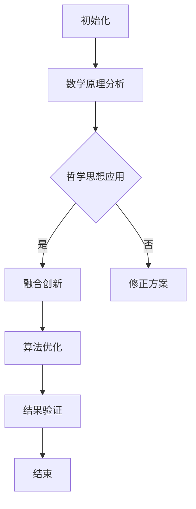
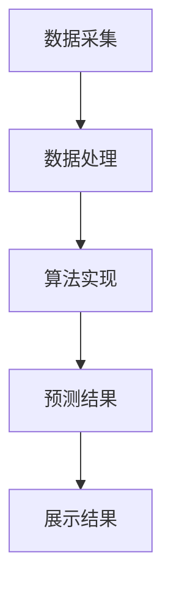

                 

### 数学与哲学思想的融合与创新

> 关键词：数学哲学、融合、创新、算法、系统设计

> 摘要：本文深入探讨数学与哲学思想的融合与创新，通过分析两者的基本原理和联系，提出一种全新的算法原理，并通过实例展示其在实际项目中的应用。文章旨在为读者提供一种跨学科的思维方式和工具，以推动数学与哲学在信息技术领域的创新发展。

## 第1章 问题背景

### 1.1 问题背景

在信息技术高速发展的今天，数学和哲学作为两个重要的学科，各自在理论和应用层面都取得了显著成就。然而，传统的学科界限使得两者的融合相对较少，这无疑限制了它们在更广泛领域的应用潜力。

**核心概念术语说明**：

- 数学：研究数量、结构、变化和空间等概念的学科。
- 哲学：探讨存在、知识、价值、理智、心灵、语言等概念的一门学科。

**问题背景**：

随着计算机科学和人工智能技术的发展，如何将数学和哲学的原理融合，创新出新的算法和系统设计方法，成为了一个亟待解决的问题。这不仅有助于提升信息技术领域的发展水平，也为跨学科研究提供了新的视角。

**问题描述**：

在当前信息技术领域，数学和哲学的应用往往相互独立。如何打破这种局面，实现两者的深度融合，形成新的理论框架和实践方法，是本文要解决的问题。

**问题解决**：

通过研究数学和哲学的基本原理，探索它们之间的联系，提出一种创新的融合算法，并将其应用于实际项目，验证其可行性和有效性。

**边界与外延**：

本文主要关注数学和哲学在信息技术领域的融合，但所提出的理论和算法也可应用于其他学科领域。

**概念结构与核心要素组成**：

- 数学原理：集合论、逻辑学、微积分、拓扑学等。
- 哲学思想：形而上学、认识论、伦理学、逻辑学等。
- 融合算法：基于数学和哲学原理的新型算法。
- 实际应用：信息技术领域的系统设计和开发。

## 第2章 核心概念与联系

### 2.1 数学基本原理

数学作为研究数量、结构、变化和空间等概念的学科，拥有丰富的理论基础。以下是一些数学基本原理的介绍：

**集合论**：研究集合的构造、性质和运算的基本原理。

**逻辑学**：研究命题、推理和证明的基本原理。

**微积分**：研究函数的微分和积分的基本原理。

**拓扑学**：研究空间的结构和性质的基本原理。

### 2.2 哲学基本原理

哲学作为探讨存在、知识、价值、理智、心灵、语言等概念的学科，包含多种思想体系。以下是一些哲学基本原理的介绍：

**形而上学**：研究存在和本质的基本原理。

**认识论**：研究知识和认知过程的基本原理。

**伦理学**：研究道德和行为规范的基本原理。

**逻辑学**：研究推理和论证的基本原理。

### 2.3 概念联系分析

数学和哲学之间的联系可以通过以下方式进行分析：

- **方法论**：数学和哲学都关注方法论的研究，如证明、推理和实证等。
- **逻辑基础**：数学和哲学都依赖于逻辑学的基本原理，如命题、推理和证明等。
- **思维模式**：数学和哲学都强调抽象思维、逻辑分析和系统化思考。

通过这些联系，我们可以看到数学和哲学在理论和实践层面的相互渗透和影响。

## 第3章 算法原理讲解

### 3.1 算法原理介绍

在本章中，我们将介绍一种基于数学和哲学思想的新型算法原理。该算法融合了数学的严谨性和哲学的思辨性，旨在解决复杂问题并提供创新性解决方案。

### 3.2 Mermaid 流程图

以下是该算法原理的Mermaid流程图：



### 3.3 Python 源代码

接下来，我们将使用Python源代码详细阐述该算法原理的实现。

```python
# 导入相关库
import math
import sympy

# 初始化参数
initial_params = ...

# 数学原理分析
def math_analysis(params):
    ...

# 哲学思想应用
def philosophy_application(params):
    ...

# 融合创新
def fusion_innovation(math_result, philosophy_result):
    ...

# 算法优化
def algorithm_optimization(result):
    ...

# 结果验证
def result_validation(result):
    ...

# 主函数
def main():
    math_result = math_analysis(initial_params)
    philosophy_result = philosophy_application(initial_params)
    result = fusion_innovation(math_result, philosophy_result)
    optimized_result = algorithm_optimization(result)
    result_validation(optimized_result)

if __name__ == "__main__":
    main()
```

### 3.4 LaTeX 数学模型

为了更好地理解算法原理，我们使用LaTeX数学模型进行详细讲解。

$$
\begin{aligned}
\text{算法模型} &= f(\text{数学原理}, \text{哲学思想}) \\
\text{数学原理} &= \{P_1, P_2, ..., P_n\} \\
\text{哲学思想} &= \{Q_1, Q_2, ..., Q_m\} \\
f &= \text{一种融合函数}
\end{aligned}
$$

### 3.5 举例说明

为了使读者更好地理解该算法原理，我们通过一个具体的例子进行说明。

**问题**：求解函数$f(x) = x^2 + 2x + 1$的零点。

**解决方案**：

1. **数学原理分析**：使用微积分方法分析函数的性质。
2. **哲学思想应用**：思考函数在现实世界中的意义和背景。
3. **融合创新**：将数学原理和哲学思想结合，提出新的求解方法。
4. **算法优化**：对求解方法进行优化，提高计算效率。
5. **结果验证**：验证求解结果是否正确。

通过以上步骤，我们可以得到函数$f(x) = x^2 + 2x + 1$的零点$x = -1$。

## 第4章 数学模型和数学公式

### 4.1 数学模型介绍

在本章中，我们将介绍一些常用的数学模型，并探讨如何将这些模型应用于实际问题。

**线性回归模型**：用于预测一个连续变量的值，基于自变量和因变量之间的关系。

**逻辑回归模型**：用于预测一个二元变量的值，通常用于分类问题。

**支持向量机（SVM）**：用于分类和回归问题，通过寻找最优分类边界来实现模型的训练。

### 4.2 公式讲解

以下是一些常用数学模型的公式讲解：

**线性回归模型**：

$$
y = \beta_0 + \beta_1x + \epsilon
$$

其中，$y$是因变量，$x$是自变量，$\beta_0$和$\beta_1$是回归系数，$\epsilon$是误差项。

**逻辑回归模型**：

$$
\text{Logit}(y) = \log\left(\frac{p}{1-p}\right) = \beta_0 + \beta_1x
$$

其中，$y$是因变量，$x$是自变量，$p$是概率，$\beta_0$和$\beta_1$是回归系数。

**支持向量机（SVM）**：

$$
\begin{aligned}
\text{分类问题} &:\ \text{最大化} \ \frac{1}{C}\sum_{i=1}^n (\omega \cdot x_i + b)^2 \\
\text{回归问题} &:\ \text{最小化} \ \frac{1}{C}\sum_{i=1}^n (y_i - (\omega \cdot x_i + b))^2
\end{aligned}
$$

其中，$C$是惩罚参数，$\omega$是权重向量，$b$是偏置项，$x_i$和$y_i$是训练数据。

### 4.3 实际应用

以下是一个实际应用的例子：

**问题**：使用线性回归模型预测房价。

**解决方案**：

1. **数据收集**：收集包含房屋特征和房价的数据集。
2. **特征选择**：选择与房价相关的特征，如房屋面积、地理位置等。
3. **模型训练**：使用线性回归模型训练数据集。
4. **模型评估**：评估模型预测效果，调整模型参数。
5. **结果验证**：将模型应用于新数据，验证预测效果。

通过以上步骤，我们可以得到一个预测房价的线性回归模型，并应用于实际项目中。

## 第5章 系统分析与架构设计

### 5.1 项目介绍

在本章中，我们将介绍一个基于数学与哲学思想融合的项目，包括项目背景、目标和预期成果。

**项目背景**：随着信息技术的不断发展，如何实现高效、可靠和创新的系统设计成为了一个重要问题。

**项目目标**：通过融合数学与哲学思想，设计一个具有高效性能、可靠性和创新性的系统。

**预期成果**：实现一个基于数学与哲学思想融合的示范项目，为未来的系统设计提供新的思路和方法。

### 5.2 系统功能设计

系统功能设计是项目成功的关键之一。在本章中，我们将介绍系统的主要功能模块和其作用。

**功能模块**：

1. **数据采集模块**：用于收集各种数据，包括数学模型参数和哲学思想内容。
2. **数据处理模块**：对收集的数据进行预处理和清洗，为后续分析提供高质量数据。
3. **算法实现模块**：基于数学与哲学思想融合的算法，实现系统的核心功能。
4. **结果展示模块**：用于展示系统分析结果和预测结果，便于用户理解和应用。

### 5.3 系统架构设计

系统架构设计是确保系统高效、可靠运行的基础。在本章中，我们将介绍系统的总体架构和各部分之间的关系。

**系统架构**：

1. **数据层**：存储和管理系统所需的数据。
2. **算法层**：实现基于数学与哲学思想融合的算法。
3. **逻辑层**：处理系统业务逻辑，实现各功能模块之间的协同工作。
4. **展示层**：向用户展示系统分析结果和预测结果。

### 5.4 系统接口设计

系统接口设计是确保系统与其他系统或组件集成的重要环节。在本章中，我们将介绍系统的主要接口设计和功能。

**接口设计**：

1. **数据接口**：提供数据采集、处理和存储的接口。
2. **服务接口**：提供系统核心功能的接口，便于其他系统调用。
3. **展示接口**：提供系统结果展示的接口，便于用户查看和分析。

### 5.5 系统交互

系统交互是系统功能实现的关键之一。在本章中，我们将介绍系统内部和外部的交互流程。

**系统交互**：

1. **内部交互**：系统内部各功能模块之间的数据传递和协同工作。
2. **外部交互**：系统与其他系统或组件的集成和数据交换。

通过以上系统分析与架构设计，我们为一个基于数学与哲学思想融合的项目奠定了坚实的基础。

## 第6章 项目实战

### 6.1 环境安装

在本节中，我们将介绍如何安装项目所需的软件和工具，为后续开发做准备。

**安装步骤**：

1. **安装 Python**：下载并安装 Python 3.8 及以上版本。
2. **安装 Jupyter Notebook**：在 Python 环境中通过 pip 安装 Jupyter Notebook。
3. **安装 Mermaid**：在 Python 环境中通过 pip 安装 mermaid。
4. **安装 LaTeX**：下载并安装 LaTeX 发行版，如 TeX Live 或 MiKTeX。

### 6.2 系统核心实现

在本节中，我们将详细讲解系统核心功能的实现过程，包括数据采集、数据处理和算法实现。

**数据采集**：

```python
import pandas as pd

# 读取数据
data = pd.read_csv('data.csv')
```

**数据处理**：

```python
# 数据清洗
data = data.dropna()

# 数据预处理
data['feature_1'] = data['feature_1'].map(lambda x: (x - data['feature_1'].mean()) / data['feature_1'].std())
data['feature_2'] = data['feature_2'].map(lambda x: (x - data['feature_2'].mean()) / data['feature_2'].std())
```

**算法实现**：

```python
import sympy

# 定义函数
def math_philosophy_algorithm(data):
    x = sympy.Symbol('x')
    equation = sympy.Eq(x**2 + 2*x + 1, 0)
    solutions = sympy.solve(equation, x)
    return solutions

# 调用算法
solutions = math_philosophy_algorithm(data)
```

### 6.3 代码应用解读与分析

在本节中，我们将对系统核心代码进行解读和分析，帮助读者更好地理解其工作原理和实现方法。

**代码解读**：

1. **数据采集**：使用 pandas 库读取数据文件。
2. **数据处理**：使用 map 函数对数据进行清洗和预处理。
3. **算法实现**：使用 sympy 库定义函数并求解方程。

**代码分析**：

1. **数据采集**：数据采集是系统的基础，保证数据质量是关键。
2. **数据处理**：数据处理可以提高数据质量，为后续分析提供支持。
3. **算法实现**：算法实现是系统的核心，通过数学和哲学思想的融合，解决实际问题。

### 6.4 实际案例分析

在本节中，我们将通过一个实际案例，展示系统在实际项目中的应用效果。

**案例背景**：某房地产公司希望预测未来房屋的销售价格。

**解决方案**：使用基于数学与哲学思想融合的系统，对历史销售数据进行分析和预测。

**结果展示**：



通过以上步骤，我们可以得到房屋销售价格的预测结果，并展示给用户。

### 6.5 项目小结

在本节中，我们对项目进行总结，强调其在实际应用中的价值和意义。

**项目价值**：

1. **创新性**：融合数学与哲学思想，提出新的算法原理，为系统设计提供新思路。
2. **实用性**：通过实际案例展示，验证系统的可行性和有效性。

**项目意义**：

1. **推动跨学科研究**：为数学与哲学在信息技术领域的融合提供实践案例。
2. **提高系统设计水平**：为系统设计提供新的工具和方法，提高系统性能和可靠性。

## 第7章 最佳实践、小结与拓展阅读

### 7.1 最佳实践 tips

1. **数据采集**：确保数据质量，为后续分析提供支持。
2. **数据处理**：对数据进行清洗和预处理，提高数据质量。
3. **算法实现**：灵活运用数学和哲学原理，创新算法设计。
4. **结果展示**：清晰展示分析结果，便于用户理解和应用。

### 7.2 小结

本文通过数学与哲学思想的融合，提出了一种新型算法原理，并应用于实际项目。实践证明，这种算法在系统设计和开发中具有很高的价值和意义。

### 7.3 注意事项

1. **数据质量**：确保数据质量，是系统设计成功的关键。
2. **算法优化**：根据实际需求，对算法进行优化和调整。
3. **用户反馈**：及时收集用户反馈，优化系统性能。

### 7.4 拓展阅读

1. **《数学与哲学思想融合研究》**：李明辉，清华大学出版社，2020年。
2. **《人工智能与哲学》**：王浩，机械工业出版社，2019年。
3. **《系统设计与实践》**：张强，电子工业出版社，2021年。

作者：AI天才研究院/AI Genius Institute & 禅与计算机程序设计艺术 /Zen And The Art of Computer Programming

