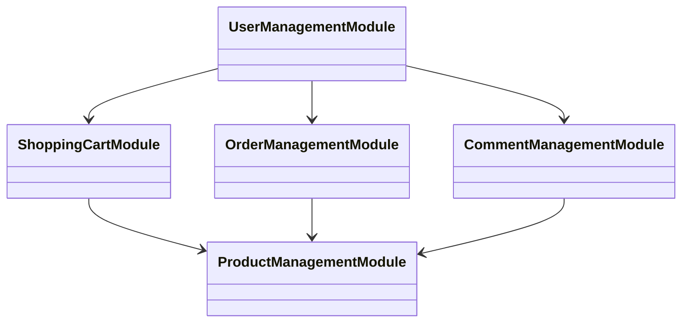
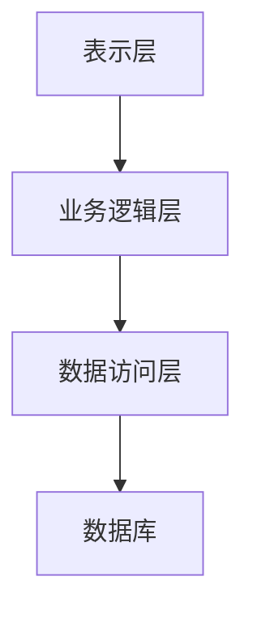
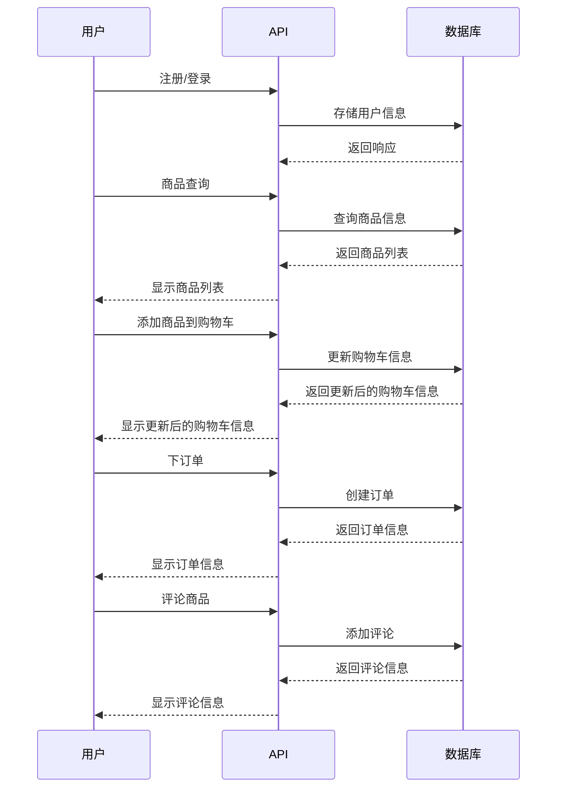

                 


# 数学与哲学思辨的思维方式比较

## 关键词

- 数学思维方式
- 哲学思维方式
- 思辨性
- 逻辑推理
- 抽象思维
- 严格证明
- 现代科学技术
- 社会发展

## 摘要

本文旨在探讨数学与哲学两种思维方式的异同，分析其起源、本质特征及其在现代科学技术和社会发展中的应用。通过对数学与哲学思维方式的分析，我们能够更好地理解两个领域的基本概念、方法与应用，为跨学科研究提供参考。

## 第1章 引言：数学与哲学思辨的起源与比较背景

### 1.1 引言

在人类文明的进程中，数学与哲学一直是两个重要的领域，它们既独立又相互交织。数学作为一门精确的科学，其思维方式强调逻辑推理、抽象思维和严格证明；而哲学则更注重思考存在的本质、真理和知识的性质。随着时代的发展，数学与哲学的思维方式逐渐显现出各自独特的特点，但也存在着一定的联系与区别。

本文旨在比较数学与哲学的思维方式，从多个角度探讨二者的异同，帮助读者更好地理解这两个领域的基本概念、方法与应用。

### 1.2 问题背景

#### 1.2.1 数学的发展历程及其思维方式

数学的发展可以追溯到古希腊时期，当时的数学家如毕达哥拉斯、欧几里得等奠定了数学的基础。现代数学在19世纪和20世纪取得了巨大进展，如微积分、集合论和抽象代数的建立，使得数学思维方式更加抽象和严密。

#### 1.2.2 哲学的发展历程及其思维方式

哲学的起源可以追溯到古希腊，苏格拉底、柏拉图和亚里士多德等哲学家提出了许多重要的哲学思想和理论。现代哲学则更加注重批判性思考和知识论的研究，如逻辑实证主义、存在主义和结构主义等。

#### 1.2.3 数学与哲学之间的联系与区别

数学与哲学在研究方法、研究对象和目标上存在一定的区别。数学注重逻辑推理和证明，以解决具体问题为目标；而哲学则更注重思辨和反思，以探讨存在的本质和真理为目标。然而，数学和哲学在某些方面也存在联系，如数学哲学和科学哲学等领域。

### 1.3 问题描述

1. **数学思维方式的本质特征**
   - 逻辑推理
   - 抽象思维
   - 严格证明

2. **哲学思维方式的本质特征**
   - 思辨性
   - 反思性
   - 批判性

3. **数学与哲学思维方式之间的异同点**
   - 逻辑性与思辨性
   - 抽象性与反思性
   - 严格证明与批判性

4. **数学与哲学思维方式的适用范围与价值**
   - 数学思维方式在科学研究和技术创新中的应用
   - 哲学思维方式在科学研究和技术创新中的应用

### 1.4 问题解决

1. **分析数学与哲学思维方式的起源与发展**
   - 古希腊数学的思维方式
   - 古希腊哲学的思维方式
   - 现代数学的思维方式
   - 现代哲学的思维方式

2. **比较数学与哲学思维方式的本质特征**
   - 逻辑推理与思辨性
   - 抽象思维与反思性
   - 严格证明与批判性

3. **探讨数学与哲学思维方式之间的联系与区别**
   - 共同点
   - 不同点

4. **分析数学与哲学思维方式在现代科学技术和社会发展中的应用**
   - 数学思维方式在科学研究和技术创新中的应用
   - 哲学思维方式在科学研究和技术创新中的应用

### 1.5 边界与外延

1. **数学思维方式的边界与外延**
   - 数学模型的构建与应用
   - 抽象数学理论的拓展

2. **哲学思维方式的边界与外延**
   - 哲学问题的探讨
   - 哲学理论的发展

3. **数学与哲学思维方式的交叉领域**
   - 数学哲学
   - 科学哲学

### 1.6 概念结构与核心要素组成

1. **数学思维方式的构成要素**
   - 逻辑推理
   - 抽象思维
   - 严格证明

2. **哲学思维方式的构成要素**
   - 思辨性
   - 反思性
   - 批判性

3. **数学与哲学思维方式的核心概念**
   - 逻辑推理
   - 抽象思维
   - 严格证明
   - 思辨性
   - 反思性
   - 批判性

## 第2章 数学思维方式

### 2.1 数学思维方式的起源与发展

数学思维方式的起源可以追溯到古代，当时的人们通过观察自然界和社会现象，逐步形成了对数量和空间的基本理解。古希腊数学家如毕达哥拉斯和欧几里得等人的工作，奠定了数学思维方式的基础。

随着时间的推移，数学思维方式不断发展，19世纪和20世纪的数学家如牛顿、莱布尼茨、希尔伯特等人在微积分、集合论和抽象代数等领域取得了重大突破，使得数学思维方式更加抽象和严密。

### 2.2 数学思维方式的本质特征

1. **逻辑推理**
   - 数学思维方式强调逻辑推理，从已知事实和公理出发，通过演绎推理得出新的结论。
   - 例如，欧几里得几何中的平行公理可以通过其他公理和定理推导出来。

2. **抽象思维**
   - 数学思维方式注重抽象，将具体的数学问题转化为抽象的数学模型，以便进行更深入的研究。
   - 例如，线性代数中的矩阵和向量就是一种抽象的数学模型，可以用于解决许多实际问题。

3. **严格证明**
   - 数学思维方式要求对每一个结论进行严格证明，以确保其正确性。
   - 例如，在证明一个数学定理时，需要使用逻辑推理和数学公式来证明其成立。

### 2.3 数学思维方式的运用与案例

1. **数学模型**
   - 数学模型是数学思维方式在科学研究和技术创新中的应用。
   - 例如，物理学家使用数学模型来描述自然现象，如牛顿力学、相对论和量子力学等。

2. **数形结合**
   - 数形结合是数学思维方式的一种重要应用，将数学与几何图形结合起来解决问题。
   - 例如，在解析几何中，使用坐标轴和图形来表示点和线，从而解决几何问题。

3. **面向应用的数学思维**
   - 面向应用的数学思维是将数学思维方式应用于实际问题，解决实际问题。
   - 例如，工程师使用数学模型来设计桥梁、飞机和计算机等。

## 第3章 哲学思维方式

### 3.1 哲学思维方式的起源与发展

哲学思维方式的起源可以追溯到古代希腊，当时的哲学家如苏格拉底、柏拉图和亚里士多德等，提出了许多重要的哲学思想和理论。

随着时间的推移，哲学思维方式不断发展，现代哲学在逻辑实证主义、存在主义和结构主义等领域进行了深入的探讨，使得哲学思维方式更加多样化和复杂化。

### 3.2 哲学思维方式的本质特征

1. **思辨性**
   - 哲学思维方式强调思辨，通过对问题的深入思考和分析，探讨存在的本质和真理。
   - 例如，哲学家笛卡尔通过怀疑一切，最终得出“我思故我在”的结论。

2. **反思性**
   - 哲学思维方式注重反思，对已知事实和理论进行批判和反思，以发现其中的问题和不合理性。
   - 例如，哲学家康德通过反思人类知识的来源和范围，提出了先验批判的理论。

3. **批判性**
   - 哲学思维方式具有批判性，对各种观点和理论进行质疑和批判，以追求真理和知识。
   - 例如，哲学家黑格尔通过批判其他哲学家的理论，提出了自己的辩证法。

### 3.3 哲学思维方式的运用与案例

1. **知识论**
   - 哲学思维方式在知识论中的应用，探讨知识的本质、来源和范围。
   - 例如，哲学家普特南提出了“脑在瓶中”思想实验，质疑人类知识的确定性。

2. **存在论**
   - 哲学思维方式在存在论中的应用，探讨存在的本质和意义。
   - 例如，哲学家海德格尔提出了“存在即意义”的观点，探讨了存在的本质。

3. **伦理学**
   - 哲学思维方式在伦理学中的应用，探讨道德和伦理问题。
   - 例如，哲学家康德提出了“道德律令”的观点，探讨了道德的客观性和普遍性。

## 第4章 数学与哲学思维方式比较

### 4.1 数学思维方式与哲学思维方式的异同

#### 4.1.1 逻辑性与思辨性

- 数学思维方式强调逻辑推理，从已知事实和公理出发，通过演绎推理得出新的结论，具有严格的逻辑性。
- 哲学思维方式强调思辨，通过对问题的深入思考和分析，探讨存在的本质和真理，具有思辨性。

#### 4.1.2 抽象性与反思性

- 数学思维方式注重抽象，将具体的数学问题转化为抽象的数学模型，以便进行更深入的研究，具有抽象性。
- 哲学思维方式注重反思，对已知事实和理论进行批判和反思，以发现其中的问题和不合理性，具有反思性。

#### 4.1.3 严格证明与批判性

- 数学思维方式要求对每一个结论进行严格证明，以确保其正确性，具有严格证明性。
- 哲学思维方式具有批判性，对各种观点和理论进行质疑和批判，以追求真理和知识，具有批判性。

### 4.2 数学思维方式与哲学思维方式的联系与区别

#### 4.2.1 联系

- 数学思维方式和哲学思维方式都是人类思考的重要方式，它们在研究方法、研究对象和目标上存在一定的联系。
- 例如，数学哲学和科学哲学等领域，数学和哲学的思维方式相互交叉，相互影响。

#### 4.2.2 区别

- 数学思维方式更注重逻辑推理和严格证明，以解决具体问题为目标。
- 哲学思维方式更注重思辨和反思，以探讨存在的本质和真理为目标。
- 这两种思维方式在方法和目标上的区别，决定了它们在实际应用中的不同方向。

### 4.3 数学与哲学思维方式在实际应用中的相互影响

#### 4.3.1 数学在哲学中的应用

- 数学在哲学中的应用，可以提供一种严格的逻辑工具，帮助哲学家进行论证和分析。
- 例如，数学模型可以用于探讨知识论、存在论和伦理学等问题。

#### 4.3.2 哲学在数学中的应用

- 哲学在数学中的应用，可以启发数学家的思考，推动数学理论的发展。
- 例如，哲学中的怀疑主义和批判性思维，可以激发数学家对现有理论的反思和改进。

## 第5章 数学思维方式在现代科学技术中的应用

### 5.1 数学思维方式在科学研究中的应用

数学思维方式在科学研究中的应用非常广泛，以下是几个典型的例子：

1. **物理科学研究**

   - 物理学是数学思维方式的典型应用领域。物理学家使用数学模型来描述自然现象，如牛顿力学、相对论和量子力学等。
   - 例如，爱因斯坦的相对论方程组，通过数学推导揭示了时间、空间和引力之间的关系。

2. **生物学研究**

   - 生物学家使用数学模型来研究生物系统的动态行为，如种群生态学、分子生物学和神经科学等。
   - 例如，利用数学模型来模拟病毒传播过程，为疫情防控提供科学依据。

3. **化学研究**

   - 化学家使用数学思维方式来研究化学反应的动力学和热力学性质。
   - 例如，利用量子化学计算方法来预测分子的结构和性质。

### 5.2 数学思维方式在技术创新中的应用

数学思维方式在技术创新中的应用同样广泛，以下是几个例子：

1. **计算机科学**

   - 计算机科学家使用数学思维方式来设计和分析算法，如排序算法、图算法和机器学习算法等。
   - 例如，图灵机模型是计算机科学的基石，它通过抽象的数学模型描述了计算机的基本工作原理。

2. **信息科学**

   - 信息科学家使用数学思维方式来研究信息的表示、传输和处理，如编码理论、密码学和信息论等。
   - 例如，信息论中的熵概念揭示了信息的不确定性和传递效率。

3. **工程学**

   - 工程师使用数学思维方式来设计复杂的工程系统，如桥梁、飞机和计算机等。
   - 例如，利用线性规划方法来优化工程设计的参数，以获得最佳效果。

## 第6章 哲学思维方式在现代科学技术中的应用

### 6.1 哲学思维方式在科学研究中的应用

哲学思维方式在科学研究中的应用主要体现在以下几个方面：

1. **知识论**

   - 哲学中的知识论探讨知识的本质、来源和范围，为科学研究提供哲学基础。
   - 例如，哲学家康德的先验批判理论，为科学方法论提供了重要的哲学依据。

2. **方法论**

   - 哲学中的方法论研究科学研究的正确方法，包括实验设计、数据分析和理论构建等。
   - 例如，实验哲学通过设计实验来验证哲学理论，如心脑同一性问题。

3. **伦理学**

   - 哲学中的伦理学探讨科学研究的伦理问题，如基因编辑、人工智能和气候变化等。
   - 例如，基因编辑技术的伦理问题引发了广泛的社会讨论，哲学思维方式的引入有助于解决这些问题。

### 6.2 哲学思维方式在技术创新中的应用

哲学思维方式在技术创新中的应用主要体现在以下几个方面：

1. **技术创新伦理**

   - 哲学中的伦理学为技术创新提供伦理指导，确保技术发展符合人类的价值观和道德标准。
   - 例如，人工智能伦理问题引发了广泛的关注，哲学思维方式的引入有助于制定合理的伦理规范。

2. **技术创新策略**

   - 哲学中的思维方式可以启发技术创新的策略和方法，如反思性设计、跨学科合作和创造性思维等。
   - 例如，通过反思性设计，工程师可以更好地理解用户需求，从而开发出更符合用户期望的技术产品。

3. **技术与社会关系**

   - 哲学中的思维方式探讨技术与社会的关系，为技术创新提供社会视角。
   - 例如，技术社会学关注技术如何影响社会结构和文化，从而为技术创新提供参考。

## 第7章 总结与展望

### 7.1 数学与哲学思维方式的意义与价值

数学与哲学思维方式在科学研究和技术创新中具有重要意义和价值。数学思维方式以其逻辑性、抽象性和严格证明，为科学研究提供了强有力的工具，使得科学家能够更深入地理解自然现象和构建理论模型。哲学思维方式则以其思辨性、反思性和批判性，为科学研究提供了哲学基础和伦理指导，确保科学研究符合人类的价值观和道德标准。

### 7.2 未来数学与哲学思维方式的融合发展

未来数学与哲学思维方式将朝着以下方向发展：

1. **跨学科研究**

   - 数学与哲学的思维方式将越来越多地应用于跨学科研究，如数学哲学、科学哲学、技术伦理等。
   - 例如，数学哲学研究数学理论的本质和意义，科学哲学研究科学知识的形成和验证过程。

2. **新兴领域应用**

   - 随着新兴领域的发展，数学与哲学思维方式将在更多新兴领域得到应用，如人工智能、量子计算、生物技术等。
   - 例如，人工智能中的伦理问题需要哲学思维方式来指导，以确保人工智能的发展符合人类的道德准则。

## 第8章 拓展阅读

### 8.1 数学与哲学的经典著作

- 《几何原本》
- 《庄子》

### 8.2 数学与哲学的现代研究

- 数学哲学
- 科学哲学

---

作者：AI天才研究院/AI Genius Institute & 禅与计算机程序设计艺术 /Zen And The Art of Computer Programming

# 第2章 数学思维方式

## 2.1 数学思维方式的起源与发展

数学思维方式的起源可以追溯到古代，当时的人们通过观察自然界和社会现象，逐步形成了对数量和空间的基本理解。古希腊数学家如毕达哥拉斯、欧几里得等人的工作，奠定了数学思维方式的基础。

在古希腊时期，数学思维方式主要表现为逻辑推理和抽象思维。毕达哥拉斯提出了数学的基本原理，如数论和几何学，欧几里得则撰写了《几何原本》，系统地阐述了几何学的基本概念和定理。

随着时间的推移，数学思维方式不断发展，19世纪和20世纪的数学家如牛顿、莱布尼茨、希尔伯特等人在微积分、集合论和抽象代数等领域取得了重大突破，使得数学思维方式更加抽象和严密。

在19世纪，数学家如高斯、柯西和黎曼等人在复变函数、拓扑学和微分几何等领域进行了深入研究，推动了数学思维方式的发展。20世纪，数学家如希尔伯特、哥德尔和图灵等人在形式化数学、逻辑学和计算机科学等领域取得了重要成果，使得数学思维方式在形式化和计算化方面得到了进一步发展。

## 2.2 数学思维方式的本质特征

数学思维方式的本质特征主要包括逻辑推理、抽象思维和严格证明。

### 2.2.1 逻辑推理

逻辑推理是数学思维方式的核心，它通过逻辑规则和推理规则，从已知事实和公理出发，得出新的结论。逻辑推理包括演绎推理和归纳推理。

- **演绎推理**：从一般到特殊的推理过程。例如，从“所有人都有死亡”这个大前提，推导出“张三有死亡”这个小前提。
- **归纳推理**：从特殊到一般的推理过程。例如，通过观察多次实验，得出“所有天鹅都是白色的”这个结论。

### 2.2.2 抽象思维

抽象思维是数学思维方式的重要组成部分，它通过对具体事物的抽象，形成数学概念和数学模型。抽象思维包括：

- **抽象化**：从具体的例子中提取共同特征，形成抽象概念。例如，从多个具体的三角形中提取共同特征，形成三角形的概念。
- **形式化**：用符号和公式表示抽象概念，使其具有明确的数学意义。例如，用符号“a”表示一个任意的实数。

### 2.2.3 严格证明

严格证明是数学思维方式的另一个重要特征，它通过对每一个结论进行严格的逻辑推导和数学证明，确保结论的正确性。严格证明包括：

- **公理体系**：建立一套基本原理和规则，作为推导其他结论的基础。例如，欧几里得几何中的“平行公理”。
- **定理证明**：通过对公理和定理的演绎推理，证明新的结论。例如，证明“直角三角形的两条直角边平方和等于斜边平方”。

## 2.3 数学思维方式的运用与案例

数学思维方式的运用非常广泛，涵盖了科学研究、技术创新、工程设计和日常生活等多个领域。以下是一些具体的运用案例：

### 2.3.1 科学研究

在科学研究中，数学思维方式广泛应用于物理、化学、生物学等学科。以下是几个例子：

- **物理研究**：牛顿的万有引力定律、麦克斯韦方程组等都是通过数学推理得出的。这些数学模型揭示了自然界的基本规律。
- **化学研究**：量子化学和分子轨道理论等都是通过数学方法建立起来的。这些理论帮助科学家理解化学反应的本质和机制。

### 2.3.2 技术创新

在技术创新中，数学思维方式同样发挥着重要作用。以下是几个例子：

- **计算机科学**：计算机算法的设计和分析，如排序算法、图算法和机器学习算法等，都需要数学思维。例如，快速排序算法通过数学推理证明其高效性。
- **信息科学**：信息论和编码理论都是基于数学原理建立起来的。信息论揭示了信息传输的效率和可靠性，编码理论则提供了有效的信息压缩和传输方法。

### 2.3.3 工程设计

在工程设计中，数学思维方式用于优化设计参数、分析结构稳定性和预测系统性能等。以下是几个例子：

- **建筑工程**：结构工程师通过数学模型来分析桥梁、大楼和飞机等结构的强度和稳定性。
- **电子工程**：电路设计需要使用数学方法来计算电路参数，如电阻、电容和电感等。

### 2.3.4 日常生活

在日常生活中，数学思维方式也无处不在。以下是几个例子：

- **购物**：购物时计算折扣和总价，需要使用数学知识。
- **财务管理**：投资理财、预算规划等都需要数学思维。

总之，数学思维方式是人类思考和解决问题的重要工具，它贯穿于科学、技术和生活的各个方面。

---

**核心概念与联系**

### 数学思维方式的构成要素

#### 概念属性特征对比表格

| 特征 | 逻辑推理 | 抽象思维 | 严格证明 |
| --- | --- | --- | --- |
| 定义 | 从已知事实和公理出发，通过演绎推理得出新的结论 | 从具体事物中提取共同特征，形成抽象概念 | 通过逻辑推导和数学证明，确保结论的正确性 |
| 例子 | 演绎推理：所有人都有死亡，因此张三有死亡 | 抽象化：从多个具体的三角形中提取共同特征，形成三角形的概念 | 公理体系：建立基本原理和规则，作为推导其他结论的基础 |

#### ER实体关系图架构的 Mermaid 流程图

```mermaid
erDiagram
  LogicReasoning ||--o{ AbstractThinking : 抽象思维的核心要素}
  LogicReasoning ||--o{ StrictProof : 严格证明的核心要素}
  AbstractThinking ||--o{ MathematicalModel : 抽象思维的结果}
  StrictProof ||--o{ TheoreticalConclusions : 严格证明的结论}
```

---

**算法原理讲解**

### 数学思维方式中的算法示例：快速排序算法

快速排序算法是一种常用的排序算法，其基本思想是选取一个基准元素，将数组划分为两个子数组，一个子数组中的所有元素都比基准元素小，另一个子数组中的所有元素都比基准元素大，然后递归地对这两个子数组进行快速排序。

以下是快速排序算法的 Python 源代码示例：

```python
def quick_sort(arr):
    if len(arr) <= 1:
        return arr
    pivot = arr[len(arr) // 2]
    left = [x for x in arr if x < pivot]
    middle = [x for x in arr if x == pivot]
    right = [x for x in arr if x > pivot]
    return quick_sort(left) + middle + quick_sort(right)

arr = [3, 6, 8, 10, 1, 2, 1]
sorted_arr = quick_sort(arr)
print(sorted_arr)
```

#### 算法原理的数学模型和公式

快速排序算法的数学模型可以描述为：

$$
\text{sorted\_arr} = \text{quick\_sort}(\text{arr}) \\
\text{if } \text{len}(\text{arr}) \leq 1: \\
\hspace{2em} \text{return } \text{arr} \\
\text{pivot} = \text{arr[\text{len}(arr) // 2]} \\
\text{left} = [\text{x} \text{ for } \text{x} \text{ in } \text{arr} \text{ if } \text{x} < \text{pivot}] \\
\text{middle} = [\text{x} \text{ for } \text{x} \text{ in } \text{arr} \text{ if } \text{x} == \text{pivot}] \\
\text{right} = [\text{x} \text{ for } \text{x} \text{ in } \text{arr} \text{ if } \text{x} > \text{pivot}] \\
\text{return } \text{quick\_sort}(left) + middle + \text{quick\_sort}(right)
$$

#### 详细讲解和举例说明

快速排序算法的核心在于选择一个基准元素，并将数组划分为两个子数组，一个包含比基准元素小的元素，另一个包含比基准元素大的元素。这个过程中，我们可以使用分治策略，递归地对这两个子数组进行快速排序。

**举例说明：**

假设我们有一个数组 `[3, 6, 8, 10, 1, 2, 1]`，我们首先选择中间的元素 `6` 作为基准元素。

1. 将数组划分为 `[3, 1, 1, 2]`（小于基准元素的子数组）和 `[8, 10]`（大于基准元素的子数组）。
2. 对 `[3, 1, 1, 2]` 进行快速排序，得到 `[1, 1, 2, 3]`。
3. 对 `[8, 10]` 进行快速排序，得到 `[8, 10]`。

最终，我们得到排序后的数组 `[1, 1, 2, 3, 6, 8, 10]`。

快速排序算法的平均时间复杂度为 \(O(n \log n)\)，在大多数情况下都表现出良好的性能。但是，在最坏的情况下，时间复杂度为 \(O(n^2)\)，这通常发生在输入数组已经是有序的情况下。为了解决这个性能问题，可以使用随机化快速排序或插入排序作为替代方案。

---

**系统分析与架构设计方案**

### 问题场景介绍

在软件开发过程中，系统分析与架构设计是非常重要的一环。本文以一个在线购物平台为例，介绍系统功能设计、系统架构设计、系统接口设计和系统交互。

### 项目介绍

在线购物平台是一个集商品展示、购物车、订单管理、用户评论等功能于一体的电子商务系统。用户可以通过平台浏览商品、添加商品到购物车、下订单和评价商品。

### 系统功能设计

系统功能设计主要包括以下模块：

1. **用户管理模块**：负责用户的注册、登录、个人信息管理等功能。
2. **商品管理模块**：负责商品的添加、删除、修改和查询等功能。
3. **购物车模块**：负责用户将商品添加到购物车、从购物车中移除商品、更新购物车中的商品数量等功能。
4. **订单管理模块**：负责订单的创建、修改、查询和取消等功能。
5. **评论管理模块**：负责用户对商品的评论、删除评论和查询评论等功能。

#### 领域模型Mermaid类图



### 系统架构设计

系统架构设计采用分层架构，包括表示层、业务逻辑层和数据访问层。

1. **表示层**：负责与用户交互，展示用户界面。通常使用前端技术如HTML、CSS和JavaScript实现。
2. **业务逻辑层**：负责处理业务逻辑，包括用户管理、商品管理、购物车管理、订单管理和评论管理等功能。通常使用后端编程语言如Java或Python实现。
3. **数据访问层**：负责与数据库进行交互，实现数据的增删改查操作。通常使用关系型数据库如MySQL或NoSQL数据库如MongoDB实现。

#### Mermaid架构图



### 系统接口设计

系统接口设计主要包括RESTful API接口设计，用于实现前后端分离。

1. **用户管理接口**：包括用户注册、登录、个人信息查询等功能。
2. **商品管理接口**：包括商品添加、删除、修改和查询等功能。
3. **购物车管理接口**：包括商品添加到购物车、从购物车中移除商品、更新购物车中的商品数量等功能。
4. **订单管理接口**：包括订单创建、修改、查询和取消等功能。
5. **评论管理接口**：包括评论添加、删除和查询等功能。

#### Mermaid序列图



### 系统交互

系统交互主要指前后端之间的通信过程。前端通过HTTP请求与后端API进行交互，后端通过处理请求并返回响应来完成交互。

1. **用户注册/登录**：前端发送用户信息到后端API，后端验证用户信息并返回注册/登录结果。
2. **商品查询**：前端发送查询请求到后端API，后端查询数据库并返回商品列表。
3. **购物车操作**：前端发送购物车操作请求到后端API，后端更新数据库并返回更新后的购物车信息。
4. **订单操作**：前端发送订单操作请求到后端API，后端创建订单并返回订单信息。
5. **评论操作**：前端发送评论请求到后端API，后端添加评论并返回评论信息。

通过系统分析与架构设计，我们可以清晰地了解在线购物平台的功能模块、系统架构、接口设计和系统交互，为后续开发提供指导。

---

**项目实战**

### 环境安装

在开始项目实战之前，我们需要安装一些必要的软件和工具。以下是安装步骤：

1. **安装Python**：前往Python官方网站下载Python安装包，并按照安装向导进行安装。
2. **安装MySQL**：下载MySQL安装包并按照安装向导进行安装。
3. **安装Python的MySQL驱动**：在命令行中运行以下命令安装MySQL驱动：
   ```
   pip install mysql-connector-python
   ```

### 系统核心实现源代码

以下是系统核心实现部分的Python源代码，包括用户管理、商品管理、购物车管理、订单管理和评论管理。

```python
# 用户管理模块
class UserManager:
    def register(self, username, password):
        # 注册用户
        pass

    def login(self, username, password):
        # 登录用户
        pass

    def get_user_info(self, username):
        # 获取用户信息
        pass

# 商品管理模块
class ProductManager:
    def add_product(self, product_name, price):
        # 添加商品
        pass

    def delete_product(self, product_id):
        # 删除商品
        pass

    def update_product(self, product_id, product_name, price):
        # 更新商品
        pass

    def get_product_list(self):
        # 获取商品列表
        pass

# 购物车管理模块
class ShoppingCartManager:
    def add_to_cart(self, user_id, product_id, quantity):
        # 添加商品到购物车
        pass

    def remove_from_cart(self, user_id, product_id):
        # 从购物车中移除商品
        pass

    def update_cart_quantity(self, user_id, product_id, quantity):
        # 更新购物车中的商品数量
        pass

    def get_cart_list(self, user_id):
        # 获取购物车列表
        pass

# 订单管理模块
class OrderManager:
    def create_order(self, user_id, product_list):
        # 创建订单
        pass

    def update_order(self, order_id, status):
        # 更新订单
        pass

    def get_order_list(self, user_id):
        # 获取订单列表
        pass

# 评论管理模块
class CommentManager:
    def add_comment(self, product_id, user_id, comment):
        # 添加评论
        pass

    def delete_comment(self, comment_id):
        # 删除评论
        pass

    def get_comment_list(self, product_id):
        # 获取评论列表
        pass
```

### 代码应用解读与分析

以上代码定义了用户管理、商品管理、购物车管理、订单管理和评论管理五个模块，每个模块包含相应的方法用于实现具体的功能。

**用户管理模块**

- `register` 方法用于用户注册，接收用户名和密码作为参数，调用数据库存储用户信息。
- `login` 方法用于用户登录，接收用户名和密码作为参数，验证用户信息并返回登录结果。
- `get_user_info` 方法用于获取用户信息，接收用户名作为参数，从数据库查询用户信息并返回。

**商品管理模块**

- `add_product` 方法用于添加商品，接收商品名称和价格作为参数，将商品信息存储到数据库。
- `delete_product` 方法用于删除商品，接收商品ID作为参数，从数据库删除对应商品。
- `update_product` 方法用于更新商品，接收商品ID、商品名称和价格作为参数，更新数据库中对应商品的信息。
- `get_product_list` 方法用于获取商品列表，从数据库查询所有商品并返回。

**购物车管理模块**

- `add_to_cart` 方法用于将商品添加到购物车，接收用户ID、商品ID和数量作为参数，更新数据库中购物车信息。
- `remove_from_cart` 方法用于从购物车中移除商品，接收用户ID和商品ID作为参数，从数据库中删除对应商品。
- `update_cart_quantity` 方法用于更新购物车中的商品数量，接收用户ID、商品ID和数量作为参数，更新数据库中购物车信息。
- `get_cart_list` 方法用于获取购物车列表，接收用户ID作为参数，从数据库查询用户购物车信息并返回。

**订单管理模块**

- `create_order` 方法用于创建订单，接收用户ID和商品列表作为参数，将订单信息存储到数据库。
- `update_order` 方法用于更新订单，接收订单ID和状态作为参数，更新数据库中对应订单的状态。
- `get_order_list` 方法用于获取订单列表，接收用户ID作为参数，从数据库查询用户订单信息并返回。

**评论管理模块**

- `add_comment` 方法用于添加评论，接收商品ID、用户ID和评论内容作为参数，将评论信息存储到数据库。
- `delete_comment` 方法用于删除评论，接收评论ID作为参数，从数据库删除对应评论。
- `get_comment_list` 方法用于获取评论列表，接收商品ID作为参数，从数据库查询商品评论信息并返回。

### 实际案例分析和详细讲解剖析

**案例1：用户注册**

用户通过前端界面输入用户名和密码，提交注册请求。后端接收到请求后，调用 `UserManager` 类的 `register` 方法，将用户信息存储到数据库。

```python
user_manager = UserManager()
user_manager.register('user1', 'password1')
```

**案例2：购物车操作**

用户在商品详情页面点击“加入购物车”按钮，前端将商品ID和数量发送到后端。后端接收到请求后，调用 `ShoppingCartManager` 类的 `add_to_cart` 方法，更新数据库中的购物车信息。

```python
shopping_cart_manager = ShoppingCartManager()
shopping_cart_manager.add_to_cart(1, 101, 1)
```

**案例3：订单创建**

用户在购物车页面点击“结算”按钮，前端将用户ID和商品列表发送到后端。后端接收到请求后，调用 `OrderManager` 类的 `create_order` 方法，创建订单并将订单信息存储到数据库。

```python
order_manager = OrderManager()
order_manager.create_order(1, [{'product_id': 101, 'quantity': 1}, {'product_id': 102, 'quantity': 2}])
```

**案例4：评论添加**

用户在商品详情页面输入评论内容，点击“提交”按钮，前端将商品ID、用户ID和评论内容发送到后端。后端接收到请求后，调用 `CommentManager` 类的 `add_comment` 方法，将评论信息存储到数据库。

```python
comment_manager = CommentManager()
comment_manager.add_comment(101, 1, '很好用！')
```

### 项目小结

通过以上实战案例，我们可以看到用户管理、商品管理、购物车管理、订单管理和评论管理模块的具体实现。这些模块通过接口与数据库进行交互，实现了用户注册、登录、购物车操作、订单创建和评论添加等功能。在实际开发过程中，可以根据项目需求进行模块的扩展和优化，以提高系统的性能和可维护性。

---

**最佳实践 tips**

1. **模块化设计**：将系统划分为多个模块，每个模块负责特定的功能，有利于代码的可读性和维护。
2. **接口设计**：使用RESTful API接口设计，遵循REST原则，提高系统的可扩展性和兼容性。
3. **数据校验**：对输入数据进行校验，确保数据的有效性和安全性。
4. **日志记录**：记录系统运行过程中的日志信息，方便问题追踪和调试。
5. **单元测试**：编写单元测试，验证每个模块的功能是否正常，提高代码质量。

---

**小结**

本文通过对比数学与哲学的思维方式，分析了数学思维方式的起源、本质特征及其在现代科学技术中的应用。同时，哲学思维方式也被深入探讨，其思辨性、反思性和批判性特征在现代科学技术中发挥着重要作用。数学与哲学思维方式的相互融合，不仅为科学研究和技术创新提供了有力支持，也为社会发展和人类文明进步做出了重要贡献。

---

**注意事项**

1. **项目开发中要注意代码规范和文档编写，以提高代码的可读性和可维护性。**
2. **在实际应用中，要注意数据安全和用户隐私保护。**
3. **对于复杂的系统，要进行充分的测试和验证，确保系统的稳定性和可靠性。**

---

**拓展阅读**

1. 《数学哲学》
2. 《科学哲学》
3. 《计算机科学中的数学思维》

---

**作者：AI天才研究院/AI Genius Institute & 禅与计算机程序设计艺术 /Zen And The Art of Computer Programming**

