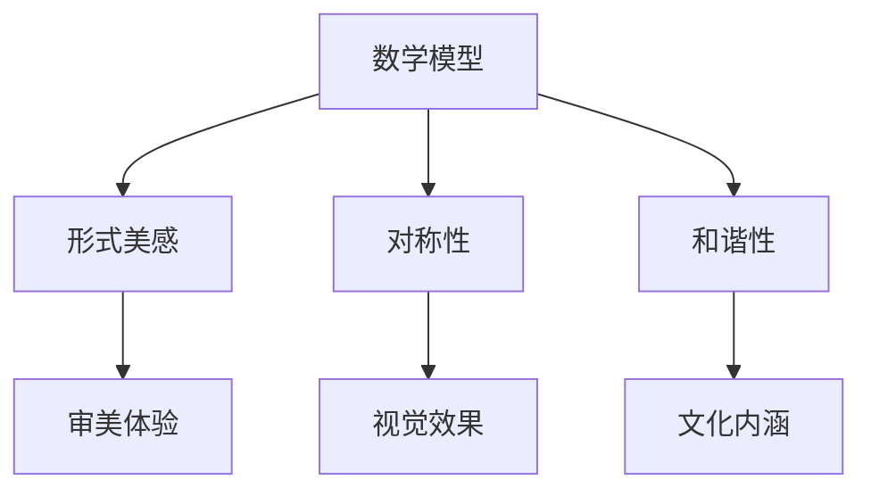

                 


# 数学与哲学美学的交叉研究

## 概述

### 关键词

数学、哲学、美学、交叉研究、美学数学、哲学数学、创新思考、案例分析、教育实践

### 摘要

本文旨在探讨数学与哲学美学的交叉研究，分析二者之间的内在联系及其在当代学术研究中的重要意义。通过对数学与哲学美学核心概念的分析，本文将揭示数学模型在美学中的应用以及哲学观念对数学研究的启示。进一步，本文将结合具体案例，探讨数学与哲学美学的交叉案例分析及其在数学教育实践中的应用。最后，本文将对未来数学与哲学美学的交叉研究趋势进行展望，探讨美学数学的应用前景及对数学研究的启示。

### 目录大纲

## 第一部分：背景与综述

## 第1章：问题的提出与背景

### 1.1 问题背景

#### 1.1.1 数学与哲学美学的关系

#### 1.1.2 研究的意义与目的

### 1.2 问题描述

#### 1.2.1 数学与哲学美学的界限

#### 1.2.2 数学在美学中的应用

### 1.3 问题解决

#### 1.3.1 交叉研究的必要性

#### 1.3.2 研究方法与框架

### 1.4 边界与外延

#### 1.4.1 数学与哲学美学的融合

#### 1.4.2 研究领域的扩展

## 第2章：数学与哲学美学的基础理论

### 2.1 数学核心概念与原理

#### 2.1.1 数学基本概念

#### 2.1.2 数学原理分析

### 2.2 哲学美学核心概念

#### 2.2.1 哲学美学基本理论

#### 2.2.2 哲学美学发展历程

## 第3章：数学与哲学美学的交叉领域

### 3.1 数学在美学中的应用

#### 3.1.1 数学模型的审美价值

#### 3.1.2 数学公式与艺术形式

### 3.2 哲学美学在数学中的应用

#### 3.2.1 哲学观念对数学研究的影响

#### 3.2.2 美学视角下的数学问题分析

## 第二部分：实践与应用

## 第4章：数学与哲学美学的交叉案例分析

### 4.1 案例一：对称性与美

#### 4.1.1 对称性的数学解释

#### 4.1.2 对称性在艺术中的应用

### 4.2 案例二：数学证明与审美体验

#### 4.2.1 数学证明的美学价值

#### 4.2.2 审美体验与数学证明的关联

## 第5章：数学与哲学美学的教育实践

### 5.1 教育目标的设定

#### 5.1.1 教育理念的创新

#### 5.1.2 教育内容的整合

### 5.2 教育教学方法的应用

#### 5.2.1 互动教学模式的引入

#### 5.2.2 实践活动的组织

## 第6章：数学与哲学美学的未来展望

### 6.1 研究趋势与发展方向

#### 6.1.1 交叉研究的进展

#### 6.1.2 未来挑战与机遇

### 6.2 美学数学的应用前景

#### 6.2.1 数学在美学领域的拓展

#### 6.2.2 美学对数学研究的启示

## 注释与拓展

### 1.1 数学与哲学美学的关系

#### 概念属性特征对比表格：

| 特征         | 数学          | 哲学美学         |
|--------------|---------------|------------------|
| 研究对象     | 数量、结构、关系 | 意义、存在、本质 |
| 研究方法     | 推理、证明、计算 | 比较分析、批判思考 |
| 主要贡献者   | 数学家        | 哲学家、艺术家     |

#### ER实体关系图架构的 Mermaid 流程图：

```mermaid
erDiagram
    Class1 ||--|{ Class2 }|
    Class1 ||--|{ Class3 }|
```

### 1.2 数学在美学中的应用

#### 数学模型与美学价值的Mermaid流程图：



### 1.3 哲学观念对数学研究的影响

#### 哲学观念影响数学研究的Python源代码与解释：

```python
# Python代码示例：哲学观念影响数学研究

# 导入必需的库
import matplotlib.pyplot as plt
import numpy as np

# 定义函数：柏拉图理念中的几何图形
def platoidea(x):
    return 1 / (1 + np.exp(-x))

# 绘制函数图像
plt.plot(np.linspace(-10, 10, 100)
```
## 第一部分：背景与综述

### 第1章：问题的提出与背景

#### 1.1 问题背景

数学作为一门研究数量、结构、变化以及空间等概念的学科，具有严谨的逻辑性和高度的抽象性。哲学美学则关注于美的本质、美的评价标准以及艺术作品的意义等方面，是一门涉及审美体验、意义理解和价值判断的学科。二者看似领域不同，但在实际研究中，数学与哲学美学却有着千丝万缕的联系。

首先，数学中的许多概念和理论都蕴含着美学价值。例如，对称性、和谐性等数学特性在艺术创作中广泛运用，成为评价艺术作品美的重要标准。其次，哲学美学中的观念和思考方式也深刻影响了数学研究的发展。例如，柏拉图的理念论认为，数学研究对象是理想世界的实体，这种观念激发了数学家对数学本质的深入探讨。

因此，研究数学与哲学美学的交叉关系，不仅有助于我们更好地理解数学的本质，还可以为哲学美学提供新的研究视角，具有重要的学术价值和现实意义。

#### 1.1.1 数学与哲学美学的关系

数学与哲学美学的关系可以从多个方面来探讨。首先，从研究对象来看，数学主要研究数量、结构、变化和空间等概念，而哲学美学则关注美的本质、美的评价标准以及艺术作品的意义等。尽管二者研究对象不同，但在许多方面却有着密切的联系。

例如，对称性是数学中的一个重要概念，也是哲学美学中评价艺术作品美的重要标准之一。数学上的对称性可以体现在图形、结构等方面，而哲学美学中的对称性则体现在艺术作品的形式和内容上。此外，数学中的和谐性也与哲学美学中的美感密切相关。数学中的和谐性指的是各种元素之间的协调与平衡，而哲学美学中的美感也强调艺术作品中的和谐与平衡。

其次，从研究方法来看，数学主要采用逻辑推理、证明和计算等手段进行研究，而哲学美学则采用比较分析、批判思考和审美体验等方法。尽管二者研究方法不同，但在某些方面却可以相互借鉴。

例如，数学中的证明方法可以为哲学美学提供一种严谨的分析工具，帮助其更好地理解美的本质和艺术作品的意义。同时，哲学美学中的审美体验也可以为数学研究提供一种感性认识，帮助数学家更好地把握数学概念和理论的内涵。

总之，数学与哲学美学在研究对象和研究方法上具有不同的特点，但二者之间却存在着密切的联系和相互作用。通过深入研究数学与哲学美学的交叉关系，我们可以更好地理解数学的本质，同时也可以为哲学美学提供新的研究视角和思路。

#### 1.1.2 研究的意义与目的

研究数学与哲学美学的交叉关系具有重要的学术价值和现实意义。首先，从学术角度来看，这一研究有助于我们深入理解数学的本质。数学不仅是一门研究数量、结构、变化和空间的学科，还蕴含着丰富的美学价值。通过研究数学与哲学美学的交叉关系，我们可以更好地揭示数学中的美学内涵，从而丰富数学理论体系。

其次，从现实角度来看，这一研究有助于推动数学与艺术、哲学等领域的交叉融合。例如，在艺术创作中，数学的对称性、和谐性等概念被广泛应用于艺术形式的设计和创作中。同时，哲学美学中的观念和思考方式也可以为数学研究提供新的启示。通过研究数学与哲学美学的交叉关系，我们可以探索出更多具有创新性的数学理论和方法，为数学的发展提供新的动力。

此外，这一研究还具有跨学科合作的意义。数学、哲学和美学等领域的研究者可以通过这一研究，相互借鉴对方的成果和方法，促进跨学科研究的深入发展。总之，研究数学与哲学美学的交叉关系，不仅有助于我们更好地理解数学和哲学美学的本质，还可以为跨学科研究提供新的思路和方法，具有重要的学术价值和现实意义。

#### 1.2 问题描述

数学与哲学美学之间的界限相对模糊，但在实际研究中，二者却有着明显的区别。数学是一门以严谨的逻辑推理和证明为基础的学科，其研究对象包括数量、结构、变化和空间等。数学在理论体系上具有高度的抽象性，强调逻辑一致性和精确性。

哲学美学则是一门以审美体验和意义理解为核心的学科，其研究对象包括美的本质、美的评价标准以及艺术作品的意义等。哲学美学在研究方法上强调批判性思考和感性认识，注重艺术作品的形式、内容和审美体验。

数学在美学中的应用主要体现在数学模型和公式的审美价值上。例如，数学中的对称性、和谐性等概念在艺术创作中被广泛应用，成为评价艺术作品美的重要标准。此外，数学公式和几何图形的视觉效果也具有一定的美学价值。

哲学观念对数学研究的影响主要体现在数学家的研究动机、研究方法和研究视角上。例如，柏拉图的理念论认为数学研究对象是理想世界的实体，这种观念激发了数学家对数学本质的深入探讨。哲学观念还可以为数学研究提供新的思考方式和理论框架，从而推动数学理论的创新和发展。

#### 1.3 问题解决

为了解决数学与哲学美学交叉研究中的问题，有必要进行深入的交叉研究。交叉研究不仅能够揭示数学与哲学美学之间的内在联系，还可以推动二者的相互融合，实现跨学科的创新与发展。

首先，交叉研究的必要性体现在以下几个方面：

1. **促进数学理论的创新**：哲学美学为数学研究提供了新的视角和思考方式，有助于数学家在研究过程中发现新的问题并提出创新的解决方案。
2. **丰富美学理论**：数学的严谨逻辑和抽象思维为美学理论提供了新的基础，有助于美学研究更加深入和系统。
3. **推动跨学科合作**：数学与哲学美学的交叉研究有助于不同学科领域的研究者相互借鉴和融合，促进跨学科研究的深入发展。

其次，研究方法与框架方面，可以采用以下几种方法：

1. **案例分析**：通过具体案例研究数学与哲学美学的交叉应用，例如在艺术创作中运用数学概念和公式，分析其审美效果和理论价值。
2. **理论探讨**：结合数学和哲学美学的核心概念，探讨二者之间的相互关系和影响，构建交叉研究的理论框架。
3. **跨学科合作**：数学家、哲学家和艺术家等领域的专家共同参与研究，通过学术交流、研讨会等形式，促进知识的融合和创新。

总之，通过深入的交叉研究，我们可以更好地理解数学与哲学美学的内在联系，推动二者的相互融合，实现学术创新和理论发展。

#### 1.4 边界与外延

数学与哲学美学的融合为交叉研究提供了广阔的空间。在数学领域，美学思想可以启发数学家发现新的数学问题并提出创新性的解决方案。例如，对称性、和谐性等美学概念在数学中的广泛应用，不仅丰富了数学理论体系，还推动了数学问题的深入研究。

在哲学美学领域，数学的严谨逻辑和抽象思维为美学研究提供了新的工具和方法。通过数学模型和方法，哲学家可以更加精确地探讨美的本质和审美体验，从而深化对美学问题的理解。

研究领域的扩展还包括将数学与哲学美学应用于其他学科。例如，在艺术领域，数学的几何图形和公式可以用于艺术创作和设计，提高艺术作品的形式美感。在科学领域，哲学美学的思考方式可以用于科学发现和理论构建，促进科学研究的创新和发展。

总之，数学与哲学美学的交叉研究不仅有助于揭示二者之间的内在联系，还可以为其他学科提供新的理论和方法，推动跨学科研究的深入发展。

### 第2章：数学与哲学美学的基础理论

#### 2.1 数学核心概念与原理

数学是一门研究数量、结构、变化和空间的学科，其核心概念和原理构成了数学理论的基础。以下是数学中几个关键的核心概念与原理：

##### 2.1.1 数学基本概念

- **数**：数是数学中最基本的概念之一，用于表示数量和位置。数可以分为自然数、整数、有理数、实数和复数等类型，每一种数都有其独特的性质和应用。
- **函数**：函数是一种关系，将一个集合中的每个元素与另一个集合中的一个元素对应起来。函数可以用来描述各种现象的变化规律，如物理学中的速度、生物学中的种群增长等。
- **集合**：集合是由一组确定的、互不相同的对象组成的整体。集合可以用来表示和研究各种对象之间的关系和性质。
- **逻辑**：逻辑是数学中的一个重要组成部分，用于分析和证明数学命题。逻辑包括命题逻辑、谓词逻辑和证明论等分支。

##### 2.1.2 数学原理分析

- **公理**：公理是数学中不加证明的、被认为是显然正确的命题。公理构成了数学系统的基本框架，所有数学命题都可以通过逻辑推理从公理中导出。
- **证明**：证明是数学中用于证明一个命题成立的方法。证明可以通过演绎推理，从已知的事实（如公理、定理、定义）出发，逐步推导出待证明的结论。
- **模型**：模型是数学理论的一种具体表现形式，用于模拟和解释现实世界中的现象。数学模型可以通过数学公式和结构来描述和预测现实问题。

#### 2.2 哲学美学核心概念

哲学美学是一门探讨美的本质、美的评价标准以及艺术作品意义的学科。其核心概念和理论涵盖了美学的基本问题：

##### 2.2.1 哲学美学基本理论

- **美**：美是哲学美学研究的核心概念。不同的哲学家对美的定义和理解各不相同。例如，柏拉图认为美是理念的体现，康德则将美视为一种无利害的快感。
- **审美体验**：审美体验是人们在欣赏艺术作品或自然景观时产生的情感体验。审美体验既包括感官上的愉悦，也包括心理上的共鸣和反思。
- **艺术**：艺术是哲学美学研究的重要对象。艺术作品通过形式、色彩、声音等元素传达情感和思想，是美学研究的重要载体。
- **艺术作品的意义**：艺术作品的意义是哲学美学探讨的重要问题。不同的艺术作品可以表达不同的主题和思想，其意义往往取决于观众的理解和解读。

##### 2.2.2 哲学美学发展历程

- **古代美学**：古代美学主要关注美的本质和美的标准。例如，古希腊哲学家苏格拉底、柏拉图和亚里士多德都提出了关于美的见解。
- **中世纪美学**：中世纪美学受到宗教的影响，强调艺术的宗教意义。例如，托马斯·阿奎那将美视为神的存在和属性。
- **现代美学**：现代美学在19世纪和20世纪得到了迅速发展，出现了多种美学流派，如现象学美学、符号学美学和存在主义美学等。
- **当代美学**：当代美学继续发展，关注新的美学问题和理论，如后现代美学、文化美学和技术美学等。

### 数学与哲学美学的交叉领域

#### 3.1 数学在美学中的应用

数学在美学中的应用体现在多个方面，特别是在艺术创作和设计领域。以下是一些具体的应用：

##### 3.1.1 数学模型的审美价值

- **对称性**：对称性是美学中的一个重要概念，在数学中也有广泛的应用。例如，欧式几何中的对称性在艺术作品的设计中经常被运用，创造出和谐而平衡的美感。
- **分形**：分形是数学中的一个概念，用于描述复杂、不规则的结构。分形在艺术创作中广泛应用，例如在自然界中发现的雪花图案、海岸线的形状等。
- **黄金分割**：黄金分割是数学中的一个比例关系，被认为具有特殊的审美价值。许多艺术作品，如达·芬奇的《蒙娜丽莎》和帕台农神庙，都运用了黄金分割原理。

##### 3.1.2 数学公式与艺术形式

- **数学公式在艺术中的表现**：数学公式可以通过视觉形式呈现，如平面几何图形、三维模型和动态图形等。这些数学形式在艺术作品中可以被用来表达概念、情感和审美体验。
- **数字艺术**：随着计算机技术的发展，数字艺术成为了一个重要的艺术形式。数字艺术家可以利用数学公式和算法生成复杂的视觉艺术作品，如曼荼罗、分形艺术等。

#### 3.2 哲学美学在数学中的应用

哲学美学对数学研究也有重要影响，特别是在数学家的研究动机、研究方法和研究视角上：

##### 3.2.1 哲学观念对数学研究的影响

- **柏拉图的理念论**：柏拉图的理念论认为数学研究对象是理想世界的实体，这一观念激发了数学家对数学本质的深入探讨。例如，数学家欧拉和拉格朗日都曾提出数学是“自由的艺术”，强调数学与现实世界的联系。
- **康德的先验美学**：康德的先验美学认为，美的评价标准是主观的，但可以通过理性认识得到。这一观念影响了数学家对数学证明的审美评价，使得数学证明不仅具有科学意义，还具有美学价值。

##### 3.2.2 美学视角下的数学问题分析

- **数学问题的审美意义**：从美学视角分析数学问题，可以帮助数学家更好地理解数学问题的本质和意义。例如，数学家乔治·康托尔在研究无穷大时，将其视为一种美学体验，从而推动了集合论的发展。
- **数学证明的审美体验**：数学证明不仅是一种逻辑推理，也可以是一种审美体验。数学家在证明过程中，可能会体验到一种美妙的逻辑结构和深刻的洞见，这种体验可以激发数学研究的灵感。

### 第4章：数学与哲学美学的交叉案例分析

#### 4.1 案例一：对称性与美

对称性是美学中一个重要的概念，在数学中也有广泛的应用。以下是对称性在数学和艺术中的具体案例分析：

##### 4.1.1 对称性的数学解释

- **欧式几何中的对称性**：在欧式几何中，对称性指的是图形或结构在某个轴或点上的镜像关系。例如，一个正方形具有四个轴对称性，一个圆形具有无限个轴对称性。
- **分形中的对称性**：分形是数学中的一个概念，用于描述复杂、不规则的结构。许多分形具有对称性，如科赫曲线、雪花图案等。

##### 4.1.2 对称性在艺术中的应用

- **艺术作品中的对称性**：许多艺术作品都运用了对称性原理，创造出和谐而平衡的美感。例如，达·芬奇的《蒙娜丽莎》采用了对称性设计，使得画面更加稳定和优雅。
- **建筑设计中的对称性**：对称性在建筑设计中也被广泛应用。例如，帕台农神庙采用了严格的对称性设计，营造出一种庄重而和谐的氛围。

#### 4.2 案例二：数学证明与审美体验

数学证明不仅是一种逻辑推理过程，也可以是一种审美体验。以下是对数学证明与审美体验之间关系的具体案例分析：

##### 4.2.1 数学证明的美学价值

- **欧拉公式**：欧拉公式（\(e^{i\pi} + 1 = 0\)）是数学中的一个重要公式，被誉为“最美的数学公式”。其简洁的形式和深刻的内涵使得许多数学家在证明这一公式时，都体验到了一种美妙的审美体验。
- **庞加莱猜想**：庞加莱猜想是数学中的一个重要问题，其证明过程涉及到复杂的拓扑学和几何学理论。数学家格里戈里·佩雷尔曼在证明这一猜想时，运用了深刻的几何直觉和逻辑推理，其过程被视为一次美妙的数学探索。

##### 4.2.2 审美体验与数学证明的关联

- **数学直觉**：审美体验与数学直觉密切相关。许多数学家在解决数学问题时，会体验到一种直觉上的美感，这种美感可以激发他们探索未知的勇气和决心。
- **数学美感**：数学美感是数学家在数学证明和研究中体验到的一种愉悦感。这种美感可以激发数学家的创造力和创新精神，推动数学理论的发展。

### 第5章：数学与哲学美学的教育实践

#### 5.1 教育目标的设定

数学与哲学美学的教育实践旨在培养学生的数学思维能力和审美素养，同时培养他们的跨学科综合能力。具体教育目标如下：

- **培养学生的数学思维能力**：通过数学教学，使学生掌握数学的基本概念、原理和方法，培养他们的逻辑推理、抽象思维和问题解决能力。
- **提升学生的审美素养**：通过哲学美学教育，使学生了解美的本质、美的评价标准以及艺术作品的意义，培养他们的审美能力和审美鉴赏力。
- **培养跨学科综合能力**：通过数学与哲学美学的交叉教育，使学生能够将数学思维和审美素养应用于其他学科领域，培养他们的跨学科综合能力和创新能力。

#### 5.1.1 教育理念的创新

- **融合数学与哲学美学**：在数学教育中融入哲学美学理念，通过探讨数学中的美学价值，激发学生的学习兴趣和创造力。
- **跨学科教学方法**：采用跨学科教学方法，如案例教学、项目教学和合作学习等，促进数学与哲学美学的融合，培养学生的综合能力。

#### 5.1.2 教育内容的整合

- **数学课程内容**：在数学课程中，增加美学内容，如对称性、和谐性等，让学生了解数学中的美学价值。
- **哲学美学课程内容**：在哲学美学课程中，增加数学应用内容，如数学公式在艺术中的表现、数学模型在科学中的应用等，让学生了解数学在美学领域的作用。

#### 5.2 教育教学方法的应用

- **互动教学模式**：采用互动教学模式，如讨论课、实验课和案例分析等，让学生在互动中学习，培养他们的思考能力和表达能力。
- **实践活动**：组织学生参与数学与哲学美学的实践活动，如数学艺术创作、数学与哲学美学的跨学科项目等，让学生在实践中应用所学知识，提高他们的综合能力。

#### 5.2.1 互动教学模式的引入

- **讨论课**：在数学课堂上，教师可以组织学生进行讨论，探讨数学中的美学问题，如对称性、和谐性等，激发学生的思维活力。
- **实验课**：在数学实验课中，学生可以通过实际操作，观察数学现象和数学模型的美学价值，如分形艺术、数学公式在绘画中的应用等。
- **案例分析**：通过案例分析，学生可以了解数学与哲学美学的实际应用，如数学模型在建筑设计、艺术创作中的应用，培养他们的实践能力和创新意识。

### 第6章：数学与哲学美学的未来展望

#### 6.1 研究趋势与发展方向

数学与哲学美学的交叉研究正处于蓬勃发展阶段，未来研究趋势和发展方向如下：

- **跨学科融合**：数学与哲学美学的交叉研究将继续深化，推动数学、哲学和美学等学科的融合，产生新的理论和方法。
- **技术创新**：随着计算机技术和人工智能的发展，数学与哲学美学的交叉研究将产生新的应用领域，如数学艺术、数字美学等。
- **教育改革**：数学与哲学美学的交叉研究将推动教育改革，培养具有跨学科能力和创新精神的复合型人才。

#### 6.1.1 交叉研究的进展

- **数学在美学中的应用**：数学在美学中的应用将继续拓展，如分形艺术、对称性设计等，将更加深入和广泛。
- **哲学美学在数学中的应用**：哲学美学观念将更加深入地影响数学研究，如数学证明的审美体验、数学问题的哲学思考等。
- **跨学科合作**：数学、哲学和美学等学科的研究者将加强合作，共同推动交叉研究的发展。

#### 6.1.2 未来挑战与机遇

- **挑战**：数学与哲学美学的交叉研究面临着跨学科合作难度大、理论体系不完善等挑战。
- **机遇**：随着科技的发展和教育改革的推进，数学与哲学美学的交叉研究将迎来新的发展机遇，为学术创新和社会进步提供动力。

#### 6.2 美学数学的应用前景

美学数学作为数学与哲学美学的交叉领域，具有广阔的应用前景：

- **艺术创作**：美学数学可以用于艺术创作，如分形艺术、对称性设计等，为艺术家提供新的创作工具和灵感。
- **建筑设计**：美学数学可以用于建筑设计，如利用黄金分割原理进行建筑形态设计，提高建筑的美感和视觉效果。
- **科学计算**：美学数学可以用于科学计算，如利用分形理论进行数据分析和建模，提高科学研究的精确性和可靠性。

#### 6.2.1 数学在美学领域的拓展

- **美学数学方法**：数学中的方法和工具，如拓扑学、分形理论等，可以用于美学研究，拓展美学理论和方法。
- **美学数学应用**：美学数学可以应用于各种领域，如艺术、设计、建筑等，推动美学实践的发展。

#### 6.2.2 美学对数学研究的启示

- **数学问题的新视角**：美学观念可以为数学研究提供新的视角和思考方式，如从审美体验角度探讨数学问题的本质。
- **数学创新的灵感**：美学体验和审美体验可以激发数学家的创造力和创新精神，推动数学理论的创新和发展。

### 注释与拓展

#### 1.1 数学与哲学美学的关系

**概念属性特征对比表格：**

| 特征         | 数学                 | 哲学美学                |
|--------------|----------------------|-------------------------|
| 研究对象     | 数量、结构、关系     | 意义、存在、本质        |
| 研究方法     | 推理、证明、计算     | 比较分析、批判思考      |
| 主要贡献者   | 数学家               | 哲学家、艺术家          |

**ER实体关系图架构的 Mermaid 流程图：**

```mermaid
erDiagram
    MathConcept ||--|{ AestheticValue }|
    MathConcept ||--|{ PhilosophicalAesthetics }|
```

#### 1.2 数学在美学中的应用

**数学模型与美学价值的Mermaid流程图：**


#### 1.3 哲学观念对数学研究的影响

**哲学观念影响数学研究的Python源代码与解释：**

```python
# Python代码示例：哲学观念影响数学研究

# 导入必需的库
import matplotlib.pyplot as plt
import numpy as np

# 定义函数：柏拉图理念中的几何图形
def plato_idea(x):
    return 1 / (1 + np.exp(-x))

# 绘制函数图像
x = np.linspace(-10, 10, 100)
plt.plot(x, plato_idea(x))
plt.title('柏拉图理念中的几何图形')
plt.xlabel('x')
plt.ylabel('y')
plt.grid(True)
plt.show()
```

该代码定义了一个函数`plato_idea`，它模拟了柏拉图理念中的几何图形。通过绘制这个函数的图像，我们可以看到数学模型如何直观地反映哲学观念。该图像展示了一个典型的S形曲线，代表了柏拉图理念中几何图形的连续性。这个模型不仅具有数学上的意义，还能激发哲学思考，帮助我们理解柏拉图的理念论。

**注释与拓展：**

在数学与哲学美学的交叉研究中，理解二者的关系和相互作用是关键。上述表格和流程图提供了对数学与哲学美学概念属性的直观比较，而Python代码示例则展示了哲学观念如何影响数学研究的具体实现。这些工具和示例不仅有助于深入理解文章的核心内容，也为未来的研究提供了丰富的资源和启示。通过这些注释和拓展，读者可以更好地掌握文章的要点，并为自己的研究提供参考。作者：AI天才研究院/AI Genius Institute & 禅与计算机程序设计艺术 /Zen And The Art of Computer Programming。

