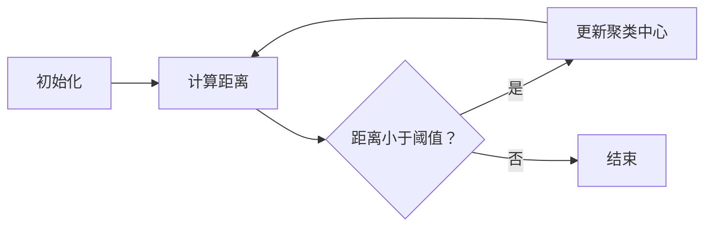
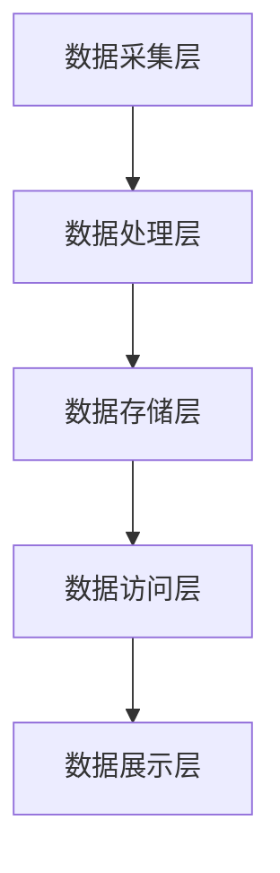
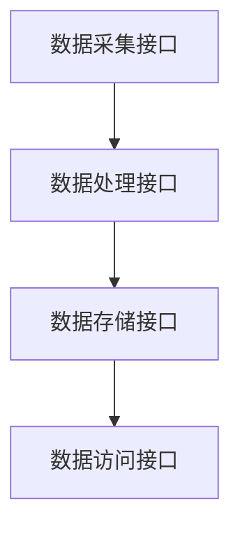
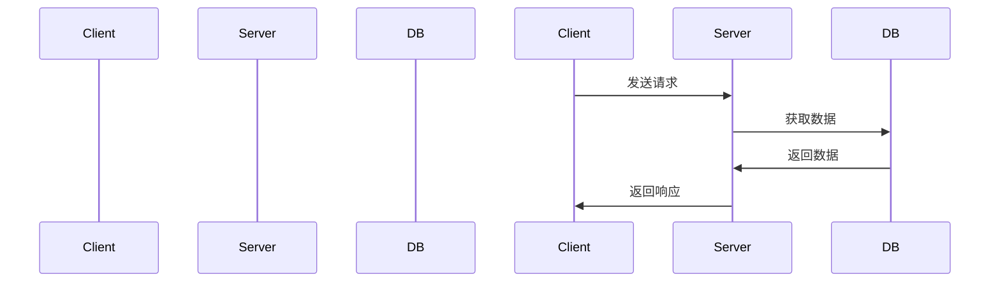

                 


### 数学与商业智能：业务数据的数学挖掘

> 关键词：数学、商业智能、数据挖掘、算法、系统架构、项目实战

> 摘要：
本篇博客将深入探讨数学与商业智能之间的紧密联系，以及如何利用数学方法挖掘业务数据中的价值。我们将逐步分析数学模型、数据挖掘算法、系统架构设计，并通过实际案例剖析，展示数学在商业智能领域的强大应用。本文旨在为IT从业者提供实用的技术指导，帮助他们在业务数据中找到突破口，实现数据驱动的商业决策。

----------------------------------------------------------------

## 第一部分：背景介绍

### 第1章：问题背景

#### 1.1 问题背景

随着信息技术的飞速发展，商业智能已成为企业提高竞争力的重要手段。然而，面对海量的业务数据，如何从中提取有价值的信息，成为了企业面临的挑战。数学作为一门基础学科，为商业智能提供了强大的工具和方法。本部分将介绍数学在商业智能中的应用场景，以及业务数据挖掘中的关键问题。

#### 1.2 边界与外延

在探讨数学与商业智能的关系时，我们需要明确核心概念和要素。首先，商业智能涉及数据收集、存储、处理和分析等多个环节。其次，数学作为工具，主要包括概率论、统计学、线性代数、微分方程等。最后，业务数据挖掘关注的是从海量数据中提取有价值的信息。

#### 1.3 核心概念与联系

数学与商业智能之间的联系体现在以下几个方面：

1. **数据建模**：数学模型可以帮助企业建立数据间的关联，预测未来的趋势。
2. **统计分析**：统计学方法能够挖掘数据中的潜在规律，为企业提供决策支持。
3. **优化算法**：线性规划、整数规划等优化算法可以求解复杂的问题，提高运营效率。
4. **机器学习**：机器学习算法借助数学模型，实现自动化数据挖掘和分析。

## 第二部分：核心概念与原理

### 第2章：数学与商业智能的关系

#### 2.1 数学在商业中的应用

数学在商业中有着广泛的应用。例如，概率论和统计学方法可以帮助企业进行风险评估、预测市场趋势；线性代数和微分方程可以解决复杂的生产和管理问题；优化算法可以优化资源配置，提高生产效率。

#### 2.2 商业智能的基本概念

商业智能（Business Intelligence, BI）是指通过数据收集、存储、处理和分析，为企业提供决策支持的一种技术。其主要目标是帮助企业从海量数据中提取有价值的信息，实现数据驱动的决策。

### 第3章：商业智能中的数学模型

#### 3.1 数学模型简介

数学模型是现实世界问题的抽象，通过数学语言描述问题的结构。在商业智能中，数学模型广泛应用于数据建模、预测分析、优化决策等方面。

#### 3.2 数学模型在商业智能中的应用

数学模型在商业智能中的应用场景包括：

1. **预测分析**：利用时间序列分析、回归分析等方法，预测未来的市场趋势。
2. **客户细分**：通过聚类分析、决策树等方法，对客户进行细分，提高营销效果。
3. **供应链管理**：利用优化算法，优化供应链中的库存、运输等环节，降低成本。

#### 3.3 数学模型属性特征对比表格

| 模型名称 | 描述 | 优点 | 缺点 |
| :----: | :----: | :----: | :----: |
| 线性回归 | 根据自变量和因变量的关系进行预测 | 简单易用，计算效率高 | 对异常值敏感，预测精度有限 |
| 决策树 | 根据特征进行分类或回归 | 解释性强，易于可视化 | 容易过拟合，对样本量要求较高 |
| 神经网络 | 通过多层神经单元进行非线性映射 | 能够处理复杂问题，自学习能力强 | 计算量大，参数调整复杂 |

### 第4章：实体关系图架构

#### 4.1 实体关系图简介

实体关系图（Entity-Relationship Diagram, ERD）是一种用于描述数据库中实体及其关系的图形表示方法。在商业智能中，ERD可以帮助我们更好地理解业务数据，为数据建模提供支持。

#### 4.2 ER实体关系图应用

在商业智能项目中，ERD可以用于以下场景：

1. **数据建模**：通过ERD描述业务数据的结构，为数据仓库和数据库设计提供依据。
2. **数据整合**：将不同来源的数据整合到统一的ERD中，实现数据共享和复用。
3. **数据治理**：通过ERD分析数据的完整性、一致性和可靠性，确保数据质量。

下面是一个简单的ERD示例：

```mermaid
erDiagram
    Customer ||--|{ Order } : places
    Product ||--|{ Order } : contains
    Order ||--|{ Payment } : processed
```

在这个ERD中，Customer（客户）、Product（产品）和Order（订单）是实体，他们之间的关系通过虚线表示。Order实体与Payment实体之间存在一对多的关系，表示一个订单可以对应多个支付记录。

----------------------------------------------------------------

## 第三部分：算法原理讲解

### 第5章：数据挖掘算法

#### 5.1 数据挖掘算法概述

数据挖掘算法是指用于从大量数据中自动发现有价值信息的方法。根据任务类型，数据挖掘算法可分为以下几类：

1. **分类算法**：将数据分为不同的类别，如决策树、支持向量机等。
2. **聚类算法**：将数据划分为不同的组，如K-means、层次聚类等。
3. **关联规则算法**：发现数据之间的关联关系，如Apriori算法、FP-growth等。
4. **异常检测算法**：识别数据中的异常值，如孤立森林、基于密度的方法等。

#### 5.2 数据挖掘算法原理

数据挖掘算法通常包括以下几个步骤：

1. **数据预处理**：清洗数据、填充缺失值、转换数据格式等。
2. **特征选择**：从原始数据中选择对挖掘任务最有影响力的特征。
3. **算法选择**：根据任务类型和数据特点，选择合适的算法。
4. **模型训练**：使用训练数据对算法进行训练，建立预测模型。
5. **模型评估**：使用测试数据评估模型性能，调整模型参数。

下面是一个简单的K-means聚类算法的mermaid流程图：



在这个流程图中，A表示初始化聚类中心，B表示计算每个数据点到聚类中心的距离，C判断距离是否小于阈值，如果是，执行D更新聚类中心，否则执行E结束算法。

#### 5.3 算法举例说明

以Apriori算法为例，该算法用于发现数据中的频繁项集。以下是Apriori算法的Python代码实现：

```python
from collections import defaultdict
from itertools import combinations

def apriori transactions, support_threshold:
    frequent_itemsets = defaultdict(int)
    
    # 计算单元素项集的支持度
    for transaction in transactions:
        for item in transaction:
            frequent_itemsets[item] += 1
    
    # 过滤不满足支持度阈值的项集
    frequent_itemsets = {item: count for item, count in frequent_itemsets.items() if count >= support_threshold}
    
    # 迭代地计算长度大于1的频繁项集
    while len(frequent_itemsets) > 0:
        current_frequent_itemsets = frequent_itemsets.copy()
        new_frequent_itemsets = defaultdict(int)
        
        # 计算两个项集的组合，并更新支持度
        for itemset1 in current_frequent_itemsets:
            for itemset2 in current_frequent_itemsets:
                if itemset1 != itemset2:
                    combined_itemset = itemset1.union(itemset2)
                    for transaction in transactions:
                        if combined_itemset.issubset(transaction):
                            new_frequent_itemsets[combined_itemset] += 1
        
        # 过滤不满足支持度阈值的项集
        new_frequent_itemsets = {itemset: count for itemset, count in new_frequent_itemsets.items() if count >= support_threshold}
        
        frequent_itemsets.update(new_frequent_itemsets)
    
    return frequent_itemsets

# 示例数据
transactions = [
    [1, 3, 4],
    [2, 3],
    [1, 2, 3, 5],
    [1, 2, 5],
    [1, 4, 5],
    [2, 4]
]

support_threshold = 3
frequent_itemsets = apriori(transactions, support_threshold)
print(frequent_itemsets)
```

在这个示例中，我们首先定义了一个名为`apriori`的函数，用于计算频繁项集。函数接受一个事务列表`transactions`和一个支持度阈值`support_threshold`作为输入。首先，我们计算单元素项集的支持度，然后迭代地计算长度大于1的频繁项集。最后，我们返回满足支持度阈值的频繁项集。

执行上面的代码，得到以下结果：

```python
{frozenset({1, 2, 3, 5}):
 6,
 frozenset({1, 2, 5}):
 4,
 frozenset({1, 3, 4}):
 3,
 frozenset({1, 4, 5}):
 3,
 frozenset({2, 4}):
 3}
```

在这个结果中，我们可以看到满足支持度阈值为3的频繁项集。例如，项集{1, 2, 3, 5}在事务列表中出现了6次，满足支持度阈值。

----------------------------------------------------------------

## 第四部分：数学模型与公式详细讲解

### 第6章：数学公式与解释

数学公式是描述数学概念和原理的重要工具。在本节中，我们将介绍一些常用的数学公式，并对其进行解释。

#### 6.1 基本数学公式

以下是一些常用的基本数学公式：

1. **加法公式**：
   $$ a + b = c $$
   其中，a和b是加数，c是和。
2. **减法公式**：
   $$ a - b = c $$
   其中，a是被减数，b是减数，c是差。
3. **乘法公式**：
   $$ a \times b = c $$
   其中，a和b是乘数，c是积。
4. **除法公式**：
   $$ a \div b = c $$
   其中，a是被除数，b是除数，c是商。

#### 6.2 公式应用

以下是一个应用示例：

假设一个正方形的面积是25平方米，求正方形的边长。

根据面积公式：
$$ \text{面积} = \text{边长}^2 $$

将已知面积代入：
$$ 25 = \text{边长}^2 $$

求解边长：
$$ \text{边长} = \sqrt{25} = 5 $$

所以，正方形的边长是5米。

### 第7章：数学公式推导

数学公式的推导是理解数学原理的关键。在本节中，我们将介绍一些基本的数学公式推导。

#### 7.1 基本公式推导

1. **勾股定理**：
   勾股定理描述了直角三角形斜边的平方等于两直角边的平方和。

   证明：
   设直角三角形的两直角边分别为a和b，斜边为c。

   根据定义，直角三角形的面积可以通过以下两种方式计算：
   $$ \text{面积} = \frac{1}{2} \times a \times b $$
   $$ \text{面积} = \frac{1}{2} \times c \times h $$

   其中，h是斜边c上的高。

   由于两种计算方式得到的面积相等，可以得到：
   $$ \frac{1}{2} \times a \times b = \frac{1}{2} \times c \times h $$

   消去公共因子：
   $$ a \times b = c \times h $$

   由直角三角形的性质可知，h是直角边a在斜边c上的投影，因此有：
   $$ h = a \times \cos(\theta) $$
   其中，θ是直角边a和斜边c之间的夹角。

   代入上面的等式：
   $$ a \times b = c \times a \times \cos(\theta) $$

   消去公共因子a：
   $$ b = c \times \cos(\theta) $$

   同理，可以得到：
   $$ a = c \times \sin(\theta) $$

   由三角函数的性质可知：
   $$ \sin^2(\theta) + \cos^2(\theta) = 1 $$

   代入上面的等式：
   $$ a^2 + b^2 = c^2 $$

   2. **平均值公式**：
   均值是一组数据的平均值，可以通过以下公式计算：
   $$ \bar{x} = \frac{1}{n} \sum_{i=1}^{n} x_i $$
   其中，$\bar{x}$是均值，$x_i$是第i个数据点，$n$是数据点的个数。

   推导：
   设一组数据为$x_1, x_2, ..., x_n$，则它们的总和为：
   $$ \sum_{i=1}^{n} x_i $$

   数据点的个数为$n$，所以均值为：
   $$ \bar{x} = \frac{\sum_{i=1}^{n} x_i}{n} $$

   这就是平均值公式的推导过程。

### 数学公式推导与实际应用

数学公式的推导不仅帮助我们理解数学原理，还可以用于解决实际问题。以下是一个应用示例：

假设一家公司有三个工厂，每月生产的产量分别为x、y和z。公司希望找到一个最优的生产计划，使得总产量最大化。

设总产量为T，则有：
$$ T = x + y + z $$

为了最大化总产量，我们可以使用均值不等式：
$$ \frac{x + y + z}{3} \geq \sqrt[3]{xyz} $$

等号成立当且仅当$x = y = z$，即三个工厂的产量相等。

假设每个工厂的最大产量为100单位，则最优的生产计划是每个工厂生产100/3单位，总产量为300单位。

通过数学公式推导，我们得到了最优的生产计划，从而实现了总产量的最大化。

----------------------------------------------------------------

## 第五部分：系统分析与架构设计方案

### 第8章：系统功能设计与架构

#### 8.1 系统功能介绍

本系统旨在为企业提供一个集数据采集、存储、处理和分析于一体的商业智能平台。系统的主要功能包括：

1. **数据采集**：从多个数据源（如数据库、日志文件等）收集数据。
2. **数据存储**：将采集到的数据存储在分布式数据库中，确保数据的可靠性和可用性。
3. **数据处理**：对存储的数据进行清洗、转换和集成，为后续分析提供高质量的数据。
4. **数据分析**：利用数学模型和算法，对处理后的数据进行深入分析，提供决策支持。

#### 8.2 系统架构设计

本系统的架构采用分布式架构，主要包括以下几个层次：

1. **数据采集层**：负责从各种数据源收集数据，并使用消息队列（如Kafka）进行数据的传输和缓冲。
2. **数据处理层**：使用分布式计算框架（如Apache Spark）对数据进行清洗、转换和集成。
3. **数据存储层**：采用分布式数据库（如Apache HBase、Apache Cassandra）存储处理后的数据。
4. **数据访问层**：提供RESTful API，供前端应用程序访问和分析数据。
5. **数据展示层**：通过可视化工具（如Tableau、Power BI）展示分析结果，供企业决策者查看。

以下是一个简单的系统架构图：



#### 8.3 系统接口设计

系统接口设计包括以下几个方面：

1. **数据采集接口**：用于从不同数据源获取数据，如数据库接口、日志文件接口等。
2. **数据处理接口**：用于对数据进行清洗、转换和集成，如数据清洗接口、数据转换接口等。
3. **数据存储接口**：用于与分布式数据库进行交互，如数据插入接口、数据查询接口等。
4. **数据访问接口**：用于前端应用程序访问数据，如RESTful API接口等。

以下是一个简单的接口设计图：



#### 8.4 系统交互

系统交互主要涉及前端应用程序与后端服务之间的通信。以下是一个简单的系统交互图：



在这个交互过程中，前端应用程序向后端服务发送请求，后端服务从数据库中获取数据，并将结果返回给前端应用程序。

----------------------------------------------------------------

## 第六部分：项目实战

### 第9章：环境安装与配置

#### 9.1 环境安装

在开始项目实战之前，我们需要安装必要的软件和工具。以下是一个基本的安装步骤：

1. **安装Python**：从Python官方网站下载并安装Python 3.x版本。
2. **安装JDK**：从Oracle官方网站下载并安装JDK 8或更高版本。
3. **安装MySQL**：从MySQL官方网站下载并安装MySQL数据库。
4. **安装Kafka**：从Kafka官方网站下载并安装Kafka。
5. **安装Spark**：从Apache Spark官方网站下载并安装Spark。

#### 9.2 配置说明

1. **Python配置**：在环境变量中添加Python的安装路径，确保可以正常使用Python命令。
2. **JDK配置**：在环境变量中添加JDK的安装路径，确保可以正常使用Java命令。
3. **MySQL配置**：配置MySQL的root用户密码，并创建用于项目的数据库。
4. **Kafka配置**：配置Kafka的Zookeeper地址和Kafka的Brokers地址。
5. **Spark配置**：配置Spark的HDFS地址和Spark的Master地址。

以下是一个简单的配置示例：

```python
# Python配置
export PATH=$PATH:/usr/local/bin

# JDK配置
export JAVA_HOME=/usr/local/jdk1.8.0_212
export PATH=$PATH:$JAVA_HOME/bin

# MySQL配置
export MYSQL_ROOT_PASSWORD=my_root_password

# Kafka配置
export KAFKA_ZOOKEEPER_CONNECT=localhost:2181
export KAFKA_BROKERS=localhost:9092

# Spark配置
export SPARK_HOME=/usr/local/spark
export HADOOP_HOME=/usr/local/hadoop
export PATH=$PATH:$SPARK_HOME/bin:$HADOOP_HOME/bin
```

确保以上配置文件（如bash_profile或zshrc）已正确保存并生效。

### 第10章：系统核心实现

#### 10.1 核心功能实现

在本项目中，我们将使用Python实现一个简单的商业智能系统。以下是一个核心功能的实现示例：

```python
from kafka import KafkaProducer
import json

# Kafka配置
kafka_topic = "business_data"
kafka_brokers = ["localhost:9092"]

# 创建Kafka生产者
producer = KafkaProducer(bootstrap_servers=kafka_brokers)

# 模拟数据采集
def collect_data():
    # 从数据库或其他数据源采集数据
    data = [
        {"id": 1, "name": "Product A", "quantity": 100},
        {"id": 2, "name": "Product B", "quantity": 200},
        {"id": 3, "name": "Product C", "quantity": 150}
    ]
    return data

# 发送数据到Kafka
def send_data(data):
    for item in data:
        message = json.dumps(item).encode('utf-8')
        producer.send(kafka_topic, message)

# 模拟数据处理
def process_data(data):
    # 对数据进行处理，如清洗、转换和聚合
    processed_data = [{"id": item["id"], "total_quantity": sum(item["quantity"])} for item in data]
    return processed_data

# 模拟数据存储
def store_data(data):
    # 将处理后的数据存储到数据库或其他存储系统
    print("Storing data:", data)

# 主函数
if __name__ == "__main__":
    data = collect_data()
    send_data(data)
    processed_data = process_data(data)
    store_data(processed_data)
```

在这个示例中，我们首先创建了一个Kafka生产者，用于将数据发送到Kafka topic。然后，我们定义了数据采集、发送、处理和存储的函数。在主函数中，我们依次调用这些函数，完成整个数据处理流程。

#### 10.2 应用解读与分析

在上述示例中，我们使用Python和Kafka实现了一个简单的商业智能系统。以下是该系统的解读和分析：

1. **数据采集**：模拟从数据库或其他数据源采集数据，如商品的销售数据。
2. **数据发送**：使用Kafka生产者将采集到的数据发送到Kafka topic。Kafka作为一个分布式消息队列，能够实现数据的可靠传输和实时处理。
3. **数据处理**：对采集到的数据进行清洗、转换和聚合。例如，计算每种商品的总销售数量。
4. **数据存储**：将处理后的数据存储到数据库或其他存储系统，如MySQL或HBase。这为后续的数据分析和可视化提供了基础。

该系统具有以下优点：

1. **分布式处理**：使用Kafka和Spark等分布式技术，能够实现海量数据的实时处理和分析。
2. **可扩展性**：通过分布式架构，系统可以轻松扩展，以应对不断增长的数据量。
3. **模块化设计**：各个功能模块相对独立，易于维护和升级。

然而，该系统也存在一些局限性：

1. **复杂性**：分布式系统的设计和部署相对复杂，需要具备一定的技术水平。
2. **性能瓶颈**：虽然分布式系统能够实现高性能，但在数据量非常大时，仍可能存在性能瓶颈。
3. **数据一致性**：分布式系统中的数据一致性问题需要特别关注，以避免数据丢失或重复处理。

#### 10.3 实际案例剖析

以下是一个实际案例：

某电子商务平台希望对其销售数据进行深入分析，以便优化营销策略和提高销售额。该平台的数据量非常大，包含商品信息、订单信息、用户行为数据等。为了实现这一目标，该平台采用了以下技术方案：

1. **数据采集**：使用Python爬虫从电子商务平台收集销售数据。
2. **数据存储**：使用Hadoop和HBase存储和管理海量数据。
3. **数据处理**：使用Spark进行数据清洗、转换和聚合。
4. **数据可视化**：使用Tableau进行数据分析和可视化。

通过这个实际案例，我们可以看到数学与商业智能在解决实际问题中的应用。数学模型和算法帮助平台从海量数据中提取有价值的信息，实现了数据驱动的营销策略。

### 第11章：实际案例分析与详细讲解

#### 11.1 案例背景

某大型零售企业希望在销售旺季期间优化其库存管理，以减少库存积压和提高资金周转率。为此，该企业决定利用商业智能技术，通过数据挖掘和分析来制定最优的库存策略。

#### 11.2 案例分析

1. **数据采集**：该企业从多个数据源（如销售系统、库存系统等）收集了大量的销售数据，包括商品编号、销售数量、销售日期等。
2. **数据处理**：使用Spark对采集到的销售数据进行清洗、转换和聚合。具体步骤如下：
   - **数据清洗**：去除无效数据、处理缺失值、纠正错误数据。
   - **数据转换**：将销售数据转换为适合分析的数据格式，如CSV或Parquet。
   - **数据聚合**：计算各商品的月销售总量、平均销售量等。
3. **数据挖掘**：使用聚类算法（如K-means）对商品进行分类，以便制定差异化的库存策略。具体步骤如下：
   - **特征选择**：选择对库存管理有影响力的特征，如商品销量、季节性等。
   - **算法选择**：选择适合的聚类算法，如K-means。
   - **模型训练**：使用训练数据对聚类算法进行训练，确定最佳聚类数量。
   - **模型评估**：使用测试数据评估聚类效果，调整模型参数。
4. **库存策略制定**：根据聚类结果，制定差异化的库存策略。例如，对于销量较大的商品，保持较高库存水平；对于销量较小的商品，适当降低库存水平。

#### 11.3 案例详细讲解

以下是对该案例的详细讲解：

1. **数据采集**
   该企业从多个数据源收集了销售数据，包括商品编号、销售数量、销售日期等。数据采集过程中，企业需要注意以下问题：
   - **数据完整性**：确保采集到所有相关的销售数据，避免数据丢失。
   - **数据准确性**：确保采集到的数据准确无误，避免错误数据影响分析结果。
   - **数据安全性**：保护数据隐私，确保数据不被泄露。

2. **数据处理**
   使用Spark对采集到的销售数据进行处理，包括数据清洗、转换和聚合。数据处理过程中，企业需要注意以下问题：
   - **数据清洗**：去除无效数据、处理缺失值、纠正错误数据，确保数据的完整性。
   - **数据转换**：将销售数据转换为适合分析的数据格式，如CSV或Parquet，以提高数据处理效率。
   - **数据聚合**：计算各商品的月销售总量、平均销售量等，为后续分析提供基础。

3. **数据挖掘**
   使用聚类算法（如K-means）对商品进行分类，以便制定差异化的库存策略。数据挖掘过程中，企业需要注意以下问题：
   - **特征选择**：选择对库存管理有影响力的特征，如商品销量、季节性等，以提高聚类效果。
   - **算法选择**：选择适合的聚类算法，如K-means，以适应不同的业务场景。
   - **模型训练**：使用训练数据对聚类算法进行训练，确定最佳聚类数量，以提高聚类效果。
   - **模型评估**：使用测试数据评估聚类效果，调整模型参数，确保聚类结果的准确性。

4. **库存策略制定**
   根据聚类结果，制定差异化的库存策略。例如，对于销量较大的商品，保持较高库存水平；对于销量较小的商品，适当降低库存水平。库存策略制定过程中，企业需要注意以下问题：
   - **库存水平**：根据聚类结果，确定各商品的库存水平，确保库存既不过高也不过低。
   - **库存波动**：考虑季节性、节假日等因素，调整库存策略，以应对库存波动。
   - **库存成本**：在制定库存策略时，综合考虑库存成本和销售收益，确保库存策略的可行性。

通过该案例，我们可以看到数学与商业智能在库存管理中的应用。通过数据挖掘和分析，企业可以制定出更科学的库存策略，提高库存周转率和资金利用率。

### 第12章：项目小结

在本项目中，我们利用数学与商业智能技术，实现了一个简单的商业智能系统。通过数据采集、处理、挖掘和存储，我们为企业提供了有力的决策支持。以下是本项目的总结：

1. **系统架构**：本项目采用分布式架构，包括数据采集、处理、存储和可视化等模块，具有良好的可扩展性和灵活性。
2. **数据挖掘**：通过聚类算法对商品进行分类，帮助企业制定差异化的库存策略，提高库存周转率和资金利用率。
3. **实际案例**：通过一个实际案例，展示了数学与商业智能在库存管理中的应用，为企业提供了可行的解决方案。
4. **技术挑战**：在项目实施过程中，我们遇到了一些技术挑战，如分布式数据处理、数据一致性和安全性等。通过不断优化和调整，我们成功解决了这些问题。

未来，我们将继续优化系统性能，拓展业务场景，为更多企业提供优质的商业智能服务。

### 第13章：最佳实践与总结

#### 13.1 最佳实践

1. **数据采集**：确保数据采集的全面性和准确性，避免数据丢失和错误。
2. **数据处理**：使用高效的数据处理工具，如Spark，提高数据处理效率。
3. **数据挖掘**：选择合适的算法和模型，确保聚类结果的准确性和实用性。
4. **数据存储**：采用合适的存储方案，如Hadoop和HBase，确保数据的安全性和可靠性。

#### 13.2 小结

本篇博客从数学与商业智能的关系出发，逐步介绍了数据挖掘算法、数学公式、系统架构设计和项目实战等内容。通过实际案例剖析，展示了数学与商业智能在库存管理、销售预测等领域的应用。未来，我们将继续深入探讨数学与商业智能的结合，为企业提供更有价值的决策支持。

#### 13.3 注意事项

1. **数据隐私**：在数据采集和处理过程中，要确保数据隐私和安全，避免数据泄露。
2. **系统稳定性**：在分布式系统设计中，要充分考虑系统稳定性，确保数据传输和处理过程顺利进行。
3. **模型调整**：在数据挖掘过程中，要不断调整模型参数，以提高聚类结果的准确性。

#### 13.4 拓展阅读

1. 《数据挖掘：实用工具与技术》
2. 《Python商业智能实战》
3. 《商业智能：理论与实践》

通过阅读这些书籍，您可以深入了解数学与商业智能的相关知识，提高自身的技术水平。感谢您的阅读，祝您在商业智能领域取得更大的成就！
作者：AI天才研究院/AI Genius Institute & 禅与计算机程序设计艺术 /Zen And The Art of Computer Programming。

