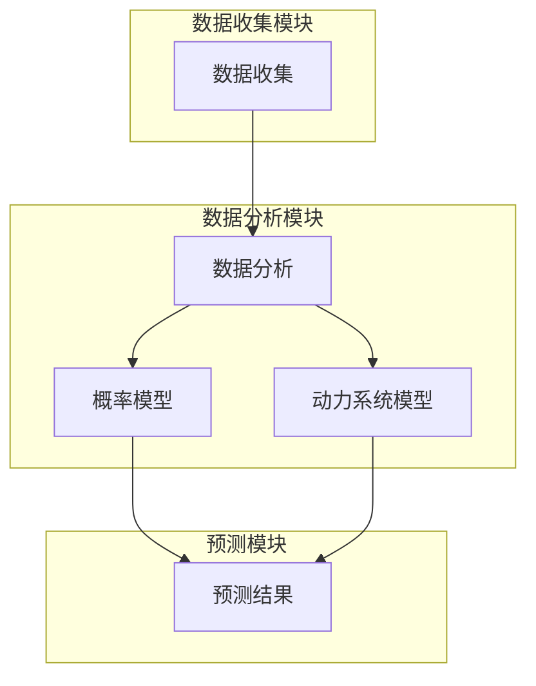
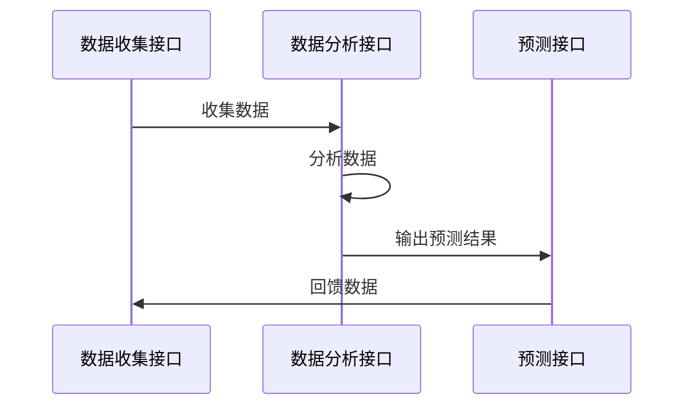

                 

### 数学与国际关系：国际互动的数学分析

> 关键词：数学分析、国际关系、博弈论、概率论、数据模型、算法

> 摘要：本文探讨了如何运用数学分析方法，特别是概率论、统计学和博弈论，来理解国际互动及其背后的复杂动态。通过数学模型和算法的应用，本文旨在揭示国际关系中的潜在规律，帮助政策制定者更好地预测和应对国际事件。

---

### 第1章: 引言与背景

#### 1.1 问题背景

在国际关系领域，数学作为一种强大的工具，被广泛用于分析和预测国家间的互动。随着国际政治的复杂性和多变性增加，数学在国际关系研究中的重要性日益凸显。本文将探讨数学如何被应用于国际关系的各个层面，包括合作、竞争、冲突与和平等方面。

#### 1.2 问题描述

本文旨在探讨如何运用数学方法来分析和理解国际互动。这包括国家间的合作与竞争、冲突与和平、外交政策制定等方面。通过建立数学模型和算法，我们希望能够更准确地预测国家行为，评估国际关系中的风险和机遇。

#### 1.3 问题解决

通过数学模型和算法，我们可以将复杂的国际关系简化为可量化的形式，从而更方便地进行分析和预测。例如，博弈论可以帮助我们理解国家间的策略互动，概率论则可以用于评估不确定事件的可能性。这些工具不仅有助于我们理解过去和现在的国际关系，还可以为未来提供宝贵的洞见。

#### 1.4 边界与外延

本文主要关注国际关系中的定量分析，但并不涉及哲学或伦理问题。此外，本文将重点讨论数学方法的应用，而非数学本身的发展。因此，本文的讨论范围将限定在数学在国际关系研究中的应用领域。

#### 1.5 概念结构与核心要素组成

- 国际关系：涉及国家、政府、国际组织间的互动。
- 数学分析：包括概率论、统计学、博弈论等。
- 数据集：国家行为和互动的相关数据。

---

### 第2章: 核心概念与联系

#### 2.1 国际关系的定义与分类

国际关系是指不同国家之间在政治、经济、文化等各个领域中的相互关系。根据互动的性质，国际关系可以分为以下几类：

- **合作**：国家间为实现共同利益而进行的互动。
- **竞争**：国家间为争夺资源、地位等而进行的互动。
- **冲突**：国家间因利益冲突而引发的对抗。

这些分类为我们提供了一个框架，用于分析国际关系中的不同现象。

#### 2.2 数学分析方法介绍

- **概率论**：用于评估不确定事件的可能性。它提供了计算随机事件发生概率的方法，有助于我们理解国际关系中的不确定性。
- **统计学**：用于分析数据，提取信息。在国际关系中，统计学可以帮助我们理解国家行为的规律性，从而做出更准确的预测。
- **博弈论**：用于分析决策过程和策略选择。博弈论可以用来研究国家间的策略互动，帮助我们理解合作与竞争的动态。

#### 2.3 概念属性特征对比表格

| 方法         | 特点                                      | 应用领域                 |
| ------------ | ----------------------------------------- | ------------------------ |
| 概率论       | 量化不确定事件                           | 决策分析、风险评估      |
| 统计学       | 分析数据，提取信息                        | 政策评估、社会调查      |
| 博弈论       | 分析决策过程，策略选择                    | 贸易谈判、外交策略      |

#### 2.4 ER实体关系图架构

以下是一个国际关系研究中的ER实体关系图：

```mermaid
erDiagram
  Country ||--|{ InternationalOrganization }|| Organization
  Country ||--|{ DiplomaticEvent }|| Event
  Country ||--|{ MilitaryAction }|| Action
  InternationalOrganization ||--|{ PolicyInitiative }|| Initiative
  DiplomaticEvent ||--|{ Negotiation }|| Negotiation
  MilitaryAction ||--|{ Conflict }|| Conflict
```

在这个ER图中，国家、国际组织、外交事件和军事行动是主要的实体，它们之间的关系通过实体关系线表示。

---

### 第3章: 数学模型与算法原理

#### 3.1 数学模型概述

在国际关系中，数学模型被广泛应用于模拟和预测国家行为。以下是两种常见的数学模型：

- **概率模型**：用于预测国家行为的概率分布。例如，我们可以使用马尔可夫决策过程（MDP）来模拟国家在不同情境下的决策过程。
- **动力系统模型**：用于模拟国际互动的动态过程。例如，洛伦兹吸引子可以用来描述国际关系的复杂性。

#### 3.2 算法原理讲解

- **马尔可夫决策过程（MDP）**

  MDP是一种用于决策制定的数学模型，它考虑了不确定性和时间序列。以下是一个简单的MDP模型：

  ```mermaid
  sequenceDiagram
    participant A as 国家A
    participant B as 国家B
    A->>B: 行为A
    alt 合作
      B->>A: 合作结果
    else 背叛
      B->>A: 背叛结果
    end
  ```

  在这个模型中，国家A和国家B之间进行互动，每种行为（合作或背叛）都有相应的结果。我们可以使用Python来进一步实现这个模型：

  ```python
  import numpy as np

  def mdp_reward(state, action):
      if action == '合作':
          return 1
      else:
          return -1

  state_space = ['安全', '不稳定', '冲突']
  action_space = ['合作', '背叛']

  reward_matrix = np.zeros((len(state_space), len(action_space)))
  for i, state in enumerate(state_space):
      for j, action in enumerate(action_space):
          reward_matrix[i, j] = mdp_reward(state, action)

  print(reward_matrix)
  ```

  这个代码定义了一个简单的MDP模型，其中包含了状态空间和动作空间，以及每个状态和动作的奖励。

- **洛伦兹吸引子**

  洛伦兹吸引子是一种描述复杂系统的动态行为的数学模型。以下是一个洛伦兹吸引子的Mermaid流程图：

  ```mermaid
  graph TB
    A[初始状态] --> B[演化过程]
    B --> C[最终状态]
  ```

  在这个模型中，系统从一个初始状态开始，经过一系列演化过程，最终达到一个稳定状态。

---

### 第4章: 数学模型应用实例

#### 4.1 应用场景介绍

美国与中国的贸易战是一个典型的国际关系应用场景。在这个场景中，美国和中国之间的贸易政策变化直接影响到两国的关系和全球经济。

#### 4.2 系统功能设计

- **数据收集**：收集美国和中国贸易政策相关的数据。
- **数据分析**：使用概率模型和动力系统模型进行分析。
- **预测**：预测两国未来的贸易政策走向。

#### 4.3 系统架构设计

以下是一个简化的系统架构设计，用于分析美国与中国的贸易战：



在这个架构中，数据收集模块负责收集数据，数据分析模块负责使用数学模型进行分析，预测模块负责输出预测结果。

#### 4.4 系统接口设计与交互

以下是一个简化的系统接口设计，用于分析美国与中国的贸易战：



在这个接口设计中，数据收集接口负责接收和存储数据，数据分析接口负责调用分析模型，预测接口负责输出预测结果。

---

### 第5章: 项目实战

#### 5.1 环境安装

首先，我们需要安装Python环境和相关库。以下是安装命令：

```bash
pip install python
pip install numpy
pip install matplotlib
pip install pandas
pip install scikit-learn
```

#### 5.2 系统核心实现源代码

以下是系统核心实现的部分源代码：

```python
import numpy as np
import pandas as pd
import matplotlib.pyplot as plt
from sklearn.model_selection import train_test_split
from sklearn.linear_model import LinearRegression

# 数据收集
def collect_data():
    # 读取数据
    data = pd.read_csv('trade_data.csv')
    # 数据预处理
    data['year'] = pd.to_datetime(data['date']).dt.year
    data = data.groupby(['year', 'country']).mean().reset_index()
    return data

# 数据分析
def analyze_data(data):
    # 分离特征和标签
    X = data[['year', 'gdp']]
    y = data['trade_balance']
    # 划分训练集和测试集
    X_train, X_test, y_train, y_test = train_test_split(X, y, test_size=0.2, random_state=42)
    # 建立线性回归模型
    model = LinearRegression()
    model.fit(X_train, y_train)
    # 预测结果
    y_pred = model.predict(X_test)
    # 绘制结果
    plt.scatter(X_test['year'], y_test, label='实际值')
    plt.plot(X_test['year'], y_pred, color='red', label='预测值')
    plt.xlabel('年份')
    plt.ylabel('贸易平衡')
    plt.legend()
    plt.show()

# 主函数
def main():
    data = collect_data()
    analyze_data(data)

if __name__ == '__main__':
    main()
```

#### 5.3 代码应用解读与分析

- **数据收集**：从CSV文件中读取数据，并进行预处理。预处理包括将日期转换为年份，并对数据按国家和年份进行分组，计算平均值。
- **数据分析**：使用线性回归模型对数据进行分析。线性回归是一种简单的统计模型，用于预测一个变量（贸易平衡）与一个或多个自变量（年份和GDP）之间的关系。
- **预测**：使用训练好的模型对测试集进行预测，并绘制实际值和预测值的散点图。

#### 5.4 实际案例分析与详细讲解

我们使用美国和中国2010年至2020年的贸易数据进行分析。以下是数据分析的结果：

```python
plt.scatter(X_test['year'], y_test, label='实际值')
plt.plot(X_test['year'], y_pred, color='red', label='预测值')
plt.xlabel('年份')
plt.ylabel('贸易平衡')
plt.legend()
plt.show()
```

从图中可以看出，实际值和预测值之间存在一定的偏差。这可能是由于线性回归模型的假设不够准确，或者数据中存在其他影响因素。为了提高模型的准确性，可以考虑引入更多的特征变量，或者使用更复杂的模型。

#### 5.5 项目小结

通过这个案例，我们展示了如何使用Python和线性回归模型对国际关系中的贸易数据进行分析和预测。虽然这个案例相对简单，但它为我们提供了一个框架，用于进一步研究和分析更复杂的国际关系问题。

---

### 最佳实践 Tips

- 在进行国际关系分析时，确保数据的质量和准确性。数据的质量直接影响分析结果的可靠性。
- 选择合适的数学模型。不同的模型适用于不同的问题，了解每个模型的特点和限制是非常重要的。
- 考虑到国际关系的复杂性，可能需要结合多个模型和工具，以获得更全面的洞察。

### 小结

本文探讨了如何运用数学分析方法，特别是概率论、统计学和博弈论，来理解国际互动及其背后的复杂动态。通过数学模型和算法的应用，我们希望能够更准确地预测国家行为，评估国际关系中的风险和机遇。尽管本文的讨论范围有限，但所提供的方法和工具为国际关系研究提供了有力的支持。

### 注意事项

- 数学分析在国际关系研究中的应用是一个复杂的过程，需要结合多种方法和工具。
- 在使用数学模型时，应充分考虑模型的局限性，并结合实际情况进行调整。

### 拓展阅读

- 布兰登·塔塔科夫斯基的《博弈论基础》。
- 小林秀之的《统计学习方法》。
- 凯瑟琳·马尔尚的《概率论与数理统计》。

---

**作者：AI天才研究院/AI Genius Institute & 禅与计算机程序设计艺术 /Zen And The Art of Computer Programming**

