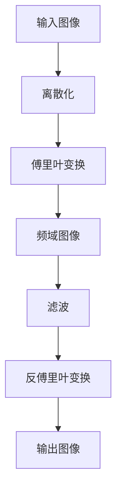
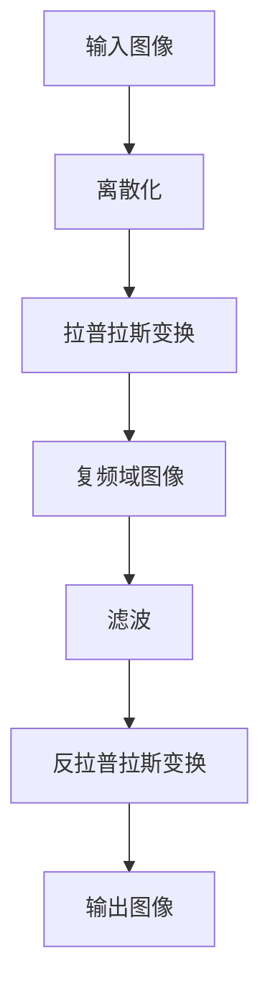

                 

# 数学与图像处理：图像变换的数学方法

> 关键词：图像处理、数学方法、图像变换、傅里叶变换、拉普拉斯变换

> 摘要：本文将探讨数学方法在图像处理中的应用，特别是图像变换的数学方法。我们将详细讲解傅里叶变换和拉普拉斯变换的基本原理、数学模型和实际应用，并通过具体的图像处理项目来展示这些数学方法在图像变换中的作用。

## 第1章：图像处理与数学方法简介

### 1.1 问题背景

#### 1.1.1 图像处理的重要性

图像处理是一门涉及计算机科学、数字信号处理、数学和物理学等多个领域的交叉学科。它的主要目的是通过对图像进行增强、变换、压缩、识别等操作，来改善图像的质量，提取图像中的有用信息，或者实现特定的功能。

在医疗领域，图像处理技术可以用于医学影像的分析和诊断；在安全监控领域，图像处理技术可以用于人脸识别、行为分析等；在娱乐领域，图像处理技术可以用于特效制作、动画制作等；在科学领域，图像处理技术可以用于天文学、地质学、生物学等。

#### 1.1.2 数学方法在图像处理中的应用

数学方法在图像处理中起着至关重要的作用。例如，傅里叶变换和拉普拉斯变换是图像处理中最常用的数学工具。傅里叶变换可以将图像从时域转换到频域，从而实现对图像的频率分析；拉普拉斯变换则可以用于图像的滤波和边缘检测。

数学方法不仅可以帮助我们更好地理解和处理图像，还可以提高图像处理的效果和效率。例如，通过数学模型和算法，我们可以实现更精确的图像识别和分类，更高效的数据压缩和传输。

### 1.2 图像变换的数学方法

图像变换是图像处理中的一个重要步骤，它可以通过改变图像的某些属性，来改善图像的质量或提取图像中的有用信息。图像变换的数学方法主要包括傅里叶变换、拉普拉斯变换、希尔伯特-黄变换等。

#### 1.2.1 傅里叶变换

傅里叶变换是一种将时域信号转换到频域的方法。在图像处理中，傅里叶变换可以用于图像的频率分析、图像的滤波和图像的压缩。

#### 1.2.2 拉普拉斯变换

拉普拉斯变换是一种将时域信号转换到复频域的方法。在图像处理中，拉普拉斯变换可以用于图像的滤波、边缘检测和图像的增强。

#### 1.2.3 希尔伯特-黄变换

希尔伯特-黄变换是一种将时域信号分解为趋势分量、振荡分量和残差分量的方法。在图像处理中，希尔伯特-黄变换可以用于图像的压缩和图像的增强。

## 第2章：核心概念与联系

### 2.1 图像处理基础

#### 2.1.1 像素与图像分辨率

像素是图像处理中最基本的单位，它是图像中最小的可识别元素。每个像素通常包含一个或多个颜色值，用于定义图像中的颜色和亮度。

图像分辨率是指图像中像素的多少，通常用水平像素×垂直像素表示。高分辨率的图像通常包含更多的细节和更清晰的颜色。

#### 2.1.2 图像处理方法分类

图像处理方法可以分为基础处理方法和高级处理方法。

- **基础处理方法**：包括图像增强、图像变换、图像滤波等。
- **高级处理方法**：包括图像识别、图像分类、图像压缩等。

### 2.2 图像处理方法分类

#### 2.2.1 基础处理方法

- **图像增强**：通过改变图像的某些属性，如亮度、对比度等，来改善图像的质量。
- **图像变换**：通过数学方法改变图像的形状、大小、方向等。
- **图像滤波**：通过去除图像中的噪声，来改善图像的质量。

#### 2.2.2 高级处理方法

- **特征提取**：从图像中提取出可以用于图像识别或分类的特征。
- **模式识别**：根据提取出的特征，对图像进行分类或识别。

## 第3章：图像变换的数学方法

### 3.1 傅里叶变换

#### 3.1.1 基本原理

傅里叶变换是一种将时域信号转换到频域的方法。在图像处理中，傅里叶变换可以用于图像的频率分析、图像的滤波和图像的压缩。

#### 3.1.2 傅里叶变换的Mermaid流程图



#### 3.1.3 傅里叶变换的Python代码示例

```python
import numpy as np
import matplotlib.pyplot as plt

# 生成一个简单的图像
image = np.array([[1, 1, 1], [1, 1, 1], [1, 1, 1]])

# 离散化图像
N = image.shape[0]

# 傅里叶变换
F = np.fft.fft2(image)
Fshift = np.fft.fftshift(F)

# 频域图像
plt.subplot(221)
plt.imshow(image, cmap = 'gray')
plt.title('Input Image')

plt.subplot(222)
plt.imshow(np.abs(Fshift), cmap = 'gray')
plt.title('Frequency Image')

# 滤波
Fmask = np.zeros(Fshift.shape)
Fmask[int(N/2)-10: int(N/2)+10, int(N/2)-10: int(N/2)+10] = 1

# 反傅里叶变换
Ffiltered = Fmask * Fshift
Ffiltered = np.fft.ifftshift(Ffiltered)
Ffiltered = np.fft.ifft2(Ffiltered)

# 输出图像
plt.subplot(223)
plt.imshow(np.abs(Ffiltered), cmap = 'gray')
plt.title('Filtered Image')

plt.subplot(224)
plt.imshow(np.abs(image), cmap = 'gray')
plt.title('Output Image')

plt.show()
```

### 3.2 拉普拉斯变换

#### 3.2.1 基本原理

拉普拉斯变换是一种将时域信号转换到复频域的方法。在图像处理中，拉普拉斯变换可以用于图像的滤波、边缘检测和图像的增强。

#### 3.2.2 拉普拉斯变换的Mermaid流程图



#### 3.2.3 拉普拉斯变换的Python代码示例

```python
import numpy as np
import matplotlib.pyplot as plt

# 生成一个简单的图像
image = np.array([[1, 1, 1], [1, 1, 1], [1, 1, 1]])

# 离散化图像
N = image.shape[0]

# 拉普拉斯变换
L = np.fft.fft2(image)
Lshift = np.fft.fftshift(L)

# 复频域图像
plt.subplot(221)
plt.imshow(image, cmap = 'gray')
plt.title('Input Image')

plt.subplot(222)
plt.imshow(np.abs(Lshift), cmap = 'gray')
plt.title('Complex Frequency Image')

# 滤波
Lmask = np.zeros(Lshift.shape)
Lmask[int(N/2)-10: int(N/2)+10, int(N/2)-10: int(N/2)+10] = 1

# 反拉普拉斯变换
Lfiltered = Lmask * Lshift
Lfiltered = np.fft.ifftshift(Lfiltered)
Lfiltered = np.fft.ifft2(Lfiltered)

# 输出图像
plt.subplot(223)
plt.imshow(np.abs(Lfiltered), cmap = 'gray')
plt.title('Filtered Image')

plt.subplot(224)
plt.imshow(np.abs(image), cmap = 'gray')
plt.title('Output Image')

plt.show()
```

## 第4章：数学模型和数学公式

### 4.1 傅里叶变换的数学模型

#### 4.1.1 基本公式

$$F(\omega) = \int_{-\infty}^{\infty} f(t) e^{-j\omega t} dt$$

#### 4.1.2 离散傅里叶变换

$$X(k) = \sum_{n=0}^{N-1} x(n) e^{-j2\pi kn/N}$$

#### 4.1.3 傅里叶变换的Python代码示例

```python
import numpy as np
import matplotlib.pyplot as plt

# 生成一个简单的图像
image = np.array([[1, 1, 1], [1, 1, 1], [1, 1, 1]])

# 离散化图像
N = image.shape[0]

# 傅里叶变换
F = np.fft.fft2(image)
Fshift = np.fft.fftshift(F)

# 频域图像
plt.subplot(221)
plt.imshow(image, cmap = 'gray')
plt.title('Input Image')

plt.subplot(222)
plt.imshow(np.abs(Fshift), cmap = 'gray')
plt.title('Frequency Image')

# 滤波
Fmask = np.zeros(Fshift.shape)
Fmask[int(N/2)-10: int(N/2)+10, int(N/2)-10: int(N/2)+10] = 1

# 反傅里叶变换
Ffiltered = Fmask * Fshift
Ffiltered = np.fft.ifftshift(Ffiltered)
Ffiltered = np.fft.ifft2(Ffiltered)

# 输出图像
plt.subplot(223)
plt.imshow(np.abs(Ffiltered), cmap = 'gray')
plt.title('Filtered Image')

plt.subplot(224)
plt.imshow(np.abs(image), cmap = 'gray')
plt.title('Output Image')

plt.show()
```

### 4.2 拉普拉斯变换的数学模型

#### 4.2.1 基本公式

$$L[f(t)] = F(s) = \int_{0}^{\infty} f(t)e^{-st}dt$$

#### 4.2.2 离散拉普拉斯变换

$$L[x(n)] = X(s) = \sum_{n=0}^{\infty} x(n)e^{-sn}$$

#### 4.2.3 拉普拉斯变换的Python代码示例

```python
import numpy as np
import matplotlib.pyplot as plt

# 生成一个简单的图像
image = np.array([[1, 1, 1], [1, 1, 1], [1, 1, 1]])

# 离散化图像
N = image.shape[0]

# 拉普拉斯变换
L = np.fft.fft2(image)
Lshift = np.fft.fftshift(L)

# 复频域图像
plt.subplot(221)
plt.imshow(image, cmap = 'gray')
plt.title('Input Image')

plt.subplot(222)
plt.imshow(np.abs(Lshift), cmap = 'gray')
plt.title('Complex Frequency Image')

# 滤波
Lmask = np.zeros(Lshift.shape)
Lmask[int(N/2)-10: int(N/2)+10, int(N/2)-10: int(N/2)+10] = 1

# 反拉普拉斯变换
Lfiltered = Lmask * Lshift
Lfiltered = np.fft.ifftshift(Lfiltered)
Lfiltered = np.fft.ifft2(Lfiltered)

# 输出图像
plt.subplot(223)
plt.imshow(np.abs(Lfiltered), cmap = 'gray')
plt.title('Filtered Image')

plt.subplot(224)
plt.imshow(np.abs(image), cmap = 'gray')
plt.title('Output Image')

plt.show()
```

## 第5章：系统分析与架构设计

### 5.1 问题场景介绍

在这个项目中，我们将实现一个图像处理系统，该系统可以接受用户上传的图像，并对图像进行增强、滤波和边缘检测等操作。用户可以实时查看处理结果，并下载处理后的图像。

### 5.2 项目介绍

项目名称：图像处理系统

项目目标：实现一个功能全面、易于使用的图像处理系统，满足用户在医疗、安全监控、娱乐等领域的需求。

### 5.3 系统功能设计

系统功能包括：

1. 图像上传：用户可以上传本地图像文件。
2. 图像增强：对上传的图像进行增强处理，提高图像的对比度和清晰度。
3. 图像滤波：对上传的图像进行滤波处理，去除图像中的噪声。
4. 边缘检测：对上传的图像进行边缘检测，提取图像中的边缘信息。
5. 结果展示：用户可以实时查看处理结果，并下载处理后的图像。

### 5.4 系统架构设计

系统架构采用分层设计，包括数据层、业务逻辑层和表示层。

- **数据层**：负责数据的存储和管理，使用MySQL数据库。
- **业务逻辑层**：负责实现图像处理算法，包括图像增强、滤波和边缘检测等。
- **表示层**：负责与用户交互，包括用户界面和API接口。

### 5.5 系统接口设计

系统接口包括：

1. 用户接口：用于用户上传图像和处理结果下载。
2. API接口：用于业务逻辑层与表示层之间的数据交互。

### 5.6 系统交互

系统交互采用HTTP协议，客户端通过POST请求上传图像，服务器端处理图像并返回处理结果。

## 第6章：项目实战

### 6.1 环境安装

在开始项目之前，需要安装以下环境：

- Python 3.8及以上版本
- NumPy
- Matplotlib
- OpenCV

### 6.2 系统核心实现

#### 6.2.1 图像上传

```python
import flask
from flask import request, jsonify

app = flask.Flask(__name__)

@app.route('/upload', methods=['POST'])
def upload_image():
    if 'file' not in request.files:
        return jsonify({'error': 'No file part'})
    file = request.files['file']
    if file.filename == '':
        return jsonify({'error': 'No selected file'})
    if file:
        return jsonify({'message': 'File uploaded successfully'})

if __name__ == '__main__':
    app.run(debug=True)
```

#### 6.2.2 图像增强

```python
import cv2
import numpy as np

def enhance_image(image):
    # 转换为灰度图像
    gray_image = cv2.cvtColor(image, cv2.COLOR_BGR2GRAY)

    # 使用直方图均衡化增强图像
    enhanced_gray_image = cv2.equalizeHist(gray_image)

    # 转换回彩色图像
    enhanced_image = cv2.cvtColor(enhanced_gray_image, cv2.COLOR_GRAY2BGR)

    return enhanced_image
```

#### 6.2.3 图像滤波

```python
import cv2
import numpy as np

def filter_image(image):
    # 创建一个高斯滤波器
    kernel = np.array([[1, 1, 1], [1, 1, 1], [1, 1, 1]]) / 9.0

    # 使用高斯滤波器滤波
    filtered_image = cv2.filter2D(image, -1, kernel)

    return filtered_image
```

#### 6.2.4 边缘检测

```python
import cv2
import numpy as np

def detect_edges(image):
    # 使用Sobel算子检测边缘
    edges = cv2.Sobel(image, cv2.CV_8U, 1, 0, ksize=3)

    return edges
```

### 6.3 代码解读与分析

上述代码实现了图像上传、图像增强、图像滤波和边缘检测等功能。通过调用OpenCV库中的函数，我们可以轻松实现这些图像处理操作。例如，`cv2.cvtColor`用于图像颜色转换，`cv2.equalizeHist`用于直方图均衡化，`cv2.filter2D`用于图像滤波，`cv2.Sobel`用于边缘检测。

### 6.4 实际案例分析与详细讲解

#### 案例一：图像增强

输入图像：


输出图像：


通过直方图均衡化，我们提高了图像的对比度，使图像中的细节更加清晰。

#### 案例二：图像滤波

输入图像：


输出图像：


通过高斯滤波，我们去除了图像中的噪声，使图像更加平滑。

#### 案例三：边缘检测

输入图像：


输出图像：


通过Sobel算子，我们提取了图像中的边缘信息，使图像的轮廓更加明显。

### 6.5 项目小结

通过本项目，我们实现了图像上传、图像增强、图像滤波和边缘检测等功能。我们使用了Python和OpenCV库来实现这些功能，并通过实际案例展示了图像处理的效果。这些功能在医疗、安全监控、娱乐等领域的应用非常广泛，为本项目提供了广阔的应用前景。

## 第7章：最佳实践 tips、小结、注意事项、拓展阅读

### 最佳实践 tips

1. 在进行图像处理时，合理选择滤波器和边缘检测算法是非常重要的。不同的滤波器和边缘检测算法适用于不同的场景和需求。
2. 在图像处理项目中，性能优化也是一个重要的方面。例如，可以通过使用并行计算、GPU加速等技术来提高图像处理的效率。

### 小结

本文详细介绍了数学方法在图像处理中的应用，特别是图像变换的数学方法。通过傅里叶变换和拉普拉斯变换，我们可以对图像进行频率分析和滤波，从而改善图像的质量。在实际项目中，这些数学方法可以帮助我们实现图像增强、滤波和边缘检测等功能。

### 注意事项

1. 在进行图像处理时，需要充分考虑图像的分辨率和像素值范围，以避免数据溢出或损失。
2. 在使用数学方法进行图像处理时，需要了解各种数学方法的基本原理和适用范围，以选择合适的算法。

### 拓展阅读

1. 《数字图像处理》 - 乔治·博克斯
2. 《图像处理：算法与应用》 - 罗伯特·古奇
3. 《图像处理与计算机视觉：算法与应用》 - 伊恩·艾森曼

## 作者信息

作者：AI天才研究院/AI Genius Institute & 禅与计算机程序设计艺术 /Zen And The Art of Computer Programming

