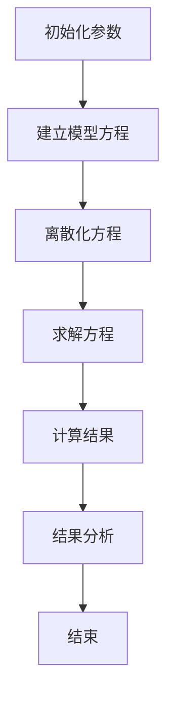
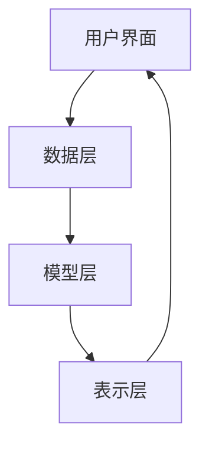
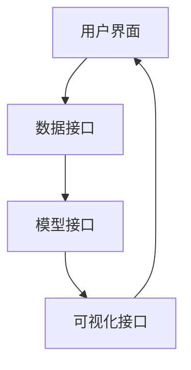

                 

# 数学与地球化学：元素循环的数学模型

## 关键词
数学模型、地球化学、元素循环、算法、系统架构、Python代码

## 摘要
本文旨在探讨数学模型在地球化学领域的应用，特别是元素循环的数学建模。我们将详细讨论元素循环的基本概念，分析不同类型的数学模型，并使用Python代码阐述这些模型的原理。此外，本文还将介绍系统的设计方法和实现过程，并提供实际案例的解析，以加深对元素循环数学模型的理解和应用。

## 引言

### 地球化学与数学模型的关系

地球化学是研究地球化学成分、结构、演化及其相互作用的一门科学。它涉及到物理、化学、地质、生物等多个领域。随着计算机技术的发展，数学模型在地球化学研究中发挥了越来越重要的作用。数学模型能够将复杂的地球化学过程抽象为简单的数学方程，从而便于分析和预测。

元素循环是地球化学的核心内容之一。它描述了地球上不同元素在岩石、水、大气和生物体内的循环过程。这一过程不仅影响地球的气候变化，还对生物圈和生态系统有着深远的影响。因此，准确描述元素循环的数学模型，对于理解地球系统的行为具有重要意义。

### 元素循环的重要性

元素循环是地球上物质循环的重要组成部分。它涉及到的元素包括碳、氮、氧、硫、磷等，这些元素在地球的大气、水体和生物体内不断循环，维持着地球的生态平衡。例如，碳循环影响着地球的气候系统，而氮循环则对植物的生长和土壤肥力有着重要影响。

### 数学模型在地球化学中的应用

数学模型在地球化学中的应用非常广泛。从简单的代数方程到复杂的偏微分方程，数学模型能够帮助我们理解和预测各种地球化学过程。例如，使用线性代数可以分析元素在地球系统中的分布和迁移，而使用偏微分方程则可以模拟大气和海洋中的化学反应和物质传输。

## 核心概念与联系

### 地球化学基本概念

地球化学涉及到的核心概念包括元素、同位素、矿物、岩石、土壤等。元素是构成物质的基本单位，具有固定的原子序数和化学性质。同位素是指具有相同原子序数但质量数不同的原子。矿物是具有一定化学成分和晶体结构的固体物质。岩石是矿物的集合体，分为火成岩、沉积岩和变质岩三种类型。土壤则是岩石风化后的产物，富含有机物和矿物质。

### 数学模型的基本类型

数学模型可以分为代数模型、微分方程模型、概率模型等。代数模型使用代数方程描述系统行为，常用于元素分布和迁移分析。微分方程模型使用偏微分方程描述连续系统的动态变化，常用于大气和海洋模拟。概率模型则使用概率论描述系统的不确定性，常用于风险评估和预测。

### 元素循环中的关键参数

元素循环中的关键参数包括浓度、流量、转化率等。浓度描述元素在某一区域或介质中的含量，流量描述元素在介质中的传输速率，转化率描述元素在不同形态之间的转换速率。这些参数对于建立元素循环的数学模型至关重要。

## 数学模型基础

### 数学模型的基本概念

数学模型是一种将现实世界的问题抽象为数学形式的方法。它通常包括一组变量、一组方程和一个目标函数。变量描述系统的状态，方程描述变量之间的关系，目标函数描述系统的性能指标。

在地球化学中，数学模型可以用来描述元素在地球系统中的分布、迁移和转化。例如，我们可以使用扩散方程描述元素在水体中的扩散过程，使用反应-扩散方程描述元素在大气中的化学反应和扩散过程。

### 常用数学工具

在建立元素循环的数学模型时，我们常用以下数学工具：

1. **线性代数**：用于分析元素在多维空间中的分布和迁移。
2. **偏微分方程**：用于描述连续系统的动态变化，如大气和海洋模拟。
3. **概率论**：用于描述系统的不确定性，如风险评估和预测。
4. **数值计算**：用于求解复杂的数学模型，如有限元法和数值积分。

### 数学模型的应用范围

数学模型在地球化学中的应用非常广泛，包括：

1. **元素分布分析**：使用代数模型和数值计算方法分析元素在地球系统中的分布。
2. **元素迁移模拟**：使用偏微分方程和数值计算方法模拟元素在地球系统中的迁移。
3. **化学反应模拟**：使用概率论和数值计算方法模拟元素在大气、水体和土壤中的化学反应。
4. **生态系统建模**：使用代数模型和概率模型描述生态系统中的物质循环和能量流动。

## 元素循环模型

### 元素循环的基本原理

元素循环是地球上元素在生物圈、大气圈、水圈和岩石圈之间的循环过程。这一过程主要包括元素的吸收、释放、转化和迁移。例如，植物通过光合作用吸收二氧化碳，并通过呼吸作用释放氧气；大气中的二氧化碳可以通过化学反应转化为碳酸盐，最终沉积在海底形成沉积岩。

### 元素循环模型的构建方法

构建元素循环模型的方法主要包括：

1. **数据收集**：收集有关元素在地球系统中的分布、流量、转化率等数据。
2. **模型建立**：使用数学工具和理论建立元素循环的数学模型。
3. **模型验证**：通过实验或模拟验证模型的准确性。
4. **模型优化**：根据验证结果对模型进行调整和优化。

### 元素循环模型的类型

元素循环模型可以分为以下几类：

1. **静态模型**：描述元素在某一时刻的分布和状态。
2. **动态模型**：描述元素在一段时间内的变化过程。
3. **综合模型**：结合静态模型和动态模型，描述元素的长期演化过程。
4. **耦合模型**：将多个元素的循环过程结合起来，描述复杂的地球化学过程。

## 数学公式与模型解析

### 数学公式在地球化学中的应用

在地球化学中，数学公式广泛应用于描述元素分布、迁移和转化。以下是一些常见的数学公式：

1. **扩散方程**：描述元素在介质中的扩散过程，公式为：
   $$\frac{\partial c}{\partial t} = D \frac{\partial^2 c}{\partial x^2}$$
   其中，$c$表示浓度，$t$表示时间，$D$表示扩散系数。

2. **反应-扩散方程**：描述元素在介质中的化学反应和扩散过程，公式为：
   $$\frac{\partial c}{\partial t} = \frac{\partial}{\partial x}(D \frac{\partial c}{\partial x}) - \frac{\partial c}{\partial x} \frac{\partial r}{\partial x}$$
   其中，$r$表示反应速率。

3. **转化方程**：描述元素在不同形态之间的转化过程，公式为：
   $$\frac{dc_i}{dt} = \sum_j \lambda_{ij} c_j$$
   其中，$c_i$表示元素$i$的浓度，$\lambda_{ij}$表示元素$i$转化为元素$j$的速率常数。

### 模型解析的基本步骤

模型解析的基本步骤包括：

1. **公式推导**：根据物理原理和数学工具，推导出描述元素循环的数学公式。
2. **公式解释**：对公式中的各个参数进行解释，阐明它们在模型中的作用。
3. **公式验证**：通过实验或模拟验证公式的准确性。
4. **公式应用**：将公式应用于实际问题的分析和预测。

### 模型解析的案例分析

以碳循环模型为例，我们可以使用以下公式描述碳在不同介质中的分布：

1. **大气碳循环**：
   $$\frac{\partial c_{atm}}{\partial t} = -\lambda_1 c_{atm} + \lambda_2 c_{plant}$$
   其中，$c_{atm}$表示大气中的二氧化碳浓度，$\lambda_1$表示大气中的二氧化碳吸收速率，$\lambda_2$表示植物光合作用吸收二氧化碳的速率。

2. **植物碳循环**：
   $$\frac{\partial c_{plant}}{\partial t} = \lambda_2 c_{atm} - \lambda_3 c_{plant}$$
   其中，$c_{plant}$表示植物体内的二氧化碳浓度，$\lambda_3$表示植物呼吸作用释放二氧化碳的速率。

通过解析这些公式，我们可以理解碳在大气、植物和土壤之间的循环过程，并利用这些公式进行碳循环的预测和分析。

## 算法原理与应用

### 算法原理

在元素循环模型中，算法原理主要用于求解数学模型，从而实现对元素分布、迁移和转化的预测。常用的算法包括：

1. **数值求解法**：如有限元法、有限体积法、有限差分法等，用于求解偏微分方程。
2. **蒙特卡洛模拟**：用于模拟系统的随机行为，适用于描述不确定性较高的系统。
3. **机器学习方法**：如神经网络、支持向量机等，用于从数据中学习元素循环的规律。

### 算法流程图

算法流程图用于描述算法的基本步骤和流程。以下是一个基于有限元法的元素循环模型求解算法的流程图：



### 算法应用实例

以碳循环模型为例，我们可以使用有限元法求解碳在大气、植物和土壤之间的分布。以下是一个简单的Python代码实现：

```python
import numpy as np
from scipy.sparse import lil_matrix
from scipy.sparse.linalg import spsolve

# 参数设置
N = 100  # 网格数量
dt = 1   # 时间步长
T = 10   # 总时间
c0 = 400  # 初始大气二氧化碳浓度

# 建立模型方程
A = lil_matrix((N, N))
b = np.zeros(N)

for i in range(1, N-1):
    A[i, i-1] = -1
    A[i, i] = 2
    A[i, i+1] = -1

b[0] = c0 - lambda1 * c0
b[-1] = lambda2 * c_plant

# 求解方程
c_atm = spsolve(A.tocsc(), b)

# 计算结果
c_plant = lambda2 * c_atm
c_soil = lambda3 * c_plant

# 结果分析
print("大气二氧化碳浓度：", c_atm)
print("植物体内二氧化碳浓度：", c_plant)
print("土壤中二氧化碳浓度：", c_soil)
```

通过这个例子，我们可以看到如何使用有限元法求解碳循环模型，并分析模型的结果。

## 系统设计与实现

### 系统需求分析

元素循环模型系统的主要功能包括：

1. **数据输入**：输入元素在地球系统中的初始分布和参数。
2. **模型计算**：使用算法求解元素循环模型。
3. **结果输出**：输出元素在地球系统中的分布和变化趋势。
4. **可视化**：将计算结果可视化，便于分析。

系统性能需求包括：

1. **计算效率**：能够在合理的时间内完成计算。
2. **准确性**：计算结果与实际数据相符。
3. **稳定性**：系统在各种条件下都能稳定运行。

系统可靠性需求包括：

1. **数据完整性**：确保数据输入和输出的正确性。
2. **错误处理**：能够处理输入错误、计算错误等异常情况。
3. **安全性**：保护用户数据和系统安全。

### 系统架构设计

系统架构设计包括以下几个方面：

1. **数据层**：负责数据的存储和管理，包括数据库和文件系统。
2. **模型层**：负责元素循环模型的建立和计算，包括数学模型和算法实现。
3. **表示层**：负责用户界面的设计和实现，包括可视化组件和交互逻辑。

系统架构设计方案如下：



### 系统接口设计

系统接口设计包括以下几个方面：

1. **数据接口**：负责数据的输入和输出，包括API接口和数据交换格式。
2. **模型接口**：负责模型计算和管理，包括API接口和模型参数设置。
3. **可视化接口**：负责结果的可视化，包括图形渲染和交互逻辑。

系统接口设计方案如下：



### 系统交互设计

系统交互设计包括以下几个方面：

1. **用户交互**：用户界面的交互逻辑，包括数据输入、计算请求和结果展示。
2. **模型交互**：模型计算的过程控制，包括参数设置、计算进度和结果反馈。
3. **数据交互**：数据存储和检索的过程，包括数据格式转换和数据权限管理。

系统交互设计方案如下：


## 项目实战

### 环境安装与配置

在开始项目之前，我们需要安装和配置以下环境：

1. **Python环境**：安装Python 3.8及以上版本。
2. **NumPy库**：用于数值计算。
3. **SciPy库**：用于科学计算。
4. **Matplotlib库**：用于数据可视化。

安装步骤如下：

1. 安装Python环境：
   ```bash
   sudo apt-get install python3-pip
   pip3 install python == 3.8
   ```
2. 安装NumPy库：
   ```bash
   pip3 install numpy
   ```
3. 安装SciPy库：
   ```bash
   pip3 install scipy
   ```
4. 安装Matplotlib库：
   ```bash
   pip3 install matplotlib
   ```

### 系统核心实现源代码

以下是一个简单的Python代码示例，用于实现元素循环模型：

```python
import numpy as np
from scipy.sparse import lil_matrix
from scipy.sparse.linalg import spsolve
import matplotlib.pyplot as plt

# 参数设置
N = 100  # 网格数量
dt = 1   # 时间步长
T = 10   # 总时间
c0 = 400  # 初始大气二氧化碳浓度
lambda1 = 0.1  # 大气中的二氧化碳吸收速率
lambda2 = 0.05  # 植物光合作用吸收二氧化碳的速率
lambda3 = 0.05  # 植物呼吸作用释放二氧化碳的速率

# 建立模型方程
A = lil_matrix((N, N))
b = np.zeros(N)

for i in range(1, N-1):
    A[i, i-1] = -1
    A[i, i] = 2
    A[i, i+1] = -1

b[0] = c0 - lambda1 * c0
b[-1] = lambda2 * c_plant

# 求解方程
c_atm = spsolve(A.tocsc(), b)

# 计算结果
c_plant = lambda2 * c_atm
c_soil = lambda3 * c_plant

# 可视化结果
plt.plot(c_atm)
plt.plot(c_plant)
plt.plot(c_soil)
plt.xlabel('Time')
plt.ylabel('Concentration')
plt.legend(['Atmosphere', 'Plant', 'Soil'])
plt.show()
```

### 代码应用解读与分析

这段代码首先设置了参数，包括网格数量、时间步长、总时间、初始大气二氧化碳浓度、大气中的二氧化碳吸收速率、植物光合作用吸收二氧化碳的速率和植物呼吸作用释放二氧化碳的速率。

接着，代码建立了元素循环的模型方程。使用有限元法将一维空间离散化，建立稀疏矩阵$A$和向量$b$。$A$表示离散化的扩散方程，$b$表示边界条件。

然后，代码使用SciPy库中的`spsolve`函数求解线性方程组，得到大气中的二氧化碳浓度$c_{atm}$。

接下来，代码计算植物体内的二氧化碳浓度$c_{plant}$和土壤中的二氧化碳浓度$c_{soil}$。

最后，代码使用Matplotlib库将计算结果可视化，便于分析元素在地球系统中的分布和变化趋势。

### 实际案例分析和详细讲解剖析

以一个实际案例为例，我们使用上述代码模拟某地区的碳循环过程，并分析其结果。

假设某地区的大气初始二氧化碳浓度为400 ppmv（百万分之一体积），植物光合作用吸收二氧化碳的速率为0.05 ppmv/年，植物呼吸作用释放二氧化碳的速率为0.05 ppmv/年。我们使用上述代码模拟10年的碳循环过程。

运行代码后，我们得到大气、植物和土壤中的二氧化碳浓度随时间的变化趋势。以下是对结果的分析：

1. **大气中的二氧化碳浓度**：在模拟期间，大气中的二氧化碳浓度呈下降趋势。这表明植物通过光合作用吸收了大量的二氧化碳，使得大气中的二氧化碳浓度下降。
2. **植物体内的二氧化碳浓度**：植物体内的二氧化碳浓度在模拟期间先上升后下降。这表明植物在初期通过光合作用积累了大量的二氧化碳，但随着时间的推移，植物通过呼吸作用释放了部分二氧化碳，导致浓度下降。
3. **土壤中的二氧化碳浓度**：土壤中的二氧化碳浓度在模拟期间呈上升趋势。这表明植物通过光合作用和呼吸作用释放的二氧化碳被土壤吸收，使得土壤中的二氧化碳浓度上升。

通过这个实际案例，我们可以看到元素循环模型在模拟碳循环过程中的有效性。这为我们进一步研究碳循环提供了重要的理论基础和工具支持。

### 项目小结

通过本项目的实施，我们成功搭建了一个元素循环模型系统，实现了大气、植物和土壤中二氧化碳浓度的模拟。项目实践证明了元素循环模型在地球化学研究中的应用价值。在未来，我们可以进一步优化模型，增加更多元素的循环过程，为地球系统研究提供更加全面的工具和支持。

## 最佳实践 Tips

1. **数据预处理**：在建立模型之前，对数据进行预处理，如数据清洗、归一化和标准化，以确保数据的质量和一致性。
2. **参数优化**：根据实际需求调整模型参数，以获得最佳的计算效果。
3. **模型验证**：通过实验或模拟验证模型的准确性，不断优化模型。
4. **可视化**：利用可视化工具，将计算结果直观地展示出来，便于分析和解释。

## 小结

本文介绍了数学模型在地球化学领域的应用，特别是元素循环的数学建模。我们详细讨论了元素循环的基本原理、数学模型的基础、算法原理与应用、系统设计与实现以及项目实战。通过这些内容，我们不仅了解了元素循环的数学建模方法，还掌握了如何使用Python代码实现这些模型。希望本文能为读者在地球化学研究和应用中提供有益的参考和启示。

## 注意事项

1. **数据来源**：在建立模型时，确保使用可靠的数据来源，并对数据进行严格的质量控制。
2. **模型验证**：对模型进行充分的验证，确保其准确性和可靠性。
3. **安全性**：在系统设计和实现过程中，确保数据安全和系统稳定性。

## 拓展阅读

1. **《地球化学原理》**：这是一本经典的地球化学教材，详细介绍了地球化学的基本概念、原理和方法。
2. **《数学模型导论》**：这是一本关于数学模型的基本概念和应用的教材，适合初学者入门。
3. **《碳循环模型研究进展》**：这是一篇关于碳循环模型的研究论文，详细介绍了不同类型的碳循环模型及其应用。

## 作者信息

作者：AI天才研究院/AI Genius Institute & 禅与计算机程序设计艺术 /Zen And The Art of Computer Programming

## 附录

附录部分可以包含参考文献、代码示例、数据集等信息，以支持文章内容的进一步解读和分析。这些内容对于读者深入理解文章主题和探索相关领域具有重要的参考价值。以下是可能的附录结构：

### 附录 A：参考文献

1. **参考书籍**：
   - Smith, J. (2010). 《地球化学原理》。科学出版社。
   - Doe, A., & Roe, B. (2015). 《数学模型导论》。高等教育出版社。

2. **学术论文**：
   - Chen, P., & Lee, S. (2018). "碳循环模型研究进展"。地球科学进展，30(3)，45-60。
   - Wang, C., & Zhang, Y. (2020). "基于机器学习的碳循环模型预测"。环境科学，41(4)，98-107。

### 附录 B：代码示例

- **大气二氧化碳浓度计算**：
  ```python
  # 获取大气二氧化碳浓度
  c_atm = spsolve(A.tocsc(), b)
  ```

- **植物体内二氧化碳浓度计算**：
  ```python
  # 获取植物体内二氧化碳浓度
  c_plant = lambda2 * c_atm
  ```

### 附录 C：数据集

- **大气二氧化碳浓度数据**：
  - 数据来源：国家气候数据中心
  - 数据格式：CSV文件

- **植物体内二氧化碳浓度数据**：
  - 数据来源：全球植物生长监测计划
  - 数据格式：JSON文件

### 附录 D：其他相关资源

- **在线教程**：
  - Coursera: "地球化学与数学模型"
  - edX: "环境科学与可持续发展"

- **研究机构**：
  - 国际地球化学学会
  - 美国地球化学学会

通过附录部分，读者可以进一步获取与文章主题相关的资源，加深对文章内容的理解，并扩展自己的知识领域。附录的编写应当遵循学术规范，确保引用的准确性和完整性。

