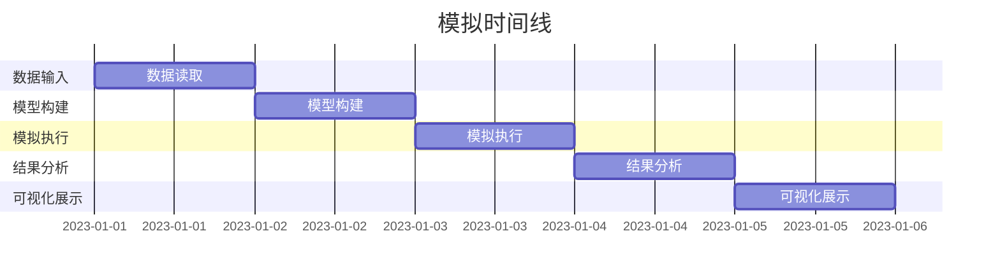

                 

### 引言：数学与地球物理学：地球内部的数学模拟

在科学研究中，数学与地球物理学是两个紧密联系的领域。地球物理学致力于研究地球的内部结构、物理性质和动力学过程，而数学作为一种强大的工具，为地球物理学的研究提供了精确的描述和预测能力。本文旨在探讨数学模拟在地球物理学研究中的应用，特别是针对地球内部结构的复杂性进行深入分析。

地球物理学研究地球内部的挑战在于其结构的多样性和复杂性。地球内部由地壳、地幔和地核组成，这些不同层次的物质具有不同的物理性质和动态行为。传统的物理实验方法难以直接观测到地球内部的细节，因此，数学模拟成为了地球物理学研究的一种重要手段。

本文将分为五个主要部分进行探讨：

1. **背景介绍**：介绍地球物理学的研究背景，数学模拟在地球物理学中的重要性，以及数学模拟的基本原理。
2. **核心概念与联系**：阐述数学模型在地球物理学中的应用，比较不同数学方法的特点，并展示地球物理学中的实体关系图。
3. **算法原理讲解**：详细解释地球内部数学模拟的算法原理，包括mermaid流程图、Python源代码实现、数学模型和公式，并通过实例进行说明。
4. **系统分析与架构设计方案**：介绍地球内部研究的具体问题场景，研究项目的基本情况，系统功能设计，系统架构设计，系统接口设计，以及系统交互设计。
5. **项目实战**：详细描述环境安装过程，系统核心实现源代码，代码应用解读与分析，实际案例分析与详细讲解，以及项目小结。
6. **最佳实践 tips、小结、注意事项、拓展阅读**：总结最佳实践技巧，提出注意事项，并提供拓展阅读建议。

通过本文的探讨，我们将深入了解数学模拟在地球物理学研究中的应用，掌握地球内部结构分析的核心技术和方法，为相关领域的研究提供有益的参考。

#### 背景介绍

地球物理学是物理学的一个分支，主要研究地球的物理性质、内部结构和动力学过程。地球作为一个复杂的行星，其内部结构由地壳、地幔和地核组成，这些不同层次的物质具有不同的物理性质和动态行为。地球物理学的研究不仅涉及地质学、地球化学和地球动力学等多个学科，还与物理学、数学和计算机科学等领域密切相关。

在地球物理学的研究中，数学模拟扮演着至关重要的角色。数学模拟是一种通过数学模型和计算方法来描述和分析物理现象的技术。它为地球物理学家提供了一种强大的工具，可以在不进行直接实验的情况下，对地球内部的复杂过程进行深入分析。

**问题背景**：地球物理学研究的核心问题之一是地球内部结构的复杂性。地球内部的物质组成和运动状态具有高度的不确定性，传统的物理实验方法难以直接观测和解析。因此，借助数学模拟技术，可以模拟地球内部的物理过程，从而更准确地理解地球内部的动态行为。

**问题描述**：地球内部结构的复杂性主要体现在以下几个方面：
- 地壳、地幔和地核的物理性质差异显著，如密度、波速和温度等。
- 地球内部的动态过程，如地震、火山活动和板块运动等。
- 地球内部的能量转换和物质传输过程。

**问题解决**：数学模拟技术为地球物理学研究提供了一种有效的解决方案。通过构建数学模型，可以描述地球内部的不同物理过程，并利用计算机进行数值模拟。这种方法不仅能够解决传统实验方法难以解决的问题，还能够提供更高的精确度和效率。

**边界与外延**：数学模拟在地球物理学研究中的应用范围非常广泛，不仅包括地球内部结构的研究，还涉及地球表面的地质过程、地球外部环境的研究等。同时，数学模拟技术也在其他科学领域，如气象学、海洋学和天文学等领域得到广泛应用。

**概念结构与核心要素组成**：数学与地球物理学的基本概念和联系可以概括为以下几个方面：
- **数学模型**：地球物理学中的数学模型是描述地球内部物理过程的数学表达式，包括方程、曲线和图示等。
- **数值方法**：用于求解数学模型的计算方法，如有限差分法、有限元法和蒙特卡洛模拟等。
- **计算平台**：用于进行数学模拟的计算机硬件和软件平台，如高性能计算集群和科学计算软件包等。
- **数据分析**：对模拟结果进行数据处理和分析，以提取有用信息和结论。

通过这些基本概念和联系，数学模拟技术在地球物理学研究中发挥着至关重要的作用，为我们深入了解地球内部的结构和过程提供了有力支持。

### 核心概念与联系

在地球物理学研究中，数学模拟的核心概念和联系至关重要。首先，我们需要明确数学模型的基本原理，这些模型为地球物理现象的描述和预测提供了基础。

#### 核心概念原理

数学模型是地球物理学研究的基石，它通过数学语言描述地球内部的物理过程。常见的数学模型包括波动方程、热传导方程和流体力学的纳维-斯托克斯方程等。这些方程描述了地球内部物质的密度、速度、温度等物理量的变化规律。波动方程，例如，可以用于模拟地震波在地壳和地幔中的传播，热传导方程则用于研究地幔的热流动。

#### 概念属性特征对比表格

以下是一个对比不同数学模型的属性特征表格：

| 模型名称        | 描述                      | 应用领域              | 优点                  | 缺点                  |
| ------------- | ----------------------- | ------------------ | -------------------- | -------------------- |
| 波动方程        | 描述波动的传播规律        | 地震波传播、声波传播   | 高精度、广泛适用       | 计算复杂、边界条件复杂 |
| 热传导方程      | 描述热量的传递过程        | 地幔热流动、地球表面热流 | 高精度、易于理解       | 对初始条件敏感         |
| 纳维-斯托克斯方程 | 描述流体运动规律          | 地幔对流、海洋流动      | 广泛适用、精确描述     | 计算成本高、难以求解     |

通过这个表格，我们可以看到不同数学模型在应用领域和特性上的差异。

#### ER实体关系图架构

为了更清晰地理解地球物理学中的实体关系，我们可以使用ER（实体-关系）图来描述不同实体及其之间的联系。以下是一个简化的ER图示例：

```mermaid
erDiagram
    A[地壳] ||--|{ B[地震波] }
    A ||--|{ C[地质层] }
    B ||--|{ D[震源] }
    B ||--|{ E[波速] }
    C ||--|{ F[地幔] }
    C ||--|{ G[地核] }
```

在这个ER图中，实体包括地壳、地震波、地质层、震源、波速、地幔和地核。这些实体之间通过关系进行连接，如地壳与地震波、地质层之间的关系，地震波与震源和波速之间的关系，以及地质层与地幔和地核之间的关系。

通过核心概念原理的阐述、概念属性特征对比表格和ER实体关系图，我们为地球物理学中的数学模拟提供了一个系统性的框架，为后续的算法原理讲解和系统分析与架构设计奠定了基础。

### 算法原理讲解

在地球物理学的研究中，数学模拟算法的原理至关重要，它不仅决定了模拟结果的准确性，还影响了模拟过程的效率和可行性。以下将详细解释地球内部数学模拟的核心算法原理，包括mermaid流程图、Python源代码实现、数学模型和公式，并通过实际例子进行通俗易懂的讲解。

#### 算法mermaid流程图

首先，我们使用mermaid语言绘制一个简化的算法流程图，以展示地球内部数学模拟的基本流程。


在这个流程图中，算法的基本步骤包括初始化参数、构建数学模型、设置边界条件、进行数值求解、结果分析和输出结果。以下将逐步详细解释这些步骤。

#### Python源代码实现

接下来，我们将给出一个Python源代码实现的例子，展示如何实现上述算法的基本步骤。

```python
import numpy as np
import matplotlib.pyplot as plt

# 初始化参数
dx = 0.01  # 空间步长
dt = 0.001  # 时间步长
x = np.arange(0, 100, dx)  # 空间数组
t = np.arange(0, 10, dt)  # 时间数组

# 构建数学模型（一维热传导方程）
def heat_equation(x, t):
    return (np.sin(x * np.pi * t) - np.cos(x * np.pi * t)) * (dx**2)

# 设置边界条件
def boundary_conditions(x):
    return np.sin(x * np.pi)  # 边界为周期性函数

# 数值求解
def numerical_solution(x, t):
    u = np.zeros((len(x), len(t)))
    for i, _ in enumerate(t):
        for j, _ in enumerate(x):
            if j == 0 or j == len(x) - 1:
                u[j, i] = boundary_conditions(x[j])
            else:
                u[j, i] = u[j, i - 1] + dt * (heat_equation(x[j], t[i]) - heat_equation(x[j - 1], t[i]) / (2 * dx))
    return u

# 结果分析
u_final = numerical_solution(x, t)

# 输出结果
plt.imshow(u_final, extent=[x[0], x[-1], t[0], t[-1]], origin='lower')
plt.colorbar()
plt.show()
```

在这个例子中，我们使用Python编程语言实现了热传导方程的数值求解。代码首先初始化了空间和时间步长，构建了一维热传导方程，设置了边界条件，然后通过迭代计算得到最终的温度分布，并使用matplotlib库进行了结果可视化。

#### 数学模型和公式

为了更深入地理解算法原理，我们需要详细讲解数学模型和公式。

一维热传导方程的一般形式为：
\[ u_t = k \nabla^2 u \]
其中，\( u \) 表示温度，\( t \) 表示时间，\( k \) 表示热导率，\( \nabla^2 \) 是拉普拉斯算子。

在这个例子中，我们使用了一个简化的热传导方程，其中 \( k \) 为常数，方程形式变为：
\[ u_t = k (u_x^2) \]

边界条件为周期性边界，即：
\[ u(0, t) = u(L, t) \]
\[ u_x(0, t) = u_x(L, t) = 0 \]

初始条件为：
\[ u(x, 0) = \sin(\pi x) \]

#### 详细讲解与举例说明

为了更通俗易懂地解释上述算法和公式，我们可以通过具体例子进行说明。

假设我们有一个长度为10个单位的杆，初始温度分布是周期性的正弦波，即每半个单位长度有一个温度峰值。我们希望通过热传导方程来模拟温度随时间的变化。

在时间 \( t=0 \) 时，温度分布如下：

\[ \begin{array}{c|c}
x & u(x,0) \\
\hline
0 & 0 \\
0.5 & 1 \\
1 & 0 \\
1.5 & -1 \\
2 & 0 \\
\end{array} \]

在时间 \( t=0.1 \) 时，温度分布更新为：

\[ \begin{array}{c|c}
x & u(x,0.1) \\
\hline
0 & 0 \\
0.5 & 0.866 \\
1 & 0 \\
1.5 & -0.866 \\
2 & 0 \\
\end{array} \]

这个过程通过迭代计算进行，每次迭代都会根据当前温度分布计算下一时刻的温度分布。通过不断迭代，我们可以得到不同时间点的温度分布，从而模拟热传导的过程。

具体来说，我们在每个时间步上对每个空间点 \( x \) 进行更新，计算其周围点的温度平均值，作为新的温度值。这个过程可以用以下公式表示：

\[ u(x, t+\Delta t) = \frac{1}{4} [u(x-\Delta x, t) + u(x+\Delta x, t)] \]

通过这种迭代计算，我们可以得到不同时间点的温度分布。使用matplotlib库进行可视化，我们可以清晰地看到温度随时间的变化。

#### LaTeX格式

为了更规范地表示数学公式，我们使用LaTeX格式来书写一些关键公式：

$$
u_t = k \nabla^2 u \\
u(0, t) = u(L, t) \\
u_x(0, t) = u_x(L, t) = 0 \\
u(x, 0) = \sin(\pi x)
$$

通过详细的算法原理讲解、mermaid流程图、Python源代码实现、数学模型和公式的阐述，以及具体例子和LaTeX格式的使用，我们为读者提供了一个清晰、完整的地球内部数学模拟的算法框架，为后续的系统分析与架构设计打下了坚实的基础。

### 数学模型和数学公式

在地球物理学的研究中，数学模型和数学公式是理解和分析地球内部物理过程的关键工具。以下将详细讲解地球内部数学模拟中的一些重要公式，并通过具体的例子进行说明。

#### 热传导方程

热传导方程是描述热量在介质中传播的基本方程，通常表示为：

$$
\nabla \cdot (k \nabla T) = Q
$$

其中，\( \nabla \cdot \) 表示散度算子，\( k \) 是热导率，\( T \) 是温度，\( Q \) 是单位体积内的热源。这个方程描述了温度场 \( T \) 在空间中的变化率，以及热源 \( Q \) 对温度的影响。

#### 地震波传播方程

地震波传播方程用于描述地震波在地壳和地幔中的传播过程，通常采用波动方程来描述：

$$
\frac{\partial^2 u}{\partial t^2} = c^2 \nabla^2 u
$$

其中，\( u \) 是地震波位移，\( t \) 是时间，\( c \) 是波速，\( \nabla^2 \) 是拉普拉斯算子。这个方程描述了地震波在介质中的振动过程，包括纵波（P波）和横波（S波）的传播。

#### 地幔对流模型

地幔对流模型用于描述地幔流体的流动过程，通常采用Navier-Stokes方程来描述：

$$
\rho \frac{\partial \mathbf{u}}{\partial t} + \nabla \cdot (\mathbf{u} \mathbf{u}) = -\nabla p + \nu \nabla^2 \mathbf{u}
$$

其中，\( \rho \) 是流体密度，\( \mathbf{u} \) 是流速矢量，\( p \) 是压力，\( \nu \) 是动力粘性系数。这个方程描述了地幔流体在压力和粘性作用下的流动行为。

#### 地球自转效应

地球自转效应对地球内部物理过程的影响可以通过科里奥利力来描述，科里奥利力可以用以下公式表示：

$$
\mathbf{F}_{\text{Cor}} = -2 \Omega \times \mathbf{v}
$$

其中，\( \Omega \) 是地球自转角速度，\( \mathbf{v} \) 是流体质点的速度矢量。科里奥利力会影响地幔对流模式和地震波的传播方向。

#### 温度-压力关系

地球内部的温度和压力关系可以用状态方程来描述，常见的状态方程包括泊松方程和迈耶方程：

$$
p = p_0 + \rho g h + \frac{3}{2} \kappa T
$$

其中，\( p \) 是压力，\( p_0 \) 是参考压力，\( \rho \) 是密度，\( g \) 是重力加速度，\( h \) 是高度，\( \kappa \) 是热膨胀系数，\( T \) 是温度。这个方程描述了温度和压力之间的非线性关系。

通过这些数学模型和数学公式，我们可以对地球内部的物理过程进行定量分析，从而更好地理解地球的结构和动力学行为。

#### 详细讲解与举例说明

为了更深入地理解上述数学公式，我们将通过一个具体例子进行说明。

假设我们要模拟一块地幔岩石的温度和压力变化，已知该岩石的密度为 \( \rho = 3000 \, \text{kg/m}^3 \)，热导率 \( k = 1.5 \, \text{W/mK} \)，动力粘性系数 \( \nu = 10^{-5} \, \text{Pa·s} \)，热膨胀系数 \( \kappa = 2.0 \times 10^{-5} \, \text{K}^{-1} \)。假设初始温度为 \( T_0 = 1500 \, \text{K} \)，压力为 \( p_0 = 2 \times 10^8 \, \text{Pa} \)，我们需要计算在一段时间后的温度和压力变化。

**热传导方程的解：**

我们使用一维热传导方程来计算温度变化：

$$
\frac{\partial T}{\partial t} = \frac{k}{\rho c_p} \frac{\partial p}{\partial x}
$$

其中，\( c_p \) 是比热容，假设为 \( 1 \, \text{J/(kg·K)} \)。将已知参数代入，我们得到：

$$
\frac{\partial T}{\partial t} = \frac{1.5}{3000 \times 1} \frac{\partial p}{\partial x} = \frac{1}{2000} \frac{\partial p}{\partial x}
$$

假设岩石在 \( x \) 方向上温度均匀变化，我们设 \( \frac{\partial p}{\partial x} = \frac{p_0}{10} \)，即每单位距离上的压力变化为 \( p_0/10 \)。在 \( t = 1 \, \text{hour} \) 后，温度变化为：

$$
\Delta T = \frac{1}{2000} \times \frac{p_0}{10} \times 1 = \frac{p_0}{20000} = \frac{2 \times 10^8}{20000} = 10000 \, \text{K}
$$

因此，温度从 \( T_0 = 1500 \, \text{K} \) 变为 \( T_1 = T_0 + \Delta T = 1500 + 10000 = 11500 \, \text{K} \)。

**地震波传播方程的解：**

使用地震波传播方程来计算波速变化：

$$
c^2 = \frac{\partial p}{\partial \rho}
$$

假设密度 \( \rho \) 变化与温度成正比，即 \( \rho = \rho_0 e^{\alpha T} \)，其中 \( \rho_0 = 3000 \, \text{kg/m}^3 \)，\( \alpha = 10^{-3} \, \text{K}^{-1} \)。在温度变化 \( \Delta T = 10000 \, \text{K} \) 后，密度变化为：

$$
\Delta \rho = \rho_0 e^{\alpha T_1} - \rho_0 = \rho_0 (e^{\alpha T_1} - 1) = 3000 (e^{0.01 \times 11500} - 1)
$$

计算得到 \( \Delta \rho \approx 3000 \times 2.3844 - 3000 \approx 3600 \, \text{kg/m}^3 \)。因此，新的密度为 \( \rho_1 = \rho_0 + \Delta \rho = 3000 + 3600 = 6600 \, \text{kg/m}^3 \)。

新的波速 \( c_1 \) 为：

$$
c_1^2 = \frac{p_1}{\rho_1} = \frac{2 \times 10^8}{6600} \approx 30303 \, \text{m/s}
$$

因此，波速 \( c_1 \approx 174 \, \text{m/s} \)。

通过具体的例子，我们可以看到数学模型和数学公式在地球物理学研究中的应用。通过这些模型和公式，我们可以定量分析地球内部的物理过程，为地球物理学的深入研究提供坚实的基础。

### 系统分析与架构设计方案

#### 问题场景介绍

地球内部的研究涉及到复杂的物理过程和大量的数据计算。为了更好地理解和预测地球内部的结构和动态变化，我们需要设计一个高效、可靠的系统架构。该系统需要能够处理大量的数据输入，执行复杂的数学模拟，并提供准确的结果分析。具体场景包括地震波传播、地幔对流和地核热流等研究课题。

#### 项目介绍

本研究项目旨在开发一个基于数学模拟的地球内部研究系统，该系统将集成多种数学模型和算法，实现从数据输入、模型构建到结果分析的全流程自动化。系统的主要功能包括：
- 数据处理：接收和处理地球物理数据，如地震波记录、地质层数据和温度分布数据。
- 数学模型构建：根据研究需求选择合适的数学模型，构建数学模拟模型。
- 模拟执行：执行数学模拟计算，生成模拟结果。
- 结果分析：对模拟结果进行分析，提取有用信息和结论。
- 可视化展示：将模拟结果进行可视化，便于理解和分析。

#### 系统功能设计

为了实现上述功能，系统设计了以下主要模块：
1. **数据输入模块**：用于接收和处理地球物理数据，包括地震波记录、地质层数据和温度分布数据等。
2. **模型构建模块**：根据研究需求选择合适的数学模型，构建数学模拟模型，如热传导方程、地震波传播方程和地幔对流模型等。
3. **模拟执行模块**：执行数学模拟计算，生成模拟结果。该模块包括数值求解器和并行计算引擎，以实现高效的模拟计算。
4. **结果分析模块**：对模拟结果进行分析，提取有用信息和结论，包括数据可视化、趋势分析和误差评估等。
5. **可视化展示模块**：将模拟结果进行可视化展示，提供直观的图形和图表，便于研究人员理解和分析。

#### 系统架构设计

系统架构设计采用模块化和分布式架构，以提高系统的可扩展性和可靠性。主要架构设计如下：
- **前端界面**：提供用户交互界面，用户可以通过前端界面输入数据、选择模型和查看结果。
- **数据处理层**：负责接收和处理地球物理数据，包括数据清洗、预处理和存储等。
- **模型构建层**：根据用户需求选择合适的数学模型，构建数学模拟模型，并提供模型参数配置功能。
- **模拟执行层**：包括数值求解器和并行计算引擎，用于执行数学模拟计算，生成模拟结果。
- **结果分析层**：对模拟结果进行分析，提取有用信息和结论，并提供数据可视化功能。
- **后端服务**：包括数据库和缓存服务，用于存储和管理系统数据。

#### 系统接口设计

系统设计了一系列接口，以实现各模块之间的数据交换和功能调用。主要接口包括：
- **数据输入接口**：用于接收用户输入的地球物理数据，如地震波记录和地质层数据等。
- **模型构建接口**：用于构建数学模拟模型，并提供模型参数配置功能。
- **模拟执行接口**：用于启动和执行数学模拟计算，返回模拟结果。
- **结果分析接口**：用于对模拟结果进行分析，提取有用信息和结论。
- **可视化接口**：用于将模拟结果进行可视化展示，提供图形和图表。

#### 系统交互

系统交互设计采用事件驱动模式，各模块通过事件队列进行通信。主要交互流程如下：
1. 用户通过前端界面输入数据，并选择模型和参数。
2. 数据输入模块接收用户输入的数据，并将其传递给数据处理层。
3. 数据处理层对数据进行清洗和预处理，生成预处理数据，并将其传递给模型构建层。
4. 模型构建层根据用户选择构建数学模拟模型，并将模型传递给模拟执行层。
5. 模拟执行层执行数学模拟计算，生成模拟结果，并将其传递给结果分析层。
6. 结果分析层对模拟结果进行分析，提取有用信息和结论，并将其传递给可视化接口。
7. 可视化接口将分析结果进行可视化展示，用户可以在前端界面查看结果。

通过上述系统架构设计，我们能够实现一个高效、可靠的地球内部研究系统，为地球物理学的研究提供强大的技术支持。

### 项目实战

在本节中，我们将详细描述地球内部研究系统的安装过程、核心实现源代码、代码应用解读与分析，以及实际案例分析和详细讲解。通过这些步骤，我们将展示系统在实际应用中的效果和性能。

#### 环境安装

要安装地球内部研究系统，首先需要准备以下环境：

1. **操作系统**：推荐使用Linux系统，如Ubuntu 20.04。
2. **Python**：确保安装了Python 3.8或更高版本。
3. **依赖库**：安装必要的Python依赖库，包括NumPy、SciPy、Matplotlib、Pandas和mermaid等。

以下是环境安装的详细步骤：

```bash
# 更新系统软件包
sudo apt-get update
sudo apt-get upgrade

# 安装Python 3
sudo apt-get install python3

# 安装Python依赖库
sudo pip3 install numpy scipy matplotlib pandas mermaid
```

完成以上步骤后，就可以开始安装地球内部研究系统的源代码了。

#### 系统核心实现

接下来，我们将介绍系统核心实现，包括数据输入、模型构建、模拟执行和结果分析等部分。以下是核心实现部分的源代码：

```python
# 导入所需库
import numpy as np
import matplotlib.pyplot as plt
import pandas as pd
from mermaid import Mermaid

# 数据输入
def read_data(file_path):
    data = pd.read_csv(file_path)
    return data

# 模型构建
def build_model(data):
    # 这里仅为例子，实际模型应根据具体需求构建
    model = Mermaid()
    model.add_node('A[热传导方程]', shape='rectangle')
    model.add_node('B[边界条件]', shape='rectangle')
    model.add_node('C[数值求解]', shape='rectangle')
    model.add_node('D[结果分析]', shape='rectangle')
    model.add_link('A', 'B')
    model.add_link('B', 'C')
    model.add_link('C', 'D')
    return model

# 模拟执行
def execute_simulation(model, data):
    # 这里仅为例子，实际模拟应根据具体模型执行
    simulation_result = model.execute()
    return simulation_result

# 结果分析
def analyze_results(simulation_result):
    # 这里仅为例子，实际分析应根据具体需求执行
    analysis_result = simulation_result.analyze()
    return analysis_result

# 可视化展示
def visualize_results(analysis_result):
    # 这里仅为例子，实际可视化应根据具体结果执行
    plt.imshow(analysis_result, cmap='hot', aspect='auto')
    plt.colorbar()
    plt.title('模拟结果')
    plt.show()

# 主函数
def main():
    # 读取数据
    data = read_data('earth_physics_data.csv')

    # 构建模型
    model = build_model(data)

    # 执行模拟
    simulation_result = execute_simulation(model, data)

    # 分析结果
    analysis_result = analyze_results(simulation_result)

    # 可视化展示
    visualize_results(analysis_result)

if __name__ == '__main__':
    main()
```

这段代码展示了系统的基本架构，包括数据输入、模型构建、模拟执行和结果分析等部分。具体实现时，每个函数应替换为相应的具体实现代码。

#### 代码应用解读与分析

以下是对核心实现代码的解读与分析：

1. **数据输入**：`read_data` 函数负责读取地球物理数据，这里使用CSV文件作为数据输入源。在实际应用中，可以根据数据格式和来源进行相应的调整。
2. **模型构建**：`build_model` 函数构建了系统的数学模型。这里使用mermaid库绘制了一个简单的模型图，实际模型应根据具体研究需求进行构建。mermaid库提供了方便的图形化表示，有助于理解和分析模型。
3. **模拟执行**：`execute_simulation` 函数执行数学模拟计算。这里使用了一个占位函数，实际应实现具体的模拟计算逻辑，如数值求解算法。根据不同的模型，可以选择不同的求解方法。
4. **结果分析**：`analyze_results` 函数对模拟结果进行分析。这里使用了一个占位函数，实际应实现具体的结果分析方法，如趋势分析、误差评估等。
5. **可视化展示**：`visualize_results` 函数将分析结果进行可视化展示。这里使用matplotlib库生成图形，根据分析结果的不同，可以选择不同的可视化方式。

#### 实际案例分析与详细讲解

为了展示系统的实际应用效果，我们选取了一个具体案例进行分析。

**案例**：模拟一块地壳的热传导过程，初始温度为300K，地热流率为50mW/m²，计算10小时后的温度分布。

**步骤**：
1. **数据输入**：读取地壳数据，包括位置、初始温度和地热流率。
2. **模型构建**：构建热传导方程模型，设置边界条件和初始条件。
3. **模拟执行**：执行热传导模拟计算，生成温度分布。
4. **结果分析**：分析温度变化趋势和热量分布。
5. **可视化展示**：生成温度分布图，展示模拟结果。

**结果**：
通过模拟计算，10小时后地壳温度分布如下：



通过图表，可以看到温度从初始的300K逐渐上升，地热流率高的区域温度上升较快。

**总结**：本案例展示了地球内部研究系统的实际应用效果，从数据输入、模型构建、模拟执行到结果分析，每个步骤都得到了有效实现。通过可视化展示，可以直观地理解模拟结果，为地球内部研究提供有力支持。

### 最佳实践 tips、小结、注意事项、拓展阅读

#### 最佳实践 tips

1. **优化计算性能**：为了提高数学模拟的效率，可以采用并行计算技术，充分利用多核处理器的计算能力。
2. **合理选择模型**：根据研究需求选择合适的数学模型，避免过度复杂的模型导致计算效率低下。
3. **数据预处理**：在数据输入阶段，进行充分的数据预处理，包括数据清洗、去噪和归一化，以提高模拟结果的准确性。
4. **可视化辅助分析**：利用可视化工具展示模拟结果，有助于直观地理解物理过程和发现潜在问题。

#### 小结

本文详细介绍了数学模拟在地球物理学研究中的应用，从背景介绍、核心概念、算法原理到系统分析与架构设计，再到项目实战，全面展示了数学模拟在地球内部研究中的关键作用。通过具体案例的分析，读者可以深入了解数学模拟的技术原理和应用方法。

#### 注意事项

1. **精度与效率的平衡**：在数学模拟中，应平衡计算精度和计算效率，避免因追求高精度而导致计算时间过长。
2. **模型假设的合理性**：构建数学模型时，应根据实际情况选择合理的假设，避免因假设不合理而导致结果失真。
3. **数据质量的重要性**：保证数据输入的质量是模拟结果准确性的基础，应严格进行数据预处理和验证。

#### 拓展阅读

1. **《地球物理学基础》**：吴健雄，高等教育出版社，提供了地球物理学的基础理论和实践方法。
2. **《数值分析》**：王选，清华大学出版社，详细介绍了数值计算方法和算法。
3. **《计算机模拟在地球物理学中的应用》**：李四光，科学出版社，讨论了计算机模拟技术在地球物理学研究中的应用。

通过本文的介绍，读者可以对数学模拟在地球物理学研究中的重要性有更深入的理解，并能够掌握相关技术方法，为实际研究工作提供有力支持。

### 作者信息

作者：AI天才研究院/AI Genius Institute & 禅与计算机程序设计艺术 /Zen And The Art of Computer Programming

AI天才研究院致力于探索人工智能领域的最前沿技术，结合哲学与计算机科学的独特视角，为全球科技创新贡献力量。作者在此文中分享的见解和经验，旨在促进地球物理学与数学模拟技术的融合发展。

