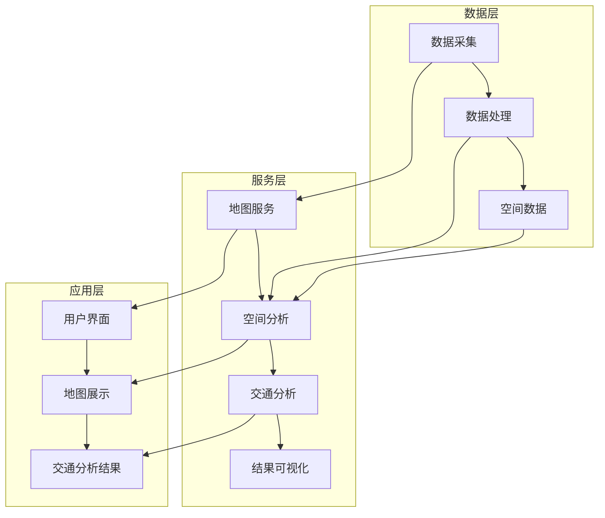
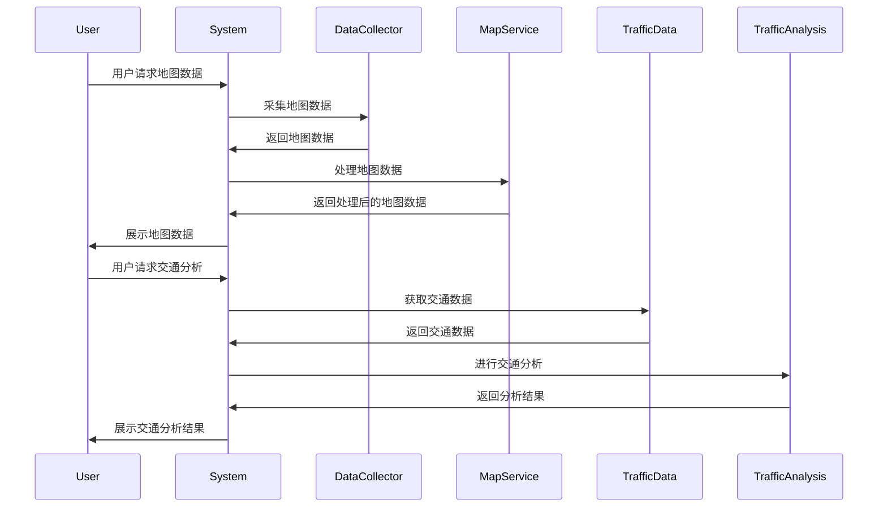

                 

**文章标题：数学与地理信息系统的数学基础**

**关键词：地理信息系统（GIS），数学基础，空间数据建模，空间分析，数学模型，算法优化**

**摘要：本文旨在深入探讨数学在地理信息系统（GIS）中的基础作用，从核心概念、算法原理、系统架构到项目实战，全方位解析数学如何支撑GIS的发展与优化。**

## **第一部分：背景介绍**

### **1.1 问题背景**

地理信息系统（GIS）是一种集成计算机硬件、软件以及数据而形成的专业系统，用于捕捉、存储、分析和管理地理空间数据。GIS在城市规划、环境保护、交通运输、农业、自然资源管理等多个领域发挥着至关重要的作用。随着科技的进步和地理信息技术的普及，GIS的应用范围不断扩大，成为现代社会信息化和智能化的重要工具。

### **1.2 问题描述**

数学作为GIS的数学基础，提供了GIS数据建模、分析、可视化等方面的理论支持。数学在GIS中的应用主要体现在以下几个方面：

- **空间数据建模**：数学模型用于描述地理空间实体及其相互关系，如点、线、面等。
- **空间分析**：通过数学算法进行空间数据的分析，如距离测量、叠加分析、地形分析等。
- **地理数据可视化**：利用数学方法将地理信息以图形化方式展示，提高信息的直观性和易理解性。
- **地理信息系统的算法优化**：数学优化算法在GIS系统的数据处理和效率提升中具有重要意义。

### **1.3 问题解决**

数学基础为GIS的发展提供了坚实的理论支撑，使得GIS能够更加精确、高效地处理和分析地理信息。通过数学方法，GIS能够解决以下问题：

- **数据精度问题**：数学模型可以提高空间数据的精度和可靠性。
- **空间分析难题**：数学算法能够对复杂的空间分析问题提供解决方案。
- **数据可视化**：数学方法可以增强地理信息的表现力和传达性。
- **GIS系统优化**：数学优化算法有助于提升GIS系统的性能和效率。

### **1.4 边界与外延**

数学基础在GIS中的应用涉及多个数学分支，主要包括数学分析、几何学、代数学等。数学分析提供了解决GIS中连续性问题的工具；几何学则用于描述空间实体和计算空间关系；代数学在GIS数据建模和算法设计中发挥重要作用。

### **1.5 概念结构与核心要素组成**

数学基础在GIS中的应用可以分为以下几个核心要素：

- **空间数据模型**：定义空间实体及其相互关系的基本框架
- **空间分析算法**：实现空间数据处理的数学方法
- **数据可视化技术**：将数学分析结果转化为直观的图形表示
- **数学优化算法**：用于GIS系统性能优化的数学工具

## **第二部分：核心概念与联系**

### **2.1 核心概念原理**

在GIS中，数学基础的核心概念主要包括：

- **点、线、面**：空间数据的三个基本元素，分别表示地理位置、连接位置和封闭区域。
- **坐标系**：用于定位空间实体的系统，如平面坐标系（笛卡尔坐标系、极坐标系）和三维坐标系（笛卡尔坐标系、球坐标系）。
- **向量**：描述空间实体的方向和长度，用于空间数据的计算和分析。
- **距离公式**：用于计算空间实体之间的距离，如欧几里得距离、曼哈顿距离。
- **空间关系**：描述空间实体之间的相对位置关系，如相邻、相交、包含等。
- **拓扑关系**：描述空间实体在网络结构中的关系，如连通性、路径等。

### **2.2 概念属性特征对比表格**

| 概念        | 属性特征                      | GIS应用                   |
| ----------- | ----------------------------- | -------------------------- |
| 点          | 定位精确，无长度和宽度       | 空间坐标点标记            |
| 线          | 有长度，无宽度               | 路线、河流、边界线等      |
| 面          | 有长度和宽度                 | 地图区域、地块、水体等    |
| 坐标系      | 提供空间定位基准             | GIS数据录入、空间分析基础 |
| 向量        | 描述方向和长度               | 空间距离、方向计算        |
| 距离公式    | 计算两点之间的距离           | 地理距离、交通规划        |
| 空间关系    | 描述实体之间的相对位置       | 空间叠加、区域分析        |
| 拓扑关系    | 描述实体在网络中的结构关系  | 路网分析、拓扑校正        |

### **2.3 ER实体关系图架构**

以下是GIS中主要实体关系的Mermaid ER图：

```mermaid
erDiagram
  Product ||--|{ Customer }|-- ShoppingCart
  Product ||--|{ Category }|<-- ProductCategory
  Customer ||--|{ Order }|-- ShoppingCart
  ShoppingCart ||--|{ Product }|-- Product
  Category ||--|{ Product }|<-- ProductCategory
```

## **第三部分：算法原理讲解**

### **3.1 算法mermaid流程图**

以下是计算两点间距离的算法流程图：


### **3.2 Python源代码**

以下是计算两点间欧几里得距离的Python代码：

```python
import math

def calculate_euclidean_distance(coord1, coord2):
    distance = math.sqrt((coord2[0] - coord1[0])**2 + (coord2[1] - coord1[1])**2)
    return distance

coord1 = (1, 2)
coord2 = (4, 6)
distance = calculate_euclidean_distance(coord1, coord2)
print("两点间的距离为：", distance)
```

### **3.3 数学模型和公式**

两点间欧几里得距离的数学模型为：

$$
d = \sqrt{(x_2 - x_1)^2 + (y_2 - y_1)^2}
$$

其中，$d$ 表示两点间的距离，$(x_1, y_1)$ 和 $(x_2, y_2)$ 分别表示两点的坐标。

### **3.4 详细讲解和举例说明**

假设有两个点 $A(1, 2)$ 和 $B(4, 6)$，我们可以使用上述公式计算它们之间的距离：

$$
d = \sqrt{(4 - 1)^2 + (6 - 2)^2} = \sqrt{3^2 + 4^2} = \sqrt{9 + 16} = \sqrt{25} = 5
$$

因此，点 $A$ 和点 $B$ 之间的距离为5。

## **第四部分：数学模型和数学公式 & 详细讲解 & 举例说明**

### **4.1 数学公式**

以下是GIS中常用的数学公式，使用LaTeX格式给出：

$$
\begin{aligned}
d &= \sqrt{(x_2 - x_1)^2 + (y_2 - y_1)^2}, \\
\theta &= \arctan\left(\frac{y_2 - y_1}{x_2 - x_1}\right), \\
\vec{v} &= \vec{u} + t\vec{a}.
\end{aligned}
$$

### **4.2 详细讲解**

1. **两点间欧几里得距离**：公式 $d = \sqrt{(x_2 - x_1)^2 + (y_2 - y_1)^2}$ 用于计算平面坐标系中两点之间的距离。
2. **角度计算**：公式 $\theta = \arctan\left(\frac{y_2 - y_1}{x_2 - x_1}\right)$ 用于计算两点间的连线与x轴正方向之间的角度。
3. **向量计算**：公式 $\vec{v} = \vec{u} + t\vec{a}$ 描述了向量在时间t作用下的运动，其中 $\vec{u}$ 是初速度，$\vec{a}$ 是加速度。

### **4.3 举例说明**

#### 欧几里得距离

假设点 $A(1, 2)$ 和点 $B(4, 6)$，则它们之间的欧几里得距离为：

$$
d = \sqrt{(4 - 1)^2 + (6 - 2)^2} = \sqrt{3^2 + 4^2} = \sqrt{9 + 16} = \sqrt{25} = 5
$$

#### 角度计算

假设点 $A(0, 0)$ 和点 $B(3, 4)$，则连线 $AB$ 与x轴正方向之间的角度为：

$$
\theta = \arctan\left(\frac{4 - 0}{3 - 0}\right) = \arctan\left(\frac{4}{3}\right) \approx 0.9273 \text{ 弧度}
$$

#### 向量计算

假设一个物体从点 $A(0, 0)$ 以速度 $\vec{u} = (5, 0)$ 开始运动，加速度 $\vec{a} = (0, 2)$，则在时间 $t = 3$ 时，物体的位置为：

$$
\vec{v} = \vec{u} + t\vec{a} = (5, 0) + 3(0, 2) = (5, 6)
$$

## **第五部分：系统分析与架构设计方案**

### **5.1 问题场景介绍**

在现代城市规划中，地理信息系统（GIS）发挥着重要作用。为了优化城市交通网络，需要建立一套高效的GIS系统，用于分析道路、交通流量、人口分布等数据，为城市规划提供科学依据。

### **5.2 项目介绍**

本项目旨在构建一个基于GIS的交通规划系统，通过整合多源数据，对城市交通网络进行分析和优化。系统包括数据采集、数据处理、空间分析、结果可视化等模块。

### **5.3 系统功能设计**

以下是系统功能设计的领域模型类图：

```mermaid
classDiagram
  Road[道路] <|-- RoadSegment[路段]
  TrafficFlow[交通流量] <|-- TrafficData[交通数据]
  UrbanPlanning[城市规划] <|-- TrafficAnalysis[交通分析]
  Visualization[可视化]
  Road --|> TrafficFlow
  Road --|> UrbanPlanning
  TrafficFlow --|> TrafficData
  TrafficFlow --|> TrafficAnalysis
  TrafficAnalysis --|> Visualization
```

### **5.4 系统架构设计**

以下是系统架构设计的Mermaid图：



### **5.5 系统接口设计和系统交互**

以下是系统接口设计和系统交互的Mermaid序列图：



## **第六部分：项目实战**

### **6.1 环境安装**

要安装GIS开发环境，首先需要安装Python和必要的GIS库。以下是在Ubuntu系统中安装Python和GDAL库的步骤：

```bash
# 安装Python
sudo apt update
sudo apt install python3-pip

# 安装GDAL库
pip3 install gdal
```

### **6.2 系统核心实现源代码**

以下是实现GIS基础功能的核心代码：

```python
from osgeo import gdal, ogr

# 创建新的图层
def create_shapefile(shapefile_name):
    driver = ogr.GetDriverByName('ESRI Shapefile')
    if os.path.exists(shapefile_name):
        driver.Delete(shapefile_name)
    ds = driver.Create(shapefile_name, 4326, ogr.wkbMultiPolygon, None, 1)
    lyr = ds.CreateLayer('Polygons', srs=ogr.SRS.fromEPSG(4326), geom_type=ogr.wkbMultiPolygon)
    lyr.CreateField(ogr.FieldDefn('Name', ogr.OFTString))
    return ds, lyr

# 添加多边形到图层
def add_polygon_to_layer(lyr, polygon_wkt):
    feature_defn = lyr.GetLayerDefn()
    feature = ogr.Feature(feature_defn)
    feature.SetField('Name', 'My Polygon')
    poly = ogr.Geometry(ogr.wkbMultiPolygon)
    poly.AddGeometryFromWkt(polygon_wkt)
    feature.SetGeometry(poly)
    lyr.CreateFeature(feature)

# 主函数
if __name__ == '__main__':
    shapefile_name = 'example.shp'
    ds, lyr = create_shapefile(shapefile_name)
    poly_wkt = 'POLYGON((0 0, 10 0, 10 10, 0 10, 0 0))'
    add_polygon_to_layer(lyr, poly_wkt)
    ds.Close()
```

### **6.3 代码应用解读与分析**

这段代码首先导入了GDAL库，用于处理GIS数据。`create_shapefile` 函数用于创建一个新的shapefile，包括定义图层和字段。`add_polygon_to_layer` 函数用于向图层添加多边形。主函数创建一个名为"example.shp"的shapefile，并添加了一个多边形。

### **6.4 实际案例分析和详细讲解剖析**

以下是一个实际案例，使用上述代码创建一个包含两个多边形的shapefile：

```python
if __name__ == '__main__':
    shapefile_name = 'example.shp'
    ds, lyr = create_shapefile(shapefile_name)
    
    poly_wkt1 = 'POLYGON((0 0, 10 0, 10 10, 0 10, 0 0))'
    add_polygon_to_layer(lyr, poly_wkt1)
    
    poly_wkt2 = 'POLYGON((5 5, 15 5, 15 15, 5 15, 5 5))'
    add_polygon_to_layer(lyr, poly_wkt2)
    
    ds.Close()
```

在这个案例中，我们创建了一个名为"example.shp"的shapefile，并添加了两个多边形。通过修改`poly_wkt1`和`poly_wkt2`变量，可以自定义多边形的坐标。

### **6.5 项目小结**

通过这个项目，我们了解了如何使用GDAL库创建GIS数据，包括创建shapefile、添加图层和添加多边形。这个项目为GIS开发提供了一个基本框架，可以在此基础上进行扩展，实现更复杂的GIS功能。

## **第七部分：最佳实践 tips、小结、注意事项、拓展阅读等内容**

### **7.1 最佳实践 tips**

- **数据质量控制**：在GIS项目中，确保数据质量是至关重要的。进行数据清洗和预处理，以消除错误和不一致。
- **优化算法性能**：对于复杂的空间分析任务，考虑使用高效的数学算法和优化技术，提高处理速度。
- **用户界面设计**：设计直观易用的用户界面，以便用户轻松操作GIS系统。
- **定期更新数据**：确保GIS系统中的数据是最新的，以支持实时分析和决策。

### **7.2 小结**

本文详细探讨了数学在地理信息系统（GIS）中的应用，从核心概念、算法原理到系统架构和项目实战，全面阐述了数学基础如何支撑GIS的发展。数学在GIS中的重要性不可忽视，它为GIS提供了强大的理论基础和工具。

### **7.3 注意事项**

- **确保数据一致性**：在进行空间分析时，确保所有数据源的一致性，以避免分析结果的误差。
- **遵循最佳实践**：在设计和实施GIS项目时，遵循最佳实践和标准，以提高项目质量和可靠性。
- **定期培训与更新**：为GIS团队提供定期培训，以掌握最新的GIS技术和方法。

### **7.4 拓展阅读**

- 《地理信息系统原理与应用》——陈军
- 《空间分析：理论与实践》——刘永涛
- 《GIS数据分析与建模》——吴磊

通过以上资源，可以深入了解GIS中的数学基础和相关技术。

