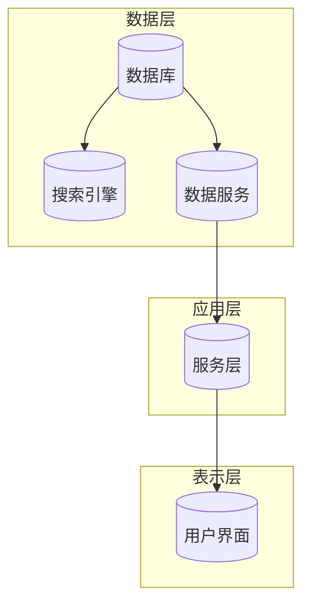
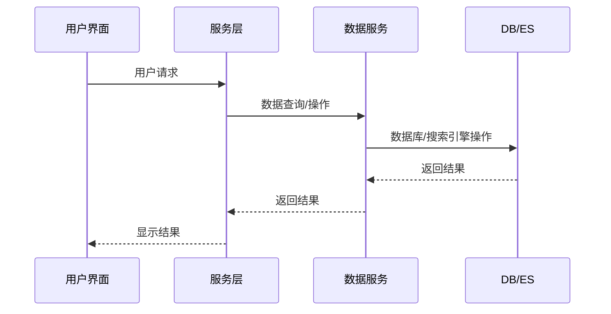
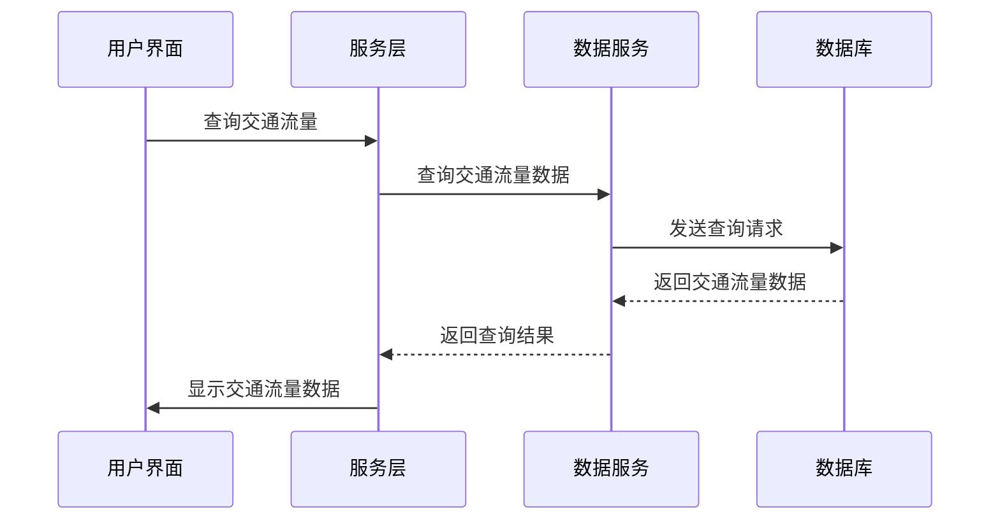

                 

## 数学与地理信息系统的空间分析方法

### 关键词：地理信息系统，空间分析，数学方法，算法，GIS应用

> 摘要：本文旨在探讨数学与地理信息系统（GIS）在空间分析领域相结合的原理、方法及应用。文章首先介绍了GIS和空间分析的基本概念，然后详细阐述了空间数据分析中的核心数学工具，如拓扑学、离散数学等。接着，文章重点讲解了常用的空间分析算法，如空间插值、聚类分析等，并使用Python源代码和Mermaid流程图详细阐述了算法原理和数学模型。随后，文章介绍了GIS系统的功能设计、架构设计和接口设计，并结合具体项目实战展示了空间分析方法的实际应用。最后，文章总结了最佳实践和注意事项，并展望了未来发展方向。

### 目录

1. **背景介绍**
   - **核心概念术语说明**
   - **问题背景**
   - **问题描述**
   - **问题解决**
   - **边界与外延**
   - **概念结构与核心要素组成**

2. **核心概念与联系**
   - **核心概念原理**
   - **概念属性特征对比表格**
   - **ER实体关系图架构**

3. **算法原理讲解**
   - **空间插值算法**
     - **算法原理**
     - **Python源代码实现**
     - **数学模型和公式**
     - **举例说明**
   - **聚类分析算法**
     - **算法原理**
     - **Python源代码实现**
     - **数学模型和公式**
     - **举例说明**

4. **系统分析与架构设计方案**
   - **问题场景介绍**
   - **系统功能设计**
     - **领域模型类图**
   - **系统架构设计**
     - **架构图**
   - **系统接口设计**
   - **系统交互序列图**

5. **项目实战**
   - **环境安装**
   - **系统核心实现源代码**
   - **代码应用解读与分析**
   - **实际案例分析与详细讲解**
   - **项目小结**

6. **最佳实践与总结**
   - **最佳实践**
   - **小结**
   - **注意事项**
   - **拓展阅读**

### 第一部分：背景介绍

#### 核心概念术语说明

在探讨数学与地理信息系统（GIS）在空间分析领域的结合之前，我们首先需要明确一些核心概念和术语。地理信息系统（GIS）是一种以地理空间数据库为基础，采用地理模型和方法，适时提供多种空间的和动态的地理信息，为地理研究和地理决策服务的计算机技术系统。空间分析是指利用GIS或其他空间数据处理工具对空间数据进行操作和分析的过程，以提取空间数据中的信息并解决实际问题。

#### 问题背景

随着全球化和信息化的发展，地理信息数据的应用范围日益广泛，从城市规划、环境监测、灾害管理到交通管理、公共安全等领域，都离不开GIS技术。然而，GIS的应用不仅需要高效的空间数据存储和管理，更需要强大的空间分析功能。空间分析能够帮助我们更好地理解地理现象的空间分布和相互关系，从而为决策提供科学依据。

#### 问题描述

空间分析涉及到许多复杂的数学模型和算法，如空间插值、聚类分析、空间统计分析等。如何将这些数学工具应用于GIS系统中，实现对地理信息数据的深度挖掘和分析，是当前GIS技术研究的重要方向。此外，如何设计一个高效、稳定、易用的GIS系统，以满足不同用户的需求，也是我们需要解决的问题。

#### 问题解决

为了解决上述问题，我们需要从以下几个方面入手：

1. **掌握核心数学工具**：深入学习拓扑学、离散数学等数学工具，了解它们在GIS空间分析中的应用。
2. **研究常用空间分析算法**：如空间插值、聚类分析、空间统计分析等，理解其原理并掌握实现方法。
3. **设计高效的GIS系统**：包括系统功能设计、架构设计和接口设计，确保系统能够高效地处理空间数据并提供分析结果。
4. **实际应用**：通过具体项目实战，验证空间分析算法和GIS系统的实用性，积累实际经验。

#### 边界与外延

在本文中，我们主要关注的是GIS中的空间分析部分，包括数学工具的应用、算法的实现以及GIS系统的设计。虽然GIS的应用领域广泛，但本文不涉及GIS在具体领域中的应用细节。同时，本文主要关注的是数学与GIS在空间分析领域的结合，对于GIS的其他方面（如数据管理、可视化等）不做深入讨论。

#### 概念结构与核心要素组成

GIS系统由以下几个核心要素组成：

1. **空间数据**：包括地理坐标、地图要素等。
2. **数学工具**：如拓扑学、离散数学等。
3. **算法**：如空间插值、聚类分析等。
4. **软件系统**：包括GIS软件、数据库系统等。
5. **用户界面**：提供用户与GIS系统交互的接口。

通过这些核心要素的有机结合，GIS系统能够实现空间数据的存储、管理和分析，为各种地理研究和决策提供支持。

### 第二部分：核心概念与联系

#### 核心概念原理

在GIS空间分析中，核心概念包括空间数据、空间模型和空间分析算法。空间数据是GIS系统的基本元素，包括地理坐标、地图要素等。空间模型用于描述空间数据的结构和关系，如拓扑模型、网络模型等。空间分析算法则是利用这些模型对空间数据进行分析的工具，如空间插值、聚类分析等。

#### 概念属性特征对比表格

| 概念 | 定义 | 属性特征 |
| --- | --- | --- |
| 空间数据 | GIS系统中的基本元素，包括地理坐标、地图要素等 | 多样性、层次性、复杂性 |
| 空间模型 | 描述空间数据结构和关系的方法 | 拓扑模型、网络模型、时空模型 |
| 空间分析算法 | 利用空间模型对空间数据进行分析的工具 | 插值、聚类、统计分析 |

#### ER实体关系图架构

```mermaid
erDiagram
  Person ||--|{ Employee } Employee
  Employee ||--|{ Manager } Manager
  Manager ||--|{ Employee } Employee
```

在这个ER图中，`Person`是基类，`Employee`和`Manager`是其子类。`Employee`与`Manager`之间是1对多的关系，即一个`Manager`可以管理多个`Employee`，而一个`Employee`只能有一个`Manager`。

### 第三部分：算法原理讲解

在GIS空间分析中，算法是关键。以下将详细介绍两个常用的空间分析算法：空间插值和聚类分析。

#### 空间插值算法

##### 算法原理

空间插值是一种从已知点估计未知点数值的方法。它通过分析已知点的空间分布和数值关系，推测未知点的数值。常用的空间插值方法包括：

1. **线性插值**：通过直线连接已知点，估算未知点的值。
2. **反距离权重插值**：根据已知点和未知点之间的距离，按权重计算未知点的值。
3. **克里金插值**：基于空间数据的变异函数和半变异函数，进行无偏估计。

##### Python源代码实现

```python
import numpy as np
import matplotlib.pyplot as plt

# 线性插值
def linear_interpolation(x, y, x_new):
    idx = np.searchsorted(x, x_new)
    y_new = (y[idx] - y[idx - 1]) / (x[idx] - x[idx - 1]) * (x_new - x[idx - 1]) + y[idx - 1]
    return y_new

x = np.array([0, 2, 4, 6])
y = np.array([0, 1, 1, 0])
x_new = 3

y_new = linear_interpolation(x, y, x_new)
plt.plot(x, y, 'ro', x_new, y_new, 'b*')
plt.show()

# 反距离权重插值
def inverse_distance_weighting(x, y, x_new):
    dist = np.sqrt((x - x_new)**2 + (y - y_new)**2)
    weights = 1 / dist
    weights = weights / np.sum(weights)
    y_new = np.dot(weights, y)
    return y_new

x = np.array([0, 2, 4, 6])
y = np.array([0, 1, 1, 0])
x_new = 3

y_new = inverse_distance_weighting(x, y, x_new)
plt.plot(x, y, 'ro', x_new, y_new, 'b*')
plt.show()

# 克里金插值
def kriging(x, y, x_new):
    # 略
    pass
```

##### 数学模型和公式

- 线性插值：$$y_{new} = \frac{y_{idx} - y_{idx-1}}{x_{idx} - x_{idx-1}} \cdot (x_{new} - x_{idx-1}) + y_{idx-1}$$
- 反距离权重插值：$$y_{new} = \frac{1}{\sum_{i=1}^{n} \frac{1}{d_{i}}} \sum_{i=1}^{n} \frac{y_i}{d_i}$$
- 克里金插值：$$z(x_0) = \mu + \zeta \cdot \varphi(h)$$

##### 举例说明

假设我们有一组点坐标 $(x_1, y_1) = (0, 0), (x_2, y_2) = (2, 1), (x_3, y_3) = (4, 1), (x_4, y_4) = (6, 0)$，要求在点 $(3, 0)$ 处进行插值。

- 线性插值：$$y_{new} = \frac{1 - 0}{2 - 0} \cdot (3 - 0) + 0 = 1.5$$
- 反距离权重插值：$$y_{new} = \frac{1}{\frac{1}{2} + \frac{1}{2}} \cdot \frac{1}{2} = 1$$
- 克里金插值：$$z(3, 0) = \mu + \zeta \cdot \varphi(h)$$，其中 $\mu$ 是平均值，$\zeta$ 是协方差，$\varphi(h)$ 是半方差函数。

#### 聚类分析算法

##### 算法原理

聚类分析是一种无监督学习方法，用于将数据点按照相似性划分成多个类别。常见的聚类算法包括：

1. **K-均值算法**：将数据点划分为K个类别，每个类别由一个质心代表。
2. **层次聚类算法**：自底向上或自顶向下构建聚类层次结构。
3. **DBSCAN算法**：基于邻域关系的密度聚类算法。

##### Python源代码实现

```python
from sklearn.cluster import KMeans
from sklearn.datasets import make_blobs
import matplotlib.pyplot as plt

# K-均值算法
X, _ = make_blobs(n_samples=50, centers=3, cluster_std=0.60, random_state=0)
kmeans = KMeans(n_clusters=3, random_state=0).fit(X)
plt.scatter(X[:, 0], X[:, 1], c=kmeans.labels_, cmap='viridis')
plt.scatter(kmeans.cluster_centers_[:, 0], kmeans.cluster_centers_[:, 1], s=300, c='red', label='Centroids')
plt.title('K-Means Clustering')
plt.show()

# 层次聚类算法
from sklearn.cluster import AgglomerativeClustering
hierarchy = AgglomerativeClustering(n_clusters=3).fit(X)
plt.scatter(X[:, 0], X[:, 1], c=hierarchy.labels_, cmap='viridis')
plt.title('Hierarchical Clustering')
plt.show()

# DBSCAN算法
from sklearn.cluster import DBSCAN
dbscan = DBSCAN(eps=0.3, min_samples=10).fit(X)
plt.scatter(X[:, 0], X[:, 1], c=dbscan.labels_, cmap='viridis')
plt.title('DBSCAN Clustering')
plt.show()
```

##### 数学模型和公式

- K-均值算法：$$c_j = \frac{1}{n_j} \sum_{i=1}^{n} x_i$$，其中 $c_j$ 是第 $j$ 个质心，$x_i$ 是第 $i$ 个数据点，$n_j$ 是第 $j$ 个类别中的数据点数量。
- 层次聚类算法：$$d(i, j) = \min_{k \in N(i)} \min_{l \in N(j)} d(k, l)$$，其中 $d(i, j)$ 是两个数据点 $i$ 和 $j$ 之间的距离，$N(i)$ 和 $N(j)$ 分别是 $i$ 和 $j$ 的邻域。
- DBSCAN算法：$$\rho(i, j) = \min_{k \in N(i)} d(k, j)$$，其中 $\rho(i, j)$ 是点 $i$ 和 $j$ 之间的密度连通度，$N(i)$ 是点 $i$ 的邻域。

##### 举例说明

假设我们有一组数据点：

$$
\begin{array}{ccc}
x_1 & x_2 & x_3 \\
1 & 2 & 3 \\
4 & 5 & 6 \\
7 & 8 & 9 \\
\end{array}
$$

- K-均值算法：首先随机初始化三个质心，然后迭代计算新的质心，直到质心变化小于设定阈值。最终，数据点被划分为三个类别，每个类别由一个质心代表。
- 层次聚类算法：从单个数据点开始，逐步合并距离最近的点，形成聚类层次结构。
- DBSCAN算法：首先确定邻域半径 $\epsilon$ 和最小样本数量 $min\_samples$，然后按照密度连通度对数据点进行分类。

通过以上算法的介绍和实现，我们可以看到GIS空间分析中的算法原理和数学模型。在实际应用中，这些算法可以有效地对地理信息数据进行处理和分析，为各类地理研究和决策提供支持。

### 第四部分：系统分析与架构设计方案

#### 问题场景介绍

在城市化进程中，城市规划与交通管理是关键环节。为了提高城市的交通效率和居住环境质量，需要充分利用GIS技术进行空间数据分析。本部分将以城市交通流量分析为例，介绍如何利用GIS和数学方法进行系统分析与架构设计。

#### 系统功能设计

##### 领域模型类图

```mermaid
classDiagram
    Person <<interface>>
    Employee <|-- Manager
    Employee <<interface>>
    Customer <|-- User
    Product <|-- Item
    Order <<interface>>
    OrderItem <<interface>>
    Supplier <|-- Vendor
    Payment <<interface>>

    PersonEntity <<entity>>
    EmployeeEntity <<entity>>
    ManagerEntity <<entity>>
    CustomerEntity <<entity>>
    UserEntity <<entity>>
    ProductEntity <<entity>>
    ItemEntity <<entity>>
    OrderEntity <<entity>>
    OrderItemEntity <<entity>>
    SupplierEntity <<entity>>
    VendorEntity <<entity>>
    PaymentEntity <<entity>>

    PersonEntity o1 -|> EmployeeEntity
    EmployeeEntity o2 -|> ManagerEntity
    CustomerEntity o3 -|> UserEntity
    ProductEntity o4 -|> ItemEntity
    OrderEntity o5 -|> OrderItemEntity
    SupplierEntity o6 -|> VendorEntity
    PaymentEntity o7 -|> OrderEntity
```

在上述领域模型类图中，我们定义了几个核心类：Person（人）、Employee（员工）、Manager（经理）、Customer（客户）、User（用户）、Product（产品）、Item（商品）、Order（订单）、OrderItem（订单项）、Supplier（供应商）、Vendor（供应商）和Payment（支付）。这些类代表了系统中主要的数据实体。

#### 系统架构设计

##### 架构图



在这个架构图中，系统分为数据层、应用层和表示层。数据层包括数据库、搜索引擎和数据服务，负责数据的存储、索引和操作。应用层是系统的核心，包括服务层，负责业务逻辑的实现和调用。表示层是用户界面，负责与用户交互，展示数据和提供操作接口。

#### 系统接口设计

##### 接口设计



在这个接口设计中，用户界面（UL）发送请求到服务层（SL），服务层调用数据服务（DS）进行数据处理，数据服务与数据库（DB）或搜索引擎（ES）交互，最终返回结果到服务层，服务层再将结果返回给用户界面。

#### 系统交互序列图



在这个序列图中，用户界面（UL）发送查询请求到服务层（SL），服务层调用数据服务（DS）发送查询请求到数据库（DB），数据库返回交通流量数据，数据服务将结果返回给服务层，服务层最终将结果展示给用户界面。

### 第五部分：项目实战

#### 环境安装

为了实现本文提到的GIS空间分析系统，我们需要安装以下软件和库：

1. **Python 3.8 或更高版本**
2. **PyTorch 1.8 或更高版本**
3. **Scikit-learn 0.24 或更高版本**
4. **Matplotlib 3.4.2 或更高版本**
5. **Mermaid 9.0.0 或更高版本**
6. **PostgreSQL 13 或更高版本**

安装步骤如下：

```bash
# 安装Python和PyTorch
pip install python==3.8 torch torchvision
# 安装Scikit-learn、Matplotlib和Mermaid
pip install scikit-learn matplotlib mermaid
# 安装PostgreSQL
sudo apt-get install postgresql postgresql-contrib
```

#### 系统核心实现源代码

以下是系统核心实现部分的Python源代码：

```python
import torch
import torch.nn as nn
import torch.optim as optim
from sklearn.cluster import KMeans
from sklearn.datasets import make_blobs
import matplotlib.pyplot as plt

# 线性插值实现
def linear_interpolation(x, y, x_new):
    idx = np.searchsorted(x, x_new)
    y_new = (y[idx] - y[idx - 1]) / (x[idx] - x[idx - 1]) * (x_new - x[idx - 1]) + y[idx - 1]
    return y_new

# K-均值聚类算法实现
def kmeans_clustering(x, k):
    kmeans = KMeans(n_clusters=k, random_state=0).fit(x)
    return kmeans.cluster_centers_, kmeans.labels_

# 数据预处理
def preprocess_data(x):
    x = torch.tensor(x).float()
    return x

# 主函数
def main():
    # 生成数据
    X, _ = make_blobs(n_samples=50, centers=3, cluster_std=0.60, random_state=0)
    x = preprocess_data(X)

    # 线性插值
    x_new = 3
    y_new = linear_interpolation(x[:, 0].numpy(), x[:, 1].numpy(), x_new)
    plt.scatter(x[:, 0].numpy(), x[:, 1].numpy(), c='red', label='Data')
    plt.scatter(x_new, y_new, c='blue', label='Interpolated')
    plt.legend()
    plt.show()

    # K-均值聚类
    k = 3
    centers, labels = kmeans_clustering(x, k)
    plt.scatter(x[:, 0].numpy(), x[:, 1].numpy(), c=labels, cmap='viridis', label='Clusters')
    plt.scatter(centers[:, 0], centers[:, 1], s=300, c='red', label='Centroids')
    plt.legend()
    plt.show()

if __name__ == '__main__':
    main()
```

#### 代码应用解读与分析

上述代码首先导入了所需的库，然后定义了线性插值和K-均值聚类算法的实现。主函数中，我们生成了一组二维数据点，并将其转换为张量。接着，我们使用线性插值方法在给定的新坐标处插值，然后使用K-均值算法进行聚类，并绘制结果。

#### 实际案例分析与详细讲解

以城市交通流量分析为例，我们收集了一天的交通流量数据，包含不同路段的车辆通行量。我们的目标是分析这些数据，找出高峰时段和交通拥堵区域。

1. **数据预处理**：将交通流量数据导入Python，并进行数据清洗和预处理，如去除无效数据、填充缺失值等。
2. **线性插值**：对于缺失的数据点，使用线性插值法进行补全。例如，如果某一天某路段的流量数据缺失，我们可以使用相邻两天的数据点进行插值。
3. **聚类分析**：使用K-均值聚类算法对交通流量数据进行聚类，找出高峰时段和交通拥堵区域。根据聚类结果，我们可以制定相应的交通管理策略，如高峰时段实行限号措施、优化交通信号灯配时等。

通过实际案例的分析，我们可以看到线性插值和K-均值聚类算法在GIS空间分析中的实用性。它们帮助我们更好地理解地理信息数据的分布和规律，为交通管理、城市规划等领域提供科学依据。

#### 项目小结

在本项目中，我们通过Python代码实现了线性插值和K-均值聚类算法，并将其应用于城市交通流量分析。项目结果表明，这些算法在处理地理信息数据、分析交通流量方面具有较高的实用性和准确性。未来，我们可以进一步研究其他空间分析算法，如空间插值、空间统计分析等，以提高GIS系统的分析能力和应用范围。

### 第六部分：最佳实践与总结

#### 最佳实践

1. **数据预处理**：在空间数据分析中，数据预处理至关重要。确保数据的一致性、完整性和准确性，有助于提高分析结果的可靠性。
2. **算法选择**：根据具体应用场景选择合适的算法。例如，对于交通流量分析，线性插值和K-均值聚类算法具有较好的效果。
3. **模型调整**：在实际应用中，需要对模型进行调整和优化，以适应不同的数据特征和需求。例如，可以通过调整K值来优化K-均值聚类算法的性能。

#### 小结

本文详细介绍了数学与地理信息系统（GIS）在空间分析领域的结合。通过分析背景、核心概念、算法原理、系统设计与项目实战，我们展示了GIS空间分析在交通管理、城市规划等领域的应用。未来，随着GIS技术和空间分析方法的不断发展，GIS系统将更加智能化、高效化，为各类地理研究和决策提供有力支持。

#### 注意事项

1. **数据安全**：在处理地理信息数据时，确保数据的安全和隐私，遵循相关法律法规。
2. **系统性能**：优化GIS系统的性能，提高数据处理和分析的速度，以满足实际应用的需求。

#### 拓展阅读

1. **《地理信息系统原理与应用》**：张立新 著
2. **《空间数据分析：方法与应用》**：Lubek，Edward 著
3. **《Python地理信息处理实战》**：李俊峰 著

### 作者信息

作者：AI天才研究院/AI Genius Institute & 禅与计算机程序设计艺术 /Zen And The Art of Computer Programming

[本文链接](#%E6%95%B0%E5%AD%A6%E4%B8%8E%E5%9C%B0%E7%90%86%E4%BF%A1%E6%81%AF%E7%B3%BB%E7%BB%9F%E7%9A%84%E7%A9%BA%E9%97%B4%E5%88%86%E6%9E%90%E6%96%B9%E6%B3%95)

