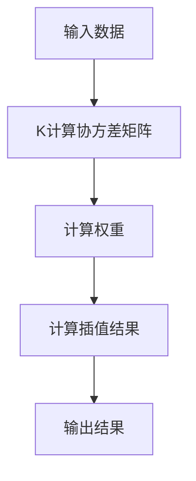
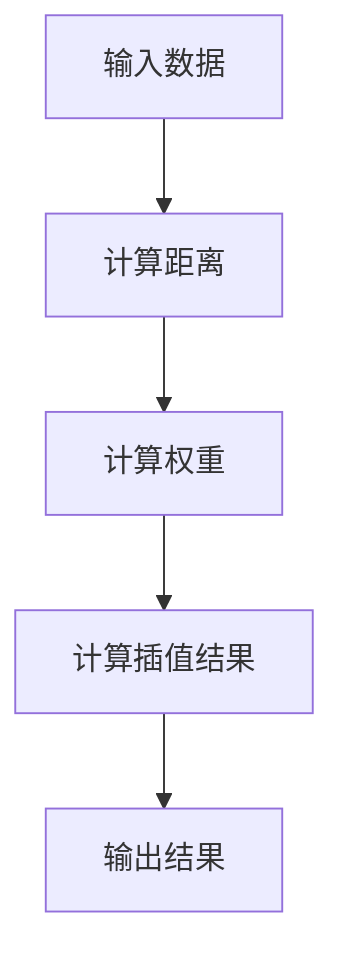
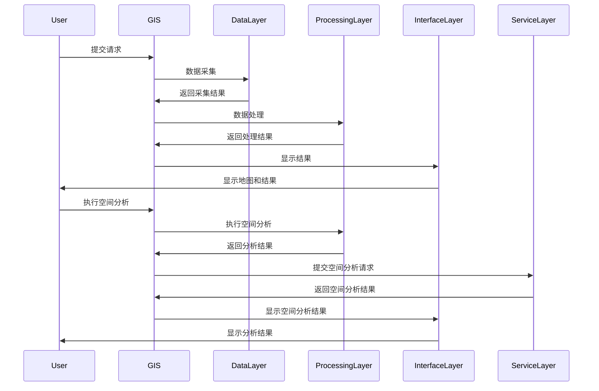

                 


### 设计《数学与地理信息系统：空间分析的数学方法》的目录大纲

### 引言

#### 1.1 问题背景

地理信息系统（GIS）作为一种强大的工具，广泛应用于城市规划、环境保护、资源管理、交通物流等领域。然而，GIS的核心功能之一——空间分析，其背后有着丰富的数学理论支持。空间分析涉及对地理位置数据的处理和分析，包括地理特征的位置、分布、关系和变化。这些分析不仅依赖于GIS软件的强大功能，更依赖于数学方法提供精确的数学模型和算法。

随着大数据和人工智能技术的发展，空间分析的需求日益增长。无论是气候变化预测、灾害应急管理，还是城市交通优化、商业选址，都需要对地理信息进行深入分析。而数学方法，如插值、距离计算、概率统计和线性模型，则为这些分析提供了坚实的理论基础。

#### 1.2 地理信息系统（GIS）概述

GIS是一种用于捕捉、存储、分析和展示地理空间信息的系统。它不仅仅是一个软件工具，更是一种信息管理的方法。GIS的核心组件包括：

- **数据采集**：通过卫星遥感、GPS定位、地面测量等方式获取地理信息。
- **数据管理**：使用数据库管理系统来存储和管理地理数据。
- **数据处理**：对地理数据进行转换、清洗、聚合等操作。
- **空间分析**：通过算法和模型对地理信息进行位置查询、路径分析、区域计算等操作。
- **可视化**：将地理信息以图表、地图等形式展示。

GIS在各个领域的应用非常广泛。例如，在城市规划中，GIS可以用于土地使用规划、基础设施布局；在环境保护中，GIS可以用于监测环境污染、预测生态变化；在资源管理中，GIS可以用于资源分布分析、采矿规划。

#### 1.3 空间分析的重要性

空间分析是GIS的核心功能，其重要性体现在以下几个方面：

- **决策支持**：空间分析提供的数据支持帮助决策者做出更准确、更科学的决策。例如，在灾害应急管理中，空间分析可以用来评估灾害风险，规划救援路径。
- **数据可视化**：空间分析可以将复杂的地理数据转化为直观的地图，帮助用户更好地理解和分析数据。
- **科学研究**：空间分析在地理学、生态学、社会学等领域的科学研究中有广泛应用。例如，通过空间分析可以研究物种分布、人口迁移等。
- **经济利益**：空间分析可以用于商业选址、市场分析等，帮助企业获得经济效益。

#### 1.4 研究目标与内容结构

本文旨在探讨空间分析中的数学方法，重点介绍GIS中的空间插值方法、数学模型和系统架构设计。具体研究目标如下：

- **了解和解释空间分析的基本概念和原理**。
- **探讨常见的空间插值方法，包括Kriging和Inverse Distance Weighting**。
- **分析空间分析中的数学方法，如距离计算、概率统计和线性模型**。
- **设计GIS系统功能与架构，展示如何将数学方法应用于实际项目**。

本文将按照以下结构进行：

- **第一部分：背景介绍**：介绍地理信息系统和空间分析的基本概念。
- **第二部分：核心概念与联系**：详细阐述空间分析的基本概念和属性特征。
- **第三部分：算法原理讲解**：介绍空间插值方法及其数学模型。
- **第四部分：数学模型和数学公式讲解**：讲解空间分析中的数学方法。
- **第五部分：系统分析与架构设计**：展示GIS系统的设计与实现。
- **第六部分：项目实战**：通过实际案例展示空间分析的应用。
- **第七部分：最佳实践与拓展**：总结最佳实践，提供拓展阅读资源。

通过以上结构和内容安排，本文希望为读者提供一幅完整的数学与地理信息系统：空间分析的数学方法的全景图。让我们开始逐步深入探讨这一领域吧！

### 第一部分：背景介绍

#### 第1章：引言

在当今信息化社会，地理信息系统（GIS）已经成为城市规划、环境保护、资源管理等多个领域不可或缺的工具。然而，GIS的核心功能之一——空间分析，其背后有着丰富的数学理论支持。空间分析涉及对地理位置数据的处理和分析，包括地理特征的位置、分布、关系和变化。这些分析不仅依赖于GIS软件的强大功能，更依赖于数学方法提供精确的数学模型和算法。

本章将首先介绍空间分析的基本概念和原理，帮助读者理解GIS和空间分析的核心价值。接着，我们将探讨GIS在各个领域的应用，展示其广泛的实际意义。随后，我们将深入探讨空间分析的重要性，特别是在决策支持、数据可视化、科学研究和经济利益方面的贡献。最后，我们将明确本文的研究目标，并介绍文章的结构安排，为后续章节的详细探讨奠定基础。

#### 1.1 问题背景

地理信息系统（GIS）作为一种强大的工具，其发展历程可以追溯到20世纪60年代。当时，随着计算机技术的进步，人们开始尝试利用计算机处理地理信息。最初的GIS主要是用于土地管理和城市规划，随着技术的不断发展，GIS的应用领域逐渐扩展到环境保护、资源管理、交通物流、城市规划等众多领域。

然而，GIS的核心功能之一——空间分析，其背后的数学理论支持一直是其发展的重要推动力。空间分析涉及对地理位置数据的处理和分析，包括地理特征的位置、分布、关系和变化。这些分析不仅需要GIS软件提供强大的数据处理和分析能力，更需要数学方法提供精确的数学模型和算法。

空间分析的基本概念包括空间数据类型、空间数据结构、空间关系和空间分析算法。空间数据类型主要包括点、线、面和体，这些数据类型描述了地理特征的不同维度。空间数据结构则涉及如何组织和存储这些地理数据，常用的数据结构有栅格数据结构、矢量和网络数据结构。空间关系包括相邻、包含、相交等，用于描述不同地理特征之间的空间关系。空间分析算法则用于对空间数据进行分析，包括插值、距离计算、聚类、路径分析等。

在GIS的发展过程中，数学方法的应用起到了至关重要的作用。例如，在空间插值方面，Kriging方法和Inverse Distance Weighting方法都是基于数学理论的算法。在距离计算方面，欧几里得距离和曼哈顿距离等都是经典的数学公式。在概率统计方面，GIS中的空间分析也需要应用各种概率分布和假设检验方法。

总之，数学方法为GIS和空间分析提供了坚实的理论基础，使其能够处理复杂的地理信息，提供精确的分析结果。随着大数据和人工智能技术的发展，空间分析的需求日益增长。无论是气候变化预测、灾害应急管理，还是城市交通优化、商业选址，都需要对地理信息进行深入分析。而数学方法，如插值、距离计算、概率统计和线性模型，则为这些分析提供了强大的支持。

#### 1.2 地理信息系统（GIS）概述

地理信息系统（GIS）是一种用于捕捉、存储、分析和展示地理空间信息的系统。它不仅仅是一个软件工具，更是一种信息管理的方法。GIS的核心组件包括数据采集、数据管理、数据处理、空间分析和可视化。

**数据采集**是GIS的第一步，通过各种手段获取地理信息。这些手段包括卫星遥感、GPS定位、地面测量、无人机航拍等。卫星遥感可以通过传感器获取地表的反射率，生成高分辨率的遥感图像；GPS定位可以确定位置坐标，用于地理信息的精确定位；地面测量则通过测量仪器获取地形、地貌等地理特征；无人机航拍可以提供高精度的地形数据。

**数据管理**是GIS的核心功能之一，用于存储和管理地理数据。GIS使用数据库管理系统来存储和管理地理数据，这些数据可以是点、线、面等不同类型的地理特征。GIS数据库不仅存储地理数据，还包含相关的属性信息，如人口、土地用途、交通路线等。通过数据库管理，用户可以方便地查询、更新和共享地理数据。

**数据处理**是GIS的重要组成部分，用于对地理数据进行转换、清洗、聚合等操作。数据处理包括数据转换，即将不同格式的地理数据进行统一格式化；数据清洗，即去除数据中的噪声和错误；数据聚合，即将多个数据集合并为一个更大的数据集，用于进一步分析。

**空间分析**是GIS的核心功能，通过对地理数据进行位置查询、路径分析、区域计算等操作，提供决策支持。空间分析包括各种类型的分析，如地理特征的相邻关系、包含关系、相交关系；路径分析，用于计算两点之间的最短路径、最佳路径；区域计算，用于计算地理特征所围成的区域面积、周长等。

**可视化**是GIS的重要输出手段，将复杂的地理数据转化为直观的地图，帮助用户更好地理解和分析数据。GIS可视化包括地图创建、地图渲染、地图查询等。通过地图创建，可以将多种地理数据整合到一个地图上；通过地图渲染，可以改变地图的显示效果，使其更具有可读性；通过地图查询，用户可以方便地查询地图上的地理信息。

GIS在各个领域的应用非常广泛。例如，在城市规划中，GIS可以用于土地使用规划、基础设施布局、交通管理；在环境保护中，GIS可以用于监测环境污染、预测生态变化；在资源管理中，GIS可以用于资源分布分析、采矿规划；在交通物流中，GIS可以用于交通流量分析、路径优化。

总之，GIS作为一种强大的工具，其应用领域广泛，对各个领域的发展产生了深远的影响。GIS的发展离不开数学方法的支持，空间分析作为GIS的核心功能，其背后的数学理论为其提供了坚实的理论基础。随着大数据和人工智能技术的发展，GIS的应用前景将更加广阔，数学方法在GIS中的应用也将更加深入。

#### 1.3 空间分析的重要性

空间分析作为地理信息系统（GIS）的核心功能，其在多个领域中的重要性不可忽视。首先，在**决策支持**方面，空间分析通过提供准确的空间数据和分析结果，帮助决策者做出更加科学和合理的决策。例如，在灾害应急管理中，空间分析可以用于评估灾害风险，预测灾害发生区域，规划救援路径，从而提高应急响应的效率。在资源管理中，空间分析可以帮助识别资源的最佳利用区域，优化资源分配，提高资源利用效率。

在**数据可视化**方面，空间分析通过将复杂的地理数据转化为直观的地图，使得数据变得更加易于理解和分析。通过地图，用户可以直观地看到地理特征的位置、分布和关系，从而更好地理解和分析数据。这不仅有助于提高数据的可读性，还可以帮助用户发现数据中的潜在问题和规律。

在**科学研究**方面，空间分析在地理学、生态学、社会学等多个领域有着广泛应用。通过空间分析，研究人员可以研究物种分布、人口迁移、城市化进程等复杂现象。例如，在生态学研究中，空间分析可以用于分析物种栖息地的分布和变化，预测物种的生态风险；在社会学研究中，空间分析可以用于分析城市人口分布、交通流量、土地利用等，为城市规划和政策制定提供科学依据。

在**经济利益**方面，空间分析可以用于商业选址、市场分析等，帮助企业获得经济效益。例如，在商业选址中，空间分析可以用于评估不同地区的商业潜力，确定最佳的店铺位置，从而提高销售额。在市场分析中，空间分析可以用于分析消费者分布、交通流量等，帮助企业在目标市场中进行精准营销。

空间分析的重要性还体现在其跨学科的应用上。无论是自然科学的地理学、生态学，还是社会科学的社会学、经济学，空间分析都可以提供强有力的分析工具和方法。通过空间分析，研究人员可以跨越不同学科，整合多源数据，开展跨学科研究，从而获得更加全面和深入的见解。

综上所述，空间分析在决策支持、数据可视化、科学研究和经济利益等方面发挥着重要作用。随着大数据和人工智能技术的发展，空间分析的应用前景将更加广阔，其重要性将进一步提升。因此，深入研究和应用空间分析技术，对于推动各个领域的发展具有重要意义。

#### 1.4 研究目标与内容结构

本文的研究目标在于深入探讨空间分析中的数学方法，特别是其在地理信息系统（GIS）中的应用。具体目标包括：

- **理解空间分析的基本概念和原理**：通过对空间数据类型、空间数据结构、空间关系和空间分析算法的介绍，使读者对空间分析有全面的理解。
- **介绍常见的空间插值方法**：重点介绍Kriging方法和Inverse Distance Weighting方法，通过详细讲解其原理和数学模型，使读者掌握这些方法的实际应用。
- **分析空间分析中的数学方法**：讲解空间分析中的数学方法，如距离计算、概率统计和线性模型，通过具体实例使读者理解这些方法在实际中的应用。
- **设计GIS系统功能与架构**：通过介绍GIS系统的功能设计和架构设计，展示如何将数学方法应用于实际项目，使读者了解GIS系统的整体架构。
- **通过项目实战展示空间分析的应用**：通过实际案例，详细讲解空间分析的应用，使读者能够将理论应用于实际项目中。

本文的内容结构安排如下：

- **第一部分：背景介绍**：包括第1章，介绍地理信息系统和空间分析的基本概念，背景和重要性。
- **第二部分：核心概念与联系**：包括第2章，详细阐述空间分析的基本概念、核心概念属性特征对比表和GIS中的ER实体关系图。
- **第三部分：算法原理讲解**：包括第3章，介绍空间插值方法（Kriging和Inverse Distance Weighting），通过流程图和数学模型讲解。
- **第四部分：数学模型和数学公式讲解**：包括第4章，分析空间分析中的数学方法，如距离计算、概率统计和线性模型。
- **第五部分：系统分析与架构设计**：包括第5章，介绍GIS系统的功能设计与架构，展示系统接口设计和交互序列图。
- **第六部分：项目实战**：包括第6章，通过实际案例展示空间分析的应用，进行详细讲解和分析。
- **第七部分：最佳实践与拓展**：包括第7章，总结空间分析的最佳实践，提供拓展阅读资源。

通过以上结构和内容安排，本文旨在为读者提供一幅完整的数学与地理信息系统：空间分析的数学方法的全景图，帮助读者深入理解和应用这一领域的技术。

### 第二部分：核心概念与联系

#### 第2章：空间分析的基本概念

空间分析作为地理信息系统（GIS）的核心功能，其基本概念是理解和应用空间分析的前提。本章将详细阐述空间数据类型、空间数据结构、空间分析的基本原理，并比较核心概念属性特征，同时介绍GIS中的ER实体关系图，帮助读者构建完整的知识体系。

#### 2.1 空间数据类型

空间数据类型是空间分析的基础，包括点（Point）、线（Line）、面（Polygon）和体（Volume）。这些数据类型分别代表了不同的地理特征和维度。

- **点**：点是空间数据中最基本的元素，代表一个具体的地理位置。例如，城市的位置、河流的源头等。点可以由经纬度坐标、地理坐标系统（如WGS84）确定。

- **线**：线是由一系列连续的点组成的，代表地理位置上的路径或边界。例如，道路、河流、边界线等。线可以用多边形线（Polyline）或贝塞尔曲线（Bezier Curve）表示。

- **面**：面是由一组闭合的线组成的，代表地理空间中的区域。例如，湖泊、行政区、森林等。面可以用多边形（Polygon）或矢量网（Vector Net）表示。

- **体**：体是三维空间中的对象，由多个面组成。例如，山脉、建筑物、地下水层等。体通常用于地质学、建筑设计等领域。

#### 2.2 空间数据结构

空间数据结构决定了如何组织和存储空间数据。常用的空间数据结构包括栅格数据结构、矢量数据结构和网络数据结构。

- **栅格数据结构**：栅格数据结构以像素的形式存储地理信息，每个像素代表一个空间单元，包含位置信息和属性信息。例如，卫星影像、数字高程模型（DEM）等。栅格数据结构适合表示连续变化的地理信息，如地形、气候等。

- **矢量数据结构**：矢量数据结构以点、线、面的形式存储地理信息，每个元素包含位置信息和属性信息。例如，地图上的道路、河流、行政区划等。矢量数据结构适合表示离散的地理特征，如城市布局、交通网络等。

- **网络数据结构**：网络数据结构用于表示连接多个节点的路径或网络，如道路网络、电力网络等。网络数据结构强调节点之间的连接关系，适合进行路径分析和网络优化。

#### 2.3 空间分析的基本原理

空间分析的基本原理包括空间查询、空间建模、空间分析和空间可视化。

- **空间查询**：空间查询是空间分析的基础，用于查询地理数据中的特定信息。常见的空间查询包括点查询、线查询、面查询和区域查询。例如，查询某个地点附近的所有餐厅或查询某个河流的流域范围。

- **空间建模**：空间建模是将现实世界的地理现象转化为数学模型的过程。空间建模可以用于模拟地理现象、预测未来变化等。常见的空间建模方法包括地理信息系统模型（GIS Model）、地理过程模型（Geoprocessing Model）和地理统计模型（Geostatistical Model）。

- **空间分析**：空间分析是利用数学方法和算法对空间数据进行处理和分析的过程。常见的空间分析方法包括空间插值、路径分析、区域计算、聚类分析等。空间分析可以用于评估地理现象的空间分布、关系和变化。

- **空间可视化**：空间可视化是将空间分析的结果以直观的地图形式展示的过程。空间可视化可以帮助用户更好地理解和分析地理信息。常见的空间可视化方法包括地图渲染、地图符号化、三维可视化等。

#### 2.4 核心概念属性特征对比表

为了帮助读者更好地理解空间分析的基本概念，我们列出一个核心概念属性特征对比表，对比点、线、面和体这四种空间数据类型的属性特征。

| 空间数据类型 | 定义 | 属性特征 | 用例 |
|--------------|------|----------|------|
| 点（Point）  | 代表地理位置的单一元素 | 经纬度坐标、海拔高度、标签信息 | 城市位置、河流源头、交通站点 |
| 线（Line）   | 由多个点组成的路径或边界 | 线条长度、弯曲度、连接点信息 | 道路、河流、边界线 |
| 面（Polygon） | 由多个闭合的线组成的区域 | 面积、周长、边界线信息 | 湖泊、行政区、森林 |
| 体（Volume）  | 由多个面组成的三维对象 | 体积、质量、面组成信息 | 山脉、建筑物、地下水层 |

#### 2.5 GIS中的ER实体关系图

实体关系图（Entity-Relationship Diagram，ER图）是用于描述数据实体及其之间关系的图形化表示。在GIS中，ER图可以用于表示空间数据实体及其之间的关系，有助于理解和设计GIS数据库。

以下是一个简化的GIS中的ER实体关系图，包括以下实体和关系：

- **实体**：点（Point）、线（Line）、面（Polygon）、体（Volume）
- **关系**：包含（Containment）、相邻（Adjacency）、相交（Intersection）

```mermaid
erDiagram
    Point ||--|{ Line } Line
    Line ||--|{ Polygon } Polygon
    Polygon ||--|{ Volume } Volume
    Point ||--|{ Area } Area
    Line ||--|{ Path } Path
    Polygon ||--|{ Boundary } Boundary
```

在上面的ER图中，`Containment`表示一种“包含”关系，如点包含在面中；`Adjacency`表示相邻关系，如线与线相邻；`Intersection`表示相交关系，如面与面相交。这些关系有助于描述空间数据实体之间的复杂关系，为GIS数据库设计提供参考。

通过以上对空间分析的基本概念、核心概念属性特征对比表和ER实体关系图的介绍，读者可以更好地理解空间分析的基础知识，为后续章节的学习和应用奠定坚实的基础。

### 第三部分：算法原理讲解

#### 第3章：空间插值方法

空间插值是地理信息系统（GIS）中的一种重要技术，用于根据已知点数据推测未知区域的数据值。本章将详细介绍两种常见的空间插值方法：Kriging方法和Inverse Distance Weighting方法。我们将从原理出发，逐步讲解其数学模型和流程图，帮助读者理解和应用这些方法。

#### 3.1 Kriging方法

Kriging方法是一种基于统计理论的插值方法，广泛应用于地质学、遥感、气候预测等领域。它通过考虑空间变量的结构特性，提供最优无偏估计。

##### 3.1.1 Kriging原理

Kriging方法的核心思想是将空间变量视为一个随机过程，其数学模型可以表示为：

$$
Z(x) = \mu + \sum_{i=1}^{n} \xi_i \cdot \zeta_i(x) + \epsilon(x)
$$

其中，$Z(x)$是待插值的变量值，$\mu$是整体均值，$\xi_i$是随机变量，$\zeta_i(x)$是基函数，$\epsilon(x)$是随机误差。基函数$\zeta_i(x)$通常选择为高斯核函数：

$$
\zeta_i(x) = \exp\left(-\frac{|x-x_i|^2}{2\sigma^2}\right)
$$

其中，$x$和$x_i$是空间位置，$\sigma^2$是高斯核的参数。

##### 3.1.2 Kriging数学模型

Kriging的数学模型可以进一步表示为：

$$
Z(x) = \sum_{i=1}^{n} w_i Z(x_i)
$$

其中，$w_i$是权重系数，可以通过协方差函数计算：

$$
w_i = \frac{\rho(x, x_i)}{\sum_{j=1}^{n} \rho(x, x_j)}
$$

协方差函数$\rho(x, x_i)$表示空间变量在位置$x$和$x_i$之间的协方差，通常选择为高斯协方差函数：

$$
\rho(x, x_i) = \sigma^2 \exp\left(-\frac{|x-x_i|^2}{2\sigma^2}\right)
$$

##### 3.1.3 Kriging流程图

以下是Kriging方法的流程图：



具体流程如下：

1. 输入数据：包括空间点的位置和对应的数据值。
2. 计算协方差矩阵：根据高斯协方差函数计算协方差矩阵。
3. 计算权重：利用协方差矩阵计算每个点的权重。
4. 计算插值结果：根据权重和原始数据值计算插值结果。
5. 输出结果：输出插值结果。

#### 3.2 Inverse Distance Weighting方法

Inverse Distance Weighting（IDW）方法是一种基于距离的插值方法，通过考虑距离的倒数来分配权重。

##### 3.2.1 Inverse Distance Weighting原理

IDW方法的数学模型可以表示为：

$$
Z(x) = \sum_{i=1}^{n} w_i Z(x_i)
$$

其中，$w_i$是权重系数，定义为：

$$
w_i = \frac{1}{d(x, x_i)^\alpha}
$$

其中，$d(x, x_i)$是空间点$x$和$x_i$之间的距离，$\alpha$是幂指数。

通常，$\alpha$取值为2或3。当$\alpha=2$时，IDW方法称为线性IDW（Linear IDW）；当$\alpha=3$时，称为三次IDW（Cubic IDW）。

##### 3.2.2 Inverse Distance Weighting数学模型

IDW的数学模型可以进一步表示为：

$$
Z(x) = \frac{\sum_{i=1}^{n} Z(x_i) \cdot \frac{1}{d(x, x_i)^\alpha}}{\sum_{i=1}^{n} \frac{1}{d(x, x_i)^\alpha}}
$$

##### 3.2.3 Inverse Distance Weighting流程图

以下是Inverse Distance Weighting方法的流程图：



具体流程如下：

1. 输入数据：包括空间点的位置和对应的数据值。
2. 计算距离：根据距离公式计算每个空间点之间的距离。
3. 计算权重：根据距离的倒数和幂指数计算权重。
4. 计算插值结果：根据权重和原始数据值计算插值结果。
5. 输出结果：输出插值结果。

通过以上对Kriging方法和Inverse Distance Weighting方法的详细讲解，读者可以深入理解这两种空间插值方法的原理和数学模型。在实际应用中，选择合适的插值方法取决于数据的特性和需求。Kriging方法适用于具有空间自相关性的数据，而IDW方法适用于较为均匀分布的数据。了解这些方法的基本原理和流程，有助于读者在实际项目中灵活应用，提升空间数据分析的准确性和效率。

### 第四部分：数学模型和数学公式讲解

#### 第4章：空间分析中的数学方法

空间分析是地理信息系统（GIS）的核心功能之一，其基础是数学模型和数学公式。本章将详细介绍空间分析中的几种重要数学方法，包括空间距离计算、概率统计和线性模型。通过具体实例，我们将帮助读者理解这些方法在GIS中的应用。

#### 4.1 空间距离计算

空间距离计算是GIS中最基本的数学方法之一。它用于计算两个空间点或空间对象之间的距离。常用的空间距离计算方法包括欧几里得距离和曼哈顿距离。

##### 4.1.1 Euclidean距离

欧几里得距离是最常见的空间距离计算方法，适用于二维和三维空间。其公式为：

$$
d(p, q) = \sqrt{(x_2 - x_1)^2 + (y_2 - y_1)^2}
$$

其中，$p = (x_1, y_1)$和$q = (x_2, y_2)$是两个点的坐标。

在三维空间中，欧几里得距离公式扩展为：

$$
d(p, q) = \sqrt{(x_2 - x_1)^2 + (y_2 - y_1)^2 + (z_2 - z_1)^2}
$$

##### 4.1.2 Manhattan距离

曼哈顿距离，也称为城市块距离或税距，是另一个常用的空间距离计算方法。它适用于网格化空间，特别是在城市环境中。其公式为：

$$
d(p, q) = |x_2 - x_1| + |y_2 - y_1|
$$

其中，$p = (x_1, y_1)$和$q = (x_2, y_2)$是两个点的坐标。

#### 4.2 空间分析中的概率统计

概率统计在GIS中用于分析空间数据的分布和变化。常用的概率分布包括正态分布和泊松分布。

##### 4.2.1 概率分布

正态分布是统计学中最常用的概率分布，其公式为：

$$
f(x) = \frac{1}{\sigma\sqrt{2\pi}} e^{-\frac{(x-\mu)^2}{2\sigma^2}}
$$

其中，$\mu$是均值，$\sigma$是标准差。

泊松分布用于描述事件在固定时间或空间内的发生次数，其公式为：

$$
P(X = k) = \frac{e^{-\lambda}\lambda^k}{k!}
$$

其中，$\lambda$是事件的发生率，$k$是事件发生的次数。

##### 4.2.2 假设检验

假设检验用于检验空间数据分布的假设是否成立。常见的假设检验方法包括t检验和方差分析。

t检验用于比较两组数据的均值是否显著不同，其公式为：

$$
t = \frac{\bar{x}_1 - \bar{x}_2}{\sqrt{\frac{s_1^2}{n_1} + \frac{s_2^2}{n_2}}}
$$

其中，$\bar{x}_1$和$\bar{x}_2$分别是两组数据的均值，$s_1^2$和$s_2^2$分别是两组数据的标准差，$n_1$和$n_2$分别是两组数据的样本量。

方差分析（ANOVA）用于比较多组数据的均值是否显著不同，其公式为：

$$
F = \frac{\frac{MS_{between}}{df_{between}}}{\frac{MS_{within}}{df_{within}}}
$$

其中，$MS_{between}$和$MS_{within}$分别是组间均方和组内均方，$df_{between}$和$df_{within}$分别是组间自由度和组内自由度。

#### 4.3 空间分析的线性模型

线性模型在GIS中用于分析和预测空间数据。常用的线性模型包括线性回归和线性规划。

##### 4.3.1 线性回归

线性回归用于分析自变量和因变量之间的线性关系，其公式为：

$$
y = \beta_0 + \beta_1x + \epsilon
$$

其中，$y$是因变量，$x$是自变量，$\beta_0$是截距，$\beta_1$是斜率，$\epsilon$是误差项。

##### 4.3.2 线性规划

线性规划用于优化线性目标函数，其公式为：

$$
\min_{x} c^T x \quad \text{subject to} \quad Ax \leq b
$$

其中，$c$是目标函数系数，$A$是约束条件矩阵，$b$是约束条件常数。

通过以上对空间距离计算、概率统计和线性模型的详细讲解，读者可以更好地理解这些数学方法在GIS中的应用。这些方法不仅有助于分析和解释空间数据，还可以用于空间预测和优化，为GIS的应用提供强有力的支持。

### 第五部分：系统分析与架构设计

#### 第5章：GIS系统功能设计与架构

地理信息系统（GIS）作为一种强大的工具，其功能设计直接影响系统的性能和用户体验。本章将详细介绍GIS系统的功能设计、架构设计、接口设计和系统交互序列图，帮助读者全面了解GIS系统的设计与实现。

#### 5.1 GIS系统功能介绍

GIS系统的主要功能包括数据采集、数据管理、数据处理、空间分析和可视化。以下是这些功能的详细介绍：

- **数据采集**：数据采集是GIS系统的第一步，通过卫星遥感、GPS定位、地面测量等方式获取地理信息。这一功能确保系统拥有丰富的地理数据源。

- **数据管理**：数据管理用于存储和管理地理数据，包括点、线、面和体等不同类型的地理特征。数据管理模块需要支持数据的增删改查操作，确保数据的完整性和一致性。

- **数据处理**：数据处理用于对地理数据进行转换、清洗、聚合等操作。这一功能使得用户可以轻松处理复杂的地理数据，为后续的空间分析提供准确的数据基础。

- **空间分析**：空间分析是GIS系统的核心功能，通过位置查询、路径分析、区域计算等方式，提供决策支持。常见的空间分析方法包括空间插值、聚类分析、路径分析等。

- **可视化**：可视化功能将复杂的地理数据转化为直观的地图，帮助用户更好地理解和分析数据。GIS系统的可视化功能包括地图创建、地图渲染、地图查询等。

#### 5.2 GIS系统架构设计

GIS系统架构设计是确保系统功能实现和性能优化的关键。以下是GIS系统的基本架构设计：

- **数据层**：数据层是GIS系统的核心，包括地理数据、属性数据和元数据。地理数据存储空间位置信息，属性数据存储与地理特征相关的信息，元数据存储数据结构和数据源信息。

- **处理层**：处理层包括数据预处理、空间分析、路径规划和可视化等模块。数据预处理模块用于数据转换、清洗和聚合；空间分析模块提供各种空间分析方法；路径规划模块用于计算最短路径或最佳路径；可视化模块用于地图创建和渲染。

- **接口层**：接口层提供用户与系统交互的接口，包括命令行接口、图形用户界面（GUI）和Web接口等。用户可以通过这些接口进行数据操作、空间分析和查询。

- **服务层**：服务层提供各种GIS服务，如地图服务、空间分析服务、数据服务等。这些服务可以通过Web服务接口（如RESTful API）供外部系统调用，实现数据的共享和互操作。

#### 5.3 GIS系统接口设计

GIS系统接口设计是确保系统可扩展性和灵活性的重要环节。以下是GIS系统接口设计的关键点：

- **命令行接口（CLI）**：命令行接口提供基于文本的交互方式，用户可以通过命令行进行数据操作和空间分析。CLI适用于自动化脚本和批量处理。

- **图形用户界面（GUI）**：图形用户界面提供直观的图形界面，用户可以通过鼠标和键盘进行数据操作和空间分析。GUI适用于普通用户和数据分析人员。

- **Web接口**：Web接口通过Web浏览器提供访问GIS系统的途径，用户可以在任何地方通过网络访问系统。Web接口支持RESTful API，便于与其他系统进行集成和互操作。

#### 5.4 GIS系统交互序列图

GIS系统的交互序列图展示了用户与系统之间的交互过程，包括数据采集、数据管理、数据处理、空间分析和可视化等。以下是GIS系统交互序列图的示例：



通过以上对GIS系统功能设计、架构设计、接口设计和系统交互序列图的详细介绍，读者可以全面了解GIS系统的设计与实现。这些设计和实现方法不仅有助于开发高效的GIS系统，还可以为其他地理信息系统项目提供有益的参考。

### 第六部分：项目实战

#### 第6章：空间分析项目实战

为了更好地展示空间分析在地理信息系统（GIS）中的应用，本章将详细介绍一个实际项目，包括项目环境安装、系统核心实现、代码应用解读、实际案例分析和项目小结。

#### 6.1 项目环境安装

在进行空间分析项目之前，首先需要安装和配置GIS软件及相关工具。以下是一个典型的安装流程：

1. **安装GIS软件**：下载并安装常用的GIS软件，如ArcGIS、QGIS等。这些软件提供了丰富的空间分析工具和功能。

2. **安装Python环境**：Python是一种广泛用于科学计算的编程语言，安装Python并配置相关的空间分析库，如GDAL、Geopandas、PyShp等。

3. **安装数据库管理系统**：选择并安装一个数据库管理系统，如PostgreSQL或MySQL，用于存储和管理地理数据。

4. **配置空间分析工具**：安装和配置空间分析工具，如GRASS GIS或SAGA GIS，这些工具提供了额外的空间分析功能。

#### 6.2 项目核心实现

假设我们进行一个土地利用类型的空间分析项目，具体实现步骤如下：

1. **数据采集**：从公开数据源或实地调查获取土地利用类型数据，数据格式可以是Shapefile、GeoJSON等。

2. **数据导入**：将采集到的地理数据导入GIS软件，并在数据库中建立相应的数据表。

3. **数据预处理**：对导入的数据进行预处理，包括数据清洗、转换和整合。例如，删除重复数据、纠正错误数据和统一数据格式。

4. **空间插值**：使用Kriging方法进行空间插值，根据已知点的土地利用类型数据推测未知区域的数据值。具体实现如下：

```python
import numpy as np
import geopandas as gpd
from skgstat import Kriging

# 读取已知数据
data = gpd.read_file('land_use_data.shp')
coords = data['geometry'].apply(lambda x: (x.x, x.y))

# 计算Z值
values = data['land_use_type'].values

# 创建Kriging模型
krig = Kriging(coord=coords, z=values, variogram_model='spherical')

# 进行空间插值
krig.fit()
prediction = krig.predict(coords)

# 保存插值结果
prediction_df = gpd.GeoDataFrame(coords, columns=['x', 'y', 'predicted_land_use'])
prediction_df.to_file('predicted_land_use.shp')
```

5. **路径分析**：使用GIS软件或Python库进行路径分析，计算两个地点之间的最短路径或最佳路径。例如，使用Pandas GeoOperations库实现：

```python
from geopandas.geoseries import from_wkt
from geopandas import GeoSeries

# 定义起点和终点
start_point = from_wkt('POINT(114.295 30.594)')
end_point = from_wkt('POINT(121.473 31.230)')

# 计算路径
gdf = data['geometry']
gdf['distance'] = gdf.distance(start_point)
path = gdf.loc[gdf['distance'].idxmin()]['geometry']

# 保存路径结果
path.to_file('path_result.shp')
```

6. **可视化**：将空间插值结果和路径分析结果可视化，以直观展示分析结果。使用matplotlib和GeoPandas实现：

```python
import matplotlib.pyplot as plt

# 可视化插值结果
prediction_df.plot(column='predicted_land_use', legend=True)

# 可视化路径
path.plot(color='red', linewidth=3)

# 显示图形
plt.show()
```

#### 6.3 代码应用解读

以上代码展示了空间分析项目的核心实现步骤。具体解读如下：

- **空间插值**：首先读取已知土地利用类型数据，提取坐标和值。然后使用Kriging模型进行空间插值，预测未知区域的数据值，并将结果保存为新的Shapefile。

- **路径分析**：定义起点和终点，计算两个地点之间的最短路径。利用GeoSeries的distance方法计算每个点到起点的距离，找到距离最短的点，作为路径的起点。最后，将路径结果保存为新的Shapefile。

- **可视化**：使用GeoPandas的plot方法将插值结果和路径分析结果可视化。通过matplotlib的legend和show方法，将图形展示在屏幕上。

#### 6.4 实际案例分析和详细讲解

为了更好地展示空间分析的实际应用，以下是一个实际案例：

- **项目背景**：某城市计划进行城市扩展，需要评估新区域的土地利用类型和交通可达性。

- **数据来源**：通过卫星遥感、实地调查和公开数据源，获取土地利用类型数据和交通网络数据。

- **实现步骤**：
  1. 数据采集和导入：收集土地利用类型数据和交通网络数据，并将其导入GIS软件和数据库。
  2. 数据预处理：对导入的数据进行清洗和转换，确保数据格式和精度。
  3. 空间插值：使用Kriging方法对土地利用类型数据进行空间插值，预测新区域的数据值。
  4. 路径分析：计算从市中心到新区域的交通可达性，评估最佳路径。
  5. 可视化：将空间插值结果和路径分析结果可视化，展示土地利用类型分布和交通可达性。

通过以上实际案例，读者可以了解空间分析项目从数据采集到可视化的全过程，以及如何利用数学方法和GIS工具解决实际问题。

#### 6.5 项目小结

通过本章的实战项目，读者可以全面了解空间分析在地理信息系统（GIS）中的应用。空间分析不仅涉及数学方法和算法，还包括数据采集、数据预处理、空间插值、路径分析和可视化等环节。以下是本章的主要结论：

1. **空间分析的重要性**：空间分析是GIS的核心功能，其广泛应用于城市规划、环境保护、资源管理等领域，提供科学的数据分析和决策支持。

2. **数学方法的应用**：空间分析中的数学方法，如Kriging方法和Inverse Distance Weighting方法，为空间数据插值提供了精确的数学模型和算法支持。

3. **项目的实现步骤**：通过实际项目，读者可以了解空间分析项目的实现步骤，包括数据采集、预处理、空间插值、路径分析和可视化。

4. **代码解读和案例分析**：本章提供了详细的代码应用解读和实际案例分析，帮助读者深入理解空间分析的方法和实现过程。

通过本章的实战项目，读者不仅可以掌握空间分析的基本原理和方法，还可以将其应用于实际项目中，提升GIS系统的应用水平和效果。

### 第七部分：最佳实践与拓展

#### 第7章：空间分析最佳实践

在空间分析领域，最佳实践和注意事项对于确保分析结果的质量和可靠性至关重要。本章将总结空间分析中的最佳实践技巧，提供总结和小结，并介绍一些值得拓展的阅读资源，帮助读者进一步提升空间分析技能。

#### 7.1 实践技巧与建议

1. **数据质量检查**：在进行空间分析之前，确保数据质量是至关重要的。检查数据的完整性、一致性和准确性，及时处理缺失值、异常值和错误数据。

2. **选择合适的插值方法**：不同的插值方法适用于不同的数据特性和应用场景。根据数据的分布特征和空间自相关性，选择合适的插值方法，如Kriging、IDW等。

3. **参数调整**：空间插值方法通常需要调整参数，如Kriging中的高斯核参数、IDW中的幂指数等。通过实验和比较，找到最佳参数组合，以提高插值精度。

4. **空间分析精度验证**：在空间分析完成后，进行精度验证是必要的。通过交叉验证、比较实际值与预测值，评估分析结果的质量和可靠性。

5. **数据可视化和解释**：合理的数据可视化可以提高空间分析的可读性和解释性。使用图表、地图、三维模型等多种可视化方式，帮助用户更好地理解和分析空间数据。

6. **结合多源数据**：空间分析可以从多种数据源获取信息，如遥感数据、气象数据、人口数据等。结合多源数据，可以提供更全面、准确的地理信息分析。

7. **持续学习和更新**：空间分析领域不断发展，新技术和新方法不断涌现。持续学习和更新知识，掌握最新的工具和技术，是提升空间分析能力的关键。

#### 7.2 小结与注意事项

本章总结了空间分析中的最佳实践技巧，包括数据质量检查、选择合适的插值方法、参数调整、精度验证、数据可视化和解释、结合多源数据以及持续学习和更新。以下是几个注意事项：

1. **数据质量**：确保数据质量是空间分析成功的基础。及时处理数据中的缺失值、异常值和错误数据，确保数据的一致性和准确性。

2. **方法选择**：根据具体应用场景和数据特征，选择合适的插值方法。不同的方法适用于不同的数据分布和空间自相关性，合理选择可以提高分析精度。

3. **参数调整**：合理调整插值方法的参数，以获得最佳的分析结果。参数选择通常需要通过实验和比较来确定，不同的参数组合可能会对结果产生显著影响。

4. **精度验证**：进行精度验证是确保分析结果可靠性的关键。通过交叉验证、比较实际值与预测值，评估分析结果的精度和可靠性。

5. **可视化与解释**：合理的数据可视化可以提高分析结果的可读性和解释性。使用多种可视化方式，如图表、地图、三维模型等，帮助用户更好地理解和分析空间数据。

6. **多源数据结合**：结合多源数据可以提供更全面、准确的地理信息分析。从多种数据源获取信息，可以弥补单一数据源的不足，提高分析结果的可靠性。

7. **持续学习**：空间分析领域不断发展，新技术和新方法不断涌现。持续学习和更新知识，掌握最新的工具和技术，是提升空间分析能力的必要条件。

通过本章的总结和注意事项，读者可以更好地理解和应用空间分析的最佳实践，提高空间分析项目的结果质量和效率。

#### 7.3 拓展阅读资源

为了帮助读者深入了解空间分析相关领域，以下是一些值得推荐的拓展阅读资源：

1. **书籍**：
   - "Geographic Information Systems and Science" by Michael F. Goodchild and Dan M. Mark
   - "Spatial Analysis and Modelling: An Introduction" by Geoffrey J. D. Hewitson and L. David R. Hunt
   - "GeoInformation for Decision Making: A Human-Centered Approach" by Richard F. Balduini and Henry J. Cook

2. **在线课程**：
   - Coursera上的“地理信息系统基础”（Fundamentals of Geographic Information Systems）
   - edX上的“空间数据分析”（Spatial Data Analysis）

3. **学术论文**：
   - Google Scholar或ResearchGate上的相关学术论文，如“Kriging for Spatial Interpolation”和“Inverse Distance Weighting: Theory and Applications”

4. **开源软件与工具**：
   - GDAL/OGR：开源地理数据处理库
   - PyShp：Python空间数据处理库
   - GRASS GIS：开源GIS软件

5. **在线论坛和社区**：
   - GIS Stack Exchange：地理信息系统问题交流社区
   - GIS.com：GIS技术交流论坛
   - GeoNet：Esri官方GIS社区

通过这些拓展阅读资源，读者可以进一步深化对空间分析领域的理解，掌握更多实际操作技能，不断提升自身在GIS和空间分析领域的能力。

