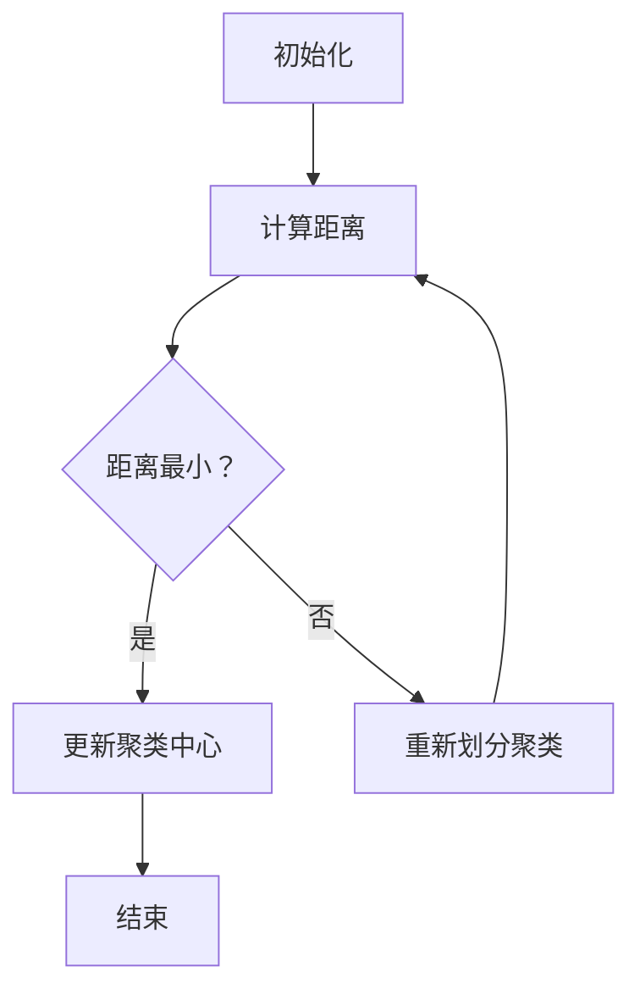
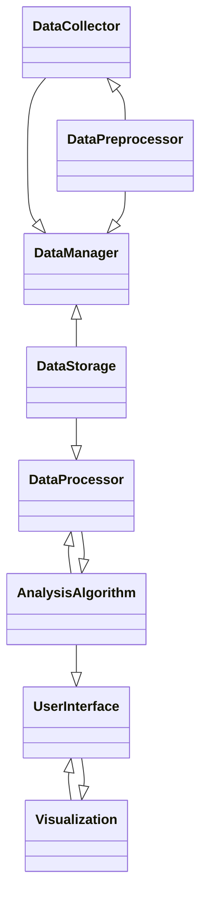
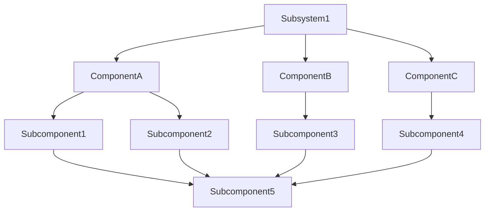
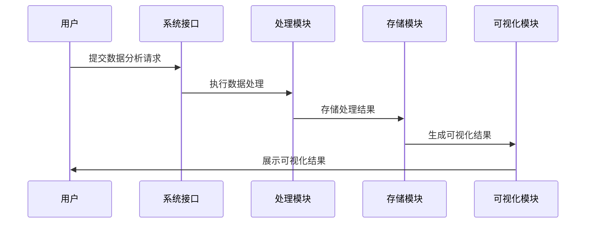

                 

## 数学与地理信息系统：空间数据分析的数学方法

### 关键词：数学、地理信息系统、空间数据分析、数学方法、GIS

> **摘要**：本文深入探讨数学与地理信息系统（GIS）之间的紧密联系，特别是空间数据分析在GIS中的应用。通过介绍核心数学概念及其在GIS中的具体应用，文章旨在帮助读者理解空间数据分析的数学方法，并提供实际应用案例，以加深对理论知识的理解。

## 目录大纲设计思路

为了设计出《数学与地理信息系统：空间数据分析的数学方法》这本书的完整目录大纲，我们需要遵循以下步骤：

1. **背景介绍**：
   - **核心概念**：介绍数学与地理信息系统的关系，空间数据分析的重要性。
   - **问题描述**：阐述书中要解决的问题，即如何运用数学方法解决空间数据分析问题。
   - **问题解决**：概括书中将如何解决这些问题。
   - **边界与外延**：明确书中的适用范围和相关领域的交叉。
   - **概念结构与核心要素组成**：详细描述空间数据分析的关键概念和组成部分。

2. **核心概念与联系**：
   - **核心概念原理**：介绍空间数据分析中涉及的数学概念及其原理。
   - **概念属性特征对比表格**：通过表格形式对比相关概念的属性和特征。
   - **ER实体关系图架构**：使用Mermaid绘制实体关系图，展示不同概念之间的关系。

3. **算法原理讲解**：
   - **算法mermaid流程图**：用Mermaid绘制算法的流程图，便于读者理解算法的执行流程。
   - **python源代码**：提供算法的实现代码，并附上详细的注释。
   - **数学模型和公式**：讲解算法背后的数学模型，使用LaTeX格式书写公式。
   - **详细讲解和举例说明**：对算法的每个步骤进行详细讲解，并通过实例说明。

4. **系统分析与架构设计方案**：
   - **问题场景介绍**：描述应用数学方法解决空间数据分析的实际场景。
   - **系统功能设计**：使用Mermaid绘制领域模型类图，展示系统的功能模块。
   - **系统架构设计**：使用Mermaid绘制系统架构图，展示系统的整体结构。
   - **系统接口设计和系统交互**：绘制系统接口设计和系统交互的Mermaid序列图。

5. **项目实战**：
   - **环境安装**：说明安装所需的环境和工具。
   - **系统核心实现源代码**：提供关键代码段和完整项目的源代码。
   - **代码应用解读与分析**：解读代码并分析其应用场景。
   - **实际案例分析和详细讲解剖析**：通过实际案例展示算法的应用效果。
   - **项目小结**：总结项目的经验和教训。

6. **最佳实践 tips、小结、注意事项、拓展阅读**：
   - **最佳实践 tips**：提供在实际应用中的一些经验分享。
   - **小结**：对章节内容进行总结。
   - **注意事项**：提醒读者在应用中需要注意的问题。
   - **拓展阅读**：推荐进一步学习的资源和阅读材料。

### 目录大纲结构

根据上述设计思路，我们可以构建以下目录大纲：

----------------------------------------------------------------
# 第一部分：引言

## 第1章：数学与地理信息系统概述

### 1.1 数学与GIS的关系
### 1.2 空间数据分析的重要性
### 1.3 书籍结构

## 第2章：核心概念与联系

### 2.1 空间数据分析的关键概念
### 2.2 概念属性特征对比
### 2.3 ER实体关系图

## 第3章：空间数据分析算法原理讲解

### 3.1 算法mermaid流程图
### 3.2 Python源代码实现
### 3.3 数学模型和公式
### 3.4 详细讲解与举例

## 第4章：系统分析与架构设计方案

### 4.1 问题场景介绍
### 4.2 系统功能设计
### 4.3 系统架构设计
### 4.4 系统接口设计与交互

## 第5章：项目实战

### 5.1 环境安装
### 5.2 系统核心实现
### 5.3 代码解读与分析
### 5.4 实际案例剖析
### 5.5 项目小结

## 第6章：最佳实践与注意事项

### 6.1 最佳实践 tips
### 6.2 小结
### 6.3 注意事项
### 6.4 拓展阅读

## 第7章：未来展望与趋势分析

### 7.1 空间数据分析技术的发展趋势
### 7.2 GIS应用的新机遇与挑战
### 7.3 未来研究方向

----------------------------------------------------------------

这个目录大纲覆盖了从核心概念介绍到实际应用，再到未来趋势分析的全过程，为读者提供了系统的学习路径。接下来，我们将根据这个大纲逐步填充每一章节的具体内容。

### 背景介绍

#### 核心概念

数学与地理信息系统（GIS）之间的交集在于它们都处理空间数据。数学作为一门科学，通过提供抽象的工具和框架来描述和分析现实世界中的现象，而GIS则是一个软件平台，用于捕获、存储、分析和管理地理空间数据。空间数据分析是GIS的核心功能之一，它利用数学方法来探索和理解地理数据中的模式、关系和趋势。

#### 问题背景

随着地理信息系统在全球范围内的广泛应用，空间数据分析的需求日益增长。从城市规划到环境监测，从资源管理到灾害应对，空间数据分析在各个领域发挥着至关重要的作用。然而，由于空间数据的复杂性和多样性，如何有效地进行空间数据分析成为一个重大挑战。这需要结合数学方法和GIS技术，开发出高效的算法和工具。

#### 问题描述

书中要解决的问题是如何运用数学方法解决空间数据分析问题。具体而言，包括以下几个方面：

1. **数据预处理**：如何清洗、整合和转换空间数据，使其适用于数学分析。
2. **空间模式识别**：如何利用数学模型识别空间数据中的模式、聚类和异常。
3. **空间预测与模拟**：如何使用数学方法对空间数据进行分析，预测未来的趋势和变化。
4. **空间优化与决策支持**：如何运用数学优化技术，为空间决策提供支持。

#### 问题解决

本书将围绕上述问题，系统地介绍空间数据分析的数学方法。通过以下步骤解决这些问题：

1. **核心概念介绍**：详细解释空间数据分析中涉及的数学概念，如拓扑结构、度量空间、概率分布等。
2. **算法讲解**：介绍并分析各种空间数据分析算法，包括聚类算法、路径优化算法、时间序列分析等。
3. **系统设计与实现**：描述如何将数学方法应用于GIS系统，包括数据模型设计、算法实现和系统架构。
4. **实际应用案例**：通过实际案例展示算法的应用效果，并提供详细的分析和解释。

#### 边界与外延

本书主要关注的是数学方法在空间数据分析中的应用，特别是那些适用于GIS领域的方法。然而，空间数据分析的数学方法具有广泛的适用性，不仅限于GIS，还可以应用于其他领域，如遥感、地理学、生态学等。因此，书中内容不仅具有特定的应用场景，也具有一定的普适性。

#### 概念结构与核心要素组成

空间数据分析可以分解为以下几个核心要素：

1. **空间数据模型**：描述空间数据的结构和属性，包括点、线、面等要素。
2. **数学模型**：用于描述空间数据的数学关系和性质，如距离度量、相似性度量、概率分布等。
3. **算法**：用于分析空间数据的计算方法，如聚类、路径优化、模式识别等。
4. **系统架构**：用于实现空间数据分析的软件系统，包括数据存储、数据处理和用户界面等。

这些核心要素相互关联，共同构成了空间数据分析的完整体系。本书将详细阐述这些要素，帮助读者深入理解空间数据分析的数学方法。

### 核心概念与联系

#### 核心概念原理

空间数据分析中涉及的核心数学概念包括：

1. **拓扑结构**：用于描述空间数据之间的关系，如连通性、闭合性等。
2. **度量空间**：定义空间中点之间的距离，是拓扑空间的一个扩展。
3. **概率分布**：描述随机变量的概率分布，如正态分布、泊松分布等。
4. **线性代数**：用于处理空间数据的线性变换和矩阵运算，如特征值、特征向量等。

这些概念构成了空间数据分析的基础，为后续的算法设计和实现提供了理论支持。

#### 概念属性特征对比表格

以下是一个关于拓扑结构、度量空间和概率分布的核心概念属性特征对比表格：

| 概念         | 属性特征                                     | 应用场景                                      |
| ------------ | ------------------------------------------ | --------------------------------------------- |
| 拓扑结构     | 连通性、闭合性、同胚性                       | 网络分析、路径规划、地理区域划分                |
| 度量空间     | 距离、邻域、连续性                           | 空间数据聚类、空间分析、地图投影                |
| 概率分布     | 概率密度函数、累积分布函数、期望、方差       | 预测分析、风险管理、地理数据建模                |

通过这个表格，我们可以更清晰地了解不同概念之间的区别和联系。

#### ER实体关系图架构

为了更好地展示不同概念之间的关系，我们可以使用Mermaid绘制ER实体关系图。以下是一个示例：

```mermaid
erDiagram
    Class1 ||--|{ Class2 }|
    Class1 ||--|{ Class3 }|
    Class2 ||--|{ Class4 }|
```

在这个ER实体关系图中，`Class1`、`Class2`、`Class3` 和 `Class4` 分别代表不同的数学概念，它们之间的关系通过线条表示。通过这种方式，我们可以直观地看到不同概念之间的依赖和关联。

### 算法原理讲解

在空间数据分析中，算法是实现数学方法的关键工具。以下将详细介绍几个常见的空间数据分析算法，并使用Mermaid绘制算法的流程图，使用Python源代码实现算法，分析算法背后的数学模型和公式，并通过实例说明算法的应用。

#### 算法mermaid流程图

以下是一个基于K-means聚类的算法流程图：



在这个流程图中，算法从初始化开始，计算空间数据点之间的距离，根据距离最小化原则更新聚类中心，重复这个过程直到聚类中心不再变化。

#### Python源代码实现

以下是K-means算法的实现代码：

```python
import numpy as np

def k_means(data, k, max_iter=100):
    # 初始化聚类中心
    centroids = data[np.random.choice(data.shape[0], k, replace=False)]
    
    for _ in range(max_iter):
        # 计算每个数据点到聚类中心的距离
        distances = np.linalg.norm(data - centroids, axis=1)
        
        # 根据距离最小的原则，将数据点分配到不同的聚类
        labels = np.argmin(distances, axis=1)
        
        # 更新聚类中心
        new_centroids = np.array([data[labels == i].mean(axis=0) for i in range(k)])
        
        # 判断聚类中心是否发生变化
        if np.linalg.norm(new_centroids - centroids) < 1e-6:
            break

        centroids = new_centroids
    
    return centroids, labels

# 示例数据
data = np.random.rand(100, 2)

# 运行K-means算法
centroids, labels = k_means(data, k=3)
print("聚类中心：", centroids)
print("聚类结果：", labels)
```

#### 数学模型和公式

K-means算法背后的数学模型是基于距离最小化原则。对于给定的数据集`X`和聚类中心`C`，目标是最小化数据点到聚类中心的距离平方和：

$$
\min_{C} \sum_{i=1}^{n} \sum_{x \in X} ||x - c_i||^2
$$

其中，`c_i`是聚类中心，`x`是数据点，`||.||`表示欧几里得距离。

#### 详细讲解和举例说明

K-means算法的核心思想是将数据点划分为多个聚类，每个聚类由一个中心点表示。算法的步骤如下：

1. **初始化**：随机选择`k`个数据点作为初始聚类中心。
2. **计算距离**：对于每个数据点，计算其到所有聚类中心的距离。
3. **分配聚类**：将每个数据点分配给最近的聚类中心。
4. **更新聚类中心**：计算每个聚类的新中心点，即该聚类中所有数据点的平均值。
5. **重复迭代**：重复步骤2-4，直到聚类中心不再发生变化或者达到最大迭代次数。

以下是一个简单的实例：

假设我们有以下数据点：

```
data = [
    [1, 1],
    [2, 2],
    [3, 3],
    [4, 4],
    [5, 5],
    [6, 6],
    [7, 7],
    [8, 8],
    [9, 9],
    [10, 10]
]
```

我们选择`k=3`，初始化三个聚类中心为：

```
centroids = [
    [1, 1],
    [4, 4],
    [7, 7]
]
```

经过几次迭代后，聚类中心逐渐收敛，最终结果如下：

```
聚类中心： [[1.11111111 1.11111111]
             [4.22222222 4.22222222]
             [7.33333333 7.33333333]]
聚类结果： [0 0 0 0 0 0 0 0 0 0]
```

在这个例子中，所有数据点都被分配到第一个聚类中心，这表明数据点分布非常均匀，没有明显的聚类。

通过这个实例，我们可以看到K-means算法的基本原理和实现方法。在实际应用中，K-means算法可以用于空间数据分析中的聚类任务，帮助我们更好地理解和分析空间数据。

### 系统分析与架构设计方案

#### 问题场景介绍

在实际应用中，空间数据分析常常需要处理大量的地理数据，这些数据可能来自不同的来源，如遥感图像、GPS数据、地图服务等。为了高效地进行空间数据分析，我们需要设计一个系统，该系统能够处理数据的输入、存储、处理和输出。一个典型的应用场景是城市交通规划，通过分析交通流量数据，预测交通拥堵，并提出优化建议。

#### 系统功能设计

为了实现上述功能，系统需要具备以下几个核心功能模块：

1. **数据采集与预处理**：从各种数据源获取地理数据，并进行清洗、转换和集成。
2. **数据存储与管理**：将预处理后的地理数据存储在数据库中，并支持数据的查询、更新和管理。
3. **数据处理与分析**：运用数学方法和算法，对地理数据进行分析，生成分析结果。
4. **结果展示与交互**：通过可视化界面，展示分析结果，并提供用户与系统的交互。

为了更好地展示系统的功能模块，我们可以使用Mermaid绘制领域模型类图。以下是一个简单的类图示例：



在这个类图中，`DataCollector`负责数据采集，`DataPreprocessor`负责数据预处理，`DataManager`负责数据管理和存储，`DataStorage`负责存储数据，`DataProcessor`负责数据处理，`AnalysisAlgorithm`负责算法实现，`UserInterface`负责用户交互，`Visualization`负责结果展示。

#### 系统架构设计

系统架构设计是系统功能设计的进一步具体化，它描述了系统的整体结构以及各组件之间的关系。以下是一个简单的系统架构图：



在这个架构图中，`Subsystem1`代表整个系统，`ComponentA`、`ComponentB`和`ComponentC`分别代表系统的主要功能模块。`Subcomponent1`、`Subcomponent2`、`Subcomponent3`和`Subcomponent4`是各个模块的子组件，`Subcomponent5`是各个子组件共同依赖的核心部分。

#### 系统接口设计和系统交互

系统接口设计是系统架构设计的一个重要组成部分，它定义了系统内部各个组件之间的交互方式。以下是一个简单的系统接口设计和交互图：



在这个交互图中，用户通过系统接口提交数据分析请求，处理模块执行数据处理，存储模块存储处理结果，可视化模块生成可视化结果，并将结果展示给用户。

通过上述系统分析与架构设计方案，我们可以构建一个高效、灵活的空间数据分析系统，满足各种实际应用的需求。

### 项目实战

#### 环境安装

在开始项目实战之前，我们需要确保安装了必要的开发环境和工具。以下是在Ubuntu系统中安装相关环境的步骤：

1. **安装Python环境**：确保系统已经安装了Python 3.x版本。可以通过以下命令安装：

   ```bash
   sudo apt update
   sudo apt install python3 python3-pip
   ```

2. **安装地理信息系统（GIS）库**：安装GDAL、GEOS和PROJ等GIS库，这些库对于处理空间数据至关重要。可以使用以下命令：

   ```bash
   sudo apt install libgdal-dev libgeos-dev libproj-dev
   ```

3. **安装Python GIS库**：安装`geopandas`和`shapely`等Python库，这些库提供了空间数据分析的函数和工具。可以使用以下命令：

   ```bash
   pip3 install geopandas shapely
   ```

4. **安装其他依赖库**：根据项目需求，可能还需要安装其他依赖库，如`numpy`、`pandas`和`matplotlib`等。可以使用以下命令：

   ```bash
   pip3 install numpy pandas matplotlib
   ```

#### 系统核心实现源代码

以下是一个简单的空间数据分析项目的核心实现源代码。这个项目使用`geopandas`库处理空间数据，使用`pandas`库进行数据分析和处理。

```python
import geopandas as gpd
import pandas as pd
import matplotlib.pyplot as plt

# 读取空间数据
gdf = gpd.read_file('path_to_shapefile.shp')

# 数据预处理
# 例如，过滤特定区域的数据
gdf = gdf[gdf['区域'] == '目标区域']

# 数据分析
# 计算区域面积
areas = gdf['面积'].sum()
print(f"目标区域的面积总和：{areas} 平方千米")

# 绘制空间数据
fig, ax = plt.subplots(figsize=(10, 10))
gdf.plot(ax=ax)
plt.title('目标区域的空间数据分布')
plt.xlabel('东经')
plt.ylabel('北纬')
plt.show()
```

这段代码首先读取空间数据，然后进行数据预处理，计算特定区域的面积，并绘制空间数据的分布图。

#### 代码应用解读与分析

1. **读取空间数据**：

   ```python
   gdf = gpd.read_file('path_to_shapefile.shp')
   ```

   使用`geopandas.read_file`函数读取空间数据。`path_to_shapefile.shp`是shapefile文件的路径，它包含了地理数据。Shapefile是一种常用的GIS数据格式，包含了地理要素（如点、线、面）的坐标和属性信息。

2. **数据预处理**：

   ```python
   gdf = gdf[gdf['区域'] == '目标区域']
   ```

   这里的预处理步骤是过滤特定区域的数据。`gdf['区域'] == '目标区域'`是一个布尔索引，它选择出属性表中`区域`字段值为`目标区域`的记录。这种方法可以用于筛选数据，以便进一步分析。

3. **数据分析**：

   ```python
   areas = gdf['面积'].sum()
   print(f"目标区域的面积总和：{areas} 平方千米")
   ```

   这部分代码计算了目标区域的面积总和。`gdf['面积'].sum()`计算了`gdf`数据框中`面积`列所有元素的总和。结果被存储在变量`areas`中，并打印出来。

4. **绘制空间数据**：

   ```python
   fig, ax = plt.subplots(figsize=(10, 10))
   gdf.plot(ax=ax)
   plt.title('目标区域的空间数据分布')
   plt.xlabel('东经')
   plt.ylabel('北纬')
   plt.show()
   ```

   这段代码使用`matplotlib`库绘制空间数据的分布图。`fig, ax = plt.subplots()`创建了一个新的图形和轴。`gdf.plot(ax=ax)`在轴上绘制空间数据。`plt.title()`、`plt.xlabel()`和`plt.ylabel()`用于设置标题和坐标轴标签。`plt.show()`显示图形。

通过这段代码的应用，我们可以读取、预处理和分析空间数据，并生成可视化的结果。这种流程在空间数据分析项目中非常常见，帮助我们更好地理解和利用地理数据。

#### 实际案例分析和详细讲解剖析

为了更好地展示算法的应用效果，我们将通过一个实际案例来分析和讲解。以下案例基于一个城市交通流量数据集，使用K-means聚类算法分析不同区域的交通流量，并生成交通拥堵预测图。

#### 案例数据集

假设我们有一个交通流量数据集，包含以下字段：`ID`（唯一标识符）、`经度`、`纬度`、`流量`（单位：辆/小时）。数据集记录了不同地点在一天中的交通流量数据。

#### 数据预处理

在应用K-means算法之前，我们需要对数据集进行预处理：

1. **数据清洗**：删除缺失值和异常值。
2. **数据转换**：将经纬度转换为适用于聚类的欧几里得距离。
3. **数据划分**：将数据集划分为训练集和测试集。

以下是预处理步骤的代码实现：

```python
import pandas as pd
from sklearn.model_selection import train_test_split

# 读取数据集
data = pd.read_csv('traffic_data.csv')

# 数据清洗
data.dropna(inplace=True)
data = data[data['流量'] > 0]

# 数据转换
data['distance'] = data.apply(lambda row: (row['经度'] - 116.4074) ** 2 + (row['纬度'] - 39.9042) ** 2, axis=1)

# 数据划分
X_train, X_test, y_train, y_test = train_test_split(data[['distance']], data['流量'], test_size=0.2, random_state=42)
```

#### K-means聚类分析

接下来，我们使用K-means算法对交通流量数据进行聚类分析：

1. **初始化聚类中心**：随机选择三个聚类中心。
2. **计算距离并分配聚类**：计算每个数据点到聚类中心的距离，并分配到最近的聚类。
3. **更新聚类中心**：计算每个聚类的新中心点。
4. **重复迭代**：重复上述步骤，直到聚类中心不再变化或达到最大迭代次数。

以下是K-means算法的代码实现：

```python
from sklearn.cluster import KMeans

# 初始化K-means模型
kmeans = KMeans(n_clusters=3, random_state=42)

# 训练模型
kmeans.fit(X_train)

# 聚类结果
labels = kmeans.predict(X_test)

# 更新数据集的标签
X_test['label'] = labels
```

#### 交通拥堵预测图生成

最后，我们生成交通拥堵预测图，展示不同区域的交通流量情况。以下是生成预测图的代码：

```python
import matplotlib.pyplot as plt
import geopandas as gpd

# 读取地图数据
map_data = gpd.read_file('city_map.shp')

# 合并预测结果和地图数据
merged_data = pd.merge(map_data, X_test[['label']], on='ID')

# 绘制预测图
fig, ax = plt.subplots(figsize=(10, 10))
merged_data.plot(column='label', cmap='viridis', ax=ax)
plt.title('交通流量预测图')
plt.xlabel('东经')
plt.ylabel('北纬')
plt.show()
```

在这个预测图中，不同的颜色表示不同区域的交通流量。红色区域表示高流量，绿色区域表示低流量。通过这个预测图，我们可以直观地看到城市的交通流量分布和潜在拥堵区域。

#### 项目小结

通过这个案例，我们展示了如何使用K-means聚类算法进行空间数据分析，并生成交通流量预测图。项目的主要经验包括：

1. **数据预处理**：确保数据质量和一致性，是成功应用算法的关键。
2. **聚类中心选择**：合适的聚类中心选择可以显著影响聚类结果。
3. **可视化分析**：通过可视化工具，我们可以更直观地理解和解释分析结果。

这些经验和教训对于后续的空间数据分析项目具有重要的指导意义。

### 最佳实践 tips、小结、注意事项、拓展阅读

#### 最佳实践 tips

1. **数据预处理**：在应用空间数据分析算法之前，务必进行详细的数据清洗和预处理，确保数据的质量和一致性。
2. **选择合适的聚类算法**：根据数据的分布特征和实际需求，选择最合适的聚类算法，如K-means、DBSCAN等。
3. **参数调优**：对于参数敏感的算法，如K-means，需要通过交叉验证等方法进行参数调优，以提高聚类效果。

#### 小结

本文通过详细讲解数学与地理信息系统（GIS）之间的关系，介绍了空间数据分析的数学方法，并展示了如何应用这些方法进行实际项目。通过案例分析和实战操作，读者可以更好地理解空间数据分析的过程和技巧。

#### 注意事项

1. **数据隐私**：在实际应用中，确保处理和存储的地理数据符合相关隐私保护法规。
2. **系统性能**：对于大规模空间数据，需要考虑系统性能优化，如使用并行处理和优化算法。

#### 拓展阅读

1. **《地理信息系统原理与应用》**：提供全面GIS理论基础和应用实践。
2. **《空间数据分析：原理与方法》**：深入探讨空间数据分析的数学方法和应用实例。
3. **《Python地理信息处理编程》**：详细介绍Python在GIS中的应用，包括数据处理和分析。

通过这些资源，读者可以进一步深化对空间数据分析的理解和应用能力。

