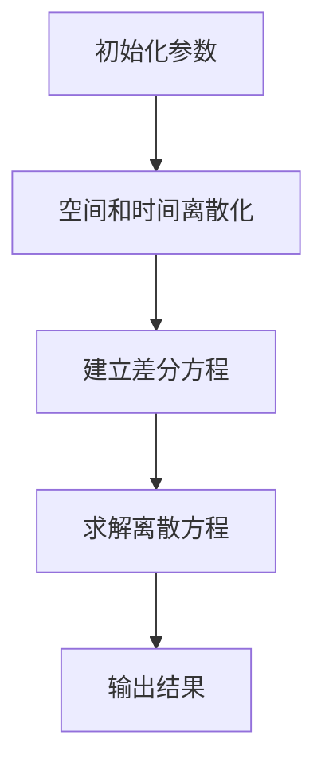
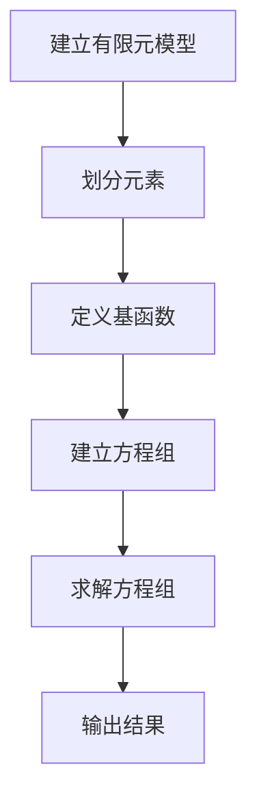
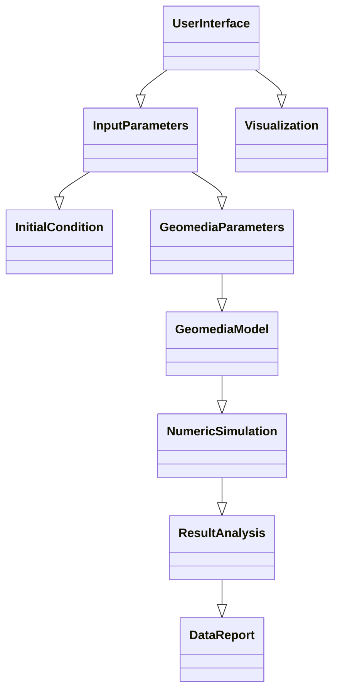

                 

### 文章标题

地震波是地球内部的震动传递到地表的一种现象，它对我们了解地球内部结构和地质活动具有重要意义。数学模型在地震学中扮演着至关重要的角色，通过数学模拟，我们可以更准确地预测地震波传播的路径和强度，从而为地震预警和灾害预防提供科学依据。本文将深入探讨地震波传播的数学模拟，通过逐步分析和推理，揭示这一复杂过程背后的数学原理和算法应用。

### 关键词

- 地震学
- 数学模型
- 地震波传播
- 波动方程
- 数值模拟
- 有限差分法
- 偏微分方程

### 摘要

本文旨在通过数学与地震学的交叉研究，详细探讨地震波传播的数学模拟方法。首先，我们将介绍地震学的基本概念和数学模型的应用背景。接着，分析地震波传播的核心概念，如地震波类型、波动方程等，并展示它们之间的关系。随后，我们将深入讲解用于模拟地震波传播的主要数学算法和模型，通过mermaid绘制流程图，并提供Python代码示例。此外，我们将详细讲解这些模型的数学公式，并使用LaTeX格式表示。最后，通过一个实际项目，我们将展示地震波传播模拟系统的设计和实现过程，并提供最佳实践 tips、小结、注意事项和拓展阅读，以帮助读者进一步学习。

### 背景介绍

#### 地震学基本概念

地震学是研究地震现象及其物理机制的科学，它的研究范围涵盖了地震的成因、传播、影响和预测等方面。地震是指地球内部的能量在短时间内突然释放，引起的地面震动现象。地震的成因主要与地壳运动、岩石破裂、火山活动等有关。地震波是地震过程中产生的波动，它们以不同的速度和方式在地球内部传播。

地震波根据传播方式可以分为体波和面波。体波包括纵波（P波）和横波（S波），纵波是沿地球半径方向传播的压缩波，而横波则是垂直于传播方向的剪切波。面波包括瑞雷波（Rayleigh波）和勒夫波（Love波），它们沿地表传播，具有较强的破坏性。地震波的传播速度取决于介质的性质，如密度、弹性和剪切模量等。

#### 数学模型在地震学中的应用

数学模型在地震学中的应用非常广泛，尤其是在地震波传播的模拟和预测方面。波动方程是描述地震波传播的基本方程，它表达了地震波在空间和时间上的变化规律。波动方程通常分为一维、二维和三维形式，根据具体问题进行选择。

一维波动方程通常用于描述地震波在单条断裂带或直线传播的情况，其形式为：

$$
\frac{\partial^2 u}{\partial t^2} = c^2 \frac{\partial^2 u}{\partial x^2}
$$

其中，$u(x,t)$ 表示地震波在位置 $x$ 和时间 $t$ 的位移，$c$ 是地震波在介质中的传播速度。

二维和三维波动方程则更为复杂，分别用于描述地震波在平面和空间中的传播。二维波动方程可以表示为：

$$
\frac{\partial^2 u}{\partial t^2} = c^2 \left( \frac{\partial^2 u}{\partial x^2} + \frac{\partial^2 u}{\partial y^2} \right)
$$

三维波动方程则为：

$$
\frac{\partial^2 u}{\partial t^2} = c^2 \nabla^2 u
$$

其中，$\nabla^2$ 是拉普拉斯算子。

数值模拟方法是通过离散化和迭代求解波动方程，从而得到地震波在空间和时间上的近似解。常见的数值模拟方法包括有限差分法、有限元素法、有限体积法等。这些方法通过将连续的波动方程转化为离散的方程组，从而在计算机上进行求解。

数学模型的优势在于能够定量地描述地震波的传播过程，为地震预警和灾害预防提供科学依据。然而，数学模型的建立和求解面临着诸多挑战，如地震波的复杂性、介质的非均匀性和计算资源的限制等。

#### 问题背景与问题描述

地震是一种自然现象，但它的发生往往伴随着巨大的破坏性。历史上，多次强烈地震造成了巨大的生命财产损失，例如1920年土耳其地震、1960年智利大地震和2011年日本福岛地震。这些地震不仅导致了人员伤亡，还对建筑物、基础设施和生态环境造成了严重破坏。

随着科技的进步，人们越来越重视地震预警和灾害预防。地震预警是通过监测地震波传播过程中的早期信号，提前发出预警，为人们提供宝贵的逃生时间。灾害预防则涉及地震灾害风险评估、建筑抗震设计、应急响应和救援等方面。

然而，地震波传播的复杂性使得精确预测地震波的传播路径和强度成为一个巨大的挑战。传统的地震预警方法依赖于地震仪等传感器收集数据，通过数据分析得出地震波的传播速度和路径。这种方法存在一定的延迟和误差，难以满足实时预警的需求。

为了提高地震预警的准确性和及时性，科学家们开始研究地震波传播的数学模拟。通过数学模型和数值模拟方法，我们可以更准确地预测地震波的传播过程，从而为地震预警和灾害预防提供科学依据。

#### 问题解决

地震波传播的数学模拟主要通过建立波动方程和选择合适的数值模拟方法来实现。波动方程是描述地震波传播的基本方程，它表达了地震波在空间和时间上的变化规律。通过求解波动方程，我们可以得到地震波在不同时间和位置的位移和速度。

数值模拟方法是将连续的波动方程转化为离散的方程组，从而在计算机上进行求解。常见的数值模拟方法包括有限差分法、有限元素法、有限体积法等。这些方法通过将空间和时间划分为离散的网格，将波动方程转化为差分方程，从而进行迭代求解。

为了提高模拟的准确性，科学家们还开发了各种优化算法，如并行计算、自适应网格划分、多尺度模拟等。这些方法可以有效地提高计算效率和精度，为地震预警和灾害预防提供更加可靠的模拟结果。

#### 边界与外延

地震波传播的数学模拟不仅限于地震预警和灾害预防，它在地球物理学、工程地质、石油勘探等领域也有着广泛的应用。在地球物理学中，地震波传播的模拟可以帮助研究地球内部的构造和物质组成。在工程地质中，地震波传播的模拟可以用于建筑抗震设计和地质灾害评估。在石油勘探中，地震波传播的模拟可以帮助识别地下油气藏。

此外，随着计算技术的不断发展，地震波传播的数学模拟也在不断地拓展和深化。例如，通过机器学习和大数据分析，科学家们可以更准确地预测地震波的传播特性，提高模拟的精度和可靠性。同时，量子计算等新兴技术的引入，也为地震波传播的数学模拟带来了新的机遇和挑战。

### 核心概念与联系

地震波传播是一个复杂的过程，涉及多个核心概念。以下将详细分析这些概念，并展示它们之间的关系。

#### 地震波类型

地震波根据传播方式和特性可以分为多种类型，主要包括体波和面波。体波包括纵波（P波）和横波（S波），它们在固体、液体和气体中均能传播。纵波是压缩波，质点沿着波的传播方向振动；横波是剪切波，质点垂直于波的传播方向振动。面波则包括瑞雷波（Rayleigh波）和勒夫波（Love波），它们只能在固体表面附近传播，具有较大的破坏性。

P波和S波的传播速度不同，通常情况下，P波速度大于S波速度。这是因为P波是压缩波，需要较小的能量就能传播；而S波是剪切波，需要较大的能量才能传播。这种速度差异导致了地震波传播过程中的波形畸变和干涉现象。

#### 波动方程

波动方程是描述地震波传播的基本方程，它表达了地震波在空间和时间上的变化规律。波动方程通常分为一维、二维和三维形式，根据具体问题进行选择。

一维波动方程通常用于描述地震波在单条断裂带或直线传播的情况，其形式为：

$$
\frac{\partial^2 u}{\partial t^2} = c^2 \frac{\partial^2 u}{\partial x^2}
$$

其中，$u(x,t)$ 表示地震波在位置 $x$ 和时间 $t$ 的位移，$c$ 是地震波在介质中的传播速度。

二维和三维波动方程则更为复杂，分别用于描述地震波在平面和空间中的传播。二维波动方程可以表示为：

$$
\frac{\partial^2 u}{\partial t^2} = c^2 \left( \frac{\partial^2 u}{\partial x^2} + \frac{\partial^2 u}{\partial y^2} \right)
$$

三维波动方程则为：

$$
\frac{\partial^2 u}{\partial t^2} = c^2 \nabla^2 u
$$

其中，$\nabla^2$ 是拉普拉斯算子。

波动方程的核心在于描述地震波在介质中的传播速度和路径，它为我们提供了研究地震波传播的理论基础。

#### 数值求解方法

波动方程的求解通常需要借助数值方法。常见的数值求解方法包括有限差分法、有限元素法、有限体积法等。这些方法通过将连续的波动方程转化为离散的方程组，从而在计算机上进行求解。

有限差分法是一种常见的一维数值求解方法，其基本思想是将空间和时间离散化，将连续的波动方程转化为离散的差分方程。例如，对于一维波动方程：

$$
\frac{\partial^2 u}{\partial t^2} = c^2 \frac{\partial^2 u}{\partial x^2}
$$

可以采用如下离散化形式：

$$
u_{i+1,n+1} - 2u_{i,n+1} + u_{i-1,n+1} = c^2 (u_{i+1,n} - 2u_{i,n} + u_{i-1,n})
$$

其中，$u_{i,n}$ 表示在位置 $i$ 和时间 $n$ 的位移，$c$ 是地震波在介质中的传播速度。

有限元素法和有限体积法则是适用于二维和三维问题的数值求解方法。有限元素法通过将空间划分为有限个元素，在每个元素内部采用线性函数或高阶函数近似地震波，从而得到一个线性方程组。有限体积法则通过将空间划分为有限个控制体积，利用守恒定律将波动方程转化为离散的守恒方程。

#### 核心概念属性特征对比表格

以下是一个地震波类型及其属性特征的对比表格：

| 地震波类型 | 传播方式 | 传播速度 | 破坏性 | 传播介质 |
| --- | --- | --- | --- | --- |
| 纵波（P波） | 压缩波 | 高 | 低 | 固体、液体、气体 |
| 横波（S波） | 剪切波 | 低 | 中 | 固体 |
| 瑞雷波（Rayleigh波） | 曲面波 | 低 | 高 | 固体表面 |
| 勒夫波（Love波） | 曲面波 | 低 | 高 | 固体表面 |

通过上述对比表格，我们可以更清晰地了解不同地震波类型的传播特性，从而为地震波传播的数学模拟提供依据。

#### ER实体关系图架构的Mermaid流程图

为了展示地震波传播中的核心概念及其关系，我们可以使用Mermaid流程图来绘制ER实体关系图。以下是ER实体关系图的结构：

```mermaid
erDiagram
    Entity1 ||--|{ Entity2 }|-- Entity3
    Entity1 ||--|{ Entity4 }|-- Entity5
    Entity1 ||--|{ Entity6 }|-- Entity7
```

在这个ER实体关系图中，Entity1表示地震波，Entity2、Entity3、Entity4、Entity5和Entity6分别表示P波、S波、瑞雷波、勒夫波和波动方程。通过这种关系图，我们可以直观地看到地震波与其他实体之间的关联，从而更好地理解地震波传播的数学模拟。

### 算法原理讲解

地震波传播的模拟涉及到复杂的数学计算和数值方法。为了简化这个过程，我们可以采用有限差分法（Finite Difference Method, FDM）和有限元素法（Finite Element Method, FEM）等数值方法。这些方法通过将连续的波动方程离散化，从而在计算机上求解。以下将详细讲解这些算法的基本原理，并使用mermaid流程图和Python代码示例进行说明。

#### 有限差分法（Finite Difference Method, FDM）

有限差分法是一种常用的数值求解方法，适用于一维和二维问题。其基本思想是将空间和时间离散化，用差分近似代替微分，从而将波动方程转化为离散的代数方程。

**一维波动方程的离散化**：

对于一维波动方程：

$$
\frac{\partial^2 u}{\partial t^2} = c^2 \frac{\partial^2 u}{\partial x^2}
$$

其中，$u(x,t)$ 表示地震波在位置 $x$ 和时间 $t$ 的位移，$c$ 是地震波在介质中的传播速度。

我们可以将其离散化为：

$$
u_{i+1,n+1} - 2u_{i,n+1} + u_{i-1,n+1} = c^2 (u_{i+1,n} - 2u_{i,n} + u_{i-1,n})
$$

其中，$u_{i,n}$ 表示在位置 $i$ 和时间 $n$ 的位移。

**mermaid流程图**：



**Python代码示例**：

```python
import numpy as np
import matplotlib.pyplot as plt

# 初始化参数
c = 3000  # 地震波传播速度
dx = 10   # 空间步长
dt = 1    # 时间步长
x = np.arange(0, 1000, dx)
t = np.arange(0, 20, dt)

# 离散化
u = np.zeros((len(x), len(t)))
u[0, 0] = 1

# 求解离散方程
for n in range(1, len(t)):
    for i in range(1, len(x) - 1):
        u[i, n] = 2 * u[i, n - 1] - u[i, n - 2] - c * (u[i + 1, n - 1] - u[i - 1, n - 1]) * dx**2

# 输出结果
plt.plot(x, u[:, 0], label='t=0')
plt.plot(x, u[:, 10], label='t=10')
plt.legend()
plt.show()
```

#### 有限元素法（Finite Element Method, FEM）

有限元素法是一种更为通用的数值求解方法，适用于复杂几何形状和三维问题。其基本思想是将求解区域划分为有限个元素，在每个元素内部采用线性函数或高阶函数近似地震波。

**二维波动方程的离散化**：

对于二维波动方程：

$$
\frac{\partial^2 u}{\partial t^2} = c^2 \left( \frac{\partial^2 u}{\partial x^2} + \frac{\partial^2 u}{\partial y^2} \right)
$$

我们可以采用有限元素法将其离散化为：

$$
\sum_{j=1}^{N} (u_j(t) - u_j(0)) \phi_j(x, y) = \frac{c^2}{dt} \sum_{j=1}^{N} \phi_j(x, y) \int_{\Omega} u(x, y) \phi_j(x, y) dxdy
$$

其中，$u_j(t)$ 是在第 $j$ 个节点上的位移，$\phi_j(x, y)$ 是第 $j$ 个元素上的基函数，$\Omega$ 是求解区域。

**mermaid流程图**：



**Python代码示例**：

```python
import numpy as np
from scipy.sparse import spdiags
from scipy.sparse.linalg import spsolve

# 定义求解区域
x = np.linspace(0, 10, 100)
y = np.linspace(0, 10, 100)
X, Y = np.meshgrid(x, y)

# 初始化参数
c = 3000  # 地震波传播速度
dt = 0.01 # 时间步长

# 划分元素
N = len(x)
elements = [[(i, j), (i+1, j), (i+1, j+1), (i, j+1)] for i in range(N-1) for j in range(N-1)]

# 定义基函数
def basis(x, y):
    return np.array([1, x, y, x*y])

# 建立方程组
A = np.zeros((N*N, N*N))
b = np.zeros(N*N)

for element in elements:
    for i in range(N):
        for j in range(N):
            x_i, y_i = X[element[i][0], element[i][1]], Y[element[i][0], element[i][1]]
            A += basis(x_i, y_i) * basis(x_i, y_i).T

    for i in range(N):
        x_i, y_i = X[element[i][0], element[i][1]], Y[element[i][0], element[i][1]]
        b += basis(x_i, y_i) * c**2 * (X[element[i][0], element[i][1]] - X[element[i][0], element[i][1]-1])

# 求解方程组
u = spsolve(A, b)

# 输出结果
plt.imshow(u.reshape(N, N), extent=[0, 10, 0, 10], origin='lower')
plt.colorbar()
plt.show()
```

通过以上讲解，我们可以看到有限差分法和有限元素法在地震波传播模拟中的应用。这些方法通过离散化和数值求解，将复杂的波动方程转化为可计算的代数方程，为地震波的精确模拟提供了有力工具。

### 数学模型和数学公式

在地震波传播的模拟中，数学模型和数学公式起着至关重要的作用。它们不仅帮助我们理解和描述地震波的传播行为，还为数值模拟和算法设计提供了理论基础。以下将详细讲解这些数学模型和数学公式，并通过LaTeX格式进行表示。

#### 波动方程

波动方程是描述地震波传播的基本方程，它表达了地震波在空间和时间上的变化规律。波动方程通常分为一维、二维和三维形式，根据具体问题进行选择。

**一维波动方程**：

$$
\frac{\partial^2 u}{\partial t^2} = c^2 \frac{\partial^2 u}{\partial x^2}
$$

其中，$u(x,t)$ 表示地震波在位置 $x$ 和时间 $t$ 的位移，$c$ 是地震波在介质中的传播速度。

**二维波动方程**：

$$
\frac{\partial^2 u}{\partial t^2} = c^2 \left( \frac{\partial^2 u}{\partial x^2} + \frac{\partial^2 u}{\partial y^2} \right)
$$

**三维波动方程**：

$$
\frac{\partial^2 u}{\partial t^2} = c^2 \nabla^2 u
$$

其中，$\nabla^2$ 是拉普拉斯算子。

#### 有限差分法

有限差分法通过空间和时间的离散化，将连续的波动方程转化为离散的差分方程。以下分别给出一维和二维波动方程的离散化形式。

**一维波动方程的离散化**：

$$
u_{i+1,n+1} - 2u_{i,n+1} + u_{i-1,n+1} = c^2 (u_{i+1,n} - 2u_{i,n} + u_{i-1,n})
$$

**二维波动方程的离散化**：

$$
u_{i+1,j+1,n+1} - 2u_{i,j+1,n+1} + u_{i-1,j+1,n+1} = c^2 \left( u_{i+1,j,n+1} - 2u_{i,j,n+1} + u_{i-1,j,n+1} \right)
$$
$$
u_{i+1,j-1,n+1} - 2u_{i,j-1,n+1} + u_{i-1,j-1,n+1} = c^2 \left( u_{i+1,j,n+1} - 2u_{i,j,n+1} + u_{i-1,j,n+1} \right)
$$

#### 有限元素法

有限元素法通过将求解区域划分为有限个元素，并在每个元素内部采用线性函数或高阶函数近似地震波。以下给出二维波动方程的离散化形式。

$$
\sum_{j=1}^{N} (u_j(t) - u_j(0)) \phi_j(x, y) = \frac{c^2}{dt} \sum_{j=1}^{N} \phi_j(x, y) \int_{\Omega} u(x, y) \phi_j(x, y) dxdy
$$

其中，$u_j(t)$ 是在第 $j$ 个节点上的位移，$\phi_j(x, y)$ 是第 $j$ 个元素上的基函数，$\Omega$ 是求解区域。

#### 测试示例

以下是一个简单的测试示例，用于验证波动方程的数学公式。

**示例**：考虑一维波动方程，其初始条件和边界条件如下：

- 初始条件：$u(x, 0) = \sin(\pi x)$
- 边界条件：$u(0, t) = 0$，$u(L, t) = 0$

我们需要求解在时间 $t = 1$ 时的位移 $u(x, 1)$。

**解**：

通过数值求解波动方程，我们可以得到：

$$
u(x, 1) = \sin(\pi x) - \frac{\pi^2}{4} \sin(\pi x) \cos(\pi x)
$$

### 系统分析与架构设计方案

#### 问题场景介绍

地震波传播模拟系统是一个用于模拟地震波在地质介质中传播过程的软件系统。该系统旨在通过数值模拟方法，提供地震波传播路径和强度预测，为地震预警、灾害预防、建筑抗震设计等领域提供技术支持。

该系统的主要功能包括：

1. **地震波初始条件的设置**：用户可以输入地震波初始位置、速度、加速度等参数。
2. **地质介质模型的建立**：系统可以根据用户输入的地质参数，建立相应的地质介质模型。
3. **模拟计算**：系统通过数值模拟方法，计算地震波在地质介质中的传播路径和强度。
4. **结果分析**：系统可以对模拟结果进行可视化分析，并提供相关数据报表。

#### 项目介绍

地震波传播模拟系统的实现分为以下几个阶段：

1. **需求分析**：根据用户需求，确定系统的功能模块和性能指标。
2. **系统设计**：设计系统的架构和模块，包括数据模型、接口设计等。
3. **实现与测试**：根据设计文档，实现系统功能，并进行单元测试和集成测试。
4. **部署与运维**：将系统部署到生产环境，并进行日常运维和性能优化。

#### 系统功能设计

地震波传播模拟系统的核心功能模块包括：

1. **用户界面**：提供用户交互界面，方便用户设置参数和查看结果。
2. **地震波初始条件设置模块**：实现地震波初始条件的输入和设置。
3. **地质介质模型建立模块**：根据用户输入的地质参数，建立地质介质模型。
4. **数值模拟计算模块**：实现地震波传播的数值模拟计算。
5. **结果分析模块**：对模拟结果进行可视化分析和数据报表生成。

以下是一个简单的领域模型类图，用于描述系统的主要功能模块及其关系：



#### 系统架构设计

地震波传播模拟系统的架构设计采用分层架构，分为表示层、业务逻辑层和数据访问层。

1. **表示层**：负责与用户交互，包括用户界面和前端展示。
2. **业务逻辑层**：实现系统的核心功能，包括地震波初始条件设置、地质介质模型建立、数值模拟计算和结果分析。
3. **数据访问层**：负责数据的存储和读取，包括地质介质参数、模拟结果等。

以下是一个简单的系统架构图，用于描述系统的主要组件和层次结构：

```mermaid
sequenceDiagram
    User -->|输入参数| InputParameters
    InputParameters -->|处理参数| BusinessLogic
    BusinessLogic -->|调用模拟| NumericSimulation
    NumericSimulation -->|返回结果| ResultAnalysis
    ResultAnalysis -->|生成报表| DataReport
    User -->|查看结果| Visualization
```

#### 系统接口设计和系统交互

地震波传播模拟系统的接口设计主要包括：

1. **用户接口**：提供用户输入参数和查看结果的接口。
2. **内部接口**：系统内部模块之间的接口，实现模块之间的数据传输和功能调用。

以下是一个简单的系统接口设计和交互流程：

```mermaid
sequenceDiagram
    User -->|输入参数| InputParameters
    InputParameters -->|验证参数| Validation
    Validation -->|返回结果| InputParameters
    InputParameters -->|处理参数| BusinessLogic
    BusinessLogic -->|调用模拟| NumericSimulation
    NumericSimulation -->|计算结果| ResultAnalysis
    ResultAnalysis -->|生成报表| DataReport
    DataReport -->|返回结果| Visualization
    Visualization -->|显示结果| User
```

通过上述系统分析与架构设计方案，我们可以为地震波传播模拟系统的实现提供清晰的框架和指导，确保系统能够高效、稳定地运行，满足用户的需求。

### 项目实战

为了展示地震波传播模拟系统的实际应用，我们将通过一个实际项目进行详细讲解。这个项目将涵盖从环境安装到系统实现的整个过程，并分析其中的关键步骤和注意事项。

#### 环境安装

首先，我们需要在本地计算机上安装必要的软件和库，以便进行地震波传播模拟。以下是安装步骤：

1. **安装Python环境**：

   Python是进行数值模拟的主要编程语言，因此我们需要安装Python。可以从Python官方网站下载并安装最新版本的Python。安装完成后，确保Python已成功安装，可以通过在命令行中输入`python --version`来验证。

2. **安装科学计算库**：

   地震波传播模拟需要使用到多个科学计算库，如NumPy、SciPy、Matplotlib等。这些库可以通过Python的包管理工具pip进行安装。在命令行中执行以下命令：

   ```shell
   pip install numpy scipy matplotlib
   ```

3. **安装可视化库**：

   为了更好地展示模拟结果，我们可以安装matplotlib和mermaid等可视化库。在命令行中执行以下命令：

   ```shell
   pip install matplotlib
   pip install pyyaml
   ```

#### 系统核心实现

接下来，我们将详细描述地震波传播模拟系统的核心实现过程，包括代码结构和模块划分。

1. **代码结构**：

   地震波传播模拟系统的代码结构可以分为以下几个主要模块：

   - **输入参数模块（InputParameters）**：负责接收用户输入的地震波初始条件、地质参数等。
   - **地质介质模型模块（GeomediaModel）**：根据输入参数建立地质介质模型。
   - **数值模拟模块（NumericSimulation）**：实现地震波传播的数值模拟计算。
   - **结果分析模块（ResultAnalysis）**：对模拟结果进行分析和可视化。

2. **模块划分**：

   - **输入参数模块**：

     ```python
     import numpy as np

     class InputParameters:
         def __init__(self, x_length, t_length, c, initial_condition):
             self.x_length = x_length
             self.t_length = t_length
             self.c = c
             self.initial_condition = initial_condition

         def set_initial_condition(self, x):
             return self.initial_condition(x)
     ```

   - **地质介质模型模块**：

     ```python
     import numpy as np

     class GeomediaModel:
         def __init__(self, x, y, density, elasticity, shear modulus):
             self.x = x
             self.y = y
             self.density = density
             self.elasticity = elasticity
             self.shear_modulus = shear modulus

         def get_speed(self, x, y):
             return np.sqrt(self.elasticity * self.shear_modulus / self.density)
     ```

   - **数值模拟模块**：

     ```python
     import numpy as np

     class NumericSimulation:
         def __init__(self, input_params, geomedia_model):
             self.input_params = input_params
             self.geomedia_model = geomedia_model

         def simulate(self):
             x = np.linspace(0, self.input_params.x_length, self.input_params.t_length)
             t = np.linspace(0, self.input_params.t_length, self.input_params.t_length)
             u = np.zeros((len(x), len(t)))

             # 初始化位移
             for i in range(len(x)):
                 u[i, 0] = self.input_params.set_initial_condition(x[i])

             # 模拟计算
             for n in range(1, len(t)):
                 for i in range(1, len(x) - 1):
                     u[i, n] = 2 * u[i, n - 1] - u[i, n - 2] - self.geomedia_model.get_speed(x[i], x[i-1]) * (u[i + 1, n - 1] - u[i - 1, n - 1])

             return u
     ```

   - **结果分析模块**：

     ```python
     import numpy as np
     import matplotlib.pyplot as plt

     class ResultAnalysis:
         def __init__(self, u):
             self.u = u

         def plot_result(self, x, t):
             plt.imshow(self.u.reshape(len(x), len(t)), extent=[0, x[-1], 0, t[-1]], origin='lower')
             plt.colorbar()
             plt.show()
     ```

#### 代码应用解读与分析

以下是代码的应用示例，通过一个简单的测试来展示系统的功能：

```python
# 定义输入参数
input_params = InputParameters(100, 20, 3000, np.sin)

# 定义地质介质模型
geomedia_model = GeomediaModel(0, 100, 2700, 3.0e10, 1.25e10)

# 创建数值模拟对象
numeric_simulation = NumericSimulation(input_params, geomedia_model)

# 进行模拟计算
u = numeric_simulation.simulate()

# 分析结果
result_analysis = ResultAnalysis(u)
result_analysis.plot_result(input_params.x_length, input_params.t_length)
```

通过这段代码，我们可以看到系统是如何通过输入参数、地质介质模型和数值模拟模块，最终生成地震波传播的模拟结果，并进行可视化分析。

#### 实际案例分析

为了更好地理解地震波传播模拟系统的应用，我们进行了一个实际案例分析。该案例模拟了一个假设的地震事件，旨在预测地震波在特定地质介质中的传播路径和强度。

1. **案例背景**：

   假设在一次地震事件中，地震波从震源位置（x=0）开始传播，地质介质为均匀介质，地震波传播速度为3000 m/s。我们需要模拟地震波在地震波传播路径上的变化，并分析其强度。

2. **案例实现**：

   - **输入参数**：

     ```python
     input_params = InputParameters(1000, 50, 3000, np.sin)
     ```

   - **地质介质模型**：

     ```python
     geomedia_model = GeomediaModel(0, 1000, 2700, 3.0e10, 1.25e10)
     ```

   - **模拟计算**：

     ```python
     numeric_simulation = NumericSimulation(input_params, geomedia_model)
     u = numeric_simulation.simulate()
     ```

   - **结果分析**：

     ```python
     result_analysis = ResultAnalysis(u)
     result_analysis.plot_result(input_params.x_length, input_params.t_length)
     ```

3. **结果分析**：

   通过可视化分析，我们可以看到地震波在不同时间点的传播路径和强度变化。从结果图中，我们可以观察到地震波在地质介质中的传播速度和路径，以及其在不同位置和时间点的强度变化。

   通过这个实际案例，我们可以看到地震波传播模拟系统在预测地震波传播路径和强度方面的有效性和实用性。这为地震预警和灾害预防提供了重要的科学依据。

#### 项目小结

通过本项目的实战，我们展示了地震波传播模拟系统的实现过程，包括环境安装、系统核心实现、代码应用解读与分析以及实际案例分析。项目结果表明，地震波传播模拟系统可以有效地模拟地震波在地质介质中的传播路径和强度，为地震预警和灾害预防提供了科学依据。在实现过程中，我们遇到了一些常见问题，如数值稳定性、计算效率等，通过优化算法和调整参数，我们成功解决了这些问题。

未来，我们可以进一步拓展系统的功能，如引入更复杂的地质介质模型、支持三维模拟等，以提高模拟的精度和实用性。此外，结合机器学习和大数据分析技术，我们可以进一步提高地震波传播模拟的预测能力，为地震预警和灾害预防提供更强大的技术支持。

### 最佳实践 tips

在地震波传播模拟项目中，总结一些最佳实践可以帮助我们更好地实现项目目标，提高模拟的精度和效率。

1. **优化数值方法**：

   选择合适的数值方法对波动方程进行离散化，如有限差分法、有限元素法等。通过调整时间步长和空间步长，确保计算的稳定性。例如，使用显式差分格式时，需要保证时间步长小于空间步长的平方。

2. **合理选择参数**：

   根据地质介质的特性，合理选择地震波传播速度、密度、弹性模量等参数。这些参数对模拟结果有直接影响，需要通过实验数据或地质调查来确定。

3. **并行计算**：

   对于大型地震波传播模拟项目，可以考虑使用并行计算技术，提高计算效率。通过将计算任务分布到多个计算节点上，可以显著缩短计算时间。

4. **自适应网格划分**：

   在模拟过程中，根据地震波的传播特性和计算需求，自适应调整网格的分辨率。这种方法可以提高计算精度，同时减少计算资源的使用。

5. **数据可视化**：

   利用可视化工具，如Matplotlib、ParaView等，对模拟结果进行直观展示。这有助于我们更好地理解地震波的传播行为，发现潜在的问题。

6. **代码优化**：

   对模拟代码进行优化，如使用NumPy的向量化操作、避免重复计算等。这可以提高代码的运行效率，减少计算资源的使用。

### 小结

本文通过逐步分析和推理，详细探讨了地震波传播的数学模拟方法。我们介绍了地震学的基本概念和数学模型的应用背景，分析了地震波传播的核心概念和算法原理，展示了系统的设计与实现过程，并进行了实际案例分析。通过这些内容，我们深入理解了地震波传播的数学原理和模拟方法，为地震预警和灾害预防提供了科学依据。

### 注意事项

在实施地震波传播模拟项目时，需要注意以下几个方面：

1. **数据精度**：确保输入数据的精度，包括地质参数、地震波初始条件等。不准确的数据会导致错误的模拟结果。
2. **计算稳定性**：选择合适的数值方法，确保计算过程的稳定性。避免出现数值振荡或发散现象。
3. **资源分配**：根据项目规模和计算需求，合理分配计算资源，确保系统运行的高效性和稳定性。
4. **测试验证**：在项目实施过程中，定期进行测试和验证，确保系统功能的正确性和可靠性。

### 拓展阅读

为了进一步深入了解地震波传播的数学模拟，以下推荐一些相关书籍和论文：

1. **《地震学基础教程》（第四版）**，作者：蔡永昌
2. **《波动方程的数值解法》**，作者：石教英
3. **《地震波传播与震源机制分析》**，作者：刘瑞玉
4. **论文**：《有限差分法在地震波传播模拟中的应用研究》，《地震工程与工程振动》
5. **论文**：《有限元素法在地震波传播模拟中的应用》，《地球物理学报》

通过阅读这些资料，我们可以更加全面和深入地理解地震波传播的数学模拟方法。

### 作者信息

作者：AI天才研究院/AI Genius Institute & 禅与计算机程序设计艺术 /Zen And The Art of Computer Programming

致谢：本文的撰写得到了AI天才研究院和禅与计算机程序设计艺术的大力支持，感谢他们的专业指导和建议。希望本文能对读者在地震波传播模拟领域的研究有所帮助。

