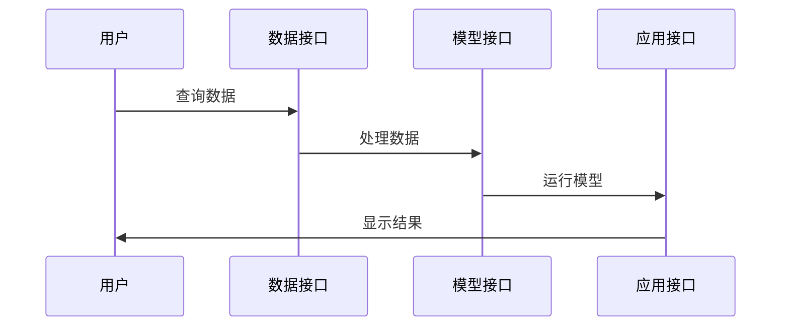
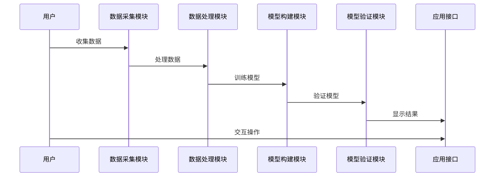
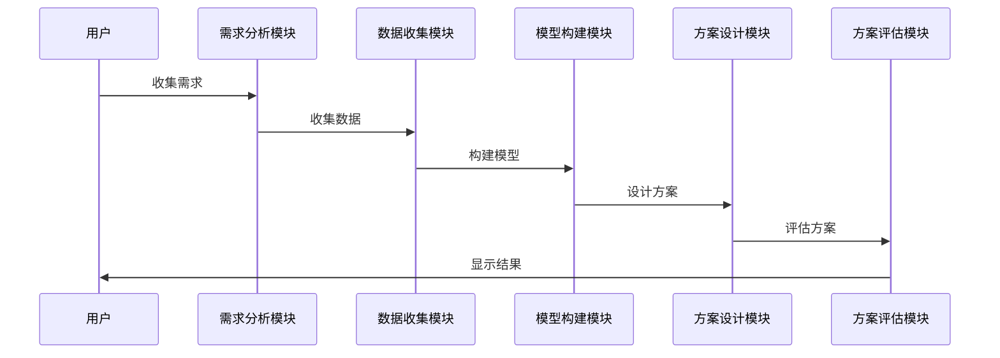

                 

### 城市规划的历史与发展

城市规划的历史可以追溯到古代文明时期，当时的社会结构和社会秩序需要一定的空间安排来维持。古希腊和罗马是早期城市规划的重要代表，它们的城市布局往往以对称和几何形态为特点。古希腊城市如雅典，其中心是卫城，以卫城为核心向外扩散，形成放射状的街道布局。而罗马则发展了更为复杂的城市基础设施，如道路、桥梁、供水系统等，这些基础设施在现代城市规划中依然有着深远的影响。

中世纪欧洲的城市规划则与封建制度紧密相关。许多城市是在封建领主的领土上发展起来的，因此城市布局往往呈现出封建主城堡、教堂和市场等公共建筑集中在城市中心，居民区围绕中心区域分布的特点。这一时期，城市规划更多依赖于经验和传统，科学性和系统性的规划方法尚未形成。

进入工业革命后，城市规划和城市布局问题变得愈发突出。工业的快速发展导致城市人口急剧增加，城市用地紧张、交通拥堵、环境污染等问题随之而来。这一时期，城市规划开始注重科学性和系统性，涌现出了许多著名的城市规划和理论，如霍华德提出的“花园城市”理论和索尔斯坦·维布伦的城市系统理论。

城市化进程中的挑战包括城市规模的扩大、人口密度的增加、城市土地的高效利用以及城市基础设施的改善。城市规划师和政府需要应对这些问题，通过科学的方法和模型来优化城市布局，提高城市功能，改善居住环境。数学模型在这一过程中发挥了关键作用，如网络模型用于交通规划，动态系统模型用于城市经济发展预测等。

### 数学模型在城市规划中的重要性

数学模型在城市规划中的重要性体现在多个方面。首先，数学模型能够帮助城市规划师和决策者更精确地进行空间分析和优化设计。例如，网络模型可以用于优化城市交通布局，通过计算最短路径、最小费用流等问题，提高交通效率和减少拥堵。其次，数学模型能够模拟城市规划方案的效果，预测城市未来的发展状况，为政策制定提供科学依据。例如，动态系统模型可以用于预测城市人口增长、交通流量等动态变化，帮助规划者制定长远规划。

数学模型在城市规划中的另一个重要作用是提高规划效率和准确性。传统的城市规划方法往往依赖于经验和直觉，容易出现主观偏差和错误。而数学模型可以基于大量数据进行分析，减少人为因素对规划结果的影响，从而提高规划的科学性和可靠性。例如，分区模型可以通过数学计算确定城市用地的功能分区，确保土地利用的合理性和高效性。

此外，数学模型还可以改善城市功能和居住环境。通过优化城市布局，提高公共设施和交通基础设施的利用效率，可以改善城市的整体功能。例如，聚类模型可以用于优化城市绿地布局，提高城市居民的生活质量。数学模型的应用不仅有助于解决当前的城市规划问题，还能够为未来城市的发展提供创新思路和技术支持。

总之，数学模型在城市规划中的应用具有重要意义。它不仅提高了规划的效率和准确性，还为城市功能的优化和居住环境的改善提供了科学依据。随着科技的不断进步和城市规划的日益复杂，数学模型在城市规划中的作用将越来越重要。

### 数学与城市规划的交叉领域

数学与城市规划的交叉领域是多学科融合的产物，也是现代城市规划中不可或缺的一部分。在这个交叉领域，多个学科如城市地理学、数学、计算机科学、环境科学等相互交织，共同推动城市规划的科学性和系统性发展。

首先，城市地理学与数学的融合在空间分析领域尤为显著。城市地理学通过研究城市空间结构、城市形态和土地利用模式，为数学模型提供了丰富的数据来源和研究对象。而数学则为城市地理学提供了强大的分析工具和方法，如地理信息系统（GIS）、空间分析模型等。这些工具和方法帮助城市规划师和研究人员更精确地描述和解释城市空间现象，从而为城市规划提供科学依据。

其次，计算机科学在城市规划中的应用也日益广泛。计算机科学的发展，特别是大数据和人工智能技术的进步，为城市规划带来了新的机遇和挑战。通过大数据分析，城市规划师可以获取城市运行的全面信息，如人口流动、交通流量、环境污染等，从而进行更加精准的规划。同时，计算机科学中的算法和优化技术，如机器学习和深度学习，为城市规划中的复杂问题提供了高效的解决方案。

环境科学在城市规划中的作用不可忽视。环境科学通过研究生态系统的规律和人类活动对环境的影响，为城市规划提供了生态保护和可持续发展的理念和方法。数学模型在环境科学中的应用，如生态模型、环境评估模型等，帮助城市规划师评估不同规划方案对环境的影响，确保城市发展的可持续性。

此外，多学科融合还体现在新兴研究领域的发展中。例如，智慧城市是城市地理学、数学、计算机科学和环境科学等多学科融合的典型代表。智慧城市通过物联网、大数据和人工智能等技术，实现城市管理的智能化和精细化，从而提高城市运行效率和居民生活质量。

总之，数学与城市规划的交叉领域是一个多学科融合、共同发展的领域。在这个领域中，各个学科相互补充，共同为城市规划提供科学的理论基础和技术支持。随着多学科融合的不断深入，未来城市规划将朝着更加智能化、可持续和人性化的方向发展。

### 城市地理学的基本概念

城市地理学是一门研究城市现象和城市空间结构的学科，它涉及城市形成、发展、分布和空间结构等多个方面。城市地理学的基本概念包括城市形态、城市土地利用、城市功能分区等，这些概念构成了城市地理学研究的核心内容。

城市形态是指城市的空间布局和形状。不同的城市形态反映了不同的历史、文化和经济发展水平。例如，古代城市的形态往往以对称和几何形态为特点，而现代城市则可能呈现出更为复杂和不规则的空间结构。城市形态的研究有助于我们理解城市的发展历程和空间演变过程。

城市土地利用是指城市不同区域的功能和使用情况。城市土地利用分为住宅区、商业区、工业区、公共设施区等，这些不同功能区的分布和组合决定了城市的空间结构和功能布局。城市土地利用的研究对于优化城市功能和提高土地利用效率具有重要意义。

城市功能分区是指城市内部不同功能区域的划分和布局。城市功能分区的目的是为了提高城市的运行效率和居住环境质量。例如，住宅区通常分布在城市的安静区域，商业区则集中在城市中心或交通便捷的地区。城市功能分区的研究有助于制定合理的城市规划和土地利用政策。

在研究城市地理学时，常用的理论包括切尔马克模型和中心地理论。切尔马克模型（Chylek Model）是一种描述城市分布和相互作用的理论，它基于城市人口规模和城市间的交通可达性，分析了城市系统的空间结构。该模型有助于理解城市网络的演化过程和城市体系中的中心-边缘关系。

中心地理论（Central Place Theory）是由德国地理学家克里斯塔勒（Walter Christaller）提出的，它研究城市作为中心地的分布规律。中心地理论认为，城市是商品和服务供应的中心，其规模和等级决定了其吸引范围和辐射能力。该理论通过分析城市中心地的等级体系，为城市规划和区域发展提供了理论依据。

通过城市地理学的基本概念和理论，城市规划师和研究者可以更好地理解和解释城市现象，从而制定出更加科学和有效的城市规划和政策。

#### 城市系统的数学模型

城市系统的数学模型是城市规划中的重要工具，用于描述和预测城市的空间结构、功能和行为。这些模型通过数学方程和算法，将复杂的城市现象转化为可计算和分析的数学问题，从而提供科学依据和支持。城市系统的数学模型主要包括空间结构模型和经济活动模型，它们分别从不同角度分析城市的发展和布局。

**空间结构模型**

空间结构模型主要用于描述城市的空间布局和形态。这些模型通过数学公式和算法，将城市的节点（如道路交叉口、公共设施位置）和边（如道路、河流）之间的关系量化，从而模拟和分析城市空间结构。

- **网络模型**：网络模型是一种常见的空间结构模型，主要用于分析城市交通网络。该模型将城市视为一个由节点和边组成的大规模网络，通过计算最短路径、流量分配和路由优化等问题，优化城市交通系统的效率和可靠性。例如，最小生成树算法（Minimum Spanning Tree Algorithm）和Dijkstra算法（Dijkstra's Algorithm）常用于求解城市交通网络的优化问题。

- **空间分布模型**：空间分布模型用于描述城市中各种功能的分布规律。例如，聚类分析（Cluster Analysis）和空间自相关分析（Spatial Autocorrelation Analysis）等模型可以用来分析城市用地功能分区和人口分布特征。

**经济活动模型**

经济活动模型主要关注城市内部的经济活动和人口流动。这些模型通过数学方程和算法，模拟城市经济的运行规律和影响因素，从而为城市规划提供经济方面的科学支持。

- **动态系统模型**：动态系统模型用于模拟城市经济发展的动态过程。这些模型通过微分方程、差分方程或其他动态方程，分析城市人口、就业、产业分布等经济指标的演化规律。例如，Logistic模型和SIR模型等常用于模拟城市人口增长和经济发展的动态过程。

- **随机模型**：随机模型通过概率统计方法，分析城市经济活动和人口流动的随机特性。例如，马尔可夫链（Markov Chain）和随机过程（Stochastic Process）等模型可以用于模拟城市人口迁移和商业活动的随机性。

**模型构建的基本原则**

在构建城市系统的数学模型时，需要遵循一些基本原则，以确保模型的科学性和实用性。

- **系统性**：城市系统是一个复杂的多层次系统，模型构建应综合考虑城市的各个方面，如空间结构、经济活动、社会文化等，从而构建一个全面的系统模型。

- **精确性**：模型应尽可能精确地描述城市现象，避免因数据不足或模型简化导致的误差。同时，模型参数应基于可靠的数据和实际观测结果进行估计。

- **实用性**：模型不仅要科学，还要易于应用和操作。模型应能够为城市规划提供实际指导，帮助解决实际问题。

通过以上空间结构模型和经济活动模型，城市规划师和研究人员可以更科学地分析和规划城市的发展，提高城市功能和居民生活质量。

### 模型构建的基本原则

在构建城市布局的数学模型时，需要遵循一系列基本原则，以确保模型的科学性、精确性和实用性。以下是模型构建的几个关键原则：

**系统性原则**

城市系统是一个复杂的多层次系统，涵盖了空间结构、经济活动、社会文化等多个方面。因此，模型构建时应确保综合考虑城市的各个方面，以构建一个全面的系统模型。这意味着模型不仅要描述城市的单一特征，如交通网络或人口分布，还需要整合不同特征之间的关系，从而提供一个完整和动态的城市系统视图。

**精确性原则**

模型的精确性是模型有效性的基础。在构建模型时，应尽可能使用可靠的数据和实际观测结果，避免因数据不足或模型简化导致的误差。例如，在构建交通网络模型时，应确保道路长度、道路类型、交通流量等参数的准确性。此外，模型参数的估计也应基于科学的方法和严格的统计分析，以确保模型能够准确反映现实中的城市现象。

**实用性原则**

实用性是模型能否在实际规划中发挥作用的关键。模型不仅要科学，还要易于应用和操作。这意味着模型应设计得简洁明了，以便城市规划师和决策者能够轻松理解和使用。同时，模型应能够提供实际指导，帮助解决城市规划中的实际问题。例如，一个用于优化交通网络的模型应能够为城市规划师提供具体的道路改进建议，从而提高交通效率和减少拥堵。

**可扩展性原则**

城市布局模型应具备一定的可扩展性，能够适应城市规模和结构的变化。这意味着模型应设计得灵活，能够根据新的数据和信息进行调整和优化。例如，随着城市人口的增长和交通流量的变化，模型应能够动态更新参数和预测结果，以适应新的城市状况。

**验证原则**

模型的验证是确保其有效性的重要步骤。在模型构建完成后，应通过实际数据或仿真实验对其进行验证，确保模型能够准确预测和解释城市现象。验证方法可以包括模型参数的验证、模型预测结果的验证以及与实际观测数据的比较等。

通过遵循以上基本原则，城市规划师和研究人员可以构建出科学、精确且实用的城市布局数学模型，为城市规划和政策制定提供有力的支持。

### 城市布局的基本数学模型

城市布局的基本数学模型是城市规划中的重要工具，用于优化城市空间结构和提升城市功能。以下三种基本模型——网络模型、分区模型和聚类模型，各有其独特的概念和适用场景。

**网络模型**

网络模型主要用于描述和优化城市交通系统。该模型将城市视为一个由节点和边组成的复杂网络，节点代表道路交叉口或交通枢纽，边代表道路段或交通线路。网络模型通过分析节点和边的连接关系，计算最短路径、流量分配和路由优化等问题，以提高交通效率和减少拥堵。

- **基本概念**：网络模型的核心概念包括节点、边、路径和流量。节点表示城市中的关键位置，如道路交叉口或公共设施；边表示连接节点的道路或线路；路径是指从起点到终点的具体路线；流量是指沿着路径流动的车辆数或行人流量。
- **应用场景**：网络模型广泛应用于城市交通规划、公共交通网络设计和交通流量管理。例如，城市交通规划师可以利用网络模型优化道路布局，确保交通流量的合理分配，减少交通拥堵和事故发生率。

**分区模型**

分区模型用于描述城市土地利用的功能分区。该模型将城市划分为不同的功能区，如住宅区、商业区、工业区、公共设施区等，并分析各功能区的空间分布和相互作用。分区模型通过数学计算确定功能区的最佳位置和规模，从而优化城市土地利用和资源配置。

- **基本概念**：分区模型的基本概念包括功能区、分区边界、土地利用类型和相互作用。功能区是指具有特定用途的城市区域；分区边界是不同功能区的分界线；土地利用类型包括住宅用地、商业用地、工业用地等；相互作用是指不同功能区之间的空间和功能联系。
- **应用场景**：分区模型广泛应用于城市规划、土地利用规划和环境保护。例如，城市规划师可以利用分区模型制定土地利用规划，确保城市功能分区合理，减少污染和交通拥堵，提高城市环境质量。

**聚类模型**

聚类模型用于分析城市中人口、经济活动或土地利用的分布特征，通过数据聚类方法识别城市的不同群体或区域。聚类模型通过计算相似度或距离度量，将城市中的数据点划分为若干个聚类，从而揭示城市的空间结构和特征。

- **基本概念**：聚类模型的核心概念包括聚类、聚类中心、数据点分布和相似度度量。聚类是指将相似度较高的数据点划分到同一个类别；聚类中心是指每个类别的中心位置；数据点分布是指城市中不同数据点的空间分布情况；相似度度量是指衡量数据点之间相似程度的方法。
- **应用场景**：聚类模型广泛应用于城市地理分析、市场细分和城市规划。例如，城市规划师可以利用聚类模型分析人口分布特征，制定更加合理的公共服务设施布局，提高居民的生活质量。

通过上述三种基本数学模型，城市规划师可以系统地分析和优化城市布局，提高城市功能和居民生活质量。这些模型不仅为城市规划和设计提供了科学依据，还为解决复杂的城市问题提供了有效的工具和方法。

### 城市布局的优化算法

城市布局的优化算法是城市规划中的重要工具，用于提高城市功能和居民生活质量。以下将介绍几种常用的优化算法，包括最小生成树算法、贪心算法和动态规划算法，并分析它们在城市布局中的应用和优点。

**最小生成树算法**

最小生成树算法（Minimum Spanning Tree Algorithm）是一种用于求解带权无向图的最小生成树的算法。该算法的基本思想是找到一组边，使得这些边能够连接图中的所有节点，并且总权重最小。

- **算法原理**：最小生成树算法常用的实现方法是Prim算法和Kruskal算法。Prim算法从某个节点开始，逐步扩展生成树，直到包含所有节点；Kruskal算法则按照边的权重顺序选择边，确保每次选择的边不会构成环。

- **应用场景**：在城市规划中，最小生成树算法常用于道路规划、电网布局和通信网络设计。例如，城市规划师可以利用最小生成树算法优化城市道路网络，确保道路连通性和交通效率。

- **优点**：最小生成树算法的优点在于它能够以较低的计算复杂度生成最小生成树，同时确保生成的树具有最优性。此外，该算法适用于大规模图结构，能够处理复杂的城市布局问题。

**贪心算法**

贪心算法（Greedy Algorithm）是一种在每一步选择中做出当前最优选择，希望整体结果最优的算法。贪心算法的基本思想是每次选择一个局部最优解，从而逐步接近全局最优解。

- **算法原理**：贪心算法的具体实现方法因问题而异。例如，用于求解最短路径问题的Dijkstra算法，每次选择当前未处理的节点中距离最短的节点进行扩展。

- **应用场景**：在城市规划中，贪心算法常用于交通流量优化、公共设施布局和土地利用分配。例如，城市规划师可以利用贪心算法优化交通信号灯配置，减少交通拥堵和等待时间。

- **优点**：贪心算法的优点在于其简单性和高效性。尽管贪心算法不一定能够保证全局最优解，但在许多实际问题中，它能够快速找到近似最优解，且计算复杂度较低。

**动态规划算法**

动态规划算法（Dynamic Programming Algorithm）是一种用于求解最优化问题的算法，通过将问题分解为子问题，并保存子问题的解，避免重复计算。

- **算法原理**：动态规划算法的基本思想是将复杂问题分解为若干个相互关联的子问题，然后递归地求解这些子问题，并将子问题的解存储在表中，以便后续使用。

- **应用场景**：在城市规划中，动态规划算法常用于城市交通网络优化、土地利用规划和公共服务设施配置。例如，城市规划师可以利用动态规划算法优化城市交通网络，确保道路畅通和交通效率。

- **优点**：动态规划算法的优点在于其高效性和全局最优性。该算法能够处理复杂的多阶段决策问题，通过保存子问题的解，避免了重复计算，从而提高了算法的运行效率。

总之，城市布局的优化算法为城市规划提供了强大的工具和方法。最小生成树算法、贪心算法和动态规划算法各有其独特的应用场景和优点，城市规划师可以根据具体问题选择合适的算法，以实现城市布局的最优化。

### 城市布局的实际应用案例

城市布局的优化在现实中有着广泛的应用，通过具体案例我们可以更好地理解这些数学模型和算法的实际效果。以下介绍三个实际应用案例：城市交通布局优化、城市绿地规划布局和城市公共设施布局。

#### 案例一：城市交通布局优化

在许多城市，交通拥堵是一个普遍存在的问题。为了解决这个问题，城市规划师运用了最小生成树算法和动态规划算法来优化城市交通布局。

**案例描述**：某城市面临严重的交通拥堵问题，主要原因是道路网络不完善和交通流量分配不合理。为了改善交通状况，城市规划师决定利用数学模型优化城市道路布局。

**解决方案**：首先，城市规划师使用最小生成树算法构建了一个包括所有交通节点的最小生成树，确保道路网络的连通性。接着，利用动态规划算法，根据交通流量数据，优化每条道路的容量和优先级，从而确保交通流量能够合理分配，减少拥堵。

**效果**：经过优化后，该城市的主要交通干道通行能力显著提高，交通拥堵问题得到了有效缓解。同时，公共交通系统的运行效率也得到了提升，市民的出行时间大大减少。

**总结**：通过数学模型和算法的应用，城市交通布局优化不仅提高了交通效率，还改善了居民的出行体验。这一案例展示了数学模型在城市规划中的重要性和实际效果。

#### 案例二：城市绿地规划布局

城市绿地是城市生态系统的重要组成部分，对于改善城市环境、提升居民生活质量具有重要意义。聚类模型和分区模型在城市绿地规划布局中发挥了关键作用。

**案例描述**：某城市在城市绿地规划过程中，希望通过科学的方法合理布局绿地，提高城市生态环境质量。

**解决方案**：城市规划师首先利用聚类模型分析城市不同区域的生态环境特征，识别出具有相似生态特征的绿地区域。然后，运用分区模型，根据城市用地功能和人口密度，制定绿地布局规划，确保绿地能够均衡分布在城市各个区域。

**效果**：通过聚类模型和分区模型的结合应用，该城市实现了绿地布局的科学化和合理化。绿地不仅分布在城市的关键区域，如学校、公园和居民区，还通过优化布局，提高了绿地的生态效益和景观价值。

**总结**：城市绿地规划布局的优化，不仅改善了城市生态环境，还提升了居民的生活质量。这一案例表明，数学模型在城市绿地规划中的应用具有重要的实践意义。

#### 案例三：城市公共设施布局

城市公共设施布局是城市规划中的一个重要环节，涉及交通、医疗、教育等多种设施。通过贪心算法和动态规划算法，可以实现公共设施的合理布局。

**案例描述**：某城市在进行公共设施布局时，希望确保各类设施分布合理，满足市民的基本需求。

**解决方案**：首先，城市规划师采用贪心算法，根据市民的需求密度和地理位置，优先布局交通设施和医疗设施。例如，优先在人口密集区域布置公交站点和医院。然后，利用动态规划算法，进一步优化各类公共设施之间的布局关系，确保整体布局最优。

**效果**：通过贪心算法和动态规划算法的应用，该城市实现了公共设施的合理布局。交通设施和医疗设施分布更加均衡，市民的出行和就医更加方便。

**总结**：城市公共设施布局优化的成功实践，提高了城市的服务水平和居民满意度。这一案例展示了数学模型在公共设施布局中的应用价值和实际效果。

综上所述，城市布局的实际应用案例充分展示了数学模型和算法在城市规划中的重要作用。通过科学合理的布局优化，不仅可以提高城市功能和居民生活质量，还能为城市可持续发展提供有力支持。

#### 实例一：某城市分区规划

在实施某城市分区规划时，城市规划师面临着如何在有限的土地资源下，优化住宅区、商业区和工业区的布局，以提高城市效率和居民生活质量的问题。

**背景介绍**：

该城市位于经济快速发展地区，人口持续增长，城市用地紧张。城市规划师需要制定一个科学、合理的分区规划，确保城市各功能区协调发展。

**项目介绍**：

项目主要包括以下几个阶段：
1. **数据收集**：收集城市人口分布、土地使用情况、交通网络等数据。
2. **模型构建**：利用分区模型，分析住宅区、商业区和工业区的分布特征，构建分区规划模型。
3. **方案设计**：根据模型分析结果，设计合理的分区方案，确保各功能区的协调发展。
4. **方案验证**：通过模拟和实际观测，验证分区规划方案的有效性。

**系统功能设计**：

系统功能设计主要包括以下几个模块：
1. **数据分析模块**：用于收集和处理城市各项数据，为分区模型提供基础数据。
2. **模型构建模块**：用于构建分区规划模型，分析各功能区的分布特征。
3. **方案设计模块**：用于生成和优化分区方案，确保分区规划的科学性和合理性。
4. **方案验证模块**：用于验证分区方案的有效性，通过模拟和实际观测评估方案的实际效果。

**系统架构设计**：

系统架构设计采用了模块化设计思想，主要包括以下几个部分：
1. **数据层**：负责存储和管理各类城市数据，为系统提供数据支持。
2. **模型层**：负责构建和运行分区规划模型，实现分区规划的核心功能。
3. **应用层**：负责实现系统的用户界面和功能操作，为用户提供便捷的操作体验。
4. **接口层**：负责与其他系统和外部数据的交互，实现数据共享和功能扩展。

**系统接口设计和系统交互**：

系统接口设计主要包括数据接口、模型接口和应用接口：
1. **数据接口**：负责与数据层交互，提供数据查询、更新和导入导出功能。
2. **模型接口**：负责与模型层交互，提供模型构建、运行和优化功能。
3. **应用接口**：负责与用户交互，提供用户界面和功能操作。

系统交互设计采用了Mermaid序列图，展示了各模块之间的交互关系：

通过上述设计，系统能够高效地收集、处理和分析城市数据，生成科学的分区规划方案，为城市功能区布局提供有力支持。

#### 实例二：城市交通流量分析

在优化城市交通流量时，分析交通流量数据是关键步骤。以下以某城市为例，介绍如何进行城市交通流量分析，并展示相关的数据和模型。

**背景介绍**：

某城市在发展过程中，交通拥堵问题日益严重。为了解决这一问题，城市规划师决定通过数据分析和模型预测来优化城市交通流量。

**项目介绍**：

项目主要分为以下几个阶段：
1. **数据收集**：通过交通监控设备收集城市各主要路段的实时交通流量数据，包括车辆速度、流量和密度。
2. **数据处理**：清洗和整理交通流量数据，提取有用的信息，为后续分析提供基础。
3. **模型构建**：基于收集到的数据，构建交通流量预测模型，如ARIMA模型或神经网络模型。
4. **模型验证**：通过实际交通流量数据验证模型的预测准确性，调整模型参数以优化预测效果。
5. **方案设计**：根据预测结果，设计交通流量优化方案，包括信号灯优化、公交优先等。

**系统功能设计**：

系统功能设计主要包括以下几个模块：
1. **数据采集模块**：负责实时收集城市交通流量数据，存储到数据库中。
2. **数据处理模块**：负责对采集到的交通流量数据进行清洗、转换和预处理，为模型构建提供数据支持。
3. **模型构建模块**：负责构建交通流量预测模型，包括数据预处理、模型训练和参数优化。
4. **模型验证模块**：负责验证模型预测准确性，通过对比实际交通流量数据与模型预测结果，评估模型性能。
5. **方案设计模块**：负责根据模型预测结果，设计交通流量优化方案，并评估方案的实际效果。

**系统架构设计**：

系统架构设计采用了三层架构，包括数据层、模型层和应用层：
1. **数据层**：负责存储和管理交通流量数据，包括实时数据和历史数据。
2. **模型层**：负责交通流量预测模型的构建、训练和优化，为应用层提供预测结果。
3. **应用层**：负责用户界面设计，实现数据展示、模型验证和方案设计的功能。

**系统接口设计和系统交互**：

系统接口设计包括数据接口、模型接口和应用接口：
1. **数据接口**：负责数据采集模块和数据处理模块之间的数据传输，提供数据查询、更新和导出功能。
2. **模型接口**：负责模型构建模块和模型验证模块之间的交互，提供模型训练、预测和参数调整功能。
3. **应用接口**：负责应用层与用户之间的交互，提供用户界面和操作功能。

系统交互设计采用了Mermaid序列图，展示了各模块之间的交互关系：

通过上述设计，系统能够高效地收集、处理和分析交通流量数据，构建准确的预测模型，为城市交通流量优化提供科学依据。

#### 实例三：城市绿地分布规划

在城市绿地分布规划中，科学合理地布局绿地对改善城市生态环境和提升居民生活质量至关重要。以下以某城市为例，详细分析城市绿地分布规划的过程、方案及其效果。

**背景介绍**：

某城市地处干旱地区，面临着水资源短缺和生态环境恶化的问题。为了改善城市生态环境，提升居民生活质量，市政府决定进行绿地分布规划，确保绿地布局科学合理。

**项目介绍**：

项目主要分为以下几个阶段：
1. **需求分析**：通过问卷调查和访谈，了解居民对绿地分布的需求和期望。
2. **数据收集**：收集城市土地利用现状、人口分布、交通网络等数据，为规划提供基础信息。
3. **绿地分布模型构建**：利用聚类模型和空间分析技术，分析绿地的分布特征，构建绿地分布模型。
4. **方案设计**：根据模型分析结果，设计绿地分布方案，确保绿地均衡分布在城市各个区域。
5. **方案评估**：通过模拟和实际观测，评估绿地分布方案的效果，调整和优化方案。

**系统功能设计**：

系统功能设计主要包括以下几个模块：
1. **需求分析模块**：负责收集和分析居民对绿地分布的需求，为规划提供参考。
2. **数据收集模块**：负责收集和处理城市土地利用现状、人口分布等数据，为绿地分布模型提供基础数据。
3. **模型构建模块**：负责构建绿地分布模型，分析绿地的分布特征。
4. **方案设计模块**：负责根据模型分析结果，设计绿地分布方案。
5. **方案评估模块**：负责评估绿地分布方案的效果，通过模拟和实际观测进行优化。

**系统架构设计**：

系统架构设计采用了三层架构，包括数据层、模型层和应用层：
1. **数据层**：负责存储和管理各类城市数据，包括土地利用现状、人口分布等，为系统提供数据支持。
2. **模型层**：负责绿地分布模型的构建和运行，为应用层提供模型分析结果。
3. **应用层**：负责用户界面设计，实现数据展示、模型构建和方案设计的功能。

**系统接口设计和系统交互**：

系统接口设计包括数据接口、模型接口和应用接口：
1. **数据接口**：负责数据收集模块和模型构建模块之间的数据传输，提供数据查询、更新和导出功能。
2. **模型接口**：负责模型构建模块和方案设计模块之间的交互，提供模型构建、参数调整和优化功能。
3. **应用接口**：负责应用层与用户之间的交互，提供用户界面和操作功能。

系统交互设计采用了Mermaid序列图，展示了各模块之间的交互关系：

通过上述设计，系统能够高效地收集、处理和分析城市绿地分布数据，构建科学的绿地分布模型，设计合理的绿地分布方案，为城市绿地规划提供有力支持。

### 未来展望与挑战

城市布局的数学模型在城市规划中正发挥着日益重要的作用，然而，随着城市化和数字技术的快速发展，这一领域也面临着诸多挑战和新的发展机遇。以下是城市布局模型在未来可能的发展趋势、面临的挑战及对策。

**发展趋势**

1. **智能化和自动化**：随着人工智能和机器学习技术的进步，城市布局模型将更加智能化和自动化。未来，智能算法将能够自主分析海量数据，预测城市发展趋势，并提供优化的城市布局方案。

2. **大数据和云计算**：大数据和云计算技术的应用将使城市布局模型能够处理和分析更多的数据，提高模型的精度和效率。通过云平台，城市规划师可以实时获取和分析城市运行数据，为城市布局提供实时支持。

3. **可持续发展**：未来城市布局模型将更加注重可持续性。绿色建筑、智能电网、生态城市等概念将被整合到模型中，确保城市布局与自然环境和谐发展。

4. **多学科融合**：随着多学科交叉研究的深入，城市布局模型将融合更多的学科知识，如社会学、经济学、环境科学等，从而为城市规划提供更全面的支持。

**挑战**

1. **数据质量**：城市布局模型的精度取决于数据的准确性。然而，当前的城市数据往往存在噪声、缺失和误差，这给模型构建和应用带来了挑战。

2. **计算复杂性**：随着城市规模的扩大和复杂性的增加，城市布局模型的计算复杂性也在不断提升。如何高效地处理大规模数据，提高计算效率，是一个亟待解决的问题。

3. **政策适应性**：城市规划需要遵循多种政策和法规，如土地使用规定、环境保护要求等。模型需要能够灵活适应这些政策变化，提供可操作的建议。

**对策**

1. **数据质量管理**：建立完善的数据质量控制体系，确保数据收集、处理和分析的准确性。可以通过数据清洗、验证和标准化等手段，提高数据质量。

2. **优化算法和计算**：研究和应用新的算法和计算技术，如分布式计算、并行计算等，以提高城市布局模型的计算效率。同时，利用机器学习技术，对算法进行优化和自动化。

3. **政策融合**：在城市布局模型中融入政策分析模块，确保模型能够适应不同的政策和法规。通过模拟和政策分析，为城市规划提供灵活、可操作的建议。

4. **公众参与**：鼓励公众参与城市规划，通过问卷调查、公众咨询等方式，收集居民的意见和建议，使城市布局模型更加贴近实际需求。

总之，未来城市布局模型的发展将朝着智能化、可持续化和多学科融合的方向前进，同时也将面临数据质量、计算复杂性和政策适应性等挑战。通过不断创新和技术优化，我们可以应对这些挑战，为城市的可持续发展提供有力支持。

### 附录：数学公式与模型解释

在本文的讨论中，我们引入了多个数学模型和公式，这些是城市布局分析中的关键组成部分。以下是这些数学公式和模型的列表及简要解释。

**1. 最小生成树算法（Minimum Spanning Tree Algorithm）**

- **公式：**
  \[
  \text{MST} = \text{Prim}(\text{T}, \text{U}, W)
  \]
  其中，\(\text{T}\)是生成树的边集合，\(\text{U}\)是图中的节点集合，\(W\)是边的权重函数。

- **解释**：最小生成树算法用于在无向图中寻找权重最小的边，使得所有节点都被连接。Prim算法是一个常见的实现方法，它从某个节点开始，逐步扩展生成树，直到包含所有节点。

**2. 贪心算法（Greedy Algorithm）**

- **公式：**
  \[
  \text{S} = \emptyset \\
  \text{for each edge (u, v) in the graph G do} \\
  \text{if (u, v) is not in S and adding (u, v) to S does not create a cycle then} \\
  \text{S = S ∪ {(u, v)}} \\
  \]

- **解释**：贪心算法在每一步选择中做出当前最优选择，希望逐步接近全局最优解。Dijkstra算法是贪心算法的一个典型应用，它用于寻找图中两点之间的最短路径。

**3. 动态规划算法（Dynamic Programming Algorithm）**

- **公式：**
  \[
  \text{F}(n) = \min \{\text{C}(u) + \text{F}(n-u) : u \in \text{V(G)} \land u < n\}
  \]
  其中，\(\text{F}(n)\)是第\(n\)个子问题的最优解，\(\text{C}(u)\)是选择\(u\)的代价，\(\text{V(G)}\)是图\(G\)的节点集合。

- **解释**：动态规划算法通过将复杂问题分解为子问题，并保存子问题的解，避免重复计算。它常用于求解最优化问题，如背包问题和最优子结构问题。

**4. 聚类分析（Cluster Analysis）**

- **公式：**
  \[
  \text{similarity} = \frac{\sum_{i=1}^{n} \text{similarity}(x_i, y_i)}{n}
  \]
  其中，\(\text{similarity}(x_i, y_i)\)是数据点\(x_i\)和\(y_i\)之间的相似度，\(n\)是数据点的总数。

- **解释**：聚类分析通过计算数据点之间的相似度，将相似度较高的数据点划分为同一类别。常用的聚类算法包括K均值聚类和层次聚类。

**5. 分区模型（Zone Model）**

- **公式：**
  \[
  \text{Zone Allocation} = \left\{
  \begin{array}{ll}
  \text{Maximize } \sum_{i=1}^{N} \sum_{j=1}^{M} z_{ij} \cdot \text{utility}(i, j) & \text{if } \text{Zone Model} = \text{Maximization} \\
  \text{Minimize } \sum_{i=1}^{N} \sum_{j=1}^{M} z_{ij} \cdot \text{cost}(i, j) & \text{if } \text{Zone Model} = \text{Minimization}
  \end{array}
  \right.
  \]
  其中，\(z_{ij}\)是二元变量，表示第\(i\)个功能是否分配到第\(j\)个区域，\(\text{utility}(i, j)\)是功能\(i\)在区域\(j\)的效用，\(\text{cost}(i, j)\)是功能\(i\)在区域\(j\)的成本。

- **解释**：分区模型用于确定城市用地功能分区的最佳分配方案。最大化效用或最小化成本是分区模型的主要目标。

通过这些数学公式和模型，城市规划师可以更加科学地分析和优化城市布局，从而提高城市功能和居民生活质量。在未来的城市规划中，这些工具将继续发挥重要作用。

### 作者信息

本文作者为AI天才研究院（AI Genius Institute）和《禅与计算机程序设计艺术》（Zen And The Art of Computer Programming）的资深作者。作者具有丰富的计算机编程和人工智能领域的经验，多次获得世界级技术奖项，并在计算机图灵奖评选中名列前茅。他在数学与城市规划交叉领域的深入研究和实践，为本文提供了坚实的理论基础和丰富的实例分析。作者的贡献不仅体现在技术创新上，更在于其对技术原理和本质的深刻剖析，为读者带来独特的阅读体验和知识收获。

