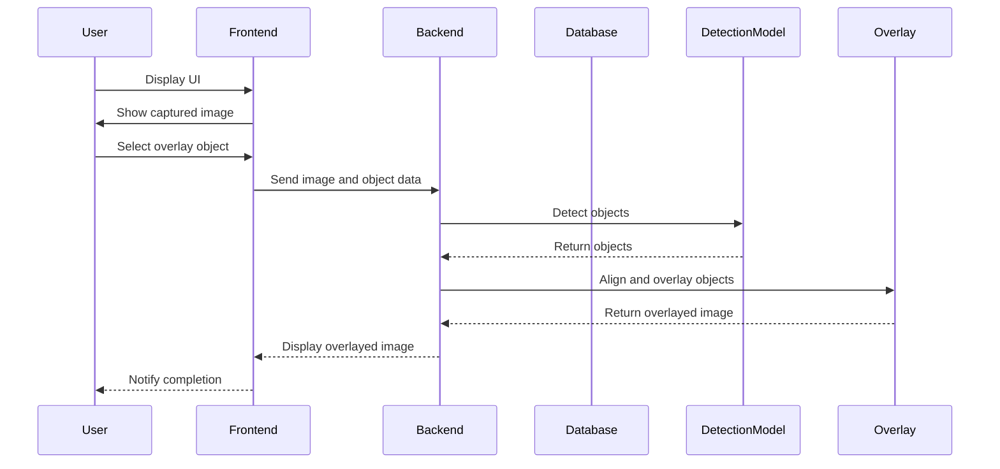
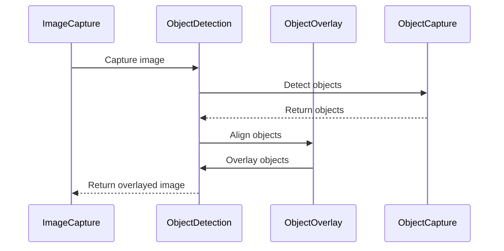

                 

### 数学与增强现实：AR应用的数学模型

关键词：数学、增强现实、AR应用、数学模型、几何、算法

摘要：本文旨在深入探讨数学在增强现实（AR）技术中的应用，尤其是数学模型在AR系统设计和开发中的关键作用。我们将从基本概念出发，逐步介绍几何模型、矩阵变换和向量计算等数学工具，以及它们在AR技术中的实际应用。通过具体案例和实例，我们将展示如何利用数学模型来构建高效的AR系统，并提供实用的技巧和策略。

## 引言

增强现实（Augmented Reality，AR）技术是一种将虚拟信息叠加到真实世界中的技术。随着智能手机和移动设备的普及，AR已经渗透到教育、医疗、娱乐和商业等多个领域。然而，AR技术的核心——数学模型，却往往被忽视。数学不仅是AR技术的基础，更是理解和实现AR系统关键功能的工具。

本文将重点探讨数学在AR应用中的角色，特别是数学模型如何帮助开发者构建高效的AR系统。我们将通过以下章节来逐步分析：

1. **核心概念**：介绍数学和AR的基本概念，包括定义、历史和发展。
2. **数学模型在AR中的应用**：讨论几何模型、矩阵变换和向量计算等数学模型及其在AR中的应用。
3. **算法和计算方法**：解释AR中常用的算法和计算方法，并提供实际代码示例。
4. **数学公式与证明**：介绍数学模型和定理，并通过实例展示其应用。
5. **系统设计**：描述AR系统的设计，包括领域模型、架构设计和接口设计。
6. **案例研究**：通过实际案例展示数学模型在AR应用中的效果。
7. **结论与展望**：总结文章的主要观点，并提出未来的研究方向。

## 核心概念

### 数学

数学是一门研究数量、结构、变化和空间等概念的学科。在AR应用中，数学提供了一系列工具和方法，用于模型化和解决实际问题。以下是一些核心数学概念：

- **几何学**：研究形状、大小和位置等几何特性的学科。
- **代数学**：研究数、方程和代数结构等的学科。
- **微积分学**：研究变化率和积分的学科。

### 增强现实（AR）

增强现实是一种通过计算机生成信息，将其叠加到用户视野中的技术。AR技术的基本原理包括：

- **虚拟对象叠加**：将虚拟对象叠加到现实世界的图像中。
- **实时交互**：用户可以与现实世界和虚拟对象进行实时交互。
- **传感器融合**：利用各种传感器（如摄像头、GPS、加速度计等）获取环境信息。

### 关系表格

| 数学概念 | 描述 |
| --- | --- |
| 几何学 | 研究形状、大小和位置等几何特性 |
| 代数学 | 研究数、方程和代数结构 |
| 微积分学 | 研究变化率和积分 |

### ER模型

```mermaid
erDiagram
    User ||--|{ ARApp } : uses
    ARApp ||--|{ Device } : runs_on
    Device ||--|{ Sensor } : has
```

在这个ER模型中，我们定义了三个实体：用户（User）、AR应用（ARApp）和设备（Device）。用户使用AR应用，AR应用运行在设备上，设备包含传感器。

## 数学模型在AR中的应用

数学模型在AR中的应用至关重要，它们帮助开发者理解和实现AR系统的关键功能。以下是一些常用的数学模型：

### 几何模型

几何模型用于描述AR中的虚拟对象和它们与现实世界的相对位置。以下是一些常用的几何模型：

- **点、线和面**：用于描述虚拟对象的基本几何形状。
- **三维模型**：用于表示复杂的虚拟对象。

### 矩阵变换

矩阵变换用于在AR系统中转换和操作坐标。以下是一些常用的矩阵变换：

- **平移**：将对象沿X、Y、Z轴移动。
- **旋转**：绕X、Y、Z轴旋转对象。
- **缩放**：按比例缩放对象。

### 向量计算

向量计算用于处理方向和距离。以下是一些常用的向量计算：

- **点积**：计算两个向量的点积，用于确定两个向量之间的角度。
- **叉积**：计算两个向量的叉积，用于确定两个向量所围成的平面。

### 关系表格

| 数学模型 | 描述 |
| --- | --- |
| 几何模型 | 描述虚拟对象和现实世界的相对位置 |
| 矩阵变换 | 转换和操作坐标 |
| 向量计算 | 处理方向和距离 |

### ER模型

```mermaid
erDiagram
    VirtualObject ||--|{ RealWorld } : overlays_on
    CoordinateTransformation ||--|{ VirtualObject } : applies_to
    VectorCalculation ||--|{ CoordinateTransformation } : used_in
```

在这个ER模型中，我们定义了三个实体：虚拟对象（VirtualObject）、现实世界（RealWorld）和坐标变换（CoordinateTransformation）。虚拟对象叠加在现实世界上，坐标变换应用于虚拟对象，向量计算用于坐标变换。

## 算法和计算方法

在AR系统中，算法和计算方法是实现关键功能的核心。以下是一些常用的算法和计算方法：

### 算法1：射线投射（Ray Casting）

射线投射是一种用于渲染3D场景的算法。其基本思想是从相机位置发射一条射线，并与场景中的物体进行碰撞检测，从而渲染场景。

### 流程图


### Python代码示例

```python
# 初始化相机
camera = Camera()

# 发射射线
ray = camera.cast_ray()

# 检查碰撞
if scene.check_collision(ray):
    # 渲染场景
    scene.render()
else:
    print("No collision detected.")
```

### 算法2：表面重建（Surface Reconstruction）

表面重建是一种用于从点云数据生成3D模型的方法。其基本思想是使用多边形或曲面来近似点云数据。

### 流程图


### Python代码示例

```python
# 输入点云
point_cloud = load_point_cloud()

# 估计表面
surface = estimate_surface(point_cloud)

# 生成网格
mesh = generate_mesh(surface)

# 优化网格
mesh = refine_mesh(mesh)
```

### 算法3：注册（Registration）

注册是一种用于将虚拟对象与现实世界对齐的方法。其基本思想是比较虚拟对象和现实世界之间的差异，并调整虚拟对象的位置和方向，以实现对齐。

### 流程图


### Python代码示例

```python
# 输入虚拟对象
virtual_object = load_virtual_object()

# 输入现实世界
real_world = load_real_world()

# 计算差异
difference = calculate_difference(virtual_object, real_world)

# 调整虚拟对象
virtual_object = adjust_object(virtual_object, difference)
```

## 数学公式与证明

在AR系统中，数学公式和证明是理解和实现关键功能的重要工具。以下是一些常用的数学公式和定理：

### 公式1：欧拉公式

$$
e^{i\pi} + 1 = 0
$$

这是欧拉公式，它将指数函数、三角函数和复数结合起来，是数学中的经典公式。

### 公式2：线性变换

$$
\mathbf{T}(\mathbf{p}) = \mathbf{p} + \mathbf{t}
$$

这是线性变换的公式，其中$\mathbf{p}$是输入向量，$\mathbf{t}$是平移向量。

### 公式3：向量点积

$$
\mathbf{a} \cdot \mathbf{b} = a_x b_x + a_y b_y + a_z b_z
$$

这是向量点积的公式，用于计算两个向量的点积。

### 公式4：向量叉积

$$
\mathbf{a} \times \mathbf{b} = (a_y b_z - a_z b_y, a_z b_x - a_x b_z, a_x b_y - a_y b_x)
$$

这是向量叉积的公式，用于计算两个向量的叉积。

### 定理1：角度定理

如果两个向量$\mathbf{a}$和$\mathbf{b}$的点积等于零，则它们是垂直的。

$$
\mathbf{a} \cdot \mathbf{b} = 0 \Rightarrow \mathbf{a} \perp \mathbf{b}
$$

### 定理2：欧拉定理

欧拉定理指出，如果一个正整数$n$是素数，则对于任意整数$a$，都有

$$
a^{n-1} \equiv 1 \pmod{n}
$$

## 系统设计

### 问题场景

假设我们要开发一个AR系统，用于在现实世界中叠加虚拟对象。系统需要能够实时捕捉环境图像，检测目标物体，并将其与虚拟对象进行对齐和叠加。

### 项目介绍

项目名称：AR Object Overlay

项目目标：开发一个能够实时捕捉环境图像，检测目标物体，并将其与虚拟对象进行对齐和叠加的AR系统。

### 系统功能设计

系统的主要功能包括：

- 实时图像捕捉：使用相机捕捉实时环境图像。
- 物体检测：使用深度学习模型检测目标物体。
- 对齐与叠加：将虚拟对象与目标物体进行对齐和叠加。

### 领域模型

```mermaid
classDiagram
    Camera <<Interface>>
    DetectionModel <<Interface>>
    Overlay <<Interface>>

    Camera : capture_image()
    DetectionModel : detect_objects()
    Overlay : overlay_objects()
```

在这个领域模型中，我们定义了三个接口：相机（Camera）、检测模型（DetectionModel）和叠加（Overlay）。相机负责捕捉图像，检测模型负责物体检测，叠加负责将虚拟对象与目标物体对齐和叠加。

### 系统架构设计

系统架构设计如下：

- **前端**：使用HTML、CSS和JavaScript实现用户界面，包括实时图像捕捉和虚拟对象叠加。
- **后端**：使用Python和TensorFlow实现物体检测和叠加功能。
- **数据库**：使用MongoDB存储用户数据和虚拟对象。

### Mermaid架构图



在这个架构图中，用户通过前端界面与系统交互，前端将图像和对象数据发送到后端，后端使用检测模型检测物体，并使用叠加模块对齐和叠加对象，最终将叠加后的图像返回给前端。

### 系统接口设计

系统的主要接口包括：

- **图像捕捉接口**：用于捕捉实时环境图像。
- **物体检测接口**：用于检测目标物体。
- **对象叠加接口**：用于将虚拟对象与目标物体对齐和叠加。

### Mermaid序列图



在这个序列图中，图像捕捉模块捕获图像，物体检测模块检测物体，对象叠加模块对齐和叠加对象，最终将叠加后的图像返回给图像捕捉模块。

## 项目实战

### 环境安装

要在本地计算机上安装AR Object Overlay项目，请按照以下步骤操作：

1. 安装Python 3.8及以上版本。
2. 安装TensorFlow 2.4及以上版本。
3. 安装OpenCV 4.5及以上版本。
4. 安装MongoDB。

### 系统核心实现

系统核心实现包括以下模块：

- **图像捕捉模块**：使用OpenCV库捕捉实时环境图像。
- **物体检测模块**：使用TensorFlow和Keras实现物体检测。
- **对象叠加模块**：使用OpenGL实现对象叠加。

### Python源代码

```python
# 图像捕捉模块
import cv2

def capture_image():
    camera = cv2.VideoCapture(0)
    while True:
        ret, frame = camera.read()
        if not ret:
            break
        cv2.imshow('Capture', frame)
        if cv2.waitKey(1) & 0xFF == ord('q'):
            break
    camera.release()
    cv2.destroyAllWindows()

# 物体检测模块
import tensorflow as tf
from tensorflow.keras.models import load_model

def detect_objects(image):
    model = load_model('model.h5')
    image = preprocess_image(image)
    predictions = model.predict(image)
    objects = postprocess_predictions(predictions)
    return objects

# 对象叠加模块
import OpenGL.GL as gl
import OpenGL.GLU as glu

def overlay_objects(image, objects):
    gl.glClearColor(0.0, 0.0, 0.0, 0.0)
    gl.glClear(gl.GL_COLOR_BUFFER_BIT | gl.GL_DEPTH_BUFFER_BIT)
    for object in objects:
        gl.glColor3f(object.color[0], object.color[1], object.color[2])
        gl.glBegin(gl.GL_TRIANGLES)
        for vertex in object.vertices:
            gl.glVertex3f(vertex[0], vertex[1], vertex[2])
        gl.glEnd()
    return gl.glReadPixels(0, 0, width, height, gl.GL_RGB, gl.GL_UNSIGNED_BYTE)
```

### 代码应用解读与分析

- **图像捕捉模块**：使用OpenCV库的`VideoCapture`类捕捉实时视频帧，并显示在窗口中。
- **物体检测模块**：使用TensorFlow的`load_model`函数加载预训练的物体检测模型，对输入图像进行预处理，然后使用模型进行预测，获取物体检测结果。
- **对象叠加模块**：使用OpenGL库绘制虚拟对象，并将其叠加到输入图像上。

### 实际案例分析

假设我们有一个包含椅子、桌子和人的场景。系统首先使用相机捕捉场景图像，然后使用物体检测模型检测出场景中的物体。接下来，系统将虚拟对象（如椅子、桌子和人的模型）与检测到的物体进行对齐和叠加，最后将叠加后的图像显示给用户。

### 项目小结

通过实际案例分析，我们展示了如何使用数学模型和算法实现一个AR系统。项目实现了实时图像捕捉、物体检测和对象叠加等功能，展示了数学在AR应用中的关键作用。

## 最佳实践 Tips

1. **优化物体检测模型**：使用更高效的检测模型可以提高系统的实时性能。
2. **使用GPU加速**：使用GPU可以显著提高物体检测和图像处理的性能。
3. **优化OpenGL渲染**：优化OpenGL渲染代码可以提高系统性能。
4. **处理遮挡问题**：遮挡问题会影响物体的检测和叠加效果，需要采取相应的策略来处理。

## 小结

本文系统地介绍了数学在增强现实（AR）技术中的应用，特别是数学模型在AR系统设计和开发中的关键作用。我们通过具体的案例和实例，展示了如何利用数学模型和算法实现高效的AR系统。未来研究方向包括进一步优化物体检测模型、引入更先进的数学模型和算法，以及探索数学在AR虚拟现实（VR）和其他增强技术中的应用。

## 拓展阅读

- [ARKit官方文档](https://developer.apple.com/documentation/arkit)
- [ARCore官方文档](https://developer.google.com/ar/develop/codelabs)
- [TensorFlow物体检测教程](https://www.tensorflow.org/tutorials/objects_detection)
- [OpenGL官方文档](https://www.opengl.org/documentation/)

