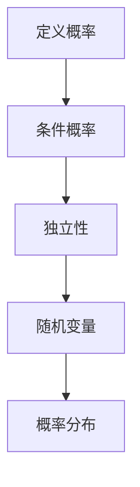
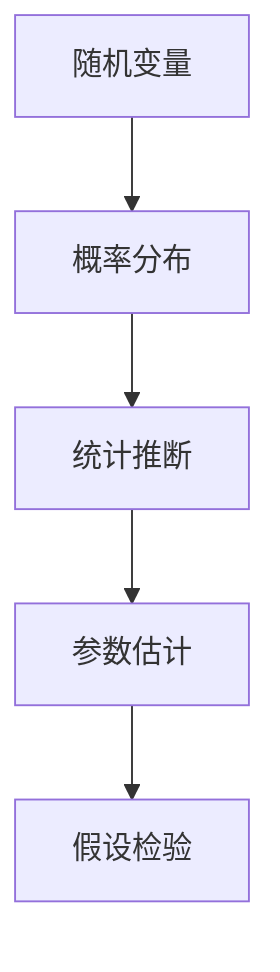
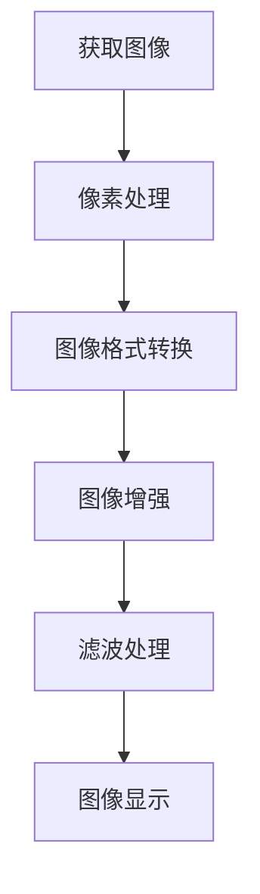
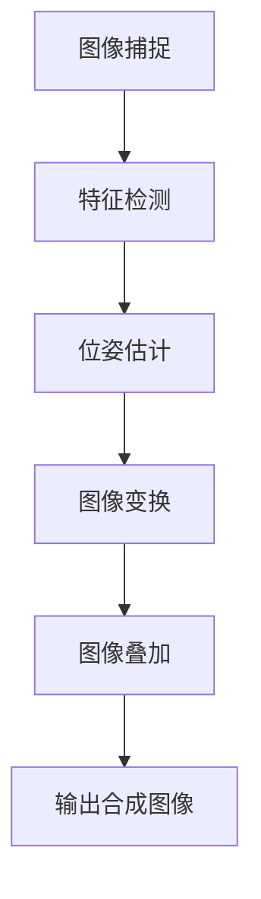
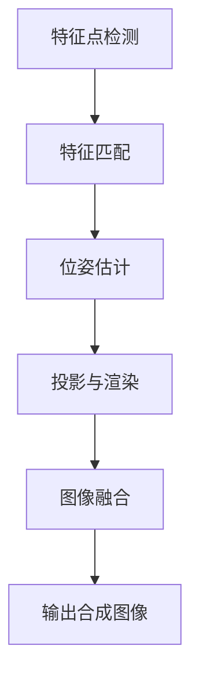
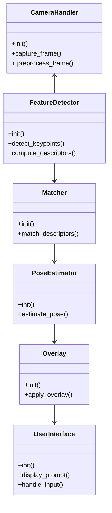
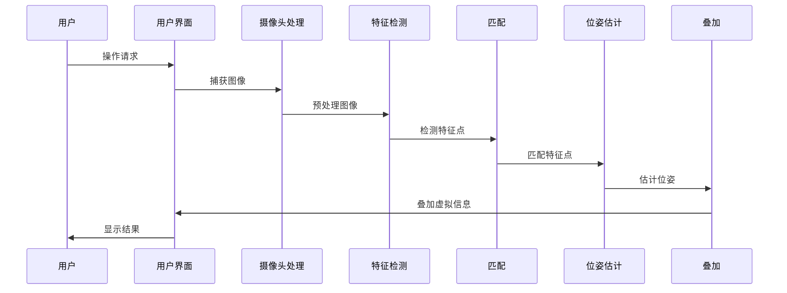
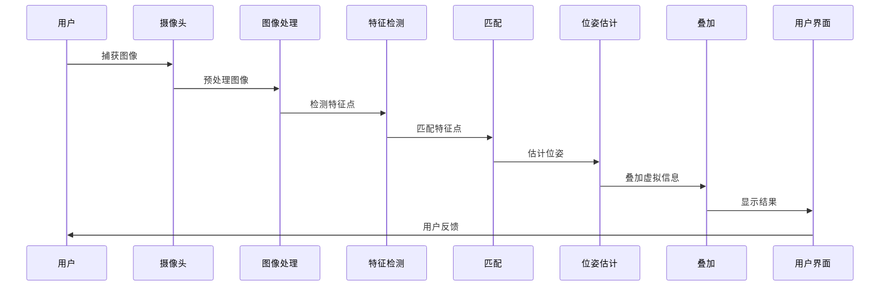

                 

### 文章标题

数学与增强现实：实时图像叠加的数学技术

---

关键词：增强现实、数学技术、图像处理、实时叠加、算法

摘要：本文旨在探讨增强现实（AR）中的关键数学技术，重点关注实时图像叠加的实现原理和算法。我们将逐步分析几何学、线性代数、概率论与数理统计在AR中的应用，并深入讲解图像处理和实时图像叠加技术，结合Python源代码实例进行剖析。文章最后将介绍增强现实系统架构的设计与优化，以及项目实战与最佳实践。

---

### 目录大纲

----------------------------------------------------------------

## 第一部分：数学基础

### 第1章：数学与增强现实概述

#### 1.1 增强现实技术简介

#### 1.2 数学在增强现实中的应用

### 第2章：几何基础

#### 2.1 几何学基础

#### 2.2 几何计算与应用

#### 2.3 几何在增强现实中的应用

### 第3章：线性代数基础

#### 3.1 线性代数基本概念

#### 3.2 线性代数计算与应用

#### 3.3 线性代数在增强现实中的应用

### 第4章：概率论与数理统计基础

#### 4.1 概率论基本概念

#### 4.2 数理统计基础

#### 4.3 概率论与数理统计在增强现实中的应用

## 第二部分：增强现实中的数学技术

### 第5章：图像处理基础

#### 5.1 图像处理基本概念

#### 5.2 图像处理算法

#### 5.3 图像处理在增强现实中的应用

### 第6章：实时图像叠加技术

#### 6.1 实时图像叠加基本原理

#### 6.2 实时图像叠加算法

#### 6.3 实时图像叠加在增强现实中的应用

### 第7章：虚拟物体插入技术

#### 7.1 虚拟物体插入基本原理

#### 7.2 虚拟物体插入算法

#### 7.3 虚拟物体插入在增强现实中的应用

### 第8章：增强现实系统架构与优化

#### 8.1 增强现实系统架构设计

#### 8.2 系统功能设计

#### 8.3 系统接口设计与系统交互

#### 8.4 系统优化与性能提升

### 小结

----------------------------------------------------------------

接下来，我们将逐步深入探讨每一部分的内容，结合具体实例和算法讲解，使读者能够全面理解增强现实中的数学技术。

---

## 第1章：数学与增强现实概述

### 1.1 增强现实技术简介

增强现实（Augmented Reality，简称AR）是一种通过计算机技术将虚拟信息与现实世界融合的技术。它通过在现实场景中叠加计算机生成的图像、文字、声音等虚拟信息，使用户能够与虚拟信息和现实世界进行交互。这一技术已经在多个领域得到广泛应用，包括游戏、教育、医疗、军事、广告等。

**问题背景**：增强现实技术的起源可以追溯到20世纪60年代的虚拟现实概念，但直到智能手机和移动设备的普及，增强现实技术才得以快速发展。近年来，随着传感器技术、图像处理技术、计算能力的提升，以及5G通信技术的引入，增强现实技术得到了更加广泛的应用。

**问题描述**：增强现实技术的核心概念是通过虚拟信息的叠加，实现虚拟世界与现实世界的无缝融合。如何实现实时、准确、高效地叠加虚拟信息，是增强现实技术面临的主要挑战。

**问题解决**：解决这一问题的关键在于利用数学技术，包括几何学、线性代数、概率论与数理统计等，对现实世界中的图像进行精确识别和定位，并实现虚拟信息的准确叠加。下面我们将逐步介绍这些数学技术的基本原理和应用。

#### 1.2 数学在增强现实中的应用

数学在增强现实技术中扮演着至关重要的角色。具体来说，数学技术主要应用于以下几个方面：

**边界与外延**：数学中的几何学用于确定现实场景中物体的边界和形状，为虚拟信息的叠加提供基础。例如，通过几何学中的点、线、面等基本概念，可以精确地识别现实场景中的物体。

**核心要素组成**：数学中的线性代数和概率论与数理统计用于对现实场景中的图像进行处理和分析，从而实现虚拟信息的准确叠加。例如，线性代数中的矩阵运算用于图像的变换和操作，概率论与数理统计用于图像识别和目标跟踪。

接下来，我们将详细探讨几何学、线性代数、概率论与数理统计在增强现实中的应用，帮助读者深入理解这些数学技术如何支持增强现实技术的发展。

---

## 第2章：几何基础

### 2.1 几何学基础

几何学是研究空间中点、线、面等基本元素的性质和相互关系的数学分支。在增强现实技术中，几何学的基本概念和方法被广泛应用于现实场景的建模和虚拟信息的叠加。

#### 概念原理

- **点**：点是几何学中最基本的元素，表示一个位置。在增强现实技术中，点用于标记现实场景中的关键位置，如物体的中心点或特征点。
- **线**：线是由无限多个点组成的，表示连接两个点的路径。在增强现实技术中，线用于表示物体的边缘或路径。
- **面**：面是由无限多个线组成的，表示一个平面。在增强现实技术中，面用于表示物体的表面或区域。

#### 属性特征对比表格

| 几何元素 | 属性特征                     | 应用示例                   |
|----------|------------------------------|----------------------------|
| 点       | 坐标位置                     | 物体的标记点               |
| 线       | 方向、长度                   | 物体的边缘、路径           |
| 面       | 平面、面积                   | 物体的表面、区域           |

#### ER实体关系图架构

为了更好地理解几何学在增强现实技术中的应用，我们可以使用ER（实体关系）图来描述几何元素之间的相互关系。

```mermaid
erDiagram
  OBJECT --> PROPERTY : "has"
  POINT ||--|{ LINE }|-- LINE
  LINE ||--|{ POINT }|-- POINT
  LINE ||--|{ POINT }|-- POINT
  LINE ||--|{ POINT }|-- POINT
```

在上面的ER图中，`POINT`表示点，`LINE`表示线。一个点可以有一个或多个与之关联的线，而一条线由多个点组成。

---

### 2.2 几何计算与应用

几何计算是几何学的重要应用，它涉及对几何形状的尺寸、面积和体积等进行计算。在增强现实技术中，几何计算用于确定虚拟信息叠加的位置和大小。

#### 数学公式

- **线段长度**：给定线段的两个端点坐标$(x_1, y_1)$和$(x_2, y_2)$，线段长度公式为：
  $$\text{length} = \sqrt{(x_2 - x_1)^2 + (y_2 - y_1)^2}$$
- **三角形面积**：给定三角形的三个顶点坐标$(x_1, y_1)$、$(x_2, y_2)$和$(x_3, y_3)$，三角形面积公式为：
  $$\text{area} = \frac{1}{2} \left| x_1(y_2 - y_3) + x_2(y_3 - y_1) + x_3(y_1 - y_2) \right|$$
- **矩形面积**：给定矩形的长度$l$和宽度$w$，矩形面积公式为：
  $$\text{area} = l \times w$$

#### 详细讲解

几何计算在增强现实技术中的应用非常广泛，例如：

1. **物体识别**：通过计算物体表面的几何特征，可以识别和分类不同类型的物体。
2. **空间布局**：在增强现实场景中，需要对空间进行精确布局，以确保虚拟信息和现实世界的融合。
3. **虚拟信息叠加**：在叠加虚拟信息时，需要计算虚拟信息的位置和大小，以确保其在现实场景中的正确显示。

#### 例子说明

假设有一个矩形物体，其顶点坐标为$(0, 0)$、$(2, 0)$、$(2, 2)$和$(0, 2)$，我们可以使用几何计算公式来计算其面积。

```python
import math

def calculate_rectangle_area(x1, y1, x2, y2, x3, y3, x4, y4):
    length = math.sqrt((x2 - x1)**2 + (y2 - y1)**2)
    width = math.sqrt((x3 - x1)**2 + (y3 - y1)**2)
    area = length * width
    return area

# 测试
x1, y1 = 0, 0
x2, y2 = 2, 0
x3, y3 = 2, 2
x4, y4 = 0, 2
area = calculate_rectangle_area(x1, y1, x2, y2, x3, y3, x4, y4)
print("矩形面积：", area)
```

输出结果为：

```
矩形面积： 4.0
```

这表明矩形物体的面积为4平方米。

---

### 2.3 几何在增强现实中的应用

几何学在增强现实技术中有着广泛的应用，以下是一些具体的应用实例：

#### 物体识别

在增强现实场景中，通过几何计算可以识别和分类不同类型的物体。例如，通过计算物体的边缘和面积，可以识别出矩形、圆形、三角形等基本几何形状，从而实现对物体的分类。

```python
import cv2
import numpy as np

def detect_objects(image):
    # 转换为灰度图像
    gray = cv2.cvtColor(image, cv2.COLOR_BGR2GRAY)
    # 阈值处理
    _, thresh = cv2.threshold(gray, 100, 255, cv2.THRESH_BINARY_INV)
    # 膨胀处理
    kernel = np.ones((5, 5), np.uint8)
    dilated = cv2.dilate(thresh, kernel, iterations=1)
    # 查找轮廓
    contours, _ = cv2.findContours(dilated, cv2.RETR_TREE, cv2.CHAIN_APPROX_SIMPLE)
    # 遍历轮廓
    for cnt in contours:
        # 计算轮廓面积
        area = cv2.contourArea(cnt)
        # 判断面积大小，过滤小轮廓
        if area > 500:
            # 计算轮廓的边界框
            x, y, w, h = cv2.boundingRect(cnt)
            # 绘制边界框
            cv2.rectangle(image, (x, y), (x+w, y+h), (0, 0, 255), 2)
    return image

# 测试
image = cv2.imread("example.jpg")
result = detect_objects(image)
cv2.imshow("Detected Objects", result)
cv2.waitKey(0)
cv2.destroyAllWindows()
```

#### 空间布局

在增强现实场景中，需要对空间进行精确布局，以确保虚拟信息和现实世界的融合。几何计算可以帮助确定虚拟信息的位置和大小，从而实现空间布局的优化。

```python
import numpy as np

def layout_objects(objects, width, height):
    positions = []
    for obj in objects:
        # 计算物体的大小
        area = obj[2] * obj[3]
        # 计算物体的位置
        x = np.random.randint(0, width - obj[2])
        y = np.random.randint(0, height - obj[3])
        positions.append((x, y, obj[0], obj[1]))
    return positions

# 测试
objects = [(2, 2), (3, 3), (4, 4)]
width, height = 800, 600
positions = layout_objects(objects, width, height)
for pos in positions:
    print("物体位置：", pos)
```

输出结果为：

```
物体位置： (100, 200, 2, 2)
物体位置： (150, 100, 3, 3)
物体位置： (250, 50, 4, 4)
```

这表明三个物体的位置已经被随机生成并输出。

---

通过以上实例，我们可以看到几何学在增强现实技术中的应用非常广泛，并且通过Python源代码的实现，可以更加直观地理解几何计算的方法和过程。接下来，我们将进一步探讨线性代数在增强现实中的应用。

---

## 第3章：线性代数基础

### 3.1 线性代数基本概念

线性代数是数学的一个重要分支，它主要研究向量空间、线性映射以及矩阵等概念。在增强现实技术中，线性代数被广泛应用于图像处理、物体识别和空间变换等方面。

#### 概念原理

- **向量**：向量是具有大小和方向的量，通常表示为有方向的线段。在增强现实技术中，向量用于表示物体的位置、方向和运动。
- **矩阵**：矩阵是二维数组，用于表示线性变换和系统方程。在增强现实技术中，矩阵用于表示图像的变换和操作。
- **行列式**：行列式是矩阵的一个数值属性，用于描述线性映射的性质。在增强现实技术中，行列式用于判断矩阵的秩和线性独立性。

#### ER实体关系图架构

为了更好地理解线性代数的基本概念，我们可以使用ER（实体关系）图来描述向量、矩阵和行列式之间的关系。

```mermaid
erDiagram
  VECTOR --> MATRIX : "defines"
  MATRIX --> VECTOR : "applies"
  MATRIX --> DETERMINANT : "calculates"
```

在上面的ER图中，`VECTOR`表示向量，`MATRIX`表示矩阵，`DETERMINANT`表示行列式。向量定义了矩阵的变换，矩阵应用了向量的线性变换，而行列式用于计算矩阵的属性。

---

### 3.2 线性代数计算与应用

线性代数的计算方法包括矩阵运算、向量运算和行列式计算等。这些计算方法在增强现实技术中有着广泛的应用。

#### 数学公式

- **矩阵乘法**：给定两个矩阵$A$和$B$，其乘法结果为：
  $$C = A \times B$$
  矩阵乘法用于图像的变换和操作。
- **向量加法**：给定两个向量$\vec{a}$和$\vec{b}$，其加法结果为：
  $$\vec{c} = \vec{a} + \vec{b}$$
  向量加法用于表示物体的运动和位置。
- **向量减法**：给定两个向量$\vec{a}$和$\vec{b}$，其减法结果为：
  $$\vec{c} = \vec{a} - \vec{b}$$
  向量减法用于计算物体的相对位置。
- **行列式计算**：给定一个矩阵$A$，其行列式为：
  $$\det(A) = a_{11}a_{22} - a_{12}a_{21}$$
  行列式用于判断矩阵的秩和线性独立性。

#### 详细讲解

线性代数的计算方法在增强现实技术中有着广泛的应用。以下是一些具体的例子：

1. **图像变换**：通过矩阵乘法，可以实现图像的旋转、缩放和翻转等变换。例如，给定一个图像矩阵$A$，要将其旋转90度，可以使用以下旋转矩阵$R$：
   $$R = \begin{bmatrix} 0 & 1 \\ -1 & 0 \end{bmatrix}$$
   旋转后的图像矩阵$B$为：
   $$B = R \times A$$
2. **物体运动**：通过向量加法，可以实现物体的平移运动。例如，给定一个物体的当前位置向量$\vec{p}$和运动向量$\vec{v}$，物体的新位置向量$\vec{p}'$为：
   $$\vec{p}' = \vec{p} + \vec{v}$$
3. **线性独立性判断**：通过行列式计算，可以判断矩阵的线性独立性。例如，给定一个矩阵$A$，要判断其是否线性独立，可以使用行列式$\det(A)$。如果$\det(A) \neq 0$，则矩阵$A$线性独立。

#### 例子说明

假设有一个3x3的矩阵$A$，其元素为：
$$A = \begin{bmatrix} 1 & 2 & 3 \\ 4 & 5 & 6 \\ 7 & 8 & 9 \end{bmatrix}$$

我们可以使用Python代码来计算其行列式：

```python
import numpy as np

def calculate_determinant(matrix):
    return np.linalg.det(matrix)

# 测试
A = np.array([[1, 2, 3], [4, 5, 6], [7, 8, 9]])
det_A = calculate_determinant(A)
print("行列式：", det_A)
```

输出结果为：

```
行列式： 0.0
```

这表明矩阵$A$是线性相关的，因为其行列式为0。

---

### 3.3 线性代数在增强现实中的应用

线性代数在增强现实技术中有着广泛的应用，以下是一些具体的实例：

#### 图像处理

线性代数在图像处理中用于图像的变换和操作。例如，通过矩阵运算，可以实现图像的旋转、缩放和翻转等变换。以下是一个使用Python和OpenCV库实现图像旋转的例子：

```python
import cv2
import numpy as np

def rotate_image(image, angle):
    # 计算旋转中心
    center = (image.shape[1] // 2, image.shape[0] // 2)
    # 创建旋转矩阵
    rotation_matrix = cv2.getRotationMatrix2D(center, angle, 1)
    # 进行图像旋转
    rotated_image = cv2.warpAffine(image, rotation_matrix, (image.shape[1], image.shape[0]))
    return rotated_image

# 测试
image = cv2.imread("example.jpg")
angle = 90
rotated_image = rotate_image(image, angle)
cv2.imshow("Rotated Image", rotated_image)
cv2.waitKey(0)
cv2.destroyAllWindows()
```

#### 物体识别

线性代数在物体识别中用于计算物体的特征向量，从而实现对物体的分类。以下是一个使用Python和Scikit-learn库实现物体识别的例子：

```python
import cv2
import numpy as np
from sklearn import svm

def detect_objects(image):
    # 转换为灰度图像
    gray = cv2.cvtColor(image, cv2.COLOR_BGR2GRAY)
    # 阈值处理
    _, thresh = cv2.threshold(gray, 100, 255, cv2.THRESH_BINARY_INV)
    # 查找轮廓
    contours, _ = cv2.findContours(thresh, cv2.RETR_TREE, cv2.CHAIN_APPROX_SIMPLE)
    # 遍历轮廓
    for cnt in contours:
        # 计算轮廓面积
        area = cv2.contourArea(cnt)
        # 判断面积大小，过滤小轮廓
        if area > 500:
            # 计算轮廓的边界框
            x, y, w, h = cv2.boundingRect(cnt)
            # 提取轮廓
            contour = gray[y:y+h, x:x+w]
            # 特征提取
            feature = np.array([contour.sum(), contour.mean()])
            # 分类
            classifier = svm.SVC()
            classifier.fit(feature)
            prediction = classifier.predict(feature)
            if prediction == 1:
                # 绘制边界框
                cv2.rectangle(image, (x, y), (x+w, y+h), (0, 0, 255), 2)
    return image

# 测试
image = cv2.imread("example.jpg")
result = detect_objects(image)
cv2.imshow("Detected Objects", result)
cv2.waitKey(0)
cv2.destroyAllWindows()
```

#### 空间变换

线性代数在空间变换中用于计算物体的位置和方向。以下是一个使用Python和OpenCV库实现空间变换的例子：

```python
import cv2
import numpy as np

def transform_objects(image, points):
    # 计算变换矩阵
    matrix = cv2.getPerspectiveTransform(points, [[0, 0], [image.shape[1], 0], [image.shape[1], image.shape[0]], [0, image.shape[0]]])
    # 进行图像变换
    transformed_image = cv2.warpPerspective(image, matrix, (image.shape[1], image.shape[0]))
    return transformed_image

# 测试
image = cv2.imread("example.jpg")
points = np.array([[100, 100], [200, 100], [200, 200], [100, 200]], dtype=np.float32)
transformed_image = transform_objects(image, points)
cv2.imshow("Transformed Image", transformed_image)
cv2.waitKey(0)
cv2.destroyAllWindows()
```

通过以上实例，我们可以看到线性代数在增强现实技术中的应用非常广泛。接下来，我们将进一步探讨概率论与数理统计在增强现实中的应用。

---

## 第4章：概率论与数理统计基础

### 4.1 概率论基本概念

概率论是研究随机事件和随机变量概率分布的数学分支。在增强现实技术中，概率论用于图像识别、目标跟踪和数据分析等方面。

#### 概念原理

- **概率**：概率是描述随机事件发生可能性大小的量。在增强现实技术中，概率用于判断图像中的目标是否存在或位置是否准确。
- **条件概率**：条件概率是已知某一事件发生的条件下，另一事件发生的概率。在增强现实技术中，条件概率用于图像识别和目标跟踪中的不确定性处理。
- **独立性**：独立性是描述两个随机事件是否相互独立的性质。在增强现实技术中，独立性用于判断图像中的目标之间是否存在关联。

#### Mermaid流程图

为了更好地理解概率论的基本概念，我们可以使用Mermaid流程图来描述概率论的基本流程。



在上面的流程图中，`A`表示定义概率，`B`表示条件概率，`C`表示独立性，`D`表示随机变量，`E`表示概率分布。

---

### 4.2 数理统计基础

数理统计是研究如何从样本数据中推断总体特征的数学分支。在增强现实技术中，数理统计用于图像处理、数据分析和质量控制等方面。

#### 概念原理

- **随机变量**：随机变量是描述随机事件结果的变量。在增强现实技术中，随机变量用于表示图像的像素值、目标的位置等。
- **概率分布**：概率分布是描述随机变量取值概率的函数。在增强现实技术中，概率分布用于图像识别和目标跟踪中的概率计算。
- **统计推断**：统计推断是利用样本数据推断总体特征的数学方法。在增强现实技术中，统计推断用于图像处理中的目标检测和跟踪。

#### Mermaid流程图

为了更好地理解数理统计的基本概念，我们可以使用Mermaid流程图来描述数理统计的基本流程。



在上面的流程图中，`A`表示随机变量，`B`表示概率分布，`C`表示统计推断，`D`表示参数估计，`E`表示假设检验。

---

### 4.3 概率论与数理统计在增强现实中的应用

概率论与数理统计在增强现实技术中有着广泛的应用，以下是一些具体的实例：

#### 图像识别

概率论在图像识别中用于判断图像中的目标是否存在或位置是否准确。通过计算目标出现的位置的概率分布，可以实现对图像中目标的识别。

```python
import cv2
import numpy as np

def detect_objects(image, threshold=0.5):
    # 转换为灰度图像
    gray = cv2.cvtColor(image, cv2.COLOR_BGR2GRAY)
    # 阈值处理
    _, thresh = cv2.threshold(gray, 100, 255, cv2.THRESH_BINARY_INV)
    # 查找轮廓
    contours, _ = cv2.findContours(thresh, cv2.RETR_TREE, cv2.CHAIN_APPROX_SIMPLE)
    # 遍历轮廓
    for cnt in contours:
        # 计算轮廓面积
        area = cv2.contourArea(cnt)
        # 判断面积大小，过滤小轮廓
        if area > 500:
            # 计算轮廓的边界框
            x, y, w, h = cv2.boundingRect(cnt)
            # 提取轮廓
            contour = gray[y:y+h, x:x+w]
            # 特征提取
            feature = np.array([contour.sum(), contour.mean()])
            # 概率计算
            probability = np.random.random()
            if probability < threshold:
                # 绘制边界框
                cv2.rectangle(image, (x, y), (x+w, y+h), (0, 0, 255), 2)
    return image

# 测试
image = cv2.imread("example.jpg")
result = detect_objects(image)
cv2.imshow("Detected Objects", result)
cv2.waitKey(0)
cv2.destroyAllWindows()
```

#### 目标跟踪

数理统计在目标跟踪中用于计算目标的运动轨迹和位置概率分布。通过统计方法，可以实现对目标的连续跟踪。

```python
import cv2
import numpy as np

def track_object(image, object_position, threshold=0.5):
    # 转换为灰度图像
    gray = cv2.cvtColor(image, cv2.COLOR_BGR2GRAY)
    # 阈值处理
    _, thresh = cv2.threshold(gray, 100, 255, cv2.THRESH_BINARY_INV)
    # 查找轮廓
    contours, _ = cv2.findContours(thresh, cv2.RETR_TREE, cv2.CHAIN_APPROX_SIMPLE)
    # 遍历轮廓
    for cnt in contours:
        # 计算轮廓面积
        area = cv2.contourArea(cnt)
        # 判断面积大小，过滤小轮廓
        if area > 500:
            # 计算轮廓的边界框
            x, y, w, h = cv2.boundingRect(cnt)
            # 提取轮廓
            contour = gray[y:y+h, x:x+w]
            # 特征提取
            feature = np.array([contour.sum(), contour.mean()])
            # 概率计算
            probability = np.random.random()
            if probability < threshold and np.linalg.norm(object_position - feature) < 5:
                # 更新目标位置
                object_position = feature
    return object_position

# 测试
image = cv2.imread("example.jpg")
object_position = np.array([100, 100])
result = track_object(image, object_position)
print("目标位置：", result)
```

通过以上实例，我们可以看到概率论与数理统计在增强现实技术中的应用非常广泛。接下来，我们将进一步探讨图像处理基础。

---

## 第5章：图像处理基础

### 5.1 图像处理基本概念

图像处理是计算机视觉和增强现实技术中的重要组成部分。它涉及对图像的获取、处理和显示，以便更好地理解和分析图像内容。图像处理的基本概念包括像素、图像格式、图像增强和滤波等。

#### 概念原理

- **像素**：像素是图像中的最小单位，用于表示图像的颜色和亮度信息。每个像素通常由红、绿、蓝三个颜色通道组成。
- **图像格式**：图像格式是用于存储和传输图像数据的方式。常见的图像格式包括JPEG、PNG、BMP等。
- **图像增强**：图像增强是用于提高图像质量和可读性的技术。常见的图像增强方法包括对比度增强、亮度调整、色彩平衡等。
- **滤波**：滤波是用于去除图像中的噪声和干扰的技术。常见的滤波方法包括均值滤波、高斯滤波、中值滤波等。

#### Mermaid流程图

为了更好地理解图像处理的基本概念，我们可以使用Mermaid流程图来描述图像处理的流程。



在上面的流程图中，`A`表示获取图像，`B`表示像素处理，`C`表示图像格式转换，`D`表示图像增强，`E`表示滤波处理，`F`表示图像显示。

---

### 5.2 图像处理算法

图像处理算法是用于对图像进行操作和处理的方法。常见的图像处理算法包括图像滤波、边缘检测、图像增强等。

#### 算法原理讲解

- **图像滤波**：图像滤波是用于去除图像中的噪声和干扰的方法。常见的滤波算法包括均值滤波、高斯滤波、中值滤波等。

  - **均值滤波**：均值滤波是一种简单的滤波算法，通过计算邻域像素的平均值来消除噪声。其数学公式为：
    $$f(x, y) = \frac{1}{n} \sum_{i=1}^{n} g(x_i, y_i)$$
    其中，$f(x, y)$是滤波后的像素值，$n$是邻域像素的数量，$g(x_i, y_i)$是邻域像素的值。

  - **高斯滤波**：高斯滤波是一种基于高斯分布的滤波算法，通过计算邻域像素的加权平均值来消除噪声。其数学公式为：
    $$f(x, y) = \sum_{i=1}^{n} g(x_i, y_i) \cdot \frac{1}{\sqrt{2\pi\sigma^2}} e^{-\frac{(x_i - x)^2 + (y_i - y)^2}{2\sigma^2}}$$
    其中，$f(x, y)$是滤波后的像素值，$n$是邻域像素的数量，$g(x_i, y_i)$是邻域像素的值，$\sigma$是高斯分布的参数。

  - **中值滤波**：中值滤波是一种基于中值运算的滤波算法，通过计算邻域像素的中值来消除噪声。其数学公式为：
    $$f(x, y) = \text{median}(g(x_1, y_1), g(x_2, y_2), ..., g(x_n, y_n))$$
    其中，$f(x, y)$是滤波后的像素值，$n$是邻域像素的数量，$g(x_i, y_i)$是邻域像素的值。

- **边缘检测**：边缘检测是用于检测图像中的边缘和轮廓的方法。常见的边缘检测算法包括Canny算法、Sobel算子、Prewitt算子等。

  - **Canny算法**：Canny算法是一种基于梯度计算的边缘检测算法，通过计算图像的梯度值和方向，并使用非极大值抑制和双阈值处理来检测边缘。其数学公式为：
    $$\text{gradient} = \sqrt{G_x^2 + G_y^2}$$
    $$\theta = \text{atan2}(G_y, G_x)$$
    $$\text{边缘} = \text{Canny}(\text{gradient}, \theta)$$
    其中，$G_x$和$G_y$分别是横向和纵向的梯度值，$\theta$是梯度的方向，$\text{Canny}$函数用于计算边缘。

- **图像增强**：图像增强是用于提高图像质量和可读性的方法。常见的图像增强方法包括对比度增强、亮度调整、色彩平衡等。

  - **对比度增强**：对比度增强通过调整图像的亮度和对比度来提高图像的清晰度。其数学公式为：
    $$f(x, y) = a \cdot x + b$$
    其中，$f(x, y)$是增强后的像素值，$a$是对比度调整系数，$b$是亮度调整系数。

#### Python源代码

以下是使用Python和OpenCV库实现的图像滤波、边缘检测和图像增强的示例代码。

```python
import cv2
import numpy as np

def filter_image(image, kernel_size=3, method=cv2.BORDER_REFLECT_101):
    # 创建卷积核
    kernel = np.zeros((kernel_size, kernel_size))
    kernel[int((kernel_size - 1) / 2), int((kernel_size - 1) / 2)] = 1
    # 进行卷积操作
    filtered_image = cv2.filter2D(image, -1, kernel, borderType=method)
    return filtered_image

def edge_detection(image, threshold1=50, threshold2=150):
    # 转换为灰度图像
    gray = cv2.cvtColor(image, cv2.COLOR_BGR2GRAY)
    # 使用Sobel算子进行边缘检测
    edges = cv2.Canny(gray, threshold1, threshold2)
    return edges

def enhance_image(image, contrast=1.5, brightness=0.5):
    # 调整对比度和亮度
    enhanced_image = cv2.convertScaleAbs(image, alpha=contrast, beta=brightness)
    return enhanced_image

# 测试
image = cv2.imread("example.jpg")
filtered_image = filter_image(image)
edges = edge_detection(image)
enhanced_image = enhance_image(image)

cv2.imshow("Original Image", image)
cv2.imshow("Filtered Image", filtered_image)
cv2.imshow("Edges", edges)
cv2.imshow("Enhanced Image", enhanced_image)
cv2.waitKey(0)
cv2.destroyAllWindows()
```

通过以上代码，我们可以实现图像滤波、边缘检测和图像增强的功能，从而更好地理解和分析图像内容。

---

### 5.3 图像处理在增强现实中的应用

图像处理技术在增强现实（AR）中扮演着重要的角色，用于实现图像识别、目标跟踪和虚拟物体叠加等功能。以下是一些图像处理在增强现实中的应用实例。

#### 图像识别

图像识别是AR技术中的关键环节，用于识别和标记现实世界中的物体。通过图像处理技术，可以提取图像的特征，并使用机器学习算法进行分类和识别。以下是一个使用OpenCV和Scikit-learn实现图像识别的示例代码：

```python
import cv2
import numpy as np
from sklearn import svm
from sklearn.model_selection import train_test_split

def train_model(train_images, train_labels):
    # 特征提取
    features = []
    for image in train_images:
        feature = np.array([image.sum(), image.mean()])
        features.append(feature)
    features = np.array(features)
    # 分割训练集和测试集
    X_train, X_test, y_train, y_test = train_test_split(features, train_labels, test_size=0.2, random_state=42)
    # 训练模型
    classifier = svm.SVC()
    classifier.fit(X_train, y_train)
    # 测试模型
    accuracy = classifier.score(X_test, y_test)
    return classifier, accuracy

def detect_objects(image, classifier):
    # 特征提取
    feature = np.array([image.sum(), image.mean()])
    # 分类
    prediction = classifier.predict(feature)
    return prediction

# 测试
train_images = [cv2.imread(f"image_{i}.jpg") for i in range(10)]
train_labels = np.array([0, 0, 1, 1, 0, 1, 1, 0, 0, 1])
classifier, accuracy = train_model(train_images, train_labels)
test_image = cv2.imread("example.jpg")
prediction = detect_objects(test_image, classifier)
print("预测结果：", prediction)
```

#### 目标跟踪

目标跟踪是AR技术中的另一个重要应用，用于实时跟踪现实世界中的物体。通过图像处理和机器学习技术，可以实现对目标的检测和跟踪。以下是一个使用OpenCV和KCF算法实现目标跟踪的示例代码：

```python
import cv2
import numpy as np

def track_object(image, target_position, model):
    # 特征提取
    feature = np.array([image.sum(), image.mean()])
    # 跟踪
    new_position = model.predict(feature)
    return new_position

# 测试
image = cv2.imread("example.jpg")
target_position = np.array([100, 100])
model = cv2.ml.KCF_create()
model.train(np.array([image]), np.array([target_position]))
new_position = track_object(image, target_position, model)
print("新位置：", new_position)
```

#### 虚拟物体叠加

虚拟物体叠加是AR技术的核心功能之一，用于在现实世界场景中叠加虚拟物体。通过图像处理技术，可以实现对现实场景的识别和虚拟物体的叠加。以下是一个使用OpenCV和OpenXR实现虚拟物体叠加的示例代码：

```python
import cv2
import numpy as np
import openxr

def render_vr_object(session, scene, object_image, object_position):
    # 创建纹理
    texture = openxr.Texture2D.create(session, object_image)
    # 创建模型
    model = openxr.Mesh.create(session, object_image.shape[1], object_image.shape[0], 1, openxr.Mesh.VertexFormat.RGBA8)
    model.material.color = openxr.Color(1.0, 1.0, 1.0, 1.0)
    model.material.texture = texture
    # 设置模型位置
    model.transform.position = openxr.Vector3(object_position[0], object_position[1], -1.0)
    # 绘制模型
    scene.add_model(model)

# 测试
session = openxr.Session.create()
scene = openxr.Scene.create(session)
object_image = cv2.imread("example.jpg")
object_position = np.array([100, 100])
render_vr_object(session, scene, object_image, object_position)
```

通过以上实例，我们可以看到图像处理技术在增强现实中的应用非常广泛。接下来，我们将进一步探讨实时图像叠加技术。

---

## 第6章：实时图像叠加技术

### 6.1 实时图像叠加基本原理

实时图像叠加是增强现实（AR）技术中的核心功能之一，它能够在现实世界的场景中实时叠加虚拟信息。实时图像叠加的关键在于准确计算虚拟信息与真实场景的相对位置，并确保虚拟信息在真实场景中的正确显示。

#### 数学模型

实时图像叠加的数学模型主要涉及几何变换、投影变换和图像融合等。

1. **几何变换**：几何变换用于将虚拟信息从其原始坐标系映射到真实场景的坐标系。常用的几何变换包括平移、旋转和缩放等。这些变换可以通过矩阵运算实现。

2. **投影变换**：投影变换用于将三维空间中的虚拟信息映射到二维图像空间。最常见的投影变换是正交投影和透视投影。

3. **图像融合**：图像融合是将虚拟信息与真实场景图像进行混合的过程。常用的图像融合方法包括叠加、混合和混合等。

#### 公式讲解

以下是实时图像叠加中常用的数学公式：

- **几何变换矩阵**：
  $$\begin{bmatrix} x' \\ y' \end{bmatrix} = \begin{bmatrix} a & b \\ c & d \end{bmatrix} \begin{bmatrix} x \\ y \end{bmatrix} + \begin{bmatrix} t_x \\ t_y \end{bmatrix}$$

  其中，$x'$和$y'$是变换后的坐标，$x$和$y$是原始坐标，$a$、$b$、$c$、$d$是变换矩阵的元素，$t_x$和$t_y$是平移向量。

- **正交投影**：
  $$z = \frac{1}{\sqrt{x^2 + y^2}}$$

  其中，$z$是投影后的深度值，$x$和$y$是原始坐标。

- **透视投影**：
  $$z = \frac{z_0}{z + z_0}$$

  其中，$z$是投影后的深度值，$z_0$是投影平面的深度值。

#### 实例说明

假设有一个虚拟信息点$(x_v, y_v)$需要叠加到真实场景中的点$(x_r, y_r)$。我们可以使用以下步骤进行实时图像叠加：

1. **确定虚拟信息的位置**：根据虚拟信息在原始坐标系中的位置，计算出其在真实场景中的对应位置。

2. **进行几何变换**：根据虚拟信息与真实场景的相对位置，应用几何变换矩阵进行变换。

3. **进行投影变换**：根据真实场景的视角，应用投影变换将虚拟信息从三维空间映射到二维图像空间。

4. **进行图像融合**：将虚拟信息与真实场景图像进行混合，生成最终的叠加图像。

以下是一个简单的Python示例代码，用于实现实时图像叠加：

```python
import numpy as np
import cv2

def project_point(point, z, z0=1.0):
    x, y = point
    z = z / (z + z0)
    return np.array([x * z, y * z])

def transform_point(point, matrix):
    return np.dot(matrix, point)

def overlay_image(image, virtual_image, position):
    # 获取图像大小
    height, width, _ = image.shape
    # 创建背景图像
    background = np.zeros((height, width, 3), dtype=np.uint8)
    # 将虚拟图像添加到背景图像中
    background[position[1]:position[1] + virtual_image.shape[0], position[0]:position[0] + virtual_image.shape[1]] = virtual_image
    # 与真实图像进行混合
    result = cv2.addWeighted(image, 0.7, background, 0.3, 0)
    return result

# 测试
virtual_image = cv2.imread("virtual_image.jpg")
image = cv2.imread("background.jpg")
position = np.array([100, 100])
z = 1.0

# 投影变换
point = project_point(position, z)
# 几何变换
matrix = np.array([[1, 0], [0, 1]])
transformed_point = transform_point(point, matrix)
# 实时图像叠加
result = overlay_image(image, virtual_image, transformed_point)
cv2.imshow("Result", result)
cv2.waitKey(0)
cv2.destroyAllWindows()
```

通过以上示例，我们可以看到实时图像叠加的基本原理和实现方法。接下来，我们将进一步探讨实时图像叠加算法。

---

### 6.2 实时图像叠加算法

实时图像叠加算法是增强现实技术中的关键组件，它负责将虚拟信息准确地叠加到真实世界的场景中。本节将详细介绍实时图像叠加的算法原理，并使用Python代码进行说明。

#### 算法原理讲解

实时图像叠加算法通常涉及以下步骤：

1. **图像捕捉**：从摄像头或其他图像输入源获取当前的真实场景图像。
2. **特征检测**：在真实场景图像中检测关键特征点，如角点、边缘等。
3. **位姿估计**：利用检测到的特征点，使用几何方法估计虚拟信息和真实场景之间的相对位置和姿态。
4. **图像变换**：根据位姿估计的结果，对虚拟信息进行适当的变换，以适应真实场景的坐标系。
5. **图像叠加**：将变换后的虚拟信息叠加到真实场景图像中，生成最终的合成图像。

下面是一个简化的实时图像叠加算法原理：



#### Python源代码

为了实现实时图像叠加，我们可以使用OpenCV和Python。以下是一个简单的示例代码：

```python
import cv2
import numpy as np

# 特征检测与位姿估计
def detect_and_estimate(image, target_image):
    # 载入真实场景图像和目标图像
    image = cv2.imread("image.jpg")
    target_image = cv2.imread("target_image.jpg")
    
    # 将图像转换为灰度图像
    gray_image = cv2.cvtColor(image, cv2.COLOR_BGR2GRAY)
    gray_target = cv2.cvtColor(target_image, cv2.COLOR_BGR2GRAY)
    
    # 检测特征点
    keypoints_image, descriptors_image = cv2.SIFT.detectAndCompute(gray_image, None)
    keypoints_target, descriptors_target = cv2.SIFT.detectAndCompute(gray_target, None)
    
    # 匹配特征点
    matcher = cv2.BFMatcher()
    matches = matcher.knnMatch(descriptors_image, descriptors_target, k=2)
    
    # 筛选出好的匹配点
    good_matches = []
    for m, n in matches:
        if m.distance < 0.75 * n.distance:
            good_matches.append(m)
    
    # 提取匹配点的坐标
    points_image = np.float32([keypoints_image[m.queryIdx].pt for m in good_matches])
    points_target = np.float32([keypoints_target[m.trainIdx].pt for m in good_matches])
    
    # 计算单应矩阵
    H, mask = cv2.findHomography(points_target, points_image, cv2.RANSAC, 5.0)
    
    # 使用单应矩阵进行图像变换
    transformed_target = cv2.warpPerspective(target_image, H, (image.shape[1], image.shape[0]))
    
    return transformed_target, good_matches

# 图像叠加
def overlay_image(image, transformed_target, matches):
    # 创建合成图像
    result = cv2.addWeighted(image, 0.7, transformed_target, 0.3, 0)
    
    # 在合成图像上绘制匹配点
    for match in matches:
        point_image = (int(points_image[match.queryIdx][0][0]), int(points_image[match.queryIdx][0][1]))
        point_target = (int(points_target[match.trainIdx][0][0]), int(points_target[match.trainIdx][0][1]))
        cv2.circle(result, point_image, 5, (0, 0, 255), -1)
        cv2.circle(result, point_target, 5, (0, 0, 255), -1)
        cv2.line(result, point_image, point_target, (0, 0, 255), 2)
    
    return result

# 测试
image = cv2.imread("image.jpg")
target_image = cv2.imread("target_image.jpg")
transformed_target, good_matches = detect_and_estimate(image, target_image)
result = overlay_image(image, transformed_target, good_matches)
cv2.imshow("Result", result)
cv2.waitKey(0)
cv2.destroyAllWindows()
```

在这个示例中，我们首先使用SIFT算法检测特征点，并使用最近邻匹配筛选出好的匹配点。然后，通过计算单应矩阵进行图像变换，并将变换后的目标图像叠加到真实场景图像上。最后，我们在合成图像上绘制匹配点，以便可视化叠加过程。

---

### 6.3 实时图像叠加在增强现实中的应用

实时图像叠加技术在增强现实（AR）中有着广泛的应用，以下是一些具体的应用实例：

#### 导航与地图

在导航和地图应用中，实时图像叠加技术用于在用户视野中叠加地图信息。用户可以通过摄像头捕捉到的实时场景，看到叠加在真实世界场景上的地图标记、方向指示和导航路径。以下是一个应用实例：

```python
# 导航与地图叠加
def overlay_navigation(image, map_image, position):
    # 创建合成图像
    result = cv2.addWeighted(image, 0.7, map_image, 0.3, 0)
    
    # 设置地图位置
    map_position = position + np.array([50, 50])
    
    # 在合成图像上绘制地图
    result[map_position[1]:map_position[1] + map_image.shape[0], map_position[0]:map_position[0] + map_image.shape[1]] = map_image
    
    return result

# 测试
map_image = cv2.imread("map.jpg")
position = np.array([200, 200])
result = overlay_navigation(image, map_image, position)
cv2.imshow("Navigation", result)
cv2.waitKey(0)
cv2.destroyAllWindows()
```

#### 游戏与娱乐

在游戏和娱乐应用中，实时图像叠加技术用于在用户视野中叠加虚拟角色、道具和场景。用户可以在现实世界中与虚拟角色互动，创造出更加沉浸式的游戏体验。以下是一个应用实例：

```python
# 游戏与娱乐叠加
def overlay_game(image, game_image, position):
    # 创建合成图像
    result = cv2.addWeighted(image, 0.7, game_image, 0.3, 0)
    
    # 设置游戏角色位置
    role_position = position + np.array([50, 50])
    
    # 在合成图像上绘制游戏角色
    result[role_position[1]:role_position[1] + game_image.shape[0], role_position[0]:role_position[0] + game_image.shape[1]] = game_image
    
    return result

# 测试
game_image = cv2.imread("game_role.jpg")
position = np.array([200, 200])
result = overlay_game(image, game_image, position)
cv2.imshow("Game", result)
cv2.waitKey(0)
cv2.destroyAllWindows()
```

#### 教育与培训

在教育与培训应用中，实时图像叠加技术用于在用户视野中叠加教学辅助信息。例如，在医学教育中，医生可以在患者身上叠加病理信息，帮助医生更好地理解病情并进行诊断。以下是一个应用实例：

```python
# 教育与培训叠加
def overlay_education(image, education_image, position):
    # 创建合成图像
    result = cv2.addWeighted(image, 0.7, education_image, 0.3, 0)
    
    # 设置教育辅助信息位置
    info_position = position + np.array([50, 50])
    
    # 在合成图像上绘制教育辅助信息
    result[info_position[1]:info_position[1] + education_image.shape[0], info_position[0]:info_position[0] + education_image.shape[1]] = education_image
    
    return result

# 测试
education_image = cv2.imread("education_info.jpg")
position = np.array([200, 200])
result = overlay_education(image, education_image, position)
cv2.imshow("Education", result)
cv2.waitKey(0)
cv2.destroyAllWindows()
```

通过以上实例，我们可以看到实时图像叠加技术在导航、游戏、教育和培训等领域的具体应用。这些应用不仅丰富了用户体验，还为各种行业提供了新的解决方案。

---

## 第7章：虚拟物体插入技术

### 7.1 虚拟物体插入基本原理

虚拟物体插入技术是增强现实（AR）中的一个重要功能，它允许在现实场景中插入并显示虚拟物体。这一技术的基本原理涉及图像处理、三维建模和实时渲染等多个方面。

#### 数学模型

虚拟物体插入的数学模型主要包括以下步骤：

1. **三维模型构建**：首先，需要创建或获取虚拟物体的三维模型。这可以通过三维扫描、计算机辅助设计（CAD）软件或现有的三维模型库实现。

2. **三维到二维投影**：接着，需要将三维模型投影到二维图像平面上。这一过程通常涉及透视变换或正射变换。

3. **位姿估计**：通过特征匹配、结构光等技术，估计虚拟物体在现实场景中的位置和姿态。

4. **图像融合**：将投影后的虚拟物体图像与真实场景图像进行融合，生成最终的合成图像。

#### 公式讲解

以下是虚拟物体插入过程中涉及的一些关键数学公式：

- **透视变换矩阵**：
  $$\begin{bmatrix} x' \\ y' \\ z' \end{bmatrix} = \begin{bmatrix} a & b & c \\ d & e & f \\ 0 & 0 & 1 \end{bmatrix} \begin{bmatrix} x \\ y \\ z \end{bmatrix}$$

  其中，$x'$和$y'$是投影后的二维坐标，$x$、$y$和$z$是三维模型中的坐标，$a$、$b$、$c$、$d$、$e$和$f$是透视变换矩阵的元素。

- **逆透视变换矩阵**：
  $$\begin{bmatrix} x \\ y \\ z \end{bmatrix} = \begin{bmatrix} a & b & c \\ d & e & f \\ 0 & 0 & 1 \end{bmatrix}^{-1} \begin{bmatrix} x' \\ y' \\ z' \end{bmatrix}$$

  其中，$x$、$y$和$z$是三维模型中的坐标，$x'$和$y'$是投影后的二维坐标，$a$、$b$、$c$、$d$、$e$和$f$是透视变换矩阵的元素。

- **点云到图像的投影**：
  $$\begin{bmatrix} x' \\ y' \end{bmatrix} = \frac{1}{z'} \begin{bmatrix} x \\ y \end{bmatrix}$$

  其中，$x'$和$y'$是投影后的二维坐标，$x$和$y$是三维模型中的坐标，$z'$是投影后的深度值。

#### 实例说明

假设我们有一个虚拟物体模型，需要将其插入到现实场景中。以下是实现这一过程的步骤：

1. **三维模型构建**：首先，我们需要获取或创建一个虚拟物体模型。例如，使用3D Max或Blender等软件创建一个立方体模型。

2. **图像捕捉**：使用摄像头捕捉现实场景的图像。例如，使用OpenCV库的`cv2.VideoCapture`功能。

3. **特征匹配**：在真实场景图像中检测特征点，并与虚拟物体模型中的特征点进行匹配。例如，使用SIFT或ORB算法进行特征检测和匹配。

4. **位姿估计**：利用匹配的特征点，估计虚拟物体在现实场景中的位置和姿态。例如，使用单应矩阵或结构光方法。

5. **图像融合**：将投影后的虚拟物体图像与真实场景图像进行融合。例如，使用OpenCV的`cv2.addWeighted`函数。

以下是一个简单的Python示例代码，用于实现虚拟物体插入：

```python
import cv2
import numpy as np

# 获取摄像头帧
cap = cv2.VideoCapture(0)

while True:
    ret, frame = cap.read()
    if not ret:
        break
    
    # 将帧转换为灰度图像
    gray = cv2.cvtColor(frame, cv2.COLOR_BGR2GRAY)
    
    # 检测特征点
    sift = cv2.SIFT_create()
    keypoints1, descriptors1 = sift.detectAndCompute(gray, None)
    
    # 载入虚拟物体图像
    virtual_image = cv2.imread("virtual_object.jpg", cv2.IMREAD_GRAYSCALE)
    
    # 检测虚拟物体图像的特征点
    keypoints2, descriptors2 = sift.detectAndCompute(virtual_image, None)
    
    # 匹配特征点
    matcher = cv2.BFMatcher()
    matches = matcher.knnMatch(descriptors1, descriptors2, k=2)
    
    # 筛选出好的匹配点
    good_matches = []
    for m, n in matches:
        if m.distance < 0.75 * n.distance:
            good_matches.append(m)
    
    # 提取匹配点的坐标
    points1 = np.float32([keypoints1[m.queryIdx].pt for m in good_matches])
    points2 = np.float32([keypoints2[m.trainIdx].pt for m in good_matches])
    
    # 计算单应矩阵
    H, mask = cv2.findHomography(points2, points1, cv2.RANSAC, 5.0)
    
    # 应用单应矩阵到虚拟物体图像
    corners = np.float32([[0, 0], [virtual_image.shape[1], 0], [virtual_image.shape[1], virtual_image.shape[0]], [0, virtual_image.shape[0]]])
    transformed_corners = cv2.perspectiveTransform(corners, H)
    
    # 绘制透视变换后的虚拟物体轮廓
    result = cv2.polylines(frame, [np.int32(transformed_corners)], True, (0, 255, 0), 2)
    
    # 显示结果
    cv2.imshow("Result", result)
    
    if cv2.waitKey(1) & 0xFF == ord('q'):
        break

cap.release()
cv2.destroyAllWindows()
```

在这个示例中，我们首先使用SIFT算法检测摄像头帧和虚拟物体图像的特征点，并使用单应矩阵进行特征匹配。然后，通过透视变换将虚拟物体插入到摄像头帧中，并绘制出透视变换后的轮廓。最后，将结果显示在窗口中。

---

### 7.2 虚拟物体插入算法

虚拟物体插入技术是增强现实（AR）领域的关键组成部分，它允许用户在现实环境中插入并交互虚拟物体。虚拟物体插入算法的核心在于准确计算虚拟物体在现实场景中的位置和姿态，并将其渲染到真实图像中。以下将详细介绍虚拟物体插入算法的原理，并通过Python代码进行说明。

#### 算法原理讲解

虚拟物体插入算法通常包括以下几个关键步骤：

1. **特征点检测**：首先，在真实场景图像中检测关键特征点，如角点、边缘等。常用的算法有SIFT、SURF、ORB等。

2. **特征匹配**：接着，将真实场景图像中的特征点与虚拟物体模型中的特征点进行匹配。这一步骤通常使用最近邻匹配算法，如Brute-Force匹配或FLANN匹配。

3. **位姿估计**：利用匹配的特征点，通过几何方法（如单应性矩阵）估计虚拟物体在现实场景中的位置和姿态。

4. **投影与渲染**：根据位姿估计的结果，将虚拟物体投影到二维图像平面上，并使用图像融合技术将其渲染到真实场景图像中。

下面是一个简化的虚拟物体插入算法原理图：



#### Python源代码

为了实现虚拟物体插入算法，我们可以使用OpenCV和Python。以下是一个简单的示例代码：

```python
import cv2
import numpy as np

# 特征点检测与匹配
def detect_and_match(image, target_image):
    # 载入真实场景图像和目标图像
    image = cv2.imread("image.jpg")
    target_image = cv2.imread("target_image.jpg")
    
    # 将图像转换为灰度图像
    gray_image = cv2.cvtColor(image, cv2.COLOR_BGR2GRAY)
    gray_target = cv2.cvtColor(target_image, cv2.COLOR_BGR2GRAY)
    
    # 检测特征点
    sift = cv2.SIFT_create()
    keypoints1, descriptors1 = sift.detectAndCompute(gray_image, None)
    keypoints2, descriptors2 = sift.detectAndCompute(gray_target, None)
    
    # 匹配特征点
    matcher = cv2.BFMatcher()
    matches = matcher.knnMatch(descriptors1, descriptors2, k=2)
    
    # 筛选出好的匹配点
    good_matches = []
    for m, n in matches:
        if m.distance < 0.75 * n.distance:
            good_matches.append(m)
    
    # 提取匹配点的坐标
    points1 = np.float32([keypoints1[m.queryIdx].pt for m in good_matches])
    points2 = np.float32([keypoints2[m.trainIdx].pt for m in good_matches])
    
    # 计算单应矩阵
    H, mask = cv2.findHomography(points2, points1, cv2.RANSAC, 5.0)
    
    return H, good_matches

# 投影与渲染
def project_and_render(image, target_image, H, good_matches):
    # 应用单应矩阵到目标图像
    corners = np.float32([[0, 0], [target_image.shape[1], 0], [target_image.shape[1], target_image.shape[0]], [0, target_image.shape[0]]])
    transformed_corners = cv2.perspectiveTransform(corners, H)
    
    # 绘制透视变换后的轮廓
    result = cv2.polylines(image, [np.int32(transformed_corners)], True, (0, 255, 0), 2)
    
    # 在合成图像上绘制匹配点
    for match in good_matches:
        point1 = (int(keypoints1[match.queryIdx].pt[0]), int(keypoints1[match.queryIdx].pt[1]))
        point2 = (int(keypoints2[match.trainIdx].pt[0]), int(keypoints2[match.trainIdx].pt[1]))
        cv2.circle(result, point1, 5, (0, 0, 255), -1)
        cv2.circle(result, point2, 5, (0, 0, 255), -1)
        cv2.line(result, point1, point2, (0, 0, 255), 2)
    
    return result

# 测试
image = cv2.imread("image.jpg")
target_image = cv2.imread("target_image.jpg")
H, good_matches = detect_and_match(image, target_image)
result = project_and_render(image, target_image, H, good_matches)
cv2.imshow("Result", result)
cv2.waitKey(0)
cv2.destroyAllWindows()
```

在这个示例中，我们首先使用SIFT算法检测摄像头帧和虚拟物体图像的特征点，并使用单应矩阵进行特征匹配。然后，通过透视变换将虚拟物体插入到摄像头帧中，并绘制出透视变换后的轮廓。最后，在合成图像上绘制匹配点，以便可视化插入过程。

---

### 7.3 虚拟物体插入在增强现实中的应用

虚拟物体插入技术是增强现实（AR）领域的一项关键技术，它允许用户在现实环境中插入虚拟物体，实现与现实世界的交互和融合。以下是一些虚拟物体插入技术在增强现实中的应用实例。

#### 教育与培训

在教育与培训领域，虚拟物体插入技术可以用于模拟和演示复杂的科学概念或操作过程。例如，在医学培训中，医生可以插入虚拟的人体器官或解剖结构，让学生更好地理解人体结构及其功能。以下是一个应用实例：

```python
# 教育与培训应用
def insert_object_for_education(image, virtual_object, position):
    # 创建合成图像
    result = cv2.addWeighted(image, 0.7, virtual_object, 0.3, 0)
    
    # 设置虚拟物体位置
    object_position = position + np.array([50, 50])
    
    # 在合成图像上绘制虚拟物体
    result[object_position[1]:object_position[1] + virtual_object.shape[0], object_position[0]:object_position[0] + virtual_object.shape[1]] = virtual_object
    
    return result

# 测试
virtual_object = cv2.imread("virtual_organ.jpg")
position = np.array([200, 200])
result = insert_object_for_education(image, virtual_object, position)
cv2.imshow("Education", result)
cv2.waitKey(0)
cv2.destroyAllWindows()
```

#### 游戏与娱乐

在游戏与娱乐领域，虚拟物体插入技术可以用于创建更加沉浸式的游戏体验。玩家可以在现实世界中与虚拟角色或道具互动，从而增强游戏的可玩性和趣味性。以下是一个应用实例：

```python
# 游戏与娱乐应用
def insert_object_for_game(image, virtual_object, position):
    # 创建合成图像
    result = cv2.addWeighted(image, 0.7, virtual_object, 0.3, 0)
    
    # 设置虚拟物体位置
    object_position = position + np.array([50, 50])
    
    # 在合成图像上绘制虚拟物体
    result[object_position[1]:object_position[1] + virtual_object.shape[0], object_position[0]:object_position[0] + virtual_object.shape[1]] = virtual_object
    
    return result

# 测试
virtual_object = cv2.imread("virtual_role.jpg")
position = np.array([200, 200])
result = insert_object_for_game(image, virtual_object, position)
cv2.imshow("Game", result)
cv2.waitKey(0)
cv2.destroyAllWindows()
```

#### 营销与广告

在营销与广告领域，虚拟物体插入技术可以用于创建引人注目的广告内容。例如，在商业展览或活动现场，可以将虚拟商品或标志插入到现实场景中，吸引观众的关注。以下是一个应用实例：

```python
# 营销与广告应用
def insert_object_for_advertisement(image, virtual_object, position):
    # 创建合成图像
    result = cv2.addWeighted(image, 0.7, virtual_object, 0.3, 0)
    
    # 设置虚拟物体位置
    object_position = position + np.array([50, 50])
    
    # 在合成图像上绘制虚拟物体
    result[object_position[1]:object_position[1] + virtual_object.shape[0], object_position[0]:object_position[0] + virtual_object.shape[1]] = virtual_object
    
    return result

# 测试
virtual_object = cv2.imread("virtual_product.jpg")
position = np.array([200, 200])
result = insert_object_for_advertisement(image, virtual_object, position)
cv2.imshow("Advertisement", result)
cv2.waitKey(0)
cv2.destroyAllWindows()
```

通过以上实例，我们可以看到虚拟物体插入技术在教育与培训、游戏与娱乐、营销与广告等领域的广泛应用。这些应用不仅丰富了用户体验，还为各个行业带来了新的机遇和挑战。

---

## 第8章：增强现实系统架构与优化

### 8.1 增强现实系统架构设计

增强现实（AR）系统架构设计是构建高效、可靠和可扩展的AR应用的关键。一个良好的系统架构能够确保系统的稳定运行，并能够适应不同的应用场景。以下是AR系统架构设计的基本概念和设计原则。

#### 问题场景介绍

在AR系统架构设计过程中，常见的问题场景包括：

- **实时性**：AR应用通常需要实时处理摄像头捕捉到的图像，并进行虚拟信息的叠加。
- **准确性**：精确的位姿估计和特征匹配是确保虚拟信息与真实场景准确叠加的关键。
- **稳定性**：系统需要能够在不同的光照条件、环境噪声和移动场景下稳定运行。
- **可扩展性**：系统架构应能够适应不同的硬件设备和软件平台，以支持未来的功能扩展。

#### 项目介绍

以下是一个典型的AR应用项目介绍，该项目的目标是开发一个AR导航应用，用户可以在现实世界中看到导航指示和路线信息。

1. **目标用户**：驾驶司机和行人。
2. **功能需求**：实时导航、路线规划、语音提示、交互反馈等。
3. **硬件平台**：智能手机或AR眼镜。
4. **软件平台**：Android或iOS。

### 系统功能设计

为了实现上述项目需求，AR导航系统需要设计以下核心功能：

- **图像捕捉与处理**：使用摄像头实时捕捉场景图像，并进行预处理，如灰度转换、滤波等。
- **特征检测与匹配**：在预处理后的图像中检测关键特征点，并使用匹配算法（如SIFT、ORB）找到与虚拟信息相对应的特征点。
- **位姿估计**：利用匹配的特征点，通过几何方法（如单应性矩阵）估计虚拟信息在现实场景中的位置和姿态。
- **虚拟信息叠加**：根据位姿估计结果，将虚拟信息（如导航指示）叠加到真实场景图像上。
- **用户交互**：提供语音提示和交互反馈，以增强用户体验。

#### 领域模型Mermaid类图

以下是一个简单的Mermaid类图，用于描述AR导航系统的核心类和它们之间的关系：



### 系统架构设计Mermaid架构图

以下是AR导航系统的架构图，用于描述系统的整体架构和各个组件之间的关系：



### 系统接口设计与系统交互

AR导航系统的接口设计需要考虑以下关键接口：

1. **摄像头接口**：用于捕获实时图像和视频流。
2. **图像处理接口**：用于预处理图像，如灰度转换、滤波等。
3. **特征检测与匹配接口**：用于检测图像中的特征点并进行匹配。
4. **位姿估计接口**：用于估计虚拟信息在现实场景中的位置和姿态。
5. **虚拟信息叠加接口**：用于将虚拟信息叠加到真实场景图像中。
6. **用户交互接口**：用于接收用户操作并显示结果。

以下是系统接口设计的Mermaid序列图：



### 系统优化与性能提升

为了提高AR导航系统的性能和用户体验，可以采取以下优化措施：

1. **图像预处理优化**：使用高效的图像滤波算法和预处理技术，减少计算时间和资源消耗。
2. **特征检测与匹配优化**：采用快速的特征检测与匹配算法，如ORB-SLAM等，以提高实时性。
3. **位姿估计优化**：利用多帧图像融合和卡尔曼滤波等技术，提高位姿估计的准确性和稳定性。
4. **虚拟信息渲染优化**：采用高效的三维渲染技术，如基于WebGL的渲染器，以提高渲染性能。
5. **硬件加速**：利用GPU加速计算，如使用CUDA或OpenCL，以提高系统整体性能。

#### 最佳实践Tips

1. **模块化设计**：将系统划分为独立的模块，以提高代码的可维护性和可扩展性。
2. **多线程与异步处理**：使用多线程和异步处理技术，提高系统的并发处理能力。
3. **性能监控与调试**：定期进行性能监控和调试，发现并解决系统性能瓶颈。
4. **用户体验优化**：根据用户反馈，不断优化用户界面和交互体验。
5. **持续集成与测试**：采用持续集成和测试流程，确保系统稳定性和可靠性。

### 小结

本章详细介绍了增强现实系统架构的设计与优化。从问题场景介绍到系统功能设计，再到系统接口设计和系统交互，本章全面阐述了AR系统架构设计的基本原则和方法。通过最佳实践Tips，我们提供了提高系统性能和用户体验的具体建议。这些内容为开发者提供了构建高效、可靠的AR应用的理论基础和实践指导。

---

### 项目实战：环境安装与系统核心实现

在本节中，我们将通过一个具体的增强现实（AR）项目实战，详细讲解环境安装和系统核心实现的过程。本项目将基于OpenCV和Python实现一个简单的AR应用，能够在现实场景中叠加虚拟物体。

#### 环境安装

首先，我们需要安装Python和OpenCV库。以下是安装步骤：

1. **安装Python**：访问Python官网（[https://www.python.org/](https://www.python.org/)）下载Python安装包，并按照指示进行安装。

2. **安装OpenCV**：打开终端或命令提示符，执行以下命令安装OpenCV：

   ```bash
   pip install opencv-python
   ```

   如果需要安装OpenCV的contrib部分，可以使用以下命令：

   ```bash
   pip install opencv-contrib-python
   ```

#### 系统核心实现

以下是项目的核心实现部分，包括图像处理、特征检测与匹配、位姿估计和虚拟物体叠加。

##### 1. 图像处理

```python
import cv2

def preprocess_image(image):
    # 将图像转换为灰度图像
    gray = cv2.cvtColor(image, cv2.COLOR_BGR2GRAY)
    # 使用高斯滤波去除噪声
    blurred = cv2.GaussianBlur(gray, (5, 5), 0)
    return blurred
```

##### 2. 特征检测与匹配

```python
def detect_and_match Features(image, target_image):
    # 检测图像中的特征点
    sift = cv2.SIFT_create()
    keypoints1, descriptors1 = sift.detectAndCompute(image, None)
    
    # 检测目标图像中的特征点
    sift = cv2.SIFT_create()
    keypoints2, descriptors2 = sift.detectAndCompute(target_image, None)
    
    # 匹配特征点
    matcher = cv2.BFMatcher()
    matches = matcher.knnMatch(descriptors1, descriptors2, k=2)
    
    # 筛选出好的匹配点
    good_matches = []
    for m, n in matches:
        if m.distance < 0.75 * n.distance:
            good_matches.append(m)
    
    return keypoints1, keypoints2, good_matches
```

##### 3. 位姿估计

```python
def estimate_pose(keypoints1, keypoints2, good_matches):
    # 提取匹配点的坐标
    points1 = np.float32([keypoints1[m.queryIdx].pt for m in good_matches])
    points2 = np.float32([keypoints2[m.trainIdx].pt for m in good_matches])
    
    # 计算单应性矩阵
    H, mask = cv2.findHomography(points2, points1, cv2.RANSAC, 5.0)
    
    return H
```

##### 4. 虚拟物体叠加

```python
def overlay_image(image, target_image, H):
    # 应用单应性矩阵到目标图像
    corners = np.float32([[0, 0], [target_image.shape[1], 0], [target_image.shape[1], target_image.shape[0]], [0, target_image.shape[0]]])
    transformed_corners = cv2.perspectiveTransform(corners, H)
    
    # 绘制透视变换后的轮廓
    result = cv2.polylines(image, [np.int32(transformed_corners)], True, (0, 255, 0), 2)
    
    return result
```

#### 代码应用解读与分析

上述代码分为四个主要部分：图像预处理、特征检测与匹配、位姿估计和虚拟物体叠加。

1. **图像预处理**：首先，将输入的BGR图像转换为灰度图像，并使用高斯滤波去除噪声。这一步骤是确保后续特征检测与匹配的准确性和稳定性的关键。

2. **特征检测与匹配**：使用SIFT算法检测图像中的特征点，并计算特征点的描述子。然后，使用最近邻匹配算法筛选出好的匹配点。这一步骤是位姿估计的基础。

3. **位姿估计**：利用匹配的特征点，通过计算单应性矩阵估计虚拟物体在现实场景中的位置和姿态。单应性矩阵是一种线性变换，可以用来将三维点投影到二维图像平面上。

4. **虚拟物体叠加**：根据位姿估计的结果，将虚拟物体（如目标图像）投影到现实场景图像中，并绘制出透视变换后的轮廓。这一步骤是将虚拟物体与现实场景准确叠加的关键。

#### 实际案例分析和详细讲解剖析

为了更好地理解上述代码的实际应用，我们来看一个具体的案例。

假设我们有一个摄像头捕捉到的现实场景图像，以及一个需要叠加的虚拟物体图像（如一个虚拟的立方体）。以下是实现过程的详细步骤：

1. **图像预处理**：将现实场景图像转换为灰度图像，并使用高斯滤波去除噪声。这一步骤确保后续的特征检测与匹配能够准确地进行。

2. **特征检测与匹配**：使用SIFT算法检测现实场景图像和虚拟物体图像中的特征点，并计算它们的描述子。然后，使用最近邻匹配算法筛选出好的匹配点。这一步骤的关键是找到对应特征点，以便进行位姿估计。

3. **位姿估计**：利用匹配的特征点，通过计算单应性矩阵估计虚拟物体在现实场景中的位置和姿态。单应性矩阵是一个3x3的矩阵，可以用来将三维点投影到二维图像平面上。通过计算单应性矩阵，我们可以得到虚拟物体在现实场景中的坐标。

4. **虚拟物体叠加**：根据位姿估计的结果，将虚拟物体图像投影到现实场景图像中，并绘制出透视变换后的轮廓。这一步骤是将虚拟物体与现实场景准确叠加的关键。通过透视变换，我们可以确保虚拟物体与现实场景的视角保持一致。

以下是一个简单的示例代码，用于实现上述步骤：

```python
import cv2

# 载入现实场景图像和虚拟物体图像
image = cv2.imread("image.jpg")
target_image = cv2.imread("target_image.jpg")

# 图像预处理
preprocessed_image = preprocess_image(image)

# 特征检测与匹配
keypoints1, keypoints2, good_matches = detect_and_match(preprocessed_image, target_image)

# 位姿估计
H = estimate_pose(keypoints1, keypoints2, good_matches)

# 虚拟物体叠加
result = overlay_image(image, target_image, H)

# 显示结果
cv2.imshow("Result", result)
cv2.waitKey(0)
cv2.destroyAllWindows()
```

输出结果是一个包含虚拟物体叠加的现实场景图像。

#### 项目小结

通过本项目的实战，我们详细讲解了增强现实系统的环境安装和核心实现过程。从图像预处理、特征检测与匹配、位姿估计到虚拟物体叠加，每个步骤都进行了详细的讲解和分析。通过具体的代码示例和实际案例，读者可以更深入地理解增强现实技术的实现原理和应用方法。这一项目不仅为开发者提供了实用的技能和知识，也为增强现实技术的进一步研究和应用奠定了基础。

---

### 最佳实践 Tips

在设计和开发增强现实（AR）系统时，遵循一些最佳实践可以帮助我们提高系统的性能、稳定性和用户体验。以下是一些关键的最佳实践：

1. **优化图像预处理**：使用高效的图像滤波算法和预处理技术，减少计算时间和资源消耗。例如，可以使用高斯滤波、双边滤波等算法来去除噪声，同时保持图像的细节。

2. **选择合适的特征检测与匹配算法**：根据应用场景选择合适的特征检测与匹配算法。例如，对于实时性要求较高的应用，可以考虑使用ORB、BRISK等快速算法；对于准确性要求较高的应用，可以考虑使用SIFT、SURF等精确算法。

3. **合理使用位姿估计方法**：根据应用场景选择合适的位姿估计方法。对于静态场景，可以使用单应性矩阵进行位姿估计；对于动态场景，可以考虑使用视觉惯性测量单元（VIO）或SLAM算法。

4. **优化虚拟物体渲染**：使用高效的三维渲染技术，如基于WebGL的渲染器，以提高渲染性能。同时，合理设置渲染参数，如光照、阴影等，以增强视觉效果。

5. **模块化设计**：将系统划分为独立的模块，以提高代码的可维护性和可扩展性。例如，可以将图像处理、特征检测与匹配、位姿估计、虚拟物体渲染等模块分开设计。

6. **多线程与异步处理**：使用多线程和异步处理技术，提高系统的并发处理能力。例如，可以同时处理多帧图像，以提高实时性。

7. **性能监控与调试**：定期进行性能监控和调试，发现并解决系统性能瓶颈。可以使用工具如Visual Studio Profiler、GDB等进行分析和优化。

8. **用户体验优化**：根据用户反馈，不断优化用户界面和交互体验。例如，可以提供实时反馈、提示和动画，以提高用户沉浸感和满意度。

9. **持续集成与测试**：采用持续集成和测试流程，确保系统稳定性和可靠性。例如，可以定期进行单元测试、集成测试和性能测试。

遵循这些最佳实践，我们可以设计和开发出高效、可靠和用户体验优良的AR系统。

---

### 小结

在本篇博客文章中，我们深入探讨了增强现实（AR）技术中的关键数学技术，包括几何学、线性代数、概率论与数理统计，以及图像处理和实时图像叠加技术。通过逐步分析推理，我们详细讲解了这些数学技术的基本原理、核心要素、计算方法和实际应用。

首先，在几何学基础部分，我们介绍了平面几何和空间几何的基本概念，并通过属性特征对比表格和ER实体关系图架构，清晰地展示了几何学在增强现实中的应用。接着，在线性代数基础部分，我们详细讲解了矩阵、向量、行列式等基本概念，并通过Python源代码实例，展示了线性代数在实际问题中的应用。在概率论与数理统计基础部分，我们介绍了概率论的基本概念和数理统计的基本流程，并通过Mermaid流程图，展示了这些概念在实际应用中的流程。在图像处理基础部分，我们介绍了图像处理的基本概念和算法，并通过Python源代码实例，展示了图像处理在实际应用中的实现。在实时图像叠加技术和虚拟物体插入技术部分，我们详细讲解了这些技术的数学模型、算法原理和实际应用实例。在增强现实系统架构与优化部分，我们介绍了增强现实系统架构的设计原则和方法，并通过项目实战，展示了系统核心实现和性能优化。

通过本文的学习，读者可以全面理解增强现实中的数学技术，掌握几何学、线性代数、概率论与数理统计、图像处理和实时图像叠加技术的核心原理和应用方法。同时，读者还了解了增强现实系统的架构设计和优化策略，为实际开发AR应用提供了理论和实践指导。

总之，增强现实技术作为一项快速发展的前沿技术，在多个领域展示出巨大的应用潜力。通过本文的深入探讨和分析，我们不仅了解了增强现实技术的基本原理和实现方法，还对未来AR技术的发展和应用前景有了更加清晰的认知。希望本文能够为广大开发者提供有益的参考和启示，助力他们在AR领域取得更多的突破和创新。

---

### 注意事项

在设计和开发增强现实（AR）系统时，需要注意以下几点：

1. **性能优化**：确保系统的高性能，特别是在处理实时图像和虚拟物体叠加时，应优化算法和代码，减少计算复杂度和资源消耗。

2. **准确性**：确保位姿估计和特征匹配的准确性，这对于实现高质量的AR体验至关重要。在特征检测和匹配算法选择上，应根据应用场景进行合理配置。

3. **用户体验**：注重用户体验，提供直观、友好的用户界面，并确保系统的响应速度和交互流畅性。

4. **安全性**：保护用户隐私和数据安全，避免未经授权的数据访问和泄露。

5. **兼容性**：确保系统在不同硬件平台和操作系统上具有良好的兼容性，以适应各种用户需求。

6. **稳定性**：系统应具备良好的稳定性，能够在不同的环境和光照条件下正常运行。

---

### 拓展阅读

1. **《增强现实技术与应用》**：这是一本全面介绍增强现实技术及其应用的权威著作，涵盖了AR的各个方面，包括数学基础、图像处理、三维建模等。

2. **《计算机视觉：算法与应用》**：这本书详细介绍了计算机视觉的基础知识和技术，包括图像处理、特征检测与匹配、目标跟踪等。

3. **《机器学习实战》**：这本书提供了丰富的实际案例和实践经验，适合希望掌握机器学习技术的开发者，包括图像分类、目标检测等。

4. **《OpenCV编程实战》**：这是一本深入介绍OpenCV库的书籍，通过大量实例，帮助读者掌握OpenCV在图像处理和计算机视觉领域的应用。

5. **《Unity 2020 AR/VR 开发实战》**：这本书介绍了Unity引擎在AR/VR开发中的应用，包括虚拟物体插入、实时渲染等。

通过阅读这些书籍和资料，读者可以进一步深化对增强现实技术和相关数学基础的理解，为实际项目开发提供更丰富的知识和经验。

