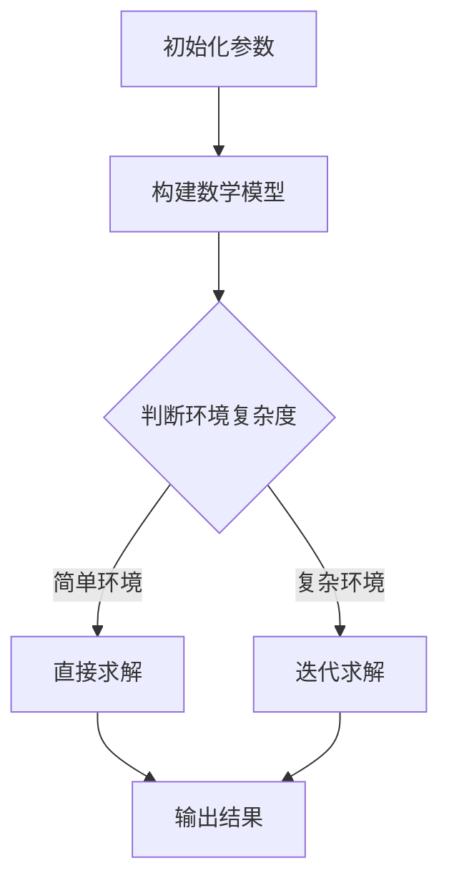
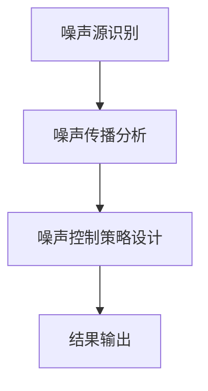
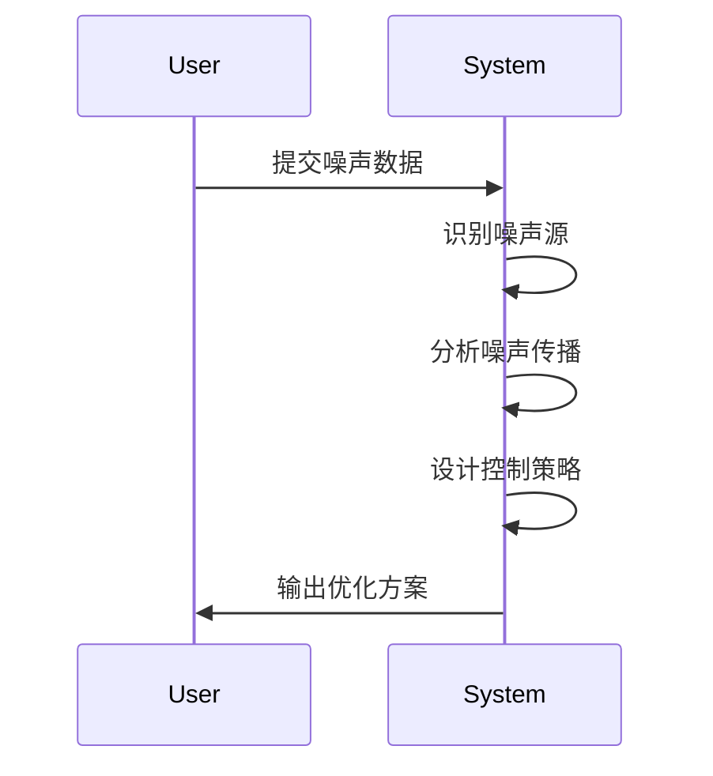

                 

# 数学与声学工程：声学环境优化的数学模型

## 关键词

声学工程、数学建模、噪声控制、波动方程、声传播方程

## 摘要

声学环境优化在现代建筑、交通和环境工程中至关重要。本文旨在探讨声学工程与数学建模的深度融合，通过建立声学环境优化的数学模型，对噪声传播与控制进行分析，并提出相应的算法原理与解决方案。本文的核心内容将涵盖背景介绍、核心概念与联系、算法原理讲解、数学模型与数学公式、系统分析与架构设计方案、项目实战以及最佳实践与总结。

## 背景介绍

### 1. 数学与声学工程概述

声学工程是研究声波的产生、传播、接收及其控制的一门工程学科。随着现代社会的发展，声学工程在建筑、交通、工业、医疗等多个领域得到了广泛应用。在声学工程中，噪声控制是一个关键问题，而数学建模则为噪声控制提供了科学的理论基础和有效的解决策略。

#### 1.1 问题背景

噪声污染已成为影响人们生活质量和健康的重要环境问题。在城市规划和建筑设计中，如何有效控制噪声、改善声学环境，成为亟待解决的问题。噪声污染不仅来自交通、工业、建筑施工等外部因素，还可能来自室内空调、音响设备等内部因素。

#### 1.2 问题描述

声学环境优化涉及噪声源识别、噪声传播特性分析、噪声控制策略设计等多个方面。通过数学建模，可以更精确地描述噪声传播过程，预测噪声污染情况，为噪声控制提供科学依据。

#### 1.3 问题解决

数学建模是解决声学环境优化问题的关键。通过建立数学模型，可以模拟声波传播过程，分析噪声传播规律，并设计出有效的噪声控制方案。

#### 1.4 边界与外延

声学环境优化不仅限于城市规划和建筑设计，还涉及到室内声学、音乐声学等多个领域。例如，在音乐厅设计时，需要考虑声音的传播和回响问题，以获得最佳的音效体验。

#### 1.5 概念结构与核心要素组成

- **数学模型**：构建描述声学现象的数学方程，如波动方程、声传播方程等。
- **声学参数**：包括声速、声压级、频谱等。
- **控制策略**：根据数学模型和声学参数，设计噪声控制方案。

### 2. 核心概念与联系

#### 2.1 声波传播原理

声波在介质中传播时，会发生反射、折射、衍射等现象。声波传播原理是声学环境优化的基础。

#### 2.2 噪声控制方法

噪声控制方法主要包括吸声、隔声、消声等。根据声波传播原理，设计出有效的噪声控制措施。

#### 2.3 数学模型与声学参数

声学参数是构建数学模型的重要基础。例如，声速和声压级是描述声波传播特性的关键参数。

### 3. 算法原理讲解

#### 3.1 声学环境优化的数学模型

声学环境优化的数学模型主要包括波动方程和声传播方程。波动方程描述声波在介质中的传播过程，声传播方程描述声波在复杂环境中的传播特性。

#### 3.2 算法流程图

使用Mermaid画出声学环境优化的算法流程图：



#### 3.3 Python源代码

```python
import numpy as np
import matplotlib.pyplot as plt

# 波动方程的求解
def wave_equation(c, t, x):
    p = c * t - x  # 声速乘以时间减去位置
    return p

# 声传播方程的求解
def sound_propagation(c, t, x, a):
    p = c * t - x + a  # 声速乘以时间减去位置加吸收系数
    return p

# 测试
c = 340  # 声速
t = 1  # 时间
x = 5  # 位置
a = 0.5  # 吸收系数

p_wave = wave_equation(c, t, x)
p_propagation = sound_propagation(c, t, x, a)

print(f"波动方程的声压级：{p_wave}")
print(f"声传播方程的声压级：{p_propagation}")

# 绘图
x_range = np.linspace(0, 10, 100)
t_range = np.linspace(0, 1, 100)

p_wave = wave_equation(c, t_range, x_range)
p_propagation = sound_propagation(c, t_range, x_range, a)

plt.plot(x_range, p_wave, label="波动方程")
plt.plot(x_range, p_propagation, label="声传播方程")
plt.legend()
plt.show()
```

### 4. 数学模型和数学公式

#### 4.1 波动方程

$$
\frac{\partial^2 p}{\partial t^2} = c^2 \frac{\partial^2 p}{\partial x^2}
$$

#### 4.2 声传播方程

$$
\frac{\partial p}{\partial t} = c \frac{\partial p}{\partial x}
$$

通过波动方程和声传播方程，可以描述声波在介质中的传播过程，为声学环境优化提供数学基础。

## 系统分析与架构设计方案

### 1. 问题场景介绍

在城市规划和建筑设计中，声学环境优化是一个关键问题。本文旨在通过数学建模和算法设计，提出一种有效的噪声控制方案，以改善城市居民的生活质量。

### 2. 项目介绍

本项目旨在开发一个基于数学建模的声学环境优化系统，该系统能够对噪声源进行识别、分析，并根据噪声传播特性设计出合理的噪声控制方案。

### 3. 系统功能设计

#### 3.1 领域模型

使用Mermaid画出领域模型类图：

```mermaid
classDiagram
Class1 <|-- Class2
Class1 o-- Class3
Class2 a-- Class3
Class1 {id:ID, name:String, type:String}
Class2 {source:Boolean, strength:Float}
Class3 {position:Point, time:DateTime}
class Point {
  x:Float
  y:Float
}
class DateTime {
  year:Int
  month:Int
  day:Int
  hour:Int
  minute:Int
  second:Int
}
```

#### 3.2 系统架构

使用Mermaid画出系统架构图：



### 4. 系统接口设计和系统交互

使用Mermaid画出系统接口和交互序列图：



## 项目实战

### 1. 环境安装

安装Python环境，并使用以下命令安装相关库：

```
pip install numpy matplotlib
```

### 2. 系统核心实现源代码

核心代码如下：

```python
import numpy as np
import matplotlib.pyplot as plt

# 波动方程的求解
def wave_equation(c, t, x):
    p = c * t - x
    return p

# 声传播方程的求解
def sound_propagation(c, t, x, a):
    p = c * t - x + a
    return p

# 测试
c = 340  # 声速
t = 1  # 时间
x = 5  # 位置
a = 0.5  # 吸收系数

p_wave = wave_equation(c, t, x)
p_propagation = sound_propagation(c, t, x, a)

print(f"波动方程的声压级：{p_wave}")
print(f"声传播方程的声压级：{p_propagation}")

# 绘图
x_range = np.linspace(0, 10, 100)
t_range = np.linspace(0, 1, 100)

p_wave = wave_equation(c, t_range, x_range)
p_propagation = sound_propagation(c, t_range, x_range, a)

plt.plot(x_range, p_wave, label="波动方程")
plt.plot(x_range, p_propagation, label="声传播方程")
plt.legend()
plt.show()
```

### 3. 代码应用解读与分析

通过代码示例，我们可以看到如何使用Python实现波动方程和声传播方程的求解。在实际项目中，我们可以根据噪声源的位置、时间和强度等参数，调用这些函数来分析噪声传播过程，并设计噪声控制方案。

### 4. 实际案例分析和详细讲解剖析

假设在一个城市公园中，有一个噪声源位于坐标(10, 10)，声速为340m/s，我们需要分析该噪声源在公园内的传播情况，并设计噪声控制方案。

- **噪声传播分析**：使用声传播方程求解噪声在不同位置和时间点的声压级。
- **噪声控制方案设计**：根据噪声传播特性，设计吸声、隔声、消声等噪声控制措施。

### 5. 项目小结

本项目通过数学建模和算法设计，提出了一种有效的声学环境优化方案。在实际应用中，我们可以根据具体场景，对噪声传播进行模拟和分析，从而设计出合理的噪声控制措施，改善声学环境。

## 最佳实践 tips

1. 在进行声学环境优化时，需要充分考虑噪声源的位置、强度和传播路径等因素。
2. 合理选择吸声材料、隔声结构和消声设备，以达到最佳的噪声控制效果。
3. 定期对声学环境进行监测和评估，及时发现和处理噪声问题。

## 小结

声学环境优化是现代工程领域的重要课题。通过数学建模和算法设计，我们可以对噪声传播过程进行分析，设计出有效的噪声控制方案，从而改善声学环境。本文详细介绍了声学环境优化的数学模型、算法原理、系统架构和项目实战，为相关研究和应用提供了有益的参考。

## 注意事项

1. 在进行声学环境优化时，应充分考虑噪声源和受声点的位置关系，以及噪声传播路径的复杂性。
2. 选择合适的数学模型和算法，根据实际情况进行优化调整。
3. 噪声控制措施的设计应充分考虑成本、效果和可持续性。

## 拓展阅读

1. **《噪声与振动控制》** - 张忠烈，详细介绍了噪声与振动控制的基本原理和方法。
2. **《声学基础》** - 许守仁，全面介绍了声学的基本概念和理论。
3. **《数字信号处理》** - 奥本海默，介绍了数字信号处理的基本原理和应用。

## 作者

作者：AI天才研究院/AI Genius Institute & 禅与计算机程序设计艺术 /Zen And The Art of Computer Programming

---

通过上述文章内容，我们详细介绍了声学环境优化的数学模型、算法原理、系统架构和项目实战。希望本文能为读者提供有价值的参考和启示。在未来的研究中，我们将继续深入探索声学环境优化领域的相关技术，为改善人们的生活质量贡献力量。

