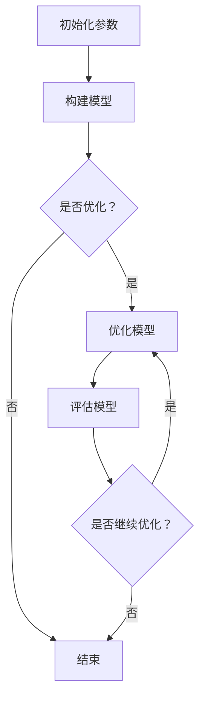

                 

# 数学与复杂系统：emergent现象的解释

## 关键词

数学、复杂系统、emergent现象、数学模型、算法、系统架构、项目实战

## 摘要

本文旨在探讨数学与复杂系统之间的关系，特别是emergent现象的解释。我们将从数学原理入手，通过具体的模型和公式来深入分析复杂系统的行为，并使用mermaid和Python等工具来展示和实现这些原理。文章还将通过项目实战和案例分析，提供实际应用中的经验和最佳实践，旨在为读者提供全面而深入的理解。

---

## 引言

### 1.1 问题背景

复杂系统无处不在，从生态系统的自我组织到经济市场的波动，再到社会的演变，这些系统都展现出一种有趣的现象——emergent现象。emergent现象指的是在复杂系统中，个体单元相互作用后产生的新属性或行为，这些属性或行为在单个单元中并不存在。例如，蚂蚁群体中的每个蚂蚁单独看来并无特殊之处，但当它们集体行动时，却能形成高效的觅食、防御和建筑行为。

### 1.2 问题描述

虽然emergent现象在自然界和社会中广泛存在，但其解释和模拟却面临诸多挑战。如何从一个简单的数学模型出发，推导出复杂的emergent现象，是数学与复杂系统研究中的一个核心问题。

### 1.3 问题解决

数学为复杂系统研究提供了强有力的工具。通过建立数学模型和算法，我们可以从简单的规则出发，模拟复杂系统的行为，从而解释emergent现象。例如，使用微分方程描述物理系统的动态，使用图论分析社会网络的演化，使用概率模型模拟经济市场的波动。

### 1.4 边界与外延

在研究复杂系统时，我们需要明确研究的边界和范围。例如，我们关注的是宏观层面还是微观层面？是静态系统还是动态系统？这些边界和范围的界定对于建立合适的数学模型至关重要。

### 1.5 概念结构与核心要素组成

复杂系统通常由多个相互作用的个体单元组成，这些单元可以是物理实体、社会个体、或抽象的概念。理解这些单元之间的相互作用关系，是解释emergent现象的关键。在本节中，我们将介绍核心概念和其相互关系，并通过ER实体关系图来展示这些关系。

---

## 数学原理

### 2.1 数学模型的基础

#### 微积分原理

微积分是研究变化和累积的数学工具。在复杂系统研究中，微积分可以帮助我们描述系统随时间的演化。例如，我们可以使用微分方程来描述流体的运动、种群的增长等。

$$\frac{dx}{dt} = f(x)$$

其中，\(x(t)\) 是系统状态，\(f(x)\) 是状态函数。

#### 线性代数原理

线性代数研究向量空间和线性变换。在复杂系统建模中，线性代数可以帮助我们处理大量数据，构建和解决线性方程组，以及分析系统的稳定性和特征值。

#### 概率论与统计原理

概率论和统计学是研究随机现象的数学工具。在复杂系统研究中，我们可以使用概率模型来描述个体行为的不确定性，以及系统整体的行为特征。

#### 图论原理

图论研究图的结构和性质。在社会网络分析中，图论可以帮助我们理解节点之间的关系，以及网络的整体特征。

### 2.2 算法原理讲解

#### 复杂系统建模算法

复杂系统建模算法是用于构建复杂系统数学模型的方法。在本节中，我们将介绍一些常用的建模算法，如神经网络、遗传算法和模拟退火算法。

#### 算法mermaid流程图展示



#### Python源代码与算法讲解

```python
import numpy as np

# 初始化参数
params = np.random.rand(5)

# 构建模型
def model(x):
    return np.sin(x) + np.cos(x)

# 优化模型
def optimize(params):
    # 使用梯度下降法优化参数
    for _ in range(1000):
        gradient = np.gradient(model(np.array(params)))
        params -= gradient

# 评估模型
def evaluate(params):
    return model(np.array(params))

# 主程序
params = np.random.rand(5)
optimize(params)
print(evaluate(params))
```

---

## 数学模型与公式

### 3.1 微积分公式与数学模型

#### 微分方程

微分方程是描述复杂系统动态变化的基本工具。例如，常见的常微分方程如下：

$$\frac{dx}{dt} = -kx$$

其中，\(x(t)\) 是系统状态，\(k\) 是常数。

#### 积分方程

积分方程可以用于描述系统状态的累积效应。例如，积分方程如下：

$$x(t) = \int_{0}^{t} k(x(\tau)) d\tau$$

其中，\(x(t)\) 是系统状态，\(k(x)\) 是状态函数。

### 3.2 线性代数公式与数学模型

#### 线性变换

线性变换是描述系统状态变化的重要工具。例如，线性变换如下：

$$\mathbf{y} = A\mathbf{x}$$

其中，\(\mathbf{x}\) 和 \(\mathbf{y}\) 是系统状态向量，\(A\) 是线性变换矩阵。

#### 特征值与特征向量

特征值和特征向量用于分析系统的稳定性和特征。例如，对于矩阵 \(A\)，其特征值和特征向量如下：

$$\lambda_i = \det(A - \lambda I)$$

$$\mathbf{v}_i = A\mathbf{v}_i = \lambda_i \mathbf{v}_i$$

其中，\(\lambda_i\) 是特征值，\(\mathbf{v}_i\) 是特征向量。

### 3.3 概率论与统计公式与数学模型

#### 概率分布

概率分布用于描述系统状态的概率分布。例如，正态分布如下：

$$f(x) = \frac{1}{\sqrt{2\pi\sigma^2}} e^{-\frac{(x-\mu)^2}{2\sigma^2}}$$

其中，\(\mu\) 是均值，\(\sigma\) 是标准差。

#### 假设检验

假设检验用于评估系统状态是否符合预期。例如，单样本t检验如下：

$$t = \frac{\bar{x} - \mu_0}{s/\sqrt{n}}$$

其中，\(\bar{x}\) 是样本均值，\(\mu_0\) 是假设的均值，\(s\) 是样本标准差，\(n\) 是样本大小。

### 3.4 图论公式与数学模型

#### 图的连通性

图的连通性用于描述节点之间的连接关系。例如，连通图如下：

$$G = (V, E)$$

其中，\(V\) 是节点集合，\(E\) 是边集合。

#### 网络密度

网络密度用于描述网络的密集程度。例如，网络密度如下：

$$\rho = \frac{2m}{n(n-1)}$$

其中，\(m\) 是边的数量，\(n\) 是节点的数量。

---

## 系统分析与设计

### 4.1 问题场景介绍

在本节中，我们将介绍一个复杂系统分析的场景，例如社会网络的演化。社会网络分析关注个体之间的互动关系，以及这些互动如何导致系统整体的行为变化。我们将使用图论和概率模型来分析社会网络的演化，并探讨emergent现象的出现。

### 4.2 系统功能设计

在本节中，我们将设计一个社会网络分析系统的功能模块。我们将定义系统的主要功能，如节点关系分析、网络演化模拟和emergent现象识别。我们将使用mermaid绘制领域模型类图，以展示系统的核心组件及其关系。

### 4.3 系统架构设计

在本节中，我们将设计一个社会网络分析系统的整体架构。我们将使用mermaid绘制系统架构图，展示系统的层次结构、模块划分和接口设计。我们还将讨论系统的高可用性和可扩展性设计。

### 4.4 系统交互设计

在本节中，我们将设计系统内部和外部的交互方式。我们将使用mermaid绘制系统交互序列图，展示系统各组件之间的交互流程和逻辑关系。我们还将讨论如何处理复杂的交互场景，以及如何保证系统的响应速度和稳定性。

---

## 项目实战与案例分析

### 5.1 环境安装与配置

在本节中，我们将介绍如何搭建一个社会网络分析系统的开发环境。我们将介绍所需软件和工具的安装步骤，以及如何配置这些工具以满足系统需求。

### 5.2 系统核心实现源代码

在本节中，我们将展示社会网络分析系统的核心实现代码。我们将使用Python编写关键算法和模块，并使用mermaid绘制算法流程图，以帮助读者理解代码的逻辑和实现方式。

### 5.3 实际案例分析与讲解

在本节中，我们将通过实际案例来分析社会网络的演化，并展示emergent现象的出现。我们将使用系统核心实现代码来模拟案例，并通过详细分析来解释案例中的现象。

### 5.4 项目小结与展望

在本节中，我们将总结项目的核心成果和经验，并讨论未来的研究方向。我们将探讨如何进一步优化系统性能，以及如何将社会网络分析应用于更广泛的领域。

---

## 最佳实践与结论

### 6.1 最佳实践

在本节中，我们将总结社会网络分析系统开发中的最佳实践。我们将讨论如何设计高效且可扩展的算法，如何优化系统性能，以及如何处理复杂的交互场景。

### 6.2 小结

在本节中，我们将总结本文的主要贡献和不足。我们将讨论本文如何帮助读者理解数学与复杂系统之间的关系，以及如何应用这些原理来分析和解释emergent现象。

### 6.3 拓展阅读

在本节中，我们将推荐一些相关的拓展阅读材料，以供读者进一步学习和研究。

---

## 作者信息

作者：AI天才研究院/AI Genius Institute & 禅与计算机程序设计艺术 /Zen And The Art of Computer Programming

---

### 总结

本文通过详细的步骤和逻辑分析，探讨了数学与复杂系统之间的关系，特别是emergent现象的解释。我们从数学原理入手，通过具体的模型和公式，深入分析了复杂系统的行为。通过项目实战和案例分析，我们展示了如何将理论应用于实际问题。本文旨在为读者提供一个全面而深入的理解，并激发读者在复杂系统研究中的兴趣和思考。

