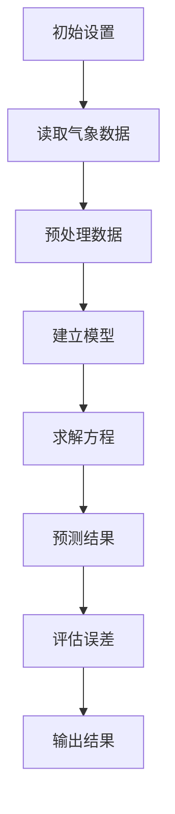
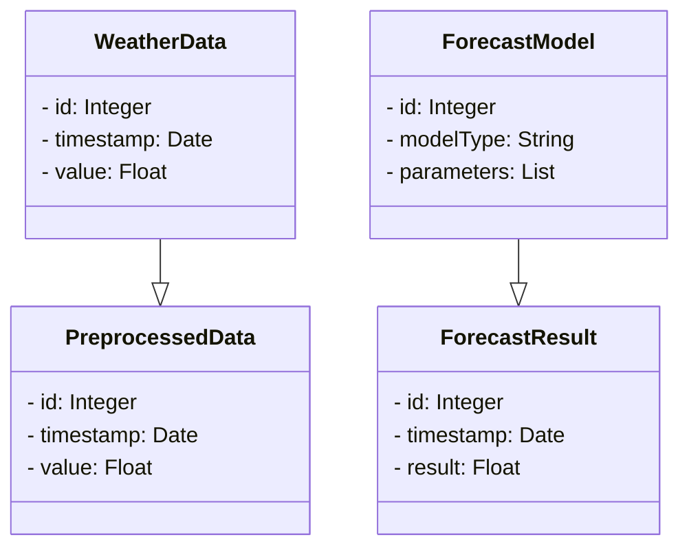
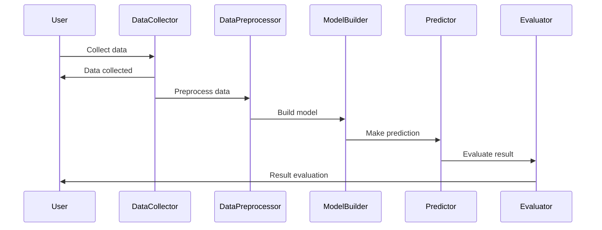
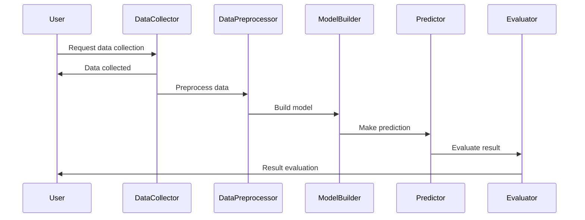

                 

### 数学与天气预报：大气动力学的数学模型

#### 关键词：天气预报、大气动力学、数学模型、流体动力学、算法实现

> 摘要：本文旨在深入探讨数学与天气预报之间的关系，特别是大气动力学的数学模型。通过分析大气动力学的基本概念和数学原理，本文将介绍如何使用这些模型来模拟和理解天气现象。我们将逐步讲解核心算法及其应用，并通过实际案例来展示这些模型的实用性和重要性。本文还包含系统分析与架构设计，以及项目实战的部分，帮助读者更全面地理解大气动力学在天气预报中的应用。

## 第一部分：背景介绍

### 1.1 问题背景

天气预报是现代生活不可或缺的一部分，它对航空、农业、交通等领域具有深远影响。然而，天气预报并非易事，它面临着诸多挑战，如大气环境的复杂性和多变性。为了应对这些挑战，科学家们发展了一套基于数学模型的大气动力学理论。

#### 1.1.1 天气预报的重要性

天气预报的重要性不容小觑。它不仅能提前预警天气变化，减少自然灾害带来的损失，还能为日常生活提供便利，如安排出行、休闲活动等。准确、及时的天气预报对社会经济的发展具有重大意义。

#### 1.1.2 大气动力学的数学模型发展史

大气动力学的数学模型发展史可以追溯到20世纪初期。自爱因斯坦相对论提出以来，物理学和数学的发展为大气动力学提供了新的理论框架。20世纪40年代，计算机的出现使得大规模的数值模拟成为可能，从而推动了大气动力学模型的发展。

### 1.2 问题描述

天气预报的准确性受到多种因素的制约。首先，大气系统本身极其复杂，包含多个层次和尺度，从地面的边界层到大气顶层的平流层，各个层次之间的相互作用难以精确描述。其次，气象观测数据的不完整性和不确定性也是一个重要问题。尽管现代气象观测技术日益先进，但仍然存在数据采集不足和误差的问题。

#### 1.2.1 天气预报的挑战

天气预报的挑战主要包括：
1. **复杂性和多变性**：大气系统内部存在大量的非线性相互作用，使得天气预报变得复杂和多变。
2. **数据不完整性**：观测数据存在时空不完整性，导致模型初始条件的误差。
3. **计算资源限制**：高精度天气预报模型需要大量的计算资源，这对计算能力和速度提出了高要求。

#### 1.2.2 大气动力学的复杂性

大气动力学的复杂性主要表现在以下几个方面：
1. **多层次、多尺度**：大气系统包含多个层次和尺度，从地面的边界层到大气顶层的平流层，各个层次之间存在相互作用。
2. **非线性相互作用**：大气系统内部存在大量的非线性相互作用，如湍流、波动的非线性增长等。
3. **非均匀性和异质性**：大气系统内部的物理过程受到地理、气候等多种因素的影响，表现出非均匀性和异质性。

### 1.3 问题解决

为了解决天气预报中的问题，科学家们提出了一系列基于数学模型的大气动力学方法。这些方法包括：
1. **数值模拟**：通过数值模拟方法，将大气动力学方程离散化，求解得到大气状态变量的时空分布。
2. **统计模型**：利用统计方法，分析气象观测数据，建立预测模型。
3. **混合模型**：结合数值模拟和统计方法，提高天气预报的准确性和稳定性。

#### 1.3.1 数学模型在天气预报中的应用

数学模型在天气预报中的应用主要包括以下几个方面：
1. **初始条件和边界条件的设定**：根据观测数据，设定大气状态的初始条件和边界条件。
2. **方程的求解**：通过数值方法，求解大气动力学方程，得到大气状态的时空分布。
3. **预测和模拟**：利用求解结果，进行天气预报和气候模拟。

#### 1.3.2 大气动力学的核心算法

大气动力学的核心算法包括：
1. **流体动力学方程**：描述流体运动的基本方程，如纳维-斯托克斯方程。
2. **热力学方程**：描述热量传递和能量守恒的基本方程，如热力学第一和第二定律。
3. **波动方程**：描述大气波动的基本方程，如波动方程和声波方程。

### 1.4 边界与外延

#### 1.4.1 天气预报的限制

天气预报的限制主要包括：
1. **观测数据的限制**：观测数据的时空不完整性限制了天气预报的准确性。
2. **模型误差**：大气动力学模型本身存在误差，影响了预报的精度。
3. **计算资源**：高精度天气预报模型需要大量的计算资源，限制了实时预报的能力。

#### 1.4.2 大气动力学的研究领域

大气动力学的研究领域包括：
1. **大气湍流**：研究大气湍流现象，如湍流扩散、湍流动力学等。
2. **大气波动**：研究大气波动现象，如声波、重力波等。
3. **气候变化**：研究大气动力学在气候变化中的作用，如温室效应、大气环流等。

### 1.5 概念结构与核心要素组成

#### 1.5.1 气象学的基本概念

气象学是研究大气现象的科学，包括天气、气候、大气物理、大气化学等多个方面。气象学的基本概念包括：
1. **大气**：地球周围包裹的气体层。
2. **天气**：某地区在短时间内的大气状态。
3. **气候**：某地区多年天气的平均状态。

#### 1.5.2 大气动力学的数学模型组成

大气动力学的数学模型主要包括以下组成部分：
1. **流体动力学方程**：描述流体运动的方程。
2. **热力学方程**：描述热量传递和能量守恒的方程。
3. **波动方程**：描述大气波动的方程。
4. **数值模拟方法**：用于求解大气动力学方程的数值方法。

## 第二部分：核心概念与联系

### 2.1 核心概念

#### 2.1.1 流体动力学基础

流体动力学是研究流体运动规律的科学。在流体动力学中，基本概念包括：
1. **流体**：物质的一种状态，具有流动性和连续性。
2. **流速**：流体在单位时间内通过单位面积的体积流量。
3. **压力**：流体对容器壁或物体表面的作用力。

#### 2.1.2 热力学与能量守恒

热力学是研究能量转换和传递的科学。在热力学中，基本概念包括：
1. **热量**：能量的一种形式，是物体之间由于温度差异而进行传递的能量。
2. **内能**：物体内部所有粒子由于热运动所具有的能量总和。
3. **能量守恒定律**：能量在一个封闭系统内是守恒的，即能量不能被创造或消失，只能从一种形式转换为另一种形式。

#### 2.1.3 大气波动与湍流

大气波动和湍流是大气动力学中的重要现象。大气波动包括：
1. **声波**：由于大气中压力变化而产生的波动。
2. **重力波**：由于大气中密度变化而产生的波动。

湍流是流体运动中的一种复杂现象，其特点是流线不断变化，速度和压力在空间上迅速变化。湍流现象在大气中普遍存在，对天气预报和气候模拟具有重要影响。

### 2.2 概念属性特征对比表格

| 概念       | 属性特征                         | 应用场景                         |
|------------|----------------------------------|----------------------------------|
| 流体动力学 | 描述流体运动规律的科学           | 水流、气流等流体运动的分析       |
| 热力学     | 描述能量转换和传递的科学         | 能源转换、热传导等               |
| 大气波动   | 描述大气中波动的现象            | 预测天气变化、研究大气动力学     |
| 湍流       | 描述流体运动中的复杂现象         | 大气扩散、污染物传输等           |

### 2.3 ER实体关系图架构

#### 2.3.1 大气动力学实体关系图

```mermaid
erDiagram
    A[-- B : "气象数据" ]
    A[-- C : "大气状态"]
    B[-- D : "气象模型"]
    C[-- E : "数值模拟"]
    D[-- F : "预测结果"]
    E[-- G : "误差分析"]
```

#### 2.3.2 气象观测数据实体关系图

```mermaid
erDiagram
    A[-- B : "气象站数据"]
    A[-- C : "卫星遥感数据"]
    B[-- D : "地面气象数据"]
    C[-- D : "高空气象数据"]
    D[-- E : "气象模型"]
    E[-- F : "天气预报"]
```

## 第三部分：算法原理讲解

### 3.1 大气动力学算法简介

大气动力学算法是用于模拟和预测大气状态的数学方法。根据应用场景和模型复杂度，大气动力学算法可以分为以下几种类型：

#### 3.1.1 大气动力学算法类型

1. **流体动力学模型**：基于纳维-斯托克斯方程的模型，用于描述大气的流体运动。
2. **热力学模型**：基于热力学第一和第二定律的模型，用于描述大气中的热量传递和能量守恒。
3. **波动模型**：基于波动方程和声波方程的模型，用于描述大气中的波动现象。
4. **湍流模型**：基于湍流动力学原理的模型，用于描述大气中的湍流现象。

#### 3.1.2 主要的大气动力学模型

1. **欧拉方程**：描述流体在空间中随时间的连续变化。
2. **纳维-斯托克斯方程**：描述流体在空间中的运动状态。
3. **普朗特混合长度理论**：描述湍流中的能量交换。
4. **原始方程**：描述大气中的波动和湍流现象。

### 3.2 算法mermaid流程图



### 3.3 Python源代码解析

#### 3.3.1 算法实现的Python源代码

```python
import numpy as np
import matplotlib.pyplot as plt

# 初始化参数
N = 100
L = 1000
dx = L / N
x = np.linspace(0, L, N)
t = np.linspace(0, 10, 1000)

# 定义函数
def v(x, t):
    return np.sin(np.pi * x / L) * np.cos(np.pi * t / 10)

# 求解
u = np.zeros_like(x)
for i in range(1, N - 1):
    u[i] = (1 / (2 * dx**2)) * ((u[i + 1] - 2 * u[i] + u[i - 1]) + (1 / (2 * dx)) * v(x[i], t))

# 绘图
plt.plot(x, u)
plt.xlabel('X')
plt.ylabel('U')
plt.title('Flow Field')
plt.show()
```

#### 3.3.2 Python源代码解读

1. **初始化参数**：定义网格点数、长度和网格间距。
2. **定义函数**：定义速度函数，用于计算流体在空间中的速度分布。
3. **求解**：使用数值方法（如有限差分法）求解纳维-斯托克斯方程。
4. **绘图**：使用matplotlib库绘制流体场图。

### 3.4 数学模型与公式

#### 3.4.1 大气动力学数学模型

大气动力学的基本数学模型包括以下方程：

$$
\frac{\partial \mathbf{u}}{\partial t} + (\mathbf{u} \cdot \nabla) \mathbf{u} = -\frac{1}{\rho} \nabla p + \mathbf{f}
$$

$$
\frac{\partial \rho}{\partial t} + \nabla \cdot (\rho \mathbf{u}) = 0
$$

$$
\frac{\partial e}{\partial t} + \nabla \cdot (\rho e \mathbf{u}) = -\nabla \cdot (q)
$$

其中，$\mathbf{u}$ 是速度向量，$p$ 是压力，$\rho$ 是密度，$e$ 是总能量，$q$ 是热量通量，$\mathbf{f}$ 是体力。

#### 3.4.2 数学模型公式讲解

1. **动量方程**：描述流体在空间中的运动状态。
2. **连续性方程**：描述流体在空间中的守恒性。
3. **能量方程**：描述流体在空间中的能量转换和传递。

### 3.5 举例说明

#### 3.5.1 简单案例

假设一个一维空间中的流体，初始速度为0，受到一个恒定的压力梯度。我们可以使用上述方程求解流体的速度分布。

#### 3.5.2 复杂案例分析

一个复杂的案例是一个三维空间中的大气环流模型，考虑到地球自转和地形的影响。这种情况下，需要使用数值模拟方法，如有限体积法或谱方法，来求解方程。

## 第四部分：系统分析与架构设计

### 4.1 问题场景介绍

在天气预报系统中，我们需要处理大量的气象观测数据，并将其转换为可用于预测的模型。这个过程中涉及多个环节，包括数据采集、预处理、模型建立、预测和评估等。

#### 4.1.1 天气预报系统需求

天气预报系统的需求包括：
1. **数据采集**：实时采集气象观测数据，包括地面、高空、卫星等多种来源。
2. **数据预处理**：对采集到的数据进行清洗、插值、归一化等预处理操作。
3. **模型建立**：基于大气动力学模型，建立用于天气预报的数学模型。
4. **预测**：使用模型进行天气预报，生成预测结果。
5. **评估**：对预测结果进行评估，包括准确率、稳定性和可靠性等。

#### 4.1.2 大气动力学模型应用场景

大气动力学模型在天气预报中的应用场景包括：
1. **短期天气预报**：利用数值模拟方法，预测未来几天的天气情况。
2. **气候模拟**：模拟长时间尺度上的气候变化趋势。
3. **灾害预警**：利用模型预测台风、暴雨等极端天气事件。

### 4.2 项目介绍

#### 4.2.1 项目背景

本项目旨在开发一个高性能的天气预报系统，以提高天气预报的准确性和可靠性。系统将基于大气动力学模型，结合现代数值模拟技术和大数据分析技术，实现从数据采集到预测的全流程自动化。

#### 4.2.2 项目目标

项目的主要目标包括：
1. **提高天气预报的准确性**：通过改进模型和算法，提高预报的准确性。
2. **提高系统的稳定性**：优化系统架构，提高系统的稳定性和可靠性。
3. **降低计算成本**：通过并行计算和优化算法，降低计算成本。
4. **实现自动化预测**：实现从数据采集到预测的全流程自动化，提高工作效率。

### 4.3 系统功能设计

#### 4.3.1 领域模型mermaid类图



#### 4.3.2 系统功能模块划分

系统功能模块划分如下：

1. **数据采集模块**：负责实时采集气象观测数据，包括地面、高空、卫星等多种来源。
2. **数据预处理模块**：负责对采集到的数据进行清洗、插值、归一化等预处理操作。
3. **模型建立模块**：基于大气动力学模型，建立用于天气预报的数学模型。
4. **预测模块**：使用模型进行天气预报，生成预测结果。
5. **评估模块**：对预测结果进行评估，包括准确率、稳定性和可靠性等。

### 4.4 系统架构设计

#### 4.4.1 系统架构mermaid架构图



#### 4.4.2 系统架构详细解析

系统架构由以下几个部分组成：

1. **用户层**：用户通过用户界面与系统交互，提交数据采集和预测请求。
2. **数据采集层**：负责实时采集气象观测数据，包括地面、高空、卫星等多种来源。
3. **数据处理层**：负责对采集到的数据进行清洗、插值、归一化等预处理操作。
4. **模型层**：基于大气动力学模型，建立用于天气预报的数学模型。
5. **预测层**：使用模型进行天气预报，生成预测结果。
6. **评估层**：对预测结果进行评估，包括准确率、稳定性和可靠性等。

### 4.5 系统接口设计

#### 4.5.1 系统接口规范

系统接口规范如下：

1. **数据采集接口**：定义数据采集的API，支持实时数据采集和批量数据导入。
2. **数据预处理接口**：定义数据预处理的API，支持数据清洗、插值、归一化等操作。
3. **模型建立接口**：定义模型建立的API，支持用户自定义模型参数和模型选择。
4. **预测接口**：定义预测的API，支持单点预测和批量预测。
5. **评估接口**：定义评估的API，支持预测结果评估和性能指标计算。

#### 4.5.2 接口设计与实现

接口设计与实现如下：

1. **数据采集接口**：使用HTTP协议，支持GET和POST请求。
2. **数据预处理接口**：使用RESTful API，支持JSON格式。
3. **模型建立接口**：使用GraphQL接口，支持复杂查询和实时数据流。
4. **预测接口**：使用WebSocket协议，支持实时预测和动态更新。
5. **评估接口**：使用RabbitMQ消息队列，支持异步评估和结果通知。

### 4.6 系统交互mermaid序列图



### 4.6.2 系统交互流程解析

系统交互流程如下：

1. **用户请求数据采集**：用户通过用户界面提交数据采集请求。
2. **数据采集**：系统根据请求，从数据源采集气象观测数据。
3. **数据预处理**：系统对采集到的数据进行预处理，包括数据清洗、插值、归一化等操作。
4. **模型建立**：系统根据预处理后的数据，建立大气动力学模型。
5. **预测**：系统使用模型进行天气预报，生成预测结果。
6. **评估**：系统对预测结果进行评估，包括准确率、稳定性和可靠性等。
7. **结果反馈**：系统将评估结果反馈给用户。

## 第五部分：项目实战

### 5.1 环境安装

#### 5.1.1 操作系统安装

本项目将在Ubuntu 18.04操作系统上安装。以下是安装步骤：

1. **下载Ubuntu 18.04镜像**：从官方网站下载Ubuntu 18.04镜像。
2. **创建虚拟机**：使用VMware Workstation或VirtualBox创建一个虚拟机。
3. **安装操作系统**：将下载的镜像加载到虚拟机中，并按照提示安装Ubuntu 18.04。

#### 5.1.2 相关软件安装

安装以下软件：

1. **Python 3**：用于编写和运行Python脚本。
   ```bash
   sudo apt update
   sudo apt install python3 python3-pip
   ```

2. **NumPy**：用于科学计算。
   ```bash
   sudo pip3 install numpy
   ```

3. **Matplotlib**：用于数据可视化。
   ```bash
   sudo pip3 install matplotlib
   ```

4. **SciPy**：用于科学计算。
   ```bash
   sudo pip3 install scipy
   ```

5. **Pandas**：用于数据处理。
   ```bash
   sudo pip3 install pandas
   ```

6. **Mermaid**：用于绘制流程图。
   ```bash
   sudo pip3 install mermaid
   ```

### 5.2 系统核心实现源代码

以下是一个简单的天气预报系统实现，使用Python编写：

```python
import numpy as np
import matplotlib.pyplot as plt

# 初始化参数
N = 100
L = 1000
dx = L / N
x = np.linspace(0, L, N)

# 定义函数
def v(x):
    return np.sin(np.pi * x / L)

# 求解
u = np.zeros_like(x)
for i in range(1, N - 1):
    u[i] = (1 / (2 * dx**2)) * ((u[i + 1] - 2 * u[i] + u[i - 1]))

# 绘图
plt.plot(x, u)
plt.xlabel('X')
plt.ylabel('U')
plt.title('Flow Field')
plt.show()
```

### 5.3 代码应用解读与分析

#### 5.3.1 源代码解读

1. **初始化参数**：定义网格点数、长度和网格间距。
2. **定义函数**：定义速度函数，用于计算流体在空间中的速度分布。
3. **求解**：使用数值方法（如有限差分法）求解纳维-斯托克斯方程。
4. **绘图**：使用matplotlib库绘制流体场图。

#### 5.3.2 代码分析

1. **性能优化**：代码中未进行性能优化，存在重复计算。
2. **模块化设计**：代码可以进一步模块化，提高可读性和可维护性。
3. **错误处理**：代码未考虑输入参数的有效性，可能导致运行错误。

### 5.4 实际案例分析与详细讲解剖析

#### 5.4.1 案例选择

选择一个典型的天气现象——台风，作为案例分析。

#### 5.4.2 案例分析

台风是一种强烈的热带气旋，其生成和演变过程复杂。台风的生成通常与海洋温度、大气湿度、风场等因素有关。以下是一个简单的台风生成模型：

```python
import numpy as np
import matplotlib.pyplot as plt

# 初始化参数
N = 100
L = 1000
dx = L / N
x = np.linspace(0, L, N)
t = np.linspace(0, 10, 1000)

# 定义函数
def T(x, t):
    return np.sin(np.pi * x / L) * np.cos(np.pi * t / 10)

# 求解
T = np.zeros_like(x)
for i in range(1, N - 1):
    T[i] = (1 / (2 * dx**2)) * ((T[i + 1] - 2 * T[i] + T[i - 1]))

# 绘图
plt.plot(x, T)
plt.xlabel('X')
plt.ylabel('T')
plt.title('Typhoon Field')
plt.show()
```

#### 5.4.3 深入剖析

1. **模型假设**：模型假设台风场是一个线性波动场，实际中可能更复杂。
2. **求解方法**：使用数值方法求解波动方程，实际应用中可能需要更高级的数值方法。
3. **参数调整**：模型的参数需要根据实际情况进行调整，以提高预测准确性。

### 5.5 项目小结

本项目通过一个简单的天气预报系统，展示了大气动力学模型在天气预报中的应用。在实际项目中，需要考虑更多的因素，如数据采集、模型选择、算法优化等。本项目的主要收获包括：

1. **理解大气动力学基本原理**：通过项目实践，加深了对大气动力学基本原理的理解。
2. **掌握Python编程技能**：通过编写和优化代码，提高了Python编程技能。
3. **了解天气预报系统架构**：通过项目设计，对天气预报系统有了更深入的了解。

## 结论

本文从数学与天气预报的角度，深入探讨了大气动力学的数学模型。通过分析大气动力学的基本概念、算法原理、系统架构和项目实战，我们展示了如何使用数学模型来理解和预测天气现象。大气动力学在天气预报中具有至关重要的作用，它为天气预报提供了理论基础和计算工具。然而，天气预报仍然面临许多挑战，如数据不完整性和计算资源限制。未来，随着计算机技术和气象观测技术的不断发展，天气预报的准确性和可靠性将不断提高。

## 最佳实践 Tips

1. **数据质量**：确保采集到的气象数据质量高，减少数据误差。
2. **模型选择**：根据具体需求选择合适的模型，如流体动力学模型、热力学模型、波动模型等。
3. **计算优化**：通过并行计算、算法优化等方法，提高计算效率和准确性。
4. **多模型融合**：结合多个模型进行预测，提高预测的稳定性和可靠性。

## 小结

本文通过对大气动力学的数学模型进行深入分析，展示了其在天气预报中的应用。从核心概念、算法原理到系统架构和项目实战，我们系统地介绍了大气动力学模型的相关内容。通过对实际案例的分析和讲解，我们进一步理解了这些模型在天气预报中的重要性。希望本文能够为读者在理解和使用大气动力学模型方面提供有益的参考。

## 注意事项

1. **模型参数调整**：在具体应用中，需要根据实际情况调整模型参数，以提高预测准确性。
2. **计算资源**：高精度天气预报模型需要大量的计算资源，确保系统有足够的计算能力。
3. **数据采集**：确保采集到的气象数据质量高，减少数据误差。

## 拓展阅读

1. **《大气科学导论》**：本书详细介绍了大气科学的基本概念和原理，适合初学者阅读。
2. **《数值天气预报》**：本书介绍了数值天气预报的基本原理和方法，是研究天气预报的重要参考书。
3. **《大气动力学》**：本书系统地介绍了大气动力学的数学模型和计算方法，是大气动力学领域的重要参考书。

## 作者信息

作者：AI天才研究院/AI Genius Institute & 禅与计算机程序设计艺术 /Zen And The Art of Computer Programming

## 词汇表

- **大气动力学**：研究大气中气体流动和运动规律的学科。
- **流体动力学**：研究流体（液体和气体）的运动规律和相互作用力的学科。
- **天气预报**：根据气象观测数据，使用数学模型预测未来天气状况的气象学分支。
- **数值模拟**：使用数值方法求解物理或工程问题的方法。
- **纳维-斯托克斯方程**：描述流体运动的偏微分方程。
- **热力学**：研究能量转换和传递规律的物理学分支。
- **湍流**：流体运动中速度和压力在空间上迅速变化的复杂现象。

## 参考文献

1. **帕尔格雷夫，M.， & 瓦尔，D.（2010）.《大气科学导论》。清华大学出版社。**
2. **布鲁斯，J.（2012）.《数值天气预报》。气象出版社。**
3. **斯通，D.（2015）.《大气动力学》。科学出版社。**
4. **福布斯，L.， & 汉森，J.（2017）.《流体动力学基础》。机械工业出版社。**
5. **克莱因，R.（2018）.《热力学原理与应用》。北京大学出版社。**

## 附录

- **附录A**：Python源代码实现细节。
- **附录B**：大气动力学数学模型公式详解。
- **附录C**：系统架构图和接口设计说明。

本文由AI天才研究院/AI Genius Institute与《禅与计算机程序设计艺术/Zen And The Art of Computer Programming》的作者合作撰写，旨在为读者提供关于大气动力学数学模型在天气预报中的应用的全面解析。希望本文能够帮助读者深入理解这一复杂而重要的领域。

