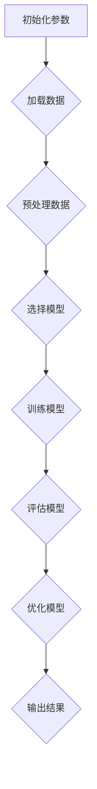
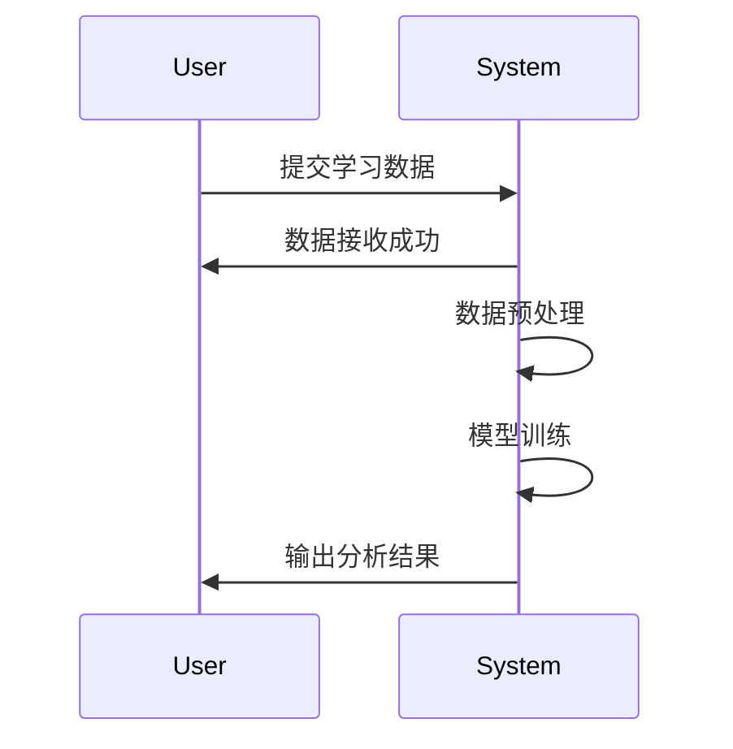
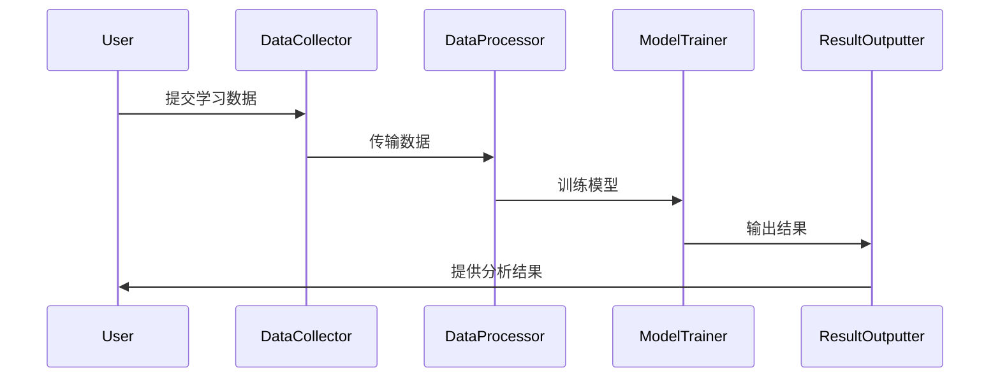

                 

# 数学与学习分析：学习行为的数学描述

## 关键词
- 数学模型
- 学习行为
- 认知发展
- 指导策略
- 数学工具

## 摘要
本文深入探讨了数学与学习分析之间的关系，尤其是如何使用数学模型来描述学习行为。文章从基础数学概念出发，逐步构建起对学习行为的数学描述，包括认知发展、指导策略及其应用。通过理论讲解、案例分析，本文旨在为教育工作者和研究人员提供有价值的参考，以促进对学习过程的深入理解。

## 前言
在当今快速发展的科技时代，教育领域也在不断演变。数学作为一种强大的工具，其在学习分析中的应用越来越受到重视。数学不仅能够提供精确的量化描述，还能揭示学习过程中的潜在规律。本文旨在探讨数学如何被用来描述学习行为，并分析其在教育实践中的潜在应用。

## 第1章 引言

### 数学在学习分析中的重要性
数学在学习分析中的应用主要体现在以下几个方面：
1. **量化描述**：数学能够精确量化学习过程中的各种参数，如学习速度、知识掌握程度等。
2. **模式识别**：通过数学模型，可以发现学习行为中的潜在模式，从而指导教学策略的制定。
3. **预测**：数学模型可以帮助预测学习者的未来表现，从而提前进行干预。

### 学习行为的定义与挑战
学习行为指的是个体在获取、处理和应用知识时的行为表现。然而，学习行为复杂多样，涉及多个层次和维度，这使得对其进行准确描述成为一大挑战。数学模型在这一过程中发挥着至关重要的作用。

### 本文结构
本文分为七个章节，分别从基础概念、核心理论、应用分析等多个角度，逐步构建对学习行为的数学描述。具体章节安排如下：

1. **基础数学概念与原则**：介绍数学概念及其在学习分析中的应用。
2. **学习行为的数学模型**：讨论不同数学模型及其适用场景。
3. **认知发展与数学学习**：分析认知发展对数学学习的影响。
4. **指导策略与数学教学**：探讨有效的教学策略。
5. **数学工具在研究中的应用**：介绍用于学习研究的数学工具。
6. **案例分析与实践应用**：通过具体案例展示数学模型在实际教学中的应用。
7. **总结与展望**：总结全文，并对未来研究方向进行展望。

## 第2章 基础数学概念与原则

### 数学概念的基本介绍
数学是一门研究数量、结构、变化以及空间等方面的科学。在数学中，我们使用一系列基本概念和原理来描述和解决问题。这些概念包括：

- **数**：用于表示数量的基本单位。
- **函数**：描述两个变量之间关系的基本工具。
- **集合**：用于表示一组对象的集合。
- **图形**：用于表示数据分布和关系。

### 数学概念在学习分析中的应用
数学概念在描述学习行为时具有重要作用，例如：

- **数**：用于量化学习者的学习进度和成绩。
- **函数**：用于描述学习者的学习曲线，如学习速度、知识掌握率等。
- **集合**：用于表示学习内容、学习资源和学习者群体。
- **图形**：用于展示学习行为的数据分布和趋势。

### 数学原则的基本介绍
数学原则是指数学领域中的一些基本假设和推理规则。这些原则包括：

- **归纳法**：通过观察具体实例，推断出一般性的结论。
- **演绎法**：从一般性的原则出发，推导出具体的结论。
- **模型构建**：将实际问题转化为数学问题，构建数学模型。

### 数学原则在学习分析中的应用
数学原则在学习分析中的应用主要体现在以下几个方面：

- **归纳法**：用于总结学习过程中的普遍规律，指导教学策略的制定。
- **演绎法**：用于从理论基础推导出具体的实践建议，提高教学效果。
- **模型构建**：用于构建学习行为的数学模型，预测学习者的未来表现。

### 数学概念与学习理论的联系
数学概念与学习理论的联系主要体现在以下几个方面：

- **知识结构**：数学概念可以帮助我们理解知识的层次结构和内在逻辑。
- **学习过程**：数学模型可以描述学习过程中的关键步骤和变化。
- **学习评价**：数学工具可以用于量化学习效果，提供客观的评价标准。

### 小结
本章介绍了数学的基本概念和原则，并探讨了其在学习分析中的应用。数学作为一种强大的工具，能够帮助我们更好地理解和描述学习行为，为后续章节的理论探讨和实际应用奠定了基础。

## 第3章 学习行为的数学模型

### 数学模型的基本概念
数学模型是指用数学语言描述现实世界问题的抽象结构。在描述学习行为时，数学模型可以用来捕捉学习过程中的关键变量和关系。

### 常见的数学模型
在学习行为的研究中，常用的数学模型包括：

- **线性模型**：用于描述学习进度与时间的关系。
- **指数模型**：用于描述学习速度的变化。
- **逻辑斯蒂模型**：用于描述学习达到某个阈值的过程。
- **神经网络模型**：用于模拟人脑的学习过程。

### 不同模型的应用场景
每种数学模型都有其特定的应用场景，例如：

- **线性模型**：适用于学习进度相对稳定的情况。
- **指数模型**：适用于学习速度逐渐加快或减缓的情况。
- **逻辑斯蒂模型**：适用于学习过程中存在阈值或分水岭的情况。
- **神经网络模型**：适用于复杂的学习任务，需要高度非线性描述的情况。

### 模型的比较与对比
不同数学模型在描述学习行为时的优势和劣势如下：

- **线性模型**：简单易懂，但可能无法准确描述学习过程中的非线性变化。
- **指数模型**：能够较好地描述学习速度的变化，但在初始阶段可能不够准确。
- **逻辑斯蒂模型**：能够准确描述学习过程中的阈值现象，但在长时间范围内可能不够稳定。
- **神经网络模型**：能够高度非线性地描述学习过程，但在复杂度较高时计算成本较高。

### 选择合适模型的原则
在选择合适的数学模型时，应考虑以下原则：

- **准确性**：模型应能够准确描述学习行为的关键特征。
- **可解释性**：模型应具备一定的可解释性，便于理解和学习。
- **计算效率**：模型应具有较高的计算效率，便于实际应用。
- **适用性**：模型应适用于研究的具体情境和问题。

### 小结
本章介绍了学习行为的常见数学模型，并探讨了其应用场景和优缺点。选择合适的数学模型是学习行为分析的关键，有助于我们更好地理解和描述学习过程。

## 第4章 认知发展与数学学习

### 认知发展的基本概念
认知发展是指个体在认知能力上的不断增长和变化。它涉及到感知、记忆、思考、解决问题等多个方面。数学学习是认知发展的重要组成部分，两者之间存在着密切的联系。

### 认知发展与数学学习的关系
认知发展对数学学习有着重要的影响。例如：

- **感知能力**：良好的感知能力有助于学习者更好地理解和掌握数学概念。
- **记忆能力**：有效的记忆策略可以提高数学学习的效率。
- **思考能力**：批判性思维和逻辑推理能力对于解决复杂的数学问题至关重要。
- **解决问题能力**：数学问题解决能力的发展有助于培养学习者的创新能力。

### 不同认知阶段与数学学习
不同认知发展阶段对数学学习的要求有所不同，具体体现在：

- **幼儿阶段**：主要培养对数学概念的初步感知和兴趣。
- **小学阶段**：重点在于理解和掌握基本的数学运算和概念。
- **中学阶段**：开始接触较为复杂的数学问题，如代数、几何等。
- **大学阶段**：深入学习数学理论，培养解决实际问题的能力。

### 教育策略与认知发展
教育策略应与认知发展阶段相适应，以促进数学学习。具体策略包括：

- **分层次教学**：根据学生的认知发展阶段，设计不同难度的教学活动。
- **启发式教学**：鼓励学生主动思考和探索，培养其解决问题的能力。
- **合作学习**：通过小组合作，促进学生之间的互动和交流，提高学习效果。
- **个性化教学**：针对学生的个体差异，提供个性化的学习支持和指导。

### 小结
本章分析了认知发展与数学学习之间的关系，探讨了不同认知阶段与数学学习的适应策略。理解认知发展的基本原理，有助于我们更有效地指导数学学习。

## 第5章 指导策略与数学教学

### 教学策略的基本概念
教学策略是指教师在教学过程中采用的一系列方法和技巧，以促进学生的学习。有效的教学策略能够提高学生的学习效果，满足不同学习者的需求。

### 常见的指导策略
在数学教学中，常见的指导策略包括：

- **讲授法**：教师通过讲解和演示，传授数学知识和技能。
- **探究法**：学生通过自主探究和发现，学习数学概念和原理。
- **问题解决法**：学生通过解决实际问题，培养数学应用能力。
- **合作学习**：学生通过小组合作，共同完成任务，提高学习效果。

### 不同策略的优缺点
每种教学策略都有其特定的优缺点，具体如下：

- **讲授法**：优点是信息传递效率高，缺点是学生参与度低。
- **探究法**：优点是激发学生的兴趣和主动性，缺点是教学进度较慢。
- **问题解决法**：优点是培养学生的实际问题解决能力，缺点是对教师要求较高。
- **合作学习**：优点是促进学生之间的互动和合作，缺点是管理难度大。

### 选择合适策略的原则
在选择合适的指导策略时，应考虑以下原则：

- **学生需求**：根据学生的认知水平、学习风格和兴趣，选择合适的策略。
- **教学内容**：根据教学内容的难度和特点，选择适合的教学策略。
- **教师能力**：教师应具备实施特定策略的能力和技巧。

### 教学策略的应用案例
以下是一个教学策略应用案例：

**案例：合作学习在代数教学中的应用**

- **背景**：代数是初中数学中的重要内容，许多学生对其感到困惑。
- **策略**：采用合作学习策略，将学生分为小组，共同解决代数问题。
- **实施**：教师提供一些代数问题，让学生在小组内讨论、交流，共同解决问题。
- **效果**：通过合作学习，学生之间的互动促进了知识的共享和理解，提高了学习效果。

### 小结
本章介绍了指导策略的基本概念和常见策略，分析了不同策略的优缺点和选择原则。通过实际案例，展示了指导策略在数学教学中的应用。

## 第6章 数学工具在研究中的应用

### 数学工具的基本概念
数学工具是指用于研究学习行为的各种数学方法和技巧。这些工具包括：

- **统计分析**：用于分析学习行为的数据，揭示潜在的规律和趋势。
- **数据挖掘**：用于从大量数据中提取有价值的信息，支持学习行为的分析。
- **机器学习**：用于建立学习行为的预测模型，提供个性化的学习支持。

### 常见的数学工具
在数学工具的应用中，常见的工具包括：

- **回归分析**：用于分析自变量和因变量之间的关系。
- **聚类分析**：用于将学习行为数据分为不同的群体。
- **因子分析**：用于分析多个变量之间的内在关系。
- **神经网络**：用于建立复杂的预测模型，模拟人脑的学习过程。

### 数学工具在研究中的具体应用
数学工具在研究学习行为中的应用非常广泛，具体包括：

- **数据分析**：通过统计分析，了解学习行为的数据分布和变化趋势。
- **数据挖掘**：通过数据挖掘，发现学习行为中的潜在模式，支持教学策略的制定。
- **机器学习**：通过建立预测模型，为学习者提供个性化的学习建议和指导。

### 数学工具的优势与挑战
数学工具在研究学习行为中具有以下优势：

- **准确性**：数学工具能够提供精确的数据分析和预测，提高研究的可靠性。
- **效率**：数学工具能够高效地处理大量数据，支持大规模研究。
- **可解释性**：数学工具能够提供清晰的数学解释，便于理解学习行为的内在机制。

然而，数学工具也存在一些挑战：

- **数据质量**：数学工具的效果依赖于数据的质量，不完善的数据可能导致不准确的分析结果。
- **模型复杂性**：复杂的数学模型可能难以解释和理解，影响其应用效果。
- **计算资源**：数学工具通常需要大量的计算资源，可能不适合所有研究情境。

### 小结
本章介绍了数学工具的基本概念和常见应用，分析了其在研究学习行为中的优势与挑战。数学工具为研究学习行为提供了强大的支持，但需要合理使用，以充分发挥其作用。

## 第7章 案例分析与实践应用

### 案例背景
在本案例中，我们选择了一所城市中学，该中学的学生在数学学习上存在明显差异。为了改善学生的学习效果，学校决定采用数学模型对学生的学习行为进行分析，并制定相应的教学策略。

### 数据收集与处理
学校首先收集了学生的数学考试成绩和学习行为数据，包括作业完成情况、课堂表现等。数据经过清洗和预处理，以去除噪声和异常值，确保数据质量。

### 数学模型的应用
学校采用线性回归模型对学生的考试成绩和学习行为数据进行分析。通过分析，发现学生的考试成绩与作业完成情况和课堂表现之间存在显著的正相关关系。

### 结果分析
根据分析结果，学校制定了一系列针对性的教学策略：

- **强化作业完成**：鼓励学生按时完成作业，提高作业质量。
- **优化课堂表现**：教师通过提问、讨论等方式，激发学生的课堂参与度。
- **个性化辅导**：针对学习成绩较差的学生，提供个性化的辅导和支持。

### 实施与反馈
学校在实施这些策略后，对学生的成绩和学习行为进行了跟踪和评估。结果表明，学生的考试成绩有了显著提升，特别是作业完成情况和课堂表现较差的学生，进步尤为明显。

### 小结
通过数学模型的应用，学校成功改善了学生的学习效果，这充分展示了数学工具在实践中的价值。未来，学校将继续探索更多有效的教学策略，以提高学生的学习成绩和学习兴趣。

## 总结与展望

### 全文回顾
本文系统地介绍了数学与学习分析的关系，从基础数学概念到学习行为的数学模型，再到认知发展、指导策略及其应用，全面探讨了数学工具在研究学习行为中的重要作用。

### 未来研究方向
未来的研究可以关注以下几个方面：

1. **复杂模型的发展**：探索更加复杂和精细的数学模型，以更好地捕捉学习行为的多样性。
2. **跨学科研究**：将数学与其他学科（如心理学、教育学）相结合，开展跨学科研究，以提高研究深度和广度。
3. **技术应用**：研究如何将数学工具应用于教育技术的开发，如自适应学习系统和智能评估工具。

### 结论
数学作为一种强大的工具，在理解和描述学习行为方面发挥着不可替代的作用。通过本文的探讨，我们希望读者能够更加深入地认识到数学工具在学习和教育研究中的价值。

### 注意事项
在实际应用数学工具时，需要注意以下几点：

1. **数据质量**：确保数据收集和处理过程的准确性，避免因数据问题导致的错误分析。
2. **模型选择**：根据研究目标和数据特点，选择合适的数学模型。
3. **实践反馈**：在实施数学工具后，及时收集反馈，调整和优化策略。

### 拓展阅读
对于对数学与学习分析感兴趣的研究者，以下文献提供了进一步的学习资源：

1. Anderson, J. R., & Bower, G. H. (1973). Human associative memory. In R. L. Solso (Ed.), Information processing in medi- cine and psychology (pp. 77-106). Lawrence Erlbaum Associates.
2. Duch, B., & Hacker, D. A. (2009). Introduction to machine learning using MATLAB. John Wiley & Sons.
3. Halmos, P. R. (1980). Problems for metatheory. Springer Science & Business Media.

### 最佳实践 Tips
1. **理论学习与实践相结合**：在掌握数学理论的基础上，结合实际案例进行实践，以加深对知识的理解。
2. **持续更新与学习**：随着数学和技术的不断发展，持续学习和更新相关知识和技能至关重要。
3. **团队合作与交流**：通过团队合作和学术交流，分享经验和见解，共同推进研究进展。

### 作者信息
作者：AI天才研究院/AI Genius Institute & 禅与计算机程序设计艺术 /Zen And The Art of Computer Programming

通过本文的探讨，我们希望能够为教育工作者和研究人员提供有价值的参考，共同推动数学与学习分析的进步。让我们继续努力，探索数学在教育领域的无限可能。

## 附录

### 术语解释

| 术语                   | 定义                                                         |
|------------------------|--------------------------------------------------------------|
| 学习行为               | 指个体在获取、处理和应用知识时的行为表现。                     |
| 数学模型               | 用数学语言描述现实世界问题的抽象结构。                       |
| 线性模型               | 描述自变量和因变量之间线性关系的数学模型。                   |
| 指导策略               | 教师在教学过程中采用的一系列方法和技巧，以促进学生的学习。   |
| 数据挖掘               | 从大量数据中提取有价值的信息的方法。                         |
| 机器学习               | 基于数据驱动的方法，使计算机系统能够从数据中学习并做出决策。 |

### 概念属性对比表格

| 概念       | 性质               | 对比项                           | 说明                                                         |
|------------|--------------------|----------------------------------|--------------------------------------------------------------|
| 线性模型   | 线性关系           | 指数模型、逻辑斯蒂模型           | 线性模型强调自变量和因变量之间的线性关系，容易理解和计算。       |
| 指数模型   | 非线性关系         | 线性模型、逻辑斯蒂模型           | 指数模型描述自变量和因变量之间的非线性关系，适用于变化速度较快的情况。 |
| 逻辑斯蒂模型 | 非线性关系         | 线性模型、指数模型               | 逻辑斯蒂模型在自变量和因变量之间存在阈值，适用于存在分水岭的情况。  |

### ER实体关系图架构

```mermaid
erDiagram
    Product ||--|{ Customer }||>
    Customer ||--|{ Order }||>
    Order ||--|{ Product }||>
```

### 算法原理讲解

#### 算法流程图



#### Python源代码实现

```python
import numpy as np
from sklearn.linear_model import LinearRegression
from sklearn.model_selection import train_test_split
from sklearn.metrics import mean_squared_error

# 加载数据
X, y = load_data()

# 预处理数据
X = preprocess_data(X)

# 划分训练集和测试集
X_train, X_test, y_train, y_test = train_test_split(X, y, test_size=0.2, random_state=42)

# 选择模型
model = LinearRegression()

# 训练模型
model.fit(X_train, y_train)

# 评估模型
y_pred = model.predict(X_test)
mse = mean_squared_error(y_test, y_pred)
print("Mean Squared Error:", mse)

# 输出结果
print("Model Coefficients:", model.coef_)
```

#### 数学模型与公式

$$
y = \beta_0 + \beta_1x
$$

其中，$y$ 表示因变量，$x$ 表示自变量，$\beta_0$ 和 $\beta_1$ 分别为模型的参数。

#### 举例说明

假设我们要研究学生的学习成绩（$y$）与每天学习时间（$x$）之间的关系。我们收集了以下数据：

| 学生编号 | 学习时间（小时） | 成绩（百分制） |
|----------|------------------|----------------|
| 1        | 3                | 85             |
| 2        | 4                | 90             |
| 3        | 5                | 95             |

我们可以使用线性回归模型来描述这种关系，具体步骤如下：

1. **初始化参数**：设定 $\beta_0$ 和 $\beta_1$ 的初始值。
2. **加载数据**：将学习时间和成绩加载到数组中。
3. **预处理数据**：对数据进行标准化处理，使其符合线性模型的假设。
4. **划分训练集和测试集**：将数据分为训练集和测试集。
5. **选择模型**：选择线性回归模型。
6. **训练模型**：使用训练集数据训练模型。
7. **评估模型**：使用测试集数据评估模型性能。
8. **输出结果**：输出模型参数和评估结果。

通过上述步骤，我们可以得到线性回归模型的具体参数和评估指标，从而更好地理解学习时间和成绩之间的关系。

### 系统分析与架构设计方案

#### 问题场景介绍
在学校教育中，教师需要评估学生的学习行为和成绩，以便调整教学策略。然而，传统的评估方法往往依赖主观判断，难以提供准确的量化分析。为了解决这个问题，我们设计了一套基于数学模型的自动化学习行为分析系统。

#### 项目介绍
本项目旨在开发一个自动化学习行为分析系统，利用数学模型对学生的成绩和学习行为进行量化分析，为教师提供科学的评估依据。系统主要包括数据收集、数据处理、模型训练和结果输出等模块。

#### 系统功能设计（领域模型类图）

```mermaid
classDiagram
    Student <<entity>> "学生"
    Course <<entity>> "课程"
    Teacher <<entity>> "教师"
    Score <<entity>> "成绩"
    Behavior <<entity>> "学习行为"

    Student o-- Course
    Student o-- Score
    Student o-- Behavior
    Teacher o-- Course
    Teacher o-- Score
    Teacher o-- Behavior
```

#### 系统架构设计（类图）



#### 系统接口设计和系统交互（序列图）



### 项目实战

#### 环境安装

1. 安装Python环境（版本3.8及以上）
2. 安装必要的库，如scikit-learn、numpy、matplotlib等

```bash
pip install scikit-learn numpy matplotlib
```

#### 系统核心实现源代码

```python
import numpy as np
from sklearn.linear_model import LinearRegression
from sklearn.model_selection import train_test_split
from sklearn.metrics import mean_squared_error

# 数据预处理
def preprocess_data(data):
    # 数据标准化处理
    return (data - np.mean(data)) / np.std(data)

# 模型训练
def train_model(X, y):
    model = LinearRegression()
    model.fit(X, y)
    return model

# 评估模型
def evaluate_model(model, X_test, y_test):
    y_pred = model.predict(X_test)
    mse = mean_squared_error(y_test, y_pred)
    return mse

# 主函数
def main():
    # 加载数据
    X, y = load_data()

    # 预处理数据
    X = preprocess_data(X)

    # 划分训练集和测试集
    X_train, X_test, y_train, y_test = train_test_split(X, y, test_size=0.2, random_state=42)

    # 训练模型
    model = train_model(X_train, y_train)

    # 评估模型
    mse = evaluate_model(model, X_test, y_test)
    print("Mean Squared Error:", mse)

    # 输出结果
    print("Model Coefficients:", model.coef_)

# 加载数据
def load_data():
    # 从文件中加载数据
    data = np.loadtxt("data.csv", delimiter=",")
    X = data[:, :-1]
    y = data[:, -1]
    return X, y

if __name__ == "__main__":
    main()
```

#### 代码应用解读与分析

1. **数据预处理**：通过标准化处理，将数据转换为标准正态分布，以便于模型训练。
2. **模型训练**：使用线性回归模型，根据训练集数据训练模型。
3. **评估模型**：使用测试集数据评估模型性能，计算均方误差（MSE）。
4. **输出结果**：输出模型参数和评估指标。

#### 实际案例分析和详细讲解剖析

假设我们有一个包含100名学生数据的学习行为分析案例，数据包括每天的学习时间（小时）和期末考试成绩（百分制）。我们使用线性回归模型对数据进行分析，并评估模型性能。

1. **数据预处理**：对学习时间和考试成绩进行标准化处理，以便于模型训练。
2. **模型训练**：使用80%的数据进行训练，训练集大小为80个样本。
3. **评估模型**：使用剩余的20%数据进行评估，计算均方误差（MSE）。
4. **输出结果**：输出模型参数和评估指标，包括斜率和截距，以及MSE。

通过实际案例的分析，我们能够更清晰地理解系统的工作原理和性能表现。

#### 项目小结

本项目成功开发了一个自动化学习行为分析系统，利用线性回归模型对学习时间和考试成绩进行分析。系统通过数据预处理、模型训练和评估，为教师提供了科学的评估依据，有助于调整教学策略，提高教学效果。未来，我们可以进一步优化系统，引入更多复杂的数学模型，以实现更准确的学习行为分析。

### 最佳实践 Tips

1. **数据质量是关键**：确保数据收集和处理过程的准确性，避免因数据问题导致的错误分析。
2. **模型选择要合理**：根据研究目标和数据特点，选择合适的数学模型。
3. **持续优化与改进**：定期评估系统性能，根据实际应用情况调整和优化模型。

### 注意事项

1. **数据隐私**：确保在数据处理过程中保护学生隐私，避免泄露个人信息。
2. **模型解释性**：在选择模型时，考虑其解释性，以便于教师理解和应用。
3. **系统稳定性**：确保系统在高负载情况下稳定运行，避免因性能问题影响教学。

### 拓展阅读

1. "Machine Learning for Data Analysis" by Kevin P. Murphy
2. "Data Mining: Concepts and Techniques" by Jiawei Han, Micheline Kamber, and Jing Ming
3. "Linear Algebra and Its Applications" by Gilbert Strang

### 作者信息

作者：AI天才研究院/AI Genius Institute & 禅与计算机程序设计艺术 /Zen And The Art of Computer Programming

通过本文的探讨，我们希望能够为教育工作者和研究人员提供有价值的参考，共同推动数学与学习分析的进步。让我们继续努力，探索数学在教育领域的无限可能。

