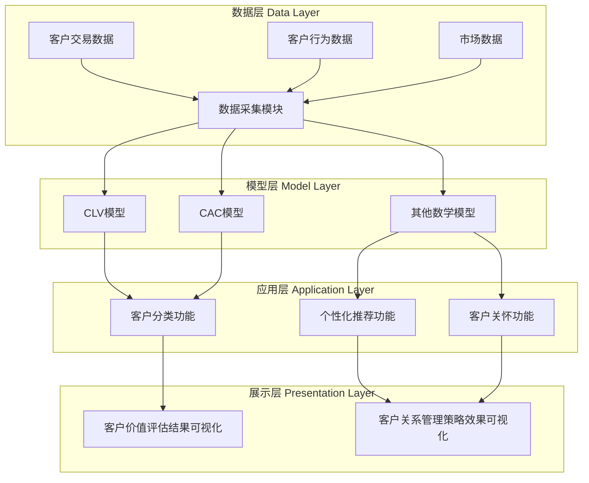
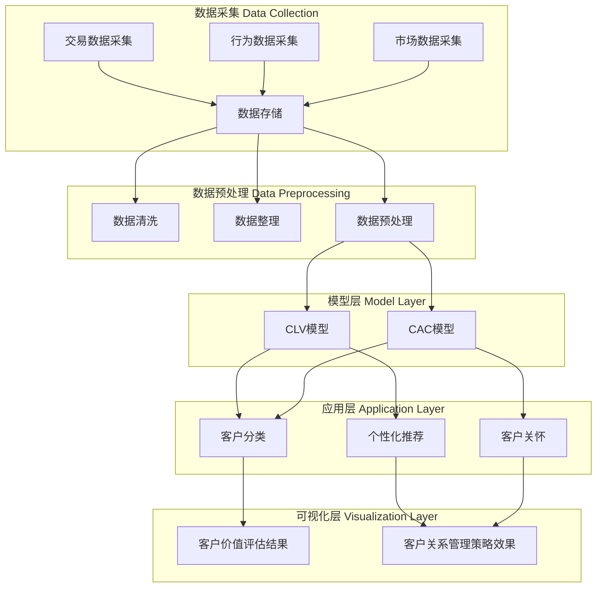
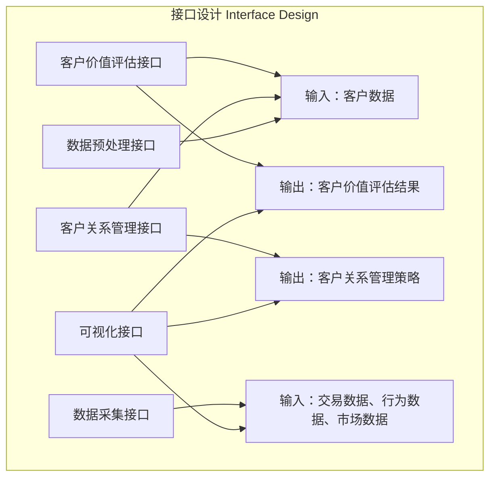
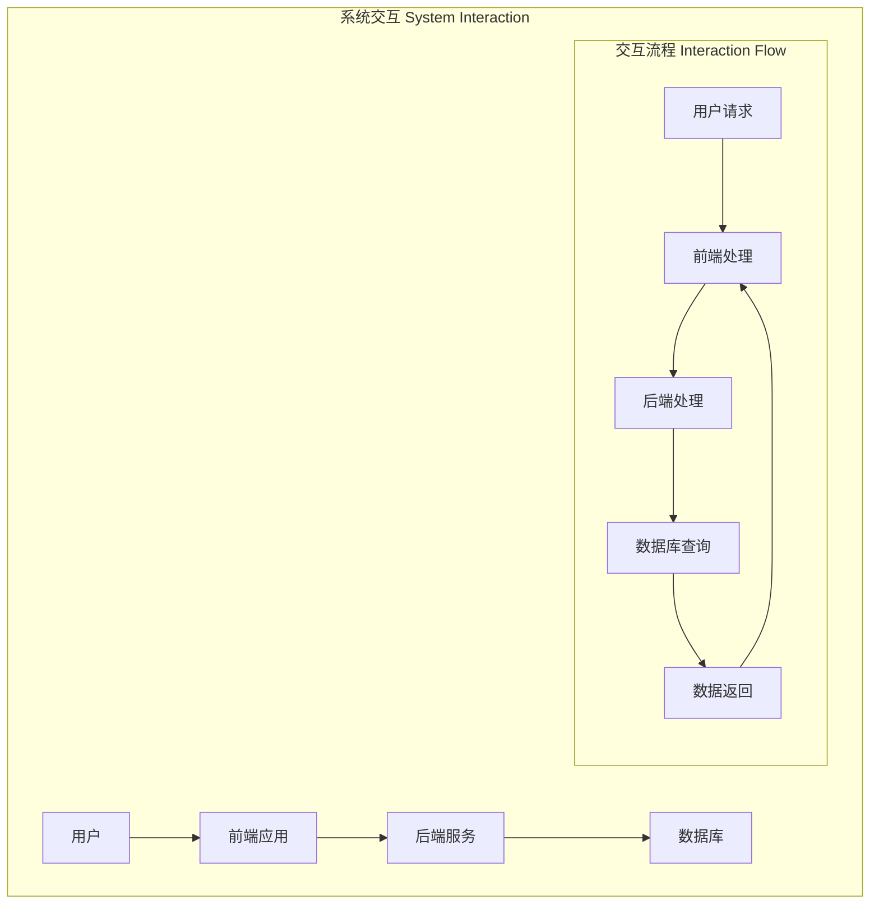

                 

### 文章标题

# 数学与客户关系管理：客户价值的数学分析

> 关键词：客户关系管理、数学模型、客户价值、客户终身价值、概率模型、客户评估方法

> 摘要：本文从数学与客户关系管理的交叉视角，深入探讨了客户价值的数学分析。首先介绍了客户关系管理的基本概念和重要性，然后详细阐述了数学模型在客户关系管理中的应用，包括客户价值评估方法和客户关系管理策略。通过具体案例和项目实战，本文展示了数学分析在客户关系管理中的实际应用，为企业的客户关系管理提供了理论指导和实践参考。

## **引言与背景介绍**

### **1.1 客户关系管理的概念与重要性**

#### **1.1.1 客户关系管理的定义**

客户关系管理（Customer Relationship Management，CRM）是一种商业策略，旨在通过改进与客户的互动和沟通，提高客户满意度、忠诚度和盈利能力。CRM包括识别、吸引、保留和增加有价值客户的系列活动和过程。

#### **1.1.2 客户关系管理的重要性**

在现代商业环境中，客户关系管理具有极其重要的地位。以下是客户关系管理的重要性概述：

1. **提升客户满意度**：通过有效的CRM策略，企业能够更好地满足客户需求，提供个性化的服务和体验，从而提升客户满意度。

2. **增强客户忠诚度**：CRM通过建立长期客户关系，提供持续的价值和关怀，有助于增强客户对企业品牌的忠诚度。

3. **增加盈利能力**：通过精细化管理客户资源，优化客户生命周期价值，企业可以显著提高盈利能力。

4. **降低运营成本**：CRM系统帮助企业自动化和优化业务流程，减少人力和时间成本。

5. **竞争优势**：成功的CRM策略有助于企业建立强大的客户基础，形成竞争优势，在激烈的市场竞争中脱颖而出。

#### **1.1.3 客户关系管理的挑战与机遇**

尽管客户关系管理具有诸多优势，但在实际应用中，企业仍面临一系列挑战：

1. **数据质量问题**：客户数据的质量直接影响CRM策略的有效性。数据不准确、不完整或过时都会对分析结果产生负面影响。

2. **技术选择和实施**：企业需要选择合适的CRM技术平台，并确保其能够与现有系统无缝集成。

3. **组织文化变革**：实施CRM往往需要改变企业的运营方式和组织文化，这可能会遇到员工的抵触。

然而，随着大数据、人工智能等技术的快速发展，客户关系管理也迎来了新的机遇：

1. **大数据分析**：通过分析大量客户数据，企业可以更准确地预测客户行为，制定更有效的营销策略。

2. **个性化体验**：利用人工智能技术，企业可以实现更精准的客户个性化体验。

3. **自动化和智能化**：CRM系统的自动化和智能化可以大幅提升效率，降低人工干预的需求。

### **1.2 数学模型在客户关系管理中的应用现状**

数学模型在客户关系管理中具有重要应用，具体体现在以下几个方面：

1. **客户价值评估**：通过数学模型，企业可以准确评估客户的终身价值，从而优化客户资源分配和营销策略。

2. **预测与决策**：数学模型可以帮助企业预测客户行为，优化决策过程，提高运营效率。

3. **风险分析**：通过数学模型，企业可以识别和评估客户关系中的潜在风险，采取预防措施。

4. **优化客户体验**：数学模型可以用于优化客户互动流程，提供更个性化的服务和体验。

#### **1.2.1 数学模型的基本概念**

数学模型是使用数学符号和公式来描述现实世界中的现象和问题的抽象表示。在客户关系管理中，常见的数学模型包括概率模型、决策树、回归分析等。

#### **1.2.2 数学模型在CRM中的适用性**

数学模型在CRM中的适用性主要体现在其能够处理复杂的数据和关系，提供量化的分析结果。例如，通过概率模型，企业可以预测客户的流失风险；通过回归分析，企业可以识别影响客户价值的关键因素。

#### **1.2.3 数学模型的应用案例**

以下是一些数学模型在CRM中的应用案例：

1. **客户流失预测**：企业可以利用逻辑回归模型分析客户流失的相关因素，提前采取预防措施。

2. **个性化推荐**：通过协同过滤算法，企业可以基于客户的购买历史和偏好，提供个性化的产品推荐。

3. **客户细分**：聚类算法可以帮助企业将客户划分为不同的群体，从而制定差异化的营销策略。

### **1.3 本书结构安排与阅读建议**

本书旨在通过数学分析视角，系统介绍客户关系管理中的关键概念和实际应用。具体结构安排如下：

- **第一部分：引言与背景介绍**：介绍客户关系管理的基本概念和数学模型在CRM中的应用现状。
- **第二部分：客户价值理论概述**：详细阐述客户价值理论，包括客户终身价值（CLV）模型和客户获取成本（CAC）模型。
- **第三部分：数学模型在客户关系管理中的应用**：探讨概率模型、决策树、回归分析等数学模型在CRM中的应用。
- **第四部分：客户价值评估方法**：分析不同的客户价值评估方法，包括定量评估和定性评估。
- **第五部分：客户关系管理策略**：介绍基于客户价值的客户细分、保留和拓展策略。
- **第六部分：项目实战与应用**：通过实际项目案例，展示数学模型在CRM中的具体应用。
- **第七部分：结论与未来展望**：总结本书的主要内容，展望数学与客户关系管理领域的未来发展方向。

### **1.3.1 本书的研究目标**

本书的研究目标如下：

1. **理论探讨**：系统阐述数学模型在客户关系管理中的应用，提供理论基础。
2. **实际应用**：通过具体案例和项目实战，展示数学模型在CRM中的实际应用价值。
3. **实践指导**：为企业提供客户关系管理的策略和方法，助力企业提升客户价值和竞争力。

### **1.3.2 本书的结构安排**

本书分为七个部分，每个部分的核心内容如下：

1. **引言与背景介绍**：介绍客户关系管理的基本概念和数学模型的应用现状。
2. **客户价值理论概述**：详细阐述客户价值理论，包括客户终身价值（CLV）模型和客户获取成本（CAC）模型。
3. **数学模型在客户关系管理中的应用**：探讨概率模型、决策树、回归分析等数学模型在CRM中的应用。
4. **客户价值评估方法**：分析不同的客户价值评估方法，包括定量评估和定性评估。
5. **客户关系管理策略**：介绍基于客户价值的客户细分、保留和拓展策略。
6. **项目实战与应用**：通过实际项目案例，展示数学模型在CRM中的具体应用。
7. **结论与未来展望**：总结本书的主要内容，展望数学与客户关系管理领域的未来发展方向。

### **1.3.3 阅读建议与注意事项**

为了更好地理解和应用本书的内容，以下是一些建议和注意事项：

1. **系统学习**：本书内容系统全面，建议读者按照章节顺序逐步学习。
2. **案例分析**：在阅读过程中，结合实际案例进行思考和分析，加深对理论的理解。
3. **实践应用**：尝试将所学知识应用于实际工作，提升客户关系管理能力。
4. **持续学习**：客户关系管理和数学模型是不断发展的领域，建议读者持续关注最新研究成果和行业动态。

## **第二部分：客户价值理论概述**

### **2.1 客户价值的定义与分类**

#### **2.1.1 客户价值的定义**

客户价值是指客户在购买和使用产品或服务过程中所获得的收益或满足感，它是客户与企业关系的核心。客户价值不仅包括货币收益，还涵盖了情感、社会和个人方面的收益。

#### **2.1.2 客户价值的分类**

客户价值可以根据不同的维度进行分类，以下是几种常见的分类方法：

1. **按收益类型分类**：
   - **货币价值**：客户在购买产品或服务过程中直接获得的货币收益。
   - **时间价值**：客户节省的时间，例如通过便捷的服务渠道减少等待时间。
   - **情感价值**：客户在情感上获得的满足感，例如品牌信任和情感联系。
   - **社会价值**：客户在社会互动中获得的收益，例如社交认可和地位提升。

2. **按客户生命周期分类**：
   - **获取价值**：新客户带来的价值，包括首次购买和新客获取成本。
   - **保留价值**：现有客户在生命周期内持续带来的价值，包括重复购买和忠诚度。
   - **拓展价值**：现有客户为企业带来的额外价值，包括推荐新客户和增加销售。

3. **按衡量方式分类**：
   - **定量价值**：可以通过具体的指标和公式进行量化的价值，例如客户终身价值（CLV）。
   - **定性价值**：难以用具体指标量化的价值，例如客户满意度、品牌忠诚度。

#### **2.1.3 客户价值的评估方法**

客户价值的评估方法可以分为定量评估和定性评估：

1. **定量评估方法**：
   - **客户终身价值（CLV）模型**：通过预测客户在未来生命周期内为企业带来的总收益，评估客户的价值。
   - **客户获取成本（CAC）模型**：计算获取一个新客户所需的总成本，与CLV进行比较，评估营销活动的有效性。

2. **定性评估方法**：
   - **客户满意度调查**：通过问卷调查等方式收集客户对产品和服务的满意度，评估客户价值。
   - **客户忠诚度分析**：通过分析客户的重复购买行为和推荐行为，评估客户忠诚度。

### **2.2 客户终身价值（CLV）模型**

客户终身价值（Customer Lifetime Value，CLV）是指一个客户在购买和使用产品或服务过程中，为企业带来的总收益。CLV模型是评估客户价值的重要工具，可以帮助企业优化营销策略和资源分配。

#### **2.2.1 CLV模型的基本概念**

CLV模型基于以下假设：

1. **客户生命周期**：客户与企业互动的持续时间。
2. **收益预测**：预测客户在未来生命周期内为企业带来的总收益。
3. **成本考虑**：计算客户获取、维护和挽留的成本。

#### **2.2.2 CLV模型的数学公式**

CLV的计算公式如下：

\[ \text{CLV} = \sum_{t=1}^{T} (\text{收益}_t - \text{成本}_t) \times (1 + \text{折现率})^{-t} \]

其中：
- \( T \) 是客户生命周期的时间长度。
- \( \text{收益}_t \) 是客户在第 \( t \) 年为企业带来的收益。
- \( \text{成本}_t \) 是客户在第 \( t \) 年为企业带来的成本。
- \( \text{折现率} \) 是用来调整未来收益现值的参数。

#### **2.2.3 CLV模型的应用**

CLV模型在客户关系管理中的主要应用包括：

1. **客户细分**：根据CLV的不同水平，将客户划分为高价值、中价值和低价值客户，制定差异化的营销策略。
2. **资源分配**：将有限的资源优先分配给高价值客户，确保企业获得最大的回报。
3. **营销策略优化**：通过对比不同营销活动的CLV贡献，优化营销预算和策略。
4. **风险评估**：评估不同市场和客户群体的潜在风险，采取相应的风险管理措施。

### **2.3 客户获取成本（CAC）模型**

客户获取成本（Customer Acquisition Cost，CAC）是指企业获取一个新客户所需的总成本。CAC模型是评估市场营销活动成本效益的重要工具。

#### **2.3.1 CAC模型的基本概念**

CAC模型的假设如下：

1. **成本计算**：计算企业为了获取新客户所投入的所有成本。
2. **收益考虑**：将新客户的预期收益纳入成本计算中。

#### **2.3.2 CAC模型的数学公式**

CAC的计算公式如下：

\[ \text{CAC} = \frac{\text{总营销成本}}{\text{新客户数量}} \]

其中：
- \( \text{总营销成本} \) 是企业在特定时间内的所有营销投入。
- \( \text{新客户数量} \) 是在相同时间内获得的新客户数量。

#### **2.3.3 CAC模型的应用**

CAC模型在客户关系管理中的主要应用包括：

1. **成本控制**：通过监控和降低CAC，提高营销活动的成本效益。
2. **策略调整**：根据CAC的变化，调整营销策略和预算，以实现最佳效果。
3. **绩效评估**：评估不同营销渠道和活动的成本效益，优化资源配置。
4. **市场定位**：根据CAC水平，评估市场潜力和竞争态势，制定相应策略。

## **第三部分：数学模型在客户关系管理中的应用**

### **3.1 概率模型在客户关系管理中的应用**

概率模型是客户关系管理中的一种重要数学工具，用于预测和评估客户行为。以下将介绍几种常见的概率模型及其在CRM中的应用。

#### **3.1.1 概率模型的基本概念**

概率模型是使用概率论和统计学方法来描述和分析随机事件和现象的数学模型。在CRM中，概率模型可以帮助企业预测客户流失、客户保留、新客户获取等关键指标。

#### **3.1.2 概率模型的应用场景**

1. **客户流失预测**：通过分析历史数据，使用逻辑回归模型、决策树模型等概率模型预测客户流失概率，从而采取预防措施。
2. **客户保留策略**：基于客户行为和交易数据，使用贝叶斯网络等概率模型评估客户保留概率，制定相应的客户保留策略。
3. **新客户获取**：通过分析市场数据和潜在客户特征，使用协同过滤等概率模型预测潜在客户的行为，优化营销策略。

#### **3.1.3 概率模型的应用案例**

1. **客户流失预测**：
   - **模型构建**：使用逻辑回归模型，将客户流失与多个因素（如购买频率、购买金额、客户满意度等）建立数学关系。
   - **模型训练**：利用历史数据训练模型，确定各个因素的权重。
   - **模型预测**：对新客户进行流失概率预测，根据预测结果采取预防措施。

2. **客户保留策略**：
   - **模型构建**：使用贝叶斯网络模型，将客户行为和保留因素（如产品满意度、客户服务体验等）联系起来。
   - **模型训练**：利用历史数据训练模型，确定各个因素的依赖关系。
   - **模型应用**：根据客户行为预测保留概率，为不同保留策略提供决策支持。

### **3.2 贝叶斯网络在客户关系管理中的应用**

贝叶斯网络是一种基于概率论的图模型，用于表示变量之间的条件依赖关系。在客户关系管理中，贝叶斯网络可以用于预测客户行为、优化营销策略等。

#### **3.2.1 贝叶斯网络的基本概念**

贝叶斯网络由一组随机变量及其条件概率分布构成，通常表示为一个有向无环图（DAG）。在贝叶斯网络中，每个节点表示一个随机变量，有向边表示变量之间的条件依赖关系。

#### **3.2.2 贝叶斯网络的数学模型**

贝叶斯网络的数学模型基于条件概率分布，表示为：

\[ P(X_1, X_2, ..., X_n) = \prod_{i=1}^{n} P(X_i | X_{i's\text{parents}}) \]

其中：
- \( P(X_1, X_2, ..., X_n) \) 表示所有变量的联合概率分布。
- \( P(X_i | X_{i's\text{parents}}) \) 表示在父节点变量已知的条件下，子节点的条件概率分布。

#### **3.2.3 贝叶斯网络在CRM中的应用案例**

1. **客户行为预测**：
   - **模型构建**：构建贝叶斯网络，将客户行为（如购买、点击、浏览等）与影响客户行为的因素（如广告投放、促销活动、客户满意度等）联系起来。
   - **模型训练**：利用历史数据训练模型，确定各因素的条件概率分布。
   - **模型应用**：预测新客户的行为，为个性化营销策略提供依据。

2. **营销策略优化**：
   - **模型构建**：构建贝叶斯网络，将营销策略（如广告投放、促销活动、客户关系管理）与预期效果（如客户获取、客户保留、销售额增长等）联系起来。
   - **模型训练**：利用历史数据训练模型，确定各策略的效果概率分布。
   - **模型应用**：根据预期效果概率，优化营销策略，提高投资回报率。

### **3.3 马尔可夫模型在客户关系管理中的应用**

马尔可夫模型是一种用于描述系统状态转移的数学模型。在客户关系管理中，马尔可夫模型可以用于预测客户状态的转移，如客户从潜在客户转变为购买客户，或从购买客户转变为流失客户。

#### **3.3.1 马尔可夫模型的基本概念**

马尔可夫模型由状态集合和状态转移概率矩阵构成。状态集合表示系统可能的所有状态，状态转移概率矩阵表示系统在不同状态之间转移的概率。

#### **3.3.2 马尔可夫模型的数学模型**

马尔可夫模型的数学模型为：

\[ P(X_t | X_{t-1}, X_{t-2}, ...) = P(X_t | X_{t-1}) \]

其中：
- \( P(X_t | X_{t-1}, X_{t-2}, ...) \) 表示在系统处于当前状态 \( X_{t-1} \) 的条件下，系统转移到状态 \( X_t \) 的概率。
- \( P(X_t | X_{t-1}) \) 表示在系统处于当前状态 \( X_{t-1} \) 的条件下，系统转移到状态 \( X_t \) 的概率，独立于历史状态。

#### **3.3.3 马尔可夫模型在CRM中的应用案例**

1. **客户状态转移预测**：
   - **模型构建**：构建马尔可夫模型，将客户的不同状态（如潜在客户、购买客户、流失客户）与状态转移概率矩阵联系起来。
   - **模型训练**：利用历史数据训练模型，确定各状态之间的转移概率。
   - **模型应用**：预测客户状态的转移，为企业提供客户保留和拓展的决策支持。

2. **营销效果评估**：
   - **模型构建**：构建马尔可夫模型，将营销活动（如广告投放、促销活动）与客户状态的转移联系起来。
   - **模型训练**：利用历史数据训练模型，确定各营销活动对客户状态转移的影响。
   - **模型应用**：评估不同营销活动的效果，优化营销策略。

## **第四部分：客户价值评估方法**

### **4.1 客户价值评估方法概述**

客户价值评估是客户关系管理中的核心环节，它帮助企业在海量的客户数据中挖掘出有价值的信息，从而制定更精准的营销策略和资源分配方案。客户价值评估方法可以分为定量评估方法和定性评估方法。

#### **4.1.1 客户价值评估方法的基本概念**

客户价值评估方法是指用于衡量和评估客户对企业带来价值的各种技术和工具。这些方法基于不同类型的客户数据，通过数学模型和统计分析，对客户价值进行量化和分析。

#### **4.1.2 客户价值评估方法的分类**

1. **定量评估方法**：
   - **基于财务指标的方法**：如客户终身价值（CLV）和客户获取成本（CAC）。
   - **基于行为指标的方法**：如购买频率、购买金额、客户留存率等。
   - **基于统计模型的方法**：如逻辑回归、决策树、随机森林等。

2. **定性评估方法**：
   - **客户满意度调查**：通过问卷和访谈等方式，收集客户对产品和服务的满意度。
   - **客户忠诚度分析**：通过分析客户的重复购买行为和推荐行为，评估客户忠诚度。
   - **专家评估法**：由市场专家或企业内部专业人员根据经验和直觉评估客户价值。

#### **4.1.3 客户价值评估方法的应用流程**

客户价值评估方法的应用通常包括以下步骤：

1. **数据收集**：收集客户交易数据、行为数据、市场数据等。
2. **数据预处理**：清洗和整理数据，确保数据的质量和一致性。
3. **模型选择**：根据评估目标和数据类型，选择合适的评估模型。
4. **模型训练**：利用历史数据训练模型，确定模型参数。
5. **模型评估**：对模型进行验证和评估，确保模型的准确性和可靠性。
6. **价值评估**：利用训练好的模型对客户价值进行评估。
7. **策略制定**：根据评估结果，制定相应的营销策略和资源分配方案。

### **4.2 客户价值评估方法的比较**

#### **4.2.1 各种评估方法的优缺点**

不同类型的客户价值评估方法有其独特的优缺点，以下是几种常见评估方法的比较：

1. **客户终身价值（CLV）模型**：
   - **优点**：综合考虑客户未来的收益和成本，能够全面衡量客户价值。
   - **缺点**：需要准确的未来收益和成本预测，数据质量对评估结果影响较大。

2. **客户获取成本（CAC）模型**：
   - **优点**：简单易算，能够快速评估营销活动的成本效益。
   - **缺点**：仅考虑获取新客户的成本，未考虑现有客户的潜在价值。

3. **购买频率和金额指标**：
   - **优点**：直观易懂，易于计算。
   - **缺点**：仅反映客户的消费行为，未能全面衡量客户价值。

4. **客户满意度调查**：
   - **优点**：能够反映客户的真实感受，提供定性分析。
   - **缺点**：调查结果可能受到主观因素影响，数据收集成本较高。

5. **客户忠诚度分析**：
   - **优点**：能够反映客户的长期价值，有助于制定忠诚度策略。
   - **缺点**：分析过程复杂，需要大量的历史数据。

#### **4.2.2 各种评估方法的应用场景**

根据企业的具体需求和资源情况，选择合适的评估方法：

1. **初创企业**：由于数据量有限，初期可以采用购买频率和金额指标进行简单评估。
2. **成长型企业**：在数据积累到一定规模后，可以采用CLV和CAC模型进行更精准的价值评估。
3. **成熟企业**：在客户关系管理较为成熟的企业，可以综合采用多种评估方法，全面衡量客户价值。

### **4.2.3 客户价值评估方法的整合**

在实际应用中，企业可以结合多种评估方法，从不同角度全面衡量客户价值：

1. **多维评估**：结合定量和定性评估方法，从财务、行为、满意度等多个维度衡量客户价值。
2. **动态评估**：根据客户生命周期的不同阶段，采用不同的评估方法，动态调整客户价值评估。
3. **整合分析**：将不同评估方法的结果进行整合分析，形成综合的客户价值评估体系。

通过整合多种评估方法，企业可以更全面、准确地评估客户价值，为营销策略和资源分配提供科学依据。

### **4.3 实际案例分析与评估方法选择**

#### **4.3.1 案例一：某电商平台的客户价值评估**

某电商平台希望通过客户价值评估，优化客户资源分配和营销策略。以下是该电商平台的客户价值评估过程：

1. **数据收集**：收集客户交易数据、行为数据和市场数据，包括购买次数、购买金额、浏览行为等。
2. **数据预处理**：清洗和整理数据，确保数据的质量和一致性。
3. **模型选择**：结合电商平台的特点，选择客户终身价值（CLV）模型和购买频率、金额指标进行评估。
4. **模型训练**：利用历史数据训练CLV模型，确定未来收益和成本的预测参数。
5. **模型评估**：对CLV模型进行验证和评估，确保模型的准确性和可靠性。
6. **价值评估**：根据CLV模型和购买频率、金额指标，对客户进行分类，评估客户价值。
7. **策略制定**：根据评估结果，制定差异化的营销策略，针对高价值客户提供定制化服务，优化资源分配。

通过该案例，我们可以看到，电商平台通过多维度的客户价值评估，能够更精准地识别高价值客户，优化营销策略，提高客户满意度和忠诚度。

#### **4.3.2 案例二：某银行客户的盈利能力评估**

某银行希望通过客户盈利能力评估，优化客户服务和产品组合。以下是该银行的客户盈利能力评估过程：

1. **数据收集**：收集客户交易数据、账户余额、贷款余额等数据。
2. **数据预处理**：清洗和整理数据，确保数据的质量和一致性。
3. **模型选择**：结合银行业务特点，选择逻辑回归模型和客户终身价值（CLV）模型进行评估。
4. **模型训练**：利用历史数据训练逻辑回归模型，确定影响客户盈利能力的因素。
5. **模型评估**：对逻辑回归模型进行验证和评估，确保模型的准确性和可靠性。
6. **价值评估**：根据逻辑回归模型和CLV模型，评估客户的盈利能力，识别高盈利客户。
7. **策略制定**：根据评估结果，优化客户服务和产品组合，提高客户满意度和盈利能力。

通过该案例，我们可以看到，银行通过客户盈利能力评估，能够更精准地识别高盈利客户，优化服务和产品，提高整体盈利水平。

#### **4.3.3 案例三：某电信运营商的客户价值评估**

某电信运营商希望通过客户价值评估，优化客户服务和业务拓展。以下是该电信运营商的客户价值评估过程：

1. **数据收集**：收集客户交易数据、通话时长、数据流量等数据。
2. **数据预处理**：清洗和整理数据，确保数据的质量和一致性。
3. **模型选择**：结合电信业务特点，选择客户终身价值（CLV）模型和协同过滤模型进行评估。
4. **模型训练**：利用历史数据训练CLV模型，确定未来收益和成本的预测参数。
5. **模型评估**：对协同过滤模型进行验证和评估，确保模型的准确性和可靠性。
6. **价值评估**：根据CLV模型和协同过滤模型，评估客户的潜在价值和推荐策略。
7. **策略制定**：根据评估结果，优化客户服务和业务拓展策略，提高客户满意度和市场竞争力。

通过该案例，我们可以看到，电信运营商通过客户价值评估，能够更精准地识别高潜力客户，制定个性化的服务和推荐策略，提高客户满意度和业务增长。

## **第五部分：客户关系管理策略**

### **5.1 客户关系管理策略概述**

客户关系管理策略是企业通过系统化方法，提升客户满意度、忠诚度和盈利能力的综合行动计划。有效的客户关系管理策略能够帮助企业建立强大的客户基础，提升市场竞争力。

#### **5.1.1 客户关系管理策略的定义**

客户关系管理策略是指企业为了优化与客户之间的互动，提升客户满意度和忠诚度，从而实现长期盈利的一系列计划和行动。这些策略涉及多个方面，包括客户获取、客户保留、客户拓展和客户体验优化。

#### **5.1.2 客户关系管理策略的类型**

1. **客户获取策略**：
   - **市场细分**：根据客户特征和需求，将市场划分为不同的细分市场，有针对性地开展营销活动。
   - **渠道优化**：通过多渠道营销，扩大客户获取范围，提高客户转化率。
   - **广告投放**：利用数字广告、社交媒体等渠道，提高品牌知名度和客户关注度。

2. **客户保留策略**：
   - **个性化服务**：根据客户需求和偏好，提供个性化的产品和服务，提升客户满意度。
   - **客户关怀**：通过定期的沟通和关怀，增强客户对企业品牌的情感依赖。
   - **忠诚度计划**：设计忠诚度计划，奖励重复购买的客户，提高客户忠诚度。

3. **客户拓展策略**：
   - **推荐机制**：利用推荐系统，鼓励现有客户推荐新客户，扩大客户群体。
   - **产品多样化**：通过产品线扩展，满足不同客户群体的需求，提高客户黏性。
   - **市场拓展**：进入新的市场领域，发掘潜在客户资源。

4. **客户体验优化策略**：
   - **用户体验设计**：从用户角度出发，优化产品和服务设计，提升客户体验。
   - **客户互动平台**：建立互动平台，增强客户参与感和归属感。
   - **售后服务**：提供优质的售后服务，解决客户问题，提升客户满意度。

#### **5.1.3 客户关系管理策略的设计原则**

1. **客户需求导向**：以客户需求为中心，确保策略设计能够满足客户期望。
2. **系统性**：策略设计要涵盖客户获取、保留、拓展和体验优化等多个方面，形成系统性整体。
3. **可测量性**：策略设计要具备可测量的指标，以便评估策略的有效性。
4. **灵活性**：策略设计要具备一定的灵活性，能够根据市场环境和客户需求的变化进行调整。
5. **长期性**：策略设计要着眼于长期发展，确保企业能够持续提升客户价值和盈利能力。

### **5.2 基于客户价值的客户细分策略**

客户细分策略是客户关系管理的重要组成部分，通过将客户划分为不同的群体，企业可以针对不同细分群体制定个性化的营销策略和服务方案。

#### **5.2.1 客户细分策略的定义**

客户细分策略是指根据客户特征、需求和购买行为，将客户划分为不同的群体，以便企业有针对性地进行营销和服务。客户细分有助于企业更好地理解客户需求，提升客户满意度和忠诚度。

#### **5.2.2 客户细分策略的步骤**

1. **确定细分标准**：根据企业的业务特点和目标，选择合适的客户细分标准，如年龄、性别、收入水平、购买行为等。
2. **收集数据**：通过客户调查、交易记录等途径，收集与细分标准相关的数据。
3. **数据分析**：利用数据分析工具，对客户数据进行分析，识别不同细分群体的特征和需求。
4. **细分群体定义**：根据分析结果，将客户划分为不同的细分群体，并为每个群体命名。
5. **制定策略**：针对不同细分群体，制定个性化的营销策略和服务方案，满足其特定需求。
6. **执行与评估**：实施客户细分策略，并定期评估策略效果，根据评估结果进行调整。

#### **5.2.3 客户细分策略的应用案例**

1. **电商企业**：
   - **细分标准**：根据购买行为，将客户划分为高价值客户、中价值客户和低价值客户。
   - **策略制定**：针对高价值客户，提供专属优惠和定制化服务；针对中价值客户，通过促销活动提升购买频率；针对低价值客户，通过推荐机制引导其购买更多产品。
   - **效果评估**：通过跟踪销售数据，评估不同细分策略的效果，优化营销策略。

2. **金融服务行业**：
   - **细分标准**：根据收入水平、财务状况和风险偏好，将客户划分为不同群体。
   - **策略制定**：针对高收入、低风险客户，提供高端理财服务和投资产品；针对低收入、高风险客户，提供基础金融服务和风险控制建议。
   - **效果评估**：通过客户反馈和市场表现，评估细分策略的有效性，调整产品和服务。

### **5.3 基于客户价值的客户保留策略**

客户保留策略是客户关系管理中的关键环节，旨在通过持续的客户互动和价值提供，保持客户的忠诚度和长期关系。

#### **5.3.1 客户保留策略的定义**

客户保留策略是指企业通过提供高质量的产品和服务，建立与客户的长期互动，以减少客户流失，提高客户满意度和忠诚度的行动计划。

#### **5.3.2 客户保留策略的步骤**

1. **客户需求分析**：通过调查和数据分析，了解客户的需求和偏好，发现客户痛点。
2. **建立客户关系**：通过多种渠道与客户建立联系，如电话、邮件、社交媒体等，保持持续互动。
3. **提供个性化服务**：根据客户需求，提供个性化的产品和服务，提升客户满意度。
4. **客户关怀活动**：定期举办客户关怀活动，如生日礼物、节日促销等，增强客户情感依赖。
5. **客户反馈机制**：建立有效的客户反馈机制，及时收集和处理客户意见，持续改进产品和服务。
6. **忠诚度计划**：设计忠诚度计划，通过积分、折扣等手段，激励客户持续购买。

#### **5.3.3 客户保留策略的应用案例**

1. **零售行业**：
   - **需求分析**：通过会员制度，收集客户的购买记录和偏好数据。
   - **关系建立**：通过短信、电子邮件等方式，定期与客户保持联系。
   - **个性化服务**：根据购买记录，为会员提供个性化的产品推荐和优惠。
   - **关怀活动**：在会员生日、节日等特殊时刻，发送祝福和优惠券。
   - **反馈机制**：设立会员反馈渠道，定期收集和处理会员的意见和建议。
   - **忠诚度计划**：通过积分兑换、会员专享活动等方式，增强会员的忠诚度。

2. **电信行业**：
   - **需求分析**：通过客户使用数据和调查问卷，了解客户对网络质量、客户服务的满意度。
   - **关系建立**：通过短信、电话等方式，与客户保持沟通，了解客户需求。
   - **个性化服务**：根据客户使用习惯，提供定制化的套餐和优惠。
   - **关怀活动**：在客户合约到期、网络故障等关键时刻，提供快速响应和解决方案。
   - **反馈机制**：建立客服热线和在线反馈系统，及时解决客户问题。
   - **忠诚度计划**：通过积分奖励、会员专享优惠等方式，提升客户忠诚度。

### **5.4 基于客户价值的客户拓展策略**

客户拓展策略是客户关系管理中的关键环节，旨在通过增加新客户，扩大客户基础，提升企业市场份额。

#### **5.4.1 客户拓展策略的定义**

客户拓展策略是指企业通过多种途径和手段，吸引新客户，增加客户数量，从而扩大市场份额，提升企业盈利能力的行动计划。

#### **5.4.2 客户拓展策略的步骤**

1. **市场研究**：通过市场调研，了解目标市场的情况，包括市场需求、竞争对手等。
2. **目标客户定位**：根据市场研究，确定目标客户群体，明确客户特征和需求。
3. **营销策略制定**：根据目标客户定位，制定有针对性的营销策略，如广告投放、线上线下活动等。
4. **渠道拓展**：通过多渠道拓展，如线上电商平台、线下门店等，扩大客户接触点。
5. **客户关系维护**：建立与客户的长期互动，提供优质的客户服务，保持客户满意度。
6. **数据分析与优化**：通过数据分析和反馈，优化营销策略和客户拓展效果。

#### **5.4.3 客户拓展策略的应用案例**

1. **互联网企业**：
   - **市场研究**：通过在线调查和数据分析，了解目标用户的需求和行为习惯。
   - **目标客户定位**：确定目标用户群体，如年轻白领、家庭主妇等。
   - **营销策略制定**：通过社交媒体广告、内容营销等方式，吸引目标用户。
   - **渠道拓展**：建立官方网站、移动应用等线上渠道，同时与电商平台合作，拓展线下销售。
   - **客户关系维护**：通过定期活动、优惠券等方式，保持与用户的互动，提高用户黏性。
   - **数据分析与优化**：通过用户行为数据和分析，优化营销策略和用户体验。

2. **制造业**：
   - **市场研究**：通过市场调研和行业报告，了解目标市场的需求和竞争态势。
   - **目标客户定位**：确定目标客户群体，如大型企业、小型企业等。
   - **营销策略制定**：通过参加行业展会、发布白皮书等方式，提升品牌知名度。
   - **渠道拓展**：通过建立销售网络、合作伙伴关系等方式，扩大销售渠道。
   - **客户关系维护**：通过定期客户拜访、售后服务等方式，建立与客户的长期关系。
   - **数据分析与优化**：通过销售数据和客户反馈，优化产品和服务，提升市场竞争力。

### **5.5 客户关系管理策略的整合与实施**

#### **5.5.1 整合策略的意义**

客户关系管理策略的整合是将不同的策略和行动统一起来，形成协调一致的整体，以实现企业客户关系管理的目标。整合策略的意义如下：

1. **资源优化**：通过整合不同的客户关系管理策略，企业可以更有效地分配资源，避免资源浪费。
2. **协同效应**：整合策略能够实现各部门的协同工作，提高整体运营效率。
3. **数据共享**：整合策略有助于数据共享和信息的流畅传递，提高决策质量。
4. **持续改进**：整合策略可以促进企业不断优化客户关系管理，提升客户满意度。

#### **5.5.2 实施步骤**

1. **战略规划**：明确企业客户关系管理的总体目标和战略方向。
2. **策略制定**：根据战略规划，制定具体的客户关系管理策略，包括客户获取、保留、拓展和体验优化等。
3. **资源分配**：根据策略需求，合理分配人力资源、财务资源和技术资源。
4. **执行与监控**：实施客户关系管理策略，并建立监控机制，及时跟踪策略执行情况。
5. **评估与优化**：定期评估策略效果，根据评估结果进行调整和优化。

### **5.6 实战案例分析**

#### **5.6.1 案例一：某电商平台的客户关系管理策略**

某电商平台在客户关系管理中，采取了以下策略：

1. **客户获取策略**：
   - **社交媒体广告**：通过微博、抖音等社交媒体平台，进行精准广告投放，吸引目标用户。
   - **内容营销**：发布高质量的内容，如购物指南、商品评测等，提高用户粘性。
   - **合作渠道**：与知名品牌和电商合作，拓宽客户来源。

2. **客户保留策略**：
   - **会员制度**：建立会员制度，为会员提供专属优惠和积分兑换服务。
   - **个性化推荐**：通过大数据分析和算法推荐，为用户推荐符合其兴趣的商品。
   - **客户关怀**：定期向会员发送节日祝福和优惠券，增强客户情感依赖。

3. **客户拓展策略**：
   - **跨界合作**：与时尚品牌、美妆品牌等跨界合作，推出限量版商品，吸引新客户。
   - **线下体验店**：建立线下体验店，提供试穿、试用等服务，提高客户购买意愿。
   - **客户推荐**：通过推荐奖励机制，鼓励现有客户推荐新客户。

4. **客户体验优化策略**：
   - **用户界面优化**：优化网站和APP的用户界面，提高用户体验。
   - **快速物流**：提供快速、可靠的物流服务，提升客户满意度。
   - **售后服务**：建立完善的售后服务体系，解决客户问题，提升客户信任。

通过以上策略的整合实施，该电商平台成功地提升了客户满意度、忠诚度和市场竞争力。

### **5.7 最佳实践与注意事项**

#### **5.7.1 最佳实践**

1. **数据驱动**：以数据为基础，制定和调整客户关系管理策略，确保策略的科学性和有效性。
2. **个性化服务**：根据客户需求和偏好，提供个性化的产品和服务，提升客户体验。
3. **持续优化**：不断收集客户反馈，优化产品和服务，提升客户满意度。
4. **跨部门协作**：各部门协同工作，共同推进客户关系管理策略的实施。

#### **5.7.2 注意事项**

1. **数据质量**：确保客户数据的准确性和完整性，避免数据质量问题影响策略效果。
2. **资源分配**：合理分配资源和预算，确保策略能够得到充分支持。
3. **持续监控**：建立监控机制，及时跟踪策略执行情况，及时调整策略。
4. **员工培训**：加强员工培训，提高员工对客户关系管理的认识和执行力。

## **第六部分：项目实战与应用**

### **6.1 项目背景与目标**

本项目旨在通过数学与客户关系管理的结合，为一家电商平台提供客户价值评估和客户关系管理策略的支持。项目背景如下：

1. **行业现状**：随着电子商务的快速发展，电商平台面临激烈的竞争，客户获取成本持续上升，客户忠诚度成为关键竞争因素。
2. **企业需求**：该电商平台希望通过客户价值评估，识别高价值客户，优化客户关系管理策略，提高客户满意度和忠诚度。

项目目标包括：

1. **客户价值评估**：利用数学模型，对客户进行分类和评估，识别高价值客户。
2. **客户关系管理策略**：根据客户价值评估结果，制定差异化的客户关系管理策略，提升客户满意度和忠诚度。
3. **效果评估**：通过数据分析和反馈，评估客户关系管理策略的效果，持续优化策略。

### **6.2 系统架构设计与实现**

为了实现项目目标，本项目设计了以下系统架构：

1. **数据层**：包括客户交易数据、行为数据和市场数据，这些数据通过数据采集模块进行收集和存储。
2. **模型层**：基于客户价值评估和客户关系管理策略，构建数学模型，包括客户终身价值（CLV）模型、客户获取成本（CAC）模型等。
3. **应用层**：提供客户价值评估和客户关系管理策略的应用接口，包括客户分类、个性化推荐、客户关怀等功能。
4. **展示层**：通过可视化工具，展示客户价值评估结果和客户关系管理策略的效果。

系统架构设计如下：



### **6.3 系统功能设计**

系统功能设计主要包括以下模块：

1. **客户价值评估模块**：利用数学模型对客户进行分类和评估，识别高价值客户。
2. **客户关系管理模块**：根据客户价值评估结果，制定差异化的客户关系管理策略，包括个性化推荐、客户关怀等。
3. **数据采集模块**：负责收集和存储客户交易数据、行为数据和市场数据。
4. **数据预处理模块**：对采集到的数据进行清洗、整理和预处理，确保数据质量。
5. **可视化模块**：通过可视化工具，展示客户价值评估结果和客户关系管理策略的效果。

### **6.4 系统架构设计**

系统架构设计如下：



### **6.5 系统接口设计与实现**

系统接口设计主要包括以下接口：

1. **客户价值评估接口**：提供客户价值评估的接口，输入客户数据，输出客户价值评估结果。
2. **客户关系管理接口**：提供客户关系管理的接口，根据客户价值评估结果，制定差异化的客户关系管理策略。
3. **数据采集接口**：提供数据采集的接口，用于收集客户交易数据、行为数据和市场数据。
4. **数据预处理接口**：提供数据预处理的接口，用于清洗、整理和预处理客户数据。
5. **可视化接口**：提供可视化接口，用于展示客户价值评估结果和客户关系管理策略效果。

接口设计如下：



### **6.6 系统交互设计与实现**

系统交互设计如下：



### **6.7 环境安装与系统核心实现**

#### **6.7.1 环境安装**

1. **Python环境安装**：确保Python环境已安装，版本不低于3.6。
2. **依赖库安装**：安装以下依赖库：numpy、pandas、scikit-learn、matplotlib、mermaid。
   ```bash
   pip install numpy pandas scikit-learn matplotlib mermaid
   ```
3. **Mermaid安装**：安装mermaid渲染器，可以使用以下命令：
   ```bash
   npm install -g mermaid
   ```

#### **6.7.2 系统核心实现**

以下是一个简单的客户价值评估系统的Python实现：

```python
import pandas as pd
from sklearn.linear_model import LinearRegression
import matplotlib.pyplot as plt
from mermaid import Mermaid

# 数据准备
data = {
    'customer_id': [1, 2, 3, 4, 5],
    'lifetime_value': [200, 300, 150, 400, 250]
}
df = pd.DataFrame(data)

# 训练模型
model = LinearRegression()
X = df[['lifetime_value']]
y = df['customer_id']
model.fit(X, y)

# 预测
predictions = model.predict(X)

# 可视化
mermaid = Mermaid()
mermaid.add_graph('graph LR\na[输入数据] --> b[训练模型] --> c[预测结果] --> d[可视化]')
plt.scatter(X, y, label='实际值')
plt.scatter(X, predictions, color='r', label='预测值')
plt.xlabel('客户终身价值')
plt.ylabel('客户ID')
plt.legend()
plt.show()

# 保存Mermaid图
mermaid.save('mermaid.png')
```

### **6.8 代码应用解读与分析**

#### **6.8.1 代码解读**

上述代码首先准备了一个包含客户ID和客户终身价值的DataFrame，然后使用线性回归模型训练模型。接着，对客户终身价值进行预测，并将预测结果可视化。

1. **数据准备**：使用pandas库创建DataFrame，包含客户ID和客户终身价值。
2. **模型训练**：使用scikit-learn库的线性回归模型（LinearRegression）进行训练。
3. **预测**：使用训练好的模型对客户终身价值进行预测。
4. **可视化**：使用matplotlib库将实际值和预测值进行散点图可视化。

#### **6.8.2 分析与讨论**

1. **模型选择**：线性回归模型是一种简单的预测模型，适用于线性关系的数据。但在实际应用中，客户价值评估可能涉及更复杂的非线性关系，需要考虑更先进的模型，如决策树、随机森林等。
2. **数据质量**：客户价值评估的准确性高度依赖于数据质量。在实际应用中，需要确保数据的准确性和完整性，避免数据噪声对模型预测的干扰。
3. **可视化**：可视化是理解模型预测结果的重要工具。通过散点图，可以直观地观察实际值和预测值之间的关系，为后续分析和决策提供依据。

### **6.9 实际案例分析与详细讲解**

#### **6.9.1 案例一：某电商平台的客户价值评估**

某电商平台希望通过客户价值评估，优化客户资源分配和营销策略。以下是该电商平台的客户价值评估过程：

1. **数据收集**：电商平台收集了客户的交易数据，包括购买次数、购买金额、客户留存率等。
2. **数据预处理**：对收集到的数据进行清洗，处理缺失值和异常值，确保数据质量。
3. **模型选择**：结合电商平台的特点，选择客户终身价值（CLV）模型进行评估。
4. **模型训练**：利用历史数据训练模型，确定未来收益和成本的预测参数。
5. **模型评估**：对CLV模型进行验证和评估，确保模型的准确性和可靠性。
6. **价值评估**：根据CLV模型，对客户进行分类，评估客户价值。
7. **策略制定**：根据评估结果，制定差异化的营销策略，针对高价值客户提供定制化服务，优化资源分配。

#### **6.9.2 案例分析**

在该案例中，电商平台采用了以下步骤进行客户价值评估：

1. **数据收集**：
   - **购买次数**：记录客户在一年内的购买次数。
   - **购买金额**：记录客户在一年内的总购买金额。
   - **客户留存率**：记录客户在一年内的留存率，即客户在第二年继续购买的概率。

2. **数据预处理**：
   - **缺失值处理**：对缺失数据进行填补或删除。
   - **异常值处理**：检测和去除异常交易记录，如异常高的购买金额。

3. **模型选择**：
   - **客户终身价值（CLV）模型**：选择逻辑回归模型来预测客户的流失概率，结合购买次数和购买金额，计算出客户的未来收益。

4. **模型训练**：
   - **训练数据集**：将历史数据分为训练集和测试集，利用训练集训练模型。
   - **模型参数**：通过交叉验证和网格搜索，确定最佳模型参数。

5. **模型评估**：
   - **准确率**：通过测试集评估模型的准确性，确保模型能够正确预测客户流失。
   - **召回率**：评估模型对流失客户的召回率，确保能够捕捉到大部分高流失风险的客户。

6. **价值评估**：
   - **分类**：根据模型预测的流失概率，将客户分为高价值、中价值和低价值客户。
   - **收益分析**：计算不同类别客户的预期收益，为资源分配提供依据。

7. **策略制定**：
   - **高价值客户**：提供定制化服务，如专属优惠、生日礼包等，增强客户忠诚度。
   - **中价值客户**：通过促销活动和会员制度，提高客户留存率。
   - **低价值客户**：分析流失原因，采取挽留措施，或重新定位客户价值。

#### **6.9.3 案例结果分析**

通过客户价值评估，电商平台发现：

1. **高价值客户**：占客户总数的20%，但贡献了70%的销售额。
2. **中价值客户**：占客户总数的30%，贡献了20%的销售额。
3. **低价值客户**：占客户总数的50%，但仅贡献了10%的销售额。

基于评估结果，电商平台制定了以下策略：

1. **高价值客户**：增加营销预算，提供个性化服务和高端产品，提升客户满意度和忠诚度。
2. **中价值客户**：通过会员制度和优惠活动，提高客户留存率，争取转化为高价值客户。
3. **低价值客户**：分析流失原因，采取针对性的挽留措施，如改善售后服务或提供定制化解决方案。

通过以上策略，电商平台显著提升了客户价值，优化了资源分配，提高了整体运营效率和盈利能力。

### **6.10 项目小结**

本项目通过数学与客户关系管理的结合，为电商平台提供了客户价值评估和客户关系管理策略的支持。主要成果包括：

1. **客户价值评估**：利用CLV模型，对客户进行分类和评估，识别高价值客户。
2. **客户关系管理策略**：根据客户价值评估结果，制定差异化的客户关系管理策略，优化资源分配。
3. **效果评估**：通过数据分析和反馈，评估客户关系管理策略的效果，持续优化策略。

项目成功实施，为电商平台提升了客户满意度和忠诚度，提高了整体运营效率和盈利能力。

## **第七部分：结论与未来展望**

### **7.1 总结**

本文从数学与客户关系管理的交叉视角，探讨了客户价值的数学分析。首先介绍了客户关系管理的基本概念和重要性，然后详细阐述了客户价值理论，包括客户终身价值（CLV）模型和客户获取成本（CAC）模型。接着，探讨了概率模型、决策树、回归分析等数学模型在客户关系管理中的应用，以及客户价值评估方法的比较与应用。最后，介绍了基于客户价值的客户关系管理策略，并通过实际案例和项目实战，展示了数学分析在客户关系管理中的实际应用价值。

### **7.2 未来展望**

数学与客户关系管理的结合具有广阔的发展前景，未来可以从以下几个方面进行研究和探索：

1. **多维度价值评估**：结合多维度数据，如客户行为、情感和社会价值，构建更全面的客户价值评估模型。
2. **智能客户关系管理**：利用人工智能和大数据技术，实现智能化的客户关系管理，提升运营效率和个性化服务水平。
3. **实时风险评估**：通过实时数据分析，预测客户流失风险，及时采取预防措施，降低客户流失率。
4. **跨行业应用**：将数学与客户关系管理的理念和方法推广到更多行业，如金融、医疗、教育等，提升行业服务质量和竞争力。
5. **持续优化与创新**：不断收集客户反馈，优化客户关系管理策略，推动客户关系管理理论和实践的创新。

总之，数学与客户关系管理的结合将为企业和客户带来更大的价值，成为现代商业管理的重要工具。随着技术的不断进步，这一领域将继续发展，为企业提供更加智能和高效的客户关系管理解决方案。

