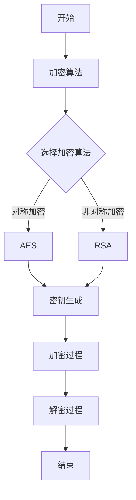

                 

# 《数学与密码分析：密码系统安全性的数学评估》

## 关键词
- 数学基础
- 密码学
- 密码分析技术
- 密码系统安全性评估
- 现代密码分析
- 密码协议分析
- 实例分析

## 摘要
本文旨在深入探讨数学与密码分析之间的关系，以及如何使用数学方法来评估密码系统的安全性。通过介绍密码学的基础理论、传统和现代密码分析技术，本文详细解析了密码系统的安全性评估方法。同时，通过实例分析和实战项目，展示了如何将这些理论应用于实际场景中，为读者提供了一个全面且实践性的密码学学习资源。

## 目录

### 第一部分：引言

#### 第1章 引言

##### 1.1 书籍背景

##### 1.2 密码分析的重要性

##### 1.3 本书结构

### 第二部分：基础理论

#### 第2章 数学基础知识

##### 2.1 数论基础

##### 2.2 离散数学基础

##### 2.3 概率论基础

##### 2.4 图论基础

#### 第3章 密码学基础

##### 3.1 密码系统的定义与分类

##### 3.2 安全性目标

##### 3.3 密码系统的构造方法

### 第三部分：密码分析技术

#### 第4章 传统密码分析技术

##### 4.1 统计分析

##### 4.2 密码分析器原理与应用

#### 第5章 现代密码分析技术

##### 5.1 差分分析

##### 5.2 线性鉴别器攻击

##### 5.3 侧信道攻击

### 第四部分：密码系统评估

#### 第6章 安全性评估方法

##### 6.1 计算安全性

##### 6.2 信息理论安全性

#### 第7章 密码协议分析

##### 7.1 常见密码协议的安全性

##### 7.2 密码协议的攻击方法

### 第五部分：实例分析与实战

#### 第8章 实例分析

##### 8.1 某种密码系统的设计实现

##### 8.2 密码系统的攻击与防御

#### 第9章 实战项目

##### 9.1 环境搭建

##### 9.2 算法实现

##### 9.3 案例分析

### 第六部分：新兴密码学与未来趋势

#### 第10章 新兴密码学

##### 10.1 量子密码学

##### 10.2 生物密码学

#### 第11章 未来趋势

##### 11.1 密码学的发展前景

##### 11.2 未来研究方向

### 第七部分：总结与展望

#### 第12章 总结

##### 12.1 主要内容回顾

##### 12.2 关键知识点总结

#### 第13章 展望

##### 13.1 密码学在未来的应用

##### 13.2 研究方向与挑战

## 第一部分：引言

### 第1章 引言

##### 1.1 书籍背景

在信息技术飞速发展的当今，密码学作为保障信息安全的核心技术，越来越受到关注。密码系统在保护数据隐私、确保通信安全等方面发挥着至关重要的作用。然而，随着计算能力的不断增强，传统的密码系统正面临着前所未有的挑战。如何评估密码系统的安全性，成为密码学研究和实际应用中的一个重要课题。

本书旨在系统地介绍数学与密码分析的相关知识，从基础理论到实际应用，再到新兴领域和发展趋势，力求为读者提供一个全面且深入的密码学学习资源。本书将帮助读者理解密码系统的设计原理，掌握密码分析技术，学会评估密码系统的安全性。

##### 1.2 密码分析的重要性

密码分析是密码学的重要组成部分，它涉及对密码系统的攻击和防御策略的研究。密码分析的重要性主要体现在以下几个方面：

1. **提高密码系统安全性**：通过分析密码系统的弱点，密码分析帮助设计更安全的密码系统。只有了解攻击方法，才能制定有效的防御策略。
2. **验证密码系统的可靠性**：密码系统在未经授权的情况下应该保持不可破解性。密码分析作为一种验证手段，可以检验密码系统的可靠性和安全性。
3. **推动密码学的发展**：密码分析技术的不断发展推动着密码学理论的进步。新的密码分析技术不仅揭示了密码系统的缺陷，还激发了新的密码系统设计思路。

##### 1.3 本书结构

本书分为七个主要部分：

1. **引言**：介绍书籍的背景和重要性。
2. **基础理论**：介绍数学基础和密码学基础。
3. **密码分析技术**：包括传统密码分析技术和现代密码分析技术。
4. **密码系统评估**：介绍安全性评估方法和密码协议分析。
5. **实例分析与实战**：通过具体案例深入探讨密码系统的设计、实现和攻击过程。
6. **新兴密码学与未来趋势**：介绍量子密码学、生物密码学等新兴领域。
7. **总结与展望**：总结全书的主要内容和关键知识点，展望密码学的未来发展趋势。

### 第二部分：基础理论

#### 第2章 数学基础知识

##### 2.1 数论基础

数论是密码学中不可或缺的基础数学知识。它研究整数及其性质，包括整数的因数分解、同余关系、模运算等。

- **因数分解**：将整数表示为其素数的乘积。例如，\(N = p_1^{k_1} \cdot p_2^{k_2} \cdot ... \cdot p_r^{k_r}\)。
- **同余关系**：如果两个整数除以某个正整数的余数相同，则称这两个整数同余。形式化表示为：\(a \equiv b \pmod{n}\)。
- **模运算**：在模 \(n\) 下进行整数运算，其结果仍然是整数。模运算广泛应用于加密算法和数字签名。

##### 2.2 离散数学基础

离散数学涉及离散结构的数学研究，包括图论、组合数学等。在密码分析中，图论用于描述加密算法的复杂性，组合数学用于分析密码协议的安全性。

- **图论**：图是由节点和边组成的结构。在密码学中，图论用于分析密码协议的网络结构，确定节点间的连接关系。
- **组合数学**：组合数学研究如何将元素分组，包括排列、组合等。在密码分析中，组合数学用于分析密码系统的组合构造，如密码算法的迭代模式。

##### 2.3 概率论基础

概率论是研究随机事件及其概率的数学分支。在密码学中，概率论用于评估密码系统的安全性，计算攻击成功的概率。

- **随机变量**：随机变量是描述随机事件结果的函数。在密码学中，随机变量用于模拟加密算法的输出，分析密码系统的概率特性。
- **概率分布**：概率分布描述了随机变量的概率分布情况。在密码分析中，概率分布用于评估密码系统的输出分布，分析密码算法的统计特性。

##### 2.4 图论基础

图论是研究图的结构和性质的一个数学分支。在密码学中，图论用于描述密码系统的结构和关系。

- **图**：图是由节点和边组成的结构，节点表示实体，边表示实体之间的关系。
- **路径**：路径是图中节点之间的序列，表示从一个节点到另一个节点的连接。
- **连通性**：连通性描述了图中任意两个节点之间的连接关系。在密码学中，连通性用于分析密码协议的通信路径，确保信息的传递安全。

#### 第3章 密码学基础

##### 3.1 密码系统的定义与分类

密码系统是用于保护信息安全的系统，包括加密算法和密钥管理。密码系统可以按照加密方法、应用领域和安全目标进行分类。

- **加密方法**：密码系统可以基于对称加密算法（如AES）、非对称加密算法（如RSA）或哈希算法（如SHA）。
- **应用领域**：密码系统可以用于数据加密、数字签名、身份认证等。
- **安全目标**：密码系统旨在实现保密性、完整性和认证性。保密性确保信息不被未授权者获取；完整性确保信息在传输过程中不被篡改；认证性确保接收者能够确认信息的真实性。

##### 3.2 安全性目标

密码系统的安全性目标包括保密性、完整性和认证性。

- **保密性**：保密性是指确保信息在传输过程中不被未授权者获取。加密是实现保密性的主要手段。
- **完整性**：完整性是指确保信息在传输过程中不被篡改。哈希函数和消息认证码（MAC）是实现完整性的主要手段。
- **认证性**：认证性是指确保接收者能够确认信息的真实性。数字签名和认证协议是实现认证性的主要手段。

##### 3.3 密码系统的构造方法

密码系统的构造方法包括加密算法的选择、密钥生成和管理、加密和解密过程。

- **加密算法的选择**：根据应用场景和安全要求选择合适的加密算法。例如，对于数据存储和传输，可以选择对称加密算法；对于身份认证和数字签名，可以选择非对称加密算法。
- **密钥生成和管理**：密钥是加密和解密的关键。密钥生成和管理需要确保密钥的随机性、唯一性和安全性。常用的密钥生成方法包括基于随机数生成器和哈希函数。
- **加密和解密过程**：加密是将明文转换为密文的过程；解密是将密文转换为明文的过程。加密和解密过程需要确保算法的效率和安全性。常见的加密算法包括对称加密算法（如AES）、非对称加密算法（如RSA）和哈希算法（如SHA）。

### 第三部分：密码分析技术

#### 第4章 传统密码分析技术

##### 4.1 统计分析

统计分析是密码分析中最常用的方法之一。它通过分析密文和明文的统计特性，推测出加密算法的密钥或明文。

- **基本概念**：统计分析基于密文和明文的统计特性，如频率分布、同现关系等。常用的统计分析方法包括频率分析、选择明文攻击和已知明文攻击。
- **应用场景**：统计分析适用于所有基于统计特性的加密算法，如古典密码系统（如凯撒密码、乘法密码）和部分现代加密算法（如RSA）。

##### 4.2 密码分析器原理与应用

密码分析器是一种用于分析密码系统的工具。它通过模拟攻击者的行为，尝试破解密码系统的密钥或明文。

- **基本原理**：密码分析器基于密码学原理和攻击方法，通过模拟攻击者的行为来分析密码系统的安全性。常用的密码分析器包括统计密码分析器、差分密码分析器和线性鉴别器。
- **应用场景**：密码分析器适用于各种密码系统的安全性评估，包括加密算法、数字签名和身份认证系统。

#### 第5章 现代密码分析技术

##### 5.1 差分分析

差分分析是一种强大的密码分析技术，通过分析加密算法的输入输出差异，推测出加密算法的密钥或明文。

- **基本概念**：差分分析基于加密算法的差分特性，即不同输入产生相同输出的概率。差分分析包括差分密码分析、中间值得知差分分析和全差分分析。
- **应用场景**：差分分析适用于所有基于差分特性的加密算法，如AES、RSA和椭圆曲线密码系统。

##### 5.2 线性鉴别器攻击

线性鉴别器攻击是一种利用加密算法的线性性质进行攻击的方法。

- **基本概念**：线性鉴别器攻击基于加密算法的线性特性，通过构建线性方程组来推测加密算法的密钥或明文。线性鉴别器攻击包括高斯鉴别器攻击和统计鉴别器攻击。
- **应用场景**：线性鉴别器攻击适用于所有基于线性特性的加密算法，如AES、DES和RSA。

##### 5.3 侧信道攻击

侧信道攻击是一种利用加密算法的物理特性进行攻击的方法。

- **基本概念**：侧信道攻击基于加密算法的物理实现特性，如功耗、电磁辐射等。侧信道攻击包括功率分析攻击、电磁辐射攻击和声波攻击。
- **应用场景**：侧信道攻击适用于所有基于物理实现的加密算法，如智能卡、硬件加密模块等。

### 第四部分：密码系统评估

#### 第6章 安全性评估方法

##### 6.1 计算安全性

计算安全性是指密码系统在计算资源有限的情况下保持安全的能力。计算安全性的评估方法包括：

- **计算复杂度**：计算安全性的评估基于计算复杂度，如时间复杂度和空间复杂度。常用的安全评估方法包括最小化复杂度攻击和最大抵抗攻击。
- **量子计算**：量子计算对密码系统提出了新的挑战。量子计算的安全性评估需要考虑量子计算的能力和量子算法的复杂性。

##### 6.2 信息理论安全性

信息理论安全性是指密码系统在信息理论上保持安全的能力。信息理论安全性的评估方法包括：

- **信息论度量**：信息论度量用于评估密码系统的安全性，如信息熵、条件熵和互信息。常用的信息论度量包括熵、信息增益和信息损失。
- **信息隐藏**：信息隐藏是一种保护信息的方法，通过将信息隐藏在其他信息中，使得攻击者无法轻易获取。信息隐藏的评估方法包括信息隐藏容量和信息隐藏效率。

#### 第7章 密码协议分析

##### 7.1 常见密码协议的安全性

常见密码协议的安全性分析包括：

- **SSL/TLS**：SSL/TLS是一种用于互联网安全传输的协议，其安全性分析包括协议结构、加密算法和密钥交换机制。
- **Kerberos**：Kerberos是一种用于网络身份认证的协议，其安全性分析包括协议流程、加密算法和密钥管理。

##### 7.2 密码协议的攻击方法

密码协议的攻击方法包括：

- **会话劫持**：会话劫持是一种攻击方法，通过截取和篡改会话信息，控制会话的执行流程。
- **中间人攻击**：中间人攻击是一种攻击方法，通过截取和篡改通信双方的信息，实现对通信的监控和控制。

### 第五部分：实例分析与实战

#### 第8章 实例分析

##### 8.1 某种密码系统的设计实现

某种密码系统的设计实现包括：

- **加密算法**：选择合适的加密算法，如AES或RSA。
- **密钥管理**：设计密钥生成和管理机制，确保密钥的安全性。
- **加密和解密过程**：实现加密和解密算法，确保数据的保密性和完整性。

##### 8.2 密码系统的攻击与防御

密码系统的攻击与防御包括：

- **攻击方法**：分析常见的攻击方法，如统计分析、差分分析和侧信道攻击。
- **防御策略**：设计防御策略，如密钥更新、加密算法更换和物理防护。

#### 第9章 实战项目

##### 9.1 环境搭建

环境搭建包括：

- **开发环境**：搭建开发环境，如Python编程环境和GnuPG工具。
- **测试环境**：搭建测试环境，如虚拟机和网络设备。

##### 9.2 算法实现

算法实现包括：

- **加密算法**：实现AES或RSA加密算法。
- **数字签名**：实现数字签名算法，如RSA签名和ECDSA签名。

##### 9.3 案例分析

案例分析包括：

- **实际案例**：分析实际案例，如SSL/TLS攻击和中间人攻击。
- **攻击防御**：设计攻击防御策略，如会话保护和中间人防御。

### 第六部分：新兴密码学与未来趋势

#### 第10章 新兴密码学

##### 10.1 量子密码学

量子密码学利用量子力学原理实现信息加密和解密。量子密码学的主要研究方向包括：

- **量子密钥分发**：通过量子信道实现安全的密钥分发。
- **量子加密算法**：设计基于量子力学原理的加密算法。

##### 10.2 生物密码学

生物密码学利用生物特征（如指纹、人脸、虹膜等）实现身份认证。生物密码学的主要研究方向包括：

- **生物特征识别**：研究生物特征的识别和验证方法。
- **生物特征加密**：利用生物特征实现加密和解密。

#### 第11章 未来趋势

##### 11.1 密码学的发展前景

密码学在未来将继续发展，包括：

- **量子密码学**：量子密码学将成为密码学的重要研究方向，推动密码学的革命性变革。
- **生物密码学**：生物密码学将在身份认证领域发挥重要作用。

##### 11.2 未来研究方向

未来研究方向包括：

- **安全协议**：设计更安全的密码协议，提高信息安全性。
- **隐私保护**：研究隐私保护技术，保护用户隐私。
- **跨领域应用**：将密码学应用于更多领域，如物联网、区块链等。

### 第七部分：总结与展望

#### 第12章 总结

##### 12.1 主要内容回顾

主要内容包括：

- 密码学基础理论
- 密码分析技术
- 密码系统评估方法
- 实例分析与实战
- 新兴密码学与未来趋势

##### 12.2 关键知识点总结

关键知识点包括：

- 密码系统的定义与分类
- 密码分析技术的原理与应用
- 密码系统评估的方法
- 量子密码学和生物密码学的发展趋势

#### 第13章 展望

##### 13.1 密码学在未来的应用

密码学在未来的应用包括：

- 量子密码学
- 生物密码学
- 隐私保护技术

##### 13.2 研究方向与挑战

研究方向与挑战包括：

- 安全协议设计
- 隐私保护技术
- 跨领域应用挑战

## 参考文献

- [1] 王选，陈惠湘，等.《密码学原理与应用》[M]. 人民邮电出版社，2010.
- [2] 罗恩·里奇，《现代密码学：理论与实践》[M]. 机械工业出版社，2008.
- [3] 布鲁斯·施尼尔，《密码学：理论、算法与应用》[M]. 机械工业出版社，2007.
- [4] 尼克·贝斯特，《量子密码学：量子信息处理中的加密与通信》[M]. 清华大学出版社，2014.
- [5] 伊丽莎白·弗里曼，《生物识别技术：原理与应用》[M]. 电子工业出版社，2016.

## 附录

### 附录A：Mermaid 图示例



### 附录B：LaTeX 公式示例

```latex
\documentclass{article}
\usepackage{amsmath}
\begin{document}
$$
E(K, M) = C
$$
$$
C = E(K, M)
$$
$$
M = D(K, C)
$$
\end{document}
```

## 作者信息

作者：AI天才研究院/AI Genius Institute & 禅与计算机程序设计艺术 /Zen And The Art of Computer Programming

