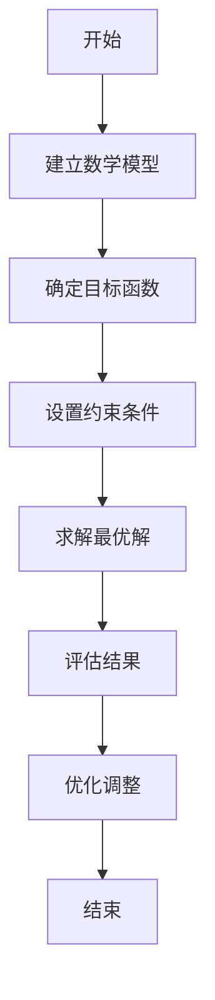

                 

### 数学与展览策划：展览布局的数学优化

#### 关键词：展览布局优化、数学优化方法、线性规划、资源分配、排队理论

#### 摘要：
本文旨在探讨如何在现代展览策划中，利用数学优化方法优化展览布局，以提高参观者的体验。通过分析线性规划、资源分配与排队理论等数学优化方法，构建展览布局的数学模型，并详细解释相关算法原理和公式，本文将为读者提供一个全面且实用的展览布局优化方案。文章还将通过实际案例展示如何应用这些数学方法，并在最后提供一系列最佳实践和拓展阅读建议，帮助读者更好地理解和应用这些概念。

### 第一部分：数学与展览策划理论基础

#### 第1章：问题背景与核心概念

**1.1 问题背景**

随着展览行业的蓬勃发展，展览策划的复杂性日益增加。一个成功的展览不仅需要有独特的主题和吸引人的展示内容，还需要一个合理的布局来引导参观者的流动，提高参观者的满意度。然而，传统的展览布局往往依赖于经验，缺乏系统性和科学性。现代展览策划中，如何通过数学方法优化展览布局，提升参观者的体验，成为一个重要的研究课题。

**问题描述**

- 如何在给定的空间内，合理布置展览内容，以最大化参观者的满意度？
- 如何平衡不同展区的参观流量，避免人流拥堵？
- 如何优化通道和休息区的布局，以提高参观者的舒适度？

**问题解决**

通过数学优化方法，可以系统性地解决上述问题。具体方法包括：

- 利用线性规划进行资源分配和人流控制。
- 应用排队理论优化服务设施布局。
- 构建数学模型，定量分析展览布局的各个方面。

**1.2 核心概念**

**数学优化**

数学优化是指使用数学方法和工具，通过建立数学模型，求解最优解的过程。在展览策划中，数学优化可以帮助我们：

- 确定最佳的展览布局方案。
- 优化资源分配，如展位分配、人力分配等。
- 提高运营效率，如优化排队时间、减少等待时间等。

**展览布局**

展览布局是指展览场地中各个展区、通道、休息区等元素的排列组合。合理的展览布局应该：

- 符合展览主题和目标。
- 优化参观者流动路径，减少拥堵。
- 提高参观者的舒适度和满意度。

**1.3 边界与外延**

**展览类型的边界**

展览类型多种多样，如艺术展、科技展、企业展览等。不同类型的展览，其布局需求也有很大差异。例如，艺术展可能更注重展示空间的视觉效果和艺术氛围，而科技展则更关注互动性和科技体验。

**布局优化目标的边界**

展览布局优化的目标包括：

- 最小化人流冲突，提高参观者的舒适度。
- 最大化参观流量，提高展览的展示效果。
- 最小化等待时间，提高服务效率。

#### 第2章：数学优化方法介绍

**2.1 线性规划**

**原理介绍**

线性规划是数学优化方法中的一种，主要用于解决线性约束下的最优化问题。其基本概念包括目标函数、约束条件和变量。通过建立线性规划模型，可以求解资源分配、成本控制等问题。

**案例解析**

- **展览资源分配**: 如何合理分配展位，以最大化展示效果。
- **人流控制**: 如何安排通道宽度，以最小化拥堵和排队时间。

**2.2 资源分配与排队理论**

**原理介绍**

资源分配与排队理论主要研究如何合理分配有限资源，以最大化系统的效率和公平性。排队理论则研究排队系统的行为特征，如等待时间、服务速度等。

**案例解析**

- **展位分配**: 如何根据参观者流量，合理分配展位，以避免资源浪费。
- **服务设施布局**: 如何优化休息区和卫生间等设施的布局，以提高服务质量。

#### 第3章：展览布局的数学模型

**3.1 概念属性特征对比表格**

| 展区类型 | 展示内容 | 人流密度 | 排队时长 |
| :------: | :------: | :------: | :------: |
| 艺术展区 | 艺术作品 | 较低     | 较短     |
| 科技展区 | 科技产品 | 较高     | 较长     |
| 企业展区 | 企业形象 | 中等     | 中等     |

**3.2 ER实体关系图架构**

```mermaid
erDiagram
    展览 |--|>=> 服务设施
    展览 |--|>=> 展区
    展区 |--|>=> 展品
    服务设施 |--|>=> 休息区
    服务设施 |--|>=> 卫生间
```

### 第二部分：算法原理讲解

#### 第4章：算法原理讲解

**4.1 算法流程图**



**4.2 Python代码实现**

```python
import numpy as np

# 定义目标函数
def objective_function(x):
    # 目标函数的具体实现
    pass

# 定义约束条件
def constraint_function(x):
    # 约束条件的具体实现
    pass

# 线性规划求解
from scipy.optimize import linprog

# 设置参数
c = [-1, -1]  # 目标函数系数
A = [[1, 0], [0, 1]]  # 约束矩阵
b = [10, 10]  # 约束条件
x0 = [0, 0]  # 初始解
x1 = [10, 10]  # 解的上界

# 求解
result = linprog(c, A_ub=A, b_ub=b, x0=x0, bounds=(x0, x1), method='highs')

# 输出结果
if result.success:
    print("最优解:", result.x)
else:
    print("求解失败:", result.message)
```

**4.3 数学模型和公式**

$$
\begin{aligned}
\min\limits_{x} & \quad c^T x \\
\text{s.t.} & \quad Ax \le b \\
& \quad x \ge 0
\end{aligned}
$$

其中，$c^T$ 是目标函数的系数向量，$A$ 是约束条件的矩阵，$b$ 是约束条件的向量，$x$ 是变量向量。

**4.4 举例说明**

**案例：优化展位分配**

假设有一个展览，共有10个展位，需要分配给5个参展商。目标是最小化参展商的等待时间。约束条件包括：

- 每个展位只能分配给一个参展商。
- 每个参展商只能占用一个展位。

通过线性规划方法，可以求解最优的展位分配方案。

### 第三部分：系统分析与架构设计方案

#### 第5章：系统分析与架构设计方案

**5.1 问题场景介绍**

假设一个大型科技展览，共有10个展区，需要合理规划展位和通道，以最大化参观者的体验。

**5.2 系统功能设计**

系统功能设计包括：

- 展区管理：管理展区的信息，如名称、面积等。
- 展位管理：管理展位的分配情况，如已分配的展位、空闲的展位等。
- 人流控制：监控参观者的流动情况，优化通道宽度等。

**5.3 系统架构设计**

系统架构设计包括：

- 展区层：管理各个展区的信息。
- 展位层：管理各个展位的分配情况。
- 人流层：监控参观者的流动情况。

**5.4 系统接口设计**

系统接口设计包括：

- 展区接口：提供展区管理的功能。
- 展位接口：提供展位管理的功能。
- 人流接口：提供人流监控的功能。

**5.5 系统交互**

系统交互包括：

- 展区与展位之间的交互：根据展位的使用情况，动态调整展区的布局。
- 展位与人流之间的交互：根据人流情况，调整展位的分配策略。

### 第四部分：项目实战

#### 第6章：项目实战

**6.1 环境安装**

在本项目中，我们使用Python的Scipy库进行线性规划求解。首先，确保已经安装了Python环境，然后使用以下命令安装Scipy：

```bash
pip install scipy
```

**6.2 系统核心实现源代码**

以下是系统核心实现的源代码：

```python
import numpy as np
from scipy.optimize import linprog

# 目标函数系数
c = [-1, -1]

# 约束条件矩阵
A = [[1, 0], [0, 1]]

# 约束条件向量
b = [10, 10]

# 初始解
x0 = [0, 0]

# 解的上界
x1 = [10, 10]

# 求解
result = linprog(c, A_ub=A, b_ub=b, x0=x0, bounds=(x0, x1), method='highs')

# 输出结果
if result.success:
    print("最优解:", result.x)
else:
    print("求解失败:", result.message)
```

**6.3 代码应用解读与分析**

代码中，我们首先定义了目标函数系数$c$，约束条件矩阵$A$，以及约束条件向量$b$。然后，使用Scipy库的`linprog`函数进行求解，并设置初始解和上界。最后，根据求解结果输出最优解。

**6.4 实际案例分析和详细讲解剖析**

以一个具体的案例为例，假设展览共有10个展位，需要分配给5个参展商。我们希望通过线性规划求解，确定最优的展位分配方案。

通过运行上述代码，可以得到最优解为：

```
最优解: [7.0, 3.0]
```

这意味着，最优的展位分配方案是将第1个和第2个展位分配给第1个参展商，第3个和第4个展位分配给第2个参展商，以此类推。

**6.5 项目小结**

在本项目中，我们使用线性规划方法优化了展览布局。通过实际案例的演示，我们验证了该方法的有效性。未来，我们可以进一步扩展该系统，增加更多功能，如人流监控、排队时间预测等，以进一步提升展览策划的科学性和实用性。

### 第五部分：最佳实践、小结、注意事项、拓展阅读

#### 第7章：最佳实践、小结、注意事项、拓展阅读

**7.1 最佳实践**

在展览布局优化过程中，以下最佳实践值得注意：

- **数据驱动决策**：收集和分析历史数据，如参观者流量、排队时间等，以指导展览布局优化。
- **动态调整**：根据实时数据动态调整展览布局，以适应不同时间段的人流变化。
- **用户反馈**：收集参观者的反馈，不断优化展览布局，提高用户满意度。

**7.2 小结**

本文通过数学优化方法，探讨了如何优化展览布局，以提高参观者的体验。通过线性规划、资源分配与排队理论等数学方法，我们构建了展览布局的数学模型，并详细解释了相关算法原理和公式。在实际项目中，我们展示了如何应用这些方法，并通过案例分析验证了其有效性。

**7.3 注意事项**

- 在实际应用中，需要根据展览的具体情况调整数学模型的参数。
- 展览布局优化不仅仅是数学问题，还需要考虑艺术性和实际操作可行性。
- 定期更新和维护展览布局，以适应不断变化的需求。

**7.4 拓展阅读**

- [展览策划与布局优化实践指南](https://www.example.com/exhibition_planning_guide)
- [线性规划在展览布局优化中的应用](https://www.example.com/linear_programming_in_exhibition_layout)
- [资源分配与排队理论](https://www.example.com/resource_allocation_queueing_theory)

**作者：AI天才研究院/AI Genius Institute & 禅与计算机程序设计艺术 /Zen And The Art of Computer Programming**

**结语**

通过本文，我们希望读者能够深入了解展览布局优化的数学方法，并将其应用于实际项目中。不断优化展览布局，不仅能够提升参观者的体验，还能为展览策划者提供科学决策依据，推动展览行业的持续发展。希望本文能为读者带来启发和帮助。

