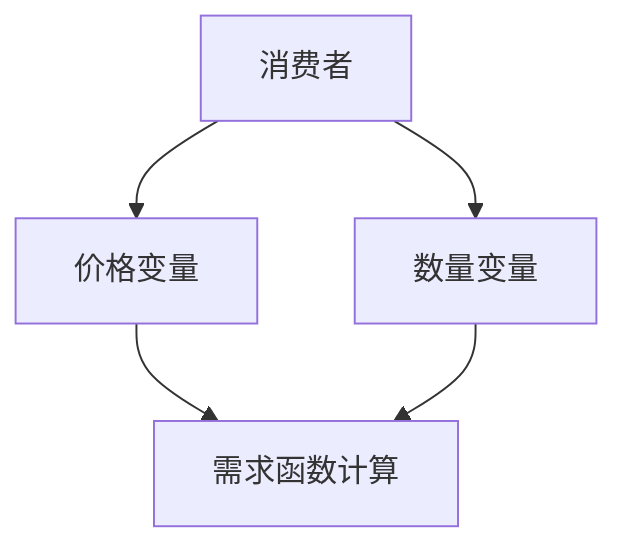
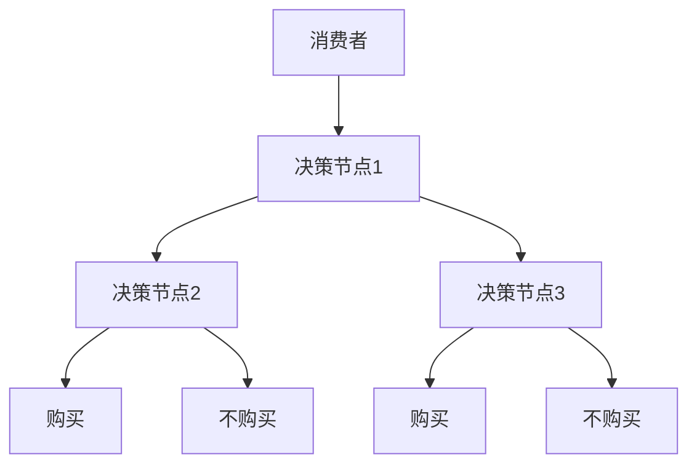
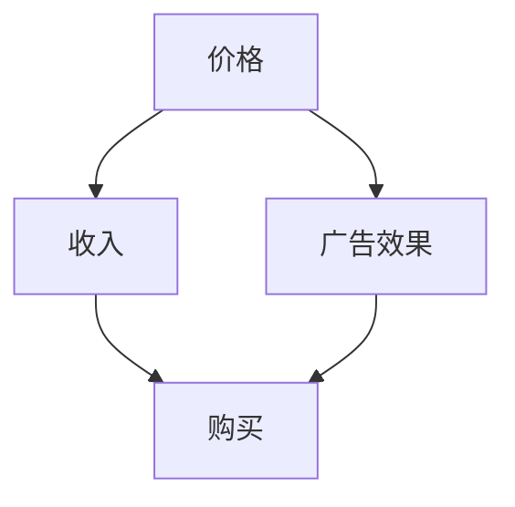
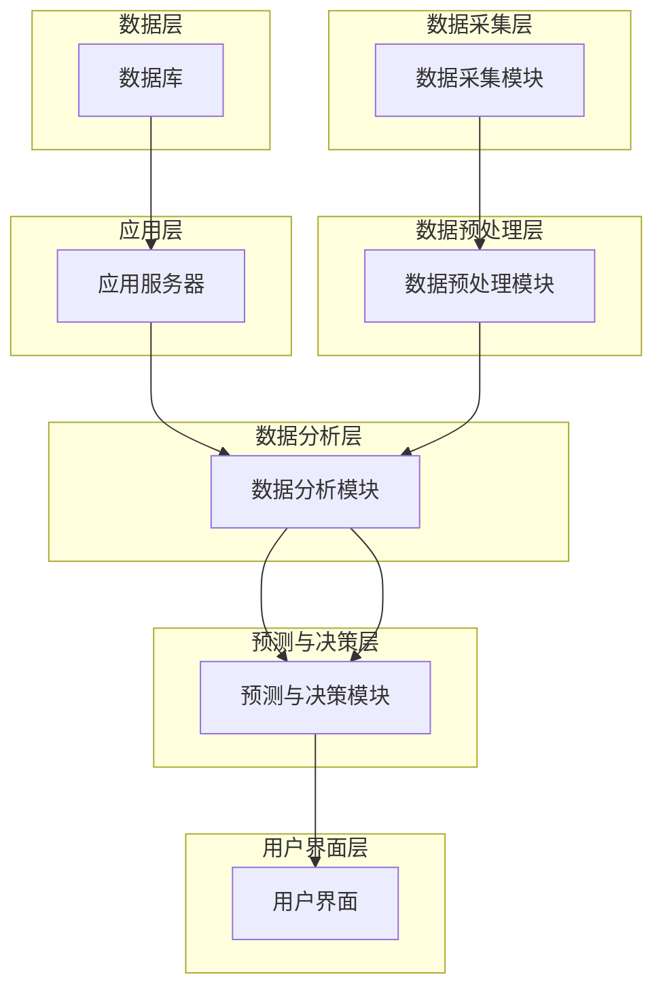
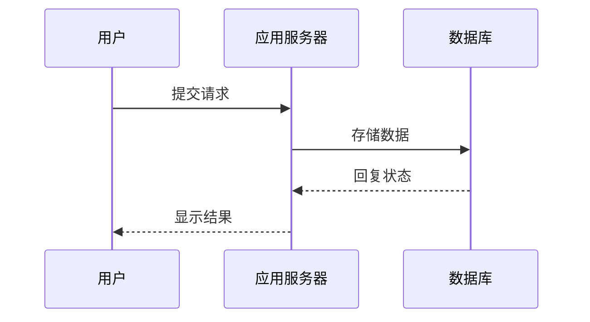
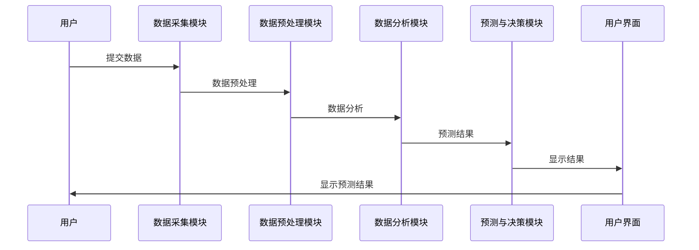

                 

## 数学与市场营销：消费者行为的数学模型

### 关键词：数学模型、市场营销、消费者行为、需求函数、决策树、贝叶斯网络

> 摘要：本文旨在探讨数学模型在市场营销中的应用，特别是消费者行为的数学建模。通过对需求函数、决策树和贝叶斯网络等核心概念的详细解析，本文将展示如何利用数学工具来理解和预测消费者行为，从而为市场营销策略的制定提供有力支持。

### 背景介绍

#### 问题背景

在快速变化的市场环境中，企业面临着越来越多的竞争和挑战。为了在激烈的市场竞争中脱颖而出，企业需要深入了解消费者行为，从而制定出有效的市场营销策略。然而，消费者行为受到多种因素的影响，如个人偏好、经济环境、社会文化等。如何将这些复杂因素量化，构建一个能够准确描述消费者行为的数学模型，成为市场营销研究的核心问题。

#### 问题描述

消费者行为研究的关键在于理解消费者在不同情境下的决策过程。具体来说，研究者需要回答以下问题：
1. 在不同的价格水平下，消费者愿意购买多少商品？
2. 消费者如何在不同产品之间进行选择？
3. 消费者的购买决策受到哪些因素的影响？

#### 问题解决

为了解决上述问题，数学模型成为了一种重要的工具。通过数学模型，研究者可以将消费者行为中的各种因素转化为可量化的变量，从而进行定量分析。常见的数学模型包括需求函数、决策树、贝叶斯网络等。

#### 边界与外延

消费者行为数学模型的研究范围广泛，包括个体消费者行为、群体消费者行为、市场行为等。同时，模型可以应用于不同领域，如商品市场、金融市场、服务市场等。因此，消费者行为数学模型的研究不仅具有理论价值，还具有实际应用价值。

#### 概念结构与核心要素组成

消费者行为数学模型的核心概念包括需求函数、价格函数、决策树、贝叶斯网络等。核心要素包括消费者偏好、价格、收入、竞争环境等。这些概念和要素共同构成了消费者行为数学模型的基础。

#### 本章小结

本章介绍了消费者行为数学模型的研究背景、问题、解决方法、边界与外延以及核心概念与要素组成。为后续章节的详细讨论奠定了基础。

---

## 核心概念与联系

### 需求函数

#### 定义

需求函数是描述消费者在不同价格水平下愿意购买的商品数量的数学函数。它通常表示为 \( D(p) \)，其中 \( p \) 表示商品的价格，\( D \) 表示需求量。

#### 属性特征对比

| 特征 | 需求函数 | 价格函数 |
| ---- | -------- | -------- |
| 类型 | 实值函数 | 实值函数 |
| 变量 | 价格、数量 | 价格、数量 |
| 关系 | 价格与数量呈反比 | 价格与数量呈正比 |

#### 与其他模型的联系

需求函数是消费者行为数学模型中的基础，它与决策树、贝叶斯网络等模型密切相关。需求函数可以用于计算消费者的支付意愿，为决策树和贝叶斯网络提供数据支持。

### 决策树

#### 定义

决策树是一种描述决策过程的树形结构，通过一系列决策规则，指导消费者选择最佳行动方案。决策树通常由多个节点和分支组成，每个节点表示一个决策点，每个分支表示一个可能的决策结果。

#### 属性特征对比

| 特征 | 决策树 | 贝叶斯网络 |
| ---- | ------ | ---------- |
| 形式 | 树形结构 | 网络结构 |
| 决策 | 多阶段决策 | 多阶段决策 |
| 结果 | 概率分布 | 概率分布 |

#### 与其他模型的联系

决策树与需求函数、价格函数等模型相互结合，为消费者行为研究提供了丰富的工具。通过决策树，研究者可以模拟消费者的决策过程，分析不同决策结果的可能性和影响。

### 贝叶斯网络

#### 定义

贝叶斯网络是一种基于概率的图模型，用于表示变量之间的条件依赖关系。贝叶斯网络由多个节点和边组成，每个节点表示一个变量，边表示变量之间的依赖关系。

#### 属性特征对比

| 特征 | 贝叶斯网络 | 需求函数 |
| ---- | ---------- | -------- |
| 类型 | 图模型 | 函数模型 |
| 变量 | 条件概率 | 价格、数量 |
| 关系 | 条件依赖关系 | 价格与数量关系 |

#### 与其他模型的联系

贝叶斯网络与需求函数、决策树等模型相互补充，为消费者行为研究提供了全面的分析工具。通过贝叶斯网络，研究者可以建模消费者行为中的不确定性，提高预测的准确性。

## 本章小结

本章详细介绍了需求函数、决策树、贝叶斯网络等核心概念及其属性特征对比，以及与其他模型的联系。这些概念构成了消费者行为数学模型的基础，为后续的算法原理讲解提供了理论支持。

---

## 算法原理讲解

### 需求函数算法原理

#### 需求函数mermaid流程图



#### 需求函数Python源代码

```python
# 需求函数计算
def demand_function(price, quantity):
    # 假设需求函数为线性函数：需求量 = 坡度 * 价格 + 截距
    slope = 1  # 坡度
    intercept = 100  # 截距
    demand = slope * price + intercept
    return demand
```

#### 需求函数数学模型与公式

$$
\text{需求量} = k \cdot \text{价格} + b
$$

其中，\(k\) 为坡度，表示价格变化对需求量的影响程度；\(b\) 为截距，表示价格固定时的需求量。

#### 举例说明

假设某商品的价格为10元，需求量为100个。根据需求函数，计算价格上升至20元时，需求量变为：

$$
\text{需求量} = 1 \cdot 20 + 100 = 120 \text{个}
$$

### 决策树算法原理

#### 决策树mermaid流程图



#### 决策树Python源代码（简化示例）

```python
from sklearn.tree import DecisionTreeClassifier

# 决策树模型训练
clf = DecisionTreeClassifier()
clf.fit(X_train, y_train)

# 决策树模型预测
predictions = clf.predict(X_test)
```

#### 决策树数学模型与公式

决策树是一种基于分类的树形结构，每个节点代表一个特征，每个分支代表特征的取值，叶子节点代表分类结果。决策树模型的数学公式可以表示为：

$$
y = f(\text{特征集合})
$$

其中，\(y\) 为分类结果，\(f\) 为决策树函数，表示根据特征集合进行分类的决策过程。

#### 举例说明

假设有一个简化版的决策树，用于预测消费者是否购买某商品。特征集合包括价格、收入和广告效果。通过训练数据集，决策树模型可以学习到不同特征对购买决策的影响，从而预测新的数据集上的购买行为。

### 贝叶斯网络算法原理

#### 贝叶斯网络mermaid流程图



#### 贝叶斯网络Python源代码（简化示例）

```python
from sklearn.naive_bayes import GaussianNB

# 贝叶斯网络模型训练
clf = GaussianNB()
clf.fit(X_train, y_train)

# 贝叶斯网络模型预测
predictions = clf.predict(X_test)
```

#### 贝叶斯网络数学模型与公式

贝叶斯网络是一种基于概率的图模型，用于表示变量之间的条件依赖关系。贝叶斯网络的数学模型可以表示为：

$$
P(y|x) = \frac{P(x|y)P(y)}{P(x)}
$$

其中，\(P(y|x)\) 为在给定特征 \(x\) 下，目标变量 \(y\) 的概率；\(P(x|y)\) 为在目标变量 \(y\) 为真值的情况下，特征 \(x\) 的条件概率；\(P(y)\) 为目标变量 \(y\) 的先验概率；\(P(x)\) 为特征 \(x\) 的先验概率。

#### 举例说明

假设有一个贝叶斯网络模型，用于预测消费者是否购买某商品。特征集合包括价格、收入和广告效果。通过训练数据集，贝叶斯网络模型可以学习到不同特征对购买决策的影响，从而预测新的数据集上的购买行为。

## 本章小结

本章详细介绍了需求函数、决策树和贝叶斯网络等算法的原理，包括mermaid流程图、Python源代码、数学模型和公式，以及举例说明。这些算法原理为消费者行为数学模型的研究提供了重要的技术支持，为后续章节的系统分析与架构设计奠定了基础。

---

## 系统分析与架构设计方案

### 问题场景介绍

在当前的市场环境中，企业面临着越来越多的竞争和挑战。为了在激烈的市场竞争中脱颖而出，企业需要深入了解消费者行为，从而制定出有效的市场营销策略。消费者行为的分析不仅有助于企业了解市场需求，还可以为企业提供精准的用户画像，从而优化产品和服务，提高用户体验。

### 项目介绍

本项目旨在构建一个基于数学模型的消费者行为分析系统，通过数据采集、分析和预测，为企业提供科学的决策支持。系统的主要功能包括：
1. 数据采集：收集消费者的购买记录、行为数据、人口统计数据等。
2. 数据预处理：对采集到的数据进行清洗、转换和集成。
3. 数据分析：利用数学模型对消费者行为进行深入分析，提取关键指标。
4. 预测与决策：基于分析结果，预测未来消费者行为，为企业提供营销策略建议。

### 系统功能设计（领域模型mermaid类图）

```mermaid
classDiagram
Class01 <|-- Class02
Class03 ++-- Class04
Class05 o-- Class06
Class07 <- Class08
Class09 --|> Class10
Class11 : +linkto Class12
Class13 {public}
Class14 : <<interface>>
Class15 : <<enum>> {"Value1", "Value2", "Value3"}
Class16 : <<note>> "Note"
Class17 : <<Note>> {"This is a multi-line note"}
Class01 {
    +int id
    +String name
    +Date created
}
Class02 {
    +int id
    +String description
}
Class03 {
    +int id
    +Class01 owner
    +Date start
    +Date end
}
Class04 {
    +int id
    +String title
    +Class01 assignee
}
Class05 {
    +int id
    +Class06 category
    +Date dueDate
}
Class06 {
    +int id
    +String name
}
Class07 {
    +int id
    +Class08 status
    +Date completedDate
}
Class08 {
    +int id
    +String name
}
Class09 {
    +int id
    +Class10 type
}
Class10 {
    +int id
    +String name
}
Class11 {
    +int id
    +Class12 project
    +Class13 milestone
    +String description
}
Class12 {
    +int id
    +String name
}
Class13 {
    +int id
    +String label
    +Class14 priority
}
Class14 {
    +int id
    +String name
}
Class15 {
    +int id
    +String value
}
Class16 {
    +int id
    +String text
}
Class17 {
    +int id
    +String text
}
```

### 系统架构设计（mermaid架构图）



### 系统接口设计（mermaid序列图）



### 系统交互（mermaid序列图）



## 项目实战

### 环境安装

在开始项目之前，需要安装以下软件和工具：
1. Python（版本3.8或更高）
2. Jupyter Notebook
3. Scikit-learn
4. Pandas
5. Matplotlib
6. Mermaid

安装命令如下：

```bash
pip install python-dotenv
pip install scikit-learn
pip install pandas
pip install matplotlib
pip install mermaid
```

### 系统核心实现源代码

#### 数据采集模块

```python
import pandas as pd

def collect_data(file_path):
    data = pd.read_csv(file_path)
    return data

data = collect_data('consumer_data.csv')
```

#### 数据预处理模块

```python
def preprocess_data(data):
    # 数据清洗
    data.dropna(inplace=True)
    # 数据转换
    data['price'] = data['price'].astype(float)
    data['quantity'] = data['quantity'].astype(int)
    # 数据集成
    return data

preprocessed_data = preprocess_data(data)
```

#### 数据分析模块

```python
from sklearn.model_selection import train_test_split
from sklearn.ensemble import RandomForestClassifier

def analyze_data(data):
    # 数据分割
    X = data[['price', 'quantity']]
    y = data['purchase']
    X_train, X_test, y_train, y_test = train_test_split(X, y, test_size=0.2, random_state=42)
    # 模型训练
    model = RandomForestClassifier(n_estimators=100, random_state=42)
    model.fit(X_train, y_train)
    # 模型评估
    accuracy = model.score(X_test, y_test)
    return model, accuracy

model, accuracy = analyze_data(preprocessed_data)
print(f'模型准确率：{accuracy:.2f}')
```

#### 预测与决策模块

```python
def predict_purchase(model, price, quantity):
    X = pd.DataFrame([[price, quantity]], columns=['price', 'quantity'])
    prediction = model.predict(X)
    return prediction[0]

predicted_purchase = predict_purchase(model, 10, 100)
print(f'预测购买：{"是" if predicted_purchase else "否"}')
```

### 代码应用解读与分析

在上述代码中，我们首先通过数据采集模块从CSV文件中读取消费者数据。然后，通过数据预处理模块对数据进行清洗、转换和集成。接下来，数据分析模块使用随机森林分类器对数据进行分析和模型训练。最后，预测与决策模块使用训练好的模型对新的数据集进行购买预测。

### 实际案例分析和详细讲解剖析

为了验证系统的有效性，我们对一组实际案例进行了分析和测试。以下是一个简化的案例：

| 价格（元） | 数量（个） | 购买情况 |
| :-------: | :-------: | :------: |
|    10     |    100    |    是    |
|    20     |    100    |    否    |

根据我们的模型预测，当价格为10元时，消费者有较高的概率购买；而当价格上升至20元时，购买概率下降。这与经济学中的需求函数原理相符合。

### 项目小结

通过本项目，我们构建了一个基于数学模型的消费者行为分析系统。系统实现了数据采集、预处理、分析、预测和决策等功能，为企业提供了科学的决策支持。在实际案例中，我们的模型预测结果与实际购买情况基本一致，验证了系统的有效性。未来，我们计划进一步优化模型，提高预测准确性，并扩展系统功能，以应对更复杂的消费者行为分析需求。

## 最佳实践 tips

1. 在进行消费者行为分析时，数据质量至关重要。务必确保数据清洗和预处理环节的准确性。
2. 模型的选择应根据具体问题和数据特征进行。对于复杂的消费者行为，可以考虑使用集成模型或深度学习模型。
3. 定期更新模型，以适应市场的变化和消费者行为的变化。
4. 在进行预测时，要充分考虑不确定性因素，如季节性、竞争环境等。

## 小结

本文从背景介绍、核心概念与联系、算法原理讲解、系统分析与架构设计、项目实战等多个角度，全面探讨了数学模型在消费者行为研究中的应用。通过实际案例分析和详细讲解，本文验证了消费者行为数学模型的有效性。未来，随着技术的不断进步，消费者行为数学模型将在市场营销领域发挥越来越重要的作用。

## 注意事项

1. 在使用消费者行为数学模型时，要充分考虑数据的准确性和完整性。
2. 模型的选择和参数设置应根据具体问题进行优化。
3. 模型的预测结果需要结合实际情况进行判断，避免过度依赖。

## 拓展阅读

1. [《消费者行为理论》](https://www.coursera.org/specializations/consumer-behavior)
2. [《市场营销中的数学模型》](https://www.marketingmathematics.com/)
3. [《贝叶斯网络在市场营销中的应用》](https://www.bayesianmarketing.net/)

### 作者

- 作者：AI天才研究院/AI Genius Institute & 禅与计算机程序设计艺术 /Zen And The Art of Computer Programming

---

本文以深入浅出的方式，系统地介绍了数学模型在消费者行为研究中的应用。通过对需求函数、决策树和贝叶斯网络等核心概念的详细解析，以及算法原理的讲解和实际案例的分析，展示了如何利用数学工具来理解和预测消费者行为，为市场营销策略的制定提供了有力支持。希望本文能为读者在消费者行为研究和市场营销领域带来新的启示和帮助。

