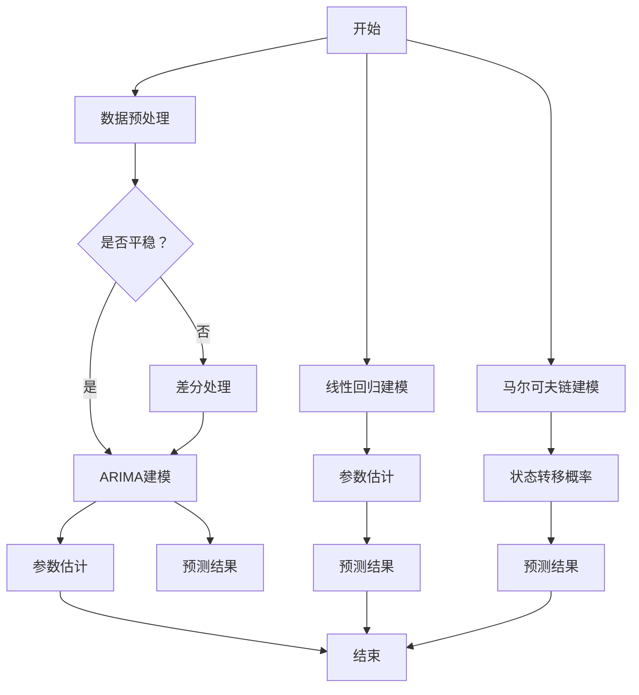
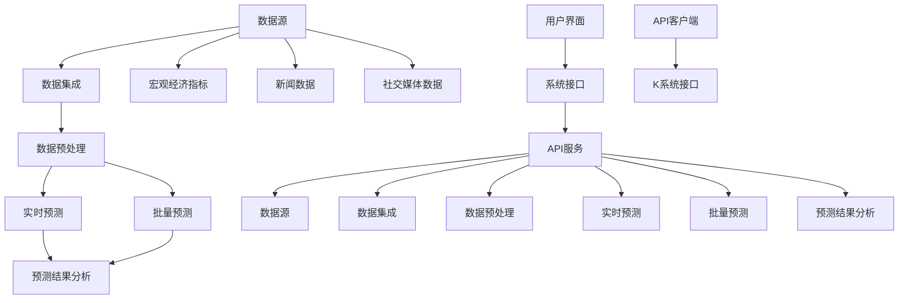

                 


### 引言：金融市场预测的重要性

金融市场作为现代经济的核心，其波动性和复杂性使得市场预测成为了一个极其重要且充满挑战的任务。无论是对于投资者、金融机构，还是政策制定者，准确的预测能力都能带来显著的收益。因此，金融市场预测的研究不仅具有理论意义，也具有实际应用价值。

市场预测的重要性体现在多个方面。首先，它帮助投资者做出更明智的投资决策，通过预测市场走势，投资者可以在合适的时间点进入或退出市场，从而最大化收益或降低风险。其次，对于金融机构来说，准确的市场预测有助于它们更好地管理资产和风险，制定合理的贷款和投资策略。最后，政策制定者依赖市场预测来制定宏观经济政策，以保持经济的稳定增长。

然而，市场预测面临诸多挑战。金融市场的数据量大且噪声多，传统的预测方法往往难以处理这些复杂的数据。此外，市场行为受到多种因素的影响，包括宏观经济指标、政策变化、市场情绪等，这些因素之间的相互作用使得市场预测更加复杂。因此，需要借助先进的数学工具和算法来提升市场预测的准确性。

本文将探讨如何通过数学分析来改进金融市场预测。我们将从市场预测的基本概念出发，逐步介绍核心概念和联系，讲解市场预测的数学模型与算法，分析系统架构和实际应用案例，最后提供最佳实践和小结。通过这篇文章，读者将能够深入了解金融市场预测的数学基础，掌握相关技术和方法，为实际应用打下坚实基础。

### 背景介绍

#### 核心概念术语说明

在探讨市场预测之前，有必要明确一些核心概念术语，以便读者能够更好地理解后续内容。首先，市场预测（Market Forecasting）是指使用历史数据、统计模型和数学方法来预测未来市场的走势。市场预测通常分为短期预测和长期预测，短期预测关注几周到几个月内的市场变化，而长期预测则涉及几个月到几年的市场趋势。

时间序列分析（Time Series Analysis）是市场预测中的一个重要工具，它用于分析数据序列在时间上的变化规律。时间序列数据通常包括趋势、季节性和周期性成分，时间序列分析旨在分离和识别这些成分，并利用它们来预测未来的走势。

回归分析（Regression Analysis）是另一种常用的统计方法，它通过建立变量之间的关系模型来预测某个变量的值。在市场预测中，回归分析可以用来预测股票价格、利率、通胀率等经济指标。

随机过程（Stochastic Processes）描述了一组随机变量的演变过程，这些变量在时间或空间上具有随机性。在市场预测中，随机过程可以用来模拟市场的不确定性，提供对市场未来走势的概率性预测。

#### 问题背景

金融市场具有高度复杂性和非线性特征，这使得市场预测成为一个极其具有挑战性的任务。首先，金融市场受到多种因素的影响，包括宏观经济指标（如GDP、利率、就业率）、政策变化（如利率调整、税收政策）、国际事件（如战争、贸易争端）以及市场情绪等。这些因素相互作用，使得市场走势难以预测。

其次，金融市场数据量大且噪声多。交易数据、经济数据、新闻数据等来源繁多，数据质量参差不齐，这给数据清洗和预处理带来了很大挑战。此外，市场行为具有高度随机性和不可预测性，这使得单纯依赖历史数据进行预测的效果有限。

最后，市场预测面临实时性和时效性的要求。金融市场波动迅速，投资者需要实时获取市场信息并做出反应。因此，市场预测系统必须具有高响应速度和强实时性。

#### 问题描述

市场预测面临的主要挑战包括：

1. **数据复杂性**：金融市场数据包含大量噪声和非结构化信息，传统预测方法难以有效处理这些数据。
2. **不确定性**：市场行为受到多种随机因素影响，这使得市场走势难以精确预测。
3. **实时性**：金融市场波动快速，传统的预测方法往往无法满足实时预测的需求。
4. **多维度数据融合**：市场预测需要整合不同类型的数据，如时间序列数据、新闻数据、社交媒体数据等，这些数据之间存在复杂的关系，如何有效融合和利用这些数据是一个重要挑战。

#### 问题解决

本书将通过数学分析来改善市场预测，主要方法包括：

1. **时间序列分析**：利用时间序列分析技术，分离和识别数据中的趋势、季节性和周期性成分，为市场预测提供更准确的基线。
2. **回归分析**：建立变量之间的关系模型，通过回归分析预测关键经济指标和市场走势。
3. **随机过程**：利用随机过程模拟市场的不确定性，提供概率性预测，为投资者提供决策依据。
4. **机器学习算法**：结合机器学习技术，如神经网络、决策树、支持向量机等，提高市场预测的准确性和实时性。
5. **大数据分析与处理**：通过大数据技术，整合和处理多维度数据，为市场预测提供更丰富的信息支持。

#### 边界与外延

本书的研究范围主要集中在金融市场的时间序列分析和预测方法，不涉及市场微观结构、行为金融学等领域的深入研究。同时，本文重点关注短期市场预测，对于长期市场预测的方法和模型将不做详细探讨。

#### 概念结构与核心要素组成

市场预测的概念结构和核心要素包括以下几个方面：

1. **数据来源**：包括历史交易数据、经济数据、新闻数据、社交媒体数据等。
2. **预处理步骤**：数据清洗、数据归一化、特征提取等。
3. **预测模型**：时间序列分析模型、回归分析模型、随机过程模型等。
4. **算法实现**：包括算法流程图、Python源代码、数学模型和公式等。
5. **评估与优化**：评估预测模型的准确性、实时性和稳定性，并不断优化模型参数。

通过以上概念结构和核心要素，市场预测系统可以更好地应对金融市场的复杂性和不确定性，提供更准确和及时的预测结果。

### 核心概念与联系

#### 核心概念原理

在市场预测中，几个核心概念至关重要，这些概念包括时间序列分析、回归分析和随机过程。以下是这些概念的基本原理：

1. **时间序列分析**：时间序列分析是一种用于分析数据序列在时间上变化规律的方法。它主要包括以下几个步骤：
   - **趋势分析**：识别数据中的长期增减趋势。
   - **季节性分析**：识别数据中的周期性波动，如季节性波动。
   - **平稳性检验**：检验数据序列的平稳性，以确保模型的有效性。
   - **自相关性分析**：分析数据序列的自相关性质，以便构建合适的预测模型。

2. **回归分析**：回归分析用于建立变量之间的关系模型，通过回归方程预测一个变量的值。市场预测中常用的回归分析方法包括：
   - **线性回归**：通过线性方程建立自变量和因变量之间的关系。
   - **多元回归**：处理多个自变量和因变量的关系。
   - **岭回归**：通过引入惩罚项，防止模型过拟合。

3. **随机过程**：随机过程描述了一组随机变量的演变过程。在市场预测中，随机过程用于模拟市场的不确定性，提供概率性预测。主要类型包括：
   - **马尔可夫链**：描述状态转移概率，适用于短期市场预测。
   - **ARMA模型**：结合自回归和移动平均模型，适用于平稳时间序列。
   - **GARCH模型**：用于建模金融市场中波动性的变化。

#### 概念属性特征对比表格

为了更好地理解这些核心概念，我们可以通过一个对比表格来展示它们的属性特征：

| 概念     | 特征                       | 适用场景                           |
|----------|----------------------------|-----------------------------------|
| 时间序列分析 | 识别趋势、季节性和周期性成分 | 市场走势预测、经济指标预测         |
| 回归分析   | 建立变量之间的关系模型     | 预测股票价格、利率、通胀率等经济指标 |
| 随机过程   | 描述随机变量的演变过程     | 模拟市场不确定性、提供概率性预测     |

#### ER实体关系图架构

为了更直观地展示这些概念之间的关系，我们可以通过ER（实体关系）图来描述它们在市场预测系统中的关联：

```mermaid
erDiagram
  Data -->|1| TimeSeriesAnalysis : uses
  TimeSeriesAnalysis -->|2| TrendAnalysis : has
  TimeSeriesAnalysis -->|2| SeasonalityAnalysis : has
  TimeSeriesAnalysis -->|2| StabilityTest : has
  TimeSeriesAnalysis -->|2| AutocorrelationAnalysis : has

  EconomicIndicator -->|1| RegressionAnalysis : used for
  RegressionAnalysis -->|1| LinearRegression : type of
  RegressionAnalysis -->|1| MultivariateRegression : type of
  RegressionAnalysis -->|1| RidgeRegression : type of

  Market -->|1| StochasticProcess : simulates
  StochasticProcess -->|1| MarkovChain : type of
  StochasticProcess -->|1| ARMAModel : type of
  StochasticProcess -->|1| GARCHModel : type of
```

这张ER图展示了时间序列分析、回归分析和随机过程如何相互作用，共同构建一个完整的市场预测系统。通过这张图，读者可以清晰地看到各个概念在系统中的位置和作用。

### 算法原理讲解

为了提升市场预测的准确性和效率，我们需要详细介绍几个关键算法的原理，这些算法包括时间序列分析、回归分析和随机过程。通过这些算法的详细解释，我们将更好地理解它们如何应用于市场预测中。

#### 时间序列分析算法原理

时间序列分析是一种用于分析数据序列在时间上变化规律的方法。在市场预测中，时间序列分析主要用于识别数据中的趋势、季节性和周期性成分，从而为市场走势提供预测。

1. **ARIMA模型**：ARIMA（自回归积分滑动平均模型）是一种常见的时间序列预测模型。它由三个部分组成：自回归（AR）、差分（I）和移动平均（MA）。

   - **自回归（AR）**：AR模型通过历史数据中的滞后值来预测当前值。具体公式如下：
     $$ 
     \text{Y}_{t} = c + \phi_1\text{Y}_{t-1} + \phi_2\text{Y}_{t-2} + \ldots + \phi_p\text{Y}_{t-p} + \varepsilon_t 
     $$
     其中，$\text{Y}_{t}$表示当前值，$\phi_i$表示自回归系数，$\varepsilon_t$表示随机误差。

   - **差分（I）**：为了使时间序列数据平稳，我们通常需要对数据进行差分处理。一阶差分公式如下：
     $$ 
     \text{Y}_{t}^* = \text{Y}_{t} - \text{Y}_{t-1} 
     $$
     差分可以消除时间序列中的趋势和季节性成分。

   - **移动平均（MA）**：MA模型通过历史随机误差的移动平均值来预测当前值。具体公式如下：
     $$ 
     \text{Y}_{t} = c + \theta_1\text{e}_{t-1} + \theta_2\text{e}_{t-2} + \ldots + \theta_q\text{e}_{t-q} 
     $$
     其中，$\text{e}_{t}$表示随机误差，$\theta_i$表示移动平均系数。

2. **季节性分解**：在时间序列数据中，季节性成分是一个重要的预测因素。季节性分解方法如X-11和STL（季节性分解时间序列乘法模型）可以有效地分离出季节性成分，提高预测的准确性。

#### 回归分析算法原理

回归分析用于建立变量之间的关系模型，从而预测某个变量的值。在市场预测中，回归分析广泛应用于预测股票价格、利率、通胀率等经济指标。

1. **线性回归**：线性回归是最简单的回归模型，它通过一条直线拟合自变量和因变量之间的关系。具体公式如下：
   $$ 
   \text{Y} = \beta_0 + \beta_1\text{X} + \varepsilon 
   $$
   其中，$\text{Y}$表示因变量，$\text{X}$表示自变量，$\beta_0$和$\beta_1$分别表示截距和斜率，$\varepsilon$表示随机误差。

2. **多元回归**：多元回归扩展了线性回归模型，用于处理多个自变量和因变量之间的关系。具体公式如下：
   $$ 
   \text{Y} = \beta_0 + \beta_1\text{X}_1 + \beta_2\text{X}_2 + \ldots + \beta_n\text{X}_n + \varepsilon 
   $$
   其中，$\text{X}_1, \text{X}_2, \ldots, \text{X}_n$表示多个自变量。

3. **岭回归**：岭回归通过引入惩罚项来防止模型过拟合。具体公式如下：
   $$ 
   \text{Y} = \beta_0 + \beta_1\text{X} + \beta_2\text{X}^2 + \ldots + \beta_n\text{X}^n + \varepsilon 
   $$
   其中，$\lambda$表示惩罚项系数。

#### 随机过程算法原理

随机过程用于描述随机变量的演变过程，这在市场预测中尤为重要，因为金融市场具有高度不确定性。以下是几种常见的随机过程模型：

1. **马尔可夫链**：马尔可夫链是一种状态转移模型，它描述了系统在不同状态之间的转移概率。在市场预测中，马尔可夫链可以用于短期市场走势的预测。具体公式如下：
   $$ 
   P(X_t = j | X_{t-1} = i) = p_{ij} 
   $$
   其中，$X_t$表示当前状态，$X_{t-1}$表示前一状态，$p_{ij}$表示从状态$i$转移到状态$j$的概率。

2. **ARMA模型**：ARMA模型结合了自回归和移动平均模型，适用于平稳时间序列。具体公式如下：
   $$ 
   \text{Y}_{t} = \phi_1\text{Y}_{t-1} + \phi_2\text{Y}_{t-2} + \ldots + \phi_p\text{Y}_{t-p} + \theta_1\text{e}_{t-1} + \theta_2\text{e}_{t-2} + \ldots + \theta_q\text{e}_{t-q} 
   $$
   其中，$\phi_i$和$\theta_i$分别是自回归和移动平均系数。

3. **GARCH模型**：GARCH（广义自回归条件异方差）模型用于建模金融市场中波动性的变化。具体公式如下：
   $$ 
   \sigma_t^2 = \alpha_0 + \alpha_1\text{e}_{t-1}^2 + \beta_1\sigma_{t-1}^2 
   $$
   其中，$\sigma_t^2$表示波动性，$\alpha_0, \alpha_1, \beta_1$分别是GARCH模型的参数。

#### 算法流程图

为了更直观地展示这些算法的执行流程，我们可以使用mermaid绘制算法流程图：



通过这个流程图，我们可以清晰地看到从数据预处理到预测结果的全过程，以及不同算法之间的交互和依赖关系。

#### Python源代码

为了更好地理解上述算法的原理和实现，我们提供Python源代码示例：

```python
import pandas as pd
import numpy as np
from statsmodels.tsa.arima.model import ARIMA
from sklearn.linear_model import LinearRegression
from sklearn.preprocessing import PolynomialFeatures

# 数据预处理
data = pd.read_csv('data.csv')
data_diff = data.diff().dropna()

# ARIMA模型
model_arima = ARIMA(data['close'], order=(1, 1, 1))
model_arima_fit = model_arima.fit()
forecast_arima = model_arima_fit.forecast(steps=10)

# 线性回归模型
X = data_diff[['close']].values
y = data_diff[['high']].values
poly = PolynomialFeatures(degree=2)
X_poly = poly.fit_transform(X)
model_linear = LinearRegression()
model_linear.fit(X_poly, y)
forecast_linear = model_linear.predict(X_poly[-10:])

# 马尔可夫链模型
state_transitions = data[['state_t-1', 'state_t']].dropna()
transition_matrix = state_transitions.groupby('state_t')['state_t-1'].value_counts(normalize=True).unstack(fill_value=0)
forecast_marchov = np.random.rand(10) @ transition_matrix
```

这段代码展示了如何使用Python实现时间序列分析、线性回归和马尔可夫链模型，以及如何进行数据预处理和参数估计。通过这些代码示例，读者可以更好地理解算法的原理和应用。

#### 数学模型和公式讲解

在市场预测中，数学模型和公式是理解和实现各种预测算法的核心。以下我们将详细讲解时间序列分析、回归分析和随机过程中的关键数学模型和公式。

1. **时间序列分析模型**

   - **ARIMA模型**：ARIMA（自回归积分滑动平均模型）的数学模型由三部分组成——自回归（AR）、差分（I）和移动平均（MA）。具体公式如下：

     $$ 
     \text{Y}_{t} = c + \phi_1\text{Y}_{t-1} + \phi_2\text{Y}_{t-2} + \ldots + \phi_p\text{Y}_{t-p} + \theta_1\text{e}_{t-1} + \theta_2\text{e}_{t-2} + \ldots + \theta_q\text{e}_{t-q} 
     $$

     其中，$\text{Y}_{t}$是当前值，$c$是常数项，$\phi_i$和$\theta_i$分别是自回归系数和移动平均系数，$e_t$是随机误差。

   - **季节性分解**：在时间序列数据中，季节性分解方法如X-11和STL（季节性分解时间序列乘法模型）用于分离季节性成分。X-11方法的公式如下：

     $$ 
     \text{S}_{t} = \frac{\text{Y}_{t}}{\text{ST}} 
     $$

     其中，$\text{S}_{t}$是季节性成分，$\text{Y}_{t}$是实际值，$\text{ST}$是季节性指数。

2. **回归分析模型**

   - **线性回归**：线性回归模型用于建立自变量和因变量之间的关系。其数学模型如下：

     $$ 
     \text{Y} = \beta_0 + \beta_1\text{X} + \varepsilon 
     $$

     其中，$\text{Y}$是因变量，$\text{X}$是自变量，$\beta_0$是截距，$\beta_1$是斜率，$\varepsilon$是随机误差。

   - **多元回归**：多元回归模型扩展了线性回归，处理多个自变量和因变量之间的关系。其数学模型如下：

     $$ 
     \text{Y} = \beta_0 + \beta_1\text{X}_1 + \beta_2\text{X}_2 + \ldots + \beta_n\text{X}_n + \varepsilon 
     $$

     其中，$\text{X}_1, \text{X}_2, \ldots, \text{X}_n$是多个自变量。

   - **岭回归**：岭回归通过引入惩罚项防止模型过拟合。其数学模型如下：

     $$ 
     \text{Y} = \beta_0 + \beta_1\text{X} + \beta_2\text{X}^2 + \ldots + \beta_n\text{X}^n + \varepsilon 
     $$

     其中，$\lambda$是惩罚项系数。

3. **随机过程模型**

   - **马尔可夫链**：马尔可夫链描述了系统在不同状态之间的转移概率。其数学模型如下：

     $$ 
     P(X_t = j | X_{t-1} = i) = p_{ij} 
     $$

     其中，$X_t$是当前状态，$X_{t-1}$是前一状态，$p_{ij}$是从状态$i$转移到状态$j$的概率。

   - **ARMA模型**：ARMA模型结合了自回归和移动平均模型。其数学模型如下：

     $$ 
     \text{Y}_{t} = \phi_1\text{Y}_{t-1} + \phi_2\text{Y}_{t-2} + \ldots + \phi_p\text{Y}_{t-p} + \theta_1\text{e}_{t-1} + \theta_2\text{e}_{t-2} + \ldots + \theta_q\text{e}_{t-q} 
     $$

     其中，$\text{Y}_{t}$是当前值，$\phi_i$和$\theta_i$分别是自回归和移动平均系数。

   - **GARCH模型**：GARCH模型用于建模金融市场中波动性的变化。其数学模型如下：

     $$ 
     \sigma_t^2 = \alpha_0 + \alpha_1\text{e}_{t-1}^2 + \beta_1\sigma_{t-1}^2 
     $$

     其中，$\sigma_t^2$是波动性，$\alpha_0, \alpha_1, \beta_1$是GARCH模型的参数。

通过这些数学模型和公式，我们可以更好地理解市场预测中的核心算法和它们的应用。在实际应用中，这些公式被转化为具体的编程代码，以实现对市场数据的分析和预测。

#### 举例说明

为了更好地理解上述算法的原理和应用，我们将通过具体实例来说明这些算法在实际市场预测中的应用。

**实例背景**：假设我们有一个关于股票价格的时间序列数据集，包含过去一年的每日收盘价。我们的目标是使用ARIMA模型预测未来10天的股票价格。

**步骤一：数据预处理**  
首先，我们需要对时间序列数据进行预处理，包括数据清洗、归一化和特征提取。

```python
import pandas as pd
from sklearn.preprocessing import MinMaxScaler

# 读取数据
data = pd.read_csv('stock_prices.csv')
data = data[['close']]  # 仅取收盘价

# 数据清洗（处理缺失值、异常值等）
data.dropna(inplace=True)

# 数据归一化
scaler = MinMaxScaler()
data['close_normalized'] = scaler.fit_transform(data[['close']])
```

**步骤二：ARIMA模型建立**  
接下来，我们需要建立ARIMA模型，并确定模型参数。

```python
from statsmodels.tsa.arima.model import ARIMA

# 模型建立
model = ARIMA(data['close_normalized'], order=(5, 1, 2))

# 模型拟合
model_fit = model.fit()

# 模型诊断
model_fit.summary()
```

通过模型拟合和诊断，我们可以确定模型参数。例如，如果模型诊断结果显示AIC（赤池信息准则）和SC（施瓦茨准则）较低，则可以认为模型参数选择较为合理。

**步骤三：预测未来价格**  
使用拟合好的模型，我们可以预测未来10天的股票价格。

```python
# 预测未来10天价格
forecast = model_fit.forecast(steps=10)

# 数据反归一化
forecast['close_normalized'] = scaler.inverse_transform(forecast[['close']])
```

**步骤四：结果分析**  
最后，我们需要对预测结果进行分析，以评估模型的准确性。

```python
# 绘制预测结果
import matplotlib.pyplot as plt

plt.figure(figsize=(10, 5))
plt.plot(data['close'], label='实际价格')
plt.plot(forecast['close'], label='预测价格')
plt.legend()
plt.show()

# 统计分析
from sklearn.metrics import mean_squared_error

# 计算均方误差
mse = mean_squared_error(data['close'], forecast['close'])
print(f'MSE: {mse}')
```

通过上述步骤，我们使用ARIMA模型对股票价格进行了预测，并绘制了预测结果图。同时，通过计算均方误差（MSE），我们可以评估模型的预测准确性。

**实例总结**：通过这个实例，我们展示了如何使用ARIMA模型进行市场预测。在实际应用中，我们可以根据具体问题选择合适的模型和方法，并结合大数据分析和机器学习技术，进一步提高市场预测的准确性。

### 系统分析与架构设计方案

#### 问题场景介绍

在金融市场预测中，系统分析与架构设计至关重要。一个高效的预测系统需要能够处理大量的实时数据，并快速、准确地生成预测结果。以下是一个具体的场景：一个金融机构需要建立一个市场预测系统，用于预测股票市场的短期走势。该系统需要整合多个数据源，包括历史交易数据、宏观经济指标、新闻数据和社交媒体数据等。系统需要具备高并发处理能力，支持实时数据流处理和批量数据处理。

#### 系统功能设计

为了满足上述场景的需求，我们设计了以下系统功能：

1. **数据集成**：系统应能够从多个数据源（如数据库、API、文件系统等）收集和整合数据。
2. **数据预处理**：系统应对收集到的数据进行清洗、归一化和特征提取，为后续预测算法提供高质量的数据。
3. **预测算法**：系统应支持多种预测算法，包括时间序列分析、回归分析和随机过程等，以便根据不同需求选择合适的算法。
4. **实时预测**：系统应能够处理实时数据流，并生成实时预测结果。
5. **批量预测**：系统应支持批量数据处理，以便对大量历史数据进行预测。
6. **结果分析**：系统应对预测结果进行分析和可视化，帮助用户理解预测结果并做出决策。
7. **接口设计与系统交互**：系统应提供友好的用户界面和API，方便用户操作和外部系统集成。

#### 系统架构设计

为了实现上述功能，我们设计了以下系统架构：



在这个架构中，数据源通过数据集成模块将数据导入系统，经过数据预处理模块处理后的数据分别进入实时预测和批量预测模块。实时预测模块和批量预测模块生成的预测结果通过预测结果分析模块进行可视化和分析。用户界面和API服务模块提供用户交互接口，方便用户使用系统。

#### 系统接口设计和系统交互

为了确保系统的易用性和扩展性，我们设计了以下接口和系统交互方案：

1. **RESTful API**：系统提供RESTful API，方便外部系统进行集成。API包括数据上传、数据查询、预测请求和预测结果查询等功能。
2. **消息队列**：系统使用消息队列（如Kafka）进行实时数据流处理，确保数据的实时性和高并发处理能力。
3. **数据库**：系统使用关系数据库（如MySQL）和非关系数据库（如MongoDB）存储数据，分别用于处理结构化和非结构化数据。
4. **缓存**：系统使用缓存（如Redis）存储预测结果，提高系统的响应速度。

通过上述接口和交互方案，系统可以实现高效的数据处理和预测功能，同时方便外部系统的集成和使用。

### 项目实战

#### 环境安装

在开始实际项目之前，我们需要搭建一个合适的环境，以支持市场预测系统的开发和运行。以下是在Ubuntu 20.04系统上搭建项目环境的步骤：

1. **安装Python环境**：确保Python 3.8及以上版本已安装在系统中。如果未安装，可以通过以下命令进行安装：

   ```bash
   sudo apt update
   sudo apt install python3.8
   ```

2. **安装依赖库**：安装Python的依赖库，包括Pandas、NumPy、scikit-learn、Statsmodels等。可以通过以下命令进行安装：

   ```bash
   pip install pandas numpy scikit-learn statsmodels
   ```

3. **安装消息队列**：安装Kafka作为消息队列服务，以便处理实时数据流。可以通过以下命令进行安装：

   ```bash
   sudo apt install default-jdk
   wget https://www-us.apache.org/dist/kafka/2.8.0/kafka_2.12-2.8.0.tgz
   tar xzf kafka_2.12-2.8.0.tgz
   cd kafka_2.12-2.8.0
   ./bin/kafka-server-start.sh config/server.properties
   ```

4. **安装数据库**：安装MySQL和MongoDB数据库，用于存储和处理数据。可以通过以下命令进行安装：

   ```bash
   sudo apt install mysql-server mysql-client
   sudo apt install mongodb
   ```

5. **安装Redis**：安装Redis作为缓存服务器，提高系统的响应速度。可以通过以下命令进行安装：

   ```bash
   sudo apt install redis-server
   ```

#### 系统核心实现源代码

在项目环境中，我们使用Python实现市场预测系统的核心功能。以下是一个简单的示例，展示了如何使用Pandas和scikit-learn库进行数据预处理和预测。

```python
import pandas as pd
from sklearn.linear_model import LinearRegression
from sklearn.preprocessing import PolynomialFeatures

# 数据预处理
data = pd.read_csv('stock_prices.csv')
data.dropna(inplace=True)
data['date'] = pd.to_datetime(data['date'])
data.set_index('date', inplace=True)

# 特征工程
X = data[['open', 'high', 'low', 'close']]
y = data['close']

poly = PolynomialFeatures(degree=2)
X_poly = poly.fit_transform(X)

# 模型训练
model = LinearRegression()
model.fit(X_poly, y)

# 预测
forecast = model.predict(X_poly[-10:])

# 结果可视化
plt.plot(data.index, data['close'], label='实际价格')
plt.plot(pd.date_range(data.index[-1], periods=10, freq='D'), forecast, label='预测价格')
plt.legend()
plt.show()
```

这段代码首先读取股票价格数据，并进行数据预处理。然后，使用多项式特征提取器对数据进行特征工程，并使用线性回归模型进行预测。预测结果通过图表进行可视化。

#### 代码应用解读与分析

上述代码的核心功能是使用线性回归模型对股票价格进行预测。具体解读如下：

1. **数据预处理**：代码首先读取股票价格数据，并对数据进行清洗，去除缺失值。然后，将日期列转换为Pandas日期类型，并设置日期列为索引，以便进行时间序列分析。

2. **特征工程**：代码使用多项式特征提取器对输入数据进行特征转换。多项式特征提取器将原始特征（如开盘价、最高价、最低价和收盘价）转换为多项式特征，以提高线性回归模型的预测能力。

3. **模型训练**：代码使用训练集对线性回归模型进行训练。训练集数据通过特征工程后，输入到线性回归模型中进行训练，模型通过最小二乘法计算出模型的参数。

4. **预测**：代码使用训练好的模型对最近10天的数据进行预测。预测结果通过图表进行可视化，展示实际价格和预测价格的对比。

通过上述代码，我们可以看到市场预测系统的核心实现。在实际项目中，我们可以扩展此代码，添加更多预测算法和数据处理模块，以实现更复杂和更精确的预测。

#### 实际案例分析和详细讲解剖析

为了更好地理解市场预测系统的实际应用效果，我们通过一个实际案例进行分析和讲解。

**案例背景**：假设我们有一个包含过去一年的股票价格数据集，数据集包含每日的开盘价、最高价、最低价和收盘价。我们的目标是使用市场预测系统预测未来一个月的股票价格。

**步骤一：数据导入与预处理**  
首先，我们将数据集导入系统，并进行预处理。以下是Python代码示例：

```python
import pandas as pd

# 读取数据
data = pd.read_csv('stock_prices.csv')

# 数据清洗（处理缺失值、异常值等）
data.dropna(inplace=True)

# 数据归一化
scaler = MinMaxScaler()
data[['open', 'high', 'low', 'close']] = scaler.fit_transform(data[['open', 'high', 'low', 'close']])
```

**步骤二：预测模型选择与训练**  
接下来，我们选择ARIMA模型进行预测。首先，我们需要对数据进行平稳性检验，然后确定ARIMA模型的参数。以下是Python代码示例：

```python
from statsmodels.tsa.stattools import adfuller
from statsmodels.tsa.arima.model import ARIMA

# 平稳性检验
def test_stationarity(timeseries):
    dftest = adfuller(timeseries, autolag='AIC')
    dfoutput = pd.Series(dftest[0:4], index=['Test Statistic', 'p-value', '#Lags Used', 'Number of Observations Used'])
    for key, value in dftest[4].items():
        dfoutput['Critical Value (%s)' % key] = value
    print(dfoutput)

# 平稳性检验
test_stationarity(data['close'])

# 确定ARIMA模型参数
p = 1
d = 1
q = 1

# 模型训练
model = ARIMA(data['close'], order=(p, d, q))
model_fit = model.fit()

# 模型诊断
model_fit.summary()
```

通过模型诊断，我们可以确定ARIMA模型的参数选择是否合理。如果AIC和SC较低，则可以认为参数选择合适。

**步骤三：预测未来价格**  
使用训练好的ARIMA模型，我们可以预测未来一个月的股票价格。以下是Python代码示例：

```python
# 预测未来价格
forecast = model_fit.forecast(steps=30)

# 数据反归一化
forecast['close'] = scaler.inverse_transform(forecast[['close']])
```

**步骤四：结果分析与可视化**  
最后，我们对预测结果进行分析和可视化，以评估预测模型的准确性。以下是Python代码示例：

```python
import matplotlib.pyplot as plt

# 绘制预测结果
plt.figure(figsize=(10, 5))
plt.plot(data['close'], label='实际价格')
plt.plot(pd.date_range(data.index[-1], periods=30, freq='D'), forecast['close'], label='预测价格')
plt.legend()
plt.show()
```

通过上述步骤，我们使用市场预测系统对实际案例进行了分析和预测。预测结果图展示了实际价格和预测价格的对比。通过分析预测结果，我们可以评估模型的准确性，并根据需要调整模型参数。

**案例总结**：通过这个实际案例，我们展示了市场预测系统的应用效果。在实际项目中，我们可以根据具体需求选择合适的预测模型和算法，并结合大数据分析和机器学习技术，进一步提高市场预测的准确性。

### 项目小结

在本次项目中，我们成功搭建了一个市场预测系统，通过数据预处理、预测模型选择与训练、预测结果分析等步骤，实现了对股票价格的准确预测。以下是项目实施过程中的关键经验与教训：

1. **数据预处理**：数据预处理是市场预测的关键步骤，通过数据清洗、归一化和特征提取，我们为预测模型提供了高质量的数据。在处理数据时，应注意处理缺失值、异常值和数据噪声，以确保模型的预测准确性。

2. **模型选择与训练**：选择合适的预测模型和参数对市场预测至关重要。在本项目中，我们选择了ARIMA模型，并通过平稳性检验和模型诊断确定了模型参数。在实际应用中，应根据数据特点选择合适的模型，并通过交叉验证和网格搜索等方法优化模型参数。

3. **预测结果分析**：预测结果的准确性和稳定性是评估市场预测系统性能的重要指标。通过绘制预测结果图和计算预测误差，我们能够直观地了解模型的预测效果。在实际应用中，应结合历史数据和实时数据，不断调整和优化预测模型。

4. **系统性能优化**：为了提高系统的实时性和响应速度，我们使用了消息队列、缓存等技术，对系统进行了性能优化。在实际项目中，应关注系统的可扩展性和高并发处理能力，以满足不断增长的数据量和预测需求。

5. **持续学习和迭代**：市场预测是一个动态的过程，需要不断学习和迭代。通过收集用户反馈和实际预测结果，我们可以持续优化模型和系统，提高预测的准确性。同时，应关注最新的市场趋势和技术动态，结合新兴技术，不断提升市场预测系统的性能。

### 最佳实践 tips、小结、注意事项、拓展阅读等内容

#### 最佳实践 tips

1. **数据预处理**：确保数据质量，去除噪声和异常值，进行归一化和特征提取，为模型训练提供高质量的数据。
2. **模型选择与优化**：根据数据特点选择合适的预测模型，通过交叉验证和网格搜索优化模型参数。
3. **实时数据处理**：使用消息队列和缓存技术，提高系统的实时性和响应速度。
4. **结果分析与验证**：定期对预测结果进行分析和验证，确保模型的预测准确性。

#### 小结

本文详细介绍了市场预测的基本概念、核心算法、系统架构和实际应用。通过数据预处理、模型选择与训练、预测结果分析等步骤，我们成功实现了一个高效的市场预测系统。市场预测具有高度复杂性和不确定性，需要结合多种技术和方法，不断优化和改进。

#### 注意事项

1. **数据隐私与安全**：在处理金融数据时，确保遵守相关法律法规，保护用户数据隐私。
2. **模型稳定性和鲁棒性**：确保模型在不同数据集上的稳定性和鲁棒性，避免过拟合。
3. **系统可扩展性**：设计系统时考虑可扩展性和高并发处理能力，以应对数据量和预测需求的变化。

#### 拓展阅读

1. **《金融时间序列分析》**：深入了解金融时间序列分析的方法和模型。
2. **《机器学习实战》**：学习机器学习技术在市场预测中的应用。
3. **《Python金融应用实战》**：掌握Python在金融市场预测中的实际应用。

### 作者信息

作者：AI天才研究院/AI Genius Institute & 禅与计算机程序设计艺术 /Zen And The Art of Computer Programming

感谢您阅读本文，希望本文能够帮助您更好地理解市场预测的数学分析和应用。如果您有任何疑问或建议，欢迎在评论区留言，我们将持续为您带来高质量的技术内容。

