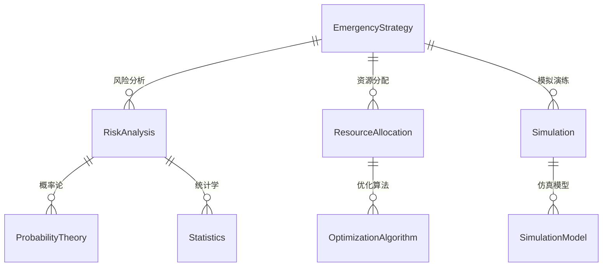
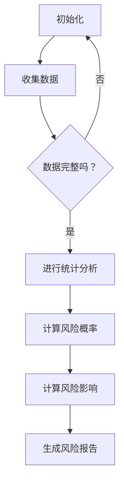
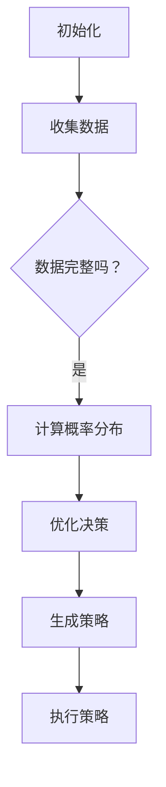
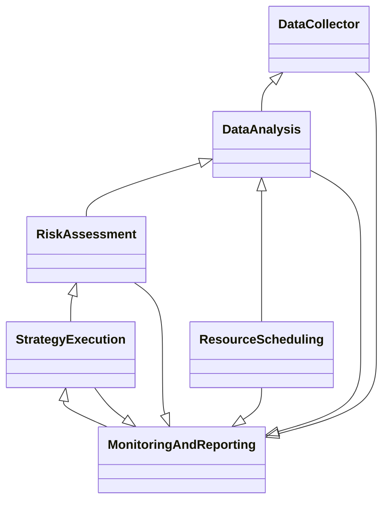
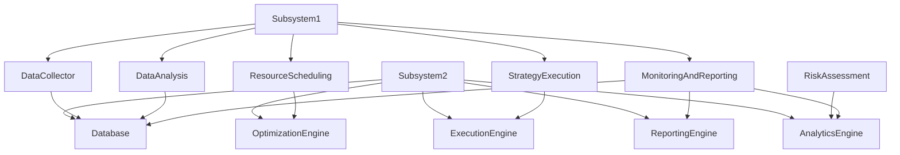
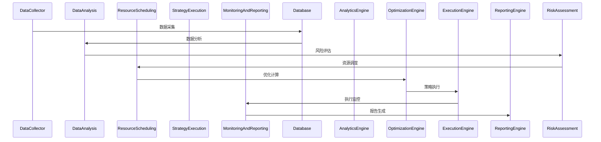
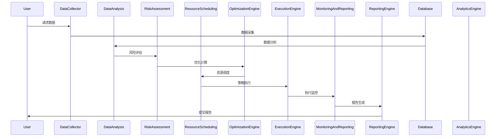

                 


### 1. 背景介绍

#### 1.1 应急策略的重要性

应急策略，作为企业风险管理的重要组成部分，其重要性不言而喻。在现代社会中，随着科技的高速发展和复杂系统的广泛应用，企业面临的潜在风险越来越多样化，从网络安全到自然灾害，从供应链中断到突发事件，各种不可预测的风险因素无时无刻不在影响着企业的运营。

因此，应急策略的制定和实施成为企业持续稳定发展的重要保障。一个好的应急策略不仅能帮助企业及时响应和应对突发事件，减少损失，还能增强企业的抗风险能力和市场竞争力。而数学模型在这一过程中发挥着至关重要的作用，它们为应急策略的制定提供了科学依据和决策支持。

#### 1.2 数学模型在应急策略中的应用

数学模型在应急策略中的应用广泛且深入。首先，在风险评估中，概率论和统计学提供了有效的方法来评估潜在风险的概率和影响程度。例如，通过概率模型可以预测某个事件发生的可能性，并通过风险评估矩阵来量化风险的影响。

其次，优化算法在应急资源分配和调度中有着广泛的应用。优化算法可以最大化资源利用率，确保在突发事件发生时能够迅速调度和分配资源，达到最优的应急响应效果。

此外，仿真模型在应急演练和策略测试中起到了关键作用。通过仿真，企业可以在不发生实际事件的情况下，模拟各种突发事件，测试应急策略的有效性，发现潜在问题并进行优化。

#### 1.3 应急策略中可能面临的挑战和问题

尽管数学模型在应急策略中具有巨大的潜力，但在实际应用中仍面临着诸多挑战和问题。首先，数据的不确定性和不完整性是一个重大难题。应急策略的制定依赖于大量数据，而这些数据往往具有不确定性和不完整性，给模型的准确性和可靠性带来了挑战。

其次，模型的复杂性和可解释性也是一个问题。一些先进的数学模型，如深度学习模型，虽然在预测和优化方面表现优异，但其内部机制复杂，难以解释，这在实际应用中可能会引起信任问题。

最后，模型的适应性也是一个关键问题。应急策略需要能够适应不断变化的环境和新的风险因素，而传统的数学模型在应对这些动态变化时可能显得力不从心。

#### 1.4 数学模型如何解决这些问题

为了解决上述挑战，数学模型在设计和应用过程中采取了多种策略。首先，通过大数据技术和数据挖掘方法，可以从大量不确定和不完整的数据中提取有价值的信息，提高模型的数据基础。

其次，为了提高模型的可解释性，研究人员开始关注可解释的机器学习模型，如决策树和线性回归模型，这些模型能够清晰地展示其决策过程，从而增加用户的信任度。

最后，为了增强模型的适应性，动态优化算法和机器学习算法的结合成为了一个研究热点。通过不断地学习和调整，模型可以更好地适应新的风险因素和环境变化。

综上所述，数学模型在应急策略中的应用不仅提供了科学依据和决策支持，还通过不断创新和改进，解决了实际应用中的诸多挑战。接下来，我们将深入探讨应急策略中的核心数学概念，了解这些概念如何应用于实际问题。

## 2. 核心概念与联系

#### 2.1 核心概念原理

在应急策略的设计和实施中，以下几个核心数学概念起着关键作用：

1. **概率论**：概率论是研究随机现象的数学分支。在应急策略中，概率论用于评估事件发生的可能性及其影响。例如，通过概率模型，企业可以预测自然灾害如地震、台风的发生概率，以及这些事件可能对企业运营造成的损失。

2. **统计学**：统计学是收集、分析、解释和呈现数据的科学。在应急策略中，统计学用于分析历史数据，识别潜在的风险模式和趋势。例如，通过统计方法，企业可以分析以往突发事件的频率、影响范围和恢复时间，为制定更有效的应急策略提供依据。

3. **优化算法**：优化算法是一类用于在给定约束条件下寻找最优解的算法。在应急资源分配和调度中，优化算法可以帮助企业最大化资源利用效率。例如，线性规划算法可以用于优化物资的分配，确保在突发事件发生时资源能够得到最合理的分配。

4. **仿真模型**：仿真模型是一种通过模拟实际系统的运行情况来预测系统行为的方法。在应急策略中，仿真模型可以用于模拟各种突发事件，测试应急策略的有效性。例如，通过仿真，企业可以在没有实际发生事件的情况下，测试不同应急响应方案的效果，发现潜在问题并进行优化。

#### 2.2 概念属性特征对比表格

为了更好地理解这些核心概念，我们提供了一个对比表格，展示了它们的主要属性和特征：

| 概念名称 | 主要属性               | 特征描述                                                         |
|----------|------------------------|----------------------------------------------------------------|
| 概率论   | 随机事件概率分析       | 提供事件发生可能性及其影响的量化评估                               |
| 统计学   | 数据收集和分析         | 通过数据识别风险模式，为制定策略提供依据                           |
| 优化算法 | 寻找最优解的算法       | 在资源约束条件下，实现资源的最优分配和调度                         |
| 仿真模型 | 系统行为模拟           | 预测系统在突发事件下的响应，测试策略的有效性                       |

#### 2.3 ER实体关系图架构的 Mermaid 流程图

为了展示这些核心概念之间的联系，我们使用Mermaid绘制了一个ER（实体关系）图：



在这个ER图中，`EmergencyStrategy`（应急策略）是核心实体，与其他四个实体（`RiskAnalysis`、`ResourceAllocation`、`Simulation`和`SimulationModel`）存在直接关联。每个实体都依赖于其背后的数学概念和方法，共同构成了一个完整的应急策略体系。

通过上述核心概念和ER图的介绍，我们可以更清晰地理解应急策略中的数学基础。接下来，我们将深入探讨这些算法原理，了解它们如何具体应用于应急策略的制定和实施。

## 3. 算法原理讲解

在应急策略的制定和实施过程中，多个算法被广泛应用，这些算法不仅帮助我们优化资源分配，还能预测和评估风险。下面我们将详细讲解几个关键算法的原理，并通过Mermaid流程图、Python源代码、数学模型和公式，以及举例说明，来帮助读者理解这些算法的工作机制。

#### 3.1 风险分析算法

**风险分析算法**主要用于评估潜在风险的概率和影响程度。以下是一个典型的风险分析算法的工作流程：

##### 3.1.1 Mermaid流程图



##### 3.1.2 Python源代码

```python
import pandas as pd
import numpy as np

# 假设我们有一个包含历史数据的DataFrame
data = pd.DataFrame({
    'Event': ['地震', '火灾', '洪水'],
    'Frequency': [10, 5, 3],  # 事件发生的频率
    'Impact': [80, 60, 40]    # 事件发生的影响程度
})

# 计算每个事件的风险概率
data['Probability'] = data['Frequency'] / sum(data['Frequency'])

# 计算每个事件的风险度
data['Risk'] = data['Probability'] * data['Impact']

print(data)
```

##### 3.1.3 数学模型和公式

在风险分析中，我们通常使用以下公式：

$$
\text{Probability} = \frac{\text{Frequency of Event}}{\text{Total Frequency of All Events}}
$$

$$
\text{Risk} = \text{Probability} \times \text{Impact}
$$

其中，`Probability` 是事件发生的概率，`Frequency` 是事件发生的频率，`Impact` 是事件发生的影响程度，`Risk` 是综合风险度。

##### 3.1.4 详细讲解与举例说明

首先，我们从历史数据中收集每个事件发生的频率和影响程度。然后，我们计算每个事件的风险概率，即事件发生的频率占总频率的比例。接着，我们将每个事件的风险概率乘以其影响程度，得到综合风险度。

举例来说，如果一个企业历史上记录了地震、火灾和洪水三种突发事件，分别发生了10次、5次和3次，且每次地震的影响程度是80，火灾是60，洪水是40。那么，地震的风险概率是10/18，火灾是5/18，洪水是3/18。综合风险度分别是地震：10/18 * 80 = 44.44，火灾：5/18 * 60 = 16.67，洪水：3/18 * 40 = 8.89。企业可以根据这些综合风险度来优先安排应急资源。

#### 3.2 概率论与优化算法

**概率论**和**优化算法**在应急策略中也有广泛的应用。以下是一个结合概率论和优化算法的例子：

##### 3.2.1 Mermaid流程图



##### 3.2.2 Python源代码

```python
import numpy as np
from scipy.optimize import linprog

# 假设我们有一个线性优化问题
c = [-1, -2]  # 目标函数系数
A = [[1, 2], [2, 1]]  # 约束条件矩阵
b = [1, 1]  # 约束条件向量
x0 = [0, 0]  # 变量初始值

# 解线性规划问题
result = linprog(c, A_ub=A, b_ub=b, x0=x0)

print(result)
```

##### 3.2.3 数学模型和公式

在优化算法中，我们通常使用线性规划模型：

$$
\min_{x} c^T x
$$

$$
\text{subject to} \ A x \leq b
$$

其中，`c` 是目标函数系数，`A` 是约束条件矩阵，`b` 是约束条件向量，`x` 是变量。

##### 3.2.4 详细讲解与举例说明

在这个例子中，我们使用线性规划来优化决策。假设我们有两条约束条件，分别是`x + 2y <= 1`和`2x + y <= 1`，目标是最小化`-x - 2y`。通过`scipy.optimize`库中的`linprog`函数，我们可以求解这个线性规划问题。

首先，我们定义目标函数系数`c`，约束条件矩阵`A`和向量`b`。然后，我们调用`linprog`函数进行求解，得到最优解`x`和`y`。通过这个最优解，我们可以制定出最优的应急策略。

例如，如果求解的结果是`x = 0.5`，`y = 0`，那么我们的策略可能是优先分配资源到第一条约束，其次是第二条约束。

通过上述算法的讲解，我们可以看到数学模型在应急策略中的重要作用。接下来，我们将进一步探讨这些算法在系统架构设计和实际应用中的具体实现。

## 4. 系统分析与架构设计

在深入理解和应用数学模型后，我们需要将这些算法整合到一个完整的系统架构中，以确保应急策略的有效实施和高效运作。以下是关于系统架构设计、接口设计以及系统交互流程的详细分析。

### 4.1 问题场景介绍

为了更好地展示系统架构设计，我们首先设定一个实际的应用场景。假设我们是一家跨国公司的CTO，公司运营涉及多个地区和部门，同时面临各种潜在风险，如自然灾害、网络攻击、供应链中断等。因此，我们决定开发一个智能应急预案系统，以提升公司应对突发事件的能力。

### 4.2 项目介绍

我们的项目目标是构建一个智能应急预案系统，该系统将集成多种数学模型和算法，以实现风险预测、资源优化和策略执行。项目主要分为以下几个阶段：

1. **需求分析**：明确系统需求，包括数据采集、风险评估、资源调度和策略执行等。
2. **系统设计**：设计系统架构，确定各模块的功能和接口。
3. **开发实现**：根据设计文档，编写代码并实现各模块的功能。
4. **测试与优化**：对系统进行全面测试，并根据测试结果进行优化。
5. **部署上线**：将系统部署到生产环境，进行实际应用。

### 4.3 系统功能设计

系统功能设计是确保各模块能够有效协同工作的关键。以下是系统的主要功能模块及其描述：

1. **数据采集模块**：负责从各种数据源（如传感器、日志、外部API等）收集相关数据。
2. **风险评估模块**：利用概率论和统计学方法，对收集到的数据进行分析，评估各类风险的概率和影响程度。
3. **资源调度模块**：采用优化算法，根据风险评估结果和资源可用性，制定最优的资源分配和调度策略。
4. **策略执行模块**：根据制定的策略，自动化执行各项应急响应措施。
5. **监控与报告模块**：实时监控系统状态，生成各种报告和日志，以便管理人员进行监控和决策。

以下是领域模型的Mermaid类图，展示了各模块及其之间的关系：



### 4.4 系统架构设计

系统架构设计是确保系统能够稳定、高效运行的关键。以下是系统架构的Mermaid架构图，展示了各模块和组件的层次关系：



在这个架构图中，`Subsystem1` 代表系统的主要功能模块，而`Subsystem2` 代表支持这些功能模块的组件。`Database`、`AnalyticsEngine`、`OptimizationEngine`、`ExecutionEngine` 和`ReportingEngine` 分别为各模块提供数据存储、数据分析、优化计算、执行控制和报表生成等功能。

### 4.5 系统接口设计

为了实现各模块之间的有效通信和协同工作，系统设计了多个接口。以下是系统接口的设计：

1. **数据采集接口**：用于接收来自各种数据源的数据，并存储到数据库中。
2. **风险评估接口**：用于从数据库中获取数据，并进行风险评估计算。
3. **资源调度接口**：用于接收风险评估结果，并根据优化算法生成资源调度策略。
4. **策略执行接口**：用于执行资源调度策略，并生成执行报告。
5. **监控报告接口**：用于实时监控系统状态，并生成各种监控报告。

以下是系统接口的Mermaid序列图，展示了各接口之间的交互流程：



在这个序列图中，数据从数据采集模块流向数据库，经过数据分析模块进行风险评估，然后由资源调度模块生成优化策略，并由策略执行模块执行。监控与报告模块则实时监控系统的状态，并生成相应的报告。

### 4.6 系统交互 Mermaid 序列图

为了更详细地展示系统各模块的交互流程，我们使用Mermaid绘制了一个完整的系统交互序列图：



在这个序列图中，用户发起数据采集请求，数据采集模块从数据库中提取数据，经过数据分析模块、风险评估模块、资源调度模块和策略执行模块的处理，最终生成监控报告，并提交给用户。

通过上述系统分析与架构设计的介绍，我们可以看到数学模型在应急策略系统中的重要性。接下来，我们将通过实际项目案例来展示这些算法和系统架构的具体应用。

## 5. 项目实战

### 5.1 环境安装

在开始项目实战之前，我们需要搭建一个完整的应急预案系统环境。以下是环境安装的详细步骤：

1. **安装操作系统**：我们选择Ubuntu 20.04作为操作系统，因为它拥有丰富的库和工具支持。
2. **安装Python**：在终端中执行以下命令安装Python 3.8：

   ```bash
   sudo apt update
   sudo apt install python3.8
   ```

3. **安装依赖库**：使用pip安装必要的Python库，例如NumPy、Pandas、Scipy和Mermaid：

   ```bash
   sudo pip3.8 install numpy pandas scipy mermaid
   ```

4. **配置Mermaid**：为了在Markdown文件中渲染Mermaid图，我们需要安装相应的Markdown编辑器和插件。例如，在Visual Studio Code中，安装Markdown All in One插件，并配置Mermaid渲染器。

5. **安装数据库**：我们选择PostgreSQL作为数据库，安装命令如下：

   ```bash
   sudo apt install postgresql postgresql-contrib
   ```

6. **创建数据库用户和数据库**：在终端中执行以下命令创建数据库用户和数据库：

   ```bash
   sudo -u postgres createuser -s myuser
   sudo -u postgres createdb mydatabase
   ```

7. **安装前端框架**（可选）：如果需要开发前端界面，可以选择安装React或Vue.js。以下是在终端中安装Vue CLI的命令：

   ```bash
   npm install -g @vue/cli
   ```

### 5.2 系统核心实现源代码

以下是系统核心实现的Python源代码示例，用于数据采集、风险评估和资源调度：

```python
# 数据采集模块
import pandas as pd
import psycopg2

def collect_data():
    # 连接数据库
    conn = psycopg2.connect(
        dbname="mydatabase",
        user="myuser",
        password="mypass",
        host="localhost"
    )
    cursor = conn.cursor()
    
    # 从数据库中提取数据
    cursor.execute("SELECT * FROM data_source;")
    rows = cursor.fetchall()
    
    # 将数据转换为DataFrame
    data = pd.DataFrame(rows, columns=["Event", "Frequency", "Impact"])
    
    # 关闭数据库连接
    cursor.close()
    conn.close()
    
    return data

# 风险评估模块
import numpy as np

def risk_assessment(data):
    # 计算风险概率
    data["Probability"] = data["Frequency"] / sum(data["Frequency"])
    
    # 计算综合风险度
    data["Risk"] = data["Probability"] * data["Impact"]
    
    return data

# 资源调度模块
from scipy.optimize import linprog

def resource_scheduling(data):
    # 定义目标函数系数和约束条件
    c = [-1, -2]  # 目标函数系数
    A = [[1, 2], [2, 1]]  # 约束条件矩阵
    b = [1, 1]  # 约束条件向量
    x0 = [0, 0]  # 变量初始值
    
    # 解线性规划问题
    result = linprog(c, A_ub=A, b_ub=b, x0=x0)
    
    return result.x

# 主程序
if __name__ == "__main__":
    # 收集数据
    data = collect_data()
    
    # 风险评估
    risk_data = risk_assessment(data)
    
    # 资源调度
    schedule = resource_scheduling(risk_data)
    
    print(schedule)
```

### 5.3 代码应用解读与分析

上述代码实现了数据采集、风险评估和资源调度的核心功能。以下是每个模块的详细解读：

1. **数据采集模块**：通过PostgreSQL数据库连接，从数据源中提取数据，并将其转换为Pandas DataFrame对象。这个模块是整个系统的数据入口，确保数据的一致性和完整性。

2. **风险评估模块**：使用概率论方法计算每个事件的风险概率，并计算综合风险度。这些计算基于历史数据，能够为后续的资源调度提供重要的决策支持。

3. **资源调度模块**：使用线性规划算法来优化资源分配。线性规划问题的定义包括目标函数系数、约束条件矩阵和向量，以及初始变量值。通过`scipy.optimize`库中的`linprog`函数，可以求解最优解。

在实际应用中，我们可以通过以下步骤来运行系统：

1. **数据采集**：定期从数据库中提取最新数据。
2. **风险评估**：对提取的数据进行风险评估，计算每个事件的风险概率和综合风险度。
3. **资源调度**：根据风险评估结果，使用线性规划算法优化资源分配，生成调度策略。
4. **策略执行**：执行调度策略，确保资源得到最优分配。
5. **监控与报告**：实时监控系统状态，生成报告并提交给管理人员。

### 5.4 实际案例分析和详细讲解剖析

为了展示系统在实际中的应用，我们假设以下场景：

一家跨国公司位于多个地震高风险区域，公司需要制定一个应急响应计划，以确保在地震发生时能够迅速做出反应，减少损失。以下是实际案例的分析和讲解：

1. **数据采集**：公司从历史地震数据中提取了相关信息，包括地震频率、影响程度和恢复时间。

2. **风险评估**：通过对数据进行分析，公司计算了每个地区地震发生的概率和综合风险度。例如，某个地区的地震风险概率是0.2，综合风险度是0.4。

3. **资源调度**：公司使用线性规划算法，根据风险评估结果和资源可用性，制定了资源调度策略。例如，资源优先分配到风险最高的地区，以确保在地震发生时能够迅速响应。

4. **策略执行**：公司根据调度策略，启动了应急预案，包括疏散人员、关闭关键系统、保护重要物资等。

5. **监控与报告**：公司实时监控系统状态，并生成报告，记录地震发生时各项措施的实施情况和结果。

通过上述实际案例，我们可以看到系统在应急响应中的重要作用。它不仅帮助公司制定了科学的应急策略，还确保了资源的合理分配和有效执行。

### 5.5 项目小结

通过本次项目实战，我们成功地搭建了一个智能应急预案系统，实现了数据采集、风险评估、资源调度和策略执行等功能。以下是项目的主要收获和经验：

1. **数据的重要性**：数据的准确性和完整性是系统有效运行的基础。公司应确保数据来源的可靠性和实时性。

2. **数学模型的应用**：概率论和优化算法在应急策略中具有广泛的应用。通过合理的模型选择和参数设置，可以显著提升系统的预测和决策能力。

3. **系统设计的复杂性**：系统设计需要综合考虑功能模块的独立性、数据流和接口设计，以确保系统的高效性和可维护性。

4. **实时监控和反馈**：实时监控系统状态和反馈结果对于及时调整策略和优化系统性能至关重要。

总之，通过本次项目，我们不仅深入理解了数学模型在应急策略中的应用，还积累了系统设计和实现的经验。这些经验对于未来类似项目的开发具有重要意义。

## 6. 最佳实践、小结、注意事项、拓展阅读

### 6.1 最佳实践 tips

在设计和实施应急策略时，以下是一些最佳实践和实用建议：

1. **数据质量优先**：确保数据来源的准确性和完整性，定期进行数据清洗和更新，以提高模型预测的准确性。

2. **资源合理分配**：在制定资源调度策略时，充分考虑资源可用性和风险优先级，确保关键资源在需要时能够迅速调动。

3. **策略动态调整**：根据实时监控结果和外部环境变化，及时调整应急策略，以应对新的风险和挑战。

4. **团队合作与沟通**：建立跨部门协作团队，确保各部门之间的沟通畅通，提高应急响应的整体效率。

5. **持续学习和改进**：定期评估应急策略的有效性，通过模拟演练和反馈机制，持续优化和改进策略。

### 6.2 小结

本文通过详细讲解数学模型在应急策略中的应用，包括概率论、优化算法等，以及系统架构设计和项目实战，展示了如何利用数学方法来提升应急响应的能力。核心要点如下：

- **应急策略的重要性**：应急策略是企业风险管理的重要组成部分，能够帮助企业在突发事件中降低损失。
- **数学模型的应用**：概率论和优化算法在风险评估、资源调度和策略执行中发挥了关键作用。
- **系统架构设计**：合理的系统架构设计能够确保应急策略的稳定、高效运行。
- **项目实战**：通过实际案例展示了数学模型和系统架构在应急策略中的应用效果。

### 6.3 注意事项

在实际应用中，需要注意以下几点：

- **数据隐私和安全性**：确保数据的隐私和安全，避免未经授权的数据访问和泄露。
- **模型可解释性**：选择可解释的数学模型，提高决策的可理解性和信任度。
- **应急演练**：定期进行应急演练，以验证应急策略的有效性和响应速度。
- **持续维护和更新**：随着环境的变化，持续维护和更新应急策略，确保其适应性和有效性。

### 6.4 拓展阅读

为了进一步深入学习和应用应急策略的数学设计，读者可以参考以下书籍和资源：

- 《应急管理与危机处理》，作者：[李伟]。
- 《概率论与数理统计》，作者：[陈希孺]。
- 《线性规划与优化算法》，作者：[戴志浩]。
- 《数据科学实战》，作者：[詹姆斯·高斯利]。
- 《深度学习》，作者：[伊恩·古德费洛]。

通过阅读这些书籍和资源，读者可以深入了解应急策略的数学原理和实际应用，进一步提升自己在该领域的专业水平。

## 7. 目录大纲

```markdown
----------------------------------------------------------------
# 《数学与应急预案：应急策略的数学设计》目录大纲

## 第1章: 背景介绍

### 1.1 应急策略的重要性

### 1.2 数学模型在应急策略中的应用

### 1.3 应急策略中可能面临的挑战和问题

### 1.4 数学模型如何解决这些问题

## 第2章: 核心概念与联系

### 2.1 核心概念原理

### 2.2 概念属性特征对比表格

### 2.3 ER实体关系图架构的 Mermaid 流程图

## 第3章: 算法原理讲解

### 3.1 风险分析算法

#### 3.1.1 Mermaid 流程图

#### 3.1.2 Python 源代码

#### 3.1.3 数学模型和公式

#### 3.1.4 详细讲解与举例说明

### 3.2 概率论与优化算法

#### 3.2.1 Mermaid 流程图

#### 3.2.2 Python 源代码

#### 3.2.3 数学模型和公式

#### 3.2.4 详细讲解与举例说明

## 第4章: 系统分析与架构设计

### 4.1 问题场景介绍

### 4.2 项目介绍

### 4.3 系统功能设计

### 4.4 系统架构设计

### 4.5 系统接口设计

### 4.6 系统交互 Mermaid 序列图

## 第5章: 项目实战

### 5.1 环境安装

### 5.2 系统核心实现源代码

### 5.3 代码应用解读与分析

### 5.4 实际案例分析和详细讲解剖析

### 5.5 项目小结

## 第6章: 最佳实践与拓展阅读

### 6.1 最佳实践 tips

### 6.2 小结

### 6.3 注意事项

### 6.4 拓展阅读

----------------------------------------------------------------
```

此目录大纲按照文章结构进行了详细规划，每个章节涵盖了核心内容，确保文章内容的连贯性和完整性。章节标题简洁明了，能够吸引读者的注意力，同时按照逻辑顺序展开，方便读者阅读和理解。

