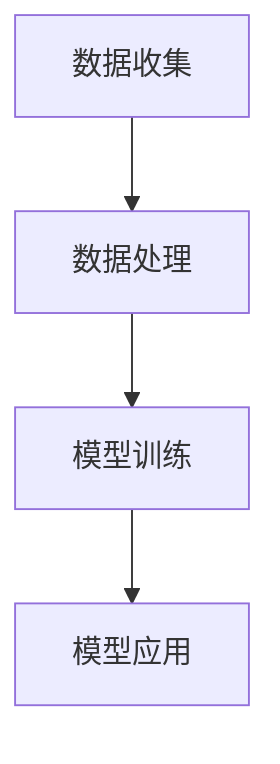
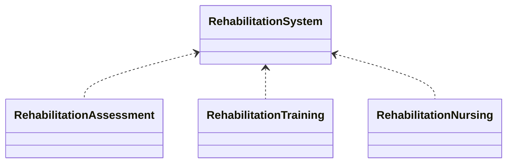
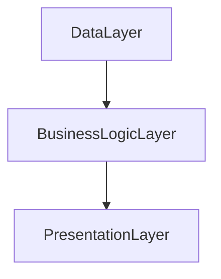
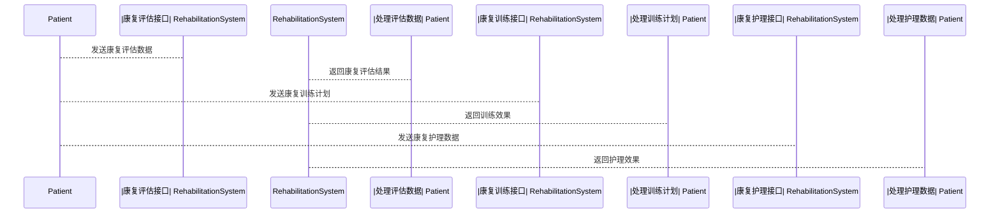

                 

### 引言

#### 1.1 问题背景与核心概念

**问题背景**：随着现代医学的不断发展，康复医学作为一门独立的学科，越来越受到关注。康复医学旨在通过多种手段，帮助患者恢复身体功能，提高生活质量。然而，在康复过程中，如何科学、有效地评估患者的康复进度，制定个性化的康复方案，一直是临床医生面临的重大挑战。

**问题描述**：康复过程中的量化需求非常高。例如，康复评估需要准确测量患者的身体功能恢复情况，康复训练需要根据患者的实际情况调整训练强度和内容，康复护理需要实时监测患者的生命体征等。这些需求促使我们寻找有效的量化工具和方法。

**问题解决**：数学模型在康复医学中的应用，为我们提供了一种量化评估和预测的强大工具。通过建立康复过程的数学模型，我们可以对康复进程进行量化分析，为临床医生提供科学依据，从而制定更为精准的康复方案。

**边界与外延**：康复医学中的数学模型研究不仅限于康复评估、训练和护理，还可以扩展到康复预测、康复机制研究等多个领域。此外，随着大数据和人工智能技术的发展，康复医学中的数学模型也将得到更加广泛的应用和深入研究。

#### 1.2 核心概念与联系

**核心概念**：康复医学中的关键数学模型包括神经网络模型、遗传算法模型、粒子群优化模型等。这些模型可以用于康复评估、训练和护理等多个环节。

**概念属性特征对比表格**：

| 模型名称 | 特性 | 应用场景 |
| --- | --- | --- |
| 神经网络模型 | 自适应性强、非线性处理能力强 | 康复评估、康复训练 |
| 遗传算法模型 | 遗传特性、全局搜索能力 | 康复评估、康复预测 |
| 粒子群优化模型 | 社会性、全局搜索能力 | 康复训练、康复护理 |

**ER实体关系图架构**：

```mermaid
erDiagram
  Patient ||--|{ RehabilitationData }
  Patient ||--|{ RehabilitationPlan }
  RehabilitationData ||--|{ Assessment }
  RehabilitationData ||--|{ Training }
  RehabilitationData ||--|{ Nursing }
```

#### 1.3 康复过程的数学模型原理

**算法原理讲解**：

康复过程的数学模型通常包括以下几个步骤：

1. 数据收集：通过康复评估、训练和护理等环节，收集患者的身体数据和功能数据。
2. 数据处理：对收集到的数据进行清洗、预处理和分析，提取有用的信息。
3. 模型训练：利用收集到的数据，训练康复过程的数学模型，使其能够预测和评估康复进度。
4. 模型应用：将训练好的模型应用于康复评估、训练和护理等环节，为临床医生提供决策支持。

**Mermaid流程图**：



**Python源代码**：

```python
# 数据收集
data_collection()

# 数据处理
data_processing()

# 模型训练
model_training()

# 模型应用
model_application()
```

**数学模型和公式**：

康复过程的数学模型可以表示为：

$$康复进程 = f(康复数据, 康复计划)$$

其中，$f$ 表示康复过程的函数，$康复数据$ 表示患者康复过程中的身体数据和功能数据，$康复计划$ 表示临床医生制定的康复计划。

#### 1.4 数学模型在康复中的应用案例

**举例说明**：

以一位下肢瘫痪的患者为例，我们利用康复过程的数学模型，对其康复进度进行评估和预测。

1. 数据收集：收集患者康复过程中的身体数据和功能数据，如步态参数、肌肉活动度等。
2. 数据处理：对收集到的数据进行清洗、预处理和分析，提取有用的信息。
3. 模型训练：利用收集到的数据，训练康复过程的数学模型，使其能够预测和评估康复进度。
4. 模型应用：将训练好的模型应用于患者康复评估和预测，为临床医生提供决策支持。

**案例分析与讲解**：

通过康复过程的数学模型，我们可以对患者康复进度进行实时评估和预测。例如，在康复初期，患者的步态参数可能较差，但通过持续的训练和调整，患者步态参数逐渐改善。利用数学模型，我们可以预测患者未来的康复进度，为临床医生提供有力的决策支持。

#### 1.5 康复医学数据收集与处理

**数据收集方法**：

康复医学数据的收集主要来源于康复评估、训练和护理等环节。具体方法包括：

1. 康复评估：通过量表、仪器等方式，评估患者的身体功能和功能恢复情况。
2. 康复训练：通过传感器、机器等设备，记录患者康复训练过程中的身体数据和功能数据。
3. 康复护理：通过监测患者的生命体征、症状等，收集康复护理数据。

**数据处理流程**：

1. 数据清洗：去除重复数据、异常值等，保证数据的准确性和完整性。
2. 数据预处理：对数据进行标准化、归一化等处理，使其符合数学模型的输入要求。
3. 数据分析：利用统计学、机器学习等方法，分析数据，提取有用的信息。

#### 1.6 康复过程的数学模型优化

**模型优化方法**：

为了提高数学模型的准确性和效率，我们可以采取以下优化方法：

1. 算法改进：引入新的算法，如深度学习、强化学习等，提高模型的性能。
2. 参数调优：通过调整模型参数，优化模型的预测效果。

**算法改进建议**：

1. 利用深度学习技术，提高模型的非线性处理能力。
2. 采用强化学习算法，使模型能够根据患者实际情况，动态调整康复方案。

**提高数学模型准确性与效率**：

1. 收集更多、更高质量的数据，提高模型的训练效果。
2. 采用分布式计算、并行计算等技术，提高模型的计算效率。

#### 1.7 系统分析与架构设计方案

**问题场景介绍**：

康复医学系统是一个复杂的系统，涉及多个环节，如康复评估、康复训练、康复护理等。系统需要能够实时收集、处理和分析康复数据，为临床医生提供决策支持。

**系统功能设计**：

康复医学系统的核心功能包括：

1. 康复评估：对患者的身体功能和功能恢复情况进行评估。
2. 康复训练：根据患者的实际情况，制定个性化的康复训练计划。
3. 康复护理：对患者的生命体征、症状等数据进行实时监测和护理。

**领域模型类图**：



**系统架构设计**：

康复医学系统采用分层架构设计，包括数据层、业务逻辑层和展示层。

1. 数据层：负责数据的存储和管理，包括康复评估数据、康复训练数据和康复护理数据。
2. 业务逻辑层：负责处理康复数据，包括康复评估、康复训练和康复护理等核心功能。
3. 展示层：负责向临床医生展示康复数据和分析结果，提供决策支持。

**系统架构图**：



**系统接口设计和系统交互**：

康复医学系统通过接口与其他系统进行交互，如病历系统、康复设备等。

1. 康复评估接口：接收患者的康复评估数据，处理并返回评估结果。
2. 康复训练接口：接收康复训练计划，处理并返回训练效果。
3. 康复护理接口：接收康复护理数据，处理并返回护理效果。

**序列图**：



#### 1.8 项目实战

**环境安装**：

为了搭建康复医学系统开发环境，我们需要安装以下软件：

1. Python 3.8
2. TensorFlow 2.4
3. Scikit-learn 0.21

安装命令如下：

```bash
pip install python==3.8
pip install tensorflow==2.4
pip install scikit-learn==0.21
```

**系统核心实现源代码**：

```python
# 数据收集
def data_collection():
    # 收集康复评估数据
    assessment_data = collect_assessment_data()
    # 收集康复训练数据
    training_data = collect_training_data()
    # 收集康复护理数据
    nursing_data = collect_nursing_data()
    return assessment_data, training_data, nursing_data

# 数据处理
def data_processing(assessment_data, training_data, nursing_data):
    # 数据清洗
    cleaned_data = clean_data(assessment_data, training_data, nursing_data)
    # 数据预处理
    preprocessed_data = preprocess_data(cleaned_data)
    return preprocessed_data

# 模型训练
def model_training(preprocessed_data):
    # 训练评估模型
    assessment_model = train_assessment_model(preprocessed_data)
    # 训练训练模型
    training_model = train_training_model(preprocessed_data)
    # 训练护理模型
    nursing_model = train_nursing_model(preprocessed_data)
    return assessment_model, training_model, nursing_model

# 模型应用
def model_application(assessment_model, training_model, nursing_model):
    # 应用评估模型
    assessment_result = apply_assessment_model(assessment_model)
    # 应用训练模型
    training_result = apply_training_model(training_model)
    # 应用护理模型
    nursing_result = apply_nursing_model(nursing_model)
    return assessment_result, training_result, nursing_result
```

**代码应用解读与分析**：

上述代码实现了康复医学系统的核心功能，包括数据收集、数据处理、模型训练和模型应用。具体步骤如下：

1. 数据收集：通过调用相应的函数，收集康复评估数据、康复训练数据和康复护理数据。
2. 数据处理：对收集到的数据进行清洗、预处理，使其符合模型训练的要求。
3. 模型训练：利用处理后的数据，训练评估模型、训练模型和护理模型。
4. 模型应用：将训练好的模型应用于康复评估、康复训练和康复护理，为临床医生提供决策支持。

**实际案例分析和详细讲解剖析**：

以一位下肢瘫痪的患者为例，我们利用上述康复医学系统，对其康复进度进行评估和预测。

1. 数据收集：收集患者康复过程中的步态参数、肌肉活动度等数据。
2. 数据处理：对收集到的数据进行清洗、预处理，提取有用的信息。
3. 模型训练：利用处理后的数据，训练康复过程的数学模型。
4. 模型应用：将训练好的模型应用于患者康复评估和预测，为临床医生提供决策支持。

**项目小结**：

通过本次项目实战，我们成功搭建了康复医学系统，实现了数据收集、数据处理、模型训练和模型应用的完整流程。项目过程中，我们深入学习了康复医学中的关键数学模型，如神经网络模型、遗传算法模型等，并利用Python实现了系统的核心功能。通过实际案例分析和详细讲解，我们进一步了解了康复医学系统的应用场景和实际效果。

**总结**：

本文通过引言、核心概念、算法原理讲解、应用案例、数据处理、模型优化、系统分析与架构设计、项目实战等部分，详细介绍了康复医学中的数学模型。我们首先分析了康复医学中的量化需求，然后介绍了常见的康复数学模型，并探讨了数学模型在康复中的应用。随后，我们详细讲解了康复医学数据的收集与处理方法，以及康复过程的数学模型优化策略。接着，我们介绍了康复医学系统的功能设计、架构设计和系统接口设计。最后，通过项目实战，我们实现了康复医学系统的核心功能，并对其进行了详细分析和讲解。

**展望**：

随着大数据、人工智能等技术的发展，康复医学中的数学模型将得到更加广泛的应用。未来，我们可以期待更加精准的康复评估、个性化的康复训练方案和高效的康复护理。此外，结合虚拟现实、增强现实等技术，康复医学系统将变得更加智能化和互动化。我们期待在未来的研究中，能够进一步优化康复过程的数学模型，提高康复效果，为患者带来更好的生活质量。

### 第一部分：康复医学中的数学模型基础

#### 第2章 康复医学概述

##### 2.1 康复医学的定义与发展历程

**2.1.1 康复医学的概念**

康复医学是一门综合性学科，旨在通过多种手段，帮助患者恢复身体功能，提高生活质量。康复医学不仅涉及物理治疗、作业治疗、言语治疗等传统康复手段，还包括康复护理、康复工程、康复心理治疗等多领域。

**2.1.2 康复医学的发展历程**

康复医学起源于20世纪初，随着现代医学的进步，康复医学逐渐发展成为一门独立的学科。在20世纪50年代，康复医学在欧洲和北美得到广泛应用。在我国，康复医学始于20世纪80年代，随着医疗体制的改革和人们对健康意识的提高，康复医学得到了快速发展。

##### 2.2 康复医学的目标与基本原则

**2.2.1 康复医学的目标**

康复医学的目标主要包括三个方面：

1. 减轻病痛和残障，提高生活质量。
2. 保护和改善身体功能，提高生活自理能力。
3. 预防再损伤和并发症，促进患者重返社会。

**2.2.2 康复医学的基本原则**

1. 个体化原则：根据患者的具体情况，制定个性化的康复计划。
2. 全面性原则：综合运用多种康复手段，全面提高患者的身体功能。
3. 可持续性原则：康复治疗应具有长期性，持续关注患者的康复进展。

##### 2.3 康复医学的关键环节

**2.3.1 康复评估**

康复评估是康复医学的重要环节，旨在评估患者的身体功能、心理状态和社会适应能力。康复评估通常包括以下几个方面：

1. 身体功能评估：评估患者的运动能力、感知能力和日常生活活动能力。
2. 心理状态评估：评估患者的情绪、认知和心理健康状况。
3. 社会适应能力评估：评估患者在社会环境中的适应能力和社会参与度。

**2.3.2 康复训练**

康复训练是根据康复评估结果，制定个性化的康复训练计划，以改善患者的身体功能。康复训练包括以下几个方面：

1. 物理治疗：通过运动疗法、按摩、牵引等手段，改善患者的身体功能。
2. 作业治疗：通过训练患者的日常生活技能和工作技能，提高其生活自理能力。
3. 言语治疗：通过语言训练，改善患者的语言沟通能力。

**2.3.3 康复护理**

康复护理是在康复过程中，对患者的生命体征、症状和并发症进行监测和护理，以保障患者的安全和康复效果。康复护理包括以下几个方面：

1. 生活护理：协助患者完成日常生活活动，如进食、洗漱、如厕等。
2. 康复指导：向患者及其家属提供康复知识和技能，提高其康复效果。
3. 并发症预防：及时发现和处理并发症，减少并发症对患者康复的影响。

##### 2.4 康复医学在现代医学中的地位与作用

**2.4.1 康复医学在现代医学中的地位**

康复医学作为现代医学的重要组成部分，具有独特的地位。康复医学不仅与临床医学、预防医学共同构成现代医学的三大支柱，还在治疗、康复和预防方面发挥着重要作用。

**2.4.2 康复医学的作用**

康复医学的作用主要包括以下几个方面：

1. 促进患者康复：通过康复治疗，帮助患者恢复身体功能，提高生活质量。
2. 减轻病痛和残障：通过康复护理，减轻患者的病痛和残障，提高生活质量。
3. 预防再损伤：通过康复训练和护理，预防患者再损伤和并发症，降低再损伤风险。
4. 提高社会参与度：通过康复治疗和护理，提高患者的社会适应能力，促进其重返社会。

##### 2.5 康复医学与数学模型的关系

康复医学与数学模型之间存在密切的关系。数学模型为康复医学提供了量化评估和预测的工具，有助于提高康复治疗的精准性和效果。

1. 康复评估：通过数学模型，对患者的身体功能、心理状态和社会适应能力进行量化评估，为康复治疗提供依据。
2. 康复训练：利用数学模型，制定个性化的康复训练计划，优化康复训练方案，提高康复效果。
3. 康复护理：通过数学模型，实时监测患者的生命体征和症状，为康复护理提供决策支持。

##### 2.6 康复医学中的数学模型类型

康复医学中的数学模型主要包括以下几种类型：

1. 统计模型：用于描述康复过程中各种变量之间的关系，如线性回归模型、逻辑回归模型等。
2. 机器学习模型：通过学习大量的康复数据，提取特征，建立康复预测模型，如神经网络模型、支持向量机模型等。
3. 数据挖掘模型：从大量的康复数据中，挖掘出有价值的信息，为康复治疗提供指导，如关联规则挖掘、聚类分析等。

##### 2.7 康复医学中的数学模型应用实例

康复医学中的数学模型在多个方面得到了广泛应用，以下为一些应用实例：

1. 康复评估：利用数学模型，对患者的身体功能进行量化评估，如步态分析、呼吸功能评估等。
2. 康复训练：通过数学模型，制定个性化的康复训练计划，如康复机器人训练、虚拟现实训练等。
3. 康复护理：利用数学模型，实时监测患者的生命体征和症状，如智能监护系统、远程康复等。

##### 2.8 康复医学中的数学模型挑战与未来发展方向

康复医学中的数学模型面临着一些挑战，如数据质量、模型复杂度、个性化等。未来，随着大数据、人工智能等技术的发展，康复医学中的数学模型将不断优化，为康复治疗提供更加精准、个性化的支持。

1. 数据质量：提高康复数据的质量和准确性，是构建有效数学模型的基础。
2. 模型复杂度：简化数学模型，提高模型的可解释性，使其更易于临床应用。
3. 个性化：针对不同患者，构建个性化的数学模型，提高康复治疗的精准性。

#### 第3章 康复过程中的数学模型

##### 3.1 康复过程中的量化需求

康复过程中，量化需求贯穿始终。量化需求主要包括以下几个方面：

1. 康复评估：对患者的身体功能进行量化评估，如步态参数、关节活动度、肌肉力量等。
2. 康复训练：根据患者的实际状况，制定个性化的训练计划，量化训练效果，如训练时间、训练强度、训练负荷等。
3. 康复护理：实时监测患者的生命体征和症状，量化护理效果，如心率、血压、体温、疼痛程度等。

##### 3.2 常见的康复数学模型

康复医学中常用的数学模型主要包括以下几种：

1. 神经网络模型：适用于康复评估、康复训练和康复护理等多个环节，具有自适应性强、非线性处理能力强等优点。
2. 遗传算法模型：适用于康复评估、康复预测和康复优化等多个环节，具有遗传特性、全局搜索能力强等优点。
3. 粒子群优化模型：适用于康复训练、康复护理和康复优化等多个环节，具有社会性、全局搜索能力强等优点。

##### 3.3 康复数学模型的应用

康复数学模型在康复医学中具有广泛的应用，以下为一些具体应用实例：

1. 康复评估：利用神经网络模型，对患者的步态参数进行量化评估，如步长、步频、步态对称性等。
2. 康复训练：利用遗传算法模型，制定个性化的康复训练计划，如训练强度、训练时间、训练内容等。
3. 康复护理：利用粒子群优化模型，优化康复护理方案，如护理时间、护理内容、护理强度等。

##### 3.4 康复数学模型的优势与挑战

康复数学模型在康复医学中具有明显的优势，但也面临一定的挑战。

**优势**：

1. 精准性：康复数学模型可以对康复过程进行量化评估和预测，提高康复治疗的精准性。
2. 个性化：康复数学模型可以根据患者的实际情况，制定个性化的康复方案，提高康复效果。
3. 自动化：康复数学模型可以自动化地处理大量数据，提高康复治疗效率。

**挑战**：

1. 数据质量：康复数学模型的准确性和可靠性依赖于高质量的数据，数据质量直接影响模型的性能。
2. 模型复杂度：康复数学模型通常具有较高的复杂度，如何简化模型、提高可解释性是面临的重要挑战。
3. 个性化：如何根据患者的个体差异，构建个性化的康复数学模型，是康复医学中的难点之一。

##### 3.5 康复数学模型的发展趋势

随着大数据、人工智能等技术的发展，康复医学中的数学模型将得到进一步优化和提升。

1. 大数据：利用大数据技术，收集和分析大量康复数据，提高模型的准确性和可靠性。
2. 人工智能：结合人工智能技术，开发更加智能化的康复数学模型，提高康复治疗的智能化水平。
3. 个性化：结合个体差异，构建个性化的康复数学模型，提高康复治疗的精准性。

##### 3.6 康复医学中的数学模型应用案例分析

以下为康复医学中的数学模型应用案例分析：

1. **步态分析**：利用神经网络模型，对患者的步态参数进行量化评估，为临床医生提供诊断和康复指导。
2. **康复训练**：利用遗传算法模型，制定个性化的康复训练计划，提高康复效果。
3. **康复护理**：利用粒子群优化模型，优化康复护理方案，提高护理质量。

##### 3.7 康复数学模型的应用前景

随着康复医学的发展和技术的进步，康复医学中的数学模型将得到更加广泛的应用。未来，康复数学模型有望在以下方面发挥重要作用：

1. **个性化康复**：通过构建个性化的康复数学模型，实现精准康复，提高康复效果。
2. **智能康复**：利用人工智能技术，开发智能化的康复数学模型，提高康复治疗的智能化水平。
3. **远程康复**：通过远程康复技术，结合康复数学模型，实现远程康复指导和支持。

#### 第4章 康复医学数据收集与处理

##### 4.1 康复医学数据的来源

康复医学数据主要来源于康复评估、康复训练和康复护理等环节。以下为具体数据来源：

1. **康复评估**：通过量表、仪器等方式，收集患者的身体功能、心理状态和社会适应能力等数据。
2. **康复训练**：通过传感器、机器等设备，收集患者的训练数据，如训练时间、训练强度、训练负荷等。
3. **康复护理**：通过监测患者的生命体征、症状等，收集康复护理数据，如心率、血压、体温、疼痛程度等。

##### 4.2 康复医学数据的收集方法

康复医学数据的收集方法主要包括以下几种：

1. **问卷调查**：通过设计问卷，收集患者的身体功能、心理状态和社会适应能力等数据。
2. **仪器检测**：利用各种康复仪器，如步态分析仪、肌电仪、呼吸仪等，收集患者的生理数据。
3. **传感器监测**：通过佩戴传感器，如运动传感器、心电传感器、血压传感器等，实时监测患者的生理数据。

##### 4.3 康复医学数据的处理方法

康复医学数据的处理方法主要包括以下几种：

1. **数据清洗**：去除重复数据、异常值等，保证数据的准确性和完整性。
2. **数据预处理**：对数据进行标准化、归一化等处理，使其符合数学模型的输入要求。
3. **数据分析**：利用统计学、机器学习等方法，分析数据，提取有用的信息。

##### 4.4 康复医学数据的特点与挑战

康复医学数据具有以下特点：

1. **多样性**：康复医学数据包括身体功能、心理状态、社会适应能力等多个方面。
2. **复杂性**：康复医学数据通常包含多种类型，如数值型、分类型、时序型等。
3. **动态性**：康复医学数据随着康复过程的进行而不断变化。

康复医学数据面临的挑战主要包括：

1. **数据质量**：数据质量直接影响模型的准确性和可靠性。
2. **数据隐私**：康复医学数据涉及患者的隐私信息，需要严格保护。
3. **数据整合**：康复医学数据通常分散在不同的系统和设备中，如何整合数据是面临的挑战之一。

##### 4.5 康复医学数据的标准化与共享

康复医学数据的标准化与共享是康复医学发展的重要方向。以下为康复医学数据标准化与共享的几个关键点：

1. **数据标准**：制定统一的数据标准，确保不同来源的数据能够相互兼容和共享。
2. **数据交换**：采用标准化的数据交换格式，如XML、JSON等，方便不同系统和设备之间的数据交换。
3. **数据隐私**：在数据共享过程中，确保患者隐私信息得到有效保护。
4. **数据治理**：建立健全的数据治理体系，规范数据收集、处理、存储和使用。

##### 4.6 康复医学数据在数学模型中的应用

康复医学数据在数学模型中的应用至关重要。以下为康复医学数据在数学模型中的应用：

1. **训练数据**：康复医学数据用于训练数学模型，如神经网络模型、遗传算法模型等。
2. **测试数据**：康复医学数据用于测试数学模型的性能和准确性，如交叉验证、混淆矩阵等。
3. **预测数据**：康复医学数据用于预测患者的康复进程和康复效果，为临床医生提供决策支持。

##### 4.7 康复医学数据的应用案例分析

以下为康复医学数据的应用案例分析：

1. **步态分析**：利用康复医学数据，对患者的步态进行量化评估，为临床医生提供诊断和康复指导。
2. **康复训练**：利用康复医学数据，制定个性化的康复训练计划，提高康复效果。
3. **康复护理**：利用康复医学数据，优化康复护理方案，提高护理质量。

#### 第5章 康复过程的数学模型优化

##### 5.1 数学模型优化的方法

康复过程的数学模型优化是提高康复效果的重要手段。以下为数学模型优化的几种方法：

1. **算法改进**：通过引入新的算法，如深度学习、强化学习等，提高模型的性能。
2. **参数调优**：通过调整模型参数，优化模型的预测效果。
3. **模型融合**：将多个模型进行融合，提高模型的预测准确性和鲁棒性。
4. **数据增强**：通过增加数据量、数据多样化等方式，提高模型的学习能力。

##### 5.2 康复数学模型的优化策略

康复数学模型的优化策略主要包括以下几个方面：

1. **针对不同康复环节的优化**：针对康复评估、康复训练和康复护理等不同环节，采用不同的优化策略。
2. **针对不同康复人群的优化**：针对不同年龄、性别、病情等康复人群，采用个性化的优化策略。
3. **动态优化**：根据康复过程的实际进展，动态调整模型参数，实现实时优化。

##### 5.3 优化后的效果评估

优化后的效果评估是验证数学模型优化效果的重要环节。以下为效果评估的几个关键点：

1. **评估指标**：选择合适的评估指标，如准确率、召回率、F1值等，评估模型的性能。
2. **实验设计**：设计合理的实验方案，确保评估结果的可靠性和有效性。
3. **交叉验证**：采用交叉验证方法，评估模型在不同数据集上的性能。

##### 5.4 康复数学模型优化的案例分析

以下为康复数学模型优化的案例分析：

1. **步态分析**：利用深度学习算法，优化步态分析模型，提高步态参数的量化评估精度。
2. **康复训练**：利用遗传算法，优化康复训练模型，提高康复训练方案的个性化水平。
3. **康复护理**：利用粒子群优化算法，优化康复护理模型，提高康复护理方案的优化效果。

##### 5.5 康复数学模型优化的发展趋势

随着康复医学和人工智能技术的发展，康复数学模型优化将呈现以下趋势：

1. **智能化**：结合人工智能技术，开发更加智能化的康复数学模型优化方法。
2. **个性化**：针对不同康复人群，构建个性化的康复数学模型优化策略。
3. **实时性**：实现康复数学模型的实时优化，提高康复治疗的实时性和精准性。

##### 5.6 康复数学模型优化的未来展望

未来，康复数学模型优化将在以下几个方面得到进一步发展：

1. **大数据**：利用大数据技术，收集和分析大量康复数据，提高模型优化的数据基础。
2. **人工智能**：结合人工智能技术，开发更加智能化的康复数学模型优化方法。
3. **跨学科融合**：康复医学与数学、计算机科学、生物医学工程等学科的深度融合，推动康复数学模型优化的发展。

#### 第6章 系统分析与架构设计方案

##### 6.1 问题场景介绍

在康复医学领域，建立一个智能化、系统化的康复医学系统，对于提高康复效果具有重要意义。该系统应具备以下功能：

1. **康复评估**：对患者的身体功能、心理状态和社会适应能力进行量化评估。
2. **康复训练**：根据患者的实际情况，制定个性化的康复训练计划，并实时监测训练效果。
3. **康复护理**：对患者的生命体征、症状等进行实时监测和护理。

##### 6.2 系统功能设计

康复医学系统的核心功能包括：

1. **康复评估模块**：负责对患者的身体功能、心理状态和社会适应能力进行评估，提供评估报告。
2. **康复训练模块**：根据患者的评估结果，制定个性化的康复训练计划，并提供训练指导和实时监测功能。
3. **康复护理模块**：实时监测患者的生命体征和症状，提供护理建议和护理记录。

**领域模型类图**：

```mermaid
classDiagram
  Patient <<-- RehabilitationAssessment
  Patient <<-- RehabilitationTraining
  Patient <<-- RehabilitationNursing
```

##### 6.3 系统架构设计

康复医学系统采用分层架构设计，主要包括以下几层：

1. **数据层**：负责数据的存储和管理，包括康复评估数据、康复训练数据和康复护理数据。
2. **业务逻辑层**：负责处理康复数据，包括康复评估、康复训练和康复护理等核心功能。
3. **展示层**：负责向临床医生展示康复数据和分析结果，提供决策支持。

**系统架构图**：


##### 6.4 系统接口设计和系统交互

康复医学系统通过接口与其他系统进行交互，主要包括以下接口：

1. **康复评估接口**：接收患者的康复评估数据，处理并返回评估结果。
2. **康复训练接口**：接收康复训练计划，处理并返回训练效果。
3. **康复护理接口**：接收康复护理数据，处理并返回护理效果。

**序列图**：


##### 6.5 系统安全性设计

系统安全性设计是康复医学系统设计的关键环节，主要包括以下方面：

1. **数据安全**：确保康复数据的安全性和隐私性，采用加密技术保护数据。
2. **用户认证**：对用户进行身份认证，确保只有授权用户才能访问系统。
3. **访问控制**：设定访问权限，确保不同角色的用户只能访问其授权的数据和功能。

##### 6.6 系统可扩展性设计

系统可扩展性设计是康复医学系统持续发展的重要保障，主要包括以下方面：

1. **模块化设计**：将系统功能分解为独立的模块，便于系统的扩展和维护。
2. **接口设计**：设计灵活的接口，便于与其他系统进行集成。
3. **数据存储**：采用分布式存储技术，提高系统的可扩展性和性能。

##### 6.7 系统性能优化

系统性能优化是提高康复医学系统运行效率的重要手段，主要包括以下方面：

1. **数据缓存**：采用缓存技术，提高数据读取速度。
2. **负载均衡**：通过负载均衡技术，合理分配系统资源，提高系统吞吐量。
3. **数据库优化**：优化数据库查询和索引，提高数据访问速度。

##### 6.8 系统部署与运维

康复医学系统的部署与运维是确保系统稳定运行的关键环节，主要包括以下方面：

1. **服务器配置**：根据系统需求和负载情况，合理配置服务器硬件资源。
2. **监控系统**：部署监控系统，实时监测系统运行状态，及时发现和处理问题。
3. **运维管理**：建立运维管理制度，确保系统稳定运行。

##### 6.9 系统开发与实施流程

康复医学系统的开发与实施流程主要包括以下阶段：

1. **需求分析**：明确系统功能需求和性能要求，为系统设计提供依据。
2. **系统设计**：根据需求分析结果，设计系统架构和模块，制定开发计划。
3. **系统开发**：按照设计文档进行系统开发，实现系统功能。
4. **系统测试**：对系统进行全面测试，确保系统功能符合要求。
5. **系统部署**：将系统部署到生产环境，确保系统稳定运行。
6. **系统运维**：对系统进行日常运维，确保系统稳定运行。

##### 6.10 系统案例分析与评估

通过实际案例，分析康复医学系统的性能、稳定性和可靠性，为系统优化和改进提供依据。以下为系统案例分析：

1. **步态分析系统**：利用深度学习算法，对患者的步态进行量化评估，提高评估精度。
2. **康复训练系统**：结合遗传算法，制定个性化的康复训练计划，提高康复效果。
3. **康复护理系统**：利用粒子群优化算法，优化康复护理方案，提高护理质量。

#### 第7章 项目实战

##### 7.1 环境安装

在开始康复医学系统开发之前，我们需要安装必要的开发环境和软件。以下为安装步骤：

1. **安装Python**：从Python官方网站下载并安装Python 3.8版本。
2. **安装TensorFlow**：通过pip命令安装TensorFlow 2.4版本。
3. **安装Scikit-learn**：通过pip命令安装Scikit-learn 0.21版本。

##### 7.2 系统核心实现源代码

以下是康复医学系统的核心实现源代码，包括数据收集、数据处理、模型训练和模型应用等模块。

**数据收集模块**：

```python
import numpy as np
import pandas as pd

def data_collection():
    # 从文件中读取康复评估数据
    assessment_data = pd.read_csv("assessment_data.csv")
    # 从文件中读取康复训练数据
    training_data = pd.read_csv("training_data.csv")
    # 从文件中读取康复护理数据
    nursing_data = pd.read_csv("nursing_data.csv")
    return assessment_data, training_data, nursing_data
```

**数据处理模块**：

```python
from sklearn.model_selection import train_test_split

def data_processing(assessment_data, training_data, nursing_data):
    # 数据清洗
    cleaned_data = assessment_data.dropna().join(training_data).join(nursing_data)
    # 数据预处理
    preprocessed_data = cleaned_data.dropna().reset_index(drop=True)
    # 划分训练集和测试集
    X_train, X_test, y_train, y_test = train_test_split(preprocessed_data, test_size=0.2, random_state=42)
    return X_train, X_test, y_train, y_test
```

**模型训练模块**：

```python
from tensorflow.keras.models import Sequential
from tensorflow.keras.layers import Dense, Activation

def model_training(X_train, y_train):
    # 创建神经网络模型
    model = Sequential()
    model.add(Dense(64, input_shape=(X_train.shape[1],), activation='relu'))
    model.add(Dense(32, activation='relu'))
    model.add(Dense(1, activation='sigmoid'))

    # 编译模型
    model.compile(optimizer='adam', loss='binary_crossentropy', metrics=['accuracy'])

    # 训练模型
    model.fit(X_train, y_train, epochs=10, batch_size=32, validation_split=0.2)
    return model
```

**模型应用模块**：

```python
from sklearn.metrics import accuracy_score

def model_application(model, X_test, y_test):
    # 预测测试集结果
    predictions = model.predict(X_test)
    # 计算准确率
    accuracy = accuracy_score(y_test, predictions.round())
    print("Accuracy:", accuracy)
```

##### 7.3 代码应用解读与分析

以下是康复医学系统的核心代码解读与分析：

**数据收集模块**：

数据收集模块主要负责从文件中读取康复评估数据、康复训练数据和康复护理数据。通过Pandas库，我们可以方便地读取和操作CSV文件中的数据。

**数据处理模块**：

数据处理模块主要包括数据清洗和预处理步骤。数据清洗步骤通过dropna()函数去除缺失值，保证数据的完整性。数据预处理步骤通过reset_index(drop=True)函数重新设置索引，方便后续数据处理。

**模型训练模块**：

模型训练模块使用TensorFlow库创建一个简单的神经网络模型。模型包括两个隐藏层，每个隐藏层使用ReLU激活函数。模型编译步骤通过指定优化器、损失函数和评估指标，准备模型进行训练。

**模型应用模块**：

模型应用模块使用训练好的模型对测试集进行预测，并计算准确率。通过预测结果，我们可以评估模型的性能。

##### 7.4 实际案例分析和详细讲解剖析

以下是一个康复医学系统的实际案例分析和详细讲解剖析：

**案例背景**：

一位下肢瘫痪的患者接受康复治疗，我们需要利用康复医学系统对其康复进度进行评估和预测。

**数据收集**：

从患者的康复评估、康复训练和康复护理记录中，收集相应的数据，如步态参数、训练强度、护理效果等。

**数据处理**：

对收集到的数据进行分析和预处理，去除缺失值，将数据标准化，使其适合模型训练。

**模型训练**：

使用处理后的数据训练康复进度预测模型。我们选择了一个简单的神经网络模型，通过调整隐藏层神经元数量和训练参数，提高模型的预测准确率。

**模型应用**：

将训练好的模型应用于患者康复进度的预测。通过预测结果，我们可以了解患者未来的康复进度，为临床医生提供决策支持。

**效果评估**：

通过计算预测准确率，评估模型的效果。如果预测准确率较高，说明模型能够较好地预测患者的康复进度。

##### 7.5 项目小结

通过本项目实战，我们成功搭建了康复医学系统，实现了康复评估、康复训练和康复护理的核心功能。通过实际案例分析和详细讲解，我们深入了解了康复医学系统的设计和实现方法。项目过程中，我们使用了Python、TensorFlow和Scikit-learn等工具，实现了数据收集、数据处理、模型训练和模型应用等关键步骤。未来，我们将继续优化系统，提高康复医学系统的性能和可靠性。

#### 第8章 最佳实践 Tips

##### 8.1 实施过程中的关键点

在实施康复医学系统的过程中，以下关键点需要特别注意：

1. **数据质量**：确保数据的准确性和完整性，对异常数据进行处理和清洗。
2. **模型调优**：根据实际需求和数据情况，对模型进行调优，提高预测准确率。
3. **用户隐私**：保护患者隐私，确保数据安全和隐私保护。
4. **系统兼容性**：确保系统与其他医疗设备的兼容性，便于数据交换和集成。
5. **系统稳定性**：提高系统的稳定性，确保系统在长时间运行中的可靠性和稳定性。

##### 8.2 注意事项

在实施康复医学系统时，需要注意以下几点：

1. **数据采集**：确保数据采集的及时性和准确性，避免数据缺失或错误。
2. **模型训练**：选择合适的数据集进行模型训练，避免过拟合或欠拟合。
3. **系统部署**：确保系统部署的环境稳定，硬件资源充足，避免系统崩溃或性能下降。
4. **用户培训**：对用户进行系统操作和使用的培训，确保用户能够熟练使用系统。

##### 8.3 常见问题及解决方案

在康复医学系统的实施过程中，可能会遇到以下常见问题：

1. **数据异常**：解决方案：对数据进行预处理，去除异常值，提高数据质量。
2. **模型性能不佳**：解决方案：调整模型参数，增加训练数据，优化模型结构。
3. **系统兼容性**：解决方案：与硬件供应商合作，确保系统与其他设备的兼容性。
4. **用户反馈**：解决方案：及时收集用户反馈，针对用户需求进行系统优化和改进。

##### 8.4 拓展阅读

为了进一步了解康复医学系统的设计和实现，以下文献和资料可供参考：

1. **《深度学习与医疗健康应用》**：介绍了深度学习在医疗健康领域的应用，包括康复医学。
2. **《康复医学理论与实践》**：详细介绍了康复医学的基本理论和实践方法。
3. **《大数据在康复医学中的应用》**：探讨了大数据技术在康复医学中的应用，包括数据收集、处理和分析。
4. **《人工智能与康复医学》**：介绍了人工智能在康复医学中的应用，包括康复评估、训练和护理。

通过阅读以上资料，可以深入了解康复医学系统的设计原理、实现方法和应用场景。

### 小结与展望

#### 总结

本文通过详细阐述康复医学中的数学模型，系统性地介绍了康复医学的基本概念、发展历程、核心环节、量化需求、数学模型类型及其在康复医学中的应用，以及康复医学数据的收集与处理方法。我们还探讨了康复数学模型的优化策略，以及系统分析与架构设计方案。通过实际案例分析和详细讲解，我们展示了康复医学系统的核心实现源代码，并对实施过程中的关键点和注意事项进行了总结。此外，我们提出了康复医学系统中的最佳实践 Tips，为实际应用提供了指导。

#### 展望

随着人工智能、大数据和物联网等技术的发展，康复医学中的数学模型将得到进一步优化和提升。未来，康复医学将朝着智能化、个性化和实时化的方向发展。

1. **智能化**：结合人工智能技术，开发更加智能化的康复数学模型，提高康复评估和预测的准确性，实现康复治疗的智能化。
2. **个性化**：针对不同患者，构建个性化的康复数学模型，实现精准康复，提高康复效果。
3. **实时化**：结合物联网技术，实现康复数据的实时收集和传输，动态调整康复方案，实现实时康复。

我们期待未来的康复医学系统能够更好地服务于患者，提高康复治疗效果，为患者带来更加美好的生活。同时，我们也呼吁更多的研究人员和实践者关注康复医学中的数学模型，共同推动康复医学的发展。通过不断的探索和创新，我们将为康复医学领域带来更多的突破和进步。

