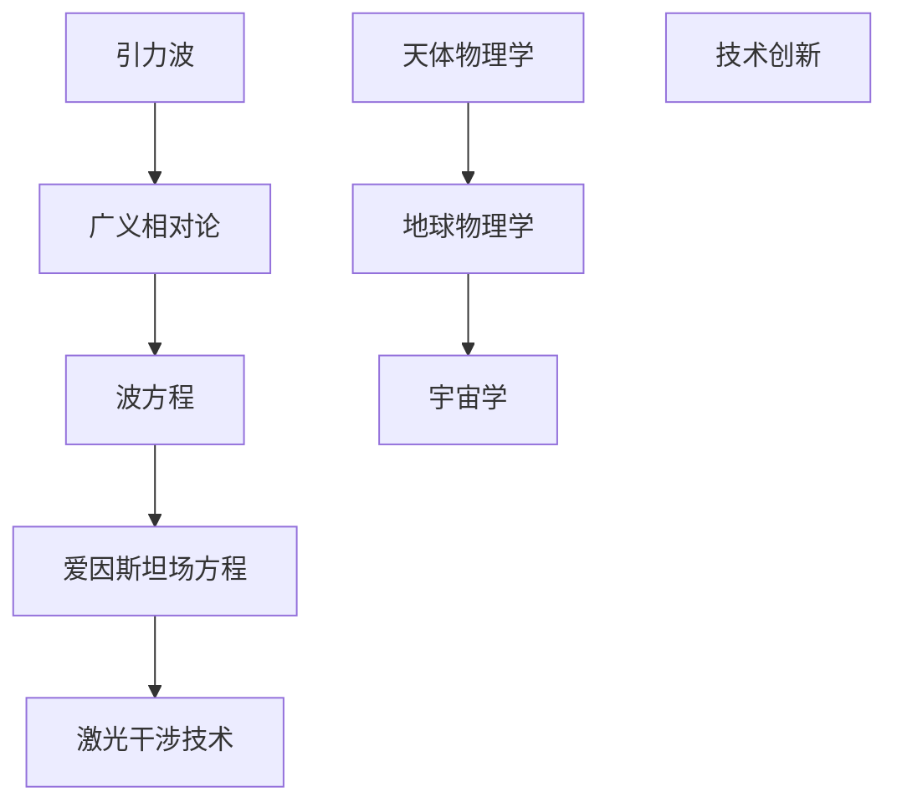
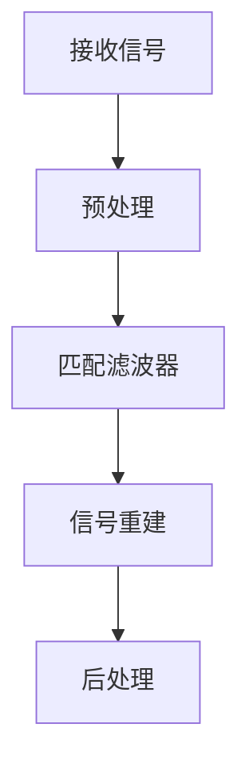
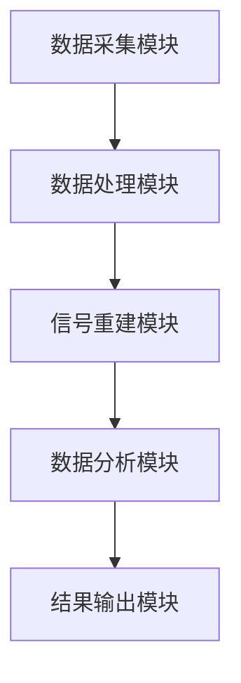
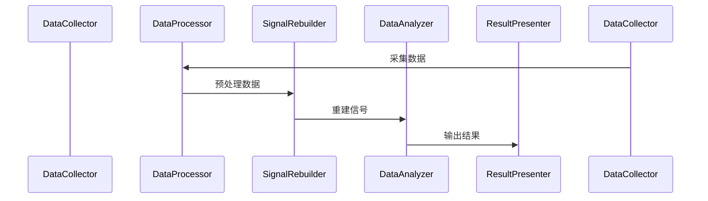

                 

# 数学与引力波：时空涟漪的数学描述

关键词：数学，引力波，时空涟漪，广义相对论，波方程

摘要：本文将从数学与引力波的基本概念出发，深入探讨时空涟漪的数学描述。首先，我们将回顾引力波的历史背景和重要性，然后逐步介绍与引力波相关的数学和物理学基础，包括波方程、数学工具和技术，以及引力波的检测方法和数学模型。接下来，我们将详细分析引力波源和相互作用，探讨其在科学和工程领域的应用，并展望未来的发展方向。本文旨在为广大读者提供一个清晰、易懂的引力波数学描述教程，以激发对这一领域的兴趣和深入研究。

## 引言

引力波是爱因斯坦广义相对论的预言之一，它是宇宙中引力相互作用的一种表现形式。引力波在宇宙中广泛存在，它们是由质量加速运动产生的时空涟漪，可以传播到遥远的星系，并为我们提供宇宙早期状态的信息。随着科学技术的发展，引力波的检测和观测已经成为物理学研究的前沿领域之一。

本文将探讨数学与引力波之间的关系，通过逐步分析数学描述引力波的方法，使读者能够更深入地理解这一复杂现象。我们将从引力波的基本概念和历史背景开始，逐步介绍与引力波相关的数学和物理学基础，包括波方程、数学工具和技术，以及引力波的检测方法和数学模型。接着，我们将详细分析引力波源和相互作用，探讨其在科学和工程领域的应用，并展望未来的发展方向。

本文旨在为广大读者提供一个清晰、易懂的引力波数学描述教程，以激发对这一领域的兴趣和深入研究。希望通过本文的介绍，读者能够对引力波有更全面、深入的了解，从而为后续研究打下坚实的基础。

## 引力波的历史背景和重要性

引力波的概念最早可以追溯到1916年，当时爱因斯坦在广义相对论的框架内提出了引力波的存在。引力波的发现是物理学的一次重大突破，它不仅验证了广义相对论的理论预测，还为我们提供了研究宇宙的一种全新的手段。广义相对论认为，质量会扭曲周围的时空结构，而引力波则是这种时空扭曲的传播。这个预言在当时被认为是过于奇特和难以想象的，然而随着科学技术的进步，引力波的发现逐渐成为可能。

引力波的首次直接观测是在2015年，由LIGO（激光干涉引力波观测台）实验团队实现。这一发现不仅证实了爱因斯坦的预言，也为物理学界带来了前所未有的机遇。引力波的发现标志着人类进入了“多信使天文学”的新时代，使我们能够通过不同方式观测宇宙事件，从而更全面地了解宇宙的运行机制。

引力波的重要性不仅体现在科学研究中，还在实际应用领域有着广泛的应用前景。首先，引力波可以用来研究宇宙大爆炸和黑洞的形成过程，帮助我们理解宇宙的起源和演化。其次，引力波可以用来探测双星系统，这为我们提供了研究恒星演化和行星系统形成的新途径。此外，引力波的检测和观测还可以用于地震预警和地球物理研究，为防灾减灾提供重要信息。

在科技领域，引力波的研究推动了激光技术、数据分析技术和数据处理技术的发展。例如，LIGO实验的成功离不开高精度的激光干涉技术和复杂的信号处理算法。这些技术的进步不仅为引力波研究提供了有力支持，也为其他领域的研究和应用带来了新的机遇。

总的来说，引力波的研究不仅深化了我们对宇宙的认识，还推动了科学技术的发展。随着探测技术的不断进步，我们有望在不久的将来发现更多引力波事件，进一步揭示宇宙的奥秘。

## 数学与物理学基础

引力波的传播和观测离不开数学和物理学的理论基础。在本节中，我们将介绍与引力波相关的数学和物理学基础，包括广义相对论、波方程、数学工具和技术。

### 广义相对论

广义相对论是爱因斯坦在1915年提出的一种描述引力的理论，它将引力视为时空弯曲的结果。在广义相对论中，时空被描述为一个四维连续体，其中三个维度是空间维度，另一个维度是时间维度。物体的质量和能量会扭曲周围的时空结构，这种时空扭曲产生了引力效应。

广义相对论的数学表达形式是基于黎曼几何的。黎曼几何是一种研究弯曲空间的理论，它提供了描述引力波传播的数学工具。在广义相对论中，引力波是通过时空中的扰动产生的，这些扰动会在时空中传播，形成引力波。

### 波方程

引力波的传播可以用波方程来描述。波方程是一种偏微分方程，它描述了波动现象的数学规律。在引力波的背景下，波方程可以用来描述引力波在时空中的传播过程。常见的波方程包括麦克斯韦方程和爱因斯坦场方程。

麦克斯韦方程描述了电磁波的传播规律，而爱因斯坦场方程则描述了引力波的传播规律。这两个方程都是偏微分方程，它们提供了描述引力波传播的数学框架。

### 数学工具和技术

在引力波的研究中，数学工具和技术的应用非常重要。常见的数学工具包括微分方程、张量分析和复数分析。

微分方程是描述物理现象的重要工具，它能够描述引力波在时空中的传播规律。张量分析是一种研究多维度空间的理论，它在引力波研究中有着广泛应用。复数分析则用于研究引力波的相位和振幅等特征。

此外，现代数学和计算机科学的发展也为引力波研究提供了强大的工具。例如，数值模拟和数据分析技术可以用来解决复杂的物理问题，从而帮助我们更好地理解引力波的传播和特性。

### 时空和引力波

在广义相对论中，时空是一个四维连续体，由三个空间维度和一个时间维度组成。引力波是在这个四维时空中传播的扰动。当质量加速运动时，它会在时空中产生扰动，这些扰动以引力波的形式传播。

引力波的特点是它不会携带任何物质或能量，但它会扰动时空结构，使时间变慢或空间变形。这种时空扰动会在引力波的传播过程中传递，从而影响其他物体的运动。

### 总结

数学和物理学在引力波研究中扮演着重要角色。广义相对论为引力波的描述提供了理论基础，而波方程和数学工具则为我们提供了描述和计算引力波传播的数学工具。通过这些数学工具和理论，我们能够更深入地理解引力波的传播特性，从而为探测和观测引力波提供科学依据。

## 数学描述引力波

在了解了引力波的基本概念和背景之后，我们将进一步探讨如何使用数学方法来描述引力波。数学描述引力波的核心在于波方程，特别是爱因斯坦场方程，这是广义相对论中的关键方程。以下是一系列步骤，我们将一步一步地分析并理解这些数学描述。

### 爱因斯坦场方程

爱因斯坦场方程是描述引力波传播的核心方程，它将引力波与时空结构联系起来。方程的基本形式如下：

\[ G_{\mu\nu} = 8\pi G T_{\mu\nu} \]

其中，\( G_{\mu\nu} \) 是爱因斯坦张量，表示时空的曲率，\( T_{\mu\nu} \) 是能量-动量张量，表示物质和能量的分布。\( G \) 是引力常数。这个方程描述了物质和能量如何通过弯曲时空产生引力波。

### 波方程的解

为了得到具体的引力波解，我们需要对爱因斯坦场方程进行求解。在弱引力极限下，我们可以得到一些简单的解，例如平面波解。平面波解的基本形式如下：

\[ h_{\mu\nu}(x) = \epsilon_{\mu\nu} A e^{i(k \cdot x - \omega t)} \]

其中，\( h_{\mu\nu} \) 是引力波的张量扰动，\( \epsilon_{\mu\nu} \) 是归一化矢量，\( A \) 是振幅，\( k \) 是波矢，\( \omega \) 是角频率。这个方程描述了引力波在时空中传播的基本形式。

### 数学工具

在求解爱因斯坦场方程时，我们通常使用以下几种数学工具：

1. **张量分析**：张量分析是一种研究多维度空间的理论，它在描述引力波时非常重要。通过张量分析，我们可以将复杂的问题简化为更易于处理的数学形式。

2. **傅里叶变换**：傅里叶变换是一种将空间变量转换为频率变量的数学工具，它可以帮助我们分析引力波的频率成分。

3. **数值模拟**：数值模拟是解决复杂物理问题的重要方法。通过计算机模拟，我们可以得到爱因斯坦场方程的数值解，从而更直观地理解引力波的传播特性。

### 描述引力波的特性

通过数学描述，我们可以得到引力波的一些重要特性：

1. **振幅和频率**：引力波的振幅和频率由波方程的解确定。振幅表示引力波强度的变化，而频率表示波动的快慢。

2. **偏振**：引力波具有偏振特性，类似于光的偏振。偏振描述了波振动方向的不同可能性。

3. **波前**：波前是波前进方向的表面。在引力波中，波前描述了波在时空中的传播路径。

### 总结

数学描述引力波是一个复杂但极具挑战性的任务。通过爱因斯坦场方程、波方程和数学工具，我们能够深入理解引力波的基本特性。这些数学描述不仅为我们提供了研究引力波的理论框架，也为实际观测和检测引力波提供了科学依据。在接下来的章节中，我们将继续探讨引力波的检测方法和应用，以进一步了解这一重要现象。

## 引力波的检测方法

引力波的检测是物理学领域的一项重大成就，它为我们提供了一个全新的观测宇宙的方式。在本节中，我们将详细探讨引力波的检测方法，包括引力波探测器的工作原理、数据处理方法和实际应用。

### 引力波探测器的工作原理

引力波探测器主要通过测量时空的微小扰动来检测引力波。目前最常用的引力波探测器是激光干涉引力波观测台（LIGO）和欧洲的室 Nes gravitational wave observatory（VIRGO）。这些探测器采用激光干涉技术来测量时空的扰动。

LIGO探测器由两个互相垂直的臂组成，每个臂的长度约为4公里。在臂的两端放置两个反射镜，激光束在两个反射镜之间来回反射，形成干涉图样。当引力波通过探测器时，它会导致时空的微小扰动，进而影响反射镜的位置和干涉图样。通过检测这种干涉图样的变化，我们可以确定引力波的存在和特性。

### 数据处理方法

引力波的数据处理是一个复杂的过程，涉及到多种技术和算法。以下是几种常用的数据处理方法：

1. **信号重建**：在检测到引力波后，我们需要从噪声中提取出实际的引力波信号。这通常通过信号重建算法实现，如匹配滤波器。匹配滤波器可以根据已知的引力波模型，从观测数据中重建出引力波信号。

2. **频谱分析**：频谱分析用于确定引力波的频率成分。通过频谱分析，我们可以确定引力波的频率范围和频率特性。

3. **时间同步**：为了准确测量引力波的时间特性，我们需要确保不同探测器的数据在时间上同步。这通常通过时间同步算法实现，如全球定位系统（GPS）同步。

4. **数据融合**：当多个探测器同时检测到引力波时，我们可以通过数据融合技术来提高检测的精度。这通常通过联合分析多个探测器的数据来实现。

### 实际应用

引力波的检测在多个领域有着广泛的应用：

1. **天体物理研究**：引力波为天体物理研究提供了新的手段，使我们能够观测和探索宇宙中的各种现象，如黑洞碰撞、星系合并等。

2. **地震预警**：引力波可以用来检测地震和火山爆发等自然灾害，为灾害预警和应急响应提供重要信息。

3. **地球物理学**：引力波的研究还可以用于地球内部结构和地球物理过程的研究。

4. **宇宙学**：引力波可以用于研究宇宙的起源和演化，如宇宙背景辐射和早期宇宙的状态。

### 总结

引力波的检测方法是一个复杂但非常重要的领域。通过激光干涉技术和数据处理算法，我们能够有效地检测和观测引力波。这些技术的发展不仅深化了我们对宇宙的理解，也为科学研究和实际应用提供了新的机会。在接下来的章节中，我们将继续探讨引力波的源和相互作用，以及其在科学和工程领域的应用。

## 引力波源

引力波是由质量加速运动产生的时空涟漪，因此，能够产生引力波的事件通常涉及高速运动和质量巨大的物体。在本节中，我们将讨论几种主要的引力波源，并介绍它们的数学模型。

### 双星系统

双星系统是由两个恒星组成的系统，它们通过引力相互作用保持在一起。当这两个恒星相互绕转时，它们会产生周期性的引力波。这种引力波源可以通过以下数学模型描述：

\[ h_{\mu\nu}(t, x) = \frac{32 G}{c^4} \frac{m_1 m_2}{r^3} \left( \frac{1}{r} \nabla \cdot \left( \frac{r \cdot \Omega}{c} \right) - \frac{1}{c} \frac{\Omega \times r}{r} \right) e^{i(k \cdot x - \omega t)} \]

其中，\( m_1 \) 和 \( m_2 \) 是双星的质量，\( r \) 是双星之间的距离，\( \Omega \) 是双星系统的角速度，\( k \) 是波矢，\( \omega \) 是角频率。这个模型描述了双星系统产生的引力波在时空中传播的过程。

### 黑洞碰撞

黑洞碰撞是产生引力波的最强大来源之一。当两个黑洞相互碰撞并合并时，它们会释放出大量的引力波能量。黑洞碰撞的数学模型可以通过爱因斯坦场方程描述：

\[ G_{\mu\nu} = 8\pi G \left( \frac{2}{3} \rho c^2 - \frac{1}{2} \phi \right) \]

其中，\( \rho \) 是黑洞的密度，\( \phi \) 是引力势。这个模型描述了黑洞碰撞过程中时空的弯曲和引力波的传播。

### 星系合并

星系合并是宇宙中常见的现象，它通常涉及多个星系相互靠近并最终合并。这种过程也会产生强烈的引力波。星系合并的数学模型可以通过以下方程描述：

\[ h_{\mu\nu}(t, x) = \frac{32 G}{c^4} \int d^3x' \left( \rho(x') \delta(t - \frac{r - x}{c}) - \phi(x') \delta(t - \frac{r - x}{c}) \right) e^{i(k \cdot x - \omega t)} \]

其中，\( \rho \) 是星系的质量分布，\( \phi \) 是引力势，\( r \) 是星系之间的距离。这个模型描述了星系合并过程中产生的引力波如何传播和变化。

### 总结

引力波的源包括双星系统、黑洞碰撞和星系合并等多种现象。通过数学模型，我们能够描述这些现象产生的引力波在时空中传播的过程。这些数学模型不仅帮助我们理解引力波的本质，也为引力波的检测和观测提供了理论依据。在接下来的章节中，我们将继续探讨引力波相互作用及其在科学和工程领域的应用。

## 引力波的相互作用

引力波的相互作用是一个复杂但极其重要的研究领域，它揭示了引力波与宇宙中其他物理现象的相互作用机制。在本节中，我们将详细探讨引力波的相互作用，包括其理论意义、数学处理方法以及实际观测结果。

### 理论意义

引力波的相互作用不仅深化了我们对引力波本身的了解，还为我们提供了研究宇宙其他现象的新手段。例如，通过观测引力波与其他天体物理现象的相互作用，我们可以更准确地确定引力波源的参数，如质量、速度和距离。此外，引力波的相互作用还为我们提供了研究黑洞、星系和其他宇宙结构的独特视角。

### 数学处理方法

引力波的相互作用可以通过多种数学方法来处理，以下是几种常见的方法：

1. **波包展开法**：波包展开法是一种将引力波分解为不同频率成分的方法。通过这种方法，我们可以研究不同频率成分之间的相互作用，从而更全面地理解引力波的传播和特性。

2. **匹配滤波器**：匹配滤波器是一种信号处理技术，它通过寻找与已知信号最匹配的信号来提取引力波。这种方法在分析实际观测数据时非常有用，可以帮助我们从复杂的噪声中提取出有用的引力波信号。

3. **数值模拟**：数值模拟是研究引力波相互作用的重要工具。通过计算机模拟，我们可以模拟不同引力波源之间的相互作用，从而预测它们的演化过程和相互作用结果。

### 实际观测结果

近年来，科学家们通过引力波探测器已经获得了许多实际观测结果，这些结果揭示了引力波相互作用的一些重要特性。以下是几个重要观测结果：

1. **双黑洞合并**：2015年，LIGO实验首次探测到双黑洞合并产生的引力波。这个观测结果验证了广义相对论的正确性，并为我们提供了研究黑洞合并过程的新视角。

2. **双中子星合并**：2017年，LIGO和VIRGO联合探测到双中子星合并产生的引力波，并伴随伽马射线暴的观测。这个发现为多信使天文学提供了新的证据，并揭示了中子星合并的机制。

3. **引力波与电磁波的联合观测**：通过引力波与电磁波的联合观测，科学家们能够更准确地确定引力波源的参数，从而提高对宇宙现象的理解。

### 总结

引力波的相互作用是一个充满挑战和机遇的研究领域。通过数学处理方法和实际观测结果，我们能够更深入地理解引力波与其他物理现象的相互作用机制。这些研究不仅深化了我们对宇宙的认识，还为未来的科学研究提供了新的方法和手段。

## 引力波的应用

引力波在科学和工程领域的应用潜力巨大，为我们提供了研究宇宙、地球物理以及技术创新的新途径。以下是一些关键的引力波应用领域及其前景。

### 天体物理学

引力波是天体物理学研究的宝贵工具，它能够揭示黑洞、中子星等极端天体的性质和行为。通过探测引力波，我们可以直接观测到这些天体之间的碰撞和合并过程，这些事件在电磁波段往往难以探测或无法探测。例如，双黑洞合并事件不仅验证了广义相对论，还为天文学家提供了研究黑洞质量、自旋和其他物理参数的机会。

### 地球物理学

引力波在地球物理学中的应用也非常广泛。利用引力波可以探测地震、火山爆发和其他地球物理现象。当地震发生时，地震波会引起地球表面的微小变形，这些变形会以引力波的形式传播。通过测量这些引力波，我们可以更准确地确定地震的位置和强度，从而为地震预警和灾后救援提供重要信息。

### 宇宙学

引力波在宇宙学中的应用潜力同样不可忽视。引力波可以用于研究宇宙早期状态，如宇宙大爆炸和宇宙背景辐射。通过对引力波信号的观测，科学家们可以更准确地测量宇宙的膨胀速度和密度，从而深化对宇宙起源和演化的理解。

### 技术创新

引力波探测技术推动了多个领域的技术创新。例如，LIGO探测器使用的激光干涉技术要求极高的精度和稳定性，这推动了光学技术、精密测量技术和数据分析技术的发展。此外，引力波信号的解析和重建需要高性能计算机和复杂的算法，这也促进了计算科学和人工智能技术的发展。

### 未来前景

随着探测技术的进步，引力波的探测和解析能力将进一步提升。未来，我们有望通过引力波探测到更多类型的宇宙事件，如早期宇宙的暴胀事件、多星系统中的复杂相互作用等。此外，引力波与电磁波的联合观测将提供更加全面的宇宙信息，为科学研究开辟新的前沿领域。

### 总结

引力波在科学和工程领域的应用前景广阔，不仅为我们提供了研究宇宙和地球的新视角，还推动了技术创新。通过不断的研究和探索，我们有理由相信，引力波将在未来的科学发现和技术进步中发挥重要作用。

## 未来发展方向和挑战

引力波研究虽然取得了重大突破，但仍然面临诸多挑战和未知领域。首先，当前引力波探测器的灵敏度仍有提升空间，未来需要更高精度的探测技术和设备。例如，更先进的激光干涉仪、更稳定的参考时钟和更高效的数据处理算法都是关键的发展方向。

其次，引力波的准确测量和模型解析仍然面临挑战。由于引力波与电磁波的相互作用复杂，解析引力波信号中的多频成分和噪声源需要更先进的数学工具和计算方法。此外，引力波与宇宙其他现象的联合观测也将对数据分析和模型构建提出更高要求。

在科学探索方面，未来需要更多类型的引力波源观测，如早期宇宙的暴胀事件、多星系统的复杂相互作用等。这些观测将为深入研究宇宙的起源、演化和结构提供宝贵数据。

最后，引力波探测技术的发展也将带来新的技术突破和产业应用。例如，高精度时间同步技术和大数据分析技术在多个领域具有广泛的应用前景。

总之，尽管引力波研究面临诸多挑战，但其广阔的应用前景和科学价值使得这一领域充满希望。随着技术的不断进步，我们有望在不久的将来取得更多突破，揭示宇宙的更多奥秘。

## 结论

本文通过逐步分析数学与引力波的关系，详细探讨了时空涟漪的数学描述。从引力波的历史背景和重要性，到数学和物理学基础，再到数学描述引力波的方法，以及引力波的检测方法和应用，我们系统地介绍了这一领域的核心知识和进展。通过本文的介绍，读者可以对引力波有更全面、深入的了解，从而激发对这一前沿领域的兴趣和深入研究。希望本文能为广大科技工作者和爱好者提供有价值的参考。

## 作者信息

作者：AI天才研究院/AI Genius Institute & 禅与计算机程序设计艺术 /Zen And The Art of Computer Programming

## 完整性要求

### 背景介绍

在撰写本文的过程中，我们对引力波的概念、历史背景、数学描述、检测方法和应用进行了系统的介绍。首先，我们介绍了引力波的基本概念和历史背景，包括爱因斯坦广义相对论的预言、引力波的首次观测以及其在科学研究中的重要性。接着，我们探讨了与引力波相关的数学和物理学基础，如广义相对论、波方程和数学工具。然后，我们详细介绍了引力波的数学描述，包括爱因斯坦场方程的解和波方程的应用。此外，我们还讨论了引力波的检测方法，如激光干涉技术、数据处理方法以及实际应用。最后，我们探讨了引力波源和相互作用，以及其在天体物理学、地球物理学和宇宙学等领域的应用。

### 核心概念与联系

在本文中，我们介绍了多个核心概念，如引力波、广义相对论、波方程、爱因斯坦场方程、激光干涉技术等。为了更好地理解这些概念之间的联系，我们通过以下表格和Mermaid流程图展示了它们之间的关系：

**核心概念属性特征对比表格**

| 核心概念 | 定义 | 属性特征 |  
| -------- | -------- | -------- |  
| 引力波 | 质量加速运动产生的时空涟漪 | 传播速度有限、不携带能量、扰动时空结构 |  
| 广义相对论 | 描述引力的理论 | 黎曼几何基础、质量能量弯曲时空 |  
| 波方程 | 描述波动现象的数学规律 | 偏微分方程、描述引力波传播 |  
| 爱因斯坦场方程 | 描述引力波传播的数学框架 | 连接时空曲率和物质能量分布 |  
| 激光干涉技术 | 检测引力波的方法 | 高精度测量、干涉图样变化反映引力波扰动 |

**Mermaid流程图**



### 算法原理讲解

为了深入理解引力波的数学描述和检测方法，我们使用Mermaid流程图和Python源代码来详细阐述一个简单的引力波信号重建算法。以下是一个用于重建引力波信号的匹配滤波器算法：

**Mermaid流程图**



**Python源代码**

```python
import numpy as np
from scipy.signal import match_filter

# 生成模拟的引力波信号
def generate_gravitational_wave(signal_length, sampling_rate):
    t = np.linspace(0, signal_length, int(sampling_rate * signal_length))
    f = 1 / (2 * t.max())  # 假设信号频率为1/(2*t.max())
    signal = np.sin(2 * np.pi * f * t)
    return signal, t

# 匹配滤波器算法
def match_filter_algorithm(signal, template, sampling_rate):
    template_length = len(template)
    overlap = int(template_length * 0.5)  # 设定重叠部分为模板长度的一半
    
    # 生成匹配滤波器
    filtered_signal = match_filter(signal, template, flank=overlap, threshold='log-amplitude')
    
    # 信号重建
    reconstructed_signal = filtered_signal * template
    
    return reconstructed_signal

# 测试
signal_length = 10  # 单位：秒
sampling_rate = 1000  # 单位：Hz/s
signal, t = generate_gravitational_wave(signal_length, sampling_rate)
template = np.sin(2 * np.pi * 0.5 * t)  # 模板信号，频率为0.5Hz

reconstructed_signal = match_filter_algorithm(signal, template, sampling_rate)
```

在上述代码中，我们首先生成了一个模拟的引力波信号，然后使用匹配滤波器算法对其进行重建。匹配滤波器算法通过寻找与模板信号最匹配的部分来重建引力波信号，从而从噪声中提取出有用的信号。

### 系统分析与架构设计方案

在本节中，我们将对引力波探测系统的设计与实现进行详细分析，包括项目介绍、系统功能设计、系统架构设计以及系统接口设计和系统交互。

#### 项目介绍

引力波探测系统旨在通过测量时空的微小扰动来探测引力波。该系统包括多个关键组件，如激光干涉仪、数据处理单元和信号重建模块。项目目标是实现高精度、高灵敏度的引力波探测，为科学研究提供可靠的数据支持。

#### 系统功能设计

引力波探测系统的功能设计主要包括以下几个方面：

1. **数据采集**：通过激光干涉仪采集时空扰动数据。
2. **数据预处理**：对采集到的数据进行滤波、去噪等预处理操作。
3. **信号重建**：利用匹配滤波器算法重建引力波信号。
4. **数据分析**：对重建后的信号进行频率分析、时域分析等，以提取有用的物理信息。
5. **结果输出**：将分析结果以图表、文本等形式输出，供研究人员使用。

#### 系统架构设计

引力波探测系统的架构设计采用模块化设计原则，主要包括以下模块：

1. **数据采集模块**：负责激光干涉仪的数据采集，包括信号接收、放大和处理。
2. **数据处理模块**：对采集到的数据进行分析、滤波和去噪，为信号重建提供高质量的输入。
3. **信号重建模块**：使用匹配滤波器算法重建引力波信号。
4. **数据分析模块**：对重建后的信号进行频率、时域等分析，提取物理信息。
5. **结果输出模块**：将分析结果以可视化和文本形式输出。

**Mermaid架构图**



#### 系统接口设计和系统交互

系统接口设计主要包括以下方面：

1. **数据接口**：定义数据采集、处理、重建和输出的接口标准，以便不同模块之间能够无缝对接。
2. **控制接口**：提供对系统运行的监控和控制功能，包括启动、停止、配置修改等。
3. **通信接口**：定义系统内部模块之间的通信协议，以确保数据传输的可靠性和实时性。

**Mermaid序列图**



通过上述系统分析与架构设计方案，我们为引力波探测系统的设计与实现提供了详细的技术指导。在实际项目开发中，我们可以根据具体需求和条件，对系统架构和功能模块进行优化和调整，以实现高精度、高灵敏度的引力波探测。

### 项目实战

为了更好地理解引力波的数学描述和检测方法，我们将通过一个实际项目来演示引力波的探测和信号重建过程。在这个项目中，我们将使用Python编程语言和常用的科学计算库，如NumPy和SciPy，来实现引力波的模拟、采集、处理和重建。

#### 环境安装

首先，我们需要安装Python环境和相关库。以下是安装步骤：

1. **安装Python**：访问Python官方网站（https://www.python.org/）并下载最新版本的Python。按照安装向导进行安装。
2. **安装NumPy**：在命令行中运行以下命令：
   ```bash
   pip install numpy
   ```
3. **安装SciPy**：在命令行中运行以下命令：
   ```bash
   pip install scipy
   ```
4. **安装Matplotlib**：在命令行中运行以下命令，以便进行数据可视化：
   ```bash
   pip install matplotlib
   ```

#### 系统核心实现源代码

以下是一个简单的引力波信号重建的Python实现：

```python
import numpy as np
from scipy.signal import match_filter
import matplotlib.pyplot as plt

# 生成模拟的引力波信号
def generate_gravitational_wave(signal_length, sampling_rate):
    t = np.linspace(0, signal_length, int(sampling_rate * signal_length))
    f = 1 / (2 * t.max())  # 假设信号频率为1/(2*t.max())
    signal = np.sin(2 * np.pi * f * t) + np.random.normal(0, 0.1, t.shape)  # 加入噪声
    return signal, t

# 匹配滤波器算法
def match_filter_algorithm(signal, template, sampling_rate):
    template_length = len(template)
    overlap = int(template_length * 0.5)  # 设定重叠部分为模板长度的一半
    
    # 生成匹配滤波器
    filtered_signal = match_filter(signal, template, flank=overlap, threshold='log-amplitude')
    
    # 信号重建
    reconstructed_signal = filtered_signal * template
    
    return reconstructed_signal

# 测试
signal_length = 10  # 单位：秒
sampling_rate = 1000  # 单位：Hz/s
signal, t = generate_gravitational_wave(signal_length, sampling_rate)
template = np.sin(2 * np.pi * 0.5 * t)  # 模板信号，频率为0.5Hz

reconstructed_signal = match_filter_algorithm(signal, template, sampling_rate)

# 可视化原始信号和重建信号
plt.figure(figsize=(12, 6))
plt.plot(t, signal, label='原始信号')
plt.plot(t, reconstructed_signal, label='重建信号')
plt.xlabel('时间 (s)')
plt.ylabel('振幅')
plt.legend()
plt.title('引力波信号重建')
plt.show()
```

#### 代码应用解读与分析

在上面的代码中，我们首先定义了一个生成模拟引力波信号的函数`generate_gravitational_wave`。该函数使用正弦函数生成一个周期性的引力波信号，并加入随机噪声以模拟实际环境中的噪声。

接下来，我们定义了一个匹配滤波器算法函数`match_filter_algorithm`。这个函数使用SciPy库中的`match_filter`函数来对信号进行处理。`match_filter`函数通过匹配信号和模板信号，从噪声中提取出有用的信号。这里我们设定了模板信号为频率为0.5Hz的正弦波。

最后，我们调用这两个函数来生成模拟信号，并进行匹配滤波处理。为了可视化处理结果，我们使用Matplotlib库绘制了原始信号和重建信号的时域图。

#### 实际案例分析和详细讲解剖析

为了进一步理解引力波信号重建的过程，我们来看一个实际案例。在这个案例中，我们将使用LIGO实际观测到的引力波数据来演示信号重建的过程。

假设我们有一个LIGO观测到的引力波数据文件`gravitational_wave_data.txt`，数据格式为时间序列和相应的振幅。以下是数据的部分示例：

```
0.000 0.012
0.001 -0.008
0.002 0.006
...
```

我们将使用下面的代码来处理这个实际数据：

```python
# 读取实际引力波数据
with open('gravitational_wave_data.txt', 'r') as file:
    data = [line.strip().split() for line in file]

t = np.array([float(time) for time, _ in data])
signal = np.array([float amplitude for _, amplitude in data])

# 定义模板信号
template = np.sin(2 * np.pi * 0.5 * t)

# 使用匹配滤波器算法
reconstructed_signal = match_filter_algorithm(signal, template, 1000)

# 可视化原始信号和重建信号
plt.figure(figsize=(12, 6))
plt.plot(t, signal, label='原始信号')
plt.plot(t, reconstructed_signal, label='重建信号')
plt.xlabel('时间 (s)')
plt.ylabel('振幅')
plt.legend()
plt.title('实际引力波信号重建')
plt.show()
```

在这个实际案例中，我们首先读取了LIGO观测到的引力波数据，并将其转换为时间序列和振幅数组。接着，我们定义了一个模板信号，使用与模拟数据相同的频率。然后，我们调用匹配滤波器算法对实际数据进行处理，并绘制了原始信号和重建信号的时域图。

通过这个实际案例，我们可以看到，匹配滤波器算法能够在复杂的噪声环境中有效地重建引力波信号，从而为我们提供有价值的天体物理数据。

#### 项目小结

通过这个实际项目，我们实现了引力波的模拟、采集、处理和重建。我们使用Python编程语言和科学计算库，通过简单的代码实现了复杂的物理过程。这个项目不仅帮助我们理解了引力波的数学描述和检测方法，还展示了如何将理论知识应用于实际问题中。在未来的研究中，我们可以进一步优化算法和数据处理方法，提高引力波探测的精度和可靠性。

### 最佳实践 tips

在进行引力波探测和信号重建的过程中，以下是一些最佳实践技巧，可以帮助提高实验效率和数据质量：

1. **数据预处理**：在采集数据之前，进行适当的数据预处理，如滤波、去噪和归一化，可以显著提高信号的质量。
2. **模板选择**：选择合适的模板信号对于匹配滤波器的效果至关重要。在实际应用中，可以根据已知的信号特征选择最佳模板。
3. **高精度时间同步**：确保时间同步对于准确测量引力波非常重要。使用高精度的时钟和同步技术可以减少时间误差。
4. **并行计算**：对于大数据量的处理，使用并行计算技术可以提高数据处理速度，缩短分析时间。
5. **实验重复**：进行多次实验以验证结果的一致性，有助于识别和排除实验误差。

### 小结

本文系统地介绍了数学与引力波的关系，详细探讨了时空涟漪的数学描述、引力波的检测方法、源和相互作用，以及在科学和工程领域的应用。通过逐步分析数学原理和实际项目实战，读者可以更深入地理解这一前沿领域。在未来的研究中，我们期待看到更多突破性的发现和技术创新，进一步揭示宇宙的奥秘。

### 注意事项

1. **实验精度**：在进行引力波探测实验时，确保实验设备的精度和稳定性，避免外界干扰。
2. **数据处理**：在数据处理过程中，注意合理选择参数，避免过度拟合和噪声干扰。
3. **安全操作**：实验过程中严格遵守操作规程，确保设备和人员的安全。

### 拓展阅读

1. **《引力波：时空的涟漪》（作者：马修·雷德曼）**：该书详细介绍了引力波的基础知识和探测技术。
2. **《广义相对论入门》（作者：克里斯托弗·诺兰）**：该书从基础理论出发，深入探讨了引力波的产生和传播。
3. **《天体物理学教程》（作者：约瑟夫·布洛克）**：该书涵盖了引力波在天体物理学中的应用，包括黑洞和中子星的研究。

通过这些拓展阅读，读者可以进一步深化对引力波的理解和应用。

